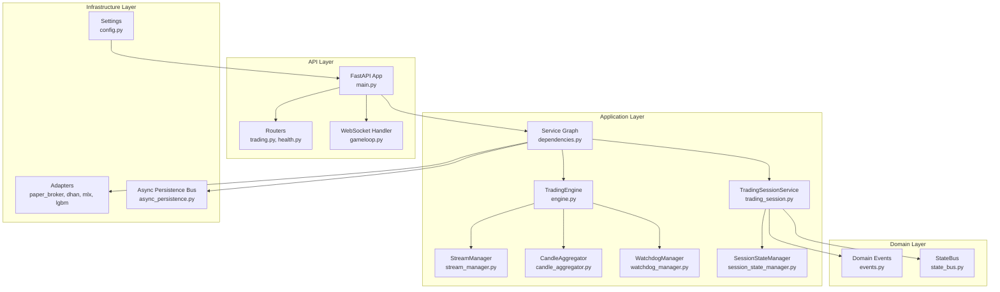
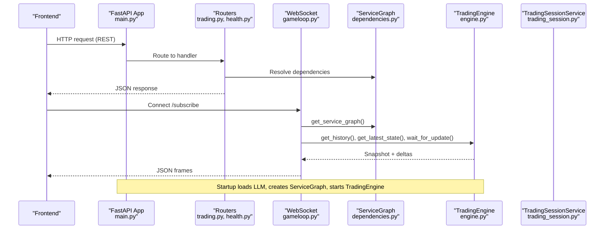
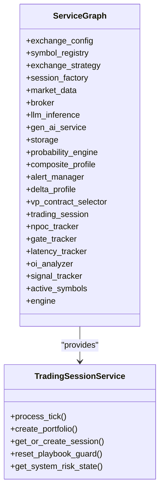
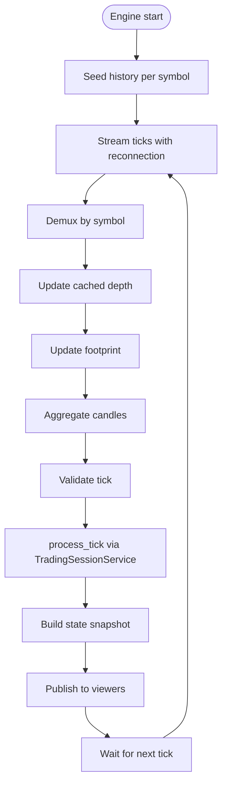
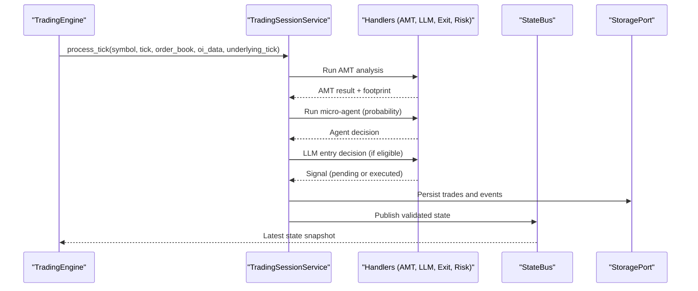
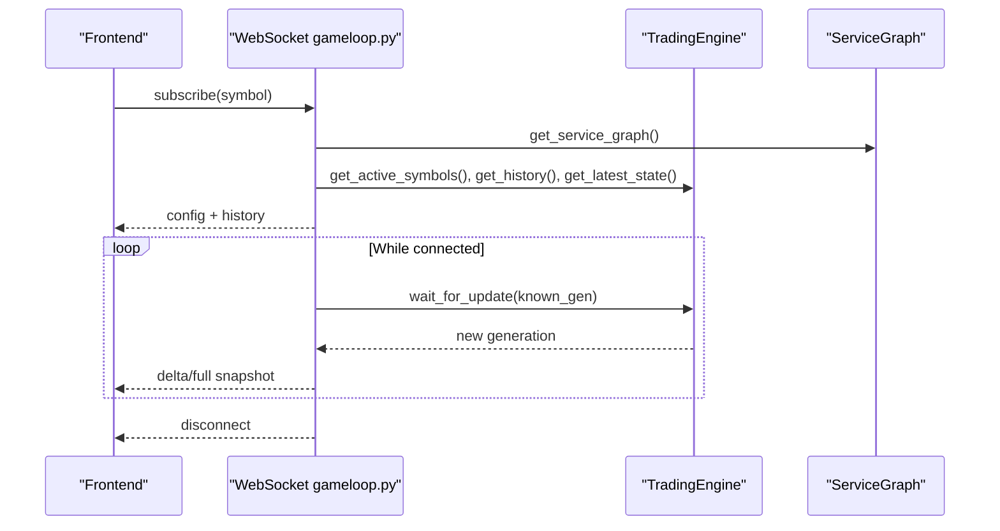
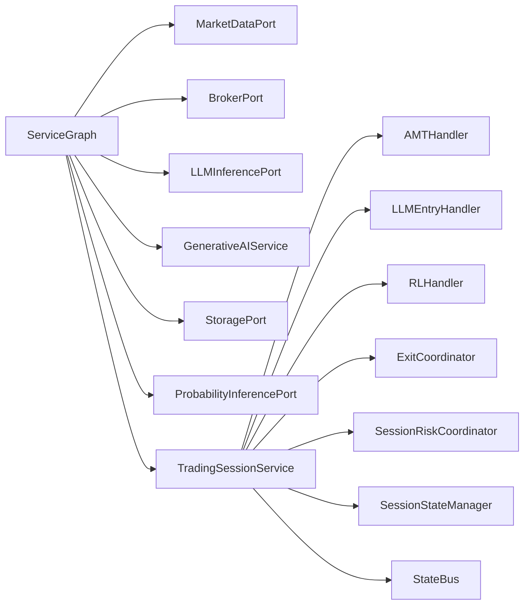

# Backend Application

<cite>
**Referenced Files in This Document**
- [backend/app/main.py](file://backend/app/main.py)
- [backend/app/config.py](file://backend/app/config.py)
- [backend/app/api/dependencies.py](file://backend/app/api/dependencies.py)
- [backend/app/application/engine.py](file://backend/app/application/engine.py)
- [backend/app/application/stream_manager.py](file://backend/app/application/stream_manager.py)
- [backend/app/application/candle_aggregator.py](file://backend/app/application/candle_aggregator.py)
- [backend/app/application/watchdog_manager.py](file://backend/app/application/watchdog_manager.py)
- [backend/app/application/services/trading_session.py](file://backend/app/application/services/trading_session.py)
- [backend/app/application/services/session_state_manager.py](file://backend/app/application/services/session_state_manager.py)
- [backend/app/domain/services/state_bus.py](file://backend/app/domain/services/state_bus.py)
- [backend/app/domain/trading/events.py](file://backend/app/domain/trading/events.py)
- [backend/app/api/routers/trading.py](file://backend/app/api/routers/trading.py)
- [backend/app/api/routers/health.py](file://backend/app/api/routers/health.py)
- [backend/app/api/websocket/gameloop.py](file://backend/app/api/websocket/gameloop.py)
- [backend/app/application/utils.py](file://backend/app/application/utils.py)
</cite>

## Table of Contents
1. [Introduction](#introduction)
2. [Project Structure](#project-structure)
3. [Core Components](#core-components)
4. [Architecture Overview](#architecture-overview)
5. [Detailed Component Analysis](#detailed-component-analysis)
6. [Dependency Analysis](#dependency-analysis)
7. [Performance Considerations](#performance-considerations)
8. [Troubleshooting Guide](#troubleshooting-guide)
9. [Conclusion](#conclusion)
10. [Appendices](#appendices)

## Introduction
This document describes the GlassyTrade AI backend application, a production-grade, domain-driven, event-synchronous trading system built on FastAPI. It explains the service graph creation and dependency injection patterns, the TradingEngine and event-driven processing pipeline, and the session management system. It also covers API endpoints, WebSocket connections, real-time data processing, service lifecycle, startup/shutdown procedures, and error handling strategies. Terminology aligns with the codebase, including TradingEngine, TradingSessionService, and StateBus.

## Project Structure
The backend is organized around a layered architecture:
- Application layer: orchestration of engines, managers, and services
- Domain layer: trading models, events, and services
- Infrastructure layer: adapters, storage, and external integrations
- API layer: FastAPI routers and WebSocket handlers
- Config layer: environment-driven settings and consolidated configuration

**Diagram sources**
- [backend/app/main.py:171-227](file://backend/app/main.py#L171-L227)
- [backend/app/api/dependencies.py:43-327](file://backend/app/api/dependencies.py#L43-L327)
- [backend/app/application/engine.py:59-126](file://backend/app/application/engine.py#L59-L126)
- [backend/app/application/stream_manager.py:32-47](file://backend/app/application/stream_manager.py#L32-L47)
- [backend/app/application/candle_aggregator.py:73-86](file://backend/app/application/candle_aggregator.py#L73-L86)
- [backend/app/application/watchdog_manager.py:34-62](file://backend/app/application/watchdog_manager.py#L34-L62)
- [backend/app/application/services/trading_session.py:85-122](file://backend/app/application/services/trading_session.py#L85-L122)
- [backend/app/application/services/session_state_manager.py:100-116](file://backend/app/application/services/session_state_manager.py#L100-L116)
- [backend/app/domain/trading/events.py:39-78](file://backend/app/domain/trading/events.py#L39-L78)
- [backend/app/domain/services/state_bus.py:45-62](file://backend/app/domain/services/state_bus.py#L45-L62)
- [backend/app/config.py:26-157](file://backend/app/config.py#L26-L157)

**Section sources**
- [backend/app/main.py:1-227](file://backend/app/main.py#L1-L227)
- [backend/app/config.py:1-157](file://backend/app/config.py#L1-L157)

## Core Components
- FastAPI application entry and lifecycle:
  - Structured JSON logging, CORS, rate limiting, and router mounting
  - Startup: builds the service graph, validates LLM readiness, starts TradingEngine, injects engine reference into overseer handler
  - Shutdown: stops engine, flushes pending ticks, shuts down handler thread pools, disconnects market data
- Service Graph (DI container):
  - Singleton ServiceGraph created once at startup
  - Provides adapters (market data, broker, LLM, probability), session factory, storage, scanners, trackers
  - Active symbols initialized via scanners and configured defaults
- TradingEngine:
  - Independent trading loop that streams market data, aggregates candles, runs the pipeline, and exposes state snapshots
  - Manages per-symbol state, notifies WebSocket viewers, and supports immediate update triggers
- TradingSessionService:
  - Orchestrates the event-driven pipeline: AMT analysis, LLM entry decisions, risk coordination, lifecycle, exits, and event logging
  - Coordinates handlers and services, manages per-symbol session state, and enforces structural guards
- StreamManager:
  - Dual-stream (full + depth) and polling fallback for MCX options; robust reconnection and staleness detection
- CandleAggregator:
  - Tick-to-candle aggregation with volume, VWAP, delta, and footprint accumulation
- WatchdogManager:
  - SL/TP watchdog independent of stream, stale stream detection, periodic GC
- StateBus:
  - Central validation middleware for state updates with anomaly detection and domain invariants
- SessionStateManager:
  - Per-symbol state with thread-safety, playbook guard, explainability tracking, and session eviction

**Section sources**
- [backend/app/main.py:83-176](file://backend/app/main.py#L83-L176)
- [backend/app/api/dependencies.py:43-327](file://backend/app/api/dependencies.py#L43-L327)
- [backend/app/application/engine.py:59-208](file://backend/app/application/engine.py#L59-L208)
- [backend/app/application/services/trading_session.py:85-229](file://backend/app/application/services/trading_session.py#L85-L229)
- [backend/app/application/stream_manager.py:32-134](file://backend/app/application/stream_manager.py#L32-L134)
- [backend/app/application/candle_aggregator.py:73-125](file://backend/app/application/candle_aggregator.py#L73-L125)
- [backend/app/application/watchdog_manager.py:34-62](file://backend/app/application/watchdog_manager.py#L34-L62)
- [backend/app/domain/services/state_bus.py:45-147](file://backend/app/domain/services/state_bus.py#L45-L147)
- [backend/app/application/services/session_state_manager.py:100-167](file://backend/app/application/services/session_state_manager.py#L100-L167)

## Architecture Overview
GlassyTrade AI follows a DDD/event-driven architecture:
- Domain events define immutable facts (e.g., TickReceived, SignalGenerated, FillReceived)
- TradingSessionService subscribes to and reacts to events, invoking specialized handlers
- StateBus validates state updates and records anomalies
- TradingEngine orchestrates streaming, aggregation, and state publication
- FastAPI routes expose REST endpoints and WebSocket for real-time viewer updates

**Diagram sources**
- [backend/app/main.py:83-176](file://backend/app/main.py#L83-L176)
- [backend/app/api/routers/trading.py:1-100](file://backend/app/api/routers/trading.py#L1-L100)
- [backend/app/api/routers/health.py:26-78](file://backend/app/api/routers/health.py#L26-L78)
- [backend/app/api/websocket/gameloop.py:112-196](file://backend/app/api/websocket/gameloop.py#L112-L196)
- [backend/app/api/dependencies.py:324-384](file://backend/app/api/dependencies.py#L324-L384)
- [backend/app/application/engine.py:209-262](file://backend/app/application/engine.py#L209-L262)

## Detailed Component Analysis

### Service Graph and Dependency Injection
- ServiceGraph is a singleton created at startup via get_service_graph()
- It wires adapters, storage, AI services, scanners, and trackers
- TradingSessionService is constructed with broker, gen AI service, storage, and optional components
- Active symbols are auto-selected via scanners and stored in the graph

**Diagram sources**
- [backend/app/api/dependencies.py:43-327](file://backend/app/api/dependencies.py#L43-L327)
- [backend/app/application/services/trading_session.py:85-229](file://backend/app/application/services/trading_session.py#L85-L229)

**Section sources**
- [backend/app/api/dependencies.py:324-384](file://backend/app/api/dependencies.py#L324-L384)

### TradingEngine: Streaming, Aggregation, and State Publishing
- Starts/stops streaming and watchdog loops
- Seeds history from market data or DB, builds initial state snapshots
- Processes ticks: stream demux, depth caching, footprint accumulation, candle aggregation, dual-feed AMT analysis
- Throttles processing per symbol, publishes state snapshots, and notifies WebSocket viewers
- Supports immediate update triggers for cross-thread notifications

**Diagram sources**
- [backend/app/application/engine.py:131-208](file://backend/app/application/engine.py#L131-L208)
- [backend/app/application/engine.py:620-800](file://backend/app/application/engine.py#L620-L800)
- [backend/app/application/candle_aggregator.py:114-256](file://backend/app/application/candle_aggregator.py#L114-L256)
- [backend/app/application/stream_manager.py:135-294](file://backend/app/application/stream_manager.py#L135-L294)

**Section sources**
- [backend/app/application/engine.py:131-276](file://backend/app/application/engine.py#L131-L276)
- [backend/app/application/engine.py:372-426](file://backend/app/application/engine.py#L372-L426)
- [backend/app/application/engine.py:620-800](file://backend/app/application/engine.py#L620-L800)

### Event-Driven Pipeline and Session Management
- TradingSessionService coordinates the pipeline:
  - AMT analysis with dual feed (option premium or underlying futures)
  - Micro-agent (LightGBM) probability inference
  - LLM entry decisions and overseer supervision
  - Risk coordination and lifecycle management
  - Exit coordinator and post-trade analysis
- SessionStateManager maintains per-symbol state, thread-safety, playbook guard, and explainability metrics
- StateBus validates state updates and records anomalies

**Diagram sources**
- [backend/app/application/services/trading_session.py:233-417](file://backend/app/application/services/trading_session.py#L233-L417)
- [backend/app/domain/services/state_bus.py:82-143](file://backend/app/domain/services/state_bus.py#L82-L143)
- [backend/app/domain/trading/events.py:62-78](file://backend/app/domain/trading/events.py#L62-L78)

**Section sources**
- [backend/app/application/services/trading_session.py:233-417](file://backend/app/application/services/trading_session.py#L233-L417)
- [backend/app/application/services/session_state_manager.py:117-167](file://backend/app/application/services/session_state_manager.py#L117-L167)
- [backend/app/domain/services/state_bus.py:82-147](file://backend/app/domain/services/state_bus.py#L82-L147)

### WebSocket Real-Time Viewer and Server-Driven Mode
- WebSocket handler accepts connections and enters server-driven mode
- Sends configuration, history, and full snapshots for all active symbols
- Streams deltas based on generation counters; includes keepalive pongs
- Graceful disconnect handling and error logging

**Diagram sources**
- [backend/app/api/websocket/gameloop.py:198-337](file://backend/app/api/websocket/gameloop.py#L198-L337)

**Section sources**
- [backend/app/api/websocket/gameloop.py:112-196](file://backend/app/api/websocket/gameloop.py#L112-L196)
- [backend/app/api/websocket/gameloop.py:198-337](file://backend/app/api/websocket/gameloop.py#L198-L337)

### API Endpoints and Practical Examples
- REST endpoints:
  - POST /api/trading/portfolio/create: Creates a default portfolio via TradingSessionService
  - POST /api/trading/stats: Computes stats from a list of closed trades
  - GET /api/trading/positions/events: Retrieves position lifecycle events
  - GET /api/trading/positions/{position_id}/lifecycle: Builds a lifecycle summary for a position
- Health and system endpoints:
  - GET /api/health: Checks database, LLM, and probability engine readiness
  - GET /api/v1/metrics: Returns pipeline metrics
  - POST /api/system/halt and /resume: Emergency controls
  - GET /api/system/risk-state: Returns current risk manager state
  - GET /api/system/config: Returns backend configuration for frontend
  - POST /api/scanner/rescan: Triggers a fresh option scan and updates active symbols
  - GET /api/debug/memory: Returns memory and GC stats

Practical usage examples (paths only):
- Create portfolio: POST /api/trading/portfolio/create
- Compute stats: POST /api/trading/stats with StatsRequestDTO payload
- View position lifecycle: GET /api/trading/positions/{position_id}/lifecycle
- Health check: GET /api/health
- System halt: POST /api/system/halt
- Scanner rescan: POST /api/scanner/rescan

**Section sources**
- [backend/app/api/routers/trading.py:42-100](file://backend/app/api/routers/trading.py#L42-L100)
- [backend/app/api/routers/health.py:26-78](file://backend/app/api/routers/health.py#L26-L78)
- [backend/app/api/routers/health.py:81-246](file://backend/app/api/routers/health.py#L81-L246)

## Dependency Analysis
- Coupling and cohesion:
  - ServiceGraph centralizes construction and wiring; high cohesion within modules
  - TradingSessionService depends on handlers and services; clear separation of concerns
  - StateBus decouples validation from producers/consumers
- External dependencies:
  - Adapters for market data (Dhan), broker (Paper), LLM (MLX), and probability (LightGBM)
  - Async persistence bus for storage writes
- Potential circular dependencies:
  - None observed; handlers are injected into TradingSessionService rather than importing it

**Diagram sources**
- [backend/app/api/dependencies.py:90-160](file://backend/app/api/dependencies.py#L90-L160)
- [backend/app/application/services/trading_session.py:137-198](file://backend/app/application/services/trading_session.py#L137-L198)
- [backend/app/domain/services/state_bus.py:45-62](file://backend/app/domain/services/state_bus.py#L45-L62)

**Section sources**
- [backend/app/api/dependencies.py:90-160](file://backend/app/api/dependencies.py#L90-L160)
- [backend/app/application/services/trading_session.py:137-198](file://backend/app/application/services/trading_session.py#L137-L198)

## Performance Considerations
- Throttling and batching:
  - TradingEngine throttles process_tick to once per 500 ms per symbol
  - WebSocket delta compression reduces bandwidth and CPU
- Memory management:
  - SessionStateManager evicts idle sessions and caps candle history per symbol
  - WatchdogManager periodically runs garbage collection
- Streaming resilience:
  - StreamManager switches to polling fallback for symbols without WebSocket data
  - Stale-stream watchdog cancels stuck tasks and triggers reconnection
- Asynchronous persistence:
  - AsyncPersistenceBus offloads storage writes to background threads

[No sources needed since this section provides general guidance]

## Troubleshooting Guide
- Startup failures:
  - LLM model readiness and validation logs; backend proceeds even if LLM fails to validate
  - Engine start/stop exceptions are caught and logged
- Runtime errors:
  - WebSocket send failures, JSON decode errors, and OS errors are handled with graceful closures
  - WatchdogManager logs SL/TP enforcement and stale stream detection
- Health checks:
  - Database readiness, LLM status, and probability engine readiness are reported
- Session state:
  - Playbook guard and explainability metrics help diagnose structural guard tripping
  - SessionStateManager provides reset utilities for guards and explainability

**Section sources**
- [backend/app/main.py:88-126](file://backend/app/main.py#L88-L126)
- [backend/app/api/websocket/gameloop.py:174-196](file://backend/app/api/websocket/gameloop.py#L174-L196)
- [backend/app/application/watchdog_manager.py:63-128](file://backend/app/application/watchdog_manager.py#L63-L128)
- [backend/app/api/routers/health.py:26-78](file://backend/app/api/routers/health.py#L26-L78)
- [backend/app/application/services/session_state_manager.py:366-393](file://backend/app/application/services/session_state_manager.py#L366-L393)

## Conclusion
GlassyTrade AI’s backend is a robust, event-driven system centered on TradingEngine and TradingSessionService. The ServiceGraph ensures clean dependency injection and modular composition. The WebSocket viewer operates independently of trading, and the StateBus enforces data integrity. With comprehensive health checks, watchdogs, and resilient streaming, the system balances performance and reliability for live trading.

[No sources needed since this section summarizes without analyzing specific files]

## Appendices

### Service Lifecycle and Startup/Shutdown
- Startup:
  - Create ServiceGraph and LLM readiness check
  - Validate LLM with a test inference
  - Instantiate TradingEngine and inject into overseer handler
  - Start engine tasks and await readiness
- Shutdown:
  - Stop engine, flush pending ticks, shut down handler thread pools, disconnect market data

**Section sources**
- [backend/app/main.py:83-176](file://backend/app/main.py#L83-L176)

### Real-Time Data Processing Highlights
- StreamManager dual-stream and polling fallback
- CandleAggregator with volume, VWAP, delta, and footprint
- StateBus validation and anomaly recording
- SessionStateManager runtime QA (playbook guard, explainability)

**Section sources**
- [backend/app/application/stream_manager.py:135-294](file://backend/app/application/stream_manager.py#L135-L294)
- [backend/app/application/candle_aggregator.py:114-324](file://backend/app/application/candle_aggregator.py#L114-L324)
- [backend/app/domain/services/state_bus.py:82-247](file://backend/app/domain/services/state_bus.py#L82-L247)
- [backend/app/application/services/session_state_manager.py:296-364](file://backend/app/application/services/session_state_manager.py#L296-L364)