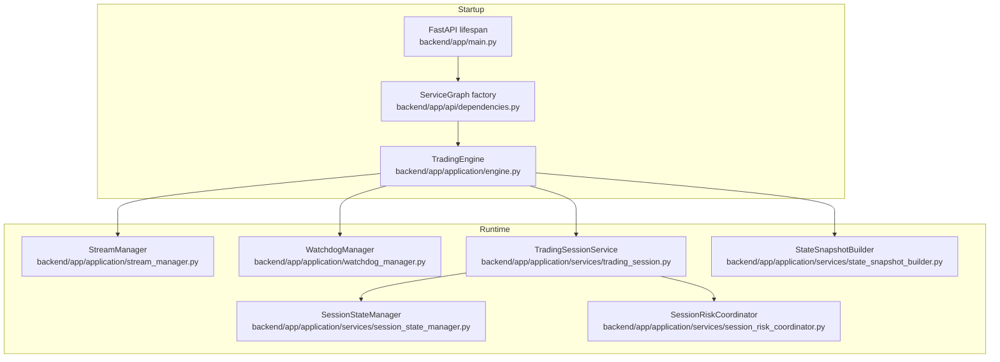
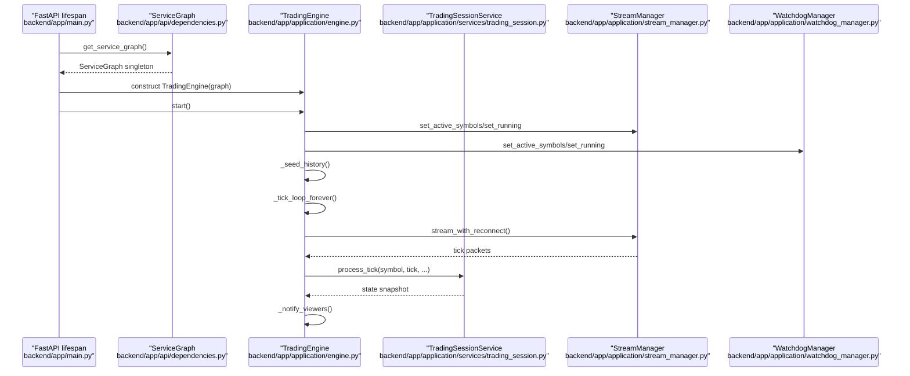
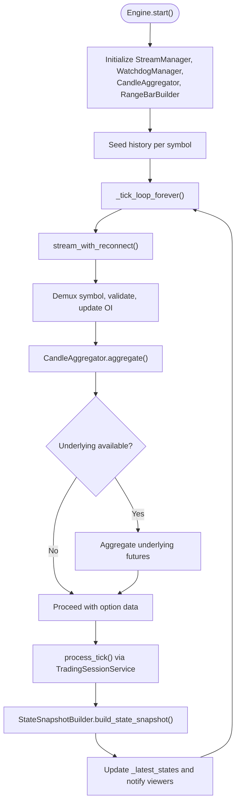
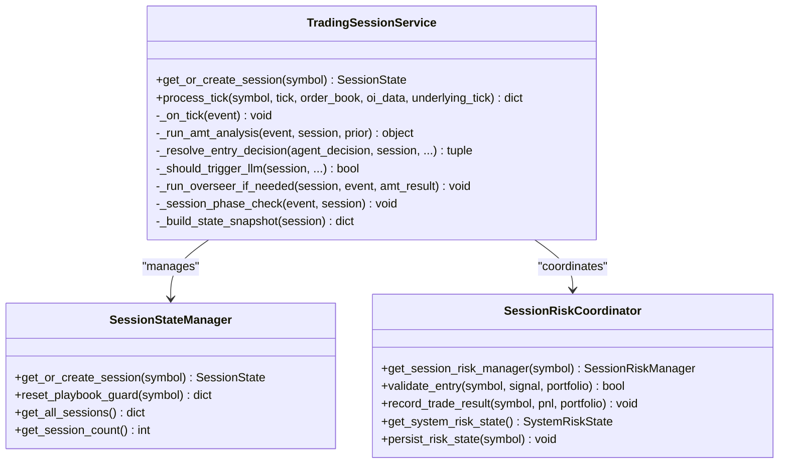
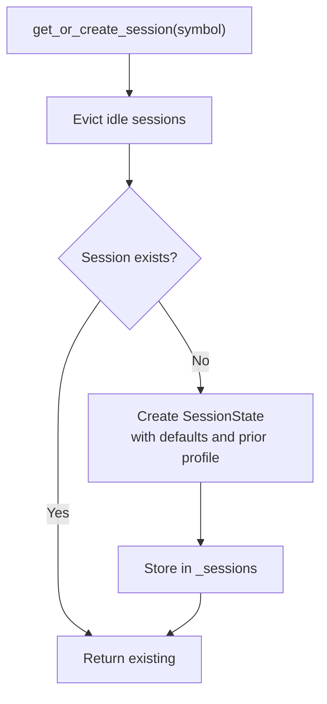
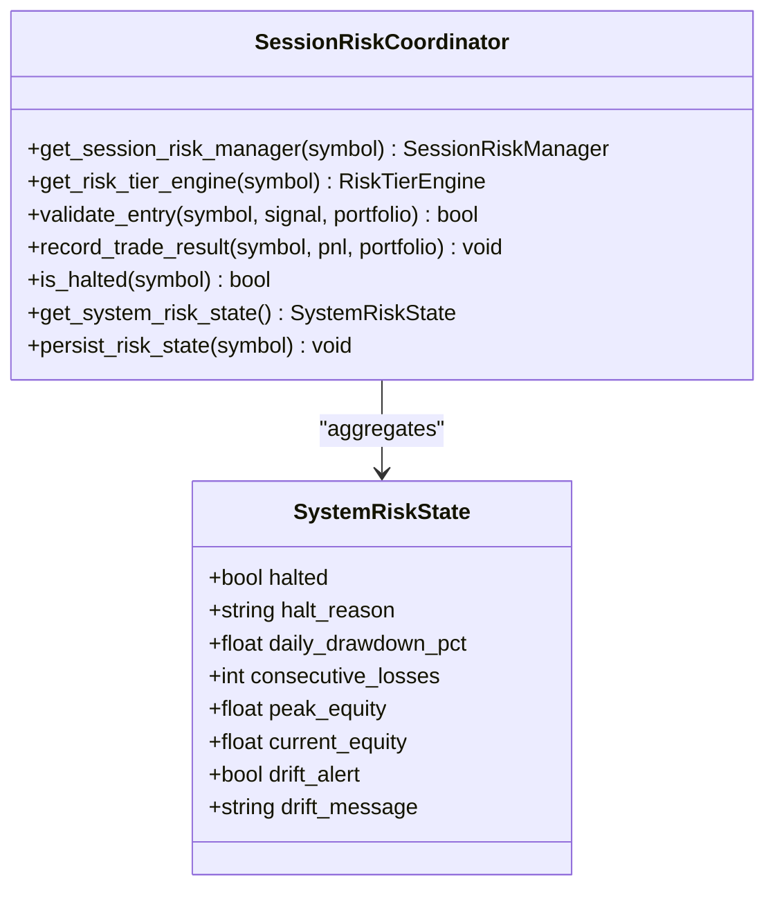
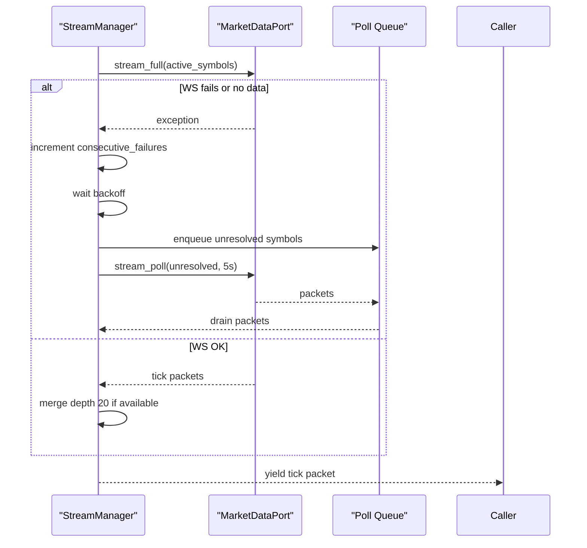
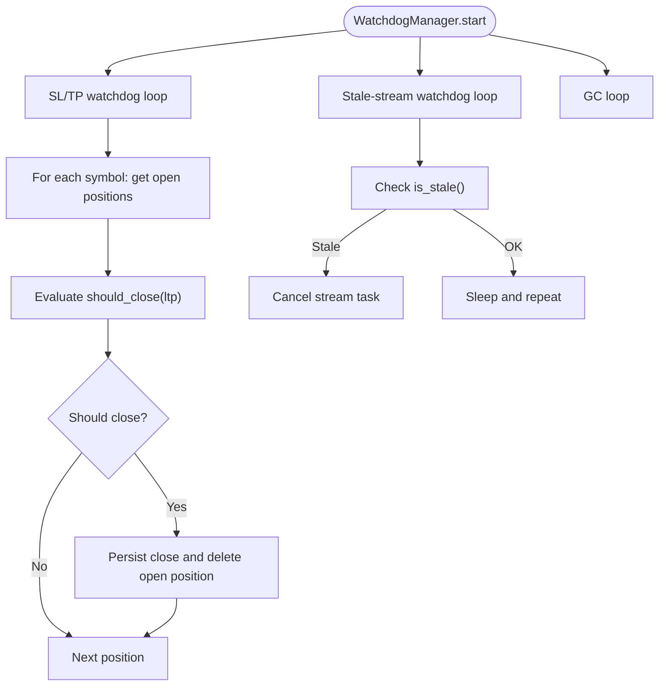
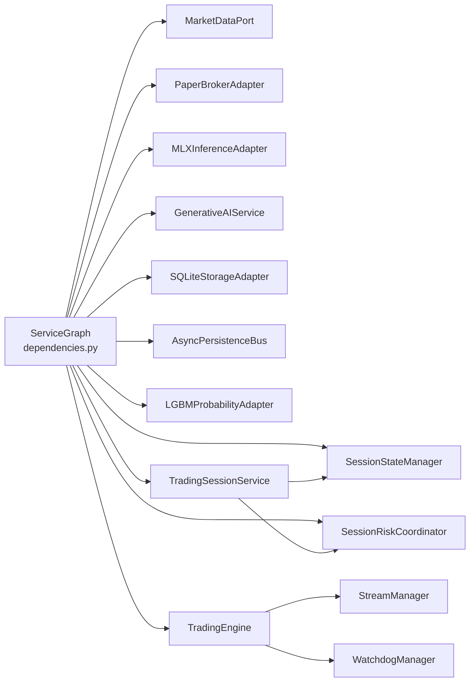

# Core Services

<cite>
**Referenced Files in This Document**
- [main.py](file://backend/app/main.py)
- [dependencies.py](file://backend/app/api/dependencies.py)
- [engine.py](file://backend/app/application/engine.py)
- [stream_manager.py](file://backend/app/application/stream_manager.py)
- [watchdog_manager.py](file://backend/app/application/watchdog_manager.py)
- [trading_session.py](file://backend/app/application/services/trading_session.py)
- [session_state_manager.py](file://backend/app/application/services/session_state_manager.py)
- [session_risk_coordinator.py](file://backend/app/application/services/session_risk_coordinator.py)
- [state_snapshot_builder.py](file://backend/app/application/services/state_snapshot_builder.py)
- [config.py](file://backend/app/config.py)
- [utils.py](file://backend/app/application/utils.py)
</cite>

## Table of Contents
1. [Introduction](#introduction)
2. [Project Structure](#project-structure)
3. [Core Components](#core-components)
4. [Architecture Overview](#architecture-overview)
5. [Detailed Component Analysis](#detailed-component-analysis)
6. [Dependency Analysis](#dependency-analysis)
7. [Performance Considerations](#performance-considerations)
8. [Troubleshooting Guide](#troubleshooting-guide)
9. [Conclusion](#conclusion)

## Introduction
This document explains the GlassyTrade AI core services layer with a focus on the standalone TradingEngine, the TradingSessionService for event coordination and state management, the SessionStateManager for persistent trading state, the SessionRiskCoordinator for circuit breaker logic and risk controls, and the StreamManager for real-time data streams and WebSocket connections. It also covers service lifecycle management, startup/shutdown procedures, error handling strategies, and the service graph creation pattern with dependency injection.

## Project Structure
The core services reside under backend/app/application and are wired by a singleton ServiceGraph created at startup. The FastAPI lifespan hook initializes the service graph, loads the LLM model, starts the TradingEngine, and coordinates graceful shutdown.

**Diagram sources**
- [main.py:83-176](file://backend/app/main.py#L83-L176)
- [dependencies.py:43-327](file://backend/app/api/dependencies.py#L43-L327)
- [engine.py:59-126](file://backend/app/application/engine.py#L59-L126)
- [stream_manager.py:32-47](file://backend/app/application/stream_manager.py#L32-L47)
- [watchdog_manager.py:34-62](file://backend/app/application/watchdog_manager.py#L34-L62)
- [trading_session.py:85-229](file://backend/app/application/services/trading_session.py#L85-L229)
- [session_state_manager.py:100-116](file://backend/app/application/services/session_state_manager.py#L100-L116)
- [session_risk_coordinator.py:43-71](file://backend/app/application/services/session_risk_coordinator.py#L43-L71)
- [state_snapshot_builder.py:22-72](file://backend/app/application/services/state_snapshot_builder.py#L22-L72)

**Section sources**
- [main.py:83-176](file://backend/app/main.py#L83-L176)
- [dependencies.py:43-327](file://backend/app/api/dependencies.py#L43-L327)

## Core Components
- TradingEngine: Standalone trading loop that streams market data, aggregates candles, and orchestrates the full pipeline independently of frontend connections. It exposes read-only state for WebSocket viewers and supports immediate state updates triggered from background threads.
- TradingSessionService: Event-driven coordinator that manages per-symbol state, wires handlers, and delegates to specialized modules for AMT analysis, risk, lifecycle, and logging.
- SessionStateManager: Persistent per-symbol state management with session creation, eviction, playbook guard, and explainability tracking.
- SessionRiskCoordinator: Circuit breaker and risk control integration with per-symbol and session risk managers, optional RiskTierEngine, and system-wide risk aggregation.
- StreamManager: Real-time market data streaming with dual-stream support (full + depth), reconnection logic, polling fallback for MCX options, and staleness detection.
- WatchdogManager: Independent SL/TP watchdog, stale stream detection/recovery, and periodic garbage collection.

**Section sources**
- [engine.py:59-126](file://backend/app/application/engine.py#L59-L126)
- [trading_session.py:85-229](file://backend/app/application/services/trading_session.py#L85-L229)
- [session_state_manager.py:100-116](file://backend/app/application/services/session_state_manager.py#L100-L116)
- [session_risk_coordinator.py:43-71](file://backend/app/application/services/session_risk_coordinator.py#L43-L71)
- [stream_manager.py:32-47](file://backend/app/application/stream_manager.py#L32-L47)
- [watchdog_manager.py:34-62](file://backend/app/application/watchdog_manager.py#L34-L62)

## Architecture Overview
The system follows a service-graph pattern with a singleton ServiceGraph created at startup. The TradingEngine is started in the FastAPI lifespan and runs independently of frontend WebSocket connections. The TradingSessionService coordinates event-driven processing per symbol, delegating to specialized modules. The StreamManager and WatchdogManager provide resilient streaming and safety nets.

**Diagram sources**
- [main.py:83-176](file://backend/app/main.py#L83-L176)
- [dependencies.py:324-327](file://backend/app/api/dependencies.py#L324-L327)
- [engine.py:131-177](file://backend/app/application/engine.py#L131-L177)
- [stream_manager.py:135-294](file://backend/app/application/stream_manager.py#L135-L294)
- [watchdog_manager.py:63-198](file://backend/app/application/watchdog_manager.py#L63-L198)
- [trading_session.py:233-417](file://backend/app/application/services/trading_session.py#L233-L417)

## Detailed Component Analysis

### TradingEngine
- Purpose: Standalone trading loop that streams market data, aggregates candles, and runs the full pipeline. It maintains latest state snapshots per symbol and notifies WebSocket viewers.
- Lifecycle:
  - start(): Initializes delegated modules, seeds history, and starts streaming and watchdog tasks.
  - stop(): Cancels all tasks and performs cleanup.
  - get_latest_state()/wait_for_update(): Read-only access for WebSocket viewers with generation-based change notifications.
  - trigger_immediate_update(): Thread-safe immediate state rebuild and notification for cross-thread triggers (e.g., overseer).
- Data flows:
  - StreamManager produces tick packets.
  - CandleAggregator validates and aggregates OHLC.
  - Underlying futures are optionally aggregated for AMT analysis.
  - TradingSessionService.process_tick executes the event-driven pipeline.
  - StateSnapshotBuilder formats state for UI consumption.
  - Latest state is published to viewers via generation increment and condition notify.
- Resilience:
  - Per-entity circuit breaker to isolate failing symbols.
  - Market-hours gating to avoid processing outside trading windows.
  - Mid-trade recovery on startup by loading open positions from storage.

**Diagram sources**
- [engine.py:131-177](file://backend/app/application/engine.py#L131-L177)
- [engine.py:620-857](file://backend/app/application/engine.py#L620-L857)
- [stream_manager.py:135-294](file://backend/app/application/stream_manager.py#L135-L294)
- [state_snapshot_builder.py:22-72](file://backend/app/application/services/state_snapshot_builder.py#L22-L72)

**Section sources**
- [engine.py:59-126](file://backend/app/application/engine.py#L59-L126)
- [engine.py:131-208](file://backend/app/application/engine.py#L131-L208)
- [engine.py:209-276](file://backend/app/application/engine.py#L209-L276)
- [engine.py:281-358](file://backend/app/application/engine.py#L281-L358)
- [engine.py:372-426](file://backend/app/application/engine.py#L372-L426)
- [engine.py:431-576](file://backend/app/application/engine.py#L431-L576)
- [engine.py:620-857](file://backend/app/application/engine.py#L620-L857)
- [engine.py:867-911](file://backend/app/application/engine.py#L867-L911)
- [engine.py:916-933](file://backend/app/application/engine.py#L916-L933)
- [engine.py:934-981](file://backend/app/application/engine.py#L934-L981)

### TradingSessionService
- Purpose: Event-driven coordinator for per-symbol state, wiring AMT analysis, lifecycle, LLM entry decisions, RL status, session state, risk management, and event logging.
- Responsibilities:
  - Session creation and retrieval via SessionStateManager.
  - Tick processing with portfolio updates, closed-position handling, and trade persistence.
  - Entry/exit coordination via EntryCoordinator and ExitCoordinator.
  - Risk integration via SessionRiskCoordinator.
  - State snapshot building via StateSnapshotBuilder.
  - Session-phase gating and forced exits near market close.
- Key behaviors:
  - Limits candle history per symbol to bound memory.
  - Drains pending signals from worker threads on the main thread.
  - Saves closed candles and performance snapshots to storage.
  - Tracks position consistency and reconciles mismatches.

**Diagram sources**
- [trading_session.py:85-229](file://backend/app/application/services/trading_session.py#L85-L229)
- [session_state_manager.py:100-116](file://backend/app/application/services/session_state_manager.py#L100-L116)
- [session_risk_coordinator.py:43-71](file://backend/app/application/services/session_risk_coordinator.py#L43-L71)

**Section sources**
- [trading_session.py:85-229](file://backend/app/application/services/trading_session.py#L85-L229)
- [trading_session.py:233-417](file://backend/app/application/services/trading_session.py#L233-L417)
- [trading_session.py:461-517](file://backend/app/application/services/trading_session.py#L461-L517)
- [trading_session.py:519-655](file://backend/app/application/services/trading_session.py#L519-L655)
- [trading_session.py:656-707](file://backend/app/application/services/trading_session.py#L656-L707)
- [trading_session.py:709-786](file://backend/app/application/services/trading_session.py#L709-L786)
- [trading_session.py:787-800](file://backend/app/application/services/trading_session.py#L787-L800)

### SessionStateManager
- Purpose: Manage per-symbol session state, persistence, cleanup, playbook guard, and explainability tracking.
- Features:
  - Session creation with prior session profile loading and structural level persistence.
  - Idle session eviction to prevent unbounded memory growth.
  - Playbook guard rejections and explainability metrics with daily reset.
  - Thread-safe access via RLock for portfolio and throttling flags.

**Diagram sources**
- [session_state_manager.py:117-166](file://backend/app/application/services/session_state_manager.py#L117-L166)
- [session_state_manager.py:168-186](file://backend/app/application/services/session_state_manager.py#L168-L186)

**Section sources**
- [session_state_manager.py:100-116](file://backend/app/application/services/session_state_manager.py#L100-L116)
- [session_state_manager.py:117-166](file://backend/app/application/services/session_state_manager.py#L117-L166)
- [session_state_manager.py:168-186](file://backend/app/application/services/session_state_manager.py#L168-L186)
- [session_state_manager.py:215-364](file://backend/app/application/services/session_state_manager.py#L215-L364)
- [session_state_manager.py:366-410](file://backend/app/application/services/session_state_manager.py#L366-L410)

### SessionRiskCoordinator
- Purpose: Coordinate session-level risk management with circuit breakers, risk-tier engines, and system-wide risk aggregation.
- Responsibilities:
  - Per-symbol and session risk managers with persistence and restoration.
  - Optional RiskTierEngine activation with premium checks.
  - Entry validation gates: confluence grade score, session circuit breaker, daily loss limits, and standard risk manager.
  - System risk state aggregation for control-plane visibility.

**Diagram sources**
- [session_risk_coordinator.py:43-71](file://backend/app/application/services/session_risk_coordinator.py#L43-L71)
- [session_risk_coordinator.py:254-314](file://backend/app/application/services/session_risk_coordinator.py#L254-L314)

**Section sources**
- [session_risk_coordinator.py:43-71](file://backend/app/application/services/session_risk_coordinator.py#L43-L71)
- [session_risk_coordinator.py:169-212](file://backend/app/application/services/session_risk_coordinator.py#L169-L212)
- [session_risk_coordinator.py:246-314](file://backend/app/application/services/session_risk_coordinator.py#L246-L314)
- [session_risk_coordinator.py:316-345](file://backend/app/application/services/session_risk_coordinator.py#L316-L345)

### StreamManager
- Purpose: Real-time market data streaming with reconnection, polling fallback, and stream health monitoring.
- Features:
  - Dual-stream support (full + depth 20) for NSE.
  - Polling fallback for symbols not delivered via WebSocket (e.g., MCX options).
  - Staleness detection and switching to polling after initial timeout.
  - Tick counting and last tick time tracking for health monitoring.

**Diagram sources**
- [stream_manager.py:135-294](file://backend/app/application/stream_manager.py#L135-L294)

**Section sources**
- [stream_manager.py:32-47](file://backend/app/application/stream_manager.py#L32-L47)
- [stream_manager.py:86-134](file://backend/app/application/stream_manager.py#L86-L134)
- [stream_manager.py:135-294](file://backend/app/application/stream_manager.py#L135-L294)
- [stream_manager.py:295-304](file://backend/app/application/stream_manager.py#L295-L304)

### WatchdogManager
- Purpose: Independent SL/TP watchdog, stale stream detection, and periodic garbage collection.
- Features:
  - SL/TP watchdog runs every second, evaluating open positions against cached LTP.
  - Stale-stream watchdog detects hung feeds and triggers reconnects or polling fallback.
  - GC loop runs periodically to prevent memory leaks.

**Diagram sources**
- [watchdog_manager.py:63-198](file://backend/app/application/watchdog_manager.py#L63-L198)

**Section sources**
- [watchdog_manager.py:34-62](file://backend/app/application/watchdog_manager.py#L34-L62)
- [watchdog_manager.py:63-128](file://backend/app/application/watchdog_manager.py#L63-L128)
- [watchdog_manager.py:130-175](file://backend/app/application/watchdog_manager.py#L130-L175)
- [watchdog_manager.py:177-198](file://backend/app/application/watchdog_manager.py#L177-L198)

### StateSnapshotBuilder
- Purpose: Pure DTO formatting for UI state snapshots, extracting portfolio, AMT, prediction, footprint, model weights, stats, agent decision, playbook guard, explainability monitor, RL status, and risk state.

**Section sources**
- [state_snapshot_builder.py:22-72](file://backend/app/application/services/state_snapshot_builder.py#L22-L72)
- [state_snapshot_builder.py:75-103](file://backend/app/application/services/state_snapshot_builder.py#L75-L103)
- [state_snapshot_builder.py:120-139](file://backend/app/application/services/state_snapshot_builder.py#L120-L139)
- [state_snapshot_builder.py:142-158](file://backend/app/application/services/state_snapshot_builder.py#L142-L158)
- [state_snapshot_builder.py:161-175](file://backend/app/application/services/state_snapshot_builder.py#L161-L175)

## Dependency Analysis
The ServiceGraph creates and wires all core services once at startup. FastAPI dependencies resolve from this singleton graph. The TradingEngine depends on StreamManager, WatchdogManager, CandleAggregator, RangeBarBuilder, and TradingSessionService. TradingSessionService depends on SessionStateManager, SessionRiskCoordinator, and various handlers/coordinators.

**Diagram sources**
- [dependencies.py:43-327](file://backend/app/api/dependencies.py#L43-L327)
- [engine.py:59-126](file://backend/app/application/engine.py#L59-L126)
- [trading_session.py:85-229](file://backend/app/application/services/trading_session.py#L85-L229)

**Section sources**
- [dependencies.py:43-327](file://backend/app/api/dependencies.py#L43-L327)
- [engine.py:59-126](file://backend/app/application/engine.py#L59-L126)
- [trading_session.py:85-229](file://backend/app/application/services/trading_session.py#L85-L229)

## Performance Considerations
- Throttling and batching:
  - TradingEngine throttles process_tick to approximately once per 500 ms per symbol to reduce CPU load.
  - Viewer notifications are throttled to 150 ms intervals with delayed notification scheduling.
- Memory management:
  - SessionStateManager evicts idle sessions after 24 hours with no open positions.
  - TradingSessionService caps candle history per symbol to bound memory.
  - WatchdogManager’s GC loop runs every 30 minutes to prevent leaks.
- Streaming resilience:
  - StreamManager switches to polling fallback for unresolved symbols and retries with exponential backoff.
  - WatchdogManager cancels stuck stream tasks and triggers reconnection.
- Persistence:
  - AsyncPersistenceBus batches storage writes to background thread to avoid blocking the main loop.

[No sources needed since this section provides general guidance]

## Troubleshooting Guide
- Startup and LLM readiness:
  - The lifespan waits for the LLM model to be ready and validates inference before marking the backend ready. Failures are logged and backend continues with limited capabilities.
- TradingEngine failures:
  - Per-entity circuit breaker isolates failing symbols; errors are logged and the loop continues.
  - Mid-trade recovery attempts to load open positions from storage on startup.
- Stream issues:
  - If no ticks arrive within the first 60 seconds, StreamManager switches to polling fallback.
  - Stale-stream watchdog cancels stream tasks and reconnects when streams are silent beyond configured thresholds.
- Risk halts:
  - SessionRiskCoordinator activates circuit breakers and daily loss limits; system-wide risk state is aggregated for control-plane visibility.
- Shutdown:
  - Engine stop cancels all tasks; storage flush and thread pool cleanup are attempted with defensive logging.

**Section sources**
- [main.py:83-176](file://backend/app/main.py#L83-L176)
- [engine.py:431-576](file://backend/app/application/engine.py#L431-L576)
- [engine.py:850-857](file://backend/app/application/engine.py#L850-L857)
- [stream_manager.py:86-134](file://backend/app/application/stream_manager.py#L86-L134)
- [watchdog_manager.py:130-175](file://backend/app/application/watchdog_manager.py#L130-L175)
- [session_risk_coordinator.py:169-212](file://backend/app/application/services/session_risk_coordinator.py#L169-L212)
- [session_risk_coordinator.py:246-314](file://backend/app/application/services/session_risk_coordinator.py#L246-L314)

## Conclusion
The GlassyTrade AI core services layer is built around a robust service-graph pattern with clear separation of concerns. The TradingEngine runs independently of frontend connections, ensuring continuous trading while the TradingSessionService coordinates event-driven processing and state management. SessionStateManager and SessionRiskCoordinator provide persistent state and risk controls, respectively, while StreamManager and WatchdogManager ensure resilient data ingestion and safety. The documented lifecycle, error handling, and dependency injection mechanisms enable reliable operation and maintainability.