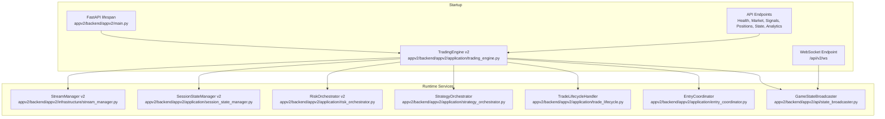
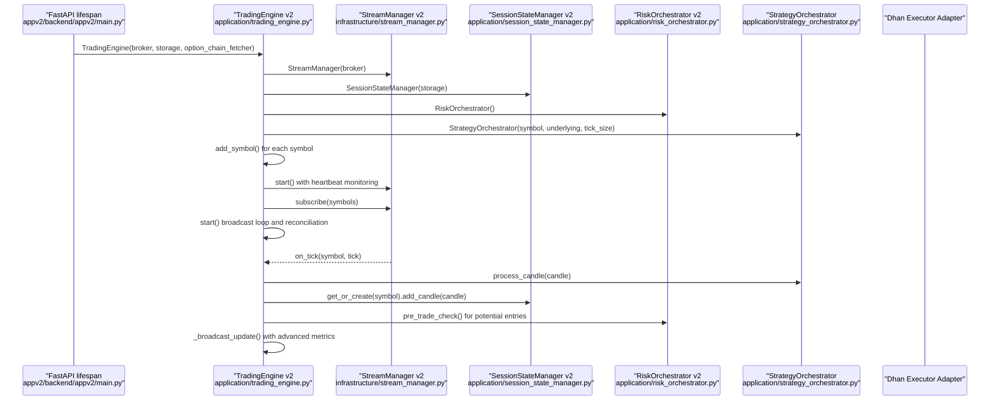
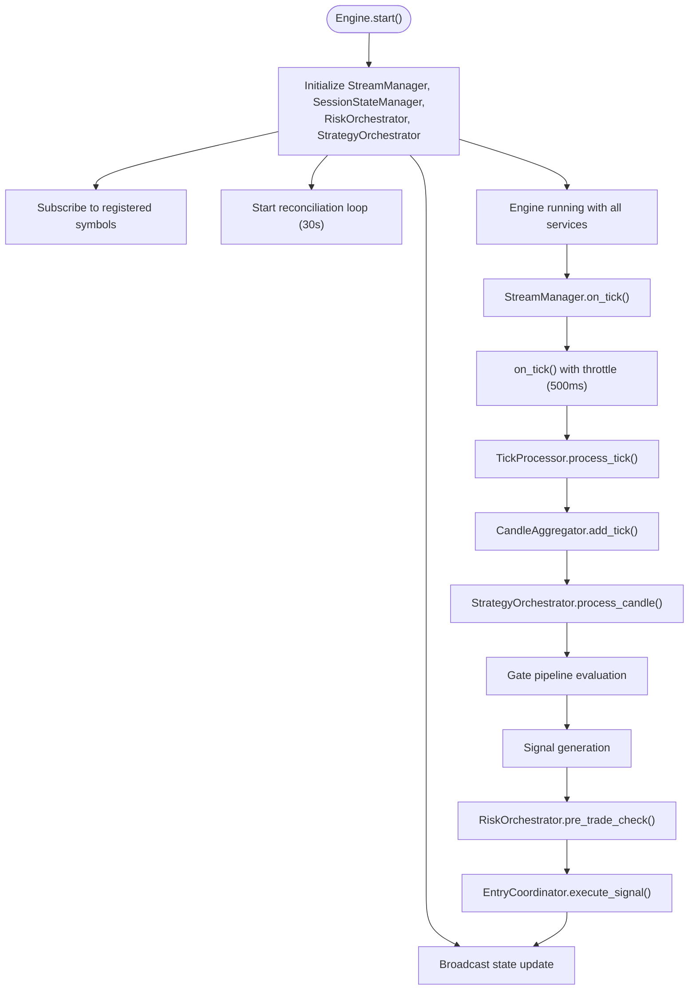
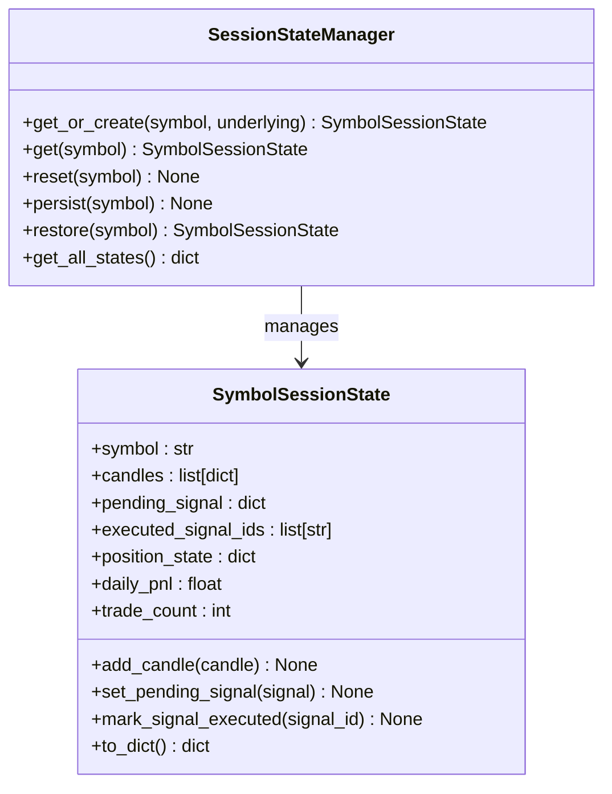
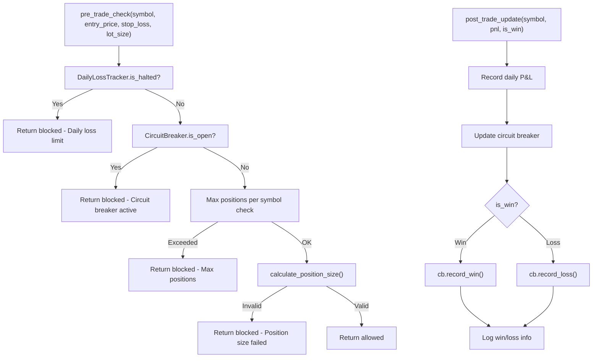
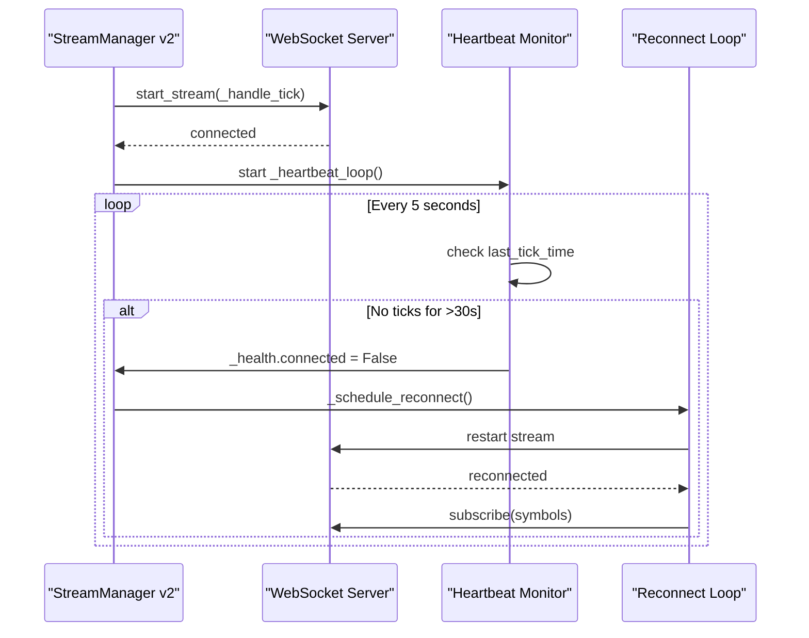
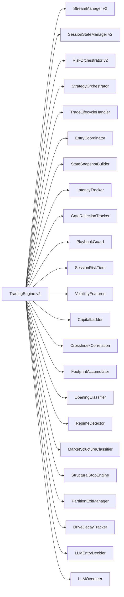

# Core Services

<cite>
**Referenced Files in This Document**
- [main.py](file://appv2/backend/appv2/main.py)
- [trading_engine.py](file://appv2/backend/appv2/application/trading_engine.py)
- [session_state_manager.py](file://appv2/backend/appv2/application/session_state_manager.py)
- [risk_orchestrator.py](file://appv2/backend/appv2/application/risk_orchestrator.py)
- [stream_manager.py](file://appv2/backend/appv2/infrastructure/stream_manager.py)
- [strategy_orchestrator.py](file://appv2/backend/appv2/application/strategy_orchestrator.py)
- [trade_lifecycle.py](file://appv2/backend/appv2/application/trade_lifecycle.py)
- [entry_coordinator.py](file://appv2/backend/appv2/application/entry_coordinator.py)
</cite>

## Update Summary
**Changes Made**
- Updated to reflect new appv2 core services architecture with TradingEngine v2, TradingSessionService v2, RiskCoordination v2, and StreamManagement v2
- Added comprehensive documentation for the new TradingEngine v2 with advanced AMT classification and Fabio-alignment features
- Documented the new SessionStateManager v2 with persistent state management and SQLite storage integration
- Updated RiskOrchestrator v2 with enhanced pre-trade checks and circuit breaker coordination
- Added StreamManager v2 with auto-reconnect, heartbeat monitoring, and emergency pause/resume functionality
- Enhanced service graph creation pattern with dependency injection mechanisms
- Updated service lifecycle management with startup/shutdown procedures and error handling strategies

## Table of Contents
1. [Introduction](#introduction)
2. [Project Structure](#project-structure)
3. [Core Components](#core-components)
4. [Architecture Overview](#architecture-overview)
5. [Detailed Component Analysis](#detailed-component-analysis)
6. [Dependency Analysis](#dependency-analysis)
7. [Performance Considerations](#performance-considerations)
8. [Troubleshooting Guide](#troubleshooting-guide)
9. [Conclusion](#conclusion)

## Introduction
This document explains the GlassyTrade AI core services layer with the new appv2 architecture featuring TradingEngine v2, TradingSessionService v2, RiskCoordination v2, and StreamManagement v2. The system focuses on a standalone TradingEngine v2 that streams market data, aggregates candles, and orchestrates the full pipeline independently of frontend connections. It includes advanced AMT classification, Fabio-alignment features, and comprehensive risk management with session state persistence and real-time data streaming with WebSocket connections.

## Project Structure
The core services reside under appv2/backend/appv2 and are organized into application services, infrastructure components, and domain models. The FastAPI lifespan hook initializes the TradingEngine v2, loads configuration, starts the trading loop, and coordinates graceful shutdown.

**Diagram sources**
- [main.py:25-90](file://appv2/backend/appv2/main.py#L25-L90)
- [trading_engine.py:77-185](file://appv2/backend/appv2/application/trading_engine.py#L77-L185)
- [stream_manager.py:33-154](file://appv2/backend/appv2/infrastructure/stream_manager.py#L33-L154)
- [session_state_manager.py:87-159](file://appv2/backend/appv2/application/session_state_manager.py#L87-L159)
- [risk_orchestrator.py:35-160](file://appv2/backend/appv2/application/risk_orchestrator.py#L35-L160)

**Section sources**
- [main.py:25-90](file://appv2/backend/appv2/main.py#L25-L90)
- [trading_engine.py:77-185](file://appv2/backend/appv2/application/trading_engine.py#L77-L185)

## Core Components

### TradingEngine v2
- **Purpose**: Complete live trading engine with ALL features from original backend plus advanced AMT classification, Fabio-alignment services, and comprehensive risk management
- **Key Features**:
  - Advanced AMT classification: Opening classifier, regime detector, market structure classifier
  - Fabio-alignment services: Session strategy selector, first breakout filter, IV rank tracker, gamma acceleration detector
  - Session-level services: Capital ladder, state snapshot builder, LLM adapters
  - Performance optimization: 500ms tick throttle, structural stop engine, partition exit manager
  - Real-time monitoring: Latency tracker, gate rejection tracker, drive decay tracker
  - Comprehensive broadcasting: GameStateBroadcaster for WebSocket updates

### SessionStateManager v2
- **Purpose**: Per-symbol persistent state management with SQLite storage integration
- **Key Features**:
  - Bounded candle history (2000 candles maximum)
  - Persistent state with JSON serialization/deserialization
  - Daily PnL tracking and trade count management
  - Pending signal management and executed signal ID tracking
  - Position state management and last tick time tracking

### RiskOrchestrator v2
- **Purpose**: Comprehensive risk management coordination with pre-trade and post-trade checks
- **Key Features**:
  - Pre-trade validation: Daily loss limit, circuit breaker status, position limits
  - Position sizing validation and exposure limits
  - Post-trade updates: PnL recording, consecutive loss tracking, circuit breaker updates
  - Session-specific circuit breakers with cooldown management
  - Position count management with proper increment/decrement handling

### StreamManager v2
- **Purpose**: WebSocket market data streaming with auto-reconnect and heartbeat monitoring
- **Key Features**:
  - Auto-reconnect with exponential backoff (1s to 30s)
  - Heartbeat monitoring with warn/disconnect thresholds (15s/30s)
  - Emergency pause/resume functionality
  - Tick demultiplexing by symbol with health tracking
  - Stream health monitoring with connection status, tick counts, and reconnect metrics

**Section sources**
- [trading_engine.py:77-185](file://appv2/backend/appv2/application/trading_engine.py#L77-L185)
- [session_state_manager.py:87-159](file://appv2/backend/appv2/application/session_state_manager.py#L87-L159)
- [risk_orchestrator.py:35-160](file://appv2/backend/appv2/application/risk_orchestrator.py#L35-L160)
- [stream_manager.py:33-154](file://appv2/backend/appv2/infrastructure/stream_manager.py#L33-L154)

## Architecture Overview
The appv2 architecture follows a service-oriented pattern with TradingEngine v2 as the central orchestrator. The engine manages multiple specialized services including StrategyOrchestrator for AMT analysis, RiskOrchestrator for risk management, and SessionStateManager for persistent state. StreamManager v2 handles real-time data ingestion with robust reconnection logic.

**Diagram sources**
- [main.py:67-84](file://appv2/backend/appv2/main.py#L67-L84)
- [trading_engine.py:219-487](file://appv2/backend/appv2/application/trading_engine.py#L219-L487)
- [stream_manager.py:155-216](file://appv2/backend/appv2/infrastructure/stream_manager.py#L155-L216)
- [strategy_orchestrator.py:75-136](file://appv2/backend/appv2/application/strategy_orchestrator.py#L75-L136)

## Detailed Component Analysis

### TradingEngine v2
- **Purpose**: Complete trading engine with advanced AMT classification, Fabio-alignment features, and comprehensive risk management
- **Lifecycle Management**:
  - `add_symbol()`: Registers symbols with StrategyOrchestrator, CandleAggregator, and TickProcessor
  - `start()`: Initializes StreamManager, subscribes to symbols, starts broadcast and reconciliation loops
  - `stop()`: Cancels all tasks, stops stream, closes journals, and logs processed tick count
  - `on_tick()`: Handles incoming ticks with throttle mechanism and exit checking
- **Advanced Services Integration**:
  - AMT classification: OpeningClassifier, RegimeDetector, MarketStructureClassifier
  - Fabio-alignment: FirstBreakoutFilter, IVRankTracker, GammaAccelerationDetector
  - Session-level: CapitalLadder, SessionRiskTiers, VolatilityFeatures
  - Observability: LatencyTracker, GateRejectionTracker, DriveDecayTracker
- **Data Processing Pipeline**:
  - Tick processing with OI/depth/range bar extraction
  - Candle aggregation with multiple timeframes
  - StrategyOrchestrator analysis with gate pipeline evaluation
  - Signal generation with position sizing and risk validation
  - Real-time state broadcasting with advanced metrics

**Diagram sources**
- [trading_engine.py:489-518](file://appv2/backend/appv2/application/trading_engine.py#L489-L518)
- [trading_engine.py:219-487](file://appv2/backend/appv2/application/trading_engine.py#L219-L487)
- [entry_coordinator.py:51-184](file://appv2/backend/appv2/application/entry_coordinator.py#L51-L184)

**Section sources**
- [trading_engine.py:77-185](file://appv2/backend/appv2/application/trading_engine.py#L77-L185)
- [trading_engine.py:186-218](file://appv2/backend/appv2/application/trading_engine.py#L186-L218)
- [trading_engine.py:219-487](file://appv2/backend/appv2/application/trading_engine.py#L219-L487)
- [trading_engine.py:489-518](file://appv2/backend/appv2/application/trading_engine.py#L489-L518)
- [trading_engine.py:519-565](file://appv2/backend/appv2/application/trading_engine.py#L519-L565)

### SessionStateManager v2
- **Purpose**: Persistent per-symbol state management with bounded memory usage and SQLite storage integration
- **State Management**:
  - `SymbolSessionState`: Dataclass with candle history, pending signals, executed signal IDs, position state
  - `MAX_CANDLES`: Bounded to 2000 candles to prevent memory growth
  - `get_or_create()`: Creates new session state if not exists, returns existing state otherwise
  - `add_candle()`: Appends OHLC data with automatic trimming to maximum size
  - `set_pending_signal()`: Stores signal details for execution tracking
- **Persistence Layer**:
  - `persist()`: Serializes state to JSON and stores in SQLite storage
  - `restore()`: Loads state from storage on startup
  - JSON serialization with proper error handling and logging

**Diagram sources**
- [session_state_manager.py:87-159](file://appv2/backend/appv2/application/session_state_manager.py#L87-L159)
- [session_state_manager.py:26-84](file://appv2/backend/appv2/application/session_state_manager.py#L26-L84)

**Section sources**
- [session_state_manager.py:87-159](file://appv2/backend/appv2/application/session_state_manager.py#L87-L159)
- [session_state_manager.py:26-84](file://appv2/backend/appv2/application/session_state_manager.py#L26-L84)

### RiskOrchestrator v2
- **Purpose**: Comprehensive risk management coordination with pre-trade validation and post-trade updates
- **Pre-Trade Checks**:
  - `pre_trade_check()`: Validates daily loss limits, circuit breaker status, position limits, and position sizing
  - DailyLossTracker integration with configurable maximum daily loss percentage
  - CircuitBreaker per symbol with configurable maximum consecutive losses
  - Position sizing validation using calculate_position_size function
- **Post-Trade Management**:
  - `post_trade_update()`: Records PnL, updates circuit breaker, and logs loss warnings
  - Position count management with proper increment/decrement handling
  - Session boundary reset with `reset_daily()` method
- **Risk Coordination**:
  - Session-specific circuit breakers with individual cooldown tracking
  - Position count tracking per symbol with bounds checking
  - Risk check result with detailed reasons and context

**Diagram sources**
- [risk_orchestrator.py:56-105](file://appv2/backend/appv2/application/risk_orchestrator.py#L56-L105)
- [risk_orchestrator.py:107-141](file://appv2/backend/appv2/application/risk_orchestrator.py#L107-L141)

**Section sources**
- [risk_orchestrator.py:35-160](file://appv2/backend/appv2/application/risk_orchestrator.py#L35-L160)
- [risk_orchestrator.py:56-105](file://appv2/backend/appv2/application/risk_orchestrator.py#L56-L105)
- [risk_orchestrator.py:107-141](file://appv2/backend/appv2/application/risk_orchestrator.py#L107-L141)

### StreamManager v2
- **Purpose**: Robust WebSocket market data streaming with auto-reconnect and heartbeat monitoring
- **Connection Management**:
  - `start()`: Initializes WebSocket connection with heartbeat monitoring
  - `stop()`: Cancels all tasks, stops stream, and resets health status
  - `subscribe()`: Subscribes to symbols with deduplication
  - `unsubscribe()`: Removes symbols from subscription list
- **Heartbeat Monitoring**:
  - `HEARTBEAT_WARN_SECONDS`: 15-second warning threshold
  - `HEARTBEAT_DISCONNECT_SECONDS`: 30-second disconnect threshold
  - `_heartbeat_loop()`: Monitors tick arrival timing and triggers reconnection
- **Auto-Reconnection**:
  - Exponential backoff from 1s to 30s maximum
  - Automatic resubscription after successful reconnection
  - Reconnect task management with cancellation support
- **Emergency Controls**:
  - `pause()`: Pauses tick processing while keeping connection alive
  - `resume()`: Resumes tick processing after pause

**Diagram sources**
- [stream_manager.py:82-124](file://appv2/backend/appv2/infrastructure/stream_manager.py#L82-L124)
- [stream_manager.py:169-216](file://appv2/backend/appv2/infrastructure/stream_manager.py#L169-L216)
- [stream_manager.py:224-256](file://appv2/backend/appv2/infrastructure/stream_manager.py#L224-L256)

**Section sources**
- [stream_manager.py:33-154](file://appv2/backend/appv2/infrastructure/stream_manager.py#L33-L154)
- [stream_manager.py:155-216](file://appv2/backend/appv2/infrastructure/stream_manager.py#L155-L216)
- [stream_manager.py:217-256](file://appv2/backend/appv2/infrastructure/stream_manager.py#L217-L256)

### StrategyOrchestrator
- **Purpose**: Per-symbol strategy orchestration that processes candles through AMT analysis pipeline
- **AMT Analysis Pipeline**:
  - `process_candle()`: Updates volume profile, VWAP, CVD trackers
  - Computes POC, VAH, VAL with VWAP tie-break resolution
  - Evaluates auction state machine for market state
  - Calculates aggression score and session phase
- **Gate Pipeline Integration**:
  - `check_gates()`: Runs comprehensive gate evaluation with session context
  - Returns RiskCheckResult with pass/fail status and detailed reasoning
  - Supports both LONG and SHORT directions with appropriate entry zones
- **Signal Generation**:
  - `generate_signal()`: Creates trade signals with confidence scoring
  - Uses aggression score normalized to 0-1 confidence scale
  - Includes comprehensive market state and session phase context

**Section sources**
- [strategy_orchestrator.py:54-245](file://appv2/backend/appv2/application/strategy_orchestrator.py#L54-L245)

### TradeLifecycleHandler
- **Purpose**: Manages complete trade lifecycle from signal generation to trade closure
- **Lifecycle States**:
  - `create_trade()`: Initializes new trade with comprehensive cost breakdown
  - `update_stop_loss()`: Supports trailing stop modifications
  - `close_trade()`: Calculates gross and net PnL with detailed cost accounting
- **Cost Accounting**:
  - Supports both legacy commission/slippage and detailed CostBreakdown formats
  - Calculates realized PnL, net PnL, and total transaction costs
  - Maintains comprehensive trade history with filtering capabilities

**Section sources**
- [trade_lifecycle.py:22-178](file://appv2/backend/appv2/application/trade_lifecycle.py#L22-L178)

### EntryCoordinator
- **Purpose**: Coordinates complete entry pipeline from signal validation to order execution
- **Entry Pipeline**:
  - `execute_signal()`: Full pipeline from signal validation to trade execution
  - Signal TTL validation and duplicate detection
  - Option chain enrichment for options contracts
  - Risk validation with comprehensive pre-trade checks
  - Order routing and execution with live/paper mode support
- **Risk Integration**:
  - Integrates with RiskOrchestrator for position sizing and validation
  - Updates position counts and risk state after successful execution
  - Handles both live broker execution and paper trading simulation

**Section sources**
- [entry_coordinator.py:33-185](file://appv2/backend/appv2/application/entry_coordinator.py#L33-L185)

## Dependency Analysis
The appv2 architecture uses a modular dependency injection pattern with TradingEngine v2 as the central orchestrator. Each service is initialized during engine construction and managed through property accessors.

**Diagram sources**
- [trading_engine.py:86-185](file://appv2/backend/appv2/application/trading_engine.py#L86-L185)

**Section sources**
- [trading_engine.py:86-185](file://appv2/backend/appv2/application/trading_engine.py#L86-L185)

## Performance Considerations
- **Throttling and Optimization**:
  - TradingEngine v2 implements 500ms tick throttle per symbol to prevent CPU overload
  - Structural stop engine and partition exit manager optimize exit processing
  - Latency tracker monitors p50/p95/p99 performance metrics
- **Memory Management**:
  - SessionStateManager v2 bounds candle history to 2000 candles maximum
  - StrategyOrchestrator maintains bounded candle lists with automatic trimming
  - RiskOrchestrator maintains bounded executed signal IDs (100 maximum)
- **Streaming Resilience**:
  - StreamManager v2 uses exponential backoff (1s-30s) for reconnection attempts
  - Heartbeat monitoring detects silent disconnections beyond 30-second threshold
  - Emergency pause/resume functionality prevents resource exhaustion
- **Storage Efficiency**:
  - SessionStateManager v2 uses JSON serialization for state persistence
  - SQLite storage integration with proper error handling and logging
  - Asynchronous persistence operations to avoid blocking main loop

## Troubleshooting Guide
- **Startup and Initialization**:
  - TradingEngine v2 logs comprehensive startup information including symbol registration
  - Broker adapter initialization with fallback to paper trading mode
  - Storage adapter setup with SQLite integration for state persistence
- **Stream Issues**:
  - Heartbeat warnings at 15-second intervals, disconnections at 30-second thresholds
  - Auto-reconnection with exponential backoff and automatic resubscription
  - Emergency pause/resume functionality for maintenance scenarios
- **Risk Management**:
  - Circuit breaker activation with cooldown tracking and remaining time display
  - Daily loss limit enforcement with detailed PnL reporting
  - Position limit enforcement with per-symbol tracking
- **State Persistence**:
  - SessionStateManager v2 handles JSON serialization errors gracefully
  - Storage failures logged with specific error messages and continued operation
  - State restoration on startup with proper error handling

**Section sources**
- [main.py:25-90](file://appv2/backend/appv2/main.py#L25-L90)
- [stream_manager.py:169-216](file://appv2/backend/appv2/infrastructure/stream_manager.py#L169-L216)
- [risk_orchestrator.py:77-105](file://appv2/backend/appv2/application/risk_orchestrator.py#L77-L105)
- [session_state_manager.py:122-154](file://appv2/backend/appv2/application/session_state_manager.py#L122-L154)

## Conclusion
The GlassyTrade AI appv2 core services layer represents a significant advancement in trading system architecture with TradingEngine v2 as the central orchestrator. The new architecture incorporates advanced AMT classification, comprehensive risk management, persistent state management, and robust streaming infrastructure. The modular design with dependency injection enables maintainable and extensible trading systems while the comprehensive monitoring and error handling ensure reliable operation in live trading environments.