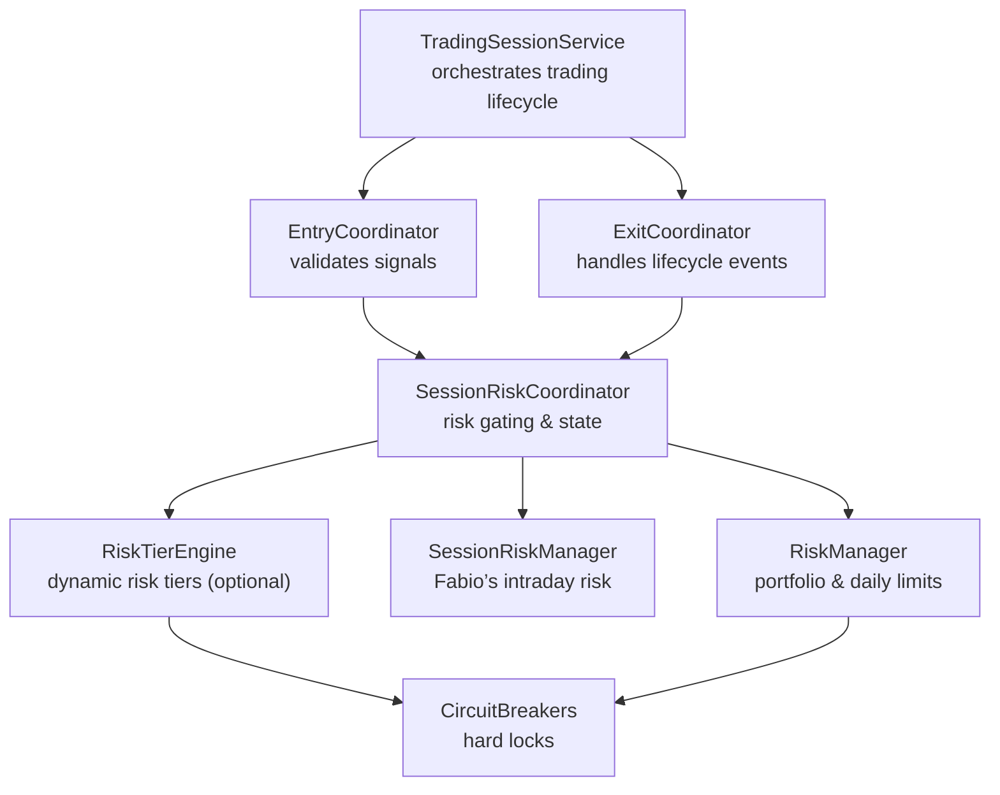
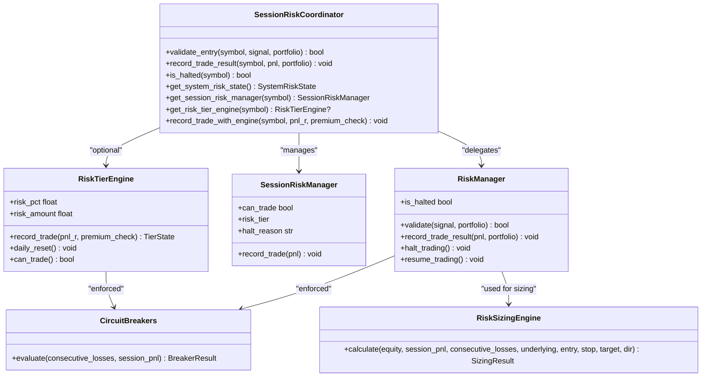
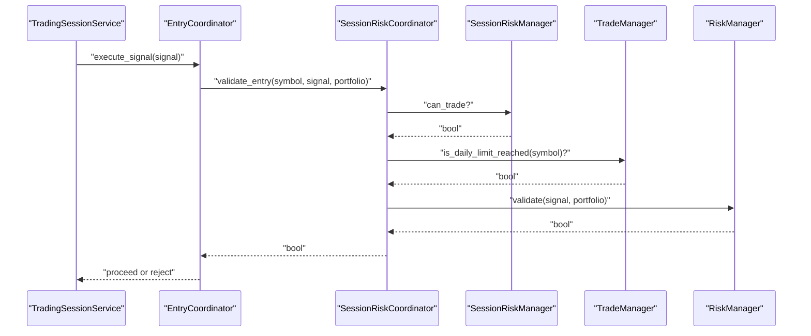
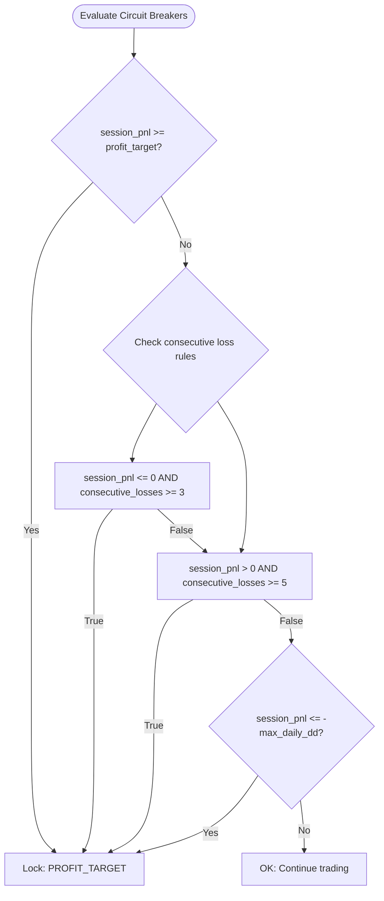
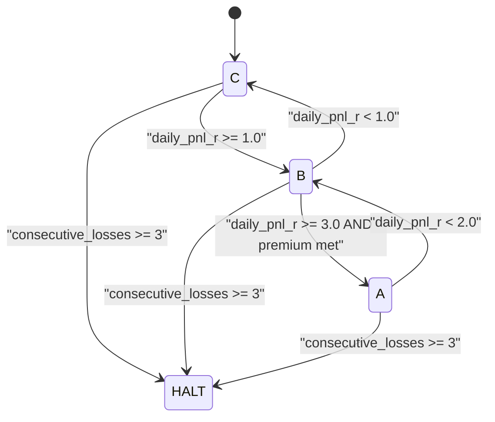
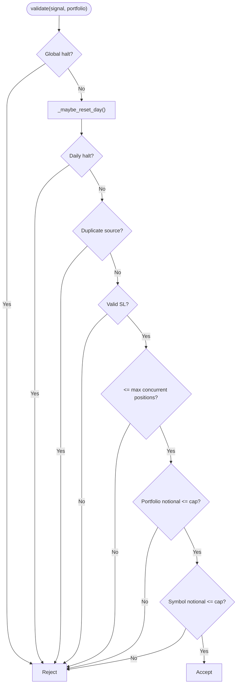
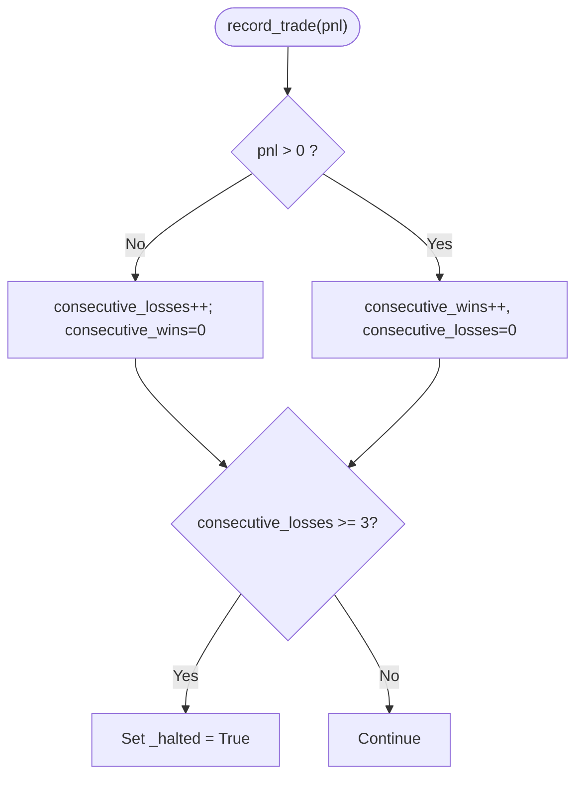
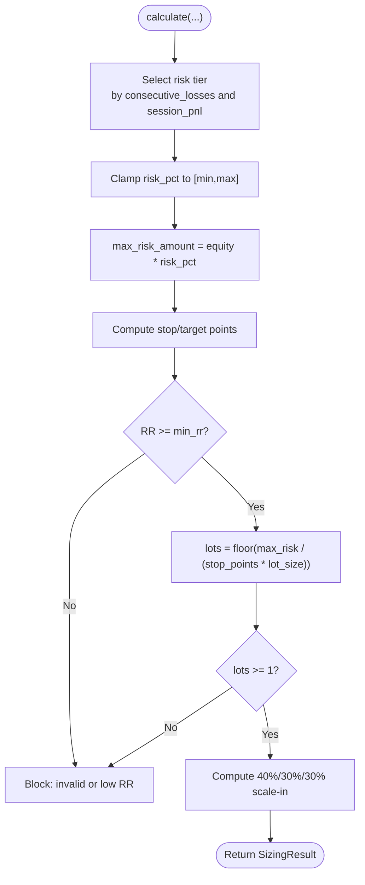
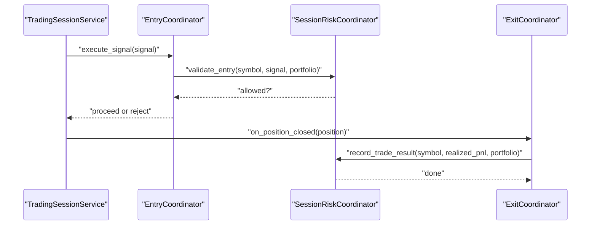
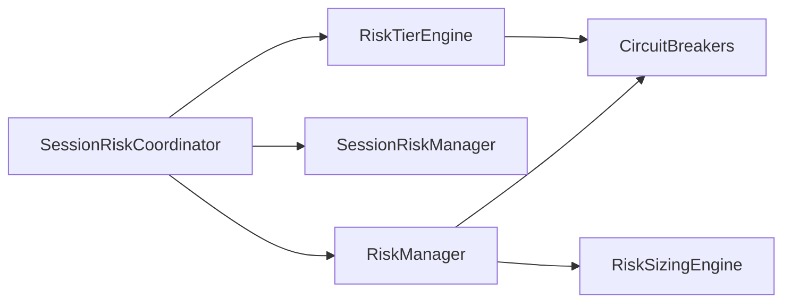

# Risk Coordination

<cite>
**Referenced Files in This Document**
- [session_risk_coordinator.py](file://backend/app/application/services/session_risk_coordinator.py)
- [circuit_breakers.py](file://backend/app/domain/services/circuit_breakers.py)
- [risk_sizing_engine.py](file://backend/app/domain/services/risk_sizing_engine.py)
- [risk_tier_engine.py](file://backend/app/domain/services/risk_tier_engine.py)
- [risk_manager.py](file://backend/app/domain/trading/services/risk_manager.py)
- [session_risk_manager.py](file://backend/app/domain/fabio_ai/services/session_risk_manager.py)
- [trading_session.py](file://backend/app/application/services/trading_session.py)
- [entry_coordinator.py](file://backend/app/application/services/entry_coordinator.py)
- [exit_coordinator.py](file://backend/app/application/services/exit_coordinator.py)
</cite>

## Table of Contents
1. [Introduction](#introduction)
2. [Project Structure](#project-structure)
3. [Core Components](#core-components)
4. [Architecture Overview](#architecture-overview)
5. [Detailed Component Analysis](#detailed-component-analysis)
6. [Dependency Analysis](#dependency-analysis)
7. [Performance Considerations](#performance-considerations)
8. [Troubleshooting Guide](#troubleshooting-guide)
9. [Conclusion](#conclusion)

## Introduction
This document explains the risk coordination services that govern session-level safety, circuit breaker enforcement, and dynamic risk management. It focuses on the SessionRiskCoordinator and its integration with circuit breakers, risk sizing engines, and trading session orchestration. It also documents risk controls such as position limits, drawdown protection, and volatility-adjusted sizing, and shows how risk coordination influences trading decisions and position management.

## Project Structure
The risk coordination system spans application services and domain services:
- Application services coordinate end-to-end trading and delegate risk checks to domain services.
- Domain services implement deterministic risk logic, sizing, and tiered risk models.
- Trading session orchestrators wire risk coordination into the execution pipeline.

**Diagram sources**
- [trading_session.py:115-121](file://backend/app/application/services/trading_session.py#L115-L121)
- [entry_coordinator.py:155-179](file://backend/app/application/services/entry_coordinator.py#L155-L179)
- [session_risk_coordinator.py:169-211](file://backend/app/application/services/session_risk_coordinator.py#L169-L211)
- [risk_manager.py:107-171](file://backend/app/domain/trading/services/risk_manager.py#L107-L171)
- [session_risk_manager.py:25-80](file://backend/app/domain/fabio_ai/services/session_risk_manager.py#L25-L80)
- [risk_tier_engine.py:96-160](file://backend/app/domain/services/risk_tier_engine.py#L96-L160)
- [circuit_breakers.py:44-105](file://backend/app/domain/services/circuit_breakers.py#L44-L105)

**Section sources**
- [trading_session.py:115-121](file://backend/app/application/services/trading_session.py#L115-L121)
- [session_risk_coordinator.py:43-154](file://backend/app/application/services/session_risk_coordinator.py#L43-L154)

## Core Components
- SessionRiskCoordinator: central risk coordinator that aggregates per-symbol risk managers, session risk managers, optional risk tier engine, and system-wide risk aggregation. It validates entries, records results, and exposes system risk state.
- RiskManager: enforces portfolio-level risk constraints, daily drawdown limits, and concurrent position caps; integrates with circuit breakers.
- SessionRiskManager (Fabio): enforces a 3-loss circuit breaker and dynamic risk tiers based on session PnL and streaks.
- RiskTierEngine: dynamic risk tier model (feature-flagged) that adjusts risk percentage based on daily PnL in R-multiples and premium setups.
- CircuitBreakers: hard, non-overridable breakers for profit target lock, consecutive losses, and daily drawdown.
- RiskSizingEngine: deterministic Kelly-based sizing with risk tiers, RR checks, and scale-in plans.

**Section sources**
- [session_risk_coordinator.py:43-345](file://backend/app/application/services/session_risk_coordinator.py#L43-L345)
- [risk_manager.py:51-261](file://backend/app/domain/trading/services/risk_manager.py#L51-L261)
- [session_risk_manager.py:25-162](file://backend/app/domain/fabio_ai/services/session_risk_manager.py#L25-L162)
- [risk_tier_engine.py:96-286](file://backend/app/domain/services/risk_tier_engine.py#L96-L286)
- [circuit_breakers.py:44-110](file://backend/app/domain/services/circuit_breakers.py#L44-L110)
- [risk_sizing_engine.py:44-204](file://backend/app/domain/services/risk_sizing_engine.py#L44-L204)

## Architecture Overview
SessionRiskCoordinator sits at the intersection of session-level risk and portfolio-level risk. It:
- Validates entries against multiple guards: confluence grade, session circuit breaker, daily loss limits, and standard risk manager.
- Records trade outcomes and updates risk states.
- Aggregates system risk for control-plane visibility.
- Optionally integrates RiskTierEngine for dynamic risk tiers.

**Diagram sources**
- [session_risk_coordinator.py:169-211](file://backend/app/application/services/session_risk_coordinator.py#L169-L211)
- [risk_manager.py:107-171](file://backend/app/domain/trading/services/risk_manager.py#L107-L171)
- [session_risk_manager.py:62-80](file://backend/app/domain/fabio_ai/services/session_risk_manager.py#L62-L80)
- [risk_tier_engine.py:161-241](file://backend/app/domain/services/risk_tier_engine.py#L161-L241)
- [circuit_breakers.py:64-105](file://backend/app/domain/services/circuit_breakers.py#L64-L105)
- [risk_sizing_engine.py:77-203](file://backend/app/domain/services/risk_sizing_engine.py#L77-L203)

## Detailed Component Analysis

### SessionRiskCoordinator
Responsibilities:
- Per-symbol risk manager and session risk manager lifecycle.
- Optional RiskTierEngine integration for dynamic risk tiers.
- Entry validation across multiple risk guards.
- Recording trade results and updating risk states.
- System-wide risk aggregation for control-plane visibility.
- Persistence of risk states to storage.

Key behaviors:
- validate_entry performs four independent checks: confluence grade score, session circuit breaker, daily loss limits via TradeManager, and standard risk manager validation.
- record_trade_result updates per-symbol risk manager with realized PnL.
- get_system_risk_state aggregates peak/current equity, daily drawdown, consecutive losses, and drift alerts across all risk managers.
- Optional RiskTierEngine enables dynamic risk tiers and persists engine state.

**Diagram sources**
- [entry_coordinator.py:155-179](file://backend/app/application/services/entry_coordinator.py#L155-L179)
- [session_risk_coordinator.py:169-211](file://backend/app/application/services/session_risk_coordinator.py#L169-L211)
- [session_risk_manager.py:62-80](file://backend/app/domain/fabio_ai/services/session_risk_manager.py#L62-L80)
- [risk_manager.py:107-171](file://backend/app/domain/trading/services/risk_manager.py#L107-L171)

**Section sources**
- [session_risk_coordinator.py:43-345](file://backend/app/application/services/session_risk_coordinator.py#L43-L345)
- [entry_coordinator.py:155-179](file://backend/app/application/services/entry_coordinator.py#L155-L179)

### Circuit Breakers Pattern
CircuitBreakers implement non-overridable hard locks:
- Consecutive loss rule: 3 losses with non-positive session PnL or 5 losses with positive session PnL trigger a lock.
- Daily drawdown lock: session PnL reaches or exceeds a daily drawdown threshold (based on equity).
- Profit target lock: session PnL meets or exceeds a configured daily profit target.

**Diagram sources**
- [circuit_breakers.py:64-105](file://backend/app/domain/services/circuit_breakers.py#L64-L105)

**Section sources**
- [circuit_breakers.py:44-110](file://backend/app/domain/services/circuit_breakers.py#L44-L110)

### RiskTierEngine (Dynamic Risk Model)
RiskTierEngine dynamically adjusts risk percentage based on:
- Daily PnL in R-multiples.
- Consecutive losses threshold for halts.
- Premium unlock conditions for Tier A.

State machine highlights:
- SESSION START: tier=C, daily_pnl_r=0, consecutive_losses=0.
- ON TRADE CLOSED: update daily PnL in R and consecutive losses; enforce halts on 3+ losses.
- DAILY RESET: reset at session close.

**Diagram sources**
- [risk_tier_engine.py:195-241](file://backend/app/domain/services/risk_tier_engine.py#L195-L241)

**Section sources**
- [risk_tier_engine.py:96-286](file://backend/app/domain/services/risk_tier_engine.py#L96-L286)

### RiskManager (Portfolio-Level Controls)
RiskManager enforces:
- Maximum daily drawdown percentage relative to peak equity.
- Maximum consecutive losses per day.
- Maximum concurrent positions.
- Portfolio and per-symbol notional caps.
- Drift detection via rolling win-rate analysis.

**Diagram sources**
- [risk_manager.py:107-171](file://backend/app/domain/trading/services/risk_manager.py#L107-L171)

**Section sources**
- [risk_manager.py:51-261](file://backend/app/domain/trading/services/risk_manager.py#L51-L261)

### SessionRiskManager (Fabio’s Intraday Cushion)
SessionRiskManager enforces:
- 3-loss circuit breaker.
- Dynamic risk tiers based on session PnL, streaks, and conservative/momentum modes.
- Stop-loss percentage adjustments bounded by tier and maximum caps.

**Diagram sources**
- [session_risk_manager.py:116-135](file://backend/app/domain/fabio_ai/services/session_risk_manager.py#L116-L135)

**Section sources**
- [session_risk_manager.py:25-162](file://backend/app/domain/fabio_ai/services/session_risk_manager.py#L25-L162)

### RiskSizingEngine (Deterministic Position Sizing)
RiskSizingEngine computes:
- Risk tier selection (standard/reduced/elevated) based on consecutive losses and session PnL.
- Max risk amount as a percentage of equity (with min/max clamps).
- Stop/target distances and RR ratio checks.
- Lot sizing snapped to exchange lot sizes.
- Scale-in plan: 40%/30%/30%.

**Diagram sources**
- [risk_sizing_engine.py:77-203](file://backend/app/domain/services/risk_sizing_engine.py#L77-L203)

**Section sources**
- [risk_sizing_engine.py:44-204](file://backend/app/domain/services/risk_sizing_engine.py#L44-L204)

### Integration with Trading Sessions and Lifecycle
- TradingSessionService constructs SessionRiskCoordinator and injects it into EntryCoordinator and ExitCoordinator.
- EntryCoordinator calls SessionRiskCoordinator.validate_entry before executing signals.
- ExitCoordinator triggers SessionRiskCoordinator.record_trade_result upon closed positions.
- SessionRiskCoordinator persists risk states to storage for crash-safe continuity.

**Diagram sources**
- [trading_session.py:115-121](file://backend/app/application/services/trading_session.py#L115-L121)
- [entry_coordinator.py:155-179](file://backend/app/application/services/entry_coordinator.py#L155-L179)
- [exit_coordinator.py:143-200](file://backend/app/application/services/exit_coordinator.py#L143-L200)
- [session_risk_coordinator.py:213-224](file://backend/app/application/services/session_risk_coordinator.py#L213-L224)

**Section sources**
- [trading_session.py:115-121](file://backend/app/application/services/trading_session.py#L115-L121)
- [entry_coordinator.py:155-179](file://backend/app/application/services/entry_coordinator.py#L155-L179)
- [exit_coordinator.py:143-200](file://backend/app/application/services/exit_coordinator.py#L143-L200)

## Dependency Analysis
- Coupling:
  - SessionRiskCoordinator depends on RiskManager, SessionRiskManager, and optionally RiskTierEngine.
  - RiskManager and RiskTierEngine both integrate with CircuitBreakers.
  - RiskSizingEngine is used by higher-level sizing logic and complements RiskManager’s constraints.
- Cohesion:
  - Each component has a single responsibility: validation, sizing, tiering, or aggregation.
- External dependencies:
  - Storage port for crash-safe persistence of risk states.
  - TradeManager for daily loss tracking.

**Diagram sources**
- [session_risk_coordinator.py:169-211](file://backend/app/application/services/session_risk_coordinator.py#L169-L211)
- [risk_manager.py:107-171](file://backend/app/domain/trading/services/risk_manager.py#L107-L171)
- [risk_tier_engine.py:161-241](file://backend/app/domain/services/risk_tier_engine.py#L161-L241)
- [circuit_breakers.py:64-105](file://backend/app/domain/services/circuit_breakers.py#L64-L105)
- [risk_sizing_engine.py:77-203](file://backend/app/domain/services/risk_sizing_engine.py#L77-L203)

**Section sources**
- [session_risk_coordinator.py:169-211](file://backend/app/application/services/session_risk_coordinator.py#L169-L211)
- [risk_manager.py:107-171](file://backend/app/domain/trading/services/risk_manager.py#L107-L171)
- [risk_tier_engine.py:161-241](file://backend/app/domain/services/risk_tier_engine.py#L161-L241)
- [circuit_breakers.py:64-105](file://backend/app/domain/services/circuit_breakers.py#L64-L105)
- [risk_sizing_engine.py:77-203](file://backend/app/domain/services/risk_sizing_engine.py#L77-L203)

## Performance Considerations
- Deterministic sizing: RiskSizingEngine avoids LLM overhead and executes in microseconds.
- Minimal allocations: RiskManager and SessionRiskManager maintain lightweight state snapshots.
- Thread-safety: SessionRiskCoordinator uses a lock around per-symbol manager creation and state access.
- Persistence: JSON serialization/deserialization is used for crash-safe state; errors are logged and ignored to avoid blocking.

## Troubleshooting Guide
Common issues and mitigations:
- Entry blocked by confluence grade: ensure signals meet the minimum grade threshold.
- Session circuit breaker triggered: monitor consecutive losses and session PnL; wait for reset or correction.
- Daily loss limit reached: review portfolio notional caps and reduce exposure.
- Drift alerts: investigate recent performance drift and adjust strategies.
- Persistence failures: verify storage port availability and JSON compatibility.

**Section sources**
- [session_risk_coordinator.py:169-211](file://backend/app/application/services/session_risk_coordinator.py#L169-L211)
- [risk_manager.py:223-246](file://backend/app/domain/trading/services/risk_manager.py#L223-L246)
- [session_risk_manager.py:116-135](file://backend/app/domain/fabio_ai/services/session_risk_manager.py#L116-L135)

## Conclusion
The risk coordination system combines session-level and portfolio-level controls to protect capital while enabling dynamic risk-taking. SessionRiskCoordinator orchestrates validation, sizing, and state persistence, integrating optional dynamic risk tiers and hard circuit breakers. Together with TradingSessionService, EntryCoordinator, and ExitCoordinator, it ensures automated, transparent, and resilient risk management across trading sessions.