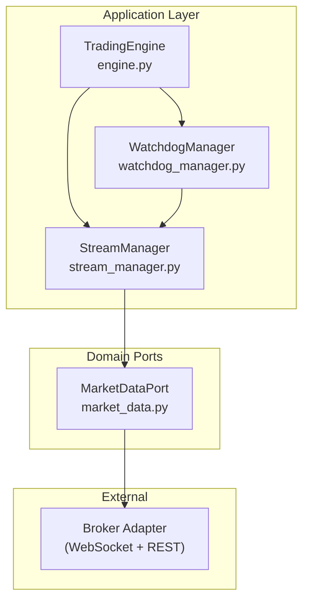
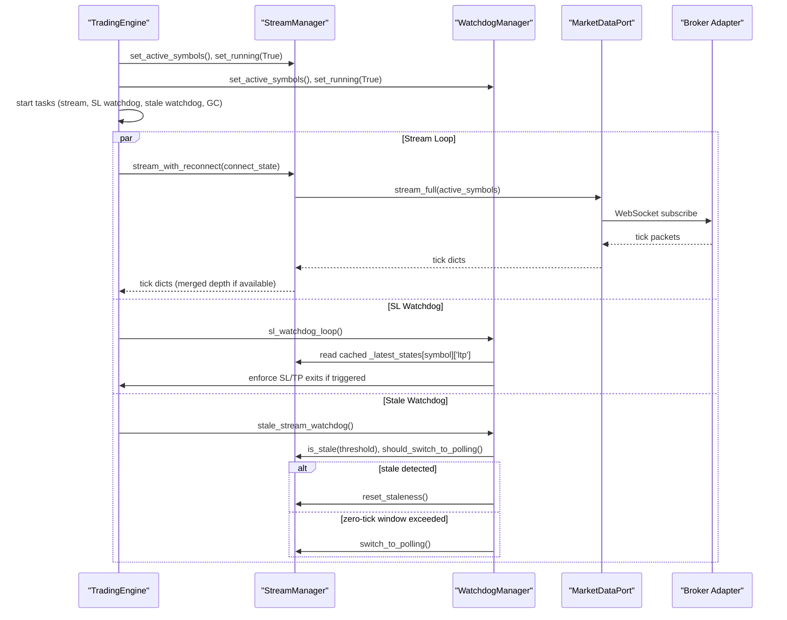
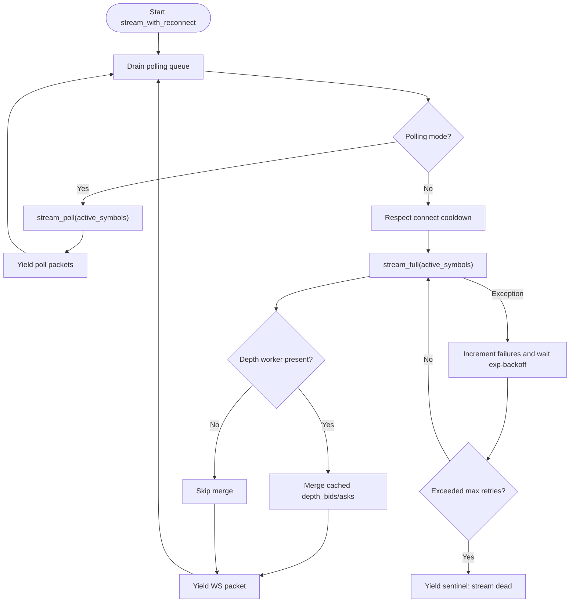
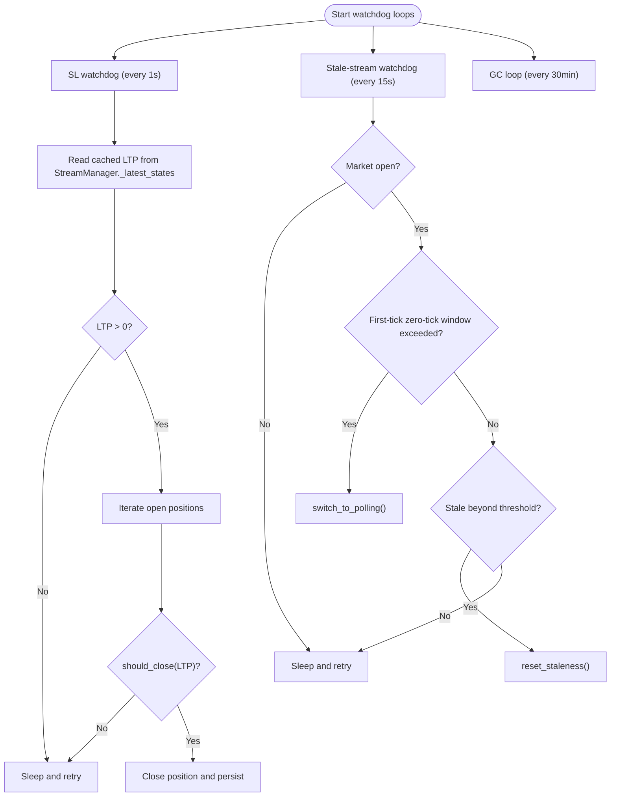
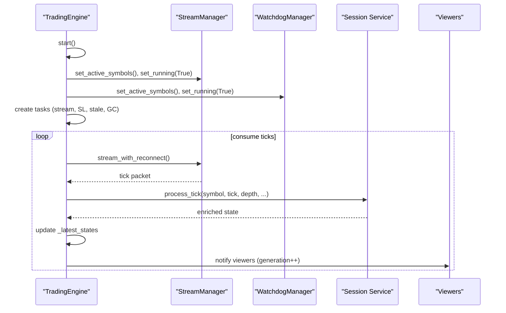
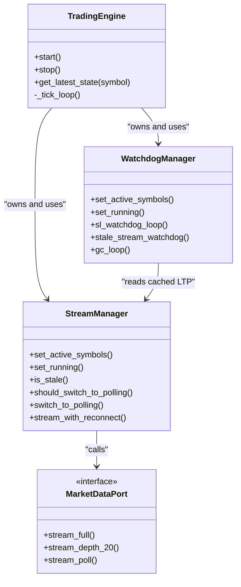

# Stream Management

<cite>
**Referenced Files in This Document**
- [stream_manager.py](file://backend/app/application/stream_manager.py)
- [watchdog_manager.py](file://backend/app/application/watchdog_manager.py)
- [engine.py](file://backend/app/application/engine.py)
- [market_data.py](file://backend/app/domain/ports/market_data.py)
- [ARCHITECTURE.md](file://ARCHITECTURE.md)
- [test_stream_manager.py](file://backend/tests/unit/application/test_stream_manager.py)
</cite>

## Table of Contents
1. [Introduction](#introduction)
2. [Project Structure](#project-structure)
3. [Core Components](#core-components)
4. [Architecture Overview](#architecture-overview)
5. [Detailed Component Analysis](#detailed-component-analysis)
6. [Dependency Analysis](#dependency-analysis)
7. [Performance Considerations](#performance-considerations)
8. [Troubleshooting Guide](#troubleshooting-guide)
9. [Conclusion](#conclusion)

## Introduction
This document explains the StreamManager and WatchdogManager components that together ensure reliable, real-time market data ingestion and system monitoring for the trading engine. It covers:
- How StreamManager manages WebSocket and REST polling streams, merges depth data, and maintains stream health
- How WatchdogManager enforces SL/TP protection, detects stale streams, and performs periodic garbage collection
- The end-to-end lifecycle from connection establishment to graceful degradation
- Practical monitoring, recovery, and optimization techniques
- Integration with the trading engine and how streaming data feeds the analysis pipeline

## Project Structure
The relevant components are located under backend/app/application and backend/app/domain/ports. The trading engine orchestrates these modules and exposes a WebSocket interface for frontend viewers.

**Diagram sources**
- [engine.py:108-116](file://backend/app/application/engine.py#L108-L116)
- [stream_manager.py:39](file://backend/app/application/stream_manager.py#L39)
- [watchdog_manager.py:41](file://backend/app/application/watchdog_manager.py#L41)
- [market_data.py:19-112](file://backend/app/domain/ports/market_data.py#L19-L112)

**Section sources**
- [engine.py:108-116](file://backend/app/application/engine.py#L108-L116)
- [stream_manager.py:32-303](file://backend/app/application/stream_manager.py#L32-L303)
- [watchdog_manager.py:34-198](file://backend/app/application/watchdog_manager.py#L34-L198)
- [market_data.py:19-112](file://backend/app/domain/ports/market_data.py#L19-L112)

## Core Components
- StreamManager: Orchestrates live streaming, exponential backoff reconnection, optional polling fallback, and depth merging. It tracks staleness and supports switching to polling when the WebSocket fails to deliver ticks within a grace window.
- WatchdogManager: Runs independent SL/TP checks using cached LTP, monitors stream staleness, and triggers reconnection or fallback. It also periodically runs garbage collection to prevent memory leaks.

Key responsibilities:
- StreamManager
  - Manage WebSocket and REST polling streams
  - Merge depth snapshots with full ticks
  - Detect zero-tick windows and switch to polling
  - Reconnect with exponential backoff and cooldown
- WatchdogManager
  - Enforce SL/TP exits even when the stream is down
  - Detect and recover from stale streams
  - Periodic GC to maintain long-running stability

**Section sources**
- [stream_manager.py:32-303](file://backend/app/application/stream_manager.py#L32-L303)
- [watchdog_manager.py:34-198](file://backend/app/application/watchdog_manager.py#L34-L198)

## Architecture Overview
The trading engine initializes StreamManager and WatchdogManager, then starts:
- A streaming task that yields tick packets from StreamManager
- A SL watchdog task that evaluates positions against cached LTP
- A stale-stream watchdog task that resets staleness timers or switches to polling
- A GC task that periodically collects garbage

**Diagram sources**
- [engine.py:131-176](file://backend/app/application/engine.py#L131-L176)
- [stream_manager.py:135-288](file://backend/app/application/stream_manager.py#L135-L288)
- [watchdog_manager.py:63-175](file://backend/app/application/watchdog_manager.py#L63-L175)
- [market_data.py:88-103](file://backend/app/domain/ports/market_data.py#L88-L103)

## Detailed Component Analysis

### StreamManager
Responsibilities:
- Establish and maintain WebSocket streams
- Merge depth snapshots (Depth 20) with full tick payloads
- Fallback to REST polling for symbols not delivered via WebSocket
- Track staleness and decide when to switch to polling
- Reconnect with exponential backoff and a connection cooldown

Key behaviors:
- Dual-stream mode: When the default exchange is NSE and not in polling mode, StreamManager spawns a depth worker to stream 20-level depth snapshots and merges them into full tick payloads.
- Polling fallback: After a grace period, if no symbols have received ticks, the manager permanently switches to REST polling for all symbols.
- Reconnection: On stream exceptions, it increments a failure counter and waits exponentially (capped) before reconnecting. After a fixed number of retries, it yields a sentinel indicating the stream is dead.

**Diagram sources**
- [stream_manager.py:135-288](file://backend/app/application/stream_manager.py#L135-L288)

Operational thresholds and controls:
- Connect cooldown: minimum delay between WebSocket reconnect attempts
- Max retries: hard stop after repeated failures
- Zero-tick grace: initial window to allow for broker delivery
- Staleness threshold: determines when to reset staleness or trigger fallback

Integration points:
- MarketDataPort: provides stream_full, stream_depth_20, and stream_poll
- TradingEngine: consumes yielded packets and drives the analysis pipeline

**Section sources**
- [stream_manager.py:32-303](file://backend/app/application/stream_manager.py#L32-L303)
- [market_data.py:88-103](file://backend/app/domain/ports/market_data.py#L88-L103)
- [ARCHITECTURE.md:526-539](file://ARCHITECTURE.md#L526-L539)

### WatchdogManager
Responsibilities:
- Independent SL/TP enforcement using cached LTP from StreamManager
- Stale stream detection and recovery actions
- Periodic garbage collection to prevent memory leaks

Key behaviors:
- SL watchdog: runs at a tight cadence, inspects open positions, and closes those hitting SL/TP using the last known LTP. Persists trade closures when storage is available.
- Stale stream watchdog: checks whether the engine should switch to polling (first-tick zero-tick window) or reset staleness to trigger a reconnect.
- GC loop: runs periodically to perform garbage collection and log collected object counts.

**Diagram sources**
- [watchdog_manager.py:63-175](file://backend/app/application/watchdog_manager.py#L63-L175)
- [stream_manager.py:86-133](file://backend/app/application/stream_manager.py#L86-L133)

**Section sources**
- [watchdog_manager.py:34-198](file://backend/app/application/watchdog_manager.py#L34-L198)
- [stream_manager.py:39-133](file://backend/app/application/stream_manager.py#L39-L133)

### Integration with TradingEngine
The engine composes StreamManager and WatchdogManager, initializes them with active symbols, and starts them as separate tasks. It then continuously consumes tick packets from StreamManager, processes them through the session pipeline, and updates the latest state for frontend viewers.

Highlights:
- Initialization: sets active symbols and running flags for both managers
- Task orchestration: starts stream, SL watchdog, stale watchdog, and GC tasks
- Tick consumption: passes tick dicts to session.process_tick, enriches state, and notifies viewers
- Shutdown: cancels all tasks and ensures graceful teardown

**Diagram sources**
- [engine.py:131-176](file://backend/app/application/engine.py#L131-L176)
- [engine.py:619-861](file://backend/app/application/engine.py#L619-L861)

**Section sources**
- [engine.py:108-176](file://backend/app/application/engine.py#L108-L176)
- [engine.py:619-861](file://backend/app/application/engine.py#L619-L861)

## Dependency Analysis
- StreamManager depends on MarketDataPort for:
  - stream_full: primary WebSocket stream
  - stream_depth_20: optional depth stream (NSE)
  - stream_poll: REST polling fallback
- WatchdogManager depends on StreamManager for:
  - cached LTP via _latest_states
  - staleness checks and fallback triggers
- TradingEngine coordinates both and feeds processed state to viewers.

**Diagram sources**
- [engine.py:108-116](file://backend/app/application/engine.py#L108-L116)
- [stream_manager.py:39](file://backend/app/application/stream_manager.py#L39)
- [watchdog_manager.py:41](file://backend/app/application/watchdog_manager.py#L41)
- [market_data.py:88-103](file://backend/app/domain/ports/market_data.py#L88-L103)

**Section sources**
- [engine.py:108-116](file://backend/app/application/engine.py#L108-L116)
- [stream_manager.py:39](file://backend/app/application/stream_manager.py#L39)
- [watchdog_manager.py:41](file://backend/app/application/watchdog_manager.py#L41)
- [market_data.py:88-103](file://backend/app/domain/ports/market_data.py#L88-L103)

## Performance Considerations
- Connection cooldown: prevents rapid reconnect storms by enforcing a minimum delay between WebSocket attempts.
- Exponential backoff: reduces load on failing endpoints and allows transient issues to resolve.
- Polling fallback: ensures continuity for symbols that cannot be served via WebSocket (e.g., certain MCX options).
- Depth merging: minimizes duplication by caching depth snapshots and attaching them to full tick payloads.
- GC loop: periodic collection mitigates memory growth in long-running sessions.

Recommendations:
- Tune polling intervals for symbols with sparse liquidity to balance freshness and cost.
- Monitor staleness thresholds and fallback triggers to avoid unnecessary transitions.
- Validate broker-side depth availability to maximize the benefits of dual-stream mode.

[No sources needed since this section provides general guidance]

## Troubleshooting Guide
Common scenarios and remedies:
- Stream dead after retries: StreamManager yields a sentinel indicating the stream is dead. WatchdogManager’s stale watchdog can trigger fallback to polling if appropriate.
- Zero-tick window exceeded: If no ticks arrive within the grace period, the manager permanently switches to polling.
- Stale stream detected: The stale watchdog resets staleness timers or initiates reconnection to restore connectivity.
- SL/TP triggered while stream offline: The SL watchdog uses cached LTP to enforce exits, ensuring position safety even during disconnections.

Operational tips:
- Inspect logs for reconnection attempts and fallback transitions.
- Confirm that the default exchange setting aligns with dual-stream capabilities.
- Validate that polling fallback is effective for symbols that do not support WebSocket delivery.

**Section sources**
- [stream_manager.py:274-288](file://backend/app/application/stream_manager.py#L274-L288)
- [watchdog_manager.py:130-175](file://backend/app/application/watchdog_manager.py#L130-L175)
- [test_stream_manager.py:135-158](file://backend/tests/unit/application/test_stream_manager.py#L135-L158)

## Conclusion
StreamManager and WatchdogManager form a resilient streaming and monitoring backbone for the trading engine. Together they:
- Keep the pipeline fed with live data, gracefully degrading to polling when needed
- Protect positions using cached LTP even when the stream is down
- Detect and recover from stale or failing streams
- Maintain system stability through periodic garbage collection

Their integration with the TradingEngine ensures that streaming data flows seamlessly into the analysis pipeline, informing decisions while preserving safety and reliability.