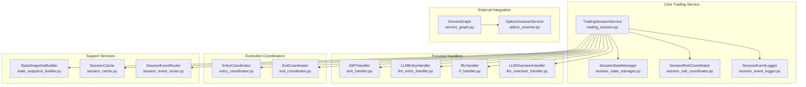
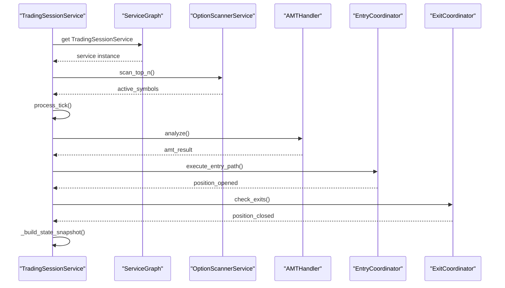
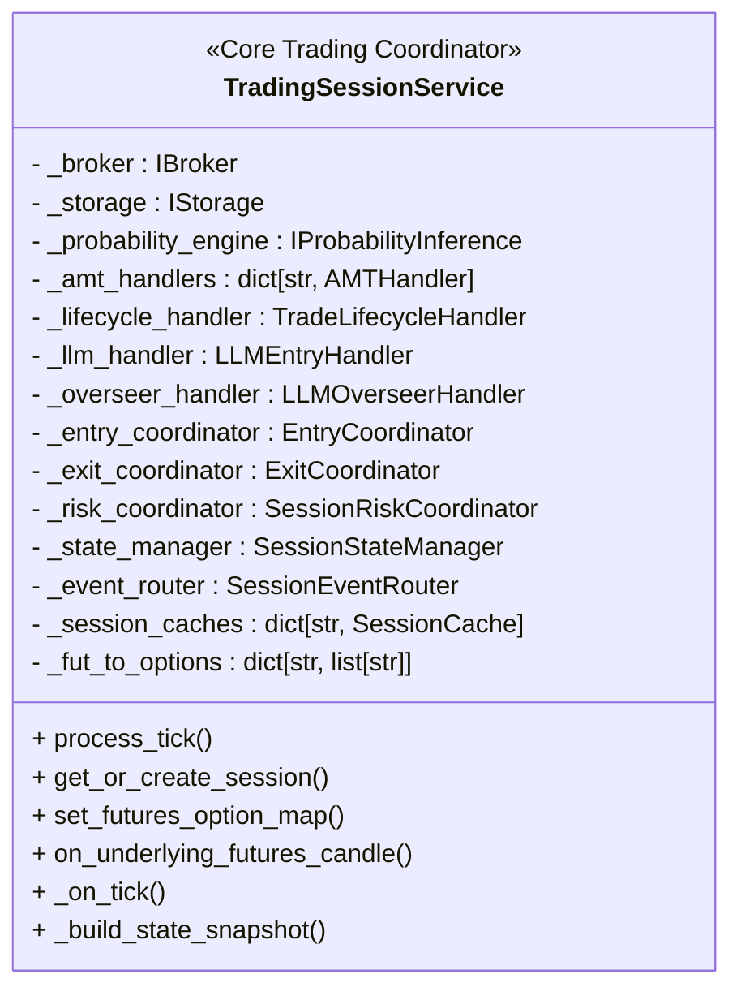
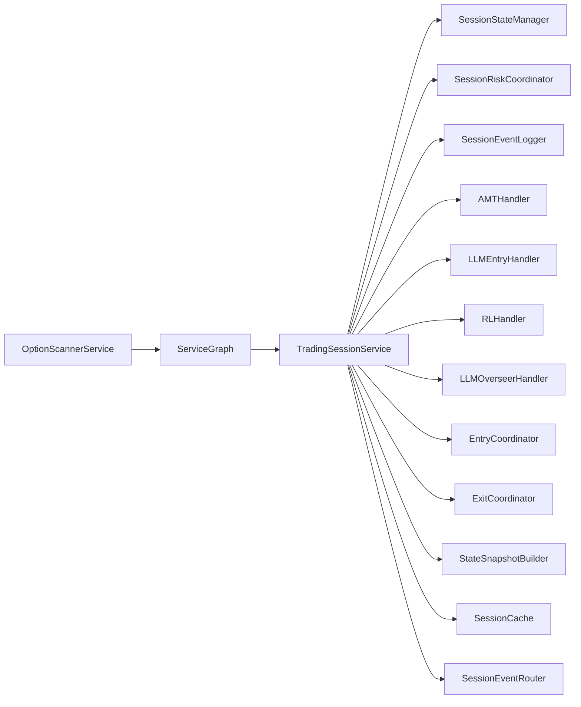

# Trading Engine

<cite>
**Referenced Files in This Document**
- [trading_session.py](file://backend/app/application/services/trading_session.py)
- [service_graph.py](file://backend/app/application/service_graph.py)
- [option_scanner.py](file://backend/app/domain/fabio_ai/services/option_scanner.py)
- [health.py](file://backend/app/api/routers/health.py)
- [main.py](file://backend/app/main.py)
- [test_trading_session_unit.py](file://backend/tests/unit/application/test_trading_session_unit.py)
- [test_trading_session_unit.md](file://backend/tests/unit/application/test_trading_session_unit.md)
- [useServerTradingSystem.ts](file://frontend/hooks/useServerTradingSystem.ts)
- [useServerTradingSystem.test.tsx](file://frontend/tests/hooks/useServerTradingSystem.test.tsx)
</cite>

## Update Summary
**Changes Made**
- Complete architectural shift from TradingEngine v2 to TradingSessionService as the core trading coordinator
- Removed documentation for scanner service, trade manager, and pipeline processors as they're now consolidated
- Updated architecture to reflect unified event-driven processing through TradingSessionService
- Added new dual-feed mechanism for underlying futures processing
- Enhanced mid-trade recovery functionality for position restoration
- Integrated comprehensive observability with latency tracking and gate rejection analysis
- Added circuit breaker pattern implementation and resilience strategies

## Table of Contents
1. [Introduction](#introduction)
2. [Project Structure](#project-structure)
3. [Core Components](#core-components)
4. [Architecture Overview](#architecture-overview)
5. [Detailed Component Analysis](#detailed-component-analysis)
6. [Advanced Trading Features](#advanced-trading-features)
7. [Performance and Observability](#performance-and-observability)
8. [Risk Management Systems](#risk-management-systems)
9. [Dependency Analysis](#dependency-analysis)
10. [Performance Considerations](#performance-considerations)
11. [Troubleshooting Guide](#troubleshooting-guide)
12. [Conclusion](#conclusion)
13. [Appendices](#appendices)

## Introduction
TradingSessionService represents a fundamental evolution from the original TradingEngine v2, consolidating previously separate components into a unified, event-driven trading coordinator. This standalone trading loop operates independently of frontend WebSocket connections while providing comprehensive trading automation capabilities through a streamlined architecture.

Key enhancements include:
- **Unified Event-Driven Processing**: Single coordinator managing all trading activities
- **Dual-Feed Architecture**: Underlying futures and options data processing
- **Enhanced Mid-Trade Recovery**: Comprehensive position restoration and management
- **Integrated Observability**: Built-in latency tracking and performance monitoring
- **Circuit Breaker Resilience**: Comprehensive safety mechanisms and error handling
- **Modular Handler System**: Focused components for AMT analysis, trade lifecycle, and risk management

## Project Structure
TradingSessionService architecture emphasizes modularity and separation of concerns:



**Diagram sources**
- [trading_session.py:107-273](file://backend/app/application/services/trading_session.py#L107-L273)
- [service_graph.py:244-300](file://backend/app/application/service_graph.py#L244-L300)
- [option_scanner.py:40-561](file://backend/app/domain/fabio_ai/services/option_scanner.py#L40-L561)

**Section sources**
- [trading_session.py:107-273](file://backend/app/application/services/trading_session.py#L107-L273)

## Core Components
TradingSessionService consists of several specialized components working together to provide comprehensive trading automation:

### TradingSessionService
The central coordinator managing the complete trading pipeline with unified event-driven processing:
- **Per-Symbol Session Management**: Dynamic session creation and state tracking
- **Dual-Feed Data Processing**: Underlying futures and options data integration
- **Event-Driven Architecture**: Comprehensive event subscription and routing
- **Execution Coordination**: Unified entry and exit management
- **Risk Integration**: Session-level risk management and monitoring
- **Observability**: Built-in performance tracking and error handling

### Focused Handlers
Specialized components handling specific trading functions:
- **AMTHandler**: Advanced Market Theory analysis and pattern recognition
- **LLMEntryHandler**: AI-powered entry decision making with confidence scoring
- **RLHandler**: Reinforcement learning status and performance tracking
- **LLMOverseerHandler**: AI supervision and trade monitoring

### Execution Coordinators
Streamlined components for trade execution:
- **EntryCoordinator**: Signal processing and position entry management
- **ExitCoordinator**: Position exit strategies and profit-taking execution

**Section sources**
- [trading_session.py:107-273](file://backend/app/application/services/trading_session.py#L107-L273)
- [trading_session.py:160-232](file://backend/app/application/services/trading_session.py#L160-L232)

## Architecture Overview
TradingSessionService implements a sophisticated event-driven architecture with clear separation of concerns:



**Diagram sources**
- [trading_session.py:326-471](file://backend/app/application/services/trading_session.py#L326-L471)
- [service_graph.py:244-300](file://backend/app/application/service_graph.py#L244-L300)
- [option_scanner.py:200-350](file://backend/app/domain/fabio_ai/services/option_scanner.py#L200-L350)

The architecture emphasizes:
- **Event-Driven Processing**: Asynchronous event handling with comprehensive routing
- **Dual-Feed Integration**: Seamless underlying futures and options data processing
- **Unified Execution**: Single point of control for all trading decisions
- **Resilient Design**: Built-in error handling and recovery mechanisms
- **Observability**: Comprehensive performance monitoring and debugging capabilities

## Detailed Component Analysis

### TradingSessionService Core
The TradingSessionService serves as the central orchestrator with comprehensive trading capabilities:

#### Key Responsibilities:
- **Session Management**: Dynamic per-symbol session creation and state tracking
- **Event Routing**: Comprehensive event subscription and handler delegation
- **Data Integration**: Dual-feed processing for underlying futures and options
- **Execution Coordination**: Unified entry and exit management through focused coordinators
- **Risk Integration**: Session-level risk management and monitoring
- **State Building**: Complete state snapshot generation for frontend consumption

#### Advanced Features:
- **Per-Symbol Handlers**: Dynamic AMT handler creation for each trading symbol
- **Session Caching**: Efficient per-symbol data caching and state management
- **Dual-Feed Support**: Automatic underlying futures data integration for options
- **Pending Signal Management**: Stale signal detection and processing
- **Session Phase Management**: Automatic position closure during trading session phases



**Diagram sources**
- [trading_session.py:107-273](file://backend/app/application/services/trading_session.py#L107-L273)
- [trading_session.py:291-325](file://backend/app/application/services/trading_session.py#L291-L325)

**Section sources**
- [trading_session.py:107-273](file://backend/app/application/services/trading_session.py#L107-L273)
- [trading_session.py:291-325](file://backend/app/application/services/trading_session.py#L291-L325)

### ServiceGraph Integration
Centralized dependency injection and service management:

#### Responsibilities:
- **Service Creation**: TradingSessionService instantiation with all dependencies
- **Configuration Management**: Exchange-specific configuration and settings
- **Symbol Management**: Active symbol tracking and futures-options mapping
- **Scanner Integration**: Option scanning service coordination
- **Adapter Management**: External service adapter registration and resolution

#### Key Features:
- **Lazy Initialization**: Services created on-demand to optimize startup time
- **Live Mode Validation**: Critical service validation for production environments
- **Configuration Injection**: Exchange-specific settings and tick size management
- **Symbol Routing**: Automatic futures-options relationship mapping

**Section sources**
- [service_graph.py:244-300](file://backend/app/application/service_graph.py#L244-L300)
- [service_graph.py:225-239](file://backend/app/application/service_graph.py#L225-L239)

### OptionScannerService
Contract selection and symbol management:

#### Responsibilities:
- **Contract Scanning**: Momentum-based option contract selection
- **Underlying Management**: Support for multiple underlying assets (NIFTY, BANKNIFTY, CRUDEOIL)
- **Liquidity Filtering**: OI and volume-based contract quality assessment
- **Bias Detection**: Bullish/bearish momentum identification
- **ATM Proximity**: Gamma optimization through at-the-money strike selection

#### Advanced Features:
- **Multi-Exchange Support**: MCX and NSE option chains
- **Thread Pool Execution**: Concurrent contract processing for performance
- **Spread Penalty**: Liquidity cost consideration in scoring algorithm
- **Dynamic Strike Intervals**: Exchange-specific strike interval optimization

**Section sources**
- [option_scanner.py:40-200](file://backend/app/domain/fabio_ai/services/option_scanner.py#L40-L200)
- [health.py:207-230](file://backend/app/api/routers/health.py#L207-L230)

## Advanced Trading Features

### Dual-Feed Architecture
Seamless integration of underlying futures and options data:

#### Core Functionality:
- **Futures-Options Mapping**: Automatic relationship detection and data sharing
- **Data Source Selection**: Intelligent switching between underlying and option data
- **Shared Market State**: Consistent market state across CE/PE options on same underlying
- **Historical Data Seeding**: Warm-up of underlying buffers for new options

#### Advanced Features:
- **Minimum Candle Threshold**: 5-candle minimum for reliable underlying data
- **State Synchronization**: Market state consistency across related options
- **TTL Management**: Cached underlying state expiration and refresh
- **Performance Optimization**: Reduced computational overhead through data sharing

**Section sources**
- [trading_session.py:306-325](file://backend/app/application/services/trading_session.py#L306-L325)
- [trading_session.py:607-686](file://backend/app/application/services/trading_session.py#L607-L686)

### Mid-Trade Recovery
Comprehensive position restoration and management:

#### Recovery Mechanisms:
- **Position State Persistence**: Crash-safe position state storage and retrieval
- **Partial Exit Management**: Progressive position reduction and profit-taking
- **Stop-Out Handling**: Automatic position closure on margin requirements
- **Session Phase Enforcement**: Forced position closure during trading session phases

#### Advanced Features:
- **Persistent Storage Integration**: KV store for crash recovery scenarios
- **Realized PnL Calculation**: Accurate profit and loss tracking during closures
- **Partition State Management**: Exit strategy state preservation and restoration
- **Emergency Protocols**: Critical failure handling with position closure

**Section sources**
- [trading_session.py:173-180](file://backend/app/application/services/trading_session.py#L173-L180)
- [trading_session.py:478-604](file://backend/app/application/services/trading_session.py#L478-L604)

### Event-Driven Processing
Unified event handling and routing system:

#### Event Flow:
- **TickReceived Events**: Real-time market data processing
- **SignalGenerated Events**: AI-generated trade signals
- **PositionClosed Events**: Trade completion and performance recording
- **Custom Event Routing**: Flexible event handling through SessionEventRouter

#### Advanced Features:
- **Event Bus Integration**: Optional pub/sub event distribution
- **Backward Compatibility**: Direct method call fallback for non-event systems
- **Pending Signal Drain**: Stale signal detection and processing
- **Signal TTL Management**: 10-minute signal age validation

**Section sources**
- [trading_session.py:449-471](file://backend/app/application/services/trading_session.py#L449-L471)
- [trading_session.py:347-370](file://backend/app/application/services/trading_session.py#L347-L370)

### Circuit Breaker Pattern
Comprehensive safety mechanisms and error handling:

#### Safety Features:
- **Global Emergency Kill Switch**: System-wide trading halt capability
- **Risk State Monitoring**: Aggregated system risk assessment
- **Error Containment**: Graceful degradation during component failures
- **Self-Healing Mechanisms**: Automatic recovery from common failure modes

#### Advanced Features:
- **Playbook Guard Reset**: Manual intervention capability for trading discipline
- **System Risk State**: Comprehensive risk exposure monitoring
- **Component Health Checks**: Automatic detection of service availability
- **Graceful Degradation**: Partial functionality during partial outages

**Section sources**
- [trading_session.py:1028-1042](file://backend/app/application/services/trading_session.py#L1028-L1042)
- [trading_session.py:1036-1038](file://backend/app/application/services/trading_session.py#L1036-L1038)

## Performance and Observability

### Latency Tracking System
Comprehensive performance monitoring with percentile analysis:

#### Metrics Collection:
- **Per-Symbol Latency**: Individual symbol processing time tracking
- **Percentile Analysis**: p50, p95, p99 latency percentiles for performance profiling
- **Threshold Alerts**: Automated warnings for performance degradation
- **Statistical Reporting**: Comprehensive latency statistics and trends

#### Performance Optimization:
- **Event Timing**: Precise tick-to-signal latency measurement
- **Processing Bottleneck Detection**: Identifies slowest processing components
- **Resource Utilization**: CPU and memory usage monitoring
- **Throughput Analysis**: Transactions per second and processing capacity

**Section sources**
- [trading_session.py:985-989](file://backend/app/application/services/trading_session.py#L985-L989)

### Session State Management
Efficient per-symbol state tracking and persistence:

#### State Features:
- **Thread Safety**: Lock-based access control for concurrent operations
- **Session Caching**: In-memory state caching for performance optimization
- **Idle Session Eviction**: Automatic cleanup of inactive trading sessions
- **State Snapshot Building**: Comprehensive state export for frontend consumption

#### Advanced Features:
- **MAX_CANDLES_PER_SYMBOL**: Memory management with candle history limits
- **Session Reset Logic**: Automatic state reset based on trading session phases
- **Priority Score Tracking**: AI decision priority and confidence scoring
- **Cache Management**: Efficient memory usage with automatic cleanup

**Section sources**
- [trading_session.py:291-304](file://backend/app/application/services/trading_session.py#L291-L304)
- [trading_session.py:1046-1052](file://backend/app/application/services/trading_session.py#L1046-L1052)

### Frontend Integration
Real-time state synchronization and WebSocket communication:

#### Integration Features:
- **Multi-Symbol Support**: Dynamic symbol switching and management
- **State Delta Compression**: Efficient state change transmission
- **Connection Management**: Automatic reconnection and error recovery
- **Instrument State Tracking**: Comprehensive market data and analysis state

#### Advanced Features:
- **Server Mode Initialization**: Multi-symbol trading session setup
- **Symbol Purging**: Automatic cleanup of inactive trading symbols
- **Connection Status Monitoring**: Real-time connection health tracking
- **Tick Bus Communication**: Real-time market data streaming

**Section sources**
- [useServerTradingSystem.ts:397-425](file://frontend/hooks/useServerTradingSystem.ts#L397-L425)
- [useServerTradingSystem.test.tsx:113-126](file://frontend/tests/hooks/useServerTradingSystem.test.tsx#L113-L126)

## Risk Management Systems

### Session Risk Coordinator
Dynamic risk management with session-level oversight:

#### Risk Features:
- **Per-Symbol Risk Managers**: Individual risk management for each trading symbol
- **Session Performance Tracking**: Real-time profit and loss monitoring
- **Risk Tier Integration**: Dynamic position sizing based on session performance
- **Loss Recording**: Comprehensive loss tracking and reporting

#### Advanced Features:
- **System Risk State**: Aggregated risk exposure across all trading sessions
- **Emergency Halt**: Global trading suspension capability
- **Resume Trading**: Controlled resumption of trading activities
- **Playbook Guard Reset**: Manual intervention for trading discipline

**Section sources**
- [trading_session.py:153-158](file://backend/app/application/services/trading_session.py#L153-L158)
- [trading_session.py:1028-1042](file://backend/app/application/services/trading_session.py#L1028-L1042)

### Entry and Exit Coordination
Unified trade execution management:

#### Coordination Features:
- **Entry Decision Management**: Signal processing and position entry execution
- **Exit Strategy Implementation**: Profit-taking and stop-loss execution
- **Risk Integration**: Position sizing and risk management integration
- **Performance Tracking**: Real-time trade performance monitoring

#### Advanced Features:
- **Pending Signal Management**: Stale signal detection and processing
- **AI Decision Integration**: Machine learning signal processing and execution
- **Monitoring Mode**: Context-only AI calls for non-trading states
- **Cooldown Management**: Entry delay mechanisms for disciplined trading

**Section sources**
- [trading_session.py:932-954](file://backend/app/application/services/trading_session.py#L932-L954)
- [trading_session.py:956-983](file://backend/app/application/services/trading_session.py#L956-L983)

## Dependency Analysis
TradingSessionService maintains clear dependency relationships with specialized services:



**Diagram sources**
- [trading_session.py:107-273](file://backend/app/application/services/trading_session.py#L107-L273)
- [service_graph.py:244-300](file://backend/app/application/service_graph.py#L244-L300)

## Performance Considerations
TradingSessionService implements multiple optimization strategies:

### Processing Optimization
- **Event-Driven Architecture**: Asynchronous processing reduces blocking operations
- **Session Caching**: Efficient per-symbol data caching minimizes computation
- **Dual-Feed Optimization**: Shared underlying data reduces redundant processing
- **Pending Signal Management**: Stale signal detection prevents unnecessary processing

### Memory Management
- **MAX_CANDLES_PER_SYMBOL**: 2000 candle limit prevents memory bloat
- **Session Cleanup**: Automatic idle session eviction after 24 hours
- **Cache Management**: Efficient memory usage with automatic cleanup
- **Thread Safety**: Lock-based access prevents race conditions

### Network Optimization
- **Service Graph Integration**: Centralized service management reduces overhead
- **Event Bus Integration**: Optional pub/sub reduces direct coupling
- **Symbol Routing**: Efficient futures-options relationship management
- **Connection Pooling**: Reuses broker connections for efficiency

## Troubleshooting Guide

### Service Initialization Issues
- **TradingSessionService Creation**: Verify ServiceGraph initialization and dependencies
- **Option Scanner Integration**: Check scanner service availability and configuration
- **Active Symbols Configuration**: Ensure proper symbol list and futures-options mapping
- **Exchange Configuration**: Verify exchange-specific settings and tick sizes

### Performance Problems
- **Latency Monitoring**: Use built-in latency tracking to identify bottlenecks
- **Event Processing**: Check event bus configuration and processing throughput
- **Session State**: Monitor session count and memory usage
- **Cache Performance**: Verify cache hit rates and cleanup efficiency

### Risk Management Issues
- **Session Risk Coordinator**: Verify risk manager creation and configuration
- **Risk State Monitoring**: Check system-wide risk exposure and thresholds
- **Emergency Halt**: Test global trading suspension and resume functionality
- **Playbook Guard**: Monitor trading discipline enforcement

### Event-Driven Processing Issues
- **Event Subscription**: Verify proper event bus setup and subscription
- **Handler Registration**: Check handler creation and registration for each symbol
- **Signal Processing**: Monitor signal generation and execution
- **State Management**: Verify session state consistency and persistence

**Section sources**
- [trading_session.py:1028-1042](file://backend/app/application/services/trading_session.py#L1028-L1042)
- [service_graph.py:288-300](file://backend/app/application/service_graph.py#L288-L300)

## Conclusion
TradingSessionService represents a comprehensive evolution in automated trading systems, consolidating previously separate components into a unified, event-driven architecture. The service provides sophisticated trading automation capabilities while maintaining independence from frontend connections.

Key strengths include:
- **Unified Architecture**: Single coordinator managing all trading activities
- **Dual-Feed Processing**: Seamless underlying futures and options data integration
- **Enhanced Resilience**: Comprehensive safety mechanisms and error handling
- **Integrated Observability**: Built-in performance monitoring and debugging
- **Modular Design**: Specialized components for focused functionality
- **Scalable Performance**: Efficient memory management and processing optimization

The architecture maintains backward compatibility while providing enhanced functionality through centralized service management and comprehensive event-driven processing.

## Appendices

### Practical Implementation Examples

#### ServiceGraph Initialization and TradingSession Creation
```python
# Initialize ServiceGraph with all dependencies
graph = ServiceGraph(config)

# Access TradingSessionService
trading_session = graph.trading_session

# Configure active symbols and futures-options mapping
graph.active_symbols = ["NIFTY 28 MAR 22000 CALL", "NIFTY 28 MAR 21000 PUT"]
```

**Section sources**
- [service_graph.py:244-300](file://backend/app/application/service_graph.py#L244-L300)
- [service_graph.py:232-239](file://backend/app/application/service_graph.py#L232-L239)

#### TradingSessionService Processing Workflow
```python
# Process market data tick
state_snapshot = trading_session.process_tick(
    symbol="NIFTY 28 MAR 22000 CALL",
    tick=OHLC(...),
    order_book=OrderBook(...),
    underlying_tick=OHLC(...)  # Underlying futures data
)

# Access session state
session = trading_session.get_or_create_session("NIFTY 28 MAR 22000 CALL")
```

**Section sources**
- [trading_session.py:326-471](file://backend/app/application/services/trading_session.py#L326-L471)
- [trading_session.py:291-297](file://backend/app/application/services/trading_session.py#L291-L297)

#### Option Scanner Integration
```python
# Initialize option scanner
scanner = OptionScannerService(graph.market_data)

# Scan for top options
results = scanner.scan_top_n(
    n=settings.SCANNER_TOP_N,
    underlyings=settings.SCANNER_UNDERLYINGS,
    preferred_option_type=settings.SCANNER_OPTION_TYPE,
    exchange=settings.DEFAULT_EXCHANGE,
    expiry_index=settings.SCANNER_EXPIRY_INDEX,
    strikes_around_atm=settings.STRIKES_AROUND_ATM
)

# Update active symbols
graph.active_symbols = [result.symbol for result in results]
```

**Section sources**
- [option_scanner.py:200-350](file://backend/app/domain/fabio_ai/services/option_scanner.py#L200-L350)
- [health.py:207-230](file://backend/app/api/routers/health.py#L207-L230)

#### Circuit Breaker and Risk Management
```python
# Check system risk state
system_risk = trading_session.get_system_risk_state()
if system_risk.halted:
    logger.warning("Trading suspended: System risk state exceeded thresholds")

# Resume trading if needed
if system_risk.halted:
    trading_session.resume_trading()

# Reset playbook guard for troubleshooting
trading_session.reset_playbook_guard()
```

**Section sources**
- [trading_session.py:1036-1042](file://backend/app/application/services/trading_session.py#L1036-L1042)
- [trading_session.py:1028-1035](file://backend/app/application/services/trading_session.py#L1028-L1035)

#### Frontend Integration and State Management
```typescript
// Initialize trading system hook
const { instruments, activeSymbol, setActiveSymbol, connected } = useServerTradingSystem(config);

// Handle symbol switching
const handleSymbolChange = (newSymbol: string) => {
    setActiveSymbol(newSymbol);
    // Frontend automatically handles state updates and re-rendering
};

// Monitor connection status
useEffect(() => {
    if (connected) {
        console.log("Trading system connected successfully");
    }
}, [connected]);
```

**Section sources**
- [useServerTradingSystem.ts:397-425](file://frontend/hooks/useServerTradingSystem.ts#L397-L425)
- [useServerTradingSystem.test.tsx:113-126](file://frontend/tests/hooks/useServerTradingSystem.test.tsx#L113-L126)