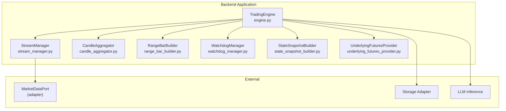
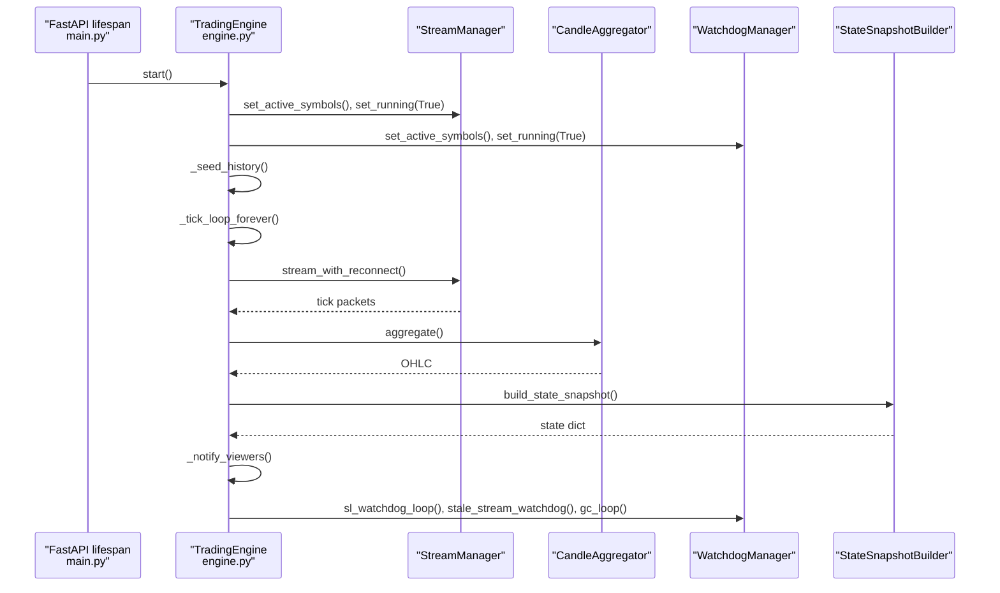
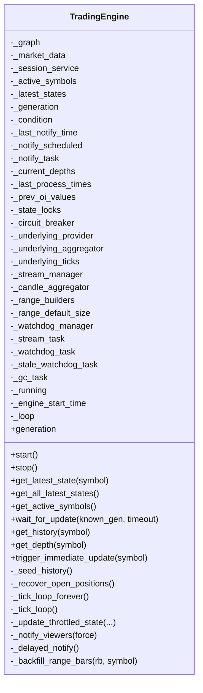
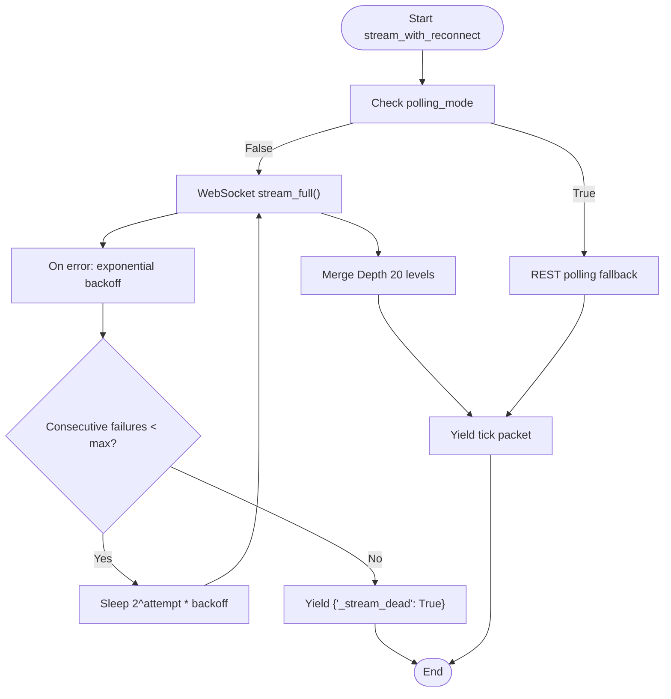
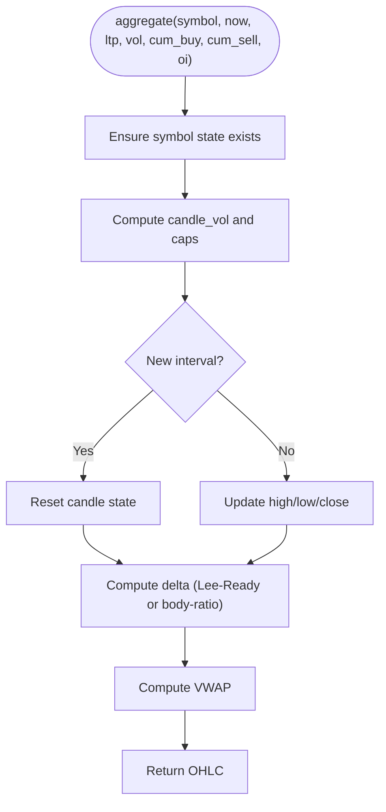
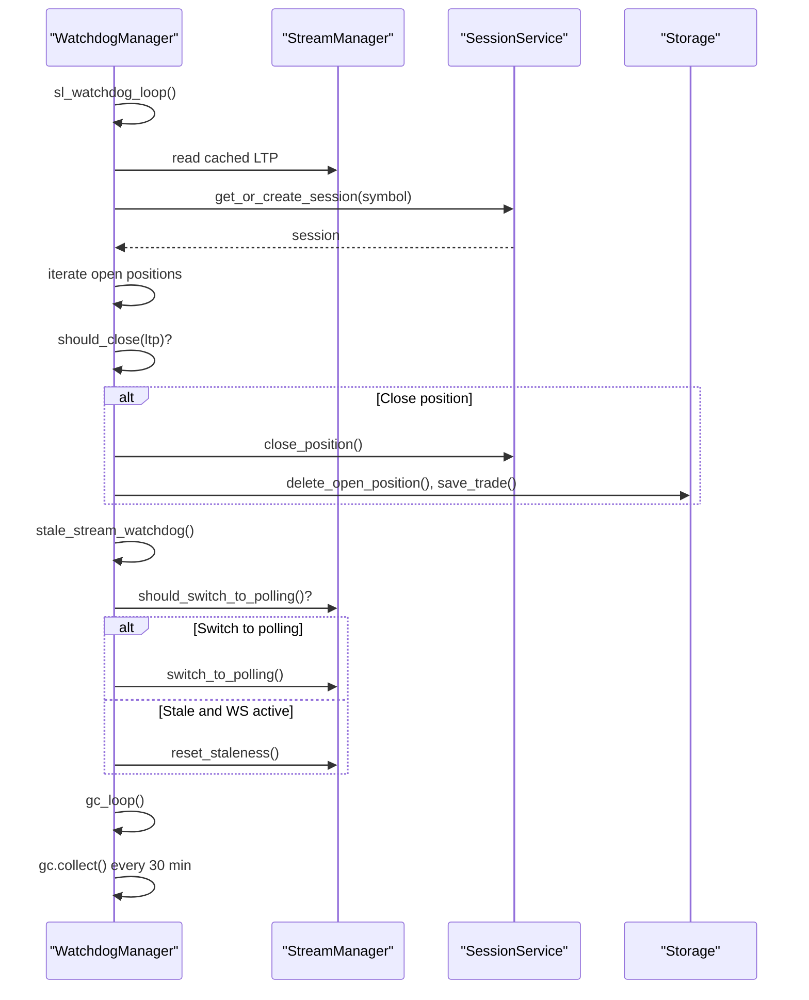
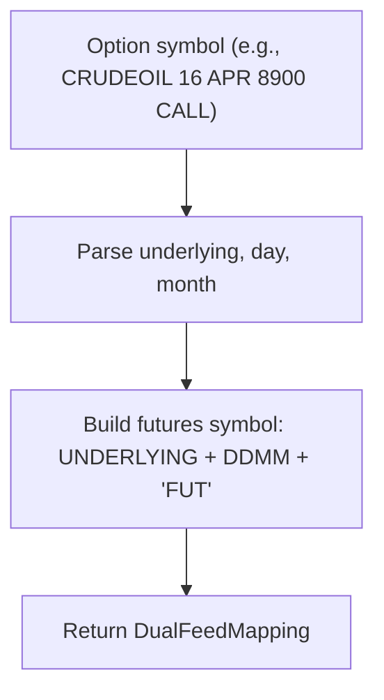
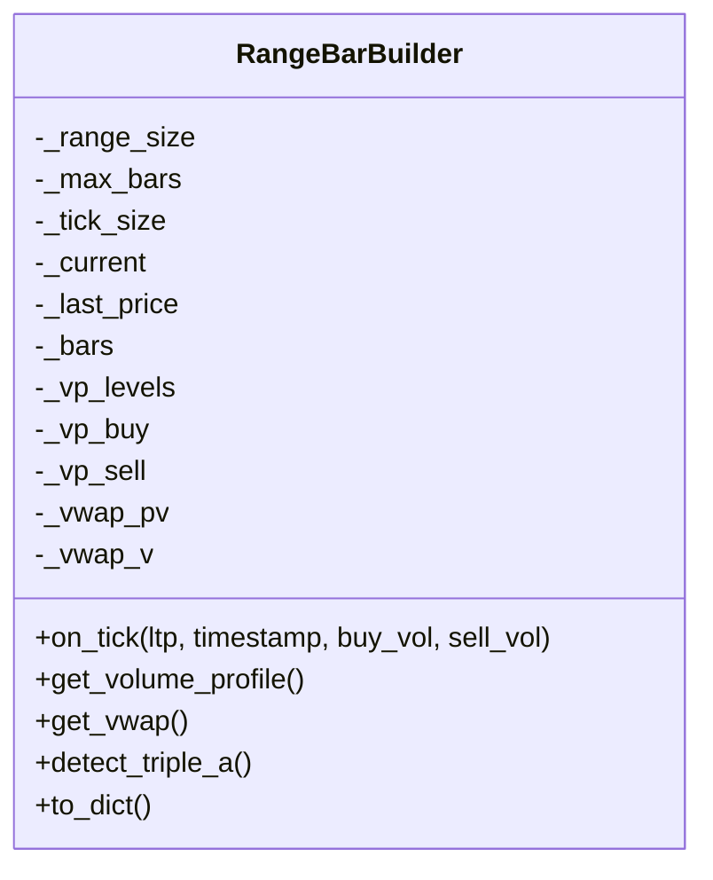
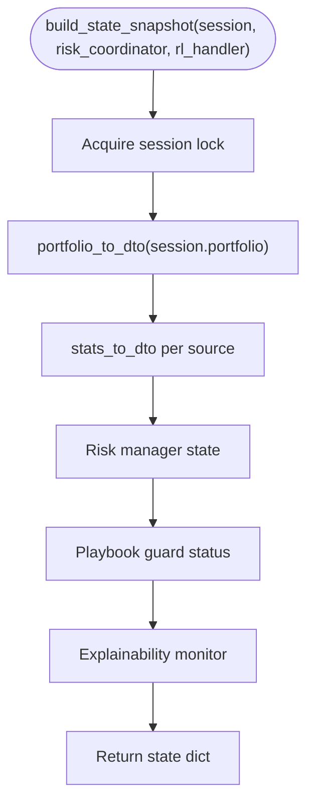
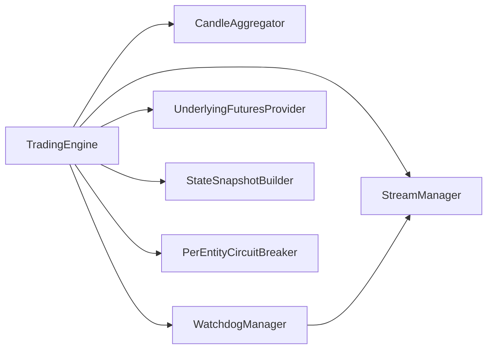

# Trading Engine

<cite>
**Referenced Files in This Document**
- [engine.py](file://backend/app/application/engine.py)
- [stream_manager.py](file://backend/app/application/stream_manager.py)
- [candle_aggregator.py](file://backend/app/application/candle_aggregator.py)
- [watchdog_manager.py](file://backend/app/application/watchdog_manager.py)
- [main.py](file://backend/app/main.py)
- [state_snapshot_builder.py](file://backend/app/application/services/state_snapshot_builder.py)
- [underlying_futures_provider.py](file://backend/app/domain/services/underlying_futures_provider.py)
- [range_bar_builder.py](file://backend/app/application/range_bar_builder.py)
- [resilience.py](file://shared/resilience.py)
</cite>

## Table of Contents
1. [Introduction](#introduction)
2. [Project Structure](#project-structure)
3. [Core Components](#core-components)
4. [Architecture Overview](#architecture-overview)
5. [Detailed Component Analysis](#detailed-component-analysis)
6. [Dependency Analysis](#dependency-analysis)
7. [Performance Considerations](#performance-considerations)
8. [Troubleshooting Guide](#troubleshooting-guide)
9. [Conclusion](#conclusion)
10. [Appendices](#appendices)

## Introduction
The TradingEngine is the standalone trading loop that operates independently of frontend WebSocket connections. It delegates to focused modules:
- StreamManager: Market data streaming and reconnection
- CandleAggregator: Tick-to-candle aggregation and OHLCV/VWAP/delta computation
- WatchdogManager: SL/TP watchdog and stream health monitoring

The engine’s lifecycle is orchestrated via FastAPI lifespan, ensuring the trading loop starts on server boot and stops gracefully on shutdown. It implements a dual-feed mechanism for underlying futures processing, mid-trade recovery for position restoration, throttled processing for performance, and a circuit breaker pattern for resilience.

## Project Structure
The TradingEngine resides in the backend application layer and coordinates with supporting modules for streaming, aggregation, watchdogs, and state building.

**Diagram sources**
- [engine.py:1-120](file://backend/app/application/engine.py#L1-L120)
- [stream_manager.py:32-65](file://backend/app/application/stream_manager.py#L32-L65)
- [candle_aggregator.py:73-96](file://backend/app/application/candle_aggregator.py#L73-L96)
- [watchdog_manager.py:34-62](file://backend/app/application/watchdog_manager.py#L34-L62)
- [range_bar_builder.py:74-95](file://backend/app/application/range_bar_builder.py#L74-L95)
- [state_snapshot_builder.py:22-72](file://backend/app/application/services/state_snapshot_builder.py#L22-L72)
- [underlying_futures_provider.py:104-122](file://backend/app/domain/services/underlying_futures_provider.py#L104-L122)

**Section sources**
- [engine.py:1-120](file://backend/app/application/engine.py#L1-L120)
- [main.py:83-127](file://backend/app/main.py#L83-L127)

## Core Components
- TradingEngine: Orchestrates streaming, aggregation, state building, and viewer notifications. Implements throttled processing, dual-feed futures, mid-trade recovery, and circuit breaker resilience.
- StreamManager: Provides robust WS streaming with reconnection, fallback polling, and depth caching.
- CandleAggregator: Builds OHLCV candles, computes VWAP, delta, and footprint accumulation.
- WatchdogManager: Runs SL/TP checks and stream health monitoring independently of the tick loop.
- UnderlyingFuturesProvider: Maps option contracts to underlying futures for dual-feed AMT analysis.
- RangeBarBuilder: Computes price-range bars for visualization and analytics.
- StateSnapshotBuilder: Pure DTO formatting for UI state snapshots.

**Section sources**
- [engine.py:59-126](file://backend/app/application/engine.py#L59-L126)
- [stream_manager.py:32-65](file://backend/app/application/stream_manager.py#L32-L65)
- [candle_aggregator.py:73-96](file://backend/app/application/candle_aggregator.py#L73-L96)
- [watchdog_manager.py:34-62](file://backend/app/application/watchdog_manager.py#L34-L62)
- [underlying_futures_provider.py:104-122](file://backend/app/domain/services/underlying_futures_provider.py#L104-L122)
- [range_bar_builder.py:74-95](file://backend/app/application/range_bar_builder.py#L74-L95)
- [state_snapshot_builder.py:22-72](file://backend/app/application/services/state_snapshot_builder.py#L22-L72)

## Architecture Overview
The engine is a server-side trading system that:
- Starts on FastAPI lifespan and continues running after frontend disconnects
- Streams ticks via StreamManager, aggregates via CandleAggregator, and builds state via StateSnapshotBuilder
- Monitors health and SL/TP via WatchdogManager
- Supports dual-feed futures for AMT analysis and mid-trade recovery on startup

**Diagram sources**
- [main.py:83-127](file://backend/app/main.py#L83-L127)
- [engine.py:131-177](file://backend/app/application/engine.py#L131-L177)
- [engine.py:620-862](file://backend/app/application/engine.py#L620-L862)
- [stream_manager.py:135-289](file://backend/app/application/stream_manager.py#L135-L289)
- [candle_aggregator.py:114-141](file://backend/app/application/candle_aggregator.py#L114-L141)
- [watchdog_manager.py:63-175](file://backend/app/application/watchdog_manager.py#L63-L175)
- [state_snapshot_builder.py:22-72](file://backend/app/application/services/state_snapshot_builder.py#L22-L72)

## Detailed Component Analysis

### TradingEngine
- Responsibilities:
  - Startup/shutdown lifecycle via lifespan
  - Seed historical data and build initial state
  - Stream ticks, aggregate candles, and run the trading pipeline
  - Throttled processing (max once per 500 ms per symbol)
  - Dual-feed futures aggregation for AMT analysis
  - Mid-trade recovery to restore open positions on startup
  - Cross-thread notification to WebSocket viewers
  - Circuit breaker per symbol for resilience
- Key APIs:
  - start(): Initializes modules, seeds history, starts tasks
  - stop(): Cancels tasks and logs shutdown
  - get_latest_state(symbol): Thread-safe read-only access
  - wait_for_update(known_gen): Generation-based blocking wait
  - trigger_immediate_update(symbol): Cross-thread state refresh
  - get_history(symbol), get_depth(symbol)

**Diagram sources**
- [engine.py:59-126](file://backend/app/application/engine.py#L59-L126)
- [engine.py:131-208](file://backend/app/application/engine.py#L131-L208)
- [engine.py:281-358](file://backend/app/application/engine.py#L281-L358)
- [engine.py:620-862](file://backend/app/application/engine.py#L620-L862)
- [engine.py:867-981](file://backend/app/application/engine.py#L867-L981)

**Section sources**
- [engine.py:59-126](file://backend/app/application/engine.py#L59-L126)
- [engine.py:131-208](file://backend/app/application/engine.py#L131-L208)
- [engine.py:281-358](file://backend/app/application/engine.py#L281-L358)
- [engine.py:620-862](file://backend/app/application/engine.py#L620-L862)
- [engine.py:867-981](file://backend/app/application/engine.py#L867-L981)

### StreamManager
- Responsibilities:
  - Market data streaming with reconnection
  - Depth 20 WebSocket caching merged into full packets
  - Polling fallback for symbols without WS data (e.g., GOLD/SILVER MCX options)
  - Staleness detection and switching to polling
- Key APIs:
  - set_active_symbols(symbols), set_running(running)
  - update_tick_time(symbol), get_tick_count(symbol)
  - should_switch_to_polling(), switch_to_polling()
  - is_stale(threshold), reset_staleness()
  - stream_with_reconnect(connect_state)

**Diagram sources**
- [stream_manager.py:135-289](file://backend/app/application/stream_manager.py#L135-L289)

**Section sources**
- [stream_manager.py:32-65](file://backend/app/application/stream_manager.py#L32-L65)
- [stream_manager.py:135-289](file://backend/app/application/stream_manager.py#L135-L289)

### CandleAggregator
- Responsibilities:
  - Tick-to-candle aggregation with contextual caps for session resets
  - VWAP computation and delta classification (Lee-Ready or body-ratio proxy)
  - Footprint accumulation for order flow visualization
- Key APIs:
  - initialize_symbol(symbol), aggregate(...)
  - update_footprint(...), get_footprint(symbol)
  - validate_tick(tick)

**Diagram sources**
- [candle_aggregator.py:114-141](file://backend/app/application/candle_aggregator.py#L114-L141)
- [candle_aggregator.py:246-256](file://backend/app/application/candle_aggregator.py#L246-L256)

**Section sources**
- [candle_aggregator.py:73-96](file://backend/app/application/candle_aggregator.py#L73-L96)
- [candle_aggregator.py:114-141](file://backend/app/application/candle_aggregator.py#L114-L141)
- [candle_aggregator.py:246-256](file://backend/app/application/candle_aggregator.py#L246-L256)

### WatchdogManager
- Responsibilities:
  - Independent SL/TP watchdog running every second using cached LTP
  - Stale stream detection and forced reconnection or polling fallback
  - Periodic garbage collection to prevent memory leaks
- Key APIs:
  - sl_watchdog_loop(), stale_stream_watchdog(), gc_loop()

**Diagram sources**
- [watchdog_manager.py:63-175](file://backend/app/application/watchdog_manager.py#L63-L175)

**Section sources**
- [watchdog_manager.py:34-62](file://backend/app/application/watchdog_manager.py#L34-L62)
- [watchdog_manager.py:63-175](file://backend/app/application/watchdog_manager.py#L63-L175)

### UnderlyingFuturesProvider
- Responsibilities:
  - Maps option contracts to underlying futures for dual-feed AMT analysis
  - Dynamically derives futures symbols from option expiry dates
- Key APIs:
  - get_mapping(option_symbol), get_underlying_symbol(option_symbol)

**Diagram sources**
- [underlying_futures_provider.py:159-210](file://backend/app/domain/services/underlying_futures_provider.py#L159-L210)

**Section sources**
- [underlying_futures_provider.py:104-122](file://backend/app/domain/services/underlying_futures_provider.py#L104-L122)
- [underlying_futures_provider.py:159-210](file://backend/app/domain/services/underlying_futures_provider.py#L159-L210)

### RangeBarBuilder
- Responsibilities:
  - Builds price-range bars (not time-based) for visualization and analytics
  - Computes volume profile, VWAP, and Triple-A pattern detection
- Key APIs:
  - on_tick(...), get_volume_profile(), get_vwap(), detect_triple_a(), to_dict()

**Diagram sources**
- [range_bar_builder.py:74-95](file://backend/app/application/range_bar_builder.py#L74-L95)

**Section sources**
- [range_bar_builder.py:74-95](file://backend/app/application/range_bar_builder.py#L74-L95)

### StateSnapshotBuilder
- Responsibilities:
  - Pure DTO formatting for UI state snapshots
  - Aggregates portfolio, stats, risk state, playbook guard, and explainability
- Key API:
  - build_state_snapshot(session, risk_coordinator, rl_handler)

**Diagram sources**
- [state_snapshot_builder.py:22-72](file://backend/app/application/services/state_snapshot_builder.py#L22-L72)

**Section sources**
- [state_snapshot_builder.py:22-72](file://backend/app/application/services/state_snapshot_builder.py#L22-L72)

## Dependency Analysis
- TradingEngine depends on:
  - StreamManager for market data
  - CandleAggregator for OHLCV and delta
  - WatchdogManager for SL/TP and stream health
  - UnderlyingFuturesProvider for dual-feed mapping
  - StateSnapshotBuilder for UI state DTOs
- Resilience:
  - PerEntityCircuitBreaker monitors per-symbol failures and opens the circuit to protect downstream processing

**Diagram sources**
- [engine.py:108-117](file://backend/app/application/engine.py#L108-L117)
- [resilience.py:135-161](file://shared/resilience.py#L135-L161)

**Section sources**
- [engine.py:108-117](file://backend/app/application/engine.py#L108-L117)
- [resilience.py:135-161](file://shared/resilience.py#L135-L161)

## Performance Considerations
- Throttled processing:
  - process_tick executes at most once every 500 ms per symbol to reduce CPU load
- Notification batching:
  - Viewer notifications are throttled to 150 ms minimum spacing with delayed scheduling
- Memory hygiene:
  - GC loop runs every 30 minutes to prevent memory leaks in long-running sessions
- Dual-feed futures:
  - Underlying futures are aggregated separately to avoid impacting option processing throughput
- Validation:
  - Tick validation prevents invalid OHLC from entering the pipeline

[No sources needed since this section provides general guidance]

## Troubleshooting Guide
- Engine fails to start:
  - Verify lifespan startup in main.py and that TradingEngine.start() completes without exceptions
- No ticks or stale stream:
  - WatchdogManager stale_stream_watchdog will switch to polling if WS produces no ticks within the first 60 seconds
- Frequent reconnections:
  - StreamManager applies exponential backoff; check broker connectivity and network stability
- Positions closing unexpectedly:
  - WatchdogManager sl_watchdog_loop evaluates cached LTP and may force-close based on SL/TP thresholds
- Viewer not receiving updates:
  - Use wait_for_update with generation counter; ensure _notify_viewers is invoked and not throttled
- Mid-trade recovery:
  - On startup, engine loads open positions from storage and registers them with lifecycle handler

**Section sources**
- [main.py:83-127](file://backend/app/main.py#L83-L127)
- [watchdog_manager.py:130-175](file://backend/app/application/watchdog_manager.py#L130-L175)
- [stream_manager.py:135-289](file://backend/app/application/stream_manager.py#L135-L289)
- [engine.py:178-208](file://backend/app/application/engine.py#L178-L208)

## Conclusion
The TradingEngine is a resilient, server-side trading loop that remains independent of frontend connections. It integrates robust streaming, candle aggregation, watchdog monitoring, dual-feed futures, and mid-trade recovery. Its throttled processing and circuit breaker pattern ensure stability under stress, while generation-based notifications keep viewers synchronized efficiently.

[No sources needed since this section summarizes without analyzing specific files]

## Appendices

### Practical Examples

- Engine initialization and startup
  - Reference: [main.py:83-127](file://backend/app/main.py#L83-L127)
  - Reference: [engine.py:131-177](file://backend/app/application/engine.py#L131-L177)

- Symbol management
  - Active symbols set on StreamManager and WatchdogManager
  - Reference: [engine.py:141-144](file://backend/app/application/engine.py#L141-L144)

- State snapshot building
  - Pure DTO formatting for UI consumption
  - Reference: [state_snapshot_builder.py:22-72](file://backend/app/application/services/state_snapshot_builder.py#L22-L72)

- Cross-thread notification mechanisms
  - trigger_immediate_update uses event loop reference to schedule notification safely
  - Reference: [engine.py:281-358](file://backend/app/application/engine.py#L281-L358)

- Circuit breaker pattern
  - Per-entity breaker records failures and protects downstream processing
  - Reference: [resilience.py:135-161](file://shared/resilience.py#L135-L161)