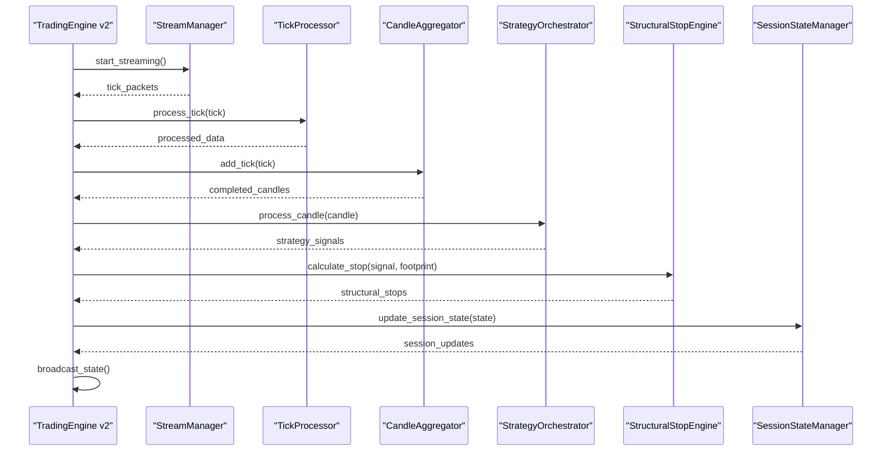
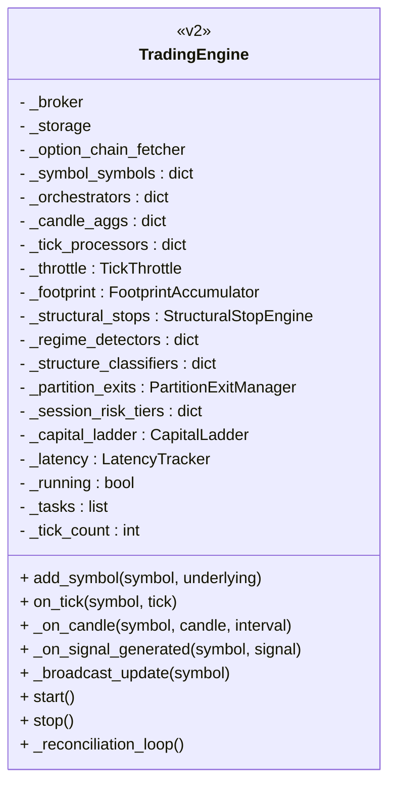
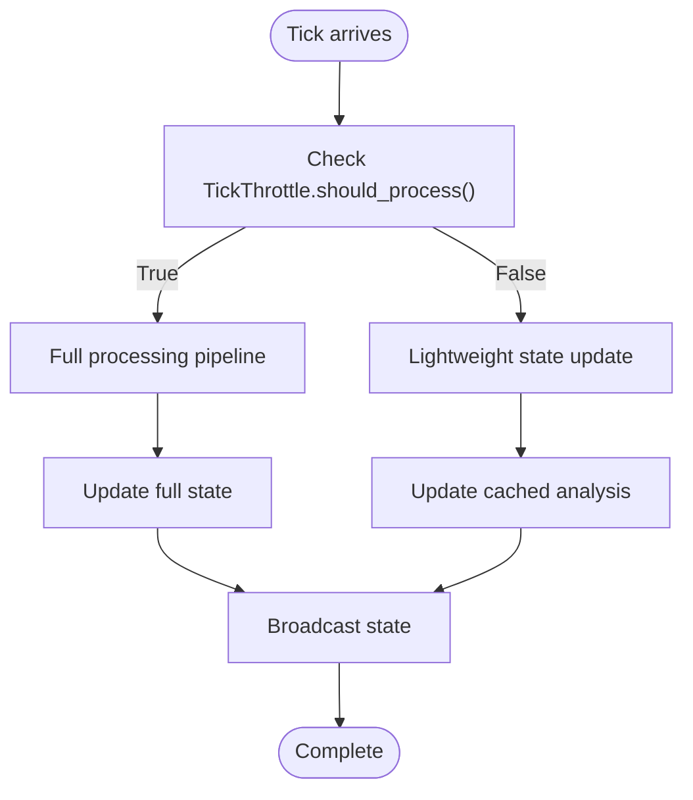
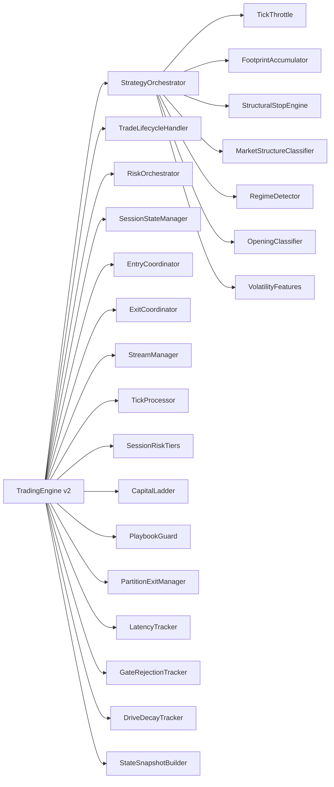

# Trading Engine

<cite>
**Referenced Files in This Document**
- [trading_engine.py](file://appv2/backend/appv2/application/trading_engine.py)
- [tick_throttle.py](file://appv2/backend/appv2/domain/services/tick_throttle.py)
- [footprint_accumulator.py](file://appv2/backend/appv2/domain/services/footprint_accumulator.py)
- [structural_stop_engine.py](file://appv2/backend/appv2/domain/services/structural_stop_engine.py)
- [market_structure_classifier.py](file://appv2/backend/appv2/domain/services/market_structure_classifier.py)
- [regime_detector.py](file://appv2/backend/appv2/domain/services/regime_detector.py)
- [opening_classifier.py](file://appv2/backend/appv2/domain/services/opening_classifier.py)
- [partition_exit_manager.py](file://appv2/backend/appv2/domain/services/partition_exit_manager.py)
- [playbook_guard.py](file://appv2/backend/appv2/domain/services/playbook_guard.py)
- [session_risk_tiers.py](file://appv2/backend/appv2/domain/services/session_risk_tiers.py)
- [capital_ladder.py](file://appv2/backend/appv2/domain/services/capital_ladder.py)
- [drive_decay.py](file://appv2/backend/appv2/domain/services/drive_decay.py)
- [latency_tracker.py](file://appv2/backend/appv2/domain/services/latency_tracker.py)
- [gate_rejection_tracker.py](file://appv2/backend/appv2/domain/services/gate_rejection_tracker.py)
- [volatility_features.py](file://appv2/backend/appv2/domain/services/volatility_features.py)
- [state_snapshot_builder.py](file://appv2/backend/appv2/domain/services/state_snapshot_builder.py)
- [stream_manager.py](file://appv2/backend/appv2/infrastructure/stream_manager.py)
- [tick_processor.py](file://appv2/backend/appv2/infrastructure/tick_processor.py)
- [strategy_orchestrator.py](file://appv2/backend/appv2/application/strategy_orchestrator.py)
- [trade_lifecycle.py](file://appv2/backend/appv2/application/trade_lifecycle.py)
- [risk_orchestrator.py](file://appv2/backend/appv2/application/risk_orchestrator.py)
- [session_state_manager.py](file://appv2/backend/appv2/application/session_state_manager.py)
- [entry_coordinator.py](file://appv2/backend/appv2/application/entry_coordinator.py)
- [exit_coordinator.py](file://appv2/backend/appv2/application/exit_coordinator.py)
- [trade_journal.py](file://appv2/backend/appv2/domain/services/trade_journal.py)
- [position_reconciliation.py](file://appv2/backend/appv2/domain/services/position_reconciliation.py)
- [mobile_alerts.py](file://appv2/backend/appv2/domain/services/mobile_alerts.py)
- [game_state_broadcaster.py](file://appv2/backend/appv2/api/state_broadcaster.py)
- [settings.py](file://appv2/backend/appv2/config/settings.py)
</cite>

## Update Summary
**Changes Made**
- Complete rewrite of TradingEngine to v2 with 575 lines of new functionality
- Added comprehensive throttle mechanisms (500ms per symbol)
- Implemented footprint accumulation with delta-colored profiles
- Integrated structural stop engines with order flow-based SL placement
- Added market structure classification (5-state model)
- Introduced regime detection for volatility and trend analysis
- Enhanced exit management with partition exit strategies
- Added session risk management and capital ladder systems
- Implemented comprehensive observability with latency tracking and gate rejection analysis
- Integrated advanced AMT classification and playbook guards

## Table of Contents
1. [Introduction](#introduction)
2. [Project Structure](#project-structure)
3. [Core Components](#core-components)
4. [Architecture Overview](#architecture-overview)
5. [Detailed Component Analysis](#detailed-component-analysis)
6. [Advanced Trading Features](#advanced-trading-features)
7. [Performance and Observability](#performance-and-observability)
8. [Risk Management Systems](#risk-management-systems)
9. [Dependency Analysis](#dependency-analysis)
10. [Performance Considerations](#performance-considerations)
11. [Troubleshooting Guide](#troubleshooting-guide)
12. [Conclusion](#conclusion)
13. [Appendices](#appendices)

## Introduction
TradingEngine v2 is a comprehensive trading system that represents a major evolution from the original backend implementation. This standalone trading loop operates independently of frontend WebSocket connections and incorporates advanced features for sophisticated market analysis and execution. The engine delegates to specialized modules while implementing a rich ecosystem of trading services including throttle mechanisms, footprint accumulation, structural stop engines, and comprehensive risk management systems.

Key enhancements include:
- **Throttle Mechanisms**: 500ms processing throttle per symbol to optimize performance
- **Footprint Accumulation**: Delta-colored volume profiles for order flow analysis
- **Structural Stop Engines**: Order flow-based stop-loss placement beyond aggressive prints
- **Market Structure Classification**: 5-state model with hysteresis for trend analysis
- **Regime Detection**: Volatility and trend regime classification
- **Partition Exit Management**: Staged exit strategies with scale-out targets
- **Session Risk Management**: Dynamic risk tiers and capital ladder systems
- **Comprehensive Observability**: Latency tracking and gate rejection analysis

## Project Structure
TradingEngine v2 is organized into distinct layers with clear separation of concerns:

```mermaid
graph TB
subgraph "Application Layer"
TE["TradingEngine v2<br/>trading_engine.py"]
SO["StrategyOrchestrator<br/>strategy_orchestrator.py"]
TLH["TradeLifecycleHandler<br/>trade_lifecycle.py"]
RO["RiskOrchestrator<br/>risk_orchestrator.py"]
SSM["SessionStateManager<br/>session_state_manager.py"]
EC["EntryCoordinator<br/>entry_coordinator.py"]
XC["ExitCoordinator<br/>exit_coordinator.py"]
end
subgraph "Infrastructure Layer"
SM["StreamManager<br/>stream_manager.py"]
TP["TickProcessor<br/>tick_processor.py"]
end
subgraph "Domain Services"
TT["TickThrottle<br/>tick_throttle.py"]
FA["FootprintAccumulator<br/>footprint_accumulator.py"]
SSE["StructuralStopEngine<br/>structural_stop_engine.py"]
MSC["MarketStructureClassifier<br/>market_structure_classifier.py"]
RD["RegimeDetector<br/>regime_detector.py"]
OC["OpeningClassifier<br/>opening_classifier.py"]
PEM["PartitionExitManager<br/>partition_exit_manager.py"]
PG["PlaybookGuard<br/>playbook_guard.py"]
SRT["SessionRiskTiers<br/>session_risk_tiers.py"]
CL["CapitalLadder<br/>capital_ladder.py"]
DD["DriveDecayTracker<br/>drive_decay.py"]
LT["LatencyTracker<br/>latency_tracker.py"]
GRT["GateRejectionTracker<br/>gate_rejection_tracker.py"]
VF["VolatilityFeatures<br/>volatility_features.py"]
SSB["StateSnapshotBuilder<br/>state_snapshot_builder.py"]
end
subgraph "External"
Broker["Broker Interface"]
Storage["Storage Interface"]
Telegram["Mobile Alerts"]
end
TE --> SO
TE --> TLH
TE --> RO
TE --> SSM
TE --> EC
TE --> XC
TE --> SM
TE --> TP
TE --> TT
TE --> FA
TE --> SSE
TE --> MSC
TE --> RD
TE --> OC
TE --> PEM
TE --> PG
TE --> SRT
TE --> CL
TE --> DD
TE --> LT
TE --> GRT
TE --> VF
TE --> SSB
SM --> Broker
TE --> Storage
TE --> Telegram
```



**Diagram sources**
- [trading_engine.py:77-180](file://appv2/backend/appv2/application/trading_engine.py#L77-L180)
- [strategy_orchestrator.py](file://appv2/backend/appv2/application/strategy_orchestrator.py)
- [trade_lifecycle.py](file://appv2/backend/appv2/application/trade_lifecycle.py)
- [risk_orchestrator.py](file://appv2/backend/appv2/application/risk_orchestrator.py)
- [session_state_manager.py](file://appv2/backend/appv2/application/session_state_manager.py)
- [entry_coordinator.py](file://appv2/backend/appv2/application/entry_coordinator.py)
- [exit_coordinator.py](file://appv2/backend/appv2/application/exit_coordinator.py)
- [stream_manager.py](file://appv2/backend/appv2/infrastructure/stream_manager.py)
- [tick_processor.py](file://appv2/backend/appv2/infrastructure/tick_processor.py)
- [tick_throttle.py](file://appv2/backend/appv2/domain/services/tick_throttle.py)
- [footprint_accumulator.py](file://appv2/backend/appv2/domain/services/footprint_accumulator.py)
- [structural_stop_engine.py](file://appv2/backend/appv2/domain/services/structural_stop_engine.py)
- [market_structure_classifier.py](file://appv2/backend/appv2/domain/services/market_structure_classifier.py)
- [regime_detector.py](file://appv2/backend/appv2/domain/services/regime_detector.py)
- [opening_classifier.py](file://appv2/backend/appv2/domain/services/opening_classifier.py)
- [partition_exit_manager.py](file://appv2/backend/appv2/domain/services/partition_exit_manager.py)
- [playbook_guard.py](file://appv2/backend/appv2/domain/services/playbook_guard.py)
- [session_risk_tiers.py](file://appv2/backend/appv2/domain/services/session_risk_tiers.py)
- [capital_ladder.py](file://appv2/backend/appv2/domain/services/capital_ladder.py)
- [drive_decay.py](file://appv2/backend/appv2/domain/services/drive_decay.py)
- [latency_tracker.py](file://appv2/backend/appv2/domain/services/latency_tracker.py)
- [gate_rejection_tracker.py](file://appv2/backend/appv2/domain/services/gate_rejection_tracker.py)
- [volatility_features.py](file://appv2/backend/appv2/domain/services/volatility_features.py)
- [state_snapshot_builder.py](file://appv2/backend/appv2/domain/services/state_snapshot_builder.py)

**Section sources**
- [trading_engine.py:77-180](file://appv2/backend/appv2/application/trading_engine.py#L77-L180)

## Core Components
TradingEngine v2 consists of several interconnected components working together to provide comprehensive trading automation:

### TradingEngine v2
The central orchestrator managing the complete trading pipeline with advanced features:
- **Symbol Registration**: Dynamic symbol addition with underlying mapping
- **Throttle Management**: 500ms processing throttle per symbol
- **Footprint Processing**: Delta-colored volume profile accumulation
- **Advanced Analysis**: Market structure, regime detection, and AMT classification
- **Exit Management**: Structured partition exit strategies
- **Risk Control**: Comprehensive session risk management
- **Observability**: Latency tracking and gate rejection analysis

### StrategyOrchestrator
Coordinates trading strategies with comprehensive analysis:
- **AMT Analysis**: Advanced Market Theory observations and signals
- **Gate Evaluation**: Multi-layered entry gating system
- **Signal Generation**: Structured entry and exit signals
- **Position Management**: Integration with trade lifecycle

### Infrastructure Components
- **StreamManager**: Real-time market data streaming with broker integration
- **TickProcessor**: Advanced tick processing with OI tracking and range bars
- **GameStateBroadcaster**: WebSocket state broadcasting with delta compression

**Section sources**
- [trading_engine.py:77-180](file://appv2/backend/appv2/application/trading_engine.py#L77-L180)
- [strategy_orchestrator.py](file://appv2/backend/appv2/application/strategy_orchestrator.py)
- [stream_manager.py](file://appv2/backend/appv2/infrastructure/stream_manager.py)
- [tick_processor.py](file://appv2/backend/appv2/infrastructure/tick_processor.py)

## Architecture Overview
TradingEngine v2 implements a sophisticated trading architecture with clear separation of concerns and advanced analytical capabilities:



**Diagram sources**
- [trading_engine.py:219-487](file://appv2/backend/appv2/application/trading_engine.py#L219-L487)
- [stream_manager.py](file://appv2/backend/appv2/infrastructure/stream_manager.py)
- [tick_processor.py](file://appv2/backend/appv2/infrastructure/tick_processor.py)
- [strategy_orchestrator.py](file://appv2/backend/appv2/application/strategy_orchestrator.py)
- [structural_stop_engine.py](file://appv2/backend/appv2/domain/services/structural_stop_engine.py)
- [session_state_manager.py](file://appv2/backend/appv2/application/session_state_manager.py)

The architecture emphasizes:
- **Real-time Processing**: Asynchronous tick processing with throttling
- **Advanced Analytics**: Multiple concurrent analysis streams
- **Structured Exits**: Order flow-based stop-loss placement
- **Dynamic Risk Management**: Session-level risk adjustment
- **Comprehensive Monitoring**: Multi-dimensional observability

## Detailed Component Analysis

### TradingEngine v2 Core
The TradingEngine v2 serves as the central orchestrator with comprehensive trading capabilities:

#### Key Responsibilities:
- **Symbol Management**: Dynamic registration with underlying mapping
- **Processing Pipeline**: Throttled tick processing with advanced analysis
- **State Management**: Complete session state tracking and broadcasting
- **Risk Coordination**: Integration of multiple risk management systems
- **Exit Management**: Structured exit strategies with partition management

#### Advanced Features:
- **500ms Throttle**: Per-symbol processing throttle for performance optimization
- **Footprint Analysis**: Delta-colored volume profiles for order flow insights
- **Structural Stops**: Order flow-based stop-loss placement beyond aggressive prints
- **Market Structure**: 5-state classification with hysteresis
- **Regime Detection**: Volatility and trend regime analysis
- **Partition Exits**: Staged exit strategies with scale-out targets



**Diagram sources**
- [trading_engine.py:77-180](file://appv2/backend/appv2/application/trading_engine.py#L77-L180)
- [trading_engine.py:186-218](file://appv2/backend/appv2/application/trading_engine.py#L186-L218)
- [trading_engine.py:219-487](file://appv2/backend/appv2/application/trading_engine.py#L219-L487)

**Section sources**
- [trading_engine.py:77-180](file://appv2/backend/appv2/application/trading_engine.py#L77-L180)
- [trading_engine.py:186-218](file://appv2/backend/appv2/application/trading_engine.py#L186-L218)
- [trading_engine.py:219-487](file://appv2/backend/appv2/application/trading_engine.py#L219-L487)

### StrategyOrchestrator
Coordinates comprehensive trading strategies with advanced market analysis:

#### Responsibilities:
- **AMT Analysis**: Advanced Market Theory observations and pattern recognition
- **Gate Evaluation**: Multi-layered entry gating with rejection tracking
- **Signal Generation**: Structured entry and exit signals with risk parameters
- **Integration**: Seamless coordination with risk management and execution systems

#### Advanced Features:
- **Session Phase Detection**: Market session phase analysis
- **Volume Profile Analysis**: POCA, VAH, VAL calculations
- **Aggression Scoring**: Market participation intensity measurement
- **Cross-Index Correlation**: Multi-market correlation tracking

**Section sources**
- [strategy_orchestrator.py](file://appv2/backend/appv2/application/strategy_orchestrator.py)

### Infrastructure Components

#### StreamManager
Real-time market data streaming with broker integration:
- **WebSocket Streaming**: Direct broker connection for tick data
- **Fallback Mechanisms**: REST polling for symbols without WS data
- **Connection Management**: Automatic reconnection with exponential backoff
- **Symbol Subscription**: Dynamic symbol subscription management

#### TickProcessor
Advanced tick processing with comprehensive analysis:
- **OI Tracking**: Open interest monitoring and analysis
- **Depth Processing**: Order book reconstruction and analysis
- **Range Bar Builder**: Price-range based technical analysis
- **Footprint Accumulation**: Volume profile construction

**Section sources**
- [stream_manager.py](file://appv2/backend/appv2/infrastructure/stream_manager.py)
- [tick_processor.py](file://appv2/backend/appv2/infrastructure/tick_processor.py)

## Advanced Trading Features

### Tick Throttle System
Implements precise processing control to optimize performance:



**Diagram sources**
- [tick_throttle.py:24-42](file://appv2/backend/appv2/domain/services/tick_throttle.py#L24-L42)

#### Key Features:
- **Per-Symbol Throttling**: 500ms minimum interval per symbol
- **Time-Based Control**: Monotonic time tracking for accuracy
- **Reset Functionality**: Individual symbol and global reset options
- **Performance Optimization**: Reduces CPU load during high-frequency markets

**Section sources**
- [tick_throttle.py:12-53](file://appv2/backend/appv2/domain/services/tick_throttle.py#L12-L53)

### Footprint Accumulator
Advanced volume profile analysis with delta coloring:

#### Core Functionality:
- **Delta Classification**: Buy/sell aggressive print identification
- **Imbalance Detection**: Stacked imbalance level finding
- **Volume Profile Construction**: Complete footprint candle building
- **Real-time Analysis**: Continuous accumulation during trading hours

#### Advanced Features:
- **Stacked Imbalance Detection**: 3+ consecutive imbalances
- **Confidence Scoring**: Imbalance strength assessment
- **Level Analysis**: Bid/ask volume distribution per price level
- **Historical Tracking**: Persistent footprint data management

**Section sources**
- [footprint_accumulator.py:45-205](file://appv2/backend/appv2/domain/services/footprint_accumulator.py#L45-L205)

### Structural Stop Engine
Order flow-based stop-loss placement beyond aggressive prints:

#### Priority System:
1. **Footprint Analysis**: Aggressive print levels from order flow
2. **Known Aggressive Levels**: Predefined print locations
3. **LVN Detection**: Low Volume Node acceleration zones
4. **Value Area Protection**: Traditional VAH/VAL support/resistance

#### Key Features:
- **Directional SL Placement**: Long/short specific stop calculation
- **Confidence Scoring**: Stop quality assessment
- **Buffer Management**: 1-2 tick protection from aggressive prints
- **Distance Calculation**: Risk-per-unit measurement

**Section sources**
- [structural_stop_engine.py:27-220](file://appv2/backend/appv2/domain/services/structural_stop_engine.py#L27-L220)

### Market Structure Classification
5-state market structure with hysteresis for trend analysis:

#### Structure States:
1. **BALANCED**: Price rotating around POC, 70%+ inside VA
2. **INITIATIVE_IMBALANCE**: Breakout with acceptance - trending
3. **RESPONSIVE_IMBALANCE**: Failed breakout, snapping back
4. **EXCESS**: Extreme move, climactic volume - exhaustion
5. **TRANSITION**: Between states - wait for clarity

#### Hysteresis Benefits:
- **Stability**: Prevents rapid state flipping
- **Trend Confirmation**: Requires sustained patterns
- **Reduced Whipsaws**: Filters false signals
- **Confidence Scoring**: State transition probability

**Section sources**
- [market_structure_classifier.py:36-144](file://appv2/backend/appv2/domain/services/market_structure_classifier.py#L36-L144)

### Regime Detection
Multi-dimensional market regime classification:

#### Regime Categories:
- **LOW_VOLATILITY**: Tight range, low volume - avoid breakouts
- **NORMAL**: Standard conditions - all setups valid
- **HIGH_VOLATILITY**: Wide range, high volume - wider stops, smaller size
- **TRENDING**: Sustained directional movement - trend following
- **CHOPPY**: Directionless, overlapping candles - mean reversion only
- **TRANSITION**: Regime changing - reduced size, wait for clarity

#### Analytical Framework:
- **ATR Percentage**: Volatility relative to price
- **Trend Strength**: Linear regression slope (-1 to 1)
- **Volume Ratio**: Current vs average volume
- **Efficiency Ratio**: Net move vs total distance

**Section sources**
- [regime_detector.py:37-213](file://appv2/backend/appv2/domain/services/regime_detector.py#L37-L213)

### Opening Classifier
30-minute opening pattern recognition:

#### Opening Types:
1. **Open Drive (OD)**: Strong directional move from open, holds
2. **Open Test & Rejection (OTR)**: Tests one side, rejects back
3. **Open Rejection Both Sides (ORB)**: Tests both sides, stays in middle
4. **Open Auction (OA)**: Wide range, finds balance through rotation

#### Analytical Approach:
- **Wick Analysis**: Upper/lower wick percentage calculation
- **Bullish/Bearish Count**: Directional bar counting
- **Net Movement**: Final close vs open comparison
- **Confidence Scoring**: Pattern recognition reliability

**Section sources**
- [opening_classifier.py:38-206](file://appv2/backend/appv2/domain/services/opening_classifier.py#L38-L206)

### Partition Exit Management
Structured exit strategies with staged scaling:

#### Exit Tranches:
1. **+1R Target**: 40% partial exit at first profit target
2. **+1.5R Target**: 30% partial exit at second profit target
3. **Full Exit**: Remaining position exit at take profit or VWAP trail

#### Advanced Features:
- **Opposition Signal Trigger**: Early exit on order-flow reversal
- **VWAP Trail Management**: Dynamic trailing stops
- **Profit Realization**: Progressive profit capture
- **Risk Management**: Maintains position discipline

**Section sources**
- [partition_exit_manager.py:49-178](file://appv2/backend/appv2/domain/services/partition_exit_manager.py#L49-L178)

## Performance and Observability

### Latency Tracking System
Comprehensive performance monitoring with percentile analysis:

#### Metrics Collection:
- **p50 (Median)**: Typical processing latency
- **p95 (95th Percentile)**: Near-worst case performance
- **p99 (99th Percentile)**: Worst-case scenario latency
- **Max**: Absolute maximum observed latency
- **Sample Count**: Total measurements collected

#### Threshold Alerts:
- **Warning Level**: p95 > 50ms
- **Critical Level**: p99 > 100ms
- **Automatic Monitoring**: Continuous performance tracking

**Section sources**
- [latency_tracker.py:29-98](file://appv2/backend/appv2/domain/services/latency_tracker.py#L29-L98)

### Gate Rejection Tracker
Advanced analytics for entry gating performance:

#### Tracking Capabilities:
- **Total Evaluation Count**: Signals evaluated
- **Rejection Statistics**: Rejection reasons and frequencies
- **Per-Gate Analysis**: Individual gate performance metrics
- **Symbol-Specific Tracking**: Performance by trading symbol
- **Trend Analysis**: Recent rejection pattern trends

#### Statistical Analysis:
- **Overall Rejection Rate**: Percentage of rejected signals
- **Recent Trend Detection**: Increasing/decreasing rejection patterns
- **Top Gate Analysis**: Most common rejection reasons
- **Session Duration**: Trading session timing

**Section sources**
- [gate_rejection_tracker.py:28-117](file://appv2/backend/appv2/domain/services/gate_rejection_tracker.py#L28-L117)

### Drive Decay Tracker
Exhaustion pattern detection for trend continuation analysis:

#### Drive Analysis:
- **Consecutive Push Tracking**: Same-direction movement counting
- **Volume Decay Measurement**: Successive drive volume comparison
- **Range Contraction Analysis**: Price range reduction over drives
- **Exhaustion Detection**: D3+ pattern recognition

#### Decision Framework:
- **D3+ Exhaustion**: 3+ drives with >50% volume decay
- **Reversal Probability**: Calculated based on decay metrics
- **Recommendation System**: CONTINUE/REDUCE/REVERSE decisions
- **Timing Signals**: Optimal entry/exit points based on decay

**Section sources**
- [drive_decay.py:25-119](file://appv2/backend/appv2/domain/services/drive_decay.py#L25-L119)

## Risk Management Systems

### Session Risk Tiers
Dynamic risk adjustment based on session performance:

#### Risk Tiers:
1. **GREEN**: No losses, all gates passing - full size
2. **YELLOW**: 1 loss - reduced size (75%)
3. **ORANGE**: 2 losses or 1 big loss - minimal size (50%)
4. **RED**: Daily stop hit - no new entries
5. **BLACK**: Circuit breaker open - system halt

#### Tier Calculation:
- **Circuit Breaker**: System-wide protection override
- **Daily Drawdown**: Portfolio value decline monitoring
- **Consecutive Losses**: Recent performance impact
- **Win Rate Analysis**: Success rate influence on size

**Section sources**
- [session_risk_tiers.py:39-158](file://appv2/backend/appv2/domain/services/session_risk_tiers.py#L39-L158)

### Capital Ladder System
Cumulative position sizing based on session performance:

#### Ladder Rungs:
- **Rung 1**: Base size (100% capital)
- **Rung 2**: After 1R profit - add 25% to base
- **Rung 3**: After 2R profit - add 50% to base
- **Rung 4**: After 3R profit - add 100% to base (double down)
- **Reset**: After any loss - back to Rung 1

#### Performance Tracking:
- **Cumulative PnL**: Total session profitability
- **R-run Profits**: Total profit in risk units
- **Session Count**: Ladder progression tracking
- **Size Multiplier**: Dynamic position sizing

**Section sources**
- [capital_ladder.py:29-113](file://appv2/backend/appv2/domain/services/capital_ladder.py#L29-L113)

### Playbook Guard
Preventive trading discipline with rejection tracking:

#### Guard System:
- **Maximum Rejections**: 3 rejections per session threshold
- **Violation State**: Playbook breached - trading pause
- **Warning State**: Near violation - increased caution
- **Active State**: Normal trading conditions

#### Discipline Features:
- **Rejection Counting**: Gate rejection tracking
- **Reason Logging**: Rejection cause documentation
- **Session Reset**: Automatic reset at session start
- **Performance Impact**: Trading discipline enforcement

**Section sources**
- [playbook_guard.py:29-113](file://appv2/backend/appv2/domain/services/playbook_guard.py#L29-L113)

### Volatility Features
ATR-based volatility analysis and position sizing:

#### Volatility Regimes:
- **LOW**: ATR < 0.5% of price - full size
- **NORMAL**: 0.5% ≤ ATR < 1.5% - full size
- **HIGH**: 1.5% ≤ ATR < 3.0% - half size
- **EXTREME**: ATR ≥ 3.0% - quarter size

#### Risk Management:
- **ATR Calculation**: Adaptive true range measurement
- **Regime Classification**: Volatility state determination
- **Trailing Stops**: ATR-based dynamic stops
- **Size Adjustment**: Inverse volatility position sizing

**Section sources**
- [volatility_features.py:24-116](file://appv2/backend/appv2/domain/services/volatility_features.py#L24-L116)

## Dependency Analysis
TradingEngine v2 maintains clear dependency relationships with specialized services:



**Diagram sources**
- [trading_engine.py:77-180](file://appv2/backend/appv2/application/trading_engine.py#L77-L180)
- [strategy_orchestrator.py](file://appv2/backend/appv2/application/strategy_orchestrator.py)
- [tick_throttle.py](file://appv2/backend/appv2/domain/services/tick_throttle.py)
- [footprint_accumulator.py](file://appv2/backend/appv2/domain/services/footprint_accumulator.py)
- [structural_stop_engine.py](file://appv2/backend/appv2/domain/services/structural_stop_engine.py)
- [market_structure_classifier.py](file://appv2/backend/appv2/domain/services/market_structure_classifier.py)
- [regime_detector.py](file://appv2/backend/appv2/domain/services/regime_detector.py)
- [opening_classifier.py](file://appv2/backend/appv2/domain/services/opening_classifier.py)
- [volatility_features.py](file://appv2/backend/appv2/domain/services/volatility_features.py)
- [session_risk_tiers.py](file://appv2/backend/appv2/domain/services/session_risk_tiers.py)
- [capital_ladder.py](file://appv2/backend/appv2/domain/services/capital_ladder.py)
- [playbook_guard.py](file://appv2/backend/appv2/domain/services/playbook_guard.py)
- [partition_exit_manager.py](file://appv2/backend/appv2/domain/services/partition_exit_manager.py)
- [latency_tracker.py](file://appv2/backend/appv2/domain/services/latency_tracker.py)
- [gate_rejection_tracker.py](file://appv2/backend/appv2/domain/services/gate_rejection_tracker.py)
- [drive_decay.py](file://appv2/backend/appv2/domain/services/drive_decay.py)
- [state_snapshot_builder.py](file://appv2/backend/appv2/domain/services/state_snapshot_builder.py)

## Performance Considerations
TradingEngine v2 implements multiple optimization strategies:

### Processing Optimization
- **500ms Throttle**: Reduces CPU usage by limiting full processing frequency
- **Selective Broadcasting**: Only broadcasts when state changes significantly
- **Asynchronous Operations**: Non-blocking processing for better responsiveness
- **Memory Management**: Efficient state cleanup and garbage collection

### Network Optimization
- **Connection Pooling**: Reuses broker connections for efficiency
- **Fallback Mechanisms**: REST polling for symbols without WebSocket data
- **Error Recovery**: Automatic retry with exponential backoff
- **Bandwidth Management**: Optimized data transmission protocols

### Data Management
- **Delta Compression**: Only transmits changed state portions
- **Generation Tracking**: Efficient state synchronization
- **Cache Management**: Strategic caching of frequently accessed data
- **Cleanup Procedures**: Regular data pruning and memory optimization

## Troubleshooting Guide

### Engine Initialization Issues
- **Symbol Registration**: Ensure proper symbol and underlying mapping
- **Broker Connection**: Verify broker credentials and connectivity
- **Storage Setup**: Confirm storage interface configuration
- **Service Dependencies**: Check all required services are initialized

### Performance Problems
- **Latency Monitoring**: Use LatencyTracker to identify bottlenecks
- **Throttle Configuration**: Adjust TickThrottle settings if needed
- **Resource Limits**: Monitor CPU and memory usage
- **Network Connectivity**: Check broker connection stability

### Risk Management Issues
- **Session Risk Tiers**: Verify tier calculations and adjustments
- **Capital Ladder**: Check ladder progression and position sizing
- **Playbook Guard**: Monitor rejection tracking and discipline enforcement
- **Structural Stops**: Validate stop-loss placement accuracy

### Advanced Feature Troubleshooting
- **Footprint Analysis**: Verify delta classification accuracy
- **Market Structure**: Check state transitions and hysteresis
- **Regime Detection**: Validate volatility and trend classification
- **Partition Exits**: Monitor exit trigger accuracy and timing

**Section sources**
- [trading_engine.py:489-518](file://appv2/backend/appv2/application/trading_engine.py#L489-L518)
- [latency_tracker.py:61-86](file://appv2/backend/appv2/domain/services/latency_tracker.py#L61-L86)
- [session_risk_tiers.py:81-94](file://appv2/backend/appv2/domain/services/session_risk_tiers.py#L81-L94)
- [capital_ladder.py:95-105](file://appv2/backend/appv2/domain/services/capital_ladder.py#L95-L105)

## Conclusion
TradingEngine v2 represents a comprehensive evolution in automated trading systems, incorporating advanced analytical capabilities, sophisticated risk management, and extensive observability features. The 575 lines of new functionality introduce powerful features including throttle mechanisms, footprint accumulation, structural stop engines, and comprehensive market structure analysis.

Key strengths include:
- **Performance Optimization**: 500ms processing throttle reduces resource usage
- **Advanced Analysis**: Multiple concurrent analytical streams for comprehensive market insight
- **Risk Management**: Dynamic risk adjustment and capital ladder systems
- **Exit Management**: Structured partition exits with progressive profit capture
- **Observability**: Comprehensive performance and gate rejection tracking
- **Discipline**: Playbook guards and session risk tiers enforce trading discipline

The engine maintains independence from frontend connections while providing rich state information and comprehensive trading automation capabilities.

## Appendices

### Practical Implementation Examples

#### Engine Initialization and Symbol Registration
```python
# Initialize TradingEngine v2
engine = TradingEngine()

# Register symbols with underlying mapping
engine.add_symbol("NIFTY", underlying="NIFTY", tick_size=5.0)
engine.add_symbol("BANKNIFTY", underlying="BANKNIFTY", tick_size=10.0)
engine.add_symbol("CRUDEOIL", underlying="CRUDEOIL", tick_size=100.0)

# Start the engine
await engine.start()
```

**Section sources**
- [trading_engine.py:186-218](file://appv2/backend/appv2/application/trading_engine.py#L186-L218)
- [trading_engine.py:489-508](file://appv2/backend/appv2/application/trading_engine.py#L489-L508)

#### Advanced Throttle Usage
```python
# Check if symbol is ready for full processing
if engine._throttle.should_process(symbol):
    # Perform full processing
    await engine._on_candle(symbol, candle, interval)
else:
    # Lightweight state update only
    await engine._broadcast_update(symbol)
```

**Section sources**
- [trading_engine.py:256-261](file://appv2/backend/appv2/application/trading_engine.py#L256-L261)
- [tick_throttle.py:24-35](file://appv2/backend/appv2/domain/services/tick_throttle.py#L24-L35)

#### Footprint Analysis Integration
```python
# Access footprint data for analysis
footprint = engine._footprint.get_current_footprint(symbol)
if footprint:
    # Find stacked imbalances
    imbalances = engine._footprint.get_stacked_imbalances(symbol, min_stack=3)
    # Use imbalances for structural stop calculation
```

**Section sources**
- [footprint_accumulator.py:160-195](file://appv2/backend/appv2/domain/services/footprint_accumulator.py#L160-L195)

#### Risk Management Integration
```python
# Get session risk state
risk_state = engine._session_risk_tiers[symbol].get_state()
size_multiplier = risk_state.size_multiplier

# Calculate position size with risk adjustment
adjusted_size = base_size * size_multiplier

# Check if trading is permitted
if not risk_state.can_enter_trade:
    logger.warning(f"Trading blocked: {risk_state.reason}")
```

**Section sources**
- [session_risk_tiers.py:81-94](file://appv2/backend/appv2/domain/services/session_risk_tiers.py#L81-L94)

#### Observability and Monitoring
```python
# Get latency statistics
latency_stats = engine._latency.get_stats(symbol)
if latency_stats.critical:
    logger.warning(f"Critical latency: {latency_stats}")

# Get gate rejection statistics
gate_stats = engine._gate_rejections.get_stats()
logger.info(f"Rejection rate: {gate_stats.overall_rejection_rate}")
```

**Section sources**
- [latency_tracker.py:61-86](file://appv2/backend/appv2/domain/services/latency_tracker.py#L61-L86)
- [gate_rejection_tracker.py:68-107](file://appv2/backend/appv2/domain/services/gate_rejection_tracker.py#L68-L107)

#### Structural Stop Implementation
```python
# Calculate structural stop-loss
structural_stop = engine._structural_stops.calculate_stop(
    direction=signal.direction,
    entry_price=signal.entry_price,
    footprint=footprint,
    aggressive_levels=aggressive_prints,
    lvn_levels=lvn_levels,
    vah=observation.vah,
    val=observation.val,
    poc=observation.poc
)

# Use structural stop for position management
await engine._exit.check_exits(
    symbol=symbol,
    current_price=current_price,
    atr=atr,
    force_exit=False,
    structural_stop=structural_stop
)
```

**Section sources**
- [structural_stop_engine.py:44-96](file://appv2/backend/appv2/domain/services/structural_stop_engine.py#L44-L96)
- [trading_engine.py:244-254](file://appv2/backend/appv2/application/trading_engine.py#L244-L254)