# Trading Session Service

<cite>
**Referenced Files in This Document**
- [trading_session.py](file://backend/app/application/services/trading_session.py)
- [session_state_manager.py](file://backend/app/application/services/session_state_manager.py)
- [state_snapshot_builder.py](file://backend/app/application/services/state_snapshot_builder.py)
- [dependencies.py](file://backend/app/api/dependencies.py)
- [engine.py](file://backend/app/application/engine.py)
- [session_context.py](file://backend/app/domain/fabio_ai/services/session_context.py)
- [session_risk_coordinator.py](file://backend/app/application/services/session_risk_coordinator.py)
- [session_event_logger.py](file://backend/app/application/services/session_event_logger.py)
- [amt_service.py](file://backend/app/application/services/amt_service.py)
- [phase_manager.py](file://backend/app/application/services/phase_manager.py)
- [session_orchestrator.py](file://backend/app/application/services/session_orchestrator.py)
- [session_cache.py](file://backend/app/application/services/session_cache.py)
- [session_event_router.py](file://backend/app/application/services/session_event_router.py)
- [test_trading_session_unit.py](file://backend/tests/unit/application/test_trading_session_unit.py)
- [test_session_context.py](file://backend/tests/unit/domain/test_session_context.py)
- [test_session_risk_manager.py](file://backend/tests/unit/domain/test_session_risk_manager.py)
- [watchdog_manager.py](file://backend/app/application/watchdog_manager.py)
</cite>

## Update Summary
**Changes Made**
- Updated to reflect major refactoring with new AMTService, PhaseManager, SessionOrchestrator, and SessionEventManager integration
- Enhanced trading session architecture with specialized services for order flow analysis, session phase transitions, and decision coordination
- Added comprehensive documentation for the new modular architecture and service decomposition
- Updated component relationships and dependency injection patterns

## Table of Contents
1. [Introduction](#introduction)
2. [Project Structure](#project-structure)
3. [Core Components](#core-components)
4. [Architecture Overview](#architecture-overview)
5. [Detailed Component Analysis](#detailed-component-analysis)
6. [Dependency Analysis](#dependency-analysis)
7. [Performance Considerations](#performance-considerations)
8. [Troubleshooting Guide](#troubleshooting-guide)
9. [Conclusion](#conclusion)

## Introduction
This document explains the TradingSessionService and related session management components that coordinate trading activities across multiple symbols and manage session lifecycle. Following a major architectural refactoring, the system now features specialized services for order flow analysis (AMTService), session phase transitions (PhaseManager), decision orchestration (SessionOrchestrator), and event routing (SessionEventRouter). The TradingSessionService serves as the central coordinator delegating to focused handlers while managing per-symbol state through SessionStateManager. It integrates with the broader trading engine and provides robust session lifecycle management with enhanced modularity and maintainability.

## Project Structure
The session management subsystem has been decomposed into specialized services:
- TradingSessionService: Central coordinator managing per-symbol state and delegating to specialized services
- AMTService: Handles order flow analysis and volume profile computations
- PhaseManager: Manages session phase transitions and force-exit logic
- SessionOrchestrator: Provides decision coordination and orchestration helpers
- SessionEventManager: Routes trading events to appropriate handlers
- SessionStateManager: Manages per-symbol SessionState with creation, persistence, and cleanup
- SessionRiskCoordinator: Manages session-level risk controls
- SessionEventLogger: Centralized event logging for positions and trades
- StateSnapshotBuilder: Pure DTO formatting for UI dashboards
- ServiceGraph (dependencies.py): Creates and wires the singleton service graph at startup
- TradingEngine: Streams market data and invokes TradingSessionService for each tick

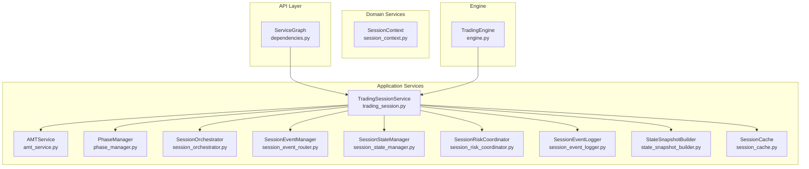

**Diagram sources**
- [dependencies.py:43-160](file://backend/app/api/dependencies.py#L43-L160)
- [trading_session.py:88-108](file://backend/app/application/services/trading_session.py#L88-L108)
- [amt_service.py:24-150](file://backend/app/application/services/amt_service.py#L24-L150)
- [phase_manager.py:21-189](file://backend/app/application/services/phase_manager.py#L21-L189)
- [session_orchestrator.py:13-236](file://backend/app/application/services/session_orchestrator.py#L13-L236)
- [session_event_router.py:49-200](file://backend/app/application/services/session_event_router.py#L49-L200)
- [session_state_manager.py:103-445](file://backend/app/application/services/session_state_manager.py#L103-L445)
- [session_risk_coordinator.py:43-149](file://backend/app/application/services/session_risk_coordinator.py#L43-L149)
- [session_event_logger.py:26-44](file://backend/app/application/services/session_event_logger.py#L26-L44)
- [state_snapshot_builder.py:47-222](file://backend/app/application/services/state_snapshot_builder.py#L47-L222)
- [session_context.py:230-327](file://backend/app/domain/fabio_ai/services/session_context.py#L230-L327)
- [engine.py:620-800](file://backend/app/application/engine.py#L620-L800)

**Section sources**
- [dependencies.py:43-160](file://backend/app/api/dependencies.py#L43-L160)
- [trading_session.py:88-108](file://backend/app/application/services/trading_session.py#L88-L108)
- [amt_service.py:24-150](file://backend/app/application/services/amt_service.py#L24-L150)
- [phase_manager.py:21-189](file://backend/app/application/services/phase_manager.py#L21-L189)
- [session_orchestrator.py:13-236](file://backend/app/application/services/session_orchestrator.py#L13-L236)
- [session_event_router.py:49-200](file://backend/app/application/services/session_event_router.py#L49-L200)
- [session_state_manager.py:103-445](file://backend/app/application/services/session_state_manager.py#L103-L445)
- [session_risk_coordinator.py:43-149](file://backend/app/application/services/session_risk_coordinator.py#L43-L149)
- [session_event_logger.py:26-44](file://backend/app/application/services/session_event_logger.py#L26-L44)
- [state_snapshot_builder.py:47-222](file://backend/app/application/services/state_snapshot_builder.py#L47-L222)
- [session_context.py:230-327](file://backend/app/domain/fabio_ai/services/session_context.py#L230-L327)
- [engine.py:620-800](file://backend/app/application/engine.py#L620-L800)

## Core Components
- **TradingSessionService**: Central coordinator that orchestrates per-symbol state management, delegates to specialized services (AMTService, PhaseManager, SessionOrchestrator), and coordinates session lifecycle. It maintains per-symbol state via SessionStateManager and integrates with SessionRiskCoordinator and SessionEventLogger.
- **AMTService**: Specialized service for advanced market analysis handling order flow and volume profile computations. Manages per-symbol AMT handlers and provides data source selection between underlying futures and option data.
- **PhaseManager**: Handles session phase transitions including Phase 5 force-exit logic, session state persistence, and emergency exit procedures during critical failures.
- **SessionOrchestrator**: Provides decision coordination helpers including entry decision resolution, LLM trigger management, tick trace generation, and priority scoring calculations.
- **SessionEventManager**: Routes trading events to appropriate handlers, coordinates agent pipeline execution, and manages event-driven workflows.
- **SessionStateManager**: Provides comprehensive per-symbol SessionState management including creation, retrieval, persistence, cleanup, playbook guard management, and explainability tracking.
- **SessionRiskCoordinator**: Manages per-symbol risk controls, optional risk tier engine integration, and system-wide risk state aggregation.
- **SessionEventLogger**: Centralized logging system for position events, trade journal entries, partial exits, and signal logs with attribution.
- **StateSnapshotBuilder**: Pure DTO formatting service that builds UI-ready state snapshots from SessionState.
- **ServiceGraph**: Singleton container that wires adapters, factories, and services, injecting them into TradingSessionService and passing observability trackers.

**Section sources**
- [trading_session.py:88-108](file://backend/app/application/services/trading_session.py#L88-L108)
- [amt_service.py:24-150](file://backend/app/application/services/amt_service.py#L24-L150)
- [phase_manager.py:21-189](file://backend/app/application/services/phase_manager.py#L21-L189)
- [session_orchestrator.py:13-236](file://backend/app/application/services/session_orchestrator.py#L13-L236)
- [session_event_router.py:49-200](file://backend/app/application/services/session_event_router.py#L49-L200)
- [session_state_manager.py:103-445](file://backend/app/application/services/session_state_manager.py#L103-L445)
- [session_risk_coordinator.py:43-149](file://backend/app/application/services/session_risk_coordinator.py#L43-L149)
- [session_event_logger.py:26-44](file://backend/app/application/services/session_event_logger.py#L26-L44)
- [state_snapshot_builder.py:47-222](file://backend/app/application/services/state_snapshot_builder.py#L47-L222)
- [dependencies.py:153-160](file://backend/app/api/dependencies.py#L153-L160)

## Architecture Overview
The TradingSessionService sits at the center of the trading pipeline, receiving ticks from TradingEngine and delegating to specialized services. The refactored architecture features clear separation of concerns with AMTService handling order flow analysis, PhaseManager managing session phases, SessionOrchestrator coordinating decisions, and SessionEventManager routing events. SessionStateManager centralizes state management while SessionRiskCoordinator and SessionEventLogger provide risk controls and auditability. The ServiceGraph wires all dependencies at startup and exposes them to the API and engine.

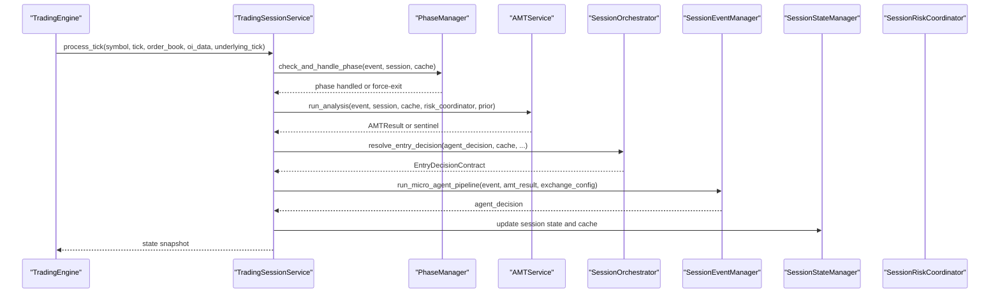

**Diagram sources**
- [engine.py:620-800](file://backend/app/application/engine.py#L620-L800)
- [trading_session.py:376-403](file://backend/app/application/services/trading_session.py#L376-L403)
- [phase_manager.py:32-51](file://backend/app/application/services/phase_manager.py#L32-L51)
- [amt_service.py:39-114](file://backend/app/application/services/amt_service.py#L39-L114)
- [session_orchestrator.py:91-159](file://backend/app/application/services/session_orchestrator.py#L91-L159)
- [session_event_router.py:141-200](file://backend/app/application/services/session_event_router.py#L141-L200)
- [session_state_manager.py:120-201](file://backend/app/application/services/session_state_manager.py#L120-L201)

## Detailed Component Analysis

### TradingSessionService
The TradingSessionService has been enhanced with new specialized service integrations while maintaining its role as the central coordinator. It now delegates to AMTService for order flow analysis, PhaseManager for session phase management, and SessionOrchestrator for decision coordination. The service maintains per-symbol state through SessionStateManager and integrates with SessionRiskCoordinator and SessionEventLogger for comprehensive trading management.

**Updated** Enhanced with new service integrations and improved modularity

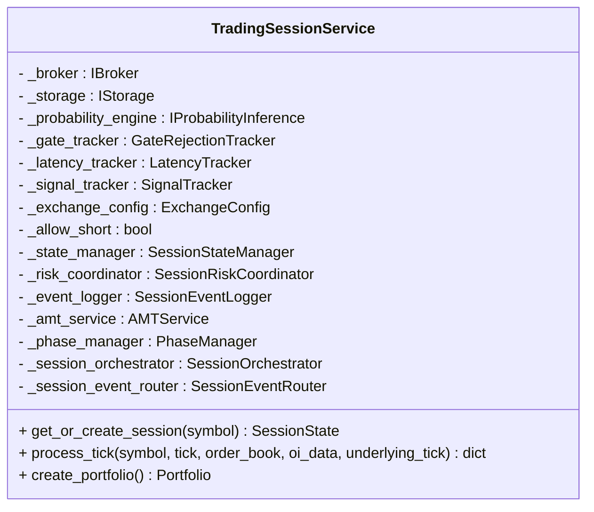

**Diagram sources**
- [trading_session.py:107-191](file://backend/app/application/services/trading_session.py#L107-L191)

**Section sources**
- [trading_session.py:107-191](file://backend/app/application/services/trading_session.py#L107-L191)
- [trading_session.py:376-403](file://backend/app/application/services/trading_session.py#L376-L403)
- [trading_session.py:678-807](file://backend/app/application/services/trading_session.py#L678-L807)

### AMTService
The AMTService provides specialized order flow analysis and volume profile computations. It manages per-symbol AMT handlers, selects appropriate data sources between underlying futures and option data, and provides market state synchronization across related symbols. The service handles prior session profile integration and computes advanced market structure metrics.

**New** Dedicated service for order flow analysis and market structure computation

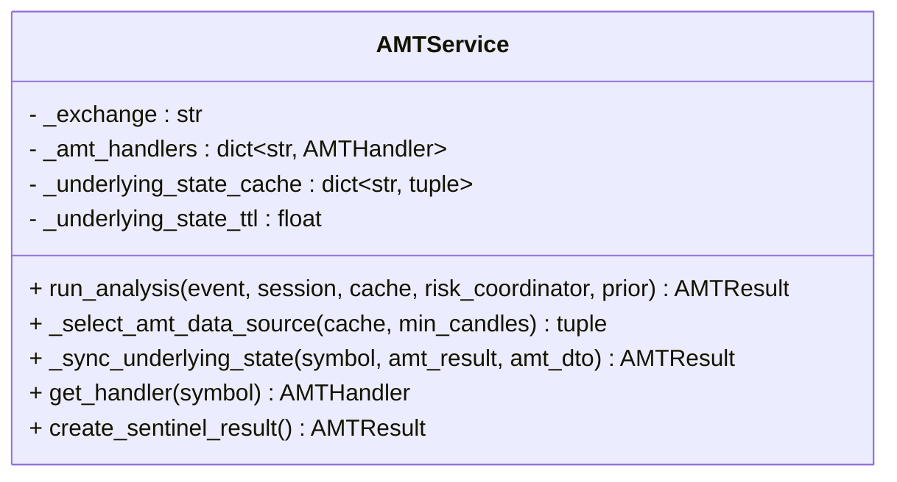

**Diagram sources**
- [amt_service.py:24-150](file://backend/app/application/services/amt_service.py#L24-L150)

**Section sources**
- [amt_service.py:24-150](file://backend/app/application/services/amt_service.py#L24-L150)
- [amt_service.py:39-114](file://backend/app/application/services/amt_service.py#L39-L114)
- [amt_service.py:115-135](file://backend/app/application/services/amt_service.py#L115-L135)

### PhaseManager
The PhaseManager handles session phase transitions and implements critical session lifecycle management including Phase 5 force-exit logic. It manages emergency exit procedures, session profile persistence, and integrates with session context for market timing enforcement.

**New** Dedicated service for session phase management and lifecycle control

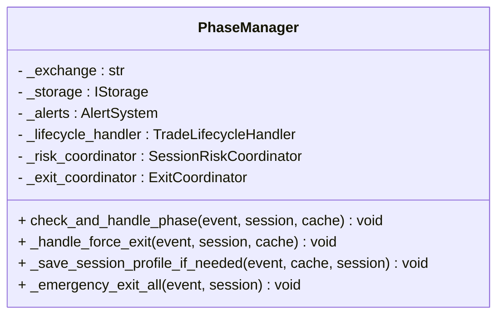

**Diagram sources**
- [phase_manager.py:21-189](file://backend/app/application/services/phase_manager.py#L21-L189)

**Section sources**
- [phase_manager.py:21-189](file://backend/app/application/services/phase_manager.py#L21-L189)
- [phase_manager.py:32-51](file://backend/app/application/services/phase_manager.py#L32-L51)
- [phase_manager.py:52-105](file://backend/app/application/services/phase_manager.py#L52-L105)

### SessionOrchestrator
The SessionOrchestrator provides decision coordination helpers and orchestration utilities. It resolves entry decisions, manages LLM triggers, generates tick traces, and computes priority scores for UI display. The service encapsulates decision logic that was previously scattered throughout the main TradingSessionService.

**New** Dedicated service for decision coordination and orchestration

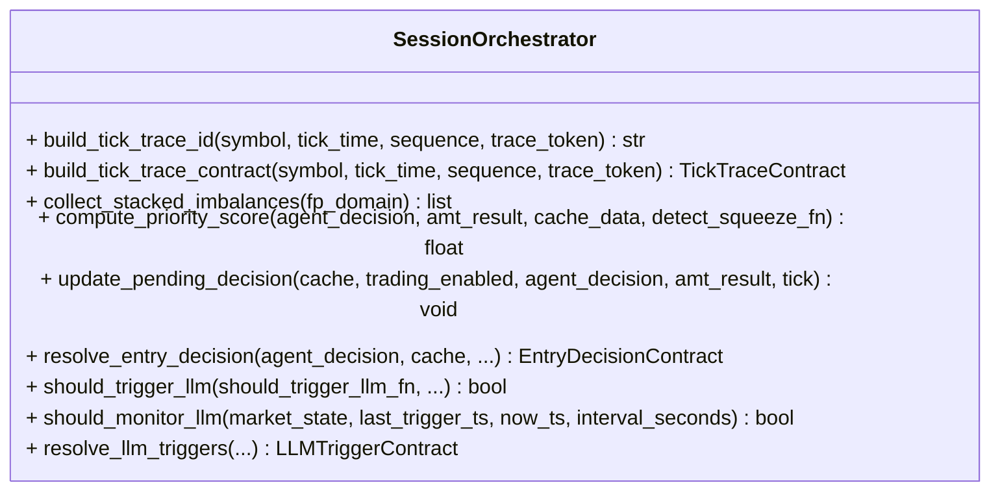

**Diagram sources**
- [session_orchestrator.py:13-236](file://backend/app/application/services/session_orchestrator.py#L13-L236)

**Section sources**
- [session_orchestrator.py:13-236](file://backend/app/application/services/session_orchestrator.py#L13-L236)
- [session_orchestrator.py:91-159](file://backend/app/application/services/session_orchestrator.py#L91-L159)
- [session_orchestrator.py:162-235](file://backend/app/application/services/session_orchestrator.py#L162-L235)

### SessionEventManager
The SessionEventManager routes trading events to appropriate handlers and coordinates the micro-agent pipeline execution. It manages event-driven workflows, executes entry signals via EntryCoordinator, and handles exit callbacks via ExitCoordinator.

**New** Dedicated service for event routing and coordination

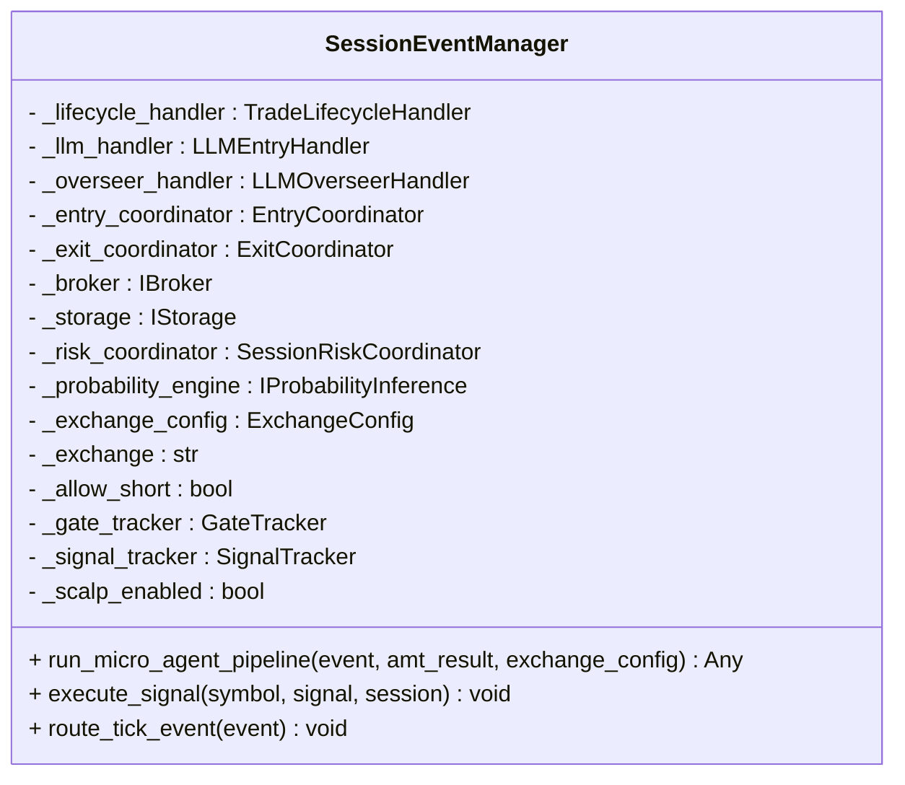

**Diagram sources**
- [session_event_router.py:49-200](file://backend/app/application/services/session_event_router.py#L49-L200)

**Section sources**
- [session_event_router.py:49-200](file://backend/app/application/services/session_event_router.py#L49-L200)
- [session_event_router.py:141-200](file://backend/app/application/services/session_event_router.py#L141-L200)

### SessionStateManager
The SessionStateManager provides comprehensive per-symbol state management with enhanced capabilities for session creation, retrieval, persistence, cleanup, playbook guard management, and explainability tracking. It includes sophisticated eviction policies, prior session profile loading, and runtime quality assurance features.

**Updated** Enhanced with improved eviction policies and runtime QA features

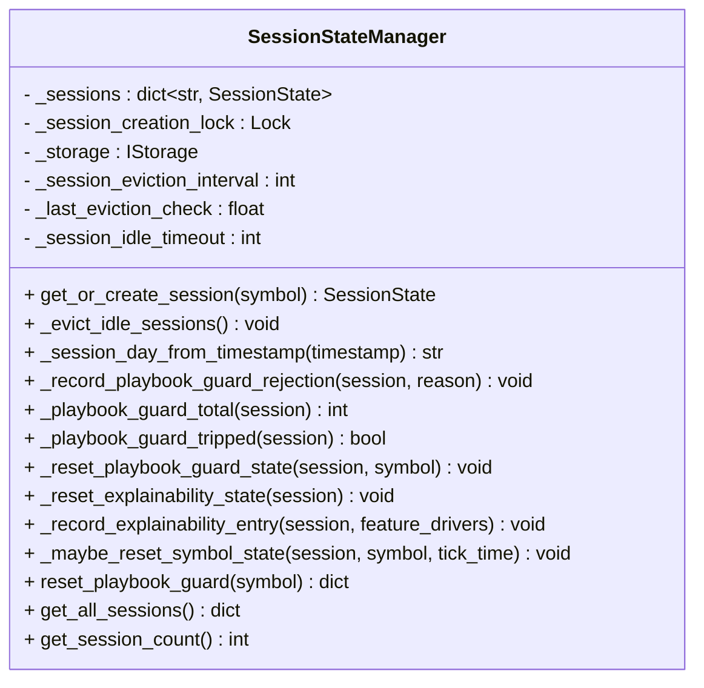

**Diagram sources**
- [session_state_manager.py:103-445](file://backend/app/application/services/session_state_manager.py#L103-L445)

**Section sources**
- [session_state_manager.py:103-445](file://backend/app/application/services/session_state_manager.py#L103-L445)
- [session_state_manager.py:120-201](file://backend/app/application/services/session_state_manager.py#L120-L201)
- [session_state_manager.py:203-222](file://backend/app/application/services/session_state_manager.py#L203-L222)
- [session_state_manager.py:373-400](file://backend/app/application/services/session_state_manager.py#L373-L400)

### SessionCache
The SessionCache serves as a centralized locking layer that manages cached analysis data and indicator snapshots. It provides thread-safe access to session state through a shallow interface with 39 methods, all implementing centralized locking with `with self._session._lock:`.

**Updated** Maintained as centralized locking layer with enhanced caching capabilities

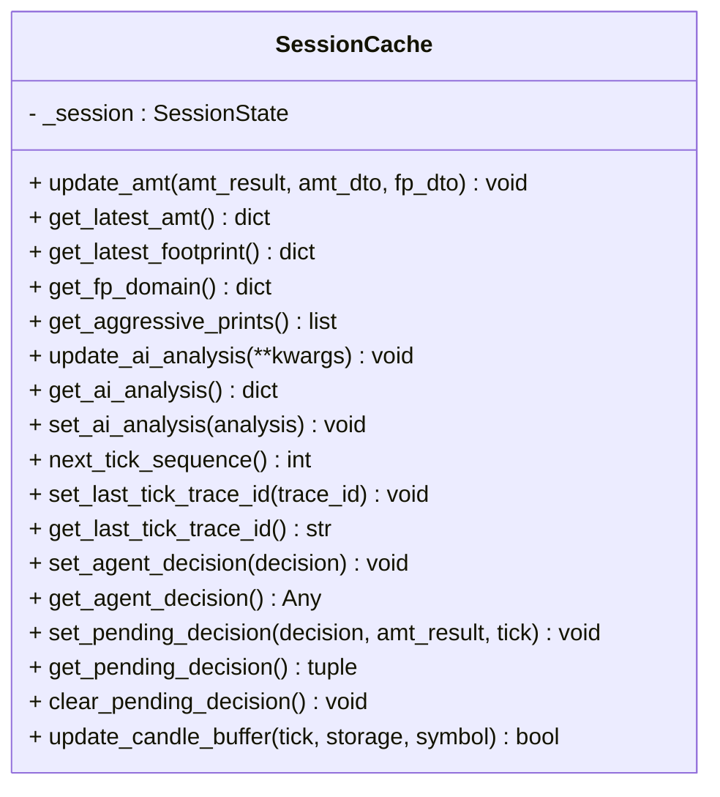

**Diagram sources**
- [session_cache.py:27-200](file://backend/app/application/services/session_cache.py#L27-L200)

**Section sources**
- [session_cache.py:27-200](file://backend/app/application/services/session_cache.py#L27-L200)
- [session_cache.py:166-200](file://backend/app/application/services/session_cache.py#L166-L200)

### SessionRiskCoordinator
The SessionRiskCoordinator manages per-symbol risk controls with optional risk tier engine integration. It provides comprehensive risk state tracking, risk-based decision validation, and system-wide risk aggregation for control-plane endpoints.

**Updated** Enhanced with optional risk tier engine integration

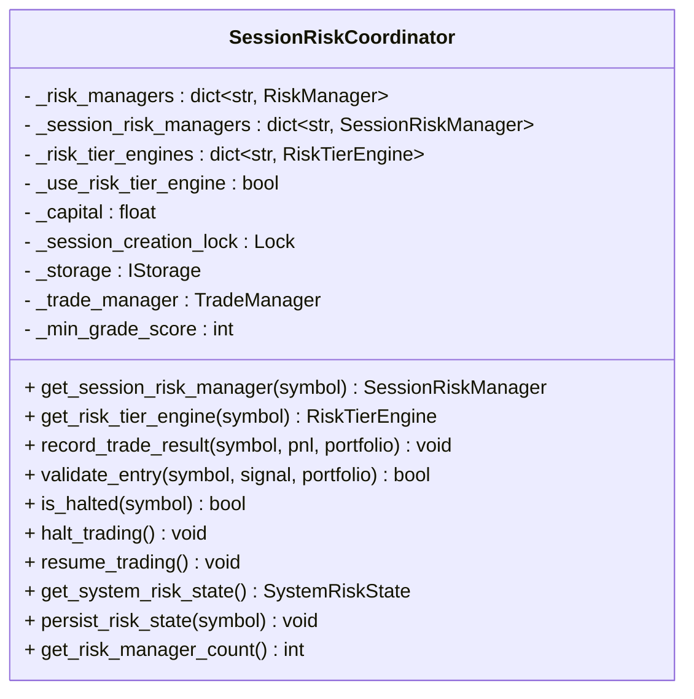

**Diagram sources**
- [session_risk_coordinator.py:43-149](file://backend/app/application/services/session_risk_coordinator.py#L43-L149)

**Section sources**
- [session_risk_coordinator.py:43-149](file://backend/app/application/services/session_risk_coordinator.py#L43-L149)
- [session_risk_coordinator.py:169-211](file://backend/app/application/services/session_risk_coordinator.py#L169-L211)

### SessionEventLogger
The SessionEventLogger provides centralized logging for position events, trade journal entries, explainability tracking, and forward test logging. It persists position events and trade journal entries to storage when available.

**Updated** Enhanced with comprehensive logging capabilities

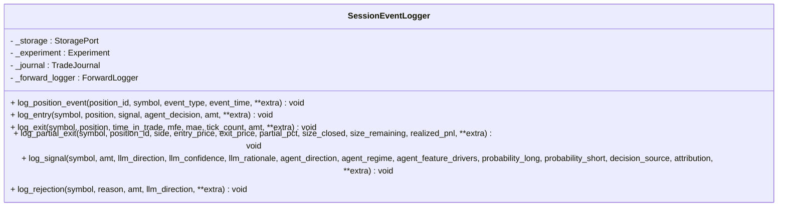

**Diagram sources**
- [session_event_logger.py:26-44](file://backend/app/application/services/session_event_logger.py#L26-L44)

**Section sources**
- [session_event_logger.py:26-44](file://backend/app/application/services/session_event_logger.py#L26-L44)
- [session_event_logger.py:78-202](file://backend/app/application/services/session_event_logger.py#L78-L202)

### StateSnapshotBuilder
The StateSnapshotBuilder provides pure DTO formatting for UI state snapshots, building comprehensive state dictionaries consumed by the React dashboard. It includes portfolio data, AMT results, predictions, AI analysis, risk state, and explainability metrics.

**Updated** Enhanced with comprehensive state aggregation

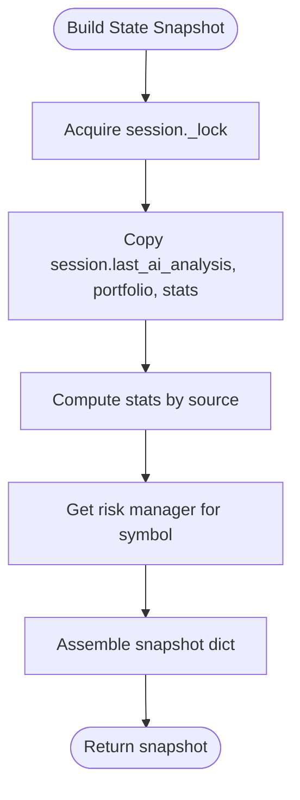

**Diagram sources**
- [state_snapshot_builder.py:47-114](file://backend/app/application/services/state_snapshot_builder.py#L47-L114)

**Section sources**
- [state_snapshot_builder.py:47-114](file://backend/app/application/services/state_snapshot_builder.py#L47-L114)
- [state_snapshot_builder.py:117-145](file://backend/app/application/services/state_snapshot_builder.py#L117-L145)
- [state_snapshot_builder.py:162-181](file://backend/app/application/services/state_snapshot_builder.py#L162-L181)

### Session Context Integration
The session context provides cached phase determination and session-aware anchors for market timing enforcement. TradingSessionService consults session context through PhaseManager to enforce trading phases and manage session lifecycle transitions.

**Updated** Integrated with PhaseManager for enhanced session phase control

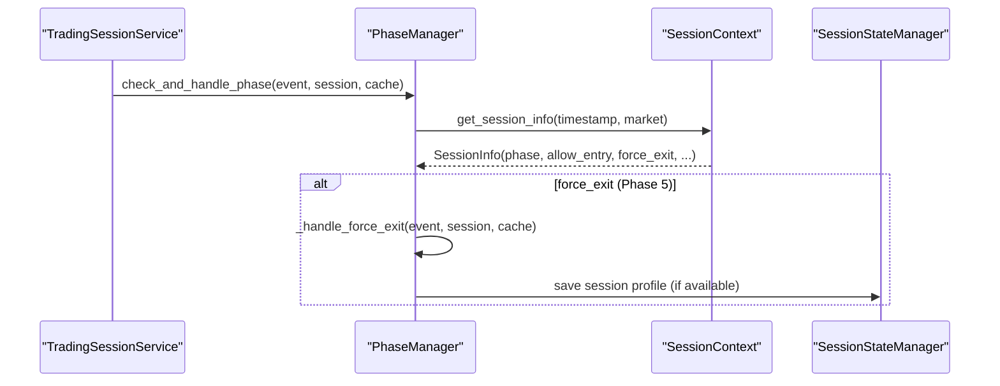

**Diagram sources**
- [phase_manager.py:32-51](file://backend/app/application/services/phase_manager.py#L32-L51)
- [session_context.py:230-327](file://backend/app/domain/fabio_ai/services/session_context.py#L230-L327)

**Section sources**
- [phase_manager.py:32-51](file://backend/app/application/services/phase_manager.py#L32-L51)
- [session_context.py:230-327](file://backend/app/domain/fabio_ai/services/session_context.py#L230-L327)

### Practical Examples

#### Session Initialization
On first tick for a symbol, TradingSessionService retrieves or creates a SessionState via SessionStateManager. The new architecture enhances this process with improved session creation, prior session profile loading, and enhanced state initialization.

**Updated** Enhanced with improved session creation and prior profile loading

**Section sources**
- [session_state_manager.py:120-201](file://backend/app/application/services/session_state_manager.py#L120-L201)
- [trading_session.py:192-198](file://backend/app/application/services/trading_session.py#L192-L198)

#### State Synchronization
After processing closed positions, TradingSessionService synchronizes portfolio-closed positions to TradeManager and persists performance snapshots to storage. The new architecture maintains this functionality while adding enhanced state management through SessionCache.

**Updated** Enhanced with SessionCache integration

**Section sources**
- [trading_session.py:462-512](file://backend/app/application/services/trading_session.py#L462-L512)

#### Inter-Session Communication Patterns
SessionStateManager resets playbook guard and explainability state on new session days and tracks rejections and alerts. The new architecture enhances this with improved runtime QA and cross-session behavioral alignment through centralized state management.

**Updated** Enhanced with improved runtime QA and state management

**Section sources**
- [session_state_manager.py:373-400](file://backend/app/application/services/session_state_manager.py#L373-L400)
- [session_state_manager.py:290-300](file://backend/app/application/services/session_state_manager.py#L290-L300)

## Dependency Analysis
The ServiceGraph creates and wires the singleton service graph at application startup, exposing dependencies to FastAPI and the engine. The refactored architecture maintains dependency injection while introducing new service dependencies including AMTService, PhaseManager, SessionOrchestrator, and SessionEventManager. TradingSessionService receives injected dependencies including broker, generative AI service, storage, probability engine, exchange configuration, and observability trackers.

**Updated** Enhanced with new service dependencies and improved modularity

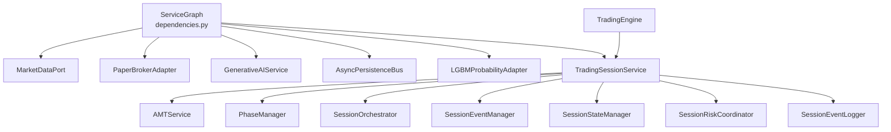

**Diagram sources**
- [dependencies.py:43-160](file://backend/app/api/dependencies.py#L43-L160)
- [engine.py:82-100](file://backend/app/application/engine.py#L82-L100)

**Section sources**
- [dependencies.py:43-160](file://backend/app/api/dependencies.py#L43-L160)
- [engine.py:82-100](file://backend/app/application/engine.py#L82-L100)

## Performance Considerations
The refactored architecture maintains performance optimizations while introducing new service-specific enhancements. Candle history trimming remains enforced with per-symbol caps, throttling and deduplication continue to reduce overhead, and garbage collection prevents memory leaks. The new services introduce specialized optimizations including AMT data source selection, phase transition caching, and centralized state management.

**Updated** Enhanced with service-specific performance optimizations

**Section sources**
- [trading_session.py:103-104](file://backend/app/application/services/trading_session.py#L103-L104)
- [amt_service.py:19-21](file://backend/app/application/services/amt_service.py#L19-L21)
- [phase_manager.py:115-135](file://backend/app/application/services/phase_manager.py#L115-L135)

## Troubleshooting Guide
The refactored architecture introduces enhanced troubleshooting capabilities through specialized service diagnostics. Position state mismatch auditing continues through TradingSessionService, but now includes enhanced state validation through SessionStateManager. Session phase enforcement through PhaseManager provides improved error handling and emergency exit procedures. Idle session eviction through SessionStateManager maintains memory discipline, while AMTService provides detailed analysis error reporting.

**Updated** Enhanced with specialized service troubleshooting capabilities

**Section sources**
- [trading_session.py:422-458](file://backend/app/application/services/trading_session.py#L422-L458)
- [phase_manager.py:157-189](file://backend/app/application/services/phase_manager.py#L157-L189)
- [session_state_manager.py:203-222](file://backend/app/application/services/session_state_manager.py#L203-L222)
- [amt_service.py:85-91](file://backend/app/application/services/amt_service.py#L85-L91)

## Conclusion
The TradingSessionService and related session management components form a highly modular and maintainable subsystem that coordinates trading across multiple symbols with enhanced specialization and robust state management. The major refactoring introduces dedicated services for order flow analysis (AMTService), session phase management (PhaseManager), decision coordination (SessionOrchestrator), and event routing (SessionEventManager), while maintaining the central coordinator role of TradingSessionService. Through enhanced dependency injection via ServiceGraph and centralized state management through SessionStateManager, the system achieves improved separation of concerns, enabling high-frequency, concurrent symbol processing while maintaining memory discipline and operational reliability. The documented patterns for session initialization, state synchronization, inter-session communication, and cleanup provide a blueprint for extending and maintaining the trading pipeline with enhanced modularity and maintainability.