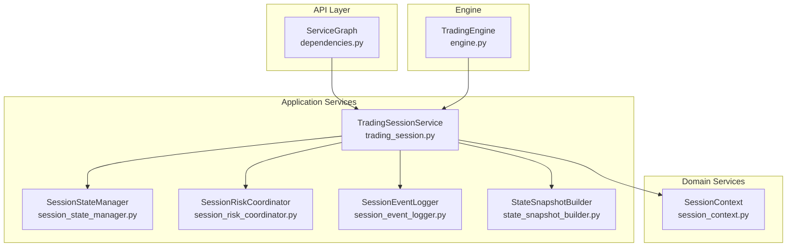
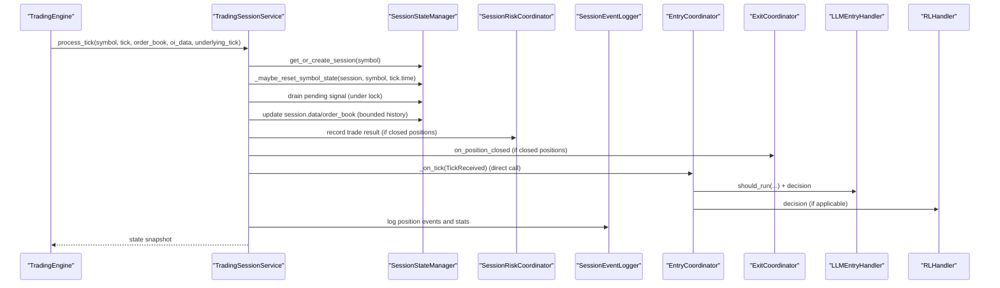
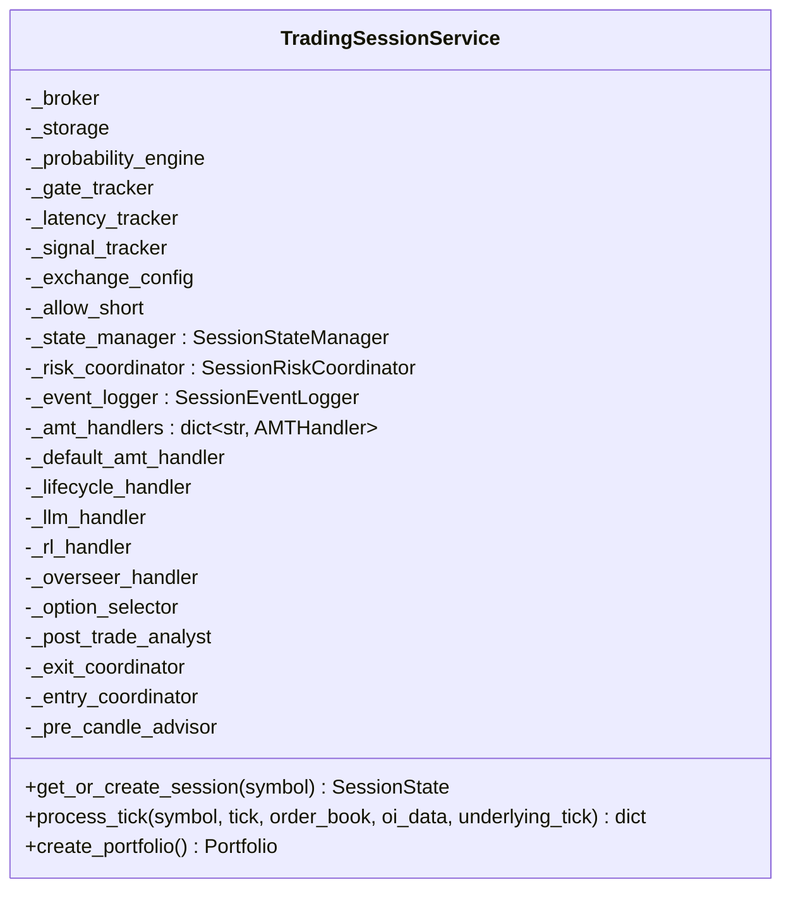
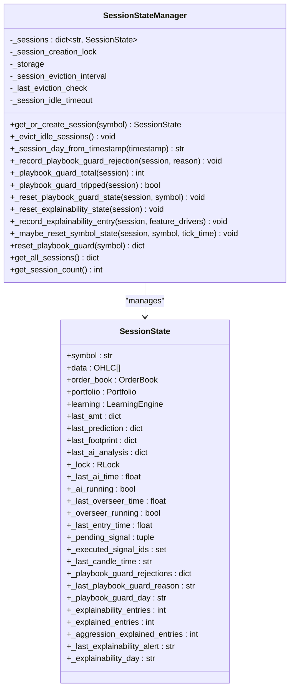
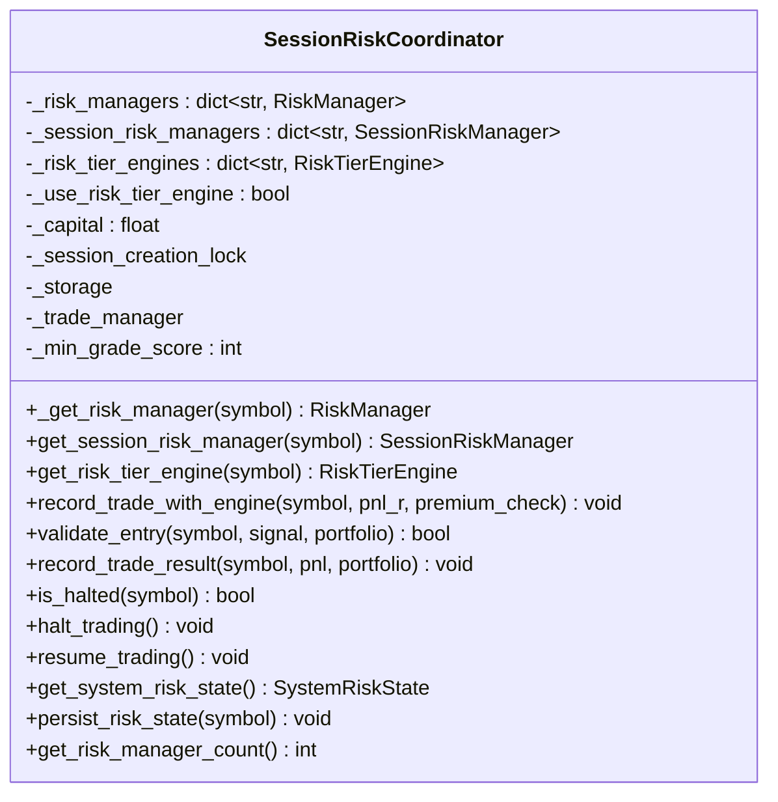
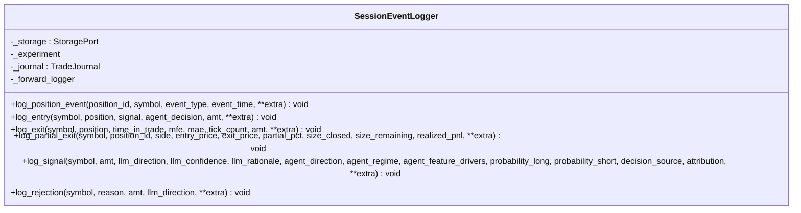
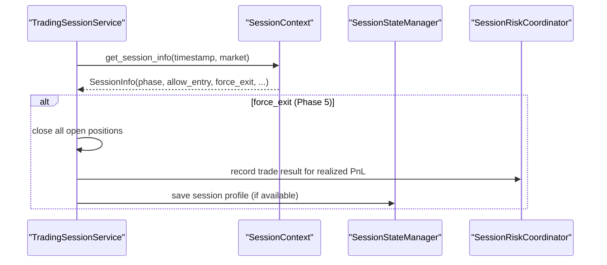
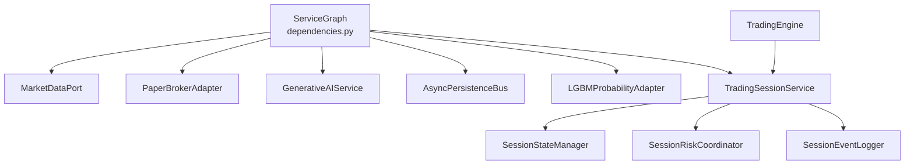

# Trading Session Service

<cite>
**Referenced Files in This Document**
- [trading_session.py](file://backend/app/application/services/trading_session.py)
- [session_state_manager.py](file://backend/app/application/services/session_state_manager.py)
- [state_snapshot_builder.py](file://backend/app/application/services/state_snapshot_builder.py)
- [dependencies.py](file://backend/app/api/dependencies.py)
- [engine.py](file://backend/app/application/engine.py)
- [session_context.py](file://backend/app/domain/fabio_ai/services/session_context.py)
- [session_risk_coordinator.py](file://backend/app/application/services/session_risk_coordinator.py)
- [session_event_logger.py](file://backend/app/application/services/session_event_logger.py)
- [test_trading_session_unit.py](file://backend/tests/unit/application/test_trading_session_unit.py)
- [test_session_context.py](file://backend/tests/unit/domain/test_session_context.py)
- [test_session_risk_manager.py](file://backend/tests/unit/domain/test_session_risk_manager.py)
- [watchdog_manager.py](file://backend/app/application/watchdog_manager.py)
</cite>

## Table of Contents
1. [Introduction](#introduction)
2. [Project Structure](#project-structure)
3. [Core Components](#core-components)
4. [Architecture Overview](#architecture-overview)
5. [Detailed Component Analysis](#detailed-component-analysis)
6. [Dependency Analysis](#dependency-analysis)
7. [Performance Considerations](#performance-considerations)
8. [Troubleshooting Guide](#troubleshooting-guide)
9. [Conclusion](#conclusion)

## Introduction
This document explains the TradingSessionService and related session management components that coordinate trading activities across multiple symbols and manage session lifecycle. It covers how TradingSessionService orchestrates per-symbol state, coordinates with specialized handlers, and integrates with the broader trading engine. It also documents the SessionStateManager’s responsibilities for persistent state, session creation, state persistence, and recovery mechanisms. The document details the session graph creation pattern, dependency injection wiring, and service coordination strategies, and provides practical examples of session initialization, state synchronization, and inter-session communication patterns. Finally, it explains how sessions handle concurrent symbol processing and state isolation, along with cleanup procedures, memory management, and performance optimization techniques used in high-frequency trading scenarios.

## Project Structure
The session management subsystem centers around the TradingSessionService and complementary services:
- TradingSessionService: Top-level coordinator delegating to focused handlers and managing per-symbol state.
- SessionStateManager: Manages per-symbol SessionState, creation/retrieval, persistence, cleanup, and runtime QA.
- SessionRiskCoordinator: Manages session-level risk, including per-symbol risk managers and optional risk tier engine.
- SessionEventLogger: Centralized event logging for positions, trades, and explainability.
- StateSnapshotBuilder: Pure DTO formatting for UI dashboards.
- ServiceGraph (dependencies.py): Creates and wires the singleton service graph at startup.
- TradingEngine: Streams market data and invokes TradingSessionService for each tick.

**Diagram sources**
- [dependencies.py:153-160](file://backend/app/api/dependencies.py#L153-L160)
- [trading_session.py:85-231](file://backend/app/application/services/trading_session.py#L85-L231)
- [session_state_manager.py:100-166](file://backend/app/application/services/session_state_manager.py#L100-L166)
- [session_risk_coordinator.py:43-149](file://backend/app/application/services/session_risk_coordinator.py#L43-L149)
- [session_event_logger.py:26-44](file://backend/app/application/services/session_event_logger.py#L26-L44)
- [state_snapshot_builder.py:22-72](file://backend/app/application/services/state_snapshot_builder.py#L22-L72)
- [session_context.py:230-327](file://backend/app/domain/fabio_ai/services/session_context.py#L230-L327)
- [engine.py:73-126](file://backend/app/application/engine.py#L73-L126)

**Section sources**
- [dependencies.py:43-160](file://backend/app/api/dependencies.py#L43-L160)
- [trading_session.py:85-231](file://backend/app/application/services/trading_session.py#L85-L231)
- [session_state_manager.py:100-166](file://backend/app/application/services/session_state_manager.py#L100-L166)
- [session_risk_coordinator.py:43-149](file://backend/app/application/services/session_risk_coordinator.py#L43-L149)
- [session_event_logger.py:26-44](file://backend/app/application/services/session_event_logger.py#L26-L44)
- [state_snapshot_builder.py:22-72](file://backend/app/application/services/state_snapshot_builder.py#L22-L72)
- [session_context.py:230-327](file://backend/app/domain/fabio_ai/services/session_context.py#L230-L327)
- [engine.py:73-126](file://backend/app/application/engine.py#L73-L126)

## Core Components
- TradingSessionService: Orchestrates per-symbol state, wires event subscriptions, delegates to specialized handlers (AMT, LLM entry, RL, lifecycle, risk, logging), and coordinates session lifecycle. It maintains per-symbol state via SessionStateManager and integrates with SessionRiskCoordinator and SessionEventLogger.
- SessionStateManager: Provides per-symbol SessionState, creation/retrieval, idle eviction, runtime QA (playbook guard and explainability), and prior session profile loading for gap analysis.
- SessionRiskCoordinator: Manages per-symbol risk managers, optional risk tier engine, validates entries, records trade results, and aggregates system risk state.
- SessionEventLogger: Centralized logging for position events, trade journal entries/exits, partial exits, and signal logs with attribution.
- StateSnapshotBuilder: Builds UI-ready state snapshots from SessionState, including portfolio, AMT, predictions, AI analysis, risk state, and explainability metrics.
- ServiceGraph: Singleton container that wires adapters, factories, and services, injecting them into TradingSessionService and passing observability trackers.

**Section sources**
- [trading_session.py:85-231](file://backend/app/application/services/trading_session.py#L85-L231)
- [session_state_manager.py:100-166](file://backend/app/application/services/session_state_manager.py#L100-L166)
- [session_risk_coordinator.py:43-149](file://backend/app/application/services/session_risk_coordinator.py#L43-L149)
- [session_event_logger.py:26-44](file://backend/app/application/services/session_event_logger.py#L26-L44)
- [state_snapshot_builder.py:22-72](file://backend/app/application/services/state_snapshot_builder.py#L22-L72)
- [dependencies.py:153-160](file://backend/app/api/dependencies.py#L153-L160)

## Architecture Overview
The TradingSessionService sits at the center of the trading pipeline, receiving ticks from TradingEngine, updating per-symbol SessionState, and invoking specialized handlers. Handlers are coordinated through dedicated services (EntryCoordinator, ExitCoordinator, TradeLifecycleHandler, LLMEntryHandler, RLHandler, LLMOverseerHandler, PreCandleAdvisor). SessionStateManager centralizes state, while SessionRiskCoordinator and SessionEventLogger provide risk gating and auditability. The ServiceGraph wires all dependencies at startup and exposes them to the API and engine.

**Diagram sources**
- [engine.py:620-800](file://backend/app/application/engine.py#L620-L800)
- [trading_session.py:233-417](file://backend/app/application/services/trading_session.py#L233-L417)
- [session_state_manager.py:168-186](file://backend/app/application/services/session_state_manager.py#L168-L186)
- [session_risk_coordinator.py:213-224](file://backend/app/application/services/session_risk_coordinator.py#L213-L224)
- [session_event_logger.py:78-202](file://backend/app/application/services/session_event_logger.py#L78-L202)

## Detailed Component Analysis

### TradingSessionService
- Role: Thin coordinator delegating to focused handlers; manages per-symbol state, wires event subscriptions, and delegates to AMT analysis, trade lifecycle, LLM entry decisions, RL status, session state, risk management, and event logging.
- Per-symbol orchestration: Maintains per-symbol AMT handlers and uses a default template for configuration. Coordinates entry/exit logic via EntryCoordinator and ExitCoordinator.
- State management: Delegates to SessionStateManager for creation, retrieval, and persistence. Implements bounds on candle history and underlying data to control memory.
- Session lifecycle: Integrates with session context to enforce trading phases (e.g., Phase 5 exit) and saves session profiles.
- Persistence: Uses a closure to persist state via storage kv_set/kv_get for crash-safe state persistence.
- Thread safety: Uses per-session locks to protect shared mutable state and ensure portfolio mutations occur on the main thread.

**Diagram sources**
- [trading_session.py:85-231](file://backend/app/application/services/trading_session.py#L85-L231)

**Section sources**
- [trading_session.py:85-231](file://backend/app/application/services/trading_session.py#L85-L231)
- [trading_session.py:233-417](file://backend/app/application/services/trading_session.py#L233-L417)
- [trading_session.py:519-655](file://backend/app/application/services/trading_session.py#L519-L655)
- [trading_session.py:656-707](file://backend/app/application/services/trading_session.py#L656-L707)
- [trading_session.py:709-759](file://backend/app/application/services/trading_session.py#L709-L759)
- [trading_session.py:787-807](file://backend/app/application/services/trading_session.py#L787-L807)

### SessionStateManager
- Responsibilities: Session creation and retrieval, state persistence, session cleanup, playbook guard management, and explainability tracking.
- SessionState: Mutable per-symbol state with portfolio, learning engine, cached latest results, thread-safety lock, throttling flags, pending signals, executed signal IDs, last candle time, and runtime QA telemetry.
- Creation and eviction: Double-checked creation with a session creation lock; periodic eviction of idle sessions (no open positions and idle beyond 24 hours).
- Prior session profile: Loads prior session profile from storage to enable gap analysis and cross-session structural level persistence.
- Runtime QA: Resets playbook guard and explainability state on new session days and tracks rejections and alerts.

**Diagram sources**
- [session_state_manager.py:100-166](file://backend/app/application/services/session_state_manager.py#L100-L166)
- [session_state_manager.py:31-98](file://backend/app/application/services/session_state_manager.py#L31-L98)

**Section sources**
- [session_state_manager.py:100-166](file://backend/app/application/services/session_state_manager.py#L100-L166)
- [session_state_manager.py:168-186](file://backend/app/application/services/session_state_manager.py#L168-L186)
- [session_state_manager.py:338-364](file://backend/app/application/services/session_state_manager.py#L338-L364)
- [session_state_manager.py:366-393](file://backend/app/application/services/session_state_manager.py#L366-L393)

### SessionRiskCoordinator
- Responsibilities: Per-symbol risk management integration, risk state tracking, risk-based decisions, and system risk aggregation.
- Per-symbol managers: Creates and returns per-symbol RiskManager and SessionRiskManager, attempting to restore persisted state from storage.
- Optional risk tier engine: Optionally enables RiskTierEngine with capital-based tiering and restoration from storage.
- Validation: Validates entries against confluence grade score, session circuit breaker, daily loss limits, and standard risk manager checks.
- Aggregation: Provides system-wide risk state for control-plane endpoints.

**Diagram sources**
- [session_risk_coordinator.py:43-149](file://backend/app/application/services/session_risk_coordinator.py#L43-L149)

**Section sources**
- [session_risk_coordinator.py:43-149](file://backend/app/application/services/session_risk_coordinator.py#L43-L149)
- [session_risk_coordinator.py:169-211](file://backend/app/application/services/session_risk_coordinator.py#L169-L211)
- [session_risk_coordinator.py:254-314](file://backend/app/application/services/session_risk_coordinator.py#L254-L314)

### SessionEventLogger
- Responsibilities: Position event logging, trade journal logging, explainability tracking, and forward test logging.
- Trade journal: Logs entries, exits, partial exits, and signal logs with decision attribution and feature drivers.
- Persistence: Persists position events and trade journal entries to storage when available.

**Diagram sources**
- [session_event_logger.py:26-44](file://backend/app/application/services/session_event_logger.py#L26-L44)

**Section sources**
- [session_event_logger.py:78-202](file://backend/app/application/services/session_event_logger.py#L78-L202)
- [session_event_logger.py:217-288](file://backend/app/application/services/session_event_logger.py#L217-L288)

### StateSnapshotBuilder
- Responsibilities: Pure DTO formatting for UI state snapshots; builds the state dict consumed by the React dashboard.
- Includes: Portfolio DTO, AMT, prediction, footprint, genAIAnalysis, overseer action/reason, model weights, stats, agent decision, playbook guard, explainability monitor, RL status, and risk state.

**Diagram sources**
- [state_snapshot_builder.py:22-72](file://backend/app/application/services/state_snapshot_builder.py#L22-L72)

**Section sources**
- [state_snapshot_builder.py:22-72](file://backend/app/application/services/state_snapshot_builder.py#L22-L72)
- [state_snapshot_builder.py:75-103](file://backend/app/application/services/state_snapshot_builder.py#L75-L103)
- [state_snapshot_builder.py:120-139](file://backend/app/application/services/state_snapshot_builder.py#L120-L139)
- [state_snapshot_builder.py:142-158](file://backend/app/application/services/state_snapshot_builder.py#L142-L158)
- [state_snapshot_builder.py:161-174](file://backend/app/application/services/state_snapshot_builder.py#L161-L174)

### Session Context Integration
- Session context informs trading phases and session-aware anchors. TradingSessionService consults session context to enforce trading phases (e.g., Phase 5 exit) and to save session profiles at session close.
- SessionContext provides cached phase determination and session-aware anchors for IB windows and VWAP resets.

**Diagram sources**
- [trading_session.py:519-655](file://backend/app/application/services/trading_session.py#L519-L655)
- [session_context.py:230-327](file://backend/app/domain/fabio_ai/services/session_context.py#L230-L327)

**Section sources**
- [trading_session.py:519-655](file://backend/app/application/services/trading_session.py#L519-L655)
- [session_context.py:230-327](file://backend/app/domain/fabio_ai/services/session_context.py#L230-L327)

### Practical Examples

#### Session Initialization
- On first tick for a symbol, TradingSessionService retrieves or creates a SessionState via SessionStateManager. Prior session profile is loaded from storage to support gap analysis and cross-session structural level persistence.

**Section sources**
- [session_state_manager.py:139-165](file://backend/app/application/services/session_state_manager.py#L139-L165)
- [trading_session.py:229-231](file://backend/app/application/services/trading_session.py#L229-L231)

#### State Synchronization
- After processing closed positions, TradingSessionService synchronizes portfolio-closed positions to TradeManager and persists performance snapshots to storage.

**Section sources**
- [trading_session.py:341-403](file://backend/app/application/services/trading_session.py#L341-L403)

#### Inter-Session Communication Patterns
- SessionStateManager resets playbook guard and explainability state on new session days and tracks rejections and alerts. This supports runtime QA and cross-session behavioral alignment.

**Section sources**
- [session_state_manager.py:338-364](file://backend/app/application/services/session_state_manager.py#L338-L364)
- [session_state_manager.py:216-226](file://backend/app/application/services/session_state_manager.py#L216-L226)

## Dependency Analysis
The ServiceGraph creates and wires the singleton service graph at application startup, exposing dependencies to FastAPI and the engine. TradingSessionService receives injected dependencies including broker, generative AI service, storage, probability engine, exchange configuration, and observability trackers. The engine initializes TradingSessionService and orchestrates market data streaming and state updates.

**Diagram sources**
- [dependencies.py:43-160](file://backend/app/api/dependencies.py#L43-L160)
- [engine.py:73-126](file://backend/app/application/engine.py#L73-L126)

**Section sources**
- [dependencies.py:43-160](file://backend/app/api/dependencies.py#L43-L160)
- [engine.py:73-126](file://backend/app/application/engine.py#L73-L126)

## Performance Considerations
- Candle history trimming: Enforced cap on per-symbol candle history to bound memory in long-running sessions.
- Throttling and deduplication: Deduplicates sub-candle updates and caps processing frequency to reduce overhead.
- Garbage collection: Periodic GC loop prevents memory leaks in long-running sessions.
- Async persistence: Storage writes are offloaded to a background thread via AsyncPersistenceBus to minimize latency spikes.

**Section sources**
- [trading_session.py:81-82](file://backend/app/application/services/trading_session.py#L81-L82)
- [trading_session.py:280-306](file://backend/app/application/services/trading_session.py#L280-L306)
- [watchdog_manager.py:177-198](file://backend/app/application/watchdog_manager.py#L177-L198)
- [dependencies.py:106-112](file://backend/app/api/dependencies.py#L106-L112)

## Troubleshooting Guide
- Position state mismatch: TradingSessionService audits and reconciles portfolio/lifecycle consistency for one symbol, logging mismatches and attempting reconciliation.
- Session phase enforcement: During Phase 5, TradingSessionService forces exit of all open positions and records realized PnL.
- Idle session eviction: Sessions idle for more than 24 hours with no open positions are evicted to free memory.
- Risk state persistence: SessionRiskCoordinator attempts to restore and persist risk state from storage to survive restarts.

**Section sources**
- [trading_session.py:422-458](file://backend/app/application/services/trading_session.py#L422-L458)
- [trading_session.py:519-655](file://backend/app/application/services/trading_session.py#L519-L655)
- [session_state_manager.py:168-186](file://backend/app/application/services/session_state_manager.py#L168-L186)
- [session_risk_coordinator.py:98-119](file://backend/app/application/services/session_risk_coordinator.py#L98-L119)

## Conclusion
The TradingSessionService and related session management components form a cohesive subsystem that coordinates trading across multiple symbols with strong state isolation, robust persistence, and risk-aware decision-making. Through precise dependency injection via ServiceGraph, the system achieves clean separation of concerns, enabling high-frequency, concurrent symbol processing while maintaining memory discipline and operational reliability. The documented patterns for session initialization, state synchronization, inter-session communication, and cleanup provide a blueprint for extending and maintaining the trading pipeline.