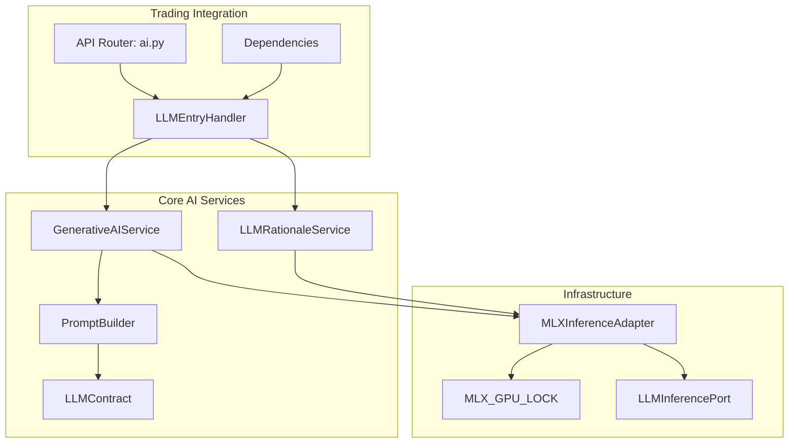
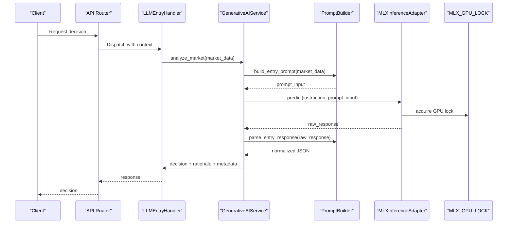
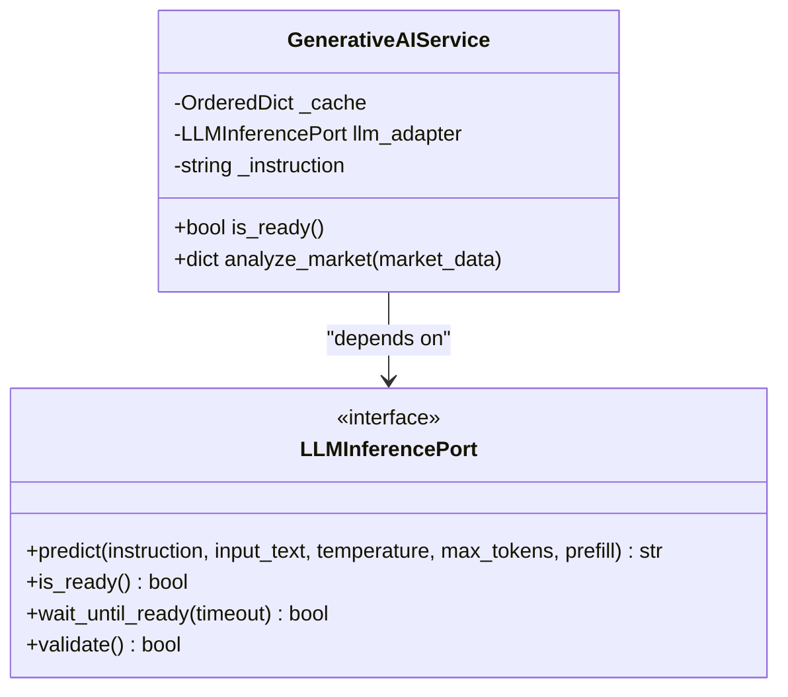
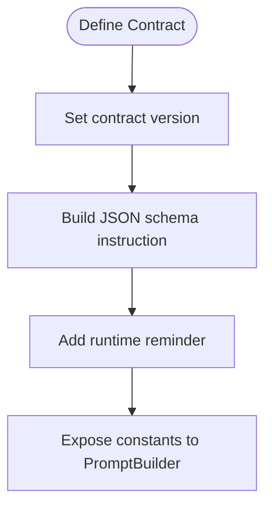
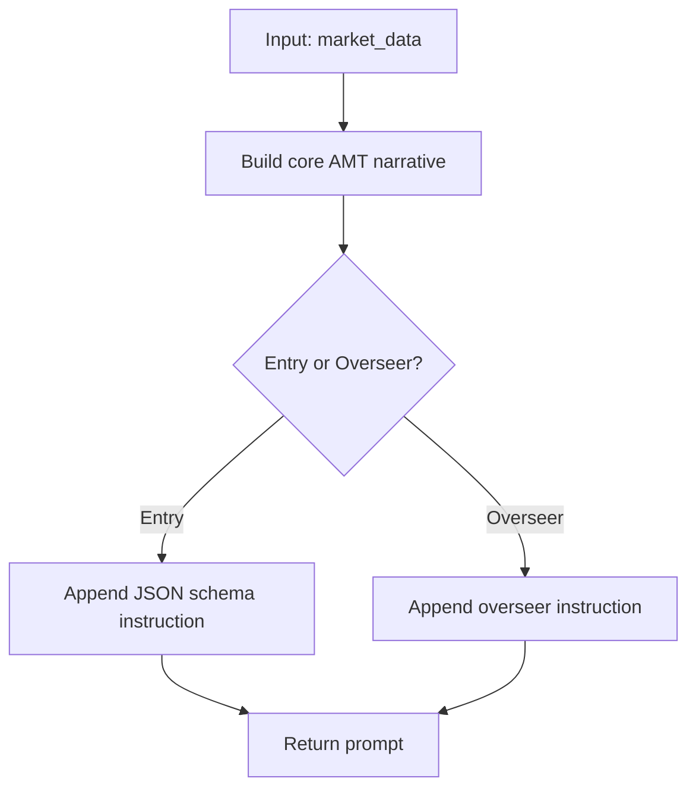
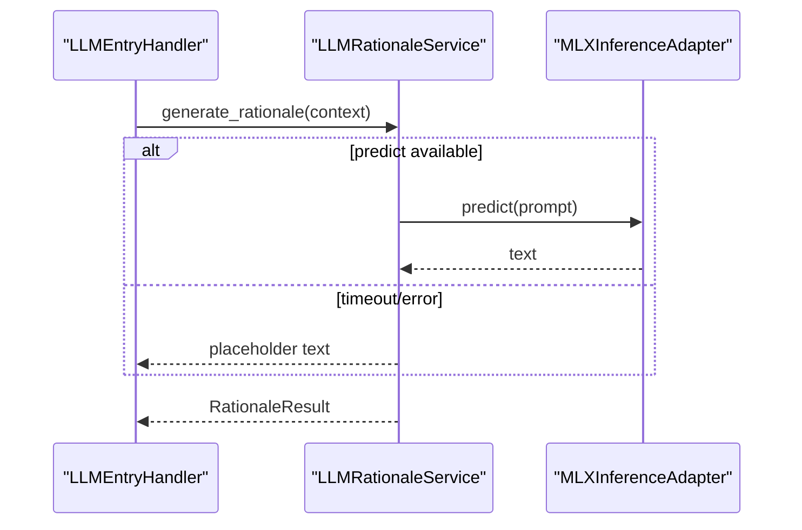
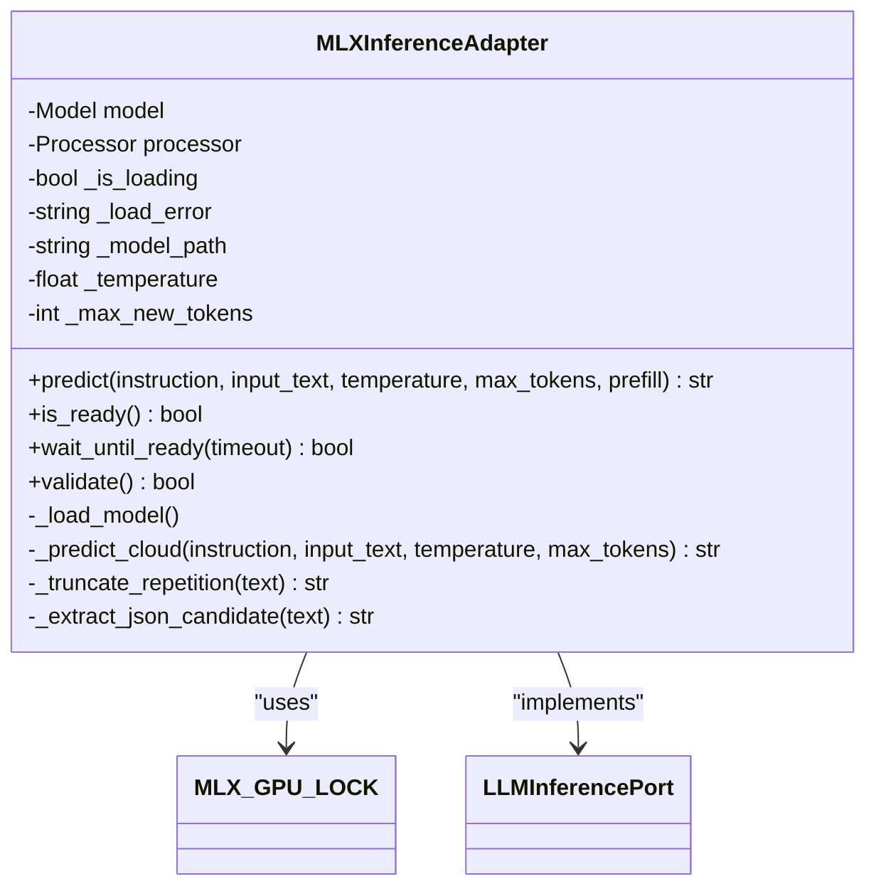
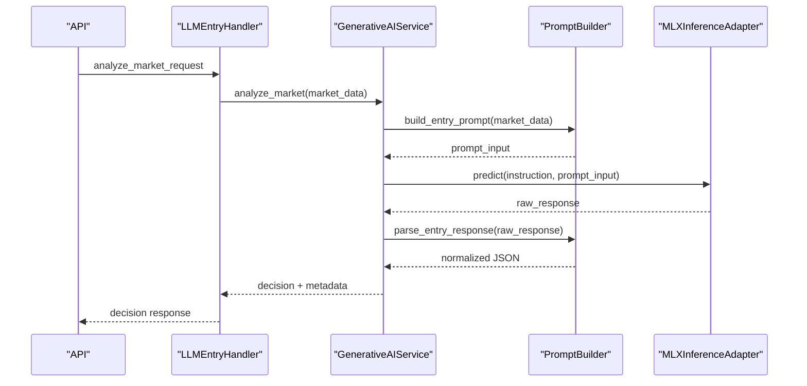
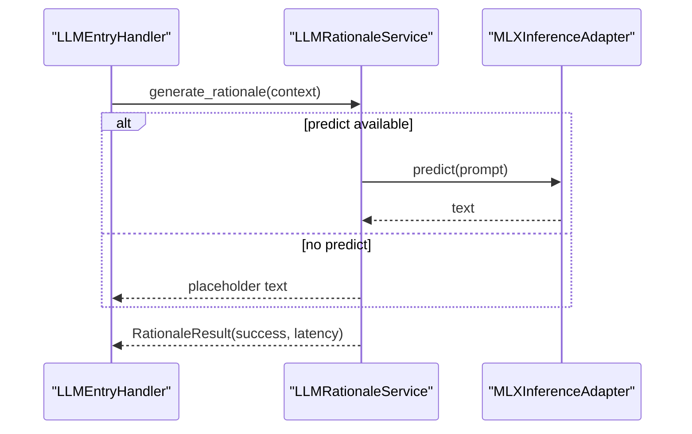

# AI Inference System

<cite>
**Referenced Files in This Document**
- [generative_ai_service.py](file://backend/app/domain/fabio_ai/services/generative_ai_service.py)
- [llm_contract.py](file://backend/app/domain/fabio_ai/services/llm_contract.py)
- [prompt_builder.py](file://backend/app/domain/fabio_ai/services/prompt_builder.py)
- [prompt_engineering_service.py](file://backend/app/domain/fabio_ai/services/prompt_engineering_service.py)
- [llm_rationale_service.py](file://backend/app/domain/fabio_ai/services/llm_rationale_service.py)
- [mlx_inference_adapter.py](file://backend/app/infrastructure/adapters/mlx_inference_adapter.py)
- [mlx_gpu_lock.py](file://backend/app/infrastructure/mlx_gpu_lock.py)
- [llm_inference.py](file://backend/app/domain/ports/llm_inference.py)
- [llm_entry_handler.py](file://backend/app/application/handlers/llm_entry_handler.py)
- [ai.py](file://backend/app/api/routers/ai.py)
- [dependencies.py](file://backend/app/api/dependencies.py)
- [entry_gates/__init__.py](file://backend/app/domain/fabio_ai/services/entry_gates/__init__.py)
- [gates/__init__.py](file://backend/app/domain/fabio_ai/services/gates/__init__.py)
- [amt_analyzer.py](file://backend/app/domain/fabio_ai/services/amt_analyzer.py)
- [PHASE_5_ENTRY_GATE_EXTRACTION.md](file://backend/PHASE_5_ENTRY_GATE_EXTRACTION.md)
</cite>

## Update Summary
**Changes Made**
- Removed documentation for old Fabio AI system components including entry gates, amount analyzer, and prompt engineering services
- Updated architecture to reflect streamlined approach with direct integration between AI services and trading logic
- Removed references to deprecated entry gate extraction and old service structures
- Simplified component relationships to focus on core AI inference components

## Table of Contents
1. [Introduction](#introduction)
2. [Project Structure](#project-structure)
3. [Core Components](#core-components)
4. [Architecture Overview](#architecture-overview)
5. [Detailed Component Analysis](#detailed-component-analysis)
6. [Performance Considerations](#performance-considerations)
7. [Troubleshooting Guide](#troubleshooting-guide)
8. [Conclusion](#conclusion)
9. [Appendices](#appendices)

## Introduction
This document describes the AI inference system that powers decision-making using Apple Silicon–optimized MLX inference. The system has been streamlined to focus on direct integration between AI services and trading logic, removing the previous complex entry gate and amount analyzer infrastructure.

Key components covered:
- GenerativeAIService for entry decisions grounded in AMT methodology
- LLMContract for standardizing AI model interfaces and response formats
- PromptBuilder for constructing context-aware, narrative-driven queries
- LLMRationaleService for generating asynchronous, explainable rationales
- MLXInferenceAdapter for fast, safe, and resilient Apple Silicon inference
- Direct integration with trading decision pipeline and real-time inference requirements

The system emphasizes reliability, performance, and explainability with a simplified architecture that eliminates the previous multi-layered gate checking system in favor of streamlined AI-driven decision making.

## Project Structure
The AI inference system now features a streamlined architecture with core components working directly with the trading pipeline:

**Diagram sources**
- [generative_ai_service.py:26-99](file://backend/app/domain/fabio_ai/services/generative_ai_service.py#L26-L99)
- [llm_contract.py:13-47](file://backend/app/domain/fabio_ai/services/llm_contract.py#L13-L47)
- [prompt_builder.py:261-483](file://backend/app/domain/fabio_ai/services/prompt_builder.py#L261-L483)
- [llm_rationale_service.py:30-118](file://backend/app/domain/fabio_ai/services/llm_rationale_service.py#L30-L118)
- [mlx_inference_adapter.py:12-396](file://backend/app/infrastructure/adapters/mlx_inference_adapter.py#L12-L396)
- [mlx_gpu_lock.py:1-19](file://backend/app/infrastructure/mlx_gpu_lock.py#L1-L19)
- [llm_inference.py:10-42](file://backend/app/domain/ports/llm_inference.py#L10-L42)
- [llm_entry_handler.py](file://backend/app/application/handlers/llm_entry_handler.py)
- [ai.py](file://backend/app/api/routers/ai.py)
- [dependencies.py](file://backend/app/api/dependencies.py)

**Section sources**
- [generative_ai_service.py:26-99](file://backend/app/domain/fabio_ai/services/generative_ai_service.py#L26-L99)
- [mlx_inference_adapter.py:12-396](file://backend/app/infrastructure/adapters/mlx_inference_adapter.py#L12-L396)

## Core Components
- GenerativeAIService: orchestrates entry decisions by building prompts, invoking the LLM adapter, and normalizing outputs into a canonical JSON format. Includes caching to avoid redundant inference on identical inputs.
- LLMContract: defines the canonical runtime contract for entry decisions, including the JSON schema instruction and runtime reminders.
- PromptBuilder: constructs narrative-rich prompts and parses diverse model outputs, including JSON, code-block JSON, and legacy keyword fallbacks.
- LLMRationaleService: asynchronously generates human-readable rationales and market narratives without blocking the signal pipeline.
- MLXInferenceAdapter: Apple Silicon–optimized inference with background model loading, GPU serialization, and cloud fallback.
- **Removed**: Entry gates and amount analyzer services (deprecated in favor of streamlined approach)
- **Removed**: Complex gate pipeline orchestration (simplified to direct AI integration)

**Section sources**
- [generative_ai_service.py:26-99](file://backend/app/domain/fabio_ai/services/generative_ai_service.py#L26-L99)
- [llm_contract.py:13-47](file://backend/app/domain/fabio_ai/services/llm_contract.py#L13-L47)
- [prompt_builder.py:261-483](file://backend/app/domain/fabio_ai/services/prompt_builder.py#L261-L483)
- [llm_rationale_service.py:30-118](file://backend/app/domain/fabio_ai/services/llm_rationale_service.py#L30-L118)
- [mlx_inference_adapter.py:12-396](file://backend/app/infrastructure/adapters/mlx_inference_adapter.py#L12-L396)

## Architecture Overview
The streamlined architecture focuses on direct integration between AI services and trading logic, eliminating the previous multi-layered gate checking system:

**Diagram sources**
- [llm_entry_handler.py](file://backend/app/application/handlers/llm_entry_handler.py)
- [generative_ai_service.py:53-99](file://backend/app/domain/fabio_ai/services/generative_ai_service.py#L53-L99)
- [prompt_builder.py:261-483](file://backend/app/domain/fabio_ai/services/prompt_builder.py#L261-L483)
- [mlx_inference_adapter.py:184-266](file://backend/app/infrastructure/adapters/mlx_inference_adapter.py#L184-L266)
- [mlx_gpu_lock.py:18](file://backend/app/infrastructure/mlx_gpu_lock.py#L18)

## Detailed Component Analysis

### GenerativeAIService
Responsibilities:
- Builds entry prompts from market data
- Invokes the LLM adapter with a canonical instruction
- Parses and normalizes outputs into a standardized JSON format
- Caches results keyed by MD5 hash of the prompt input
- Handles None responses and exceptions gracefully

Key behaviors:
- Cache eviction policy maintains a bounded cache size
- Robust parsing supports JSON, code-block JSON, and legacy structured fallbacks
- Adds contextual metadata (market_state, aggression) to the output

**Diagram sources**
- [generative_ai_service.py:26-99](file://backend/app/domain/fabio_ai/services/generative_ai_service.py#L26-L99)
- [llm_inference.py:10-42](file://backend/app/domain/ports/llm_inference.py#L10-L42)

**Section sources**
- [generative_ai_service.py:26-99](file://backend/app/domain/fabio_ai/services/generative_ai_service.py#L26-L99)

### LLMContract
Defines:
- Canonical runtime contract version and model family
- JSON schema instruction for entry responses
- Runtime reminder to constrain model output to valid JSON

**Diagram sources**
- [llm_contract.py:13-47](file://backend/app/domain/fabio_ai/services/llm_contract.py#L13-L47)

**Section sources**
- [llm_contract.py:13-47](file://backend/app/domain/fabio_ai/services/llm_contract.py#L13-L47)

### PromptBuilder
Responsibilities:
- Construct entry and overseer prompts from structured market data
- Parse model outputs with multiple strategies: JSON, code-block JSON, structured text, and keyword fallbacks
- Normalize outputs into canonical fields (direction, rationale, confidence)

Processing logic:
- Entry prompt assembly includes session context, market state, order flow, and option-specific metrics
- Overseer prompt includes position state, market context, risk constraints, and explicit instruction
- Parsing prioritizes JSON; falls back to legacy extraction and keyword heuristics

**Diagram sources**
- [prompt_builder.py:261-356](file://backend/app/domain/fabio_ai/services/prompt_builder.py#L261-L356)

**Section sources**
- [prompt_builder.py:261-483](file://backend/app/domain/fabio_ai/services/prompt_builder.py#L261-L483)

### LLMRationaleService
Responsibilities:
- Asynchronously generate human-readable rationales and market narratives
- Enforce a short timeout to avoid blocking the signal pipeline
- Return structured results with success flags and latency metrics

**Diagram sources**
- [llm_rationale_service.py:50-118](file://backend/app/domain/fabio_ai/services/llm_rationale_service.py#L50-L118)
- [mlx_inference_adapter.py:184-266](file://backend/app/infrastructure/adapters/mlx_inference_adapter.py#L184-L266)

**Section sources**
- [llm_rationale_service.py:30-118](file://backend/app/domain/fabio_ai/services/llm_rationale_service.py#L30-L118)

### MLXInferenceAdapter
Responsibilities:
- Load MLX models in the background to minimize cold-start latency
- Serialize GPU operations to prevent Metal concurrency crashes
- Provide cloud fallback when no local model is configured
- Enforce deterministic parsing for entry decisions and trim repetitive reasoning for overseer prompts

Key mechanisms:
- Singleton pattern ensures a single model instance
- Background loading thread prevents startup delays
- MLX_GPU_LOCK serializes load() and generate() calls
- Cloud fallback uses OpenRouter with exponential backoff on rate limits

**Diagram sources**
- [mlx_inference_adapter.py:12-396](file://backend/app/infrastructure/adapters/mlx_inference_adapter.py#L12-L396)
- [mlx_gpu_lock.py:18](file://backend/app/infrastructure/mlx_gpu_lock.py#L18)
- [llm_inference.py:10-42](file://backend/app/domain/ports/llm_inference.py#L10-L42)

**Section sources**
- [mlx_inference_adapter.py:12-396](file://backend/app/infrastructure/adapters/mlx_inference_adapter.py#L12-L396)
- [mlx_gpu_lock.py:1-19](file://backend/app/infrastructure/mlx_gpu_lock.py#L1-L19)

## Performance Considerations
- Model loading strategy
  - Background loading avoids cold-start latency; readiness checks prevent inference until loaded
  - Cloud fallback enables operation without a local model, with rate-limit backoff
- Temperature and sampling
  - Temperature and max tokens are configurable per call; defaults are set in the adapter
  - Deterministic parsing is used when sampling parameters are omitted
- Concurrency and GPU safety
  - MLX_GPU_LOCK serializes model load and inference to prevent Metal concurrency crashes
- Caching
  - GenerativeAIService caches results keyed by prompt hash to reduce repeated inference
- Parsing efficiency
  - PromptBuilder's JSON extraction includes fixes for common LLM formatting issues
- Real-time inference
  - Predictions are non-blocking; rationale generation is asynchronous with a short timeout
- **Removed**: Complex gate pipeline overhead (streamlined approach reduces processing time)
- **Removed**: Amount analyzer computations (direct AI integration simplifies workflow)

## Troubleshooting Guide
Common issues and resolutions:
- Model not ready
  - Symptom: LLMNotReadyError raised during predict
  - Resolution: Use is_ready() or wait_until_ready(); ensure model path is configured or rely on cloud fallback
- Empty or malformed responses
  - Symptom: Empty JSON or unparseable output
  - Resolution: PromptBuilder includes fallback parsing; GenerativeAIService returns conservative defaults
- Metal concurrency crashes
  - Symptom: Crashes during load/generate
  - Resolution: MLX_GPU_LOCK serializes operations; do not call load/generate concurrently
- Cloud fallback failures
  - Symptom: HTTP errors or rate limiting
  - Resolution: Adapter retries with exponential backoff; configure API key and endpoint properly
- Rationale timeouts
  - Symptom: Timeout during rationale generation
  - Resolution: LLMRationaleService returns placeholders; adjust timeout if needed
- **Removed**: Gate pipeline failures (simplified system eliminates complex gate coordination)
- **Removed**: Amount analyzer errors (direct integration removes intermediate processing steps)

**Section sources**
- [mlx_inference_adapter.py:201-210](file://backend/app/infrastructure/adapters/mlx_inference_adapter.py#L201-L210)
- [mlx_inference_adapter.py:106-182](file://backend/app/infrastructure/adapters/mlx_inference_adapter.py#L106-L182)
- [generative_ai_service.py:71-95](file://backend/app/domain/fabio_ai/services/generative_ai_service.py#L71-L95)
- [prompt_builder.py:411-467](file://backend/app/domain/fabio_ai/services/prompt_builder.py#L411-L467)
- [llm_rationale_service.py:74-87](file://backend/app/domain/fabio_ai/services/llm_rationale_service.py#L74-L87)

## Conclusion
The AI inference system has been successfully streamlined to focus on direct integration between AI services and trading logic. The removal of the previous complex entry gate and amount analyzer infrastructure has resulted in a more efficient, maintainable system that delivers fast, reliable, and explainable trading decisions. The simplified architecture with GenerativeAIService, PromptBuilder, and MLXInferenceAdapter provides robust performance while maintaining the canonical contracts and parsing capabilities essential for production trading applications.

## Appendices

### Example Workflows

#### Streamlined AI Decision Workflow

**Diagram sources**
- [llm_entry_handler.py](file://backend/app/application/handlers/llm_entry_handler.py)
- [generative_ai_service.py:53-99](file://backend/app/domain/fabio_ai/services/generative_ai_service.py#L53-L99)
- [prompt_builder.py:261-483](file://backend/app/domain/fabio_ai/services/prompt_builder.py#L261-L483)
- [mlx_inference_adapter.py:184-266](file://backend/app/infrastructure/adapters/mlx_inference_adapter.py#L184-L266)

#### Rationale Generation Workflow

**Diagram sources**
- [llm_rationale_service.py:50-118](file://backend/app/domain/fabio_ai/services/llm_rationale_service.py#L50-L118)
- [mlx_inference_adapter.py:184-266](file://backend/app/infrastructure/adapters/mlx_inference_adapter.py#L184-L266)

### Configuration Options
- Environment variables
  - MLX_MODEL_PATH: Path to the MLX model directory
  - MLX_ADAPTER_PATH: Optional adapter path for LoRA adapters
  - OPENROUTER_API_KEY: API key for cloud fallback
  - MODEL_ID: Model identifier for cloud fallback
  - CLOUD_FALLBACK_URL: Endpoint for cloud fallback
- Adapter parameters
  - temperature: Sampling temperature override
  - max_new_tokens: Maximum new tokens for generation
  - prefill: Assistant prefill (e.g., JSON brace or thinking tag)
- **Removed**: Complex gate pipeline configuration (simplified system)
- **Removed**: Amount analyzer parameters (direct AI integration)

**Section sources**
- [mlx_inference_adapter.py:42-48](file://backend/app/infrastructure/adapters/mlx_inference_adapter.py#L42-L48)
- [mlx_inference_adapter.py:95-99](file://backend/app/infrastructure/adapters/mlx_inference_adapter.py#L95-L99)
- [mlx_inference_adapter.py:24-35](file://backend/app/infrastructure/adapters/mlx_inference_adapter.py#L24-L35)

### Testing References
- GenerativeAIService tests validate caching, parsing, and error handling
- PromptBuilder tests validate JSON extraction and fallback parsing
- MLXInferenceAdapter tests validate prompt formatting, serialization lock, and readiness states
- LLMRationaleService tests validate async generation and timeout behavior
- **Removed**: Entry gate and amount analyzer tests (deprecated components)
- **Removed**: Complex gate pipeline tests (simplified architecture)

**Section sources**
- [test_generative_ai_service.py](file://backend/tests/unit/domain/test_generative_ai_service.py)
- [test_prompt_engineering_service.py](file://backend/tests/unit/test_prompt_engineering_service.py)
- [test_mlx_inference_adapter.py](file://backend/tests/unit/infrastructure/test_mlx_inference_adapter.py)
- [test_prompt_builder.py](file://backend/tests/unit/domain/test_prompt_builder.py)
- [test_llm_rationale_service.py](file://backend/tests/unit/domain/test_llm_rationale_service.py)