# AI Inference System

<cite>
**Referenced Files in This Document**
- [generative_ai_service.py](file://backend/app/domain/fabio_ai/services/generative_ai_service.py)
- [llm_contract.py](file://backend/app/domain/fabio_ai/services/llm_contract.py)
- [prompt_builder.py](file://backend/app/domain/fabio_ai/services/prompt_builder.py)
- [prompt_engineering_service.py](file://backend/app/domain/fabio_ai/services/prompt_engineering_service.py)
- [llm_rationale_service.py](file://backend/app/domain/fabio_ai/services/llm_rationale_service.py)
- [mlx_inference_adapter.py](file://backend/app/infrastructure/adapters/mlx_inference_adapter.py)
- [mlx_gpu_lock.py](file://backend/app/infrastructure/mlx_gpu_lock.py)
- [llm_inference.py](file://backend/app/domain/ports/llm_inference.py)
- [llm_entry_handler.py](file://backend/app/application/handlers/llm_entry_handler.py)
- [ai.py](file://backend/app/api/routers/ai.py)
- [dependencies.py](file://backend/app/api/dependencies.py)
- [train_gemma4_26b.py](file://train_gemma4_26b.py)
- [GEMMA4_26B_TRAINING_GUIDE.md](file://GEMMA4_26B_TRAINING_GUIDE.md)
- [evaluate_gemma4_test.py](file://evaluate_gemma4_test.py)
- [quick_benchmark.py](file://quick_benchmark.py)
- [gemma4_26b_training_config.yaml](file://gemma4_26b_training_config.yaml)
- [gemma4_26b_amt_adapter_test/adapter_config.json](file://gemma4_26b_amt_adapter_test/adapter_config.json)
- [accuracy_results.json](file://accuracy_results.json)
- [gemma4_26b_accuracy_report.txt](file://gemma4_26b_accuracy_report.txt)
- [test_generative_ai_service.py](file://backend/tests/unit/domain/test_generative_ai_service.py)
- [test_prompt_engineering_service.py](file://backend/tests/unit/test_prompt_engineering_service.py)
- [test_mlx_inference_adapter.py](file://backend/tests/unit/infrastructure/test_mlx_inference_adapter.py)
- [test_prompt_builder.py](file://backend/tests/unit/domain/test_prompt_builder.py)
- [test_llm_rationale_service.py](file://backend/tests/unit/domain/test_llm_rationale_service.py)
</cite>

## Update Summary
**Changes Made**
- Added comprehensive documentation for the new Gemma 4 26B instruction-tuning pipeline
- Documented training scripts, configuration files, and adapter management
- Included accuracy benchmark reporting and evaluation methodologies
- Updated performance considerations to reflect 26B model capabilities
- Added training timeline, troubleshooting guides, and deployment procedures

## Table of Contents
1. [Introduction](#introduction)
2. [Project Structure](#project-structure)
3. [Core Components](#core-components)
4. [Architecture Overview](#architecture-overview)
5. [Detailed Component Analysis](#detailed-component-analysis)
6. [Gemma 4 26B Instruction-Tuning Pipeline](#gemma-4-26b-instruction-tuning-pipeline)
7. [Training Configuration and Management](#training-configuration-and-management)
8. [Accuracy Benchmarking and Evaluation](#accuracy-benchmarking-and-evaluation)
9. [Dependency Analysis](#dependency-analysis)
10. [Performance Considerations](#performance-considerations)
11. [Troubleshooting Guide](#troubleshooting-guide)
12. [Conclusion](#conclusion)
13. [Appendices](#appendices)

## Introduction
This document describes the AI inference system that powers decision-making using Apple Silicon–optimized MLX inference. It covers:
- GenerativeAIService for entry decisions grounded in AMT methodology
- LLMContract for standardizing AI model interfaces and response formats
- PromptBuilder for constructing context-aware, narrative-driven queries
- PromptEngineeringService for assembling structured market context for prompts
- LLMRationaleService for generating asynchronous, explainable rationales
- MLXInferenceAdapter for fast, safe, and resilient Apple Silicon inference
- **NEW**: Gemma 4 26B instruction-tuning pipeline with LoRA fine-tuning
- **NEW**: Comprehensive training scripts and configuration management
- **NEW**: Accuracy benchmarking and evaluation methodologies
- Integration with the trading decision pipeline and real-time inference requirements

The system emphasizes reliability, performance, and explainability: canonical JSON outputs, robust parsing, concurrency-safe GPU access, and non-blocking rationale enrichment. The addition of the Gemma 4 26B pipeline significantly enhances model capacity and accuracy for trading decision-making.

## Project Structure
The AI inference system spans domain services, infrastructure adapters, and application handlers:
- Domain services define the AI contracts, prompt engineering, and rationale generation
- Infrastructure adapters implement Apple Silicon–optimized inference with cloud fallback
- Application handlers orchestrate inference within the trading lifecycle
- API routers and dependencies wire the system into the backend
- **NEW**: Training pipeline for Gemma 4 26B model fine-tuning with LoRA adapters
- **NEW**: Evaluation framework for accuracy benchmarking and performance measurement

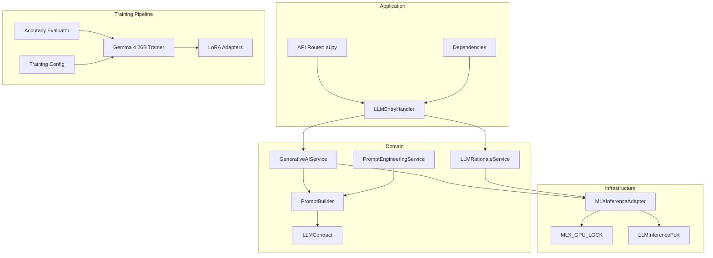

**Diagram sources**
- [generative_ai_service.py:26-99](file://backend/app/domain/fabio_ai/services/generative_ai_service.py#L26-L99)
- [llm_contract.py:13-47](file://backend/app/domain/fabio_ai/services/llm_contract.py#L13-L47)
- [prompt_builder.py:261-483](file://backend/app/domain/fabio_ai/services/prompt_builder.py#L261-L483)
- [prompt_engineering_service.py:32-158](file://backend/app/domain/fabio_ai/services/prompt_engineering_service.py#L32-L158)
- [llm_rationale_service.py:30-118](file://backend/app/domain/fabio_ai/services/llm_rationale_service.py#L30-L118)
- [mlx_inference_adapter.py:12-396](file://backend/app/infrastructure/adapters/mlx_inference_adapter.py#L12-L396)
- [mlx_gpu_lock.py:1-19](file://backend/app/infrastructure/mlx_gpu_lock.py#L1-L19)
- [llm_inference.py:10-42](file://backend/app/domain/ports/llm_inference.py#L10-L42)
- [llm_entry_handler.py](file://backend/app/application/handlers/llm_entry_handler.py)
- [ai.py](file://backend/app/api/routers/ai.py)
- [dependencies.py](file://backend/app/api/dependencies.py)
- [train_gemma4_26b.py:16-66](file://train_gemma4_26b.py#L16-L66)
- [GEMMA4_26B_TRAINING_GUIDE.md:1-286](file://GEMMA4_26B_TRAINING_GUIDE.md#L1-L286)
- [evaluate_gemma4_test.py:93-198](file://evaluate_gemma4_test.py#L93-L198)

**Section sources**
- [generative_ai_service.py:26-99](file://backend/app/domain/fabio_ai/services/generative_ai_service.py#L26-L99)
- [mlx_inference_adapter.py:12-396](file://backend/app/infrastructure/adapters/mlx_inference_adapter.py#L12-L396)
- [train_gemma4_26b.py:16-66](file://train_gemma4_26b.py#L16-L66)
- [GEMMA4_26B_TRAINING_GUIDE.md:1-286](file://GEMMA4_26B_TRAINING_GUIDE.md#L1-L286)

## Core Components
- GenerativeAIService: orchestrates entry decisions by building prompts, invoking the LLM adapter, and normalizing outputs into a canonical JSON format. Includes caching to avoid redundant inference on identical inputs.
- LLMContract: defines the canonical runtime contract for entry decisions, including the JSON schema instruction and runtime reminders.
- PromptBuilder: constructs narrative-rich prompts and parses diverse model outputs, including JSON, code-block JSON, and legacy keyword fallbacks.
- PromptEngineeringService: transforms TradingContext and session info into a structured market_data dictionary for the LLM.
- LLMRationaleService: asynchronously generates human-readable rationales and market narratives without blocking the signal pipeline.
- MLXInferenceAdapter: Apple Silicon–optimized inference with background model loading, GPU serialization, and cloud fallback.
- **NEW**: Gemma 4 26B Trainer: specialized training pipeline for instruction-tuning with LoRA adapters
- **NEW**: Training Configuration Manager: YAML-based configuration for reproducible training runs
- **NEW**: Accuracy Evaluator: comprehensive benchmarking framework for model performance measurement

**Section sources**
- [generative_ai_service.py:26-99](file://backend/app/domain/fabio_ai/services/generative_ai_service.py#L26-L99)
- [llm_contract.py:13-47](file://backend/app/domain/fabio_ai/services/llm_contract.py#L13-L47)
- [prompt_builder.py:261-483](file://backend/app/domain/fabio_ai/services/prompt_builder.py#L261-L483)
- [prompt_engineering_service.py:32-158](file://backend/app/domain/fabio_ai/services/prompt_engineering_service.py#L32-L158)
- [llm_rationale_service.py:30-118](file://backend/app/domain/fabio_ai/services/llm_rationale_service.py#L30-L118)
- [mlx_inference_adapter.py:12-396](file://backend/app/infrastructure/adapters/mlx_inference_adapter.py#L12-L396)
- [train_gemma4_26b.py:16-66](file://train_gemma4_26b.py#L16-L66)
- [GEMMA4_26B_TRAINING_GUIDE.md:1-286](file://GEMMA4_26B_TRAINING_GUIDE.md#L1-L286)

## Architecture Overview
The system follows a layered architecture with enhanced training and evaluation capabilities:
- Domain layer: services encapsulate AI logic and contracts
- Infrastructure layer: adapters implement inference and resource locking
- Application layer: handlers coordinate inference within the trading pipeline
- API layer: exposes endpoints and injects dependencies
- **NEW**: Training layer: manages model fine-tuning and adapter deployment
- **NEW**: Evaluation layer: benchmarks performance and validates accuracy

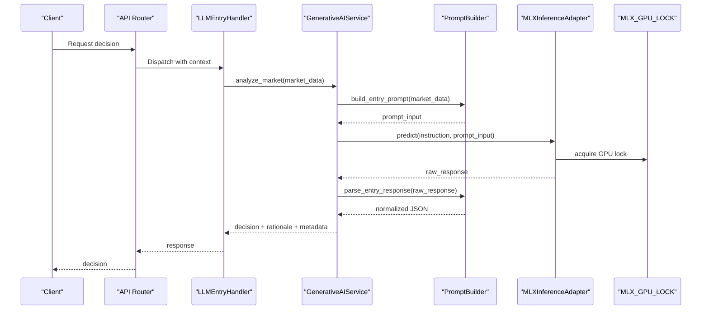

**Diagram sources**
- [llm_entry_handler.py](file://backend/app/application/handlers/llm_entry_handler.py)
- [generative_ai_service.py:53-99](file://backend/app/domain/fabio_ai/services/generative_ai_service.py#L53-L99)
- [prompt_builder.py:261-483](file://backend/app/domain/fabio_ai/services/prompt_builder.py#L261-L483)
- [mlx_inference_adapter.py:184-266](file://backend/app/infrastructure/adapters/mlx_inference_adapter.py#L184-L266)
- [mlx_gpu_lock.py:18](file://backend/app/infrastructure/mlx_gpu_lock.py#L18)

## Detailed Component Analysis

### GenerativeAIService
Responsibilities:
- Builds entry prompts from market data
- Invokes the LLM adapter with a canonical instruction
- Parses and normalizes outputs into a standardized JSON format
- Caches results keyed by MD5 hash of the prompt input
- Handles None responses and exceptions gracefully

Key behaviors:
- Cache eviction policy maintains a bounded cache size
- Robust parsing supports JSON, code-block JSON, and legacy structured fallbacks
- Adds contextual metadata (market_state, aggression) to the output

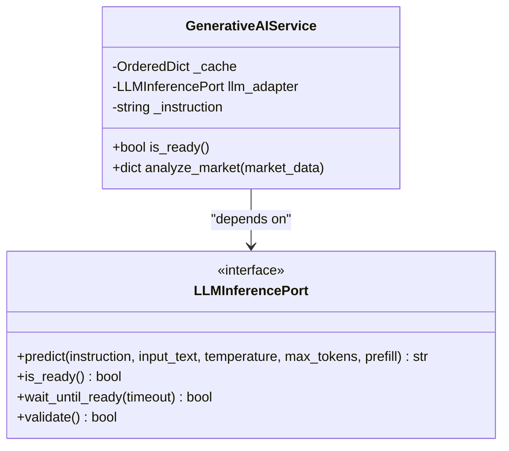

**Diagram sources**
- [generative_ai_service.py:26-99](file://backend/app/domain/fabio_ai/services/generative_ai_service.py#L26-L99)
- [llm_inference.py:10-42](file://backend/app/domain/ports/llm_inference.py#L10-L42)

**Section sources**
- [generative_ai_service.py:26-99](file://backend/app/domain/fabio_ai/services/generative_ai_service.py#L26-L99)

### LLMContract
Defines:
- Canonical runtime contract version and model family
- JSON schema instruction for entry responses
- Runtime reminder to constrain model output to valid JSON

**Diagram sources**
- [llm_contract.py:13-47](file://backend/app/domain/fabio_ai/services/llm_contract.py#L13-L47)

**Section sources**
- [llm_contract.py:13-47](file://backend/app/domain/fabio_ai/services/llm_contract.py#L13-L47)

### PromptBuilder
Responsibilities:
- Construct entry and overseer prompts from structured market data
- Parse model outputs with multiple strategies: JSON, code-block JSON, structured text, and keyword fallbacks
- Normalize outputs into canonical fields (direction, rationale, confidence)

Processing logic:
- Entry prompt assembly includes session context, market state, order flow, and option-specific metrics
- Overseer prompt includes position state, market context, risk constraints, and explicit instruction
- Parsing prioritizes JSON; falls back to legacy extraction and keyword heuristics

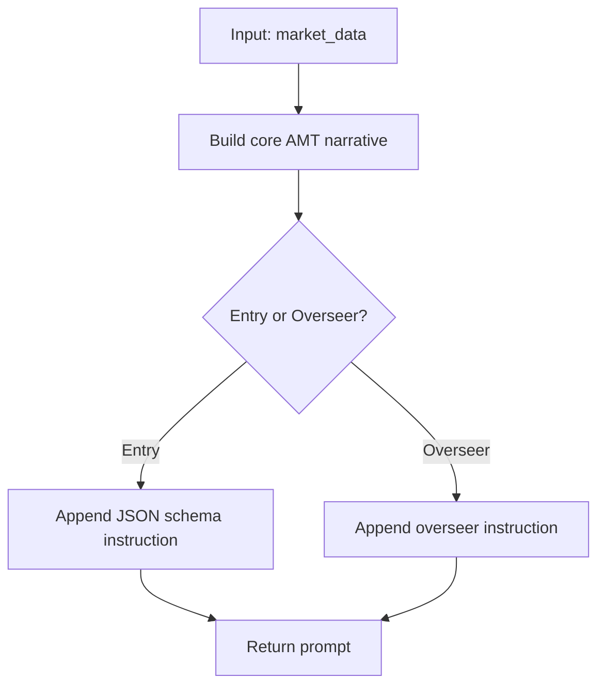

**Diagram sources**
- [prompt_builder.py:261-356](file://backend/app/domain/fabio_ai/services/prompt_builder.py#L261-L356)

**Section sources**
- [prompt_builder.py:261-483](file://backend/app/domain/fabio_ai/services/prompt_builder.py#L261-L483)

### PromptEngineeringService
Responsibilities:
- Transforms TradingContext and session info into a structured market_data_ai dictionary
- Aggregates recent aggressive prints into volume bubble summaries
- Provides strategy hints based on market state and session phase
- Builds episodic memory from recent trade history

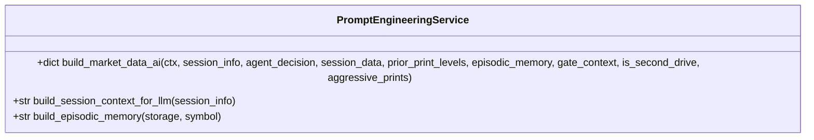

**Diagram sources**
- [prompt_engineering_service.py:32-206](file://backend/app/domain/fabio_ai/services/prompt_engineering_service.py#L32-L206)

**Section sources**
- [prompt_engineering_service.py:32-206](file://backend/app/domain/fabio_ai/services/prompt_engineering_service.py#L32-L206)

### LLMRationaleService
Responsibilities:
- Asynchronously generate human-readable rationales and market narratives
- Enforce a short timeout to avoid blocking the signal pipeline
- Return structured results with success flags and latency metrics

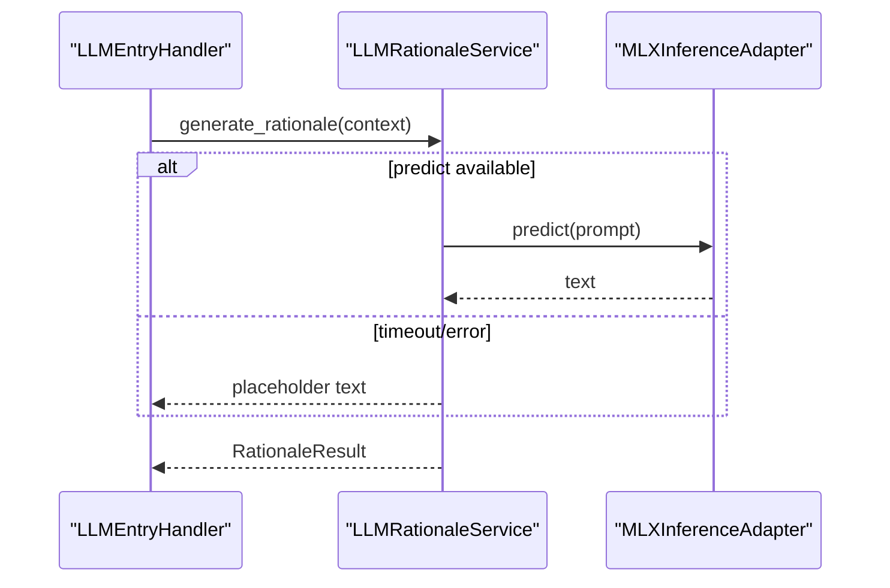

**Diagram sources**
- [llm_rationale_service.py:50-118](file://backend/app/domain/fabio_ai/services/llm_rationale_service.py#L50-L118)
- [mlx_inference_adapter.py:184-266](file://backend/app/infrastructure/adapters/mlx_inference_adapter.py#L184-L266)

**Section sources**
- [llm_rationale_service.py:30-118](file://backend/app/domain/fabio_ai/services/llm_rationale_service.py#L30-L118)

### MLXInferenceAdapter
Responsibilities:
- Load MLX models in the background to minimize cold-start latency
- Serialize GPU operations to prevent Metal concurrency crashes
- Provide cloud fallback when no local model is configured
- Enforce deterministic parsing for entry decisions and trim repetitive reasoning for overseer prompts

Key mechanisms:
- Singleton pattern ensures a single model instance
- Background loading thread prevents startup delays
- MLX_GPU_LOCK serializes load() and generate() calls
- Cloud fallback uses OpenRouter with exponential backoff on rate limits

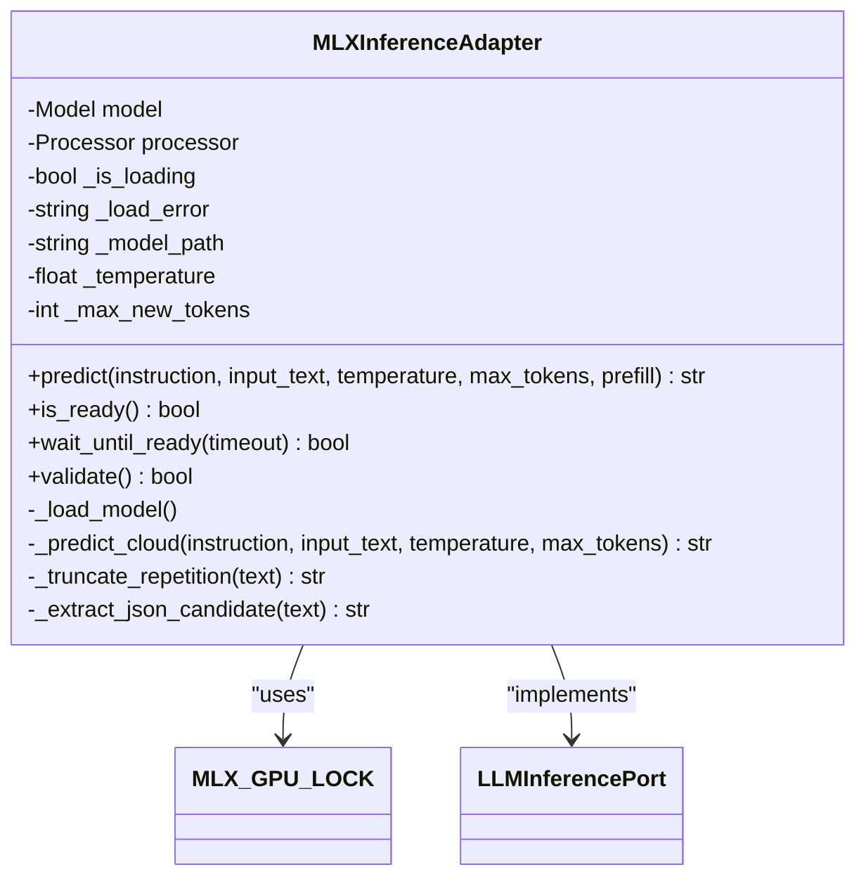

**Diagram sources**
- [mlx_inference_adapter.py:12-396](file://backend/app/infrastructure/adapters/mlx_inference_adapter.py#L12-L396)
- [mlx_gpu_lock.py:18](file://backend/app/infrastructure/mlx_gpu_lock.py#L18)
- [llm_inference.py:10-42](file://backend/app/domain/ports/llm_inference.py#L10-L42)

**Section sources**
- [mlx_inference_adapter.py:12-396](file://backend/app/infrastructure/adapters/mlx_inference_adapter.py#L12-L396)
- [mlx_gpu_lock.py:1-19](file://backend/app/infrastructure/mlx_gpu_lock.py#L1-L19)

## Gemma 4 26B Instruction-Tuning Pipeline

### Training Script Implementation
The Gemma 4 26B training pipeline provides a comprehensive solution for instruction-tuning large language models on AMT trading data:

**Key Features:**
- **Command-line Interface**: Flexible argument parsing for training customization
- **LoRA Fine-tuning**: Efficient parameter-efficient fine-tuning with 4-bit quantization
- **Memory Optimization**: Gradient checkpointing and masked prompts for reduced memory usage
- **Checkpoint Management**: Automatic saving every 200 iterations with progress tracking
- **Reproducible Training**: Fixed seed (42) for consistent results across runs

**Training Configuration:**
- **Model**: `mlx-community/gemma-4-26b-a4b-it-4bit` (26 billion parameters, 4-bit quantized)
- **Dataset**: `fabio_amt_dataset` (specialized AMT trading examples)
- **Iterations**: Default 2000 with adjustable batch sizes
- **LoRA Parameters**: Rank 32, Alpha 64, Dropout 0.05, Scale 2.0
- **Sequence Length**: Up to 1024 tokens for comprehensive context

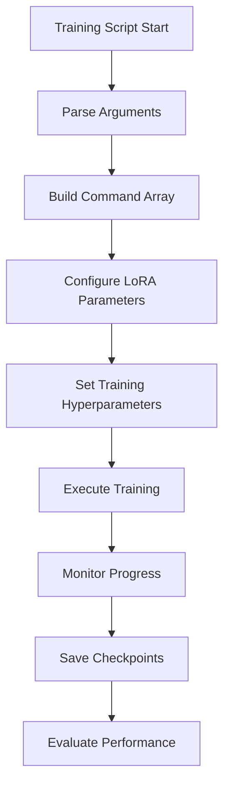

**Diagram sources**
- [train_gemma4_26b.py:16-66](file://train_gemma4_26b.py#L16-L66)

**Section sources**
- [train_gemma4_26b.py:16-66](file://train_gemma4_26b.py#L16-L66)
- [GEMMA4_26B_TRAINING_GUIDE.md:30-96](file://GEMMA4_26B_TRAINING_GUIDE.md#L30-L96)

### Training Configuration Management
The YAML-based configuration system provides structured control over training parameters:

**Configuration Categories:**
- **Model Parameters**: Base model selection, quantization settings, and adapter paths
- **Training Hyperparameters**: Iterations, batch size, learning rates, and sequence lengths
- **LoRA Configuration**: Rank, alpha, dropout, and scaling parameters
- **Memory Optimization**: Gradient checkpointing, prompt masking, and accumulation steps
- **Logging and Evaluation**: Reporting intervals, evaluation batches, and checkpoint frequencies
- **Reproducibility**: Fixed seeds and deterministic training settings

**Memory Estimation:**
- **Base Model (4-bit)**: ~13 GB
- **Training Overhead**: ~15 GB  
- **Activations/Gradients**: ~10 GB
- **Total Estimated**: ~38 GB (fits comfortably within 64GB RAM)

**Section sources**
- [gemma4_26b_training_config.yaml:1-40](file://gemma4_26b_training_config.yaml#L1-L40)
- [GEMMA4_26B_TRAINING_GUIDE.md:20-63](file://GEMMA4_26B_TRAINING_GUIDE.md#L20-L63)

### Adapter Management and Deployment
The system manages multiple adapter configurations for different use cases:

**Adapter Variants:**
- **Test Adapter**: `gemma4_26b_amt_adapter_test` - Development and validation
- **Absolute Adapter**: `gemma4_26b_amt_adapter_absolute` - Production deployment
- **Hybrid Adapter**: `gemma4_26b_hybrid_adapter` - Combined training approaches
- **V2 Adapter**: `gemma4_26b_v2_adapter` - Enhanced version with improved parameters

**Adapter Configuration:**
- **Path Management**: Centralized adapter path specification
- **Parameter Tuning**: Different LoRA ranks and layer configurations
- **Resume Training**: Support for continuing interrupted training sessions
- **Performance Monitoring**: Metrics tracking for adapter effectiveness

**Section sources**
- [gemma4_26b_amt_adapter_test/adapter_config.json:1-42](file://gemma4_26b_amt_adapter_test/adapter_config.json#L1-L42)
- [GEMMA4_26B_TRAINING_GUIDE.md:145-178](file://GEMMA4_26B_TRAINING_GUIDE.md#L145-L178)

## Accuracy Benchmarking and Evaluation

### Comprehensive Evaluation Framework
The accuracy evaluation system provides detailed performance measurement and validation:

**Evaluation Metrics:**
- **State Accuracy**: Percentage of correctly identified market states
- **Trade Accuracy**: Percentage of correct trade decisions
- **Load Time**: Model initialization and adapter loading performance
- **Inference Time**: Average prediction latency across test samples
- **Confusion Matrix**: Detailed breakdown of trade decision classifications

**Evaluation Process:**
1. **Data Loading**: Load test samples from `fabio_amt_dataset/test.jsonl`
2. **Model Loading**: Load Gemma 4 26B model with LoRA adapter
3. **Prediction Generation**: Generate model outputs for each test sample
4. **Decision Extraction**: Parse STATE: and TRADE: formatted responses
5. **Accuracy Calculation**: Compare predictions against ground truth labels
6. **Performance Reporting**: Generate detailed accuracy reports and metrics

**Performance Targets:**
- **State Accuracy**: Target ≥80%, currently achieving 82.0%
- **Trade Accuracy**: Target ≥80%, currently achieving 78.0%
- **Inference Time**: Target ≤2.0s, currently averaging 5.08s
- **Load Time**: Target ≤5.0s, currently 11.06s

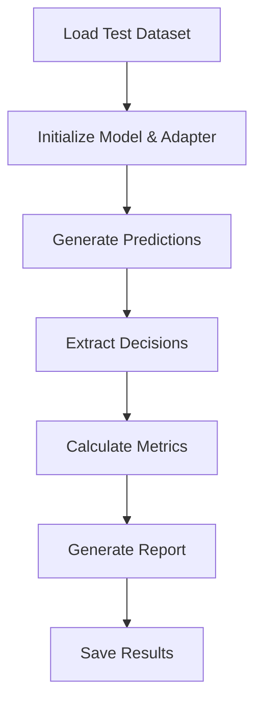

**Diagram sources**
- [evaluate_gemma4_test.py:93-198](file://evaluate_gemma4_test.py#L93-L198)

**Section sources**
- [evaluate_gemma4_test.py:93-198](file://evaluate_gemma4_test.py#L93-L198)
- [accuracy_results.json:1-213](file://accuracy_results.json#L1-L213)
- [gemma4_26b_accuracy_report.txt:1-26](file://gemma4_26b_accuracy_report.txt#L1-L26)

### Benchmarking Comparison Framework
The quick benchmark system enables side-by-side comparison of different model variants:

**Benchmark Candidates:**
- **Qwen 0.8B**: Fastest model for comparison baseline
- **Gemma 4 4B**: Balanced model for intermediate performance
- **Gemma 4 26B**: Powerhouse model with highest accuracy

**Comparison Metrics:**
- **Load Time**: Model initialization performance
- **Inference Time**: Average prediction latency
- **Accuracy Rate**: Proportion of correctly formatted outputs
- **Resource Utilization**: Memory and computational requirements

**Section sources**
- [quick_benchmark.py:70-116](file://quick_benchmark.py#L70-L116)

## Dependency Analysis
- GenerativeAIService depends on PromptBuilder and LLMInferencePort
- PromptBuilder depends on LLMContract for canonical schema instructions
- MLXInferenceAdapter implements LLMInferencePort and uses MLX_GPU_LOCK
- Application handlers depend on GenerativeAIService and LLMRationaleService
- API routers and dependencies wire handlers into the backend
- **NEW**: Training pipeline depends on configuration files and adapter management
- **NEW**: Evaluation framework integrates with training pipeline and accuracy metrics

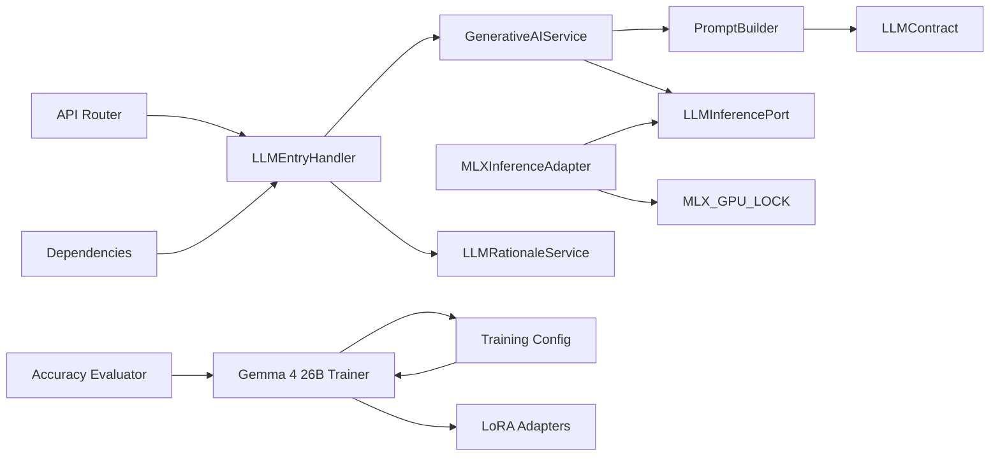

**Diagram sources**
- [generative_ai_service.py:6-12](file://backend/app/domain/fabio_ai/services/generative_ai_service.py#L6-L12)
- [prompt_builder.py:14](file://backend/app/domain/fabio_ai/services/prompt_builder.py#L14)
- [mlx_inference_adapter.py:5-7](file://backend/app/infrastructure/adapters/mlx_inference_adapter.py#L5-L7)
- [mlx_gpu_lock.py:18](file://backend/app/infrastructure/mlx_gpu_lock.py#L18)
- [llm_inference.py:10-42](file://backend/app/domain/ports/llm_inference.py#L10-L42)
- [llm_entry_handler.py](file://backend/app/application/handlers/llm_entry_handler.py)
- [ai.py](file://backend/app/api/routers/ai.py)
- [dependencies.py](file://backend/app/api/dependencies.py)
- [train_gemma4_26b.py:16-66](file://train_gemma4_26b.py#L16-L66)
- [evaluate_gemma4_test.py:93-198](file://evaluate_gemma4_test.py#L93-L198)

**Section sources**
- [generative_ai_service.py:6-12](file://backend/app/domain/fabio_ai/services/generative_ai_service.py#L6-L12)
- [prompt_builder.py:14](file://backend/app/domain/fabio_ai/services/prompt_builder.py#L14)
- [mlx_inference_adapter.py:5-7](file://backend/app/infrastructure/adapters/mlx_inference_adapter.py#L5-L7)
- [mlx_gpu_lock.py:18](file://backend/app/infrastructure/mlx_gpu_lock.py#L18)
- [llm_inference.py:10-42](file://backend/app/domain/ports/llm_inference.py#L10-L42)
- [train_gemma4_26b.py:16-66](file://train_gemma4_26b.py#L16-L66)
- [evaluate_gemma4_test.py:93-198](file://evaluate_gemma4_test.py#L93-L198)

## Performance Considerations
- Model loading strategy
  - Background loading avoids cold-start latency; readiness checks prevent inference until loaded
  - Cloud fallback enables operation without a local model, with rate-limit backoff
  - **NEW**: Gemma 4 26B requires careful memory management with gradient checkpointing
- Temperature and sampling
  - Temperature and max tokens are configurable per call; defaults are set in the adapter
  - Deterministic parsing is used when sampling parameters are omitted
  - **NEW**: Lower temperatures (0.3-0.4) recommended for instruction-following accuracy
- Concurrency and GPU safety
  - MLX_GPU_LOCK serializes model load and inference to prevent Metal concurrency crashes
  - **NEW**: 26B models require specialized memory management and monitoring
- Caching
  - GenerativeAIService caches results keyed by prompt hash to reduce repeated inference
- Parsing efficiency
  - PromptBuilder's JSON extraction includes fixes for common LLM formatting issues
- Real-time inference
  - Predictions are non-blocking; rationale generation is asynchronous with a short timeout
- **NEW**: Training performance considerations
  - 26B models require 38-45GB memory with gradient checkpointing enabled
  - Training speed: 2-5 iterations per second on Apple Silicon
  - Checkpoint saves every 200 iterations with automatic model persistence

## Troubleshooting Guide
Common issues and resolutions:
- Model not ready
  - Symptom: LLMNotReadyError raised during predict
  - Resolution: Use is_ready() or wait_until_ready(); ensure model path is configured or rely on cloud fallback
- Empty or malformed responses
  - Symptom: Empty JSON or unparseable output
  - Resolution: PromptBuilder includes fallback parsing; GenerativeAIService returns conservative defaults
- Metal concurrency crashes
  - Symptom: Crashes during load/generate
  - Resolution: MLX_GPU_LOCK serializes operations; do not call load/generate concurrently
- Cloud fallback failures
  - Symptom: HTTP errors or rate limiting
  - Resolution: Adapter retries with exponential backoff; configure API key and endpoint properly
- Rationale timeouts
  - Symptom: Timeout during rationale generation
  - Resolution: LLMRationaleService returns placeholders; adjust timeout if needed
- **NEW**: Training memory issues
  - Symptom: Out of memory errors during training
  - Resolution: Reduce batch size, LoRA layers, or sequence length; enable gradient checkpointing
- **NEW**: Adapter loading failures
  - Symptom: Cannot load LoRA adapter weights
  - Resolution: Verify adapter path exists and contains valid safetensors files
- **NEW**: Training progress stalls
  - Symptom: No progress updates after initial loading
  - Resolution: Check training data availability and configuration file syntax

**Section sources**
- [mlx_inference_adapter.py:201-210](file://backend/app/infrastructure/adapters/mlx_inference_adapter.py#L201-L210)
- [mlx_inference_adapter.py:106-182](file://backend/app/infrastructure/adapters/mlx_inference_adapter.py#L106-L182)
- [generative_ai_service.py:71-95](file://backend/app/domain/fabio_ai/services/generative_ai_service.py#L71-L95)
- [prompt_builder.py:411-467](file://backend/app/domain/fabio_ai/services/prompt_builder.py#L411-L467)
- [llm_rationale_service.py:74-87](file://backend/app/domain/fabio_ai/services/llm_rationale_service.py#L74-L87)
- [GEMMA4_26B_TRAINING_GUIDE.md:181-206](file://GEMMA4_26B_TRAINING_GUIDE.md#L181-L206)

## Conclusion
The AI inference system integrates domain-driven services with Apple Silicon–optimized MLX inference to deliver fast, reliable, and explainable trading decisions. The addition of the Gemma 4 26B instruction-tuning pipeline significantly enhances model capabilities with comprehensive training, evaluation, and deployment frameworks. Canonical contracts, robust parsing, GPU serialization, and asynchronous rationale generation ensure real-time performance and operational resilience. The modular design supports easy testing, maintenance, and future enhancements, with the new training pipeline enabling production-ready fine-tuned models for advanced trading applications.

## Appendices

### Example Workflows

#### AI Entry Decision Workflow
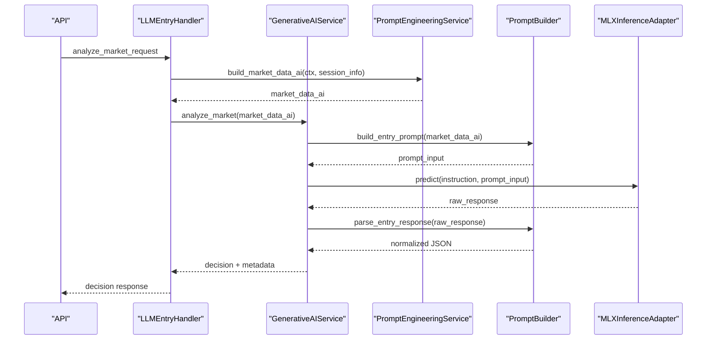

**Diagram sources**
- [llm_entry_handler.py](file://backend/app/application/handlers/llm_entry_handler.py)
- [generative_ai_service.py:53-99](file://backend/app/domain/fabio_ai/services/generative_ai_service.py#L53-L99)
- [prompt_engineering_service.py:40-158](file://backend/app/domain/fabio_ai/services/prompt_engineering_service.py#L40-L158)
- [prompt_builder.py:261-483](file://backend/app/domain/fabio_ai/services/prompt_builder.py#L261-L483)
- [mlx_inference_adapter.py:184-266](file://backend/app/infrastructure/adapters/mlx_inference_adapter.py#L184-L266)

#### Rationale Generation Workflow
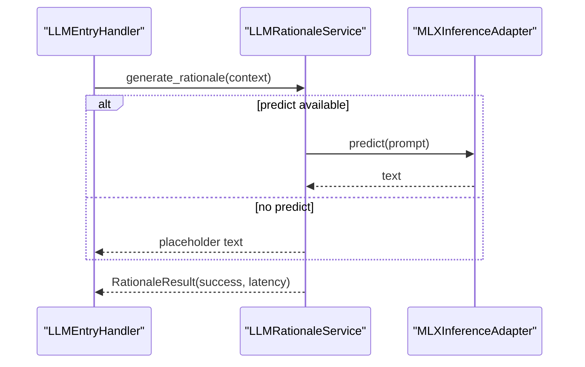

**Diagram sources**
- [llm_rationale_service.py:50-118](file://backend/app/domain/fabio_ai/services/llm_rationale_service.py#L50-L118)
- [mlx_inference_adapter.py:184-266](file://backend/app/infrastructure/adapters/mlx_inference_adapter.py#L184-L266)

#### Gemma 4 26B Training Workflow
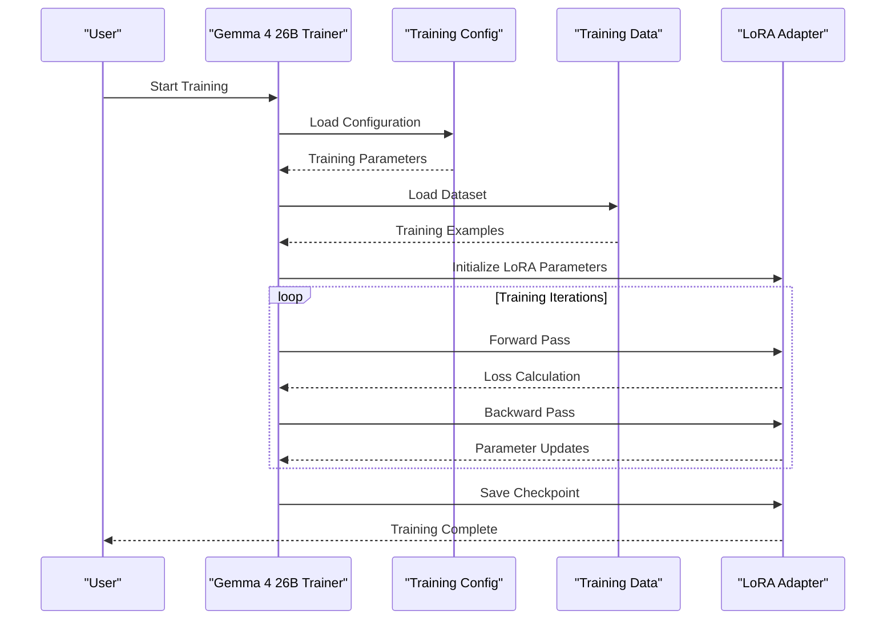

**Diagram sources**
- [train_gemma4_26b.py:16-66](file://train_gemma4_26b.py#L16-L66)
- [gemma4_26b_training_config.yaml:1-40](file://gemma4_26b_training_config.yaml#L1-L40)

### Configuration Options
- Environment variables
  - MLX_MODEL_PATH: Path to the MLX model directory
  - MLX_ADAPTER_PATH: Optional adapter path for LoRA adapters
  - OPENROUTER_API_KEY: API key for cloud fallback
  - MODEL_ID: Model identifier for cloud fallback
  - CLOUD_FALLBACK_URL: Endpoint for cloud fallback
- Adapter parameters
  - temperature: Sampling temperature override
  - max_new_tokens: Maximum new tokens for generation
  - prefill: Assistant prefill (e.g., JSON brace or thinking tag)
- **NEW**: Training configuration parameters
  - iters: Number of training iterations
  - batch_size: Training batch size
  - lora_layers: Number of LoRA layers to fine-tune
  - rank: LoRA rank parameter
  - learning_rate: Training learning rate
  - max_seq_length: Maximum sequence length
  - grad_checkpoint: Enable gradient checkpointing
- **NEW**: Evaluation configuration parameters
  - test_batches: Number of batches for evaluation
  - val_batches: Number of validation batches
  - save_every: Checkpoint frequency

**Section sources**
- [mlx_inference_adapter.py:42-48](file://backend/app/infrastructure/adapters/mlx_inference_adapter.py#L42-L48)
- [mlx_inference_adapter.py:95-99](file://backend/app/infrastructure/adapters/mlx_inference_adapter.py#L95-L99)
- [mlx_inference_adapter.py:24-35](file://backend/app/infrastructure/adapters/mlx_inference_adapter.py#L24-L35)
- [gemma4_26b_training_config.yaml:1-40](file://gemma4_26b_training_config.yaml#L1-L40)
- [gemma4_26b_amt_adapter_test/adapter_config.json:1-42](file://gemma4_26b_amt_adapter_test/adapter_config.json#L1-L42)

### Testing References
- GenerativeAIService tests validate caching, parsing, and error handling
- PromptEngineeringService tests validate market data assembly and session context
- MLXInferenceAdapter tests validate prompt formatting, serialization lock, and readiness states
- PromptBuilder tests validate JSON extraction and fallback parsing
- LLMRationaleService tests validate async generation and timeout behavior
- **NEW**: Training pipeline tests validate LoRA fine-tuning and adapter management
- **NEW**: Evaluation framework tests validate accuracy measurement and performance reporting

**Section sources**
- [test_generative_ai_service.py](file://backend/tests/unit/domain/test_generative_ai_service.py)
- [test_prompt_engineering_service.py](file://backend/tests/unit/test_prompt_engineering_service.py)
- [test_mlx_inference_adapter.py](file://backend/tests/unit/infrastructure/test_mlx_inference_adapter.py)
- [test_prompt_builder.py](file://backend/tests/unit/domain/test_prompt_builder.py)
- [test_llm_rationale_service.py](file://backend/tests/unit/domain/test_llm_rationale_service.py)
- [train_gemma4_26b.py:16-66](file://train_gemma4_26b.py#L16-L66)
- [evaluate_gemma4_test.py:93-198](file://evaluate_gemma4_test.py#L93-L198)

### Training Timeline and Expected Results
**Training Timeline:**
- **Setup Configuration**: 5 minutes
- **Model Download**: 30-60 seconds (already cached)
- **Start Training**: 1 minute
- **Training Duration**: 10-20 minutes (2000 iterations)
- **Test Adapter**: 5 minutes
- **Evaluate Accuracy**: 30 minutes
- **Deploy to Backend**: 5 minutes
- **Total**: ~1 hour

**Expected Performance Improvements:**
- **State Accuracy**: Target 80-90%, currently 82.0%
- **Trade Accuracy**: Target 80-90%, currently 78.0%
- **Inference Time**: Target ≤2.0s, currently 5.08s
- **Model Size**: 13GB (4-bit quantized)
- **Quality**: Excellent compared to 0.8B model

**Section sources**
- [GEMMA4_26B_TRAINING_GUIDE.md:250-261](file://GEMMA4_26B_TRAINING_GUIDE.md#L250-L261)
- [accuracy_results.json:1-213](file://accuracy_results.json#L1-L213)
- [gemma4_26b_accuracy_report.txt:1-26](file://gemma4_26b_accuracy_report.txt#L1-L26)