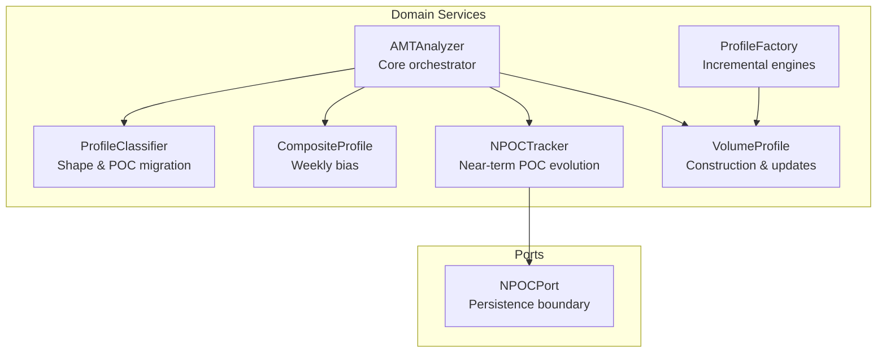
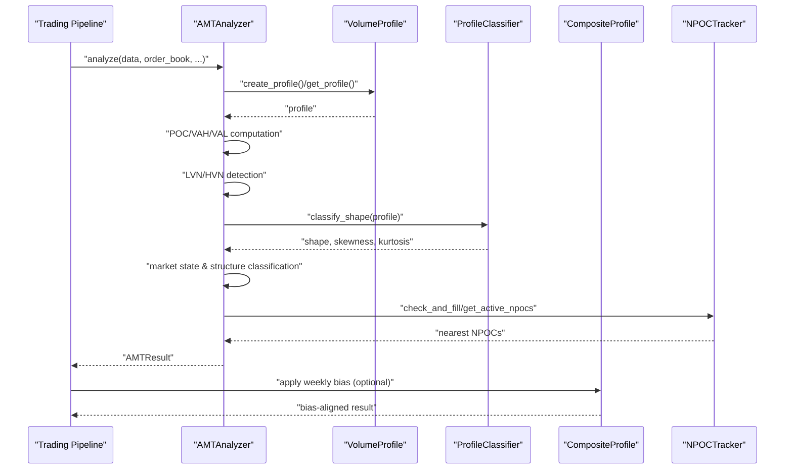
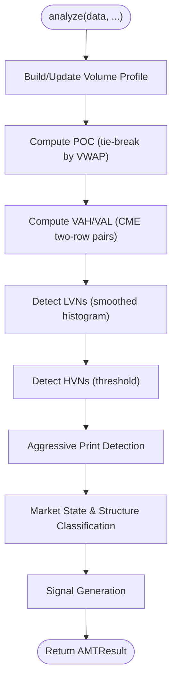
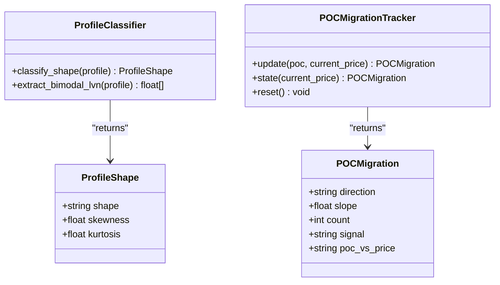
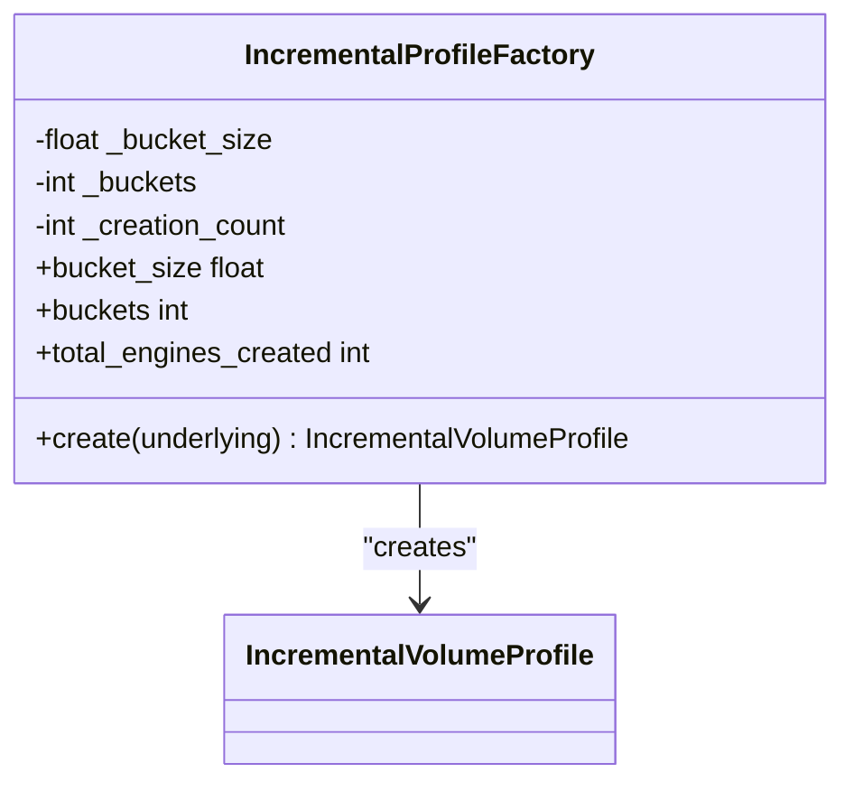
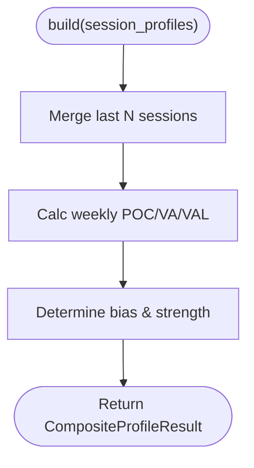
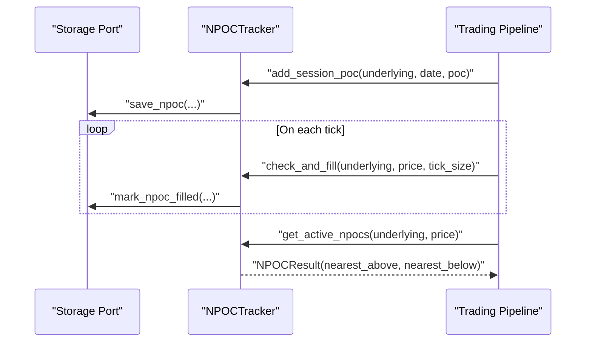
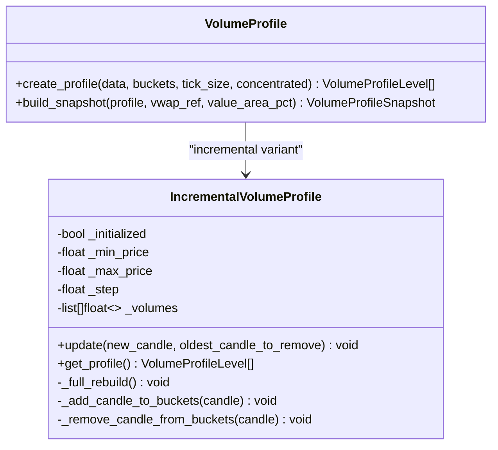
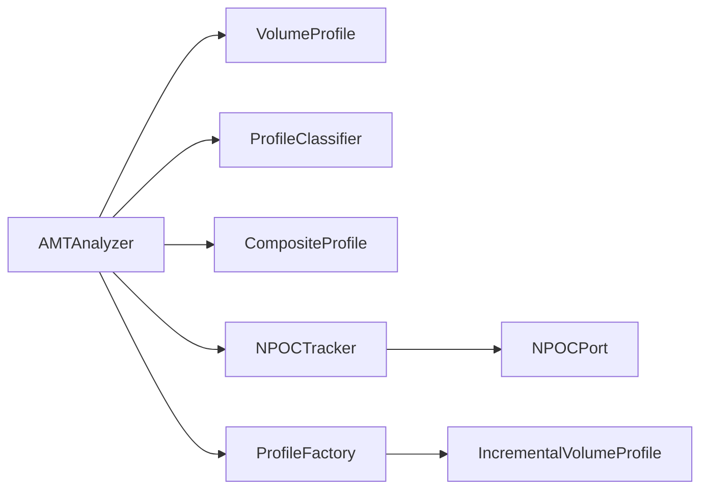

# AMT Analysis Engine

<cite>
**Referenced Files in This Document**
- [amt_analyzer.py](file://backend/app/domain/fabio_ai/services/amt_analyzer.py)
- [profile_classifier.py](file://backend/app/domain/fabio_ai/services/profile_classifier.py)
- [profile_factory.py](file://backend/app/domain/fabio_ai/services/profile_factory.py)
- [composite_profile.py](file://backend/app/domain/fabio_ai/services/composite_profile.py)
- [npoc_tracker.py](file://backend/app/domain/fabio_ai/services/npoc_tracker.py)
- [npoc.py](file://backend/app/domain/ports/npoc.py)
- [volume_profile.py](file://backend/app/domain/services/volume_profile.py)
- [test_amt_analyzer.py](file://backend/tests/unit/domain/test_amt_analyzer.py)
- [test_composite_profile.py](file://backend/tests/unit/test_composite_profile.py)
- [test_npoc_tracker.py](file://backend/tests/unit/test_npoc_tracker.py)
</cite>

## Table of Contents
1. [Introduction](#introduction)
2. [Project Structure](#project-structure)
3. [Core Components](#core-components)
4. [Architecture Overview](#architecture-overview)
5. [Detailed Component Analysis](#detailed-component-analysis)
6. [Dependency Analysis](#dependency-analysis)
7. [Performance Considerations](#performance-considerations)
8. [Troubleshooting Guide](#troubleshooting-guide)
9. [Conclusion](#conclusion)

## Introduction
This document describes the Auction Market Theory (AMT) analysis engine that powers microstructure-driven insights for trading. It focuses on:
- Volume profile construction and updates
- Point of Control (POC), Value Area High (VAH), and Value Area Low (VAL) computation
- Low/High Volume Node (LVN/HVN) detection with persistence
- Market structure classification and state assessment
- Order flow confirmations and aggression scoring
- Multi-timeframe alignment and session context
- Integration with broader trading pipeline components

The engine is implemented as a pure domain service with clear boundaries, enabling efficient real-time processing and extensibility for multi-symbol and multi-timeframe workflows.

## Project Structure
The AMT engine resides in the domain layer under the Fabio AI services and integrates with supporting services for volume profiles, classification, and persistence.

**Diagram sources**
- [amt_analyzer.py:215-281](file://backend/app/domain/fabio_ai/services/amt_analyzer.py#L215-L281)
- [profile_classifier.py:56-87](file://backend/app/domain/fabio_ai/services/profile_classifier.py#L56-L87)
- [profile_factory.py:21-54](file://backend/app/domain/fabio_ai/services/profile_factory.py#L21-L54)
- [composite_profile.py:31-112](file://backend/app/domain/fabio_ai/services/composite_profile.py#L31-L112)
- [npoc_tracker.py:17-41](file://backend/app/domain/fabio_ai/services/npoc_tracker.py#L17-L41)
- [volume_profile.py:293-490](file://backend/app/domain/services/volume_profile.py#L293-L490)
- [npoc.py:29-56](file://backend/app/domain/ports/npoc.py#L29-L56)

**Section sources**
- [amt_analyzer.py:1-120](file://backend/app/domain/fabio_ai/services/amt_analyzer.py#L1-L120)
- [profile_classifier.py:1-47](file://backend/app/domain/fabio_ai/services/profile_classifier.py#L1-L47)
- [profile_factory.py:1-30](file://backend/app/domain/fabio_ai/services/profile_factory.py#L1-L30)
- [composite_profile.py:1-38](file://backend/app/domain/fabio_ai/services/composite_profile.py#L1-L38)
- [npoc_tracker.py:1-30](file://backend/app/domain/fabio_ai/services/npoc_tracker.py#L1-L30)
- [volume_profile.py:1-32](file://backend/app/domain/services/volume_profile.py#L1-L32)

## Core Components
- AMTAnalyzer: Orchestrates the full AMT pipeline, including volume profile construction, POC/VA computation, LVN/HVN detection, market state assessment, order flow confirmations, and signal generation.
- ProfileClassifier: Classifies profile shapes (D/P/b/B) and tracks POC migration trends.
- ProfileFactory: Creates per-symbol IncrementalVolumeProfile engines with consistent bucket configuration.
- CompositeProfile: Merges recent session profiles to derive weekly POC/VA and bias for alignment filtering.
- NPOCTracker: Tracks naked (unfilled) previous session POCs and exposes nearest active levels for secondary targets.
- VolumeProfile: Provides both full and incremental profile builders, with optimized bucket sizing and distribution logic.

**Section sources**
- [amt_analyzer.py:215-281](file://backend/app/domain/fabio_ai/services/amt_analyzer.py#L215-L281)
- [profile_classifier.py:56-87](file://backend/app/domain/fabio_ai/services/profile_classifier.py#L56-L87)
- [profile_factory.py:21-54](file://backend/app/domain/fabio_ai/services/profile_factory.py#L21-L54)
- [composite_profile.py:31-112](file://backend/app/domain/fabio_ai/services/composite_profile.py#L31-L112)
- [npoc_tracker.py:17-41](file://backend/app/domain/fabio_ai/services/npoc_tracker.py#L17-L41)
- [volume_profile.py:196-290](file://backend/app/domain/services/volume_profile.py#L196-L290)

## Architecture Overview
The AMT engine composes modular services to deliver a robust, spec-compliant analysis pipeline. It emphasizes:
- Separation of concerns: pure domain logic with explicit ports for persistence
- Incremental computation for real-time performance
- Multi-source confirmations for robustness
- Extensible configuration for exchange-specific tuning

**Diagram sources**
- [amt_analyzer.py:623-1148](file://backend/app/domain/fabio_ai/services/amt_analyzer.py#L623-L1148)
- [volume_profile.py:196-290](file://backend/app/domain/services/volume_profile.py#L196-L290)
- [profile_classifier.py:56-87](file://backend/app/domain/fabio_ai/services/profile_classifier.py#L56-L87)
- [composite_profile.py:114-156](file://backend/app/domain/fabio_ai/services/composite_profile.py#L114-L156)
- [npoc_tracker.py:80-156](file://backend/app/domain/fabio_ai/services/npoc_tracker.py#L80-L156)

## Detailed Component Analysis

### AMTAnalyzer
The core orchestrator performs:
- Volume profile construction (full or incremental)
- POC tie-breaking using session VWAP
- Value Area computation using CME two-row pairs method
- LVN/HVN detection with smoothing and persistence
- Aggressive print detection and persistent aggression scoring
- Market state and structure classification
- Multi-timeframe alignment and session context
- Signal generation with clear setup types and reasons

Key processing logic:
- POC tie-break: when multiple bins share maximum volume, choose the bin closest to session VWAP.
- Value Area: expand outward in steps of two bins, prioritizing higher-volume pairs.
- LVN/HVN: thresholds derived from mean volume; LVN < 15%, HVN > 200%.
- Persistence: LVN persistence tracker prevents flickering and improves reliability.
- Aggression scoring: combines footprint confirmation, CVD slope, big trade, absorption, OFI alignment, confluence, and volume bubbles.
- Market structure: reconciles state and structure, with overrides for logical consistency.

**Diagram sources**
- [amt_analyzer.py:623-1148](file://backend/app/domain/fabio_ai/services/amt_analyzer.py#L623-L1148)

**Section sources**
- [amt_analyzer.py:215-281](file://backend/app/domain/fabio_ai/services/amt_analyzer.py#L215-L281)
- [amt_analyzer.py:623-1148](file://backend/app/domain/fabio_ai/services/amt_analyzer.py#L623-L1148)
- [test_amt_analyzer.py:116-240](file://backend/tests/unit/domain/test_amt_analyzer.py#L116-L240)

### ProfileClassifier
Computes profile shape classification and POC migration:
- Shape classification: D (bell), P (top-heavy), b (bottom-heavy), B (bimodal) using skewness/kurtosis.
- Bimodal override: if bimodal detected, treat as balanced regardless of market state.
- POC migration: linear regression slope and direction; alignment with current price yields signals.

**Diagram sources**
- [profile_classifier.py:56-87](file://backend/app/domain/fabio_ai/services/profile_classifier.py#L56-L87)
- [profile_classifier.py:145-204](file://backend/app/domain/fabio_ai/services/profile_classifier.py#L145-L204)

**Section sources**
- [profile_classifier.py:56-87](file://backend/app/domain/fabio_ai/services/profile_classifier.py#L56-L87)
- [profile_classifier.py:145-204](file://backend/app/domain/fabio_ai/services/profile_classifier.py#L145-L204)

### ProfileFactory
Creates IncrementalVolumeProfile engines with consistent configuration:
- Shared bucket_size and buckets across all engines
- Per-symbol isolation for stateful computations
- Logging for creation and configuration

**Diagram sources**
- [profile_factory.py:21-67](file://backend/app/domain/fabio_ai/services/profile_factory.py#L21-L67)
- [volume_profile.py:293-321](file://backend/app/domain/services/volume_profile.py#L293-L321)

**Section sources**
- [profile_factory.py:21-67](file://backend/app/domain/fabio_ai/services/profile_factory.py#L21-L67)
- [volume_profile.py:293-321](file://backend/app/domain/services/volume_profile.py#L293-L321)

### CompositeProfile
Merges recent session profiles to derive weekly POC/VA and bias:
- Merges either full profiles or simple poc/vah/val snapshots
- Calculates weekly LVNs/HVNs and determines bias strength
- Applies weekly bias to filter trade alignment

**Diagram sources**
- [composite_profile.py:43-112](file://backend/app/domain/fabio_ai/services/composite_profile.py#L43-L112)

**Section sources**
- [composite_profile.py:31-112](file://backend/app/domain/fabio_ai/services/composite_profile.py#L31-L112)
- [test_composite_profile.py:10-108](file://backend/tests/unit/test_composite_profile.py#L10-L108)

### NPOCTracker
Tracks naked (unfilled) previous session POCs and supports near-term evolution:
- Adds session POCs at session close
- Checks fills on each tick within a 2-tick zone
- Retrieves nearest active NPOCs above/below current price
- Loads persisted state on startup

**Diagram sources**
- [npoc_tracker.py:42-156](file://backend/app/domain/fabio_ai/services/npoc_tracker.py#L42-L156)
- [npoc.py:29-56](file://backend/app/domain/ports/npoc.py#L29-L56)

**Section sources**
- [npoc_tracker.py:17-190](file://backend/app/domain/fabio_ai/services/npoc_tracker.py#L17-L190)
- [npoc.py:9-56](file://backend/app/domain/ports/npoc.py#L9-L56)
- [test_npoc_tracker.py:78-324](file://backend/tests/unit/test_npoc_tracker.py#L78-L324)

### VolumeProfile Construction and Updates
- Full profile builder: uniform distribution across candle ranges, optional concentrated mode placing volume at close.
- Incremental profile: maintains bucket totals and updates in O(buckets) time, with automatic rebuilds when price range expands.
- Optimal bucket sizing: dynamic based on price range and tick size.

**Diagram sources**
- [volume_profile.py:196-290](file://backend/app/domain/services/volume_profile.py#L196-L290)
- [volume_profile.py:293-490](file://backend/app/domain/services/volume_profile.py#L293-L490)

**Section sources**
- [volume_profile.py:196-290](file://backend/app/domain/services/volume_profile.py#L196-L290)
- [volume_profile.py:293-490](file://backend/app/domain/services/volume_profile.py#L293-L490)
- [test_amt_analyzer.py:58-92](file://backend/tests/unit/domain/test_amt_analyzer.py#L58-L92)

## Dependency Analysis
The AMTAnalyzer composes multiple services and ports. Dependencies are intentionally minimal and focused on pure domain logic, with persistence abstracted behind ports.

**Diagram sources**
- [amt_analyzer.py:215-281](file://backend/app/domain/fabio_ai/services/amt_analyzer.py#L215-L281)
- [profile_classifier.py:56-87](file://backend/app/domain/fabio_ai/services/profile_classifier.py#L56-L87)
- [composite_profile.py:31-112](file://backend/app/domain/fabio_ai/services/composite_profile.py#L31-L112)
- [npoc_tracker.py:17-41](file://backend/app/domain/fabio_ai/services/npoc_tracker.py#L17-L41)
- [npoc.py:29-56](file://backend/app/domain/ports/npoc.py#L29-L56)
- [profile_factory.py:21-54](file://backend/app/domain/fabio_ai/services/profile_factory.py#L21-L54)
- [volume_profile.py:293-321](file://backend/app/domain/services/volume_profile.py#L293-L321)

**Section sources**
- [amt_analyzer.py:215-281](file://backend/app/domain/fabio_ai/services/amt_analyzer.py#L215-L281)
- [npoc.py:29-56](file://backend/app/domain/ports/npoc.py#L29-L56)

## Performance Considerations
- Incremental profile updates: O(buckets) per new candle; rebuild only when price range expands beyond tolerance.
- Bucket sizing: dynamic based on price range and tick size to balance resolution and memory.
- Smoothing for LVN/HVN: reduces noise and prevents flickering.
- Early exits: returns empty result for insufficient data; avoids unnecessary computation.
- Real-time processing: session VWAP accumulators and rolling trackers minimize overhead.
- Memory management: bounded history windows (e.g., POC migration, structure classifier) prevent unbounded growth.

Practical tips:
- Use IncrementalVolumeProfile for live streams to avoid full rebuilds.
- Tune bucket_size via ProfileFactory for the underlying’s tick size and price range.
- Limit lookback windows for AR, structure, and POC migration to desired sensitivity.
- Persist NPOCs via NPOCPort to recover state after restarts without recomputation.

[No sources needed since this section provides general guidance]

## Troubleshooting Guide
Common issues and resolutions:
- Empty or invalid profile: ensure sufficient data and valid OHLC fields; verify bucket computation and price range.
- POC ties: confirm VWAP tie-break logic is applied when multiple bins share max volume.
- LVN/HVN instability: adjust smoothing window and thresholds; leverage LVN persistence tracker.
- Extreme VWAP deviations: monitor sigma bands; investigate data source mismatches between underlying and derivatives.
- NPOC not triggering: verify 2-tick zone and tick_size; ensure persistence storage is functioning.

Validation references:
- Unit tests cover profile creation, POC tie-break, VWAP bands, LVN/HVN detection, incremental updates, and NPOC lifecycle.

**Section sources**
- [test_amt_analyzer.py:116-240](file://backend/tests/unit/domain/test_amt_analyzer.py#L116-L240)
- [test_composite_profile.py:10-108](file://backend/tests/unit/test_composite_profile.py#L10-L108)
- [test_npoc_tracker.py:78-324](file://backend/tests/unit/test_npoc_tracker.py#L78-L324)

## Conclusion
The AMT Analysis Engine delivers a robust, spec-compliant framework for auction-market theory analysis. Its modular design enables efficient real-time processing, reliable multi-symbol scaling, and seamless integration with broader trading systems. By combining precise volume profile construction, resilient LVN/HVN detection, and multi-source confirmations, it provides actionable insights for both intraday and session-level strategies.