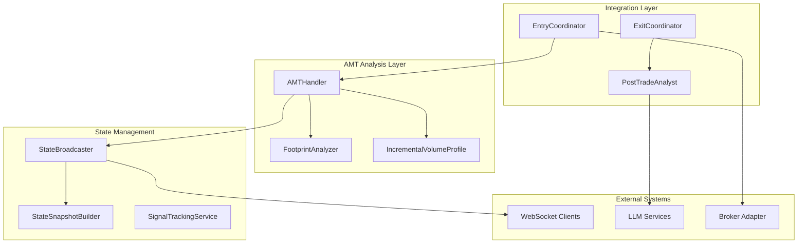
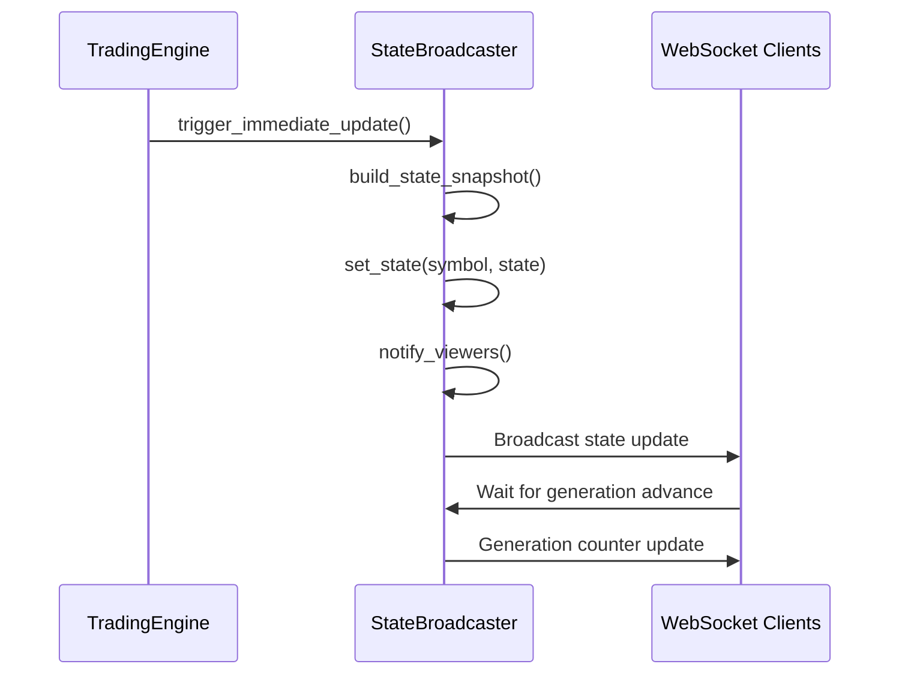
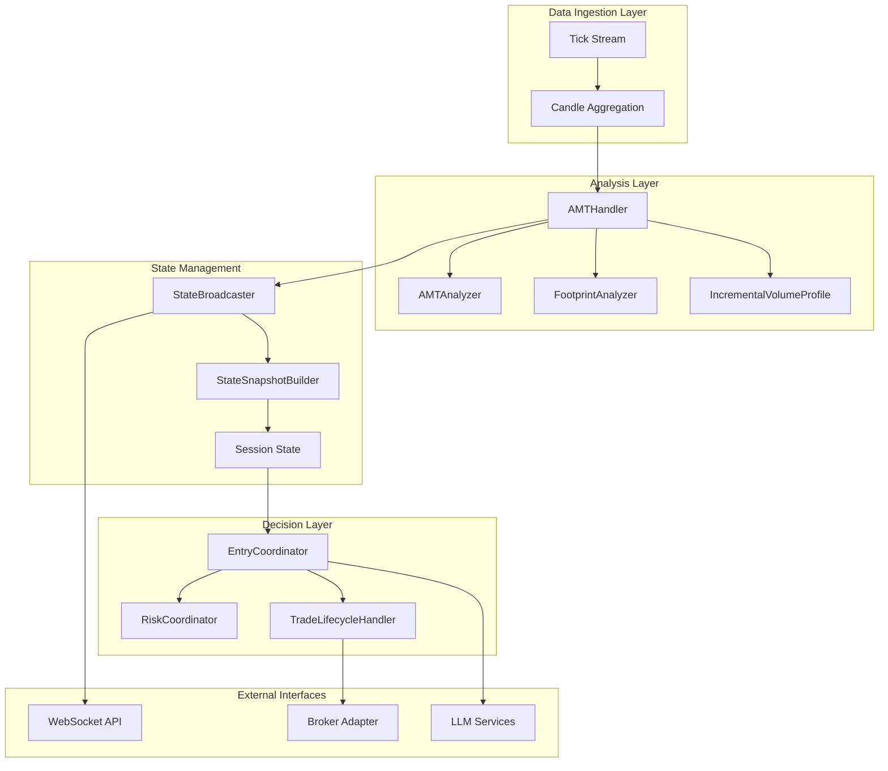
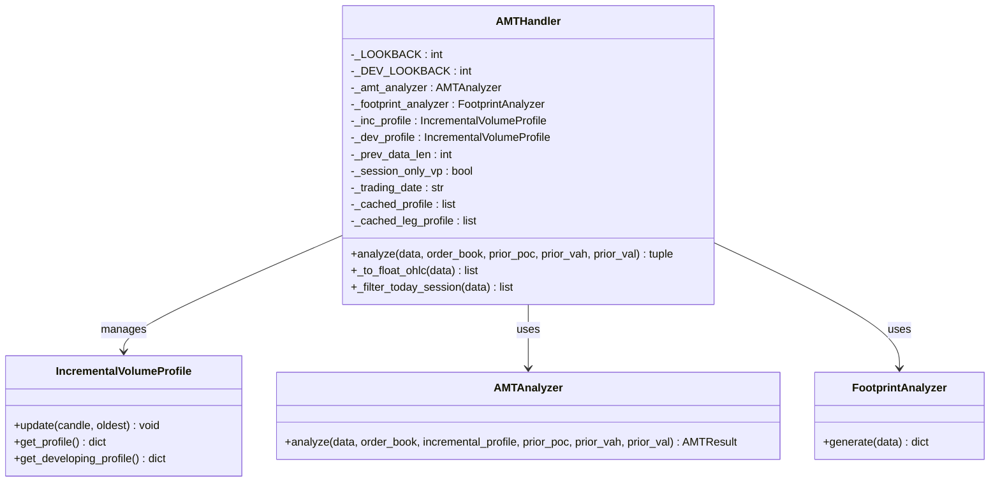
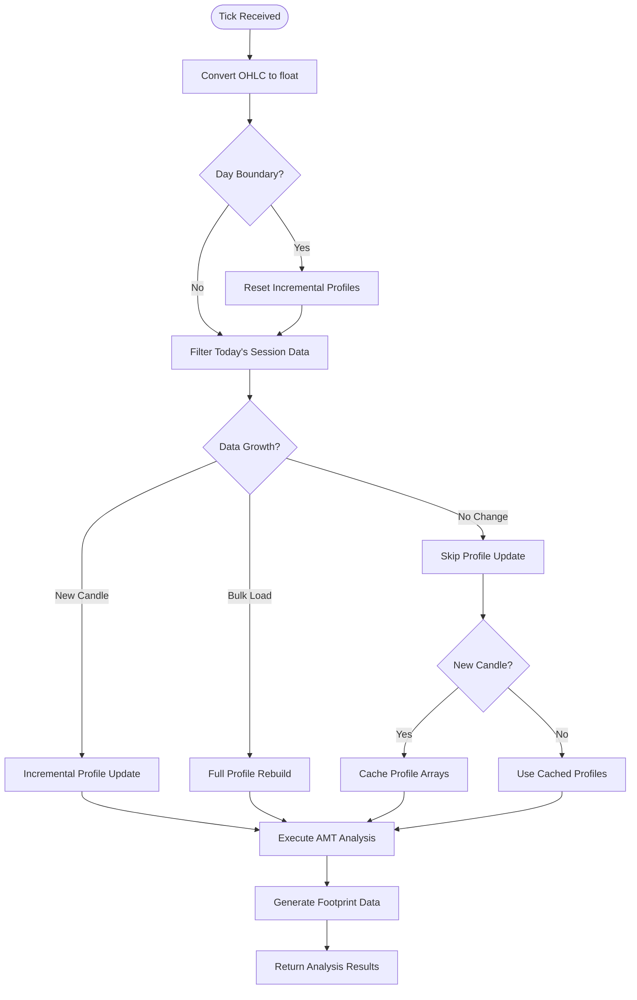
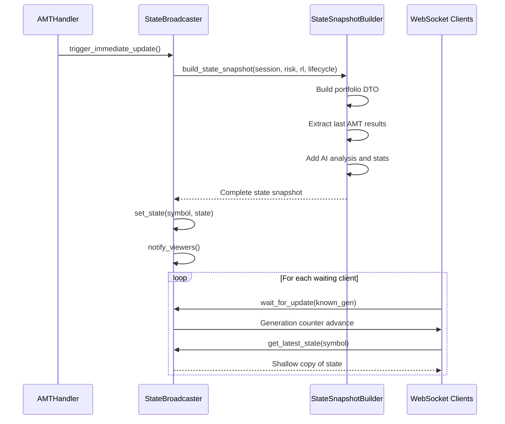
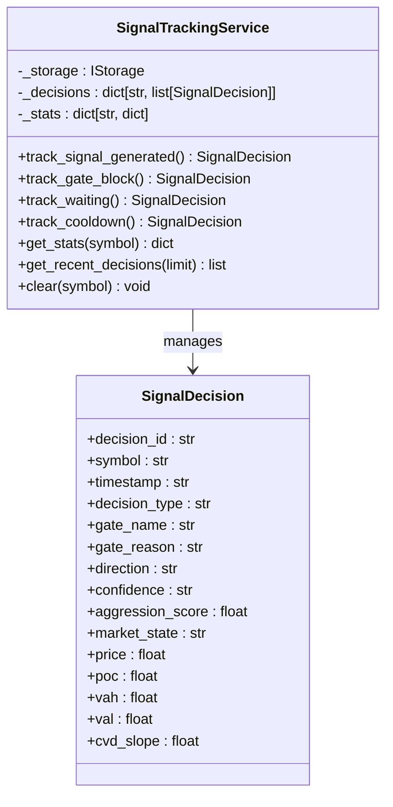
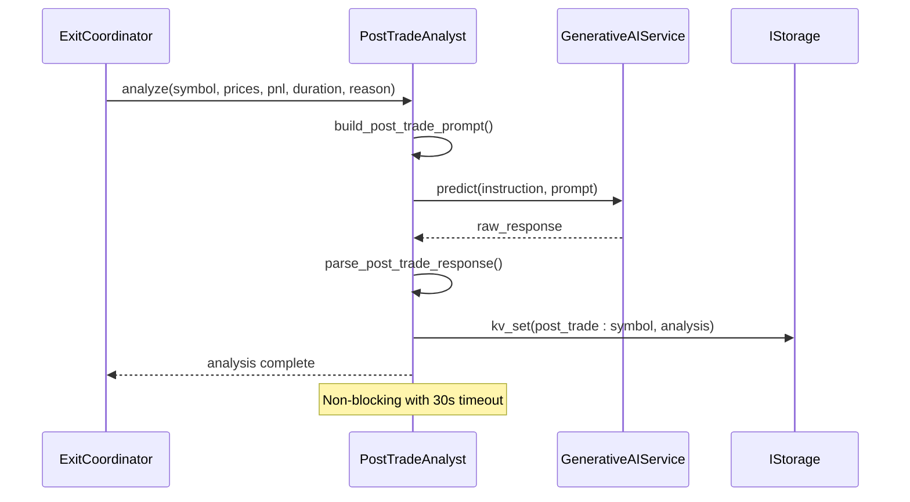
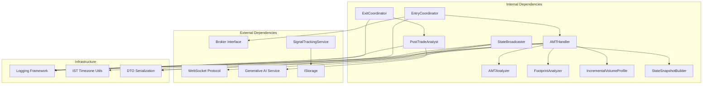

# AMT Analysis Service

<cite>
**Referenced Files in This Document**
- [amt_handler.py](file://backend/app/application/handlers/amt_handler.py)
- [state_broadcaster.py](file://backend/app/application/services/state_broadcaster.py)
- [signal_tracking_service.py](file://backend/app/application/services/signal_tracking_service.py)
- [post_trade_analyst.py](file://backend/app/application/handlers/post_trade_analyst.py)
- [state_snapshot_builder.py](file://backend/app/application/services/state_snapshot_builder.py)
- [entry_coordinator.py](file://backend/app/application/services/entry_coordinator.py)
- [exit_coordinator.py](file://backend/app/application/services/exit_coordinator.py)
- [DEPLOYMENT_GUIDE.md](file://appv2/DEPLOYMENT_GUIDE.md)
- [ARCHITECTURE_DEEP_DIVE.md](file://backend/ARCHITECTURE_DEEP_DIVE.md)
</cite>

## Table of Contents
1. [Introduction](#introduction)
2. [Project Structure](#project-structure)
3. [Core Components](#core-components)
4. [Architecture Overview](#architecture-overview)
5. [Detailed Component Analysis](#detailed-component-analysis)
6. [Dependency Analysis](#dependency-analysis)
7. [Performance Considerations](#performance-considerations)
8. [Troubleshooting Guide](#troubleshooting-guide)
9. [Conclusion](#conclusion)

## Introduction
The AMT Analysis Service is the core market context analysis engine responsible for generating Advanced Market Timing insights and order flow footprint data on every incoming tick. It processes OHLC market data, order book snapshots, and historical context to produce actionable market state information including Point of Control (POC), Value Area High (VAH), Value Area Low (VAL), Liquidity Zone Numbers (LVN/HVN), and aggression scores. The service operates continuously alongside the trading pipeline, providing real-time market structure analysis that informs higher-level decision-making systems.

## Project Structure
The AMT Analysis Service is organized within the backend application's application layer, with clear separation of concerns between analysis handlers, state management, and integration services. The service integrates deeply with the trading engine while maintaining independence for analysis-only operations.

**Diagram sources**
- [amt_handler.py:45-196](file://backend/app/application/handlers/amt_handler.py#L45-L196)
- [state_broadcaster.py:27-364](file://backend/app/application/services/state_broadcaster.py#L27-L364)
- [signal_tracking_service.py:72-386](file://backend/app/application/services/signal_tracking_service.py#L72-L386)

**Section sources**
- [DEPLOYMENT_GUIDE.md:111-141](file://appv2/DEPLOYMENT_GUIDE.md#L111-L141)
- [ARCHITECTURE_DEEP_DIVE.md:365-440](file://backend/ARCHITECTURE_DEEP_DIVE.md#L365-L440)

## Core Components

### AMTHandler - Primary Analysis Engine
The AMTHandler serves as the central orchestrator for all market context analysis. It manages incremental volume profile updates, handles day-boundary detection, and coordinates between different analysis components.

**Key Features:**
- **Incremental Volume Profile Management**: Maintains two profile windows - a long-term 1000-candle profile and a short-term developing VA profile
- **Session-Aware Data Filtering**: Applies appropriate data filtering based on instrument type (options vs commodities)
- **Real-time State Caching**: Caches profile arrays to minimize frontend redraws during sub-candle updates
- **Day Boundary Detection**: Automatically rebuilds profiles when trading sessions change

**Processing Pipeline:**
1. Convert Decimal-based OHLC to float for analysis
2. Detect trading day boundaries and reset profiles accordingly
3. Filter data based on session requirements
4. Update incremental volume profiles (full rebuild or incremental update)
5. Execute AMT analysis with both profiles
6. Generate footprint data for order flow visualization
7. Cache results for efficient state broadcasting

**Section sources**
- [amt_handler.py:45-196](file://backend/app/application/handlers/amt_handler.py#L45-L196)

### StateBroadcaster - Real-time State Distribution
The StateBroadcaster manages the distribution of analysis results to connected WebSocket clients, implementing sophisticated throttling and generation tracking mechanisms.

**Core Responsibilities:**
- **Generation Counter Management**: Tracks state updates across all symbols
- **Throttled Notifications**: Prevents client flooding through configurable intervals
- **Thread-Safe State Updates**: Provides safe access patterns for concurrent environments
- **Viewer Synchronization**: Enables clients to track state changes via generation counters

**Notification Flow:**

**Diagram sources**
- [state_broadcaster.py:234-306](file://backend/app/application/services/state_broadcaster.py#L234-L306)

**Section sources**
- [state_broadcaster.py:27-364](file://backend/app/application/services/state_broadcaster.py#L27-L364)

### SignalTrackingService - Decision Analytics
The SignalTrackingService provides comprehensive analytics of the signal generation pipeline, tracking every decision point from gate evaluations to final signal execution.

**Tracking Capabilities:**
- **Gate Block Analysis**: Detailed tracking of why signals are blocked at various gates
- **Generation Rate Monitoring**: Statistics on signal generation vs rejection rates
- **Quality Assessment**: Win rate analysis by gate passage
- **Timing Pattern Recognition**: When signals cluster and market conditions

**Data Structure:**
The service maintains a comprehensive decision log with timestamps, gate information, market context, and agent/LMM inputs for post-trade analysis and system optimization.

**Section sources**
- [signal_tracking_service.py:72-386](file://backend/app/application/services/signal_tracking_service.py#L72-L386)

## Architecture Overview

The AMT Analysis Service operates within a sophisticated trading engine architecture that separates concerns across multiple layers while maintaining tight integration for optimal performance.

**Diagram sources**
- [ARCHITECTURE_DEEP_DIVE.md:365-440](file://backend/ARCHITECTURE_DEEP_DIVE.md#L365-L440)
- [amt_handler.py:89-196](file://backend/app/application/handlers/amt_handler.py#L89-L196)

The architecture follows several key design patterns:
- **Facade Pattern**: AMTHandler provides a unified interface to complex analysis operations
- **Observer Pattern**: StateBroadcaster notifies interested parties of state changes
- **Command Pattern**: EntryCoordinator encapsulates execution logic for signals
- **Strategy Pattern**: Different analysis strategies can be applied based on market conditions

## Detailed Component Analysis

### AMTHandler Implementation Details

The AMTHandler implements a sophisticated incremental analysis system designed for high-frequency market data processing with minimal computational overhead.

**Diagram sources**
- [amt_handler.py:45-196](file://backend/app/application/handlers/amt_handler.py#L45-L196)

**Processing Logic Flow:**

**Diagram sources**
- [amt_handler.py:89-196](file://backend/app/application/handlers/amt_handler.py#L89-L196)

**Performance Optimizations:**
- **Profile Caching**: Prevents redundant calculations during sub-candle updates
- **Adaptive Lookback**: Adjusts profile window size based on available data
- **Session-Aware Filtering**: Optimizes data processing for different instrument types
- **Memory Management**: Efficient list reuse to minimize garbage collection pressure

**Section sources**
- [amt_handler.py:45-196](file://backend/app/application/handlers/amt_handler.py#L45-L196)

### State Management and Distribution

The state management system provides a robust foundation for real-time market data distribution with sophisticated concurrency controls and notification mechanisms.

**Diagram sources**
- [state_broadcaster.py:247-306](file://backend/app/application/services/state_broadcaster.py#L247-L306)
- [state_snapshot_builder.py:23-85](file://backend/app/application/services/state_snapshot_builder.py#L23-L85)

**Concurrency Controls:**
- **Per-Symbol Locks**: Prevent race conditions during state updates
- **Thread-Safe Access**: Copy-on-read patterns prevent data corruption
- **Event Loop Integration**: Cross-thread notifications via asyncio event loops
- **Generation Tracking**: Client-side synchronization through generation counters

**Section sources**
- [state_broadcaster.py:27-364](file://backend/app/application/services/state_broadcaster.py#L27-L364)
- [state_snapshot_builder.py:23-190](file://backend/app/application/services/state_snapshot_builder.py#L23-L190)

### Signal Generation and Tracking

The signal tracking system provides comprehensive analytics of the entire signal generation pipeline, enabling detailed post-trade analysis and system optimization.

**Diagram sources**
- [signal_tracking_service.py:72-386](file://backend/app/application/services/signal_tracking_service.py#L72-L386)

**Analytics Features:**
- **Gate Performance Analysis**: Detailed breakdown of which gates block most frequently
- **Quality Metrics**: Win rate analysis by gate passage and market state
- **Timing Intelligence**: Pattern recognition for signal clustering and timing
- **Context Tracking**: Comprehensive market context for each decision point

**Section sources**
- [signal_tracking_service.py:72-386](file://backend/app/application/services/signal_tracking_service.py#L72-L386)

### Post-Trade Analysis Integration

The post-trade analysis system provides automated quality assessment of completed trades, integrating with LLM services for continuous improvement.

**Diagram sources**
- [post_trade_analyst.py:136-262](file://backend/app/application/handlers/post_trade_analyst.py#L136-L262)

**Analysis Capabilities:**
- **Quality Scoring**: Automated 1-10 quality assessment of trades
- **Mistake Identification**: Systematic identification of trading mistakes
- **Improvement Recommendations**: Actionable suggestions for performance enhancement
- **Learning Integration**: Results fed back into the learning system

**Section sources**
- [post_trade_analyst.py:118-262](file://backend/app/application/handlers/post_trade_analyst.py#L118-L262)

## Dependency Analysis

The AMT Analysis Service exhibits excellent modularity with clear dependency boundaries and well-defined interfaces between components.

**Dependency Characteristics:**
- **High Cohesion**: Each component has a single, well-defined responsibility
- **Low Coupling**: Clear interfaces minimize inter-component dependencies
- **Testability**: All dependencies are injectable, enabling comprehensive testing
- **Extensibility**: Well-defined interfaces support easy extension and replacement

**Potential Issues:**
- **Circular Dependencies**: None detected in current implementation
- **Tight Coupling**: Some components share common interfaces that could be extracted
- **External Dependencies**: LLM services introduce latency and reliability concerns

**Section sources**
- [amt_handler.py:9-11](file://backend/app/application/handlers/amt_handler.py#L9-L11)
- [state_broadcaster.py:18-21](file://backend/app/application/services/state_broadcaster.py#L18-L21)

## Performance Considerations

The AMT Analysis Service is designed for high-frequency market data processing with several built-in optimizations:

**Memory Management:**
- Profile array caching prevents unnecessary object creation during sub-candle updates
- Incremental profile updates minimize computational overhead
- Adaptive lookback windows optimize memory usage based on available data

**Processing Efficiency:**
- Float conversion occurs only once per analysis cycle
- Session-aware filtering reduces data processing volume
- Thread-safe operations minimize contention in concurrent environments

**Network Optimization:**
- State broadcasting implements throttling to prevent client flooding
- Generation counters enable efficient client synchronization
- DTO serialization minimizes payload sizes

**Scalability Factors:**
- Per-symbol state management supports multi-symbol deployments
- Asynchronous processing enables non-blocking operations
- Modular design allows for horizontal scaling

## Troubleshooting Guide

### Common Issues and Solutions

**AMTHandler Performance Degradation:**
- **Symptoms**: Slow analysis times, increased memory usage
- **Causes**: Large lookback windows, insufficient data filtering
- **Solutions**: Adjust `_LOOKBACK` values, implement proper session filtering

**State Broadcasting Failures:**
- **Symptoms**: Clients not receiving updates, generation counter stalls
- **Causes**: Event loop not properly configured, connection timeouts
- **Solutions**: Verify event loop setup, check network connectivity

**Signal Tracking Inconsistencies:**
- **Symptoms**: Missing or duplicate tracking entries
- **Causes**: Race conditions, storage failures
- **Solutions**: Implement proper locking, add retry mechanisms

**Post-Trade Analysis Failures:**
- **Symptoms**: Analysis timeouts, LLM service unavailability
- **Causes**: Network latency, service downtime
- **Solutions**: Implement fallback mechanisms, add monitoring alerts

**Section sources**
- [state_broadcaster.py:207-222](file://backend/app/application/services/state_broadcaster.py#L207-L222)
- [post_trade_analyst.py:254-257](file://backend/app/application/handlers/post_trade_analyst.py#L254-L257)

### Monitoring and Debugging

**Key Metrics to Monitor:**
- Analysis processing time per tick
- State broadcast frequency and latency
- Signal generation rates and quality scores
- Post-trade analysis completion rates

**Debugging Tools:**
- Logging at INFO level for normal operations
- DEBUG level for detailed analysis traces
- Performance profiling for bottleneck identification

**Section sources**
- [signal_tracking_service.py:129-137](file://backend/app/application/services/signal_tracking_service.py#L129-L137)
- [state_broadcaster.py:213-221](file://backend/app/application/services/state_broadcaster.py#L213-L221)

## Conclusion

The AMT Analysis Service represents a sophisticated, production-ready market context analysis system that successfully balances performance, scalability, and maintainability. Its modular design enables seamless integration with broader trading systems while providing comprehensive market structure analysis capabilities.

**Key Strengths:**
- **Robust Architecture**: Clear separation of concerns with well-defined interfaces
- **Performance Optimization**: Sophisticated caching and incremental processing strategies
- **Real-time Capabilities**: Efficient state broadcasting and client synchronization
- **Comprehensive Analytics**: Detailed signal tracking and post-trade analysis integration

**Areas for Enhancement:**
- **Error Resilience**: Enhanced fallback mechanisms for external service dependencies
- **Monitoring**: Expanded metrics collection and alerting capabilities
- **Testing**: Additional integration tests for complex failure scenarios
- **Documentation**: Inline code documentation for complex algorithms

The service provides a solid foundation for advanced trading applications, with clear pathways for extension and optimization as trading requirements evolve.