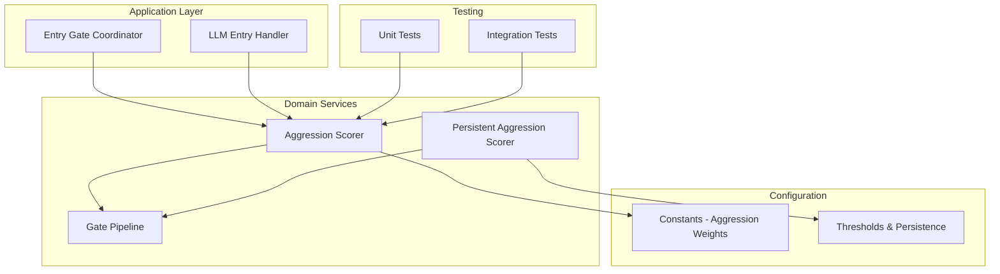
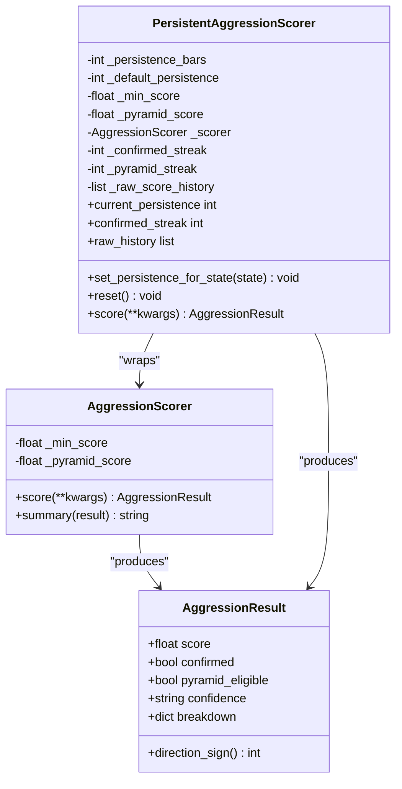
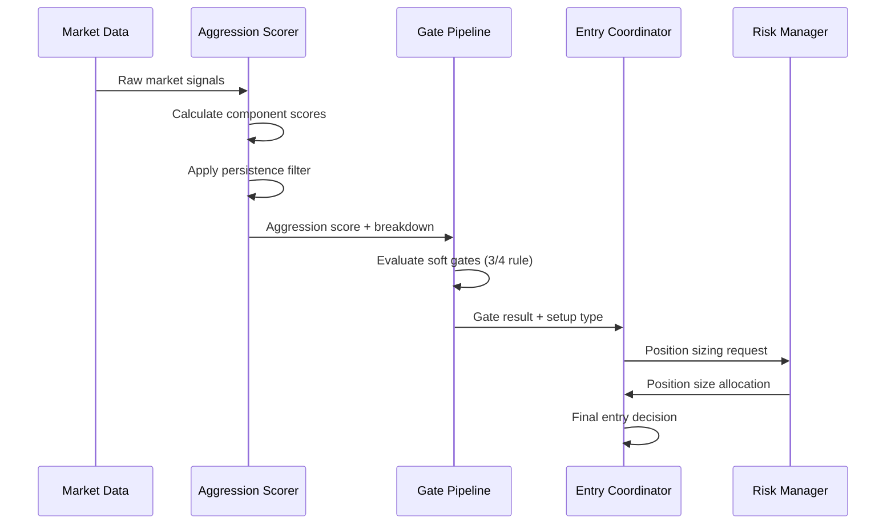
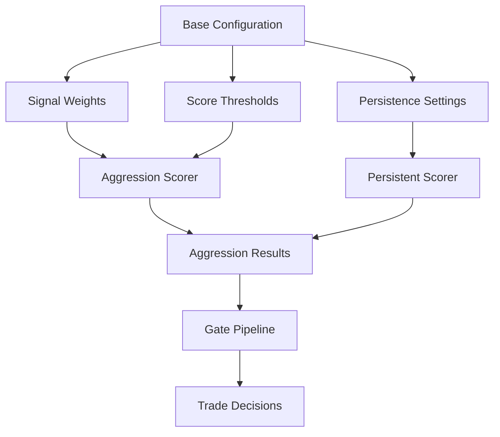
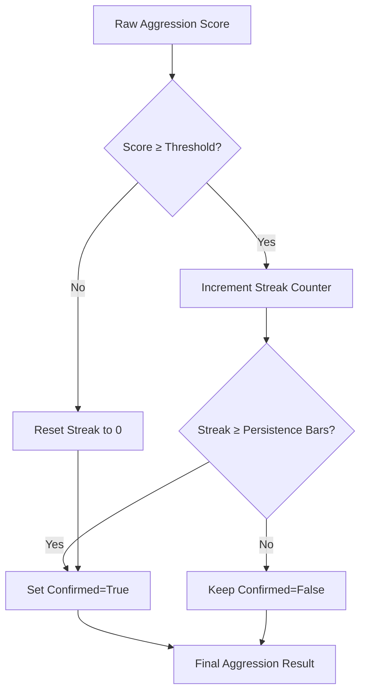
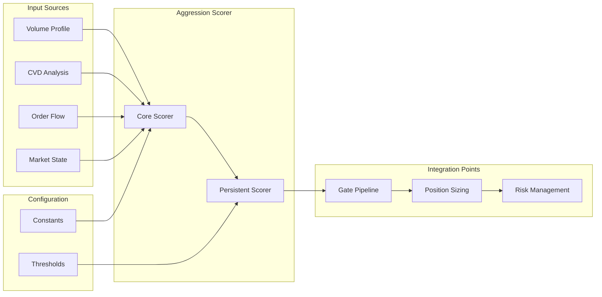

# Aggression Scorer

<cite>
**Referenced Files in This Document**
- [aggression_scorer.py](file://backend/app/domain/fabio_ai/services/aggression_scorer.py)
- [aggression_scorer.py](file://appv2/backend/appv2/domain/services/aggression_scorer.py)
- [constants.py](file://backend/app/domain/constants.py)
- [constants.py](file://appv2/backend/appv2/config/constants.py)
- [test_aggression_scorer.py](file://backend/tests/unit/domain/test_aggression_scorer.py)
- [gate_pipeline.py](file://backend/app/domain/fabio_ai/services/gate_pipeline.py)
- [entry_gate_coordinator.py](file://backend/app/application/handlers/entry_gate_coordinator.py)
- [08_fix_plan.md](file://plan/08_fix_plan.md)
</cite>

## Table of Contents
1. [Introduction](#introduction)
2. [Project Structure](#project-structure)
3. [Core Components](#core-components)
4. [Architecture Overview](#architecture-overview)
5. [Detailed Component Analysis](#detailed-component-analysis)
6. [Dependency Analysis](#dependency-analysis)
7. [Performance Considerations](#performance-considerations)
8. [Troubleshooting Guide](#troubleshooting-guide)
9. [Conclusion](#conclusion)

## Introduction
The Aggression Scorer is a core component of the Fabio AMT (Auction Market Theory) trading system that quantifies market pressure and institutional activity through multiple order flow and volume signals. It transforms discrete market observations into a unified aggression score that serves as a gating mechanism for trade entries and position sizing decisions.

The system operates on the principle that aggressive institutional participation creates measurable patterns in order flow, volume distribution, and price action that can be systematically detected and scored. The Aggression Scorer provides both immediate scoring capability and persistent filtering to prevent signal flicker in volatile markets.

## Project Structure
The Aggression Scorer implementation spans multiple architectural layers within the trading system:

**Diagram sources**
- [entry_gate_coordinator.py:32-125](file://backend/app/application/handlers/entry_gate_coordinator.py#L32-L125)
- [aggression_scorer.py:60-153](file://backend/app/domain/fabio_ai/services/aggression_scorer.py#L60-L153)
- [gate_pipeline.py:174-382](file://backend/app/domain/fabio_ai/services/gate_pipeline.py#L174-L382)

**Section sources**
- [aggression_scorer.py:1-282](file://backend/app/domain/fabio_ai/services/aggression_scorer.py#L1-L282)
- [constants.py:102-114](file://backend/app/domain/constants.py#L102-L114)

## Core Components

### Aggression Scoring Architecture
The Aggression Scorer implements a multi-signal additive scoring system with configurable weights and persistence filtering:

**Diagram sources**
- [aggression_scorer.py:39-153](file://backend/app/domain/fabio_ai/services/aggression_scorer.py#L39-L153)
- [aggression_scorer.py:165-282](file://backend/app/domain/fabio_ai/services/aggression_scorer.py#L165-L282)

### Signal Components and Weights
The system evaluates seven distinct signals, each contributing to the overall aggression assessment:

| Signal Type | Weight | Description | Trigger Condition |
|-------------|--------|-------------|-------------------|
| Footprint Confirmed | 1.0 | ≥40% cells at ≥3:1 ratio | Institutional imbalance detected |
| CVD Confirmed | 1.0 | CVD slope confirms direction | Price-volume alignment |
| Big Trade Confirmed | 1.0 | 3+ institutional prints | Large volume spikes |
| Absorption Detected | 0.5 | Range < ATR×0.3, vol > avg×2 | Market consolidation |
| OFI Aligned | 0.5 | OFI > +0.10 LONG, < -0.10 SHORT | Order flow pressure |
| Confluence Bonus | 0.5 | LVN within ±3 ticks | Level proximity |
| Volume Bubble Near | 0.5 | Directional bubble near entry | Volume clustering |

**Section sources**
- [aggression_scorer.py:77-137](file://backend/app/domain/fabio_ai/services/aggression_scorer.py#L77-L137)
- [constants.py:104-114](file://backend/app/domain/constants.py#L104-L114)

## Architecture Overview

### Integration Flow
The Aggression Scorer integrates seamlessly with the broader trading pipeline through several key touchpoints:

**Diagram sources**
- [gate_pipeline.py:181-367](file://backend/app/domain/fabio_ai/services/gate_pipeline.py#L181-L367)
- [entry_gate_coordinator.py:93-125](file://backend/app/application/handlers/entry_gate_coordinator.py#L93-L125)

### Configuration and Threshold Management
The system maintains flexible configuration through centralized constants:

**Diagram sources**
- [constants.py:102-114](file://backend/app/domain/constants.py#L102-L114)
- [constants.py:27-29](file://appv2/backend/appv2/config/constants.py#L27-L29)

**Section sources**
- [constants.py:102-114](file://backend/app/domain/constants.py#L102-L114)
- [constants.py:26-29](file://appv2/backend/appv2/config/constants.py#L26-L29)

## Detailed Component Analysis

### Core Aggression Scorer Implementation
The primary Aggression Scorer provides additive scoring with confidence classification:

#### Scoring Algorithm
The system calculates aggression through a weighted sum of activated signals, with automatic confidence categorization:

- **Minimum Trade Score**: 2.0 (confirmed=True)
- **Pyramid Eligible**: 3.0+ (pyramid_eligible=True)
- **Maximum Score**: 4.5 (capped at 4.5)
- **Confidence Levels**: HIGH (≥3.0), MEDIUM (≥2.0), LOW (<2.0)

#### Breakdown Functionality
Each successful signal contributes its predefined weight to the total score while maintaining individual component visibility through the breakdown dictionary. This transparency enables debugging and performance analysis.

**Section sources**
- [aggression_scorer.py:77-153](file://backend/app/domain/fabio_ai/services/aggression_scorer.py#L77-L153)
- [test_aggression_scorer.py:13-138](file://backend/tests/unit/domain/test_aggression_scorer.py#L13-L138)

### Persistent Aggression Scorer
The Persistent Aggression Scorer adds stateful filtering to prevent signal flicker:

#### Persistence Logic

**Diagram sources**
- [aggression_scorer.py:218-273](file://backend/app/domain/fabio_ai/services/aggression_scorer.py#L218-L273)

#### Dynamic Persistence Adjustment
The system adapts persistence requirements based on market conditions:
- **PROBING/IMBALANCED**: 2 bars (fast markets)
- **BALANCED**: 3 bars (mean reversion confirmation)
- **Default**: Configured persistence bars

**Section sources**
- [aggression_scorer.py:195-206](file://backend/app/domain/fabio_ai/services/aggression_scorer.py#L195-L206)
- [aggression_scorer.py:245-258](file://backend/app/domain/fabio_ai/services/aggression_scorer.py#L245-L258)

### AppV2 Aggression Scorer
The AppV2 implementation uses a normalized sigma-equivalent scoring system:

#### Sigma-Based Scoring
- **Weighted Sum**: Component scores multiplied by predefined weights
- **Normalization**: Raw score multiplied by 5.0 for 0-5 scale
- **Persistence**: Requires 2+ consecutive bars above threshold
- **Threshold**: 2.5 (equivalent to 50% of normalized scale)

#### Weight Distribution
| Component | Weight | Contribution |
|-----------|--------|--------------|
| Footprint | 0.25 | 25% |
| CVD | 0.25 | 25% |
| Big Trade | 0.15 | 15% |
| Absorption | 0.15 | 15% |
| OFI | 0.10 | 10% |
| Confluence | 0.05 | 5% |
| Volume Bubble | 0.05 | 5% |

**Section sources**
- [aggression_scorer.py:30-92](file://appv2/backend/appv2/domain/services/aggression_scorer.py#L30-L92)
- [constants.py:27-29](file://appv2/backend/appv2/config/constants.py#L27-L29)

## Dependency Analysis

### Component Interdependencies
The Aggression Scorer participates in a complex dependency network within the trading system:

**Diagram sources**
- [gate_pipeline.py:72-139](file://backend/app/domain/fabio_ai/services/gate_pipeline.py#L72-L139)
- [entry_gate_coordinator.py:93-106](file://backend/app/application/handlers/entry_gate_coordinator.py#L93-L106)

### Integration with Gate Pipeline
The Aggression Scorer feeds directly into the gate pipeline's soft gate evaluation:

#### Soft Gate Dependencies
- **Gate 6**: Price at entry zone (≤3 ticks)
- **Gate 8**: Aggression minimum (≥2.0)
- **Gate 9**: Cushion ≤ 10 ticks
- **Gate 10**: R:R ≥ 1.5

#### Gate Pipeline Configuration
The system maintains configurable thresholds for each gate, allowing adaptation to different market conditions and trading sessions.

**Section sources**
- [gate_pipeline.py:267-279](file://backend/app/domain/fabio_ai/services/gate_pipeline.py#L267-L279)
- [08_fix_plan.md:491-494](file://plan/08_fix_plan.md#L491-L494)

## Performance Considerations

### Computational Efficiency
The Aggression Scorer operates with O(n) complexity where n equals the number of signal components. Each signal evaluation involves simple arithmetic operations and boolean checks, making the system highly efficient for real-time trading applications.

### Memory Management
- **Persistent Scorer**: Maintains rolling history of raw scores for persistence calculations
- **State Tracking**: Minimal memory footprint with integer counters for streak management
- **Configuration**: Centralized constants reduce memory overhead through shared references

### Real-Time Processing
The system is designed for sub-millisecond processing times, essential for high-frequency trading environments where rapid decision-making is critical.

## Troubleshooting Guide

### Common Issues and Solutions

#### Issue: Aggression Score Not Updating
**Symptoms**: Score remains static despite changing market conditions
**Causes**: 
- Persistence filter preventing updates
- Configuration mismatch between versions
- Input signal processing errors

**Solutions**:
1. Verify persistence settings for current market state
2. Check configuration constants alignment
3. Review signal detection algorithms

#### Issue: Excessive Signal Flicker
**Symptoms**: Rapid switching between confirmed and unconfirmed states
**Causes**: 
- Insufficient persistence bars
- Market volatility exceeding thresholds
- Configuration drift

**Solutions**:
1. Increase persistence bars for current market state
2. Adjust minimum aggression thresholds
3. Review market state detection logic

#### Issue: Integration Failures
**Symptoms**: Gate pipeline rejection despite valid aggression scores
**Causes**:
- Missing configuration values
- Incorrect signal processing
- Pipeline threshold mismatches

**Solutions**:
1. Validate all required configuration constants
2. Check signal processing chain integrity
3. Review gate pipeline threshold alignment

**Section sources**
- [aggression_scorer.py:212-217](file://backend/app/domain/fabio_ai/services/aggression_scorer.py#L212-L217)
- [gate_pipeline.py:181-247](file://backend/app/domain/fabio_ai/services/gate_pipeline.py#L181-L247)

## Conclusion

The Aggression Scorer represents a sophisticated yet practical approach to quantifying institutional market pressure within the Fabio AMT framework. Its dual architecture—combining immediate scoring with persistent filtering—provides both responsiveness to market changes and stability against noise.

The system's strength lies in its modular design, allowing seamless integration with various components while maintaining clear separation of concerns. The configurable nature enables adaptation to different market conditions, instruments, and trading strategies.

Key advantages include:
- **Transparency**: Complete signal breakdown enables detailed analysis
- **Flexibility**: Configurable weights and thresholds support customization
- **Robustness**: Persistence filtering prevents false signals
- **Integration**: Seamless connectivity with gate pipeline and risk management systems

Future enhancements could include machine learning-based adaptive weighting, expanded signal universe integration, and enhanced real-time performance monitoring capabilities.