# Domain Services

<cite>
**Referenced Files in This Document**
- [amt_analyzer.py](file://backend/app/domain/fabio_ai/services/amt_analyzer.py)
- [generative_ai_service.py](file://backend/app/domain/fabio_ai/services/generative_ai_service.py)
- [footprint_analyzer.py](file://backend/app/domain/fabio_ai/services/footprint_analyzer.py)
- [multi_timeframe_amt.py](file://backend/app/domain/fabio_ai/services/multi_timeframe_amt.py)
- [market_state_engine.py](file://backend/app/domain/fabio_ai/services/market_state_engine.py)
- [entry_gate.py](file://backend/app/domain/fabio_ai/services/entry_gate.py)
- [level_tracker.py](file://backend/app/domain/fabio_ai/services/level_tracker.py)
- [drive_tracker.py](file://backend/app/domain/fabio_ai/services/drive_tracker.py)
- [cvd_tracker.py](file://backend/app/domain/fabio_ai/services/cvd_tracker.py)
- [session_context.py](file://backend/app/domain/fabio_ai/services/session_context.py)
- [profile_classifier.py](file://backend/app/domain/fabio_ai/services/profile_classifier.py)
- [market_structure_classifier.py](file://backend/app/domain/fabio_ai/services/market_structure_classifier.py)
</cite>

## Table of Contents
1. [Introduction](#introduction)
2. [Project Structure](#project-structure)
3. [Core Components](#core-components)
4. [Architecture Overview](#architecture-overview)
5. [Detailed Component Analysis](#detailed-component-analysis)
6. [Dependency Analysis](#dependency-analysis)
7. [Performance Considerations](#performance-considerations)
8. [Troubleshooting Guide](#troubleshooting-guide)
9. [Conclusion](#conclusion)

## Introduction
This document explains the GlassyTrade AI domain services layer that implements Fabio Valentini’s Auction Market Theory (AMT) and related microstructure analytics. It covers:
- AMTAnalyzer for volume profile construction, LVN/HVN detection, market state classification, and aggression scoring
- GenerativeAIService for AI-powered entry decisions
- FootprintAnalyzer for order flow visualization and absorption detection
- MultiTimeframeAMT for three-timeframe alignment across higher, session, and entry frames
- MarketStateEngine for 4-state market classification
- EntryGate and supporting entry-gate subsystems (three-align, confirmation bundle, signal builder, grading, gate runner)
- Specialized trackers: LevelTracker, DriveTracker, CVDTracker
- SessionContext for time-of-day-aware trading regimes
- ProfileClassifier and MarketStructureClassifier for distribution shape and structure classification

The goal is to help both engineers and traders understand how domain logic is organized, how data flows through the system, and how to integrate these services into broader trading workflows.

## Project Structure
The domain services are organized under the Fabio AI domain layer. Each service encapsulates a specific aspect of AMT and order flow analysis, with clear separation of concerns and minimal coupling to infrastructure.

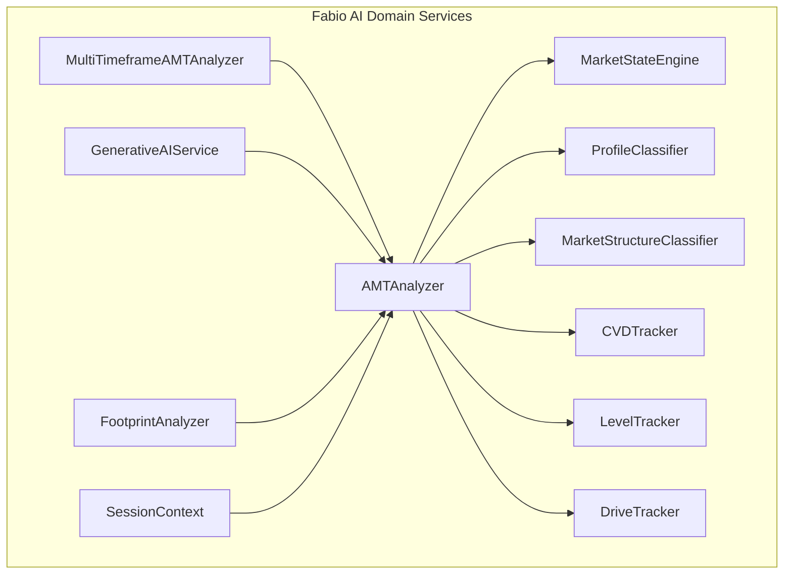

**Diagram sources**
- [amt_analyzer.py:215-837](file://backend/app/domain/fabio_ai/services/amt_analyzer.py#L215-L837)
- [multi_timeframe_amt.py:74-164](file://backend/app/domain/fabio_ai/services/multi_timeframe_amt.py#L74-L164)
- [market_state_engine.py:45-156](file://backend/app/domain/fabio_ai/services/market_state_engine.py#L45-L156)
- [generative_ai_service.py:26-99](file://backend/app/domain/fabio_ai/services/generative_ai_service.py#L26-L99)
- [footprint_analyzer.py:17-123](file://backend/app/domain/fabio_ai/services/footprint_analyzer.py#L17-L123)
- [level_tracker.py:24-108](file://backend/app/domain/fabio_ai/services/level_tracker.py#L24-L108)
- [drive_tracker.py:52-315](file://backend/app/domain/fabio_ai/services/drive_tracker.py#L52-L315)
- [cvd_tracker.py:41-164](file://backend/app/domain/fabio_ai/services/cvd_tracker.py#L41-L164)
- [session_context.py:230-327](file://backend/app/domain/fabio_ai/services/session_context.py#L230-L327)
- [profile_classifier.py:56-205](file://backend/app/domain/fabio_ai/services/profile_classifier.py#L56-L205)
- [market_structure_classifier.py:261-424](file://backend/app/domain/fabio_ai/services/market_structure_classifier.py#L261-L424)

**Section sources**
- [amt_analyzer.py:1-1444](file://backend/app/domain/fabio_ai/services/amt_analyzer.py#L1-L1444)
- [multi_timeframe_amt.py:1-507](file://backend/app/domain/fabio_ai/services/multi_timeframe_amt.py#L1-L507)
- [market_state_engine.py:1-193](file://backend/app/domain/fabio_ai/services/market_state_engine.py#L1-L193)
- [generative_ai_service.py:1-99](file://backend/app/domain/fabio_ai/services/generative_ai_service.py#L1-L99)
- [footprint_analyzer.py:1-342](file://backend/app/domain/fabio_ai/services/footprint_analyzer.py#L1-L342)
- [level_tracker.py:1-108](file://backend/app/domain/fabio_ai/services/level_tracker.py#L1-L108)
- [drive_tracker.py:1-315](file://backend/app/domain/fabio_ai/services/drive_tracker.py#L1-L315)
- [cvd_tracker.py:1-164](file://backend/app/domain/fabio_ai/services/cvd_tracker.py#L1-L164)
- [session_context.py:1-535](file://backend/app/domain/fabio_ai/services/session_context.py#L1-L535)
- [profile_classifier.py:1-205](file://backend/app/domain/fabio_ai/services/profile_classifier.py#L1-L205)
- [market_structure_classifier.py:1-424](file://backend/app/domain/fabio_ai/services/market_structure_classifier.py#L1-L424)

## Core Components
- AMTAnalyzer: Central orchestrator for AMT computations including volume profile, value area, LVN/HVN detection, session VWAP, acceptance/rejection, aggression scoring, and order flow detectors. It integrates CVD tracking, profile shape classification, POC migration, session context, and drive tracking.
- GenerativeAIService: LLM-backed entry decision service that consumes a narrative built from AMT and order flow features and returns a canonical decision envelope.
- FootprintAnalyzer: Generates footprint candles incrementally from OHLC and optionally accumulates tick-level data to produce diagonal imbalances and stacked imbalances.
- MultiTimeframeAMTAnalyzer: Computes three-timeframe alignment (higher, session, entry) and derives trade implications with position sizing guidance.
- MarketStateEngine: Implements the 4-state market classification (NO_TRADE, BALANCED, IMBALANCED, PROBING) with zone sub-classification and transition logging.
- EntryGate and Subsystems: Provides gate logic for entry validation, including three-align checks, confirmation bundles, momentum fade, signal building, grading, and position sizing.
- Specialized Trackers: LevelTracker monitors structural level lifecycle; DriveTracker enforces D1/D2/D3+ rules; CVDTracker tracks cumulative delta with slope and divergence detection.
- SessionContext: Provides session-aware context for NSE/MCX and global markets, including phases, opening relation, inventory bias, and VWAP anchors.
- ProfileClassifier and MarketStructureClassifier: Classify profile shape and market structure with hysteresis to reduce noise.

**Section sources**
- [amt_analyzer.py:215-837](file://backend/app/domain/fabio_ai/services/amt_analyzer.py#L215-L837)
- [generative_ai_service.py:26-99](file://backend/app/domain/fabio_ai/services/generative_ai_service.py#L26-L99)
- [footprint_analyzer.py:17-342](file://backend/app/domain/fabio_ai/services/footprint_analyzer.py#L17-L342)
- [multi_timeframe_amt.py:74-164](file://backend/app/domain/fabio_ai/services/multi_timeframe_amt.py#L74-L164)
- [market_state_engine.py:45-156](file://backend/app/domain/fabio_ai/services/market_state_engine.py#L45-L156)
- [entry_gate.py:26-82](file://backend/app/domain/fabio_ai/services/entry_gate.py#L26-L82)
- [level_tracker.py:24-108](file://backend/app/domain/fabio_ai/services/level_tracker.py#L24-L108)
- [drive_tracker.py:52-315](file://backend/app/domain/fabio_ai/services/drive_tracker.py#L52-L315)
- [cvd_tracker.py:41-164](file://backend/app/domain/fabio_ai/services/cvd_tracker.py#L41-L164)
- [session_context.py:230-327](file://backend/app/domain/fabio_ai/services/session_context.py#L230-L327)
- [profile_classifier.py:56-205](file://backend/app/domain/fabio_ai/services/profile_classifier.py#L56-L205)
- [market_structure_classifier.py:261-424](file://backend/app/domain/fabio_ai/services/market_structure_classifier.py#L261-L424)

## Architecture Overview
The domain services layer is a pure-functional, stateful orchestration layer. They depend on shared models and enums, and interact with external adapters via ports (e.g., LLM inference). The AMTAnalyzer coordinates multiple specialized services to produce a unified AMTResult consumed by downstream services like GenerativeAIService and entry gating.

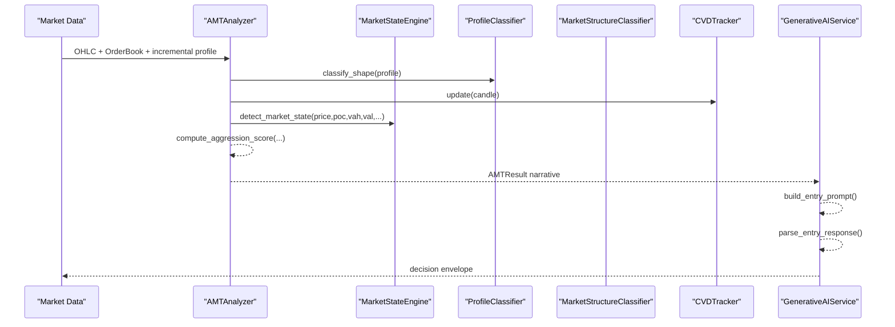

**Diagram sources**
- [amt_analyzer.py:623-837](file://backend/app/domain/fabio_ai/services/amt_analyzer.py#L623-L837)
- [market_state_engine.py:45-156](file://backend/app/domain/fabio_ai/services/market_state_engine.py#L45-L156)
- [profile_classifier.py:56-87](file://backend/app/domain/fabio_ai/services/profile_classifier.py#L56-L87)
- [cvd_tracker.py:74-107](file://backend/app/domain/fabio_ai/services/cvd_tracker.py#L74-L107)
- [generative_ai_service.py:53-99](file://backend/app/domain/fabio_ai/services/generative_ai_service.py#L53-L99)

## Detailed Component Analysis

### AMTAnalyzer
- Purpose: Construct volume profile, compute value area, detect LVN/HVN, derive market state, track session VWAP, compute order flow metrics, and score aggression.
- Key workflows:
  - Volume profile creation (incremental or full rebuild)
  - POC tie-break via session VWAP
  - Value area via two-row pair expansion
  - LVN/HVN detection with persistence filters
  - Aggressive print detection and persistent scoring
  - CVD tracking and absorption detection
  - Displacement and acceptance detection
  - Multi-timeframe integration via MultiTimeframeAMTAnalyzer
- Integration points:
  - MarketStateEngine for 4-state classification
  - ProfileClassifier for shape and POC migration
  - CVDTracker for slope and divergence
  - DriveTracker for level touch lifecycle
  - LevelTracker for structural level status
  - SessionContext for session-aware anchors and phases

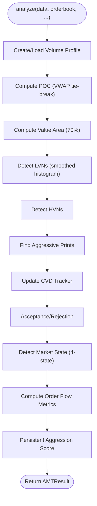

**Diagram sources**
- [amt_analyzer.py:623-837](file://backend/app/domain/fabio_ai/services/amt_analyzer.py#L623-L837)

**Section sources**
- [amt_analyzer.py:215-837](file://backend/app/domain/fabio_ai/services/amt_analyzer.py#L215-L837)

### GenerativeAIService
- Purpose: Interpret AMT/flow narrative and decide entry direction with rationale and confidence.
- Inputs: Natural-language prompt built from AMTResult and order flow features.
- Outputs: Canonical decision envelope with direction, rationale, raw output, input prompt, market state, and aggression.
- Caching: LRU cache keyed by MD5 of prompt input to avoid repeated inference.

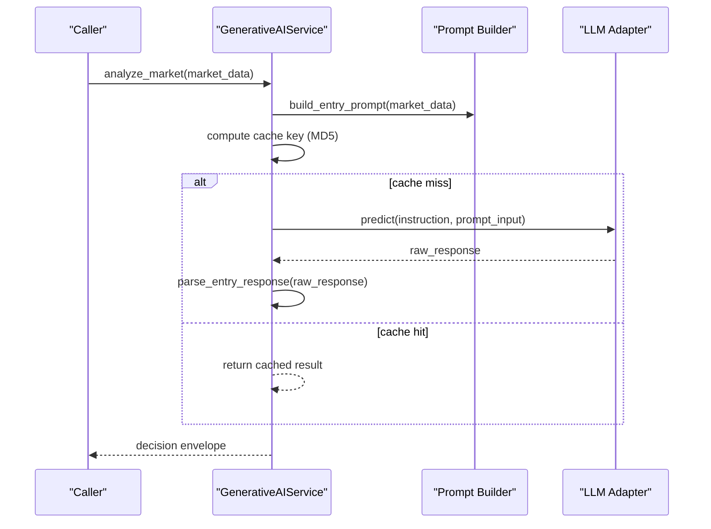

**Diagram sources**
- [generative_ai_service.py:53-99](file://backend/app/domain/fabio_ai/services/generative_ai_service.py#L53-L99)

**Section sources**
- [generative_ai_service.py:26-99](file://backend/app/domain/fabio_ai/services/generative_ai_service.py#L26-L99)

### FootprintAnalyzer
- Purpose: Generate footprint candles from OHLC using Gaussian distribution centered on VWAP, with incremental mode for performance.
- Features:
  - Incremental generation when data grows by one candle
  - Diagonal imbalance detection and stacked imbalance flags
  - Absorption detection from aggressive volume with minimal price movement
  - Contested zone detection across recent candles

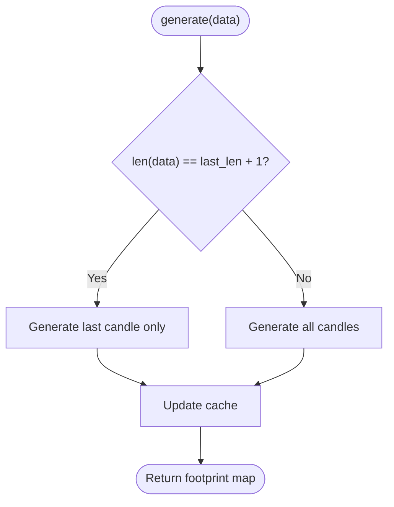

**Diagram sources**
- [footprint_analyzer.py:101-123](file://backend/app/domain/fabio_ai/services/footprint_analyzer.py#L101-L123)

**Section sources**
- [footprint_analyzer.py:17-342](file://backend/app/domain/fabio_ai/services/footprint_analyzer.py#L17-L342)

### MultiTimeframeAMTAnalyzer
- Purpose: Align three timeframes (higher, session, entry) and derive trade implications.
- Inputs: Per-timeframe AMTResults or derived biases; aggregates base candles to higher intervals.
- Outputs: MultiTimeframeAMTResult with alignment state, strength, and position size multiplier.

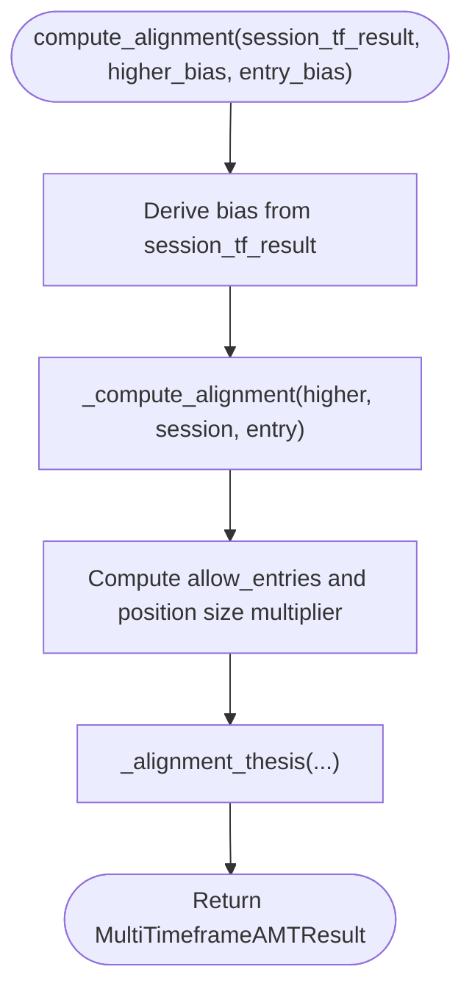

**Diagram sources**
- [multi_timeframe_amt.py:114-164](file://backend/app/domain/fabio_ai/services/multi_timeframe_amt.py#L114-L164)

**Section sources**
- [multi_timeframe_amt.py:74-507](file://backend/app/domain/fabio_ai/services/multi_timeframe_amt.py#L74-L507)

### MarketStateEngine
- Purpose: Classify market state into NO_TRADE, BALANCED, IMBALANCED, PROBING with zone sub-classification and transition logging.
- Logic: Priority gates for dead zone, edge pre-emption, balance ratio threshold, and acceptance/displacement conditions.

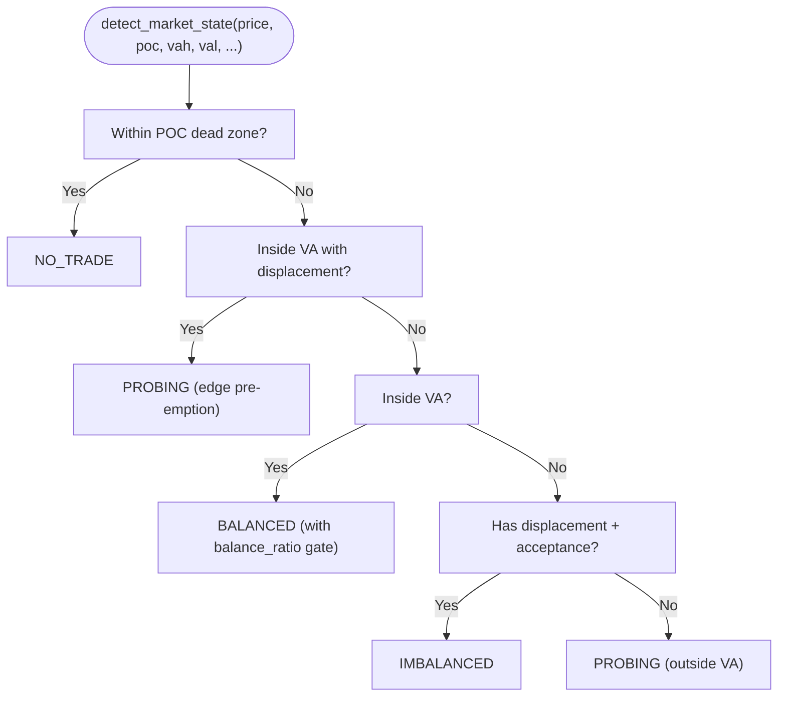

**Diagram sources**
- [market_state_engine.py:45-156](file://backend/app/domain/fabio_ai/services/market_state_engine.py#L45-L156)

**Section sources**
- [market_state_engine.py:45-193](file://backend/app/domain/fabio_ai/services/market_state_engine.py#L45-L193)

### EntryGate and Subsystems
- Purpose: Validate trading opportunities using a multi-gate pipeline.
- Subsystems:
  - three_align: min_candles_gate, full_body_close_gate, nearest_round_number, cluster_aggressive_prints, extract_bubble_levels_from_footprint, three_align_check
  - confirmation_bundle: check_confirmation_bundle, check_momentum_fade, compute_atr
  - signal_builder: build_entry_signal, sl_from_aggressive_print
  - grading: compute_grade_score, check_vwap_bias, check_imbalance_alignment
  - gate_runner: run_gate_pipeline, calculate_position_size

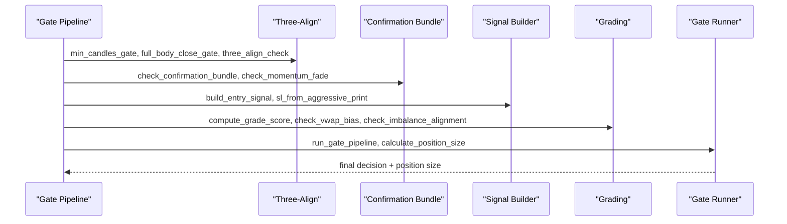

**Diagram sources**
- [entry_gate.py:26-82](file://backend/app/domain/fabio_ai/services/entry_gate.py#L26-L82)

**Section sources**
- [entry_gate.py:1-83](file://backend/app/domain/fabio_ai/services/entry_gate.py#L1-L83)

### Specialized Trackers

#### LevelTracker
- Tracks structural levels (VAH, VAL, POC, HVN, LVN, aggressive prints) through UNTOUCHED → FIRST_TOUCH → SECOND_DRIVE → EXHAUSTED lifecycle.
- Pullback thresholds and ATR-based enforcement.

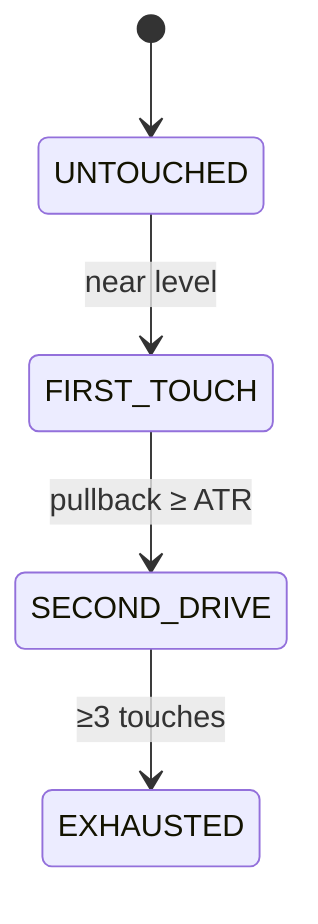

**Diagram sources**
- [level_tracker.py:15-108](file://backend/app/domain/fabio_ai/services/level_tracker.py#L15-L108)

**Section sources**
- [level_tracker.py:24-108](file://backend/app/domain/fabio_ai/services/level_tracker.py#L24-L108)

#### DriveTracker
- Enforces D1/D2/D3+ rules with rejection detection (wick through level, close on opposite side) and momentum fade detection.
- Includes time decay safeguards and session reset.

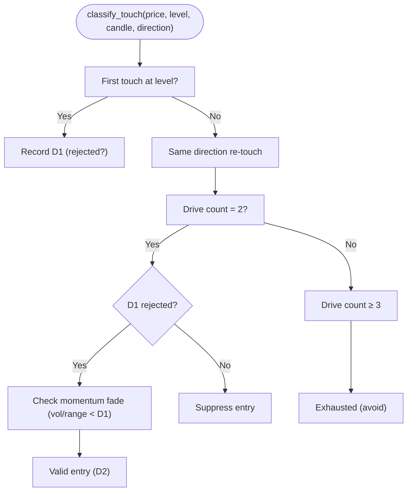

**Diagram sources**
- [drive_tracker.py:72-257](file://backend/app/domain/fabio_ai/services/drive_tracker.py#L72-L257)

**Section sources**
- [drive_tracker.py:52-315](file://backend/app/domain/fabio_ai/services/drive_tracker.py#L52-L315)

#### CVDTracker
- Tracks cumulative volume delta, computes slope over extended window, and detects price-CVD divergence with z-score.
- Sign persistence filter prevents rapid slope flips.

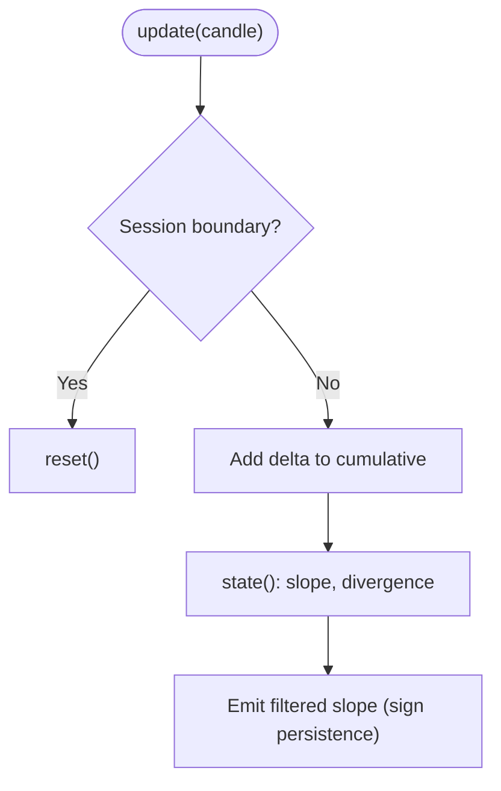

**Diagram sources**
- [cvd_tracker.py:74-107](file://backend/app/domain/fabio_ai/services/cvd_tracker.py#L74-L107)

**Section sources**
- [cvd_tracker.py:41-164](file://backend/app/domain/fabio_ai/services/cvd_tracker.py#L41-L164)

### SessionContext
- Provides session-aware context for NSE/MCX and global markets, including phases, opening relation, inventory bias, and VWAP anchors.
- Supports time-to-close calculations and sub-session detection for MCX.

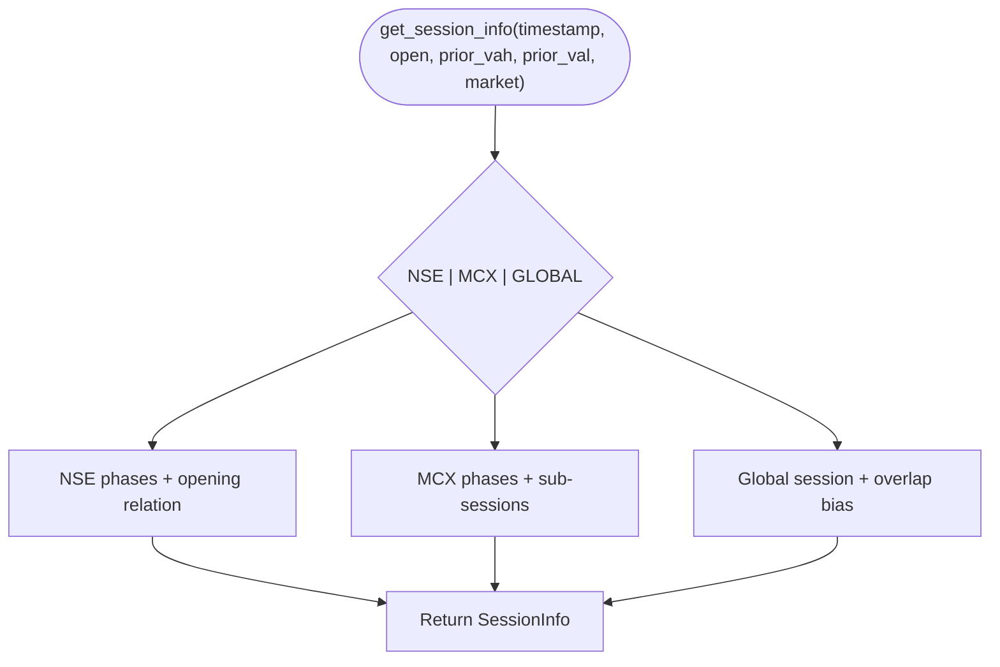

**Diagram sources**
- [session_context.py:230-327](file://backend/app/domain/fabio_ai/services/session_context.py#L230-L327)

**Section sources**
- [session_context.py:230-535](file://backend/app/domain/fabio_ai/services/session_context.py#L230-L535)

### ProfileClassifier and MarketStructureClassifier
- ProfileClassifier: Classifies profile shape (D/P/b/B) via skewness/kurtosis and tracks POC migration with linear regression.
- MarketStructureClassifier: Classifies structure (BALANCE, IMBALANCE, TRANSITION, EXPANSION, CHOP) with hysteresis (dwell time, confidence gate, transition buffer, cooldown).

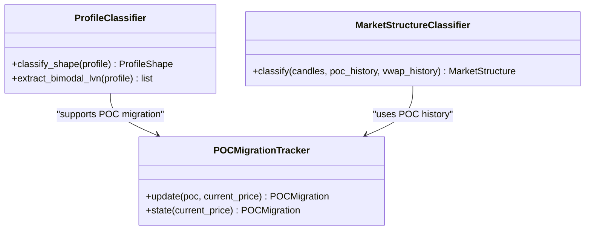

**Diagram sources**
- [profile_classifier.py:56-205](file://backend/app/domain/fabio_ai/services/profile_classifier.py#L56-L205)
- [market_structure_classifier.py:261-424](file://backend/app/domain/fabio_ai/services/market_structure_classifier.py#L261-L424)

**Section sources**
- [profile_classifier.py:56-205](file://backend/app/domain/fabio_ai/services/profile_classifier.py#L56-L205)
- [market_structure_classifier.py:261-424](file://backend/app/domain/fabio_ai/services/market_structure_classifier.py#L261-L424)

## Dependency Analysis
- AMTAnalyzer depends on MarketStateEngine, ProfileClassifier, MarketStructureClassifier, CVDTracker, DriveTracker, LevelTracker, SessionContext, and order flow detectors.
- GenerativeAIService depends on prompt building and LLM inference port.
- MultiTimeframeAMTAnalyzer depends on AMTAnalyzer outputs and timeframe aggregation utilities.
- FootprintAnalyzer is independent but informs AMTAnalyzer via order flow metrics.
- EntryGate subsystems are re-exported from dedicated modules and depend on AMT outputs.

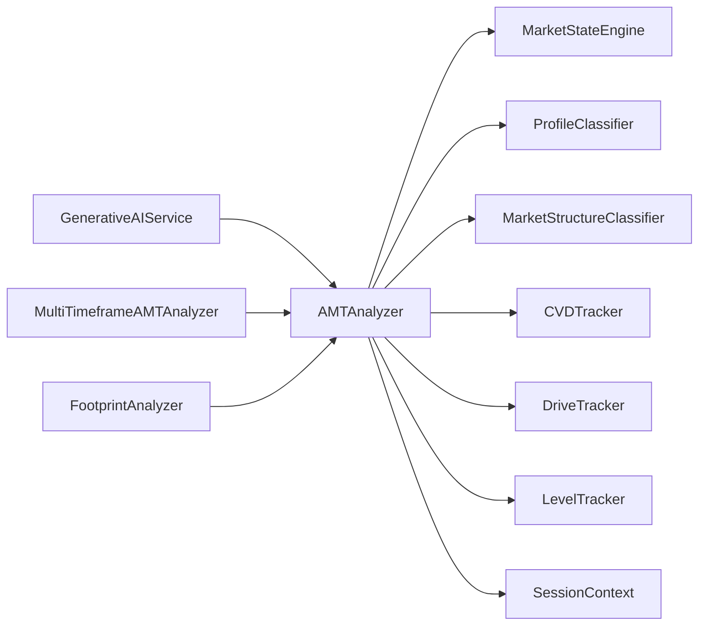

**Diagram sources**
- [amt_analyzer.py:215-281](file://backend/app/domain/fabio_ai/services/amt_analyzer.py#L215-L281)
- [generative_ai_service.py:26-43](file://backend/app/domain/fabio_ai/services/generative_ai_service.py#L26-L43)
- [multi_timeframe_amt.py:74-113](file://backend/app/domain/fabio_ai/services/multi_timeframe_amt.py#L74-L113)
- [footprint_analyzer.py:17-23](file://backend/app/domain/fabio_ai/services/footprint_analyzer.py#L17-L23)

**Section sources**
- [amt_analyzer.py:215-281](file://backend/app/domain/fabio_ai/services/amt_analyzer.py#L215-L281)
- [multi_timeframe_amt.py:74-113](file://backend/app/domain/fabio_ai/services/multi_timeframe_amt.py#L74-L113)
- [generative_ai_service.py:26-43](file://backend/app/domain/fabio_ai/services/generative_ai_service.py#L26-L43)
- [footprint_analyzer.py:17-23](file://backend/app/domain/fabio_ai/services/footprint_analyzer.py#L17-L23)

## Performance Considerations
- Incremental computation: AMTAnalyzer supports incremental volume profiles and footprint generation to minimize recomputation on new ticks.
- GPU acceleration: MLX-based computations (weighted moments, linear regression, divergence detection) improve throughput on Apple Silicon.
- Caching: GenerativeAIService caches LLM responses keyed by prompt hash to avoid redundant inference.
- Hysteresis: MarketStructureClassifier reduces state flapping with dwell time, confidence gate, transition buffer, and cooldown.
- Memory caps: CVDTracker limits history length to prevent unbounded growth.

[No sources needed since this section provides general guidance]

## Troubleshooting Guide
- Empty or insufficient data: AMTAnalyzer returns a safe default result when data is missing or too short.
- Session boundary resets: CVDTracker and session-wide accumulators reset when time goes backwards.
- Cache misses: GenerativeAIService logs warnings when LLM returns None and falls back to FLAT.
- State transitions: MarketStateEngine logs transitions for auditability; verify triggers and confidence thresholds.
- Gate pipeline: EntryGate subsystems provide granular reasons for suppression or validity; inspect gating functions for precise failure points.

**Section sources**
- [amt_analyzer.py:640-651](file://backend/app/domain/fabio_ai/services/amt_analyzer.py#L640-L651)
- [cvd_tracker.py:80-83](file://backend/app/domain/fabio_ai/services/cvd_tracker.py#L80-L83)
- [generative_ai_service.py:72-95](file://backend/app/domain/fabio_ai/services/generative_ai_service.py#L72-L95)
- [market_state_engine.py:178-192](file://backend/app/domain/fabio_ai/services/market_state_engine.py#L178-L192)

## Conclusion
GlassyTrade’s domain services layer implements a rigorous, spec-compliant AMT framework with strong separation of concerns. AMTAnalyzer orchestrates core microstructure analytics, while specialized services handle order flow, structure classification, session context, and entry gating. GenerativeAIService provides AI-driven decision-making grounded in AMT insights. Together, these services enable robust, interpretable, and scalable trading logic across multiple timeframes and market regimes.

[No sources needed since this section summarizes without analyzing specific files]