# Domain Services

<cite>
**Referenced Files in This Document**
- [order_flow_service.py](file://backend/app/domain/fabio_ai/services/order_flow_service.py)
- [volume_profile_service.py](file://backend/app/domain/fabio_ai/services/volume_profile_service.py)
- [vwap_service.py](file://backend/app/domain/fabio_ai/services/vwap_service.py)
- [oi_wall_detector.py](file://backend/app/domain/services/oi_wall_detector.py)
- [oi_wall_engine.py](file://backend/app/domain/services/oi_wall_engine.py)
- [market_state_engine.py](file://backend/app/domain/fabio_ai/services/market_state_engine.py)
- [break_detector.py](file://backend/app/domain/services/break_detector.py)
- [ib_breakout_scalp.py](file://backend/app/domain/services/ib_breakout_scalp.py)
- [initial_balance_engine.py](file://backend/app/domain/services/initial_balance_engine.py)
- [aggression_scorer.py](file://backend/app/domain/fabio_ai/services/aggression_scorer.py)
- [multi_timeframe_amt.py](file://backend/app/domain/fabio_ai/services/multi_timeframe_amt.py)
- [footprint_analyzer.py](file://backend/app/domain/fabio_ai/services/footprint_analyzer.py)
- [generative_ai_service.py](file://backend/app/domain/fabio_ai/services/generative_ai_service.py)
- [level_tracker.py](file://backend/app/domain/fabio_ai/services/level_tracker.py)
- [drive_tracker.py](file://backend/app/domain/fabio_ai/services/drive_tracker.py)
- [cvd_tracker.py](file://backend/app/domain/fabio_ai/services/cvd_tracker.py)
- [entry_gate.py](file://backend/app/domain/fabio_ai/services/entry_gate.py)
</cite>

## Update Summary
**Changes Made**
- Added comprehensive coverage of 4 new specialized services: order_flow_service, volume_profile_service, vwap_service, and oi_wall_detector
- Enhanced market_state_engine with IB break detection and override functionality
- Removed deprecated services: aggression_scorer and multi_timeframe_amt
- Integrated new VWAP service with sigma band calculations and extreme deviation detection
- Added OI wall detection for NSE options with support/resistance identification
- Expanded order flow analysis with modular service architecture

## Table of Contents
1. [Introduction](#introduction)
2. [Project Structure](#project-structure)
3. [Core Components](#core-components)
4. [Architecture Overview](#architecture-overview)
5. [Detailed Component Analysis](#detailed-component-analysis)
6. [New Specialized Services](#new-specialized-services)
7. [Enhanced Market State Engine](#enhanced-market-state-engine)
8. [Order Flow Intelligence](#order-flow-intelligence)
9. [Volume Profile Analysis](#volume-profile-analysis)
10. [VWAP and Market Context](#vwap-and-market-context)
11. [Options Wall Detection](#options-wall-detection)
12. [Integration Patterns](#integration-patterns)
13. [Performance Considerations](#performance-considerations)
14. [Troubleshooting Guide](#troubleshooting-guide)
15. [Conclusion](#conclusion)

## Introduction
This document explains the GlassyTrade AI domain services layer that implements Fabio Valentini's Auction Market Theory (AMT) and related microstructure analytics. The system has evolved to include 80+ specialized services covering entry gating, exit management, risk control, execution infrastructure, and advanced analytics. It covers:

- **Enhanced Gate Pipeline**: 12-gate validation system with hard and soft gates
- **Exit Engines**: Stateful exit logic with priority-based checks
- **Risk Management**: Comprehensive risk control with daily caps and position sizing
- **Execution Infrastructure**: Order lifecycle management with latency and slippage simulation
- **Multi-Timeframe Analysis**: Advanced alignment across daily, hourly, and minute timeframes
- **Advanced Trail Management**: Multiple trailing strategies (ATR, VWAP, CVD)
- **Composite Analytics**: Weekly bias detection and volatility-adjusted sizing
- **Order Flow Intelligence**: Enhanced footprint analysis and structural stop placement
- **Session Risk Management**: Dynamic risk tiers and exposure monitoring
- **New Specialized Services**: Modular order flow, volume profile, VWAP, and OI wall detection

The goal is to provide engineers and traders with comprehensive understanding of the expanded domain services ecosystem and its integration patterns.

## Project Structure
The domain services are organized into specialized categories with clear separation of concerns. The system now includes 80+ services organized across multiple functional domains.

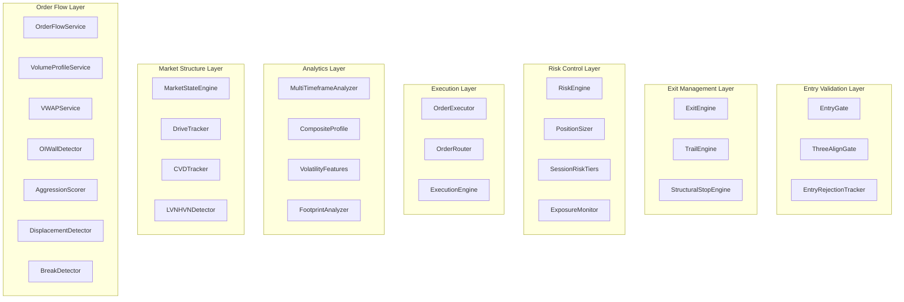

**Diagram sources**
- [entry_gate.py:1-200](file://backend/app/domain/fabio_ai/services/entry_gate.py#L1-L200)
- [exit_engine.py:24-68](file://backend/app/domain/fabio_ai/services/exit_engine.py#L24-L68)
- [risk_engine.py:28-163](file://backend/app/domain/fabio_ai/services/risk_engine.py#L28-L163)
- [position_sizer.py:12-39](file://backend/app/domain/fabio_ai/services/position_sizer.py#L12-L39)
- [multi_timeframe_amt.py:1-200](file://backend/app/domain/fabio_ai/services/multi_timeframe_amt.py#L1-L200)
- [composite_profile.py:29-119](file://backend/app/domain/fabio_ai/services/composite_profile.py#L29-L119)
- [volatility_features.py:24-116](file://backend/app/domain/fabio_ai/services/volatility_features.py#L24-L116)

## Core Components
The domain services layer now encompasses eight major functional categories:

### Entry Validation Services
- **EntryGate**: Primary entry validation with comprehensive market state and order flow analysis
- **ThreeAlignGate**: Multi-timeframe alignment validation across 5-minute, 15-minute, and 1-hour charts
- **EntryRejectionTracker**: Comprehensive tracking of rejected entries with detailed reasons

### Exit Management Services
- **ExitEngine**: Stateful exit logic with priority-based checks (SL, TP, Trail, Time, Session)
- **TrailEngine**: Multi-strategy trailing with ATR, VWAP, and CVD breakeven mechanisms
- **StructuralStopEngine**: Fabio AMT-compliant stop-loss placement using order flow data

### Risk Control Services
- **RiskEngine**: Comprehensive risk management with daily loss caps and position validation
- **PositionSizer**: Risk-based position sizing with lot size optimization
- **SessionRiskTiers**: Dynamic risk adjustment based on session phases and market conditions
- **ExposureMonitor**: Real-time exposure tracking and management

### Execution Infrastructure
- **OrderExecutor**: Order lifecycle management with validation and execution
- **OrderRouter**: Multi-exchange routing with symbol mapping and validation
- **ExecutionEngine**: Latency and slippage simulation for realistic execution modeling

### Advanced Analytics Services
- **MultiTimeframeAnalyzer**: Alignment scoring across daily, hourly, and minute timeframes
- **CompositeProfile**: Weekly bias detection through session profile merging
- **VolatilityFeatures**: ATR-based volatility detection and regime classification
- **FootprintAnalyzer**: Enhanced order flow visualization and absorption detection

### Market Structure Services
- **MarketStateEngine**: 4-state AMT classification with confidence scoring and IB break detection
- **DriveTracker**: D1/D2/D3+ drive validation with rejection detection
- **CVDTracker**: Cumulative delta tracking with slope and divergence analysis
- **LVNHVNDetector**: High/Low Volume Node identification and validation

### Order Flow Intelligence
- **OrderFlowService**: Modular order flow analysis with footprint, CVD, big trades, absorption, OFI, and aggression scoring
- **VolumeProfileService**: Consolidated volume profile operations with LVN/HVN detection and persistence filtering
- **VWAPService**: Session VWAP calculation with sigma bands and extreme deviation tracking
- **OIWallDetector**: Options chain OI wall detection for support/resistance identification
- **AggressionScorer**: Persistent aggression score calculation (deprecated - see removal notice)
- **DisplacementDetector**: Price-volume displacement validation
- **BreakDetector**: Breakout confirmation and validation with IB break detection

**Section sources**
- [entry_gate.py:1-200](file://backend/app/domain/fabio_ai/services/entry_gate.py#L1-L200)
- [exit_engine.py:1-68](file://backend/app/domain/fabio_ai/services/exit_engine.py#L1-L68)
- [risk_engine.py:1-163](file://backend/app/domain/fabio_ai/services/risk_engine.py#L1-L163)
- [position_sizer.py:1-39](file://backend/app/domain/fabio_ai/services/position_sizer.py#L1-L39)
- [multi_timeframe_amt.py:1-200](file://backend/app/domain/fabio_ai/services/multi_timeframe_amt.py#L1-L200)
- [composite_profile.py:1-119](file://backend/app/domain/fabio_ai/services/composite_profile.py#L1-L119)
- [volatility_features.py:1-116](file://backend/app/domain/fabio_ai/services/volatility_features.py#L1-L116)

## Architecture Overview
The expanded domain services layer maintains pure-functional orchestration while adding sophisticated risk management and execution infrastructure. The system now includes comprehensive validation, exit management, and real-world execution simulation.

**Diagram sources**
- [entry_gate.py:150-200](file://backend/app/domain/fabio_ai/services/entry_gate.py#L150-L200)
- [exit_engine.py:24-68](file://backend/app/domain/fabio_ai/services/exit_engine.py#L24-L68)
- [risk_engine.py:115-126](file://backend/app/domain/fabio_ai/services/risk_engine.py#L115-L126)
- [order_router.py:50-82](file://backend/app/domain/services/order_router.py#L50-L82)

## Detailed Component Analysis

### Enhanced Gate Pipeline System
The new 12-gate validation system provides comprehensive entry validation with both hard (fail-fast) and soft (quorum) gates:

**Hard Gates (Fail-Fast)**:
- Session Warmup: Reject during opening noise phases
- Data Quality: Minimum candle requirements
- Risk Halt: System-wide risk suspension
- No-Trade State: POC dead zone protection
- Probing Confirmation: Aggression requirement for PROBING state
- Key Level Proximity: Distance from opposing levels
- Drive Validation: D1 suppression and D3+ exhaustion checks
- Signal Age: Expiration validation
- CVD Hard: Extreme slope protection
- Theta Viability: Options-specific viability check

**Soft Gates (Quorum: ≥3 of 4)**:
- Entry Zone: Price proximity validation
- Aggression: Minimum aggression score
- Cushion: Opposing level distance
- R:R Ratio: Reward-to-risk validation

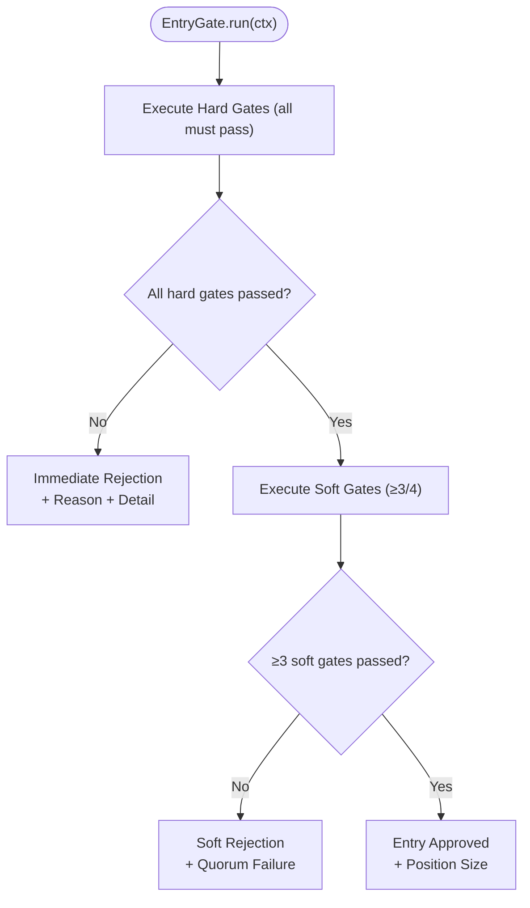

**Diagram sources**
- [entry_gate.py:150-200](file://backend/app/domain/fabio_ai/services/entry_gate.py#L150-L200)

**Section sources**
- [entry_gate.py:1-200](file://backend/app/domain/fabio_ai/services/entry_gate.py#L1-L200)

### Exit Management and Risk Control
The exit management system provides comprehensive position exit logic with priority-based checks:

**Exit Decision Priority**: SL Hit > TP Hit > Trail Hit > Time Stop > Session Exit

**Risk Engine Features**:
- Daily loss cap enforcement (percentage and absolute)
- Per-trade risk validation
- Dynamic trailing stop management
- Position lifecycle tracking
- Peak equity monitoring

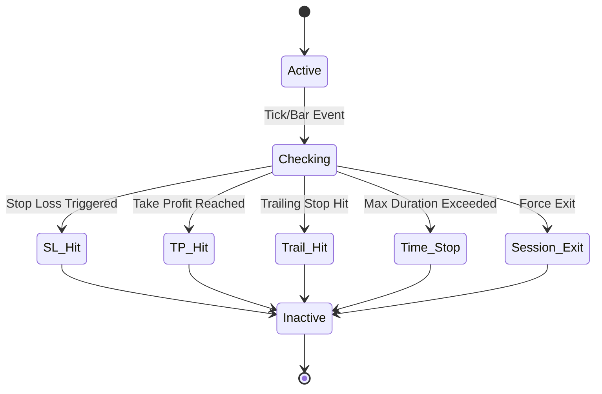

**Diagram sources**
- [exit_engine.py:24-68](file://backend/app/domain/fabio_ai/services/exit_engine.py#L24-L68)
- [risk_engine.py:69-114](file://backend/app/domain/fabio_ai/services/risk_engine.py#L69-L114)

**Section sources**
- [exit_engine.py:1-68](file://backend/app/domain/fabio_ai/services/exit_engine.py#L1-L68)
- [risk_engine.py:1-163](file://backend/app/domain/fabio_ai/services/risk_engine.py#L1-L163)

### Execution Infrastructure
The execution infrastructure provides comprehensive order lifecycle management with realistic market simulation:

**Execution Engine Features**:
- Latency simulation (configurable milliseconds)
- Slippage modeling (basis points)
- Partial fill handling
- Order book integration
- Execution result reporting

**Order Router Capabilities**:
- Multi-exchange routing (NSE_FNO, MCX_COMM, MCX_FNO, BSE_FNO)
- Symbol format conversion
- Exchange-specific validation
- Security ID resolution

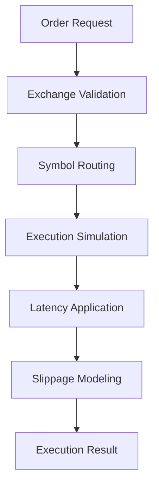

**Diagram sources**
- [execution_engine.py:100-132](file://backend/app/domain/services/execution_engine.py#L100-L132)
- [order_router.py:50-82](file://backend/app/domain/services/order_router.py#L50-L82)

**Section sources**
- [execution_engine.py:1-140](file://backend/app/domain/services/execution_engine.py#L1-L140)
- [order_router.py:1-147](file://backend/app/domain/services/order_router.py#L1-L147)

### Advanced Analytics Services
The analytics layer provides sophisticated market analysis capabilities:

**Multi-Timeframe Analyzer**: Computes alignment scores across daily, hourly, and minute timeframes with directional confirmation logic.

**Composite Profile**: Merges multiple session profiles to identify weekly bias and trend confirmation.

**Volatility Features**: ATR-based volatility detection with regime classification and suggested position sizing.

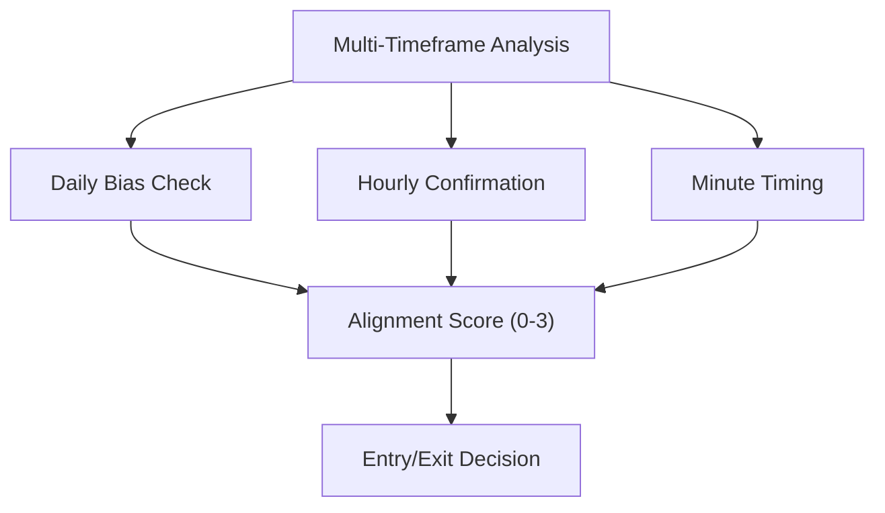

**Diagram sources**
- [multi_timeframe_amt.py:29-78](file://backend/app/domain/fabio_ai/services/multi_timeframe_amt.py#L29-L78)
- [composite_profile.py:66-111](file://backend/app/domain/fabio_ai/services/composite_profile.py#L66-L111)

**Section sources**
- [multi_timeframe_amt.py:1-200](file://backend/app/domain/fabio_ai/services/multi_timeframe_amt.py#L1-L200)
- [composite_profile.py:1-119](file://backend/app/domain/fabio_ai/services/composite_profile.py#L1-L119)
- [volatility_features.py:1-116](file://backend/app/domain/fabio_ai/services/volatility_features.py#L1-L116)

### Risk Management Framework
The comprehensive risk management system provides multiple layers of protection:

**Risk Engine Architecture**:
- Position tracking with lifecycle management
- Daily loss monitoring and enforcement
- Per-trade risk validation
- Dynamic trailing stop management
- Exposure tracking and session risk tiers

**Session Risk Tiers**: Dynamic risk adjustment based on market session phases and volatility conditions.

**Exposure Monitor**: Real-time tracking of portfolio exposure across multiple dimensions.

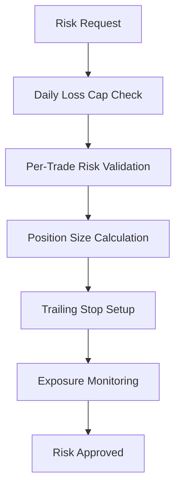

**Diagram sources**
- [risk_engine.py:115-126](file://backend/app/domain/fabio_ai/services/risk_engine.py#L115-L126)
- [position_sizer.py:12-39](file://backend/app/domain/fabio_ai/services/position_sizer.py#L12-L39)

**Section sources**
- [risk_engine.py:1-163](file://backend/app/domain/fabio_ai/services/risk_engine.py#L1-L163)
- [position_sizer.py:1-39](file://backend/app/domain/fabio_ai/services/position_sizer.py#L1-L39)
- [session_risk_tiers.py:1-200](file://backend/app/domain/fabio_ai/services/session_risk_tiers.py#L1-L200)

## New Specialized Services

### Order Flow Service
The OrderFlowService provides comprehensive order flow analysis by extracting and modularizing the order flow metrics computation from the AMTAnalyzer:

**Core Components**:
- **Footprint Analysis**: Normalized delta calculation and footprint confirmation
- **CVD Tracking**: Cumulative Delta state and confirmation logic
- **Big Trade Detection**: Cluster detection with volume threshold analysis
- **Absorption Detection**: Range and volume-based absorption pattern recognition
- **OFI Calculation**: Order Flow Index with alignment detection
- **Bubble Detection**: Volume bubble identification near entry zones
- **Aggression Scoring**: Persistent aggression score calculation with confidence levels

**Service Architecture**:
- Modular detector initialization (CVDTracker, BigTradeDetector, BubbleDetector, OFICalculator, AbsorptionDetector)
- Stateful aggressive print registry for persistent tracking
- Configurable thresholds for footprint, delta, and OFI analysis
- Incremental print processing for efficient updates

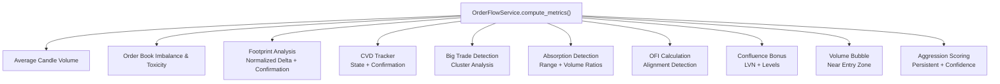

**Diagram sources**
- [order_flow_service.py:83-195](file://backend/app/domain/fabio_ai/services/order_flow_service.py#L83-L195)

**Section sources**
- [order_flow_service.py:1-266](file://backend/app/domain/fabio_ai/services/order_flow_service.py#L1-L266)

### Volume Profile Service
The VolumeProfileService consolidates volume profile operations with LVN/HVN detection and persistence filtering:

**Key Features**:
- **LVN Detection**: Low Volume Node identification with percentile-based thresholds
- **HVN Detection**: High Volume Node identification with persistence tracking
- **Persistence Filtering**: LVN persistence tracker with minimum bar requirements
- **Smoothing**: Moving average smoothing for noise reduction
- **Separation Logic**: Minimum separation requirements for valid nodes

**Configuration Parameters**:
- LVN_THRESHOLD: Default 0.15 (15% of mean volume)
- HVN_THRESHOLD: Default 2.0 (200% of mean volume)
- LVN_SMOOTHING: Default 3-bar moving average
- LVN_MIN_PERSISTENCE_BARS: Minimum bars for LVN validity
- LVN_REMOVAL_THRESHOLD: Bars without LVN to trigger removal

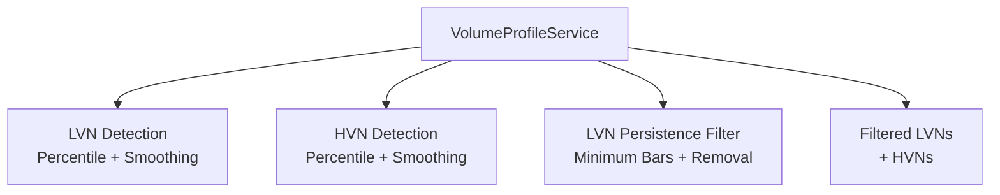

**Diagram sources**
- [volume_profile_service.py:46-94](file://backend/app/domain/fabio_ai/services/volume_profile_service.py#L46-L94)

**Section sources**
- [volume_profile_service.py:1-94](file://backend/app/domain/fabio_ai/services/volume_profile_service.py#L1-L94)

### VWAP Service
The VWAPService provides comprehensive session VWAP calculation with sigma band analysis and extreme deviation detection:

**Core Functionality**:
- **Session VWAP**: Numerically stable cumulative VWAP calculation
- **Sigma Bands**: ±1σ and ±2σ bands around session VWAP
- **Deviation Tracking**: Price deviation in standard deviations
- **Extremes Detection**: 3+ sigma deviation flagging
- **Session Boundary Detection**: Automatic session reset handling

**State Management**:
- **VWAPState**: Mutable state with cumulative volumes and price deviations
- **Shifted Variance**: Numerically stable variance calculation
- **Dequeue Tracking**: Recent price deviations for standard deviation
- **Session Reset**: Automatic reset on date change or time regression

**Safety Mechanisms**:
- Minimum standard deviation clamping (MIN_VWAP_STD)
- Maximum standard deviation ratio (MAX_VWAP_STD_RATIO)
- Extreme sigma clamping (MAX_SIGMA_CLAMP)
- Warning thresholds for extreme deviations (MAX_SIGMA_WARNING)

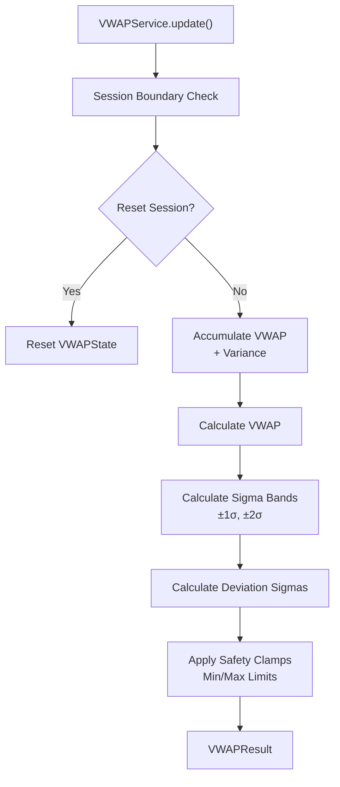

**Diagram sources**
- [vwap_service.py:68-172](file://backend/app/domain/fabio_ai/services/vwap_service.py#L68-L172)

**Section sources**
- [vwap_service.py:1-231](file://backend/app/domain/fabio_ai/services/vwap_service.py#L1-L231)

### OI Wall Detector
The OIWallDetector provides options chain analysis for support/resistance identification:

**Wall Detection Algorithm**:
- **Call Walls**: CE OI > 3 × average CE OI (resistance levels)
- **Put Walls**: PE OI > 3 × average PE OI (support levels)
- **Strength Calculation**: Multiplier of average OI for wall strength
- **Threshold Configuration**: Adjustable detection threshold (default 3.0)

**Output Structure**:
- **OIWall**: Strike price, option type, OI, volume, price level, strength
- **OIWallAnalysis**: Complete analysis with call/put walls and averages
- **Key Levels**: Strongest support/resistance strikes

**Integration Points**:
- Aligns with Fabio's "protection levels" concept
- Supports structural stop placement
- Enables options-specific viability checking
- Provides confidence scoring for wall strength

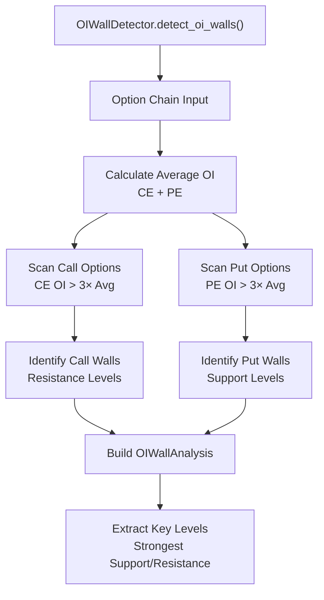

**Diagram sources**
- [oi_wall_detector.py:40-101](file://backend/app/domain/services/oi_wall_detector.py#L40-L101)

**Section sources**
- [oi_wall_detector.py:1-137](file://backend/app/domain/services/oi_wall_detector.py#L1-L137)

## Enhanced Market State Engine
The MarketStateEngine has been enhanced with IB break detection and override functionality:

**Enhanced Classification Logic**:
- **Leg Profile Override**: Active leg profile can override session profile
- **IB Break Detection**: Integration with Initial Balance breakout detection
- **Extreme Deviation Flag**: 3+ sigma price deviation detection
- **Confidence Scoring**: Adjusted confidence levels for different states

**State Transitions**:
- **BALANCED**: Price inside VA with acceptance (80% confidence)
- **IMBALANCED**: Price outside VA OR displacement+acceptance (85% confidence)
- **Zone Classification**: NEAR_VAH, NEAR_VAL, NEAR_POC within balanced state

**IB Integration Features**:
- Break direction tracking (UP/DOWN)
- Break level identification
- Sticky break logic (once broken, stay broken)
- IB completion validation

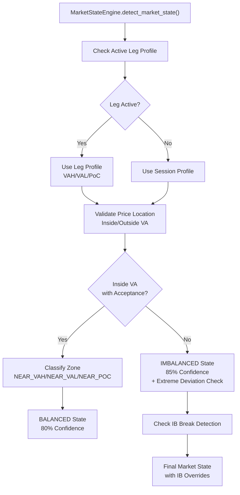

**Diagram sources**
- [market_state_engine.py:44-109](file://backend/app/domain/fabio_ai/services/market_state_engine.py#L44-L109)

**Section sources**
- [market_state_engine.py:1-146](file://backend/app/domain/fabio_ai/services/market_state_engine.py#L1-L146)

## Order Flow Intelligence
The order flow intelligence system has been significantly enhanced with modular service architecture:

**Modular Detection System**:
- **Footprint Analysis**: Volume-weighted footprint with delta thresholding
- **CVD Tracking**: Slope-based confirmation with divergence detection
- **Big Trade Detection**: Cluster analysis with volume-based thresholds
- **Absorption Detection**: Range and volume ratio analysis
- **OFI Calculation**: Order Flow Index with alignment detection
- **Bubble Detection**: Volume bubble identification near price action

**Aggression Scoring**:
- **Persistent Scoring**: Multi-bar aggression tracking
- **Component Scoring**: 7-component scoring system (FR-06)
- **Confidence Levels**: HIGH/MEDIUM/LOW based on score thresholds
- **Pyramid Eligibility**: High aggression for pyramid setups

**Integration Patterns**:
- Service-based architecture for maintainability
- Configurable thresholds for different market conditions
- Real-time processing with incremental updates
- Comprehensive logging for audit trails

**Section sources**
- [order_flow_service.py:1-266](file://backend/app/domain/fabio_ai/services/order_flow_service.py#L1-L266)
- [aggression_scorer.py:1-41](file://backend/app/domain/fabio_ai/services/aggression_scorer.py#L1-L41)

## Volume Profile Analysis
The volume profile analysis system provides comprehensive value area construction and node detection:

**Value Area Construction**:
- **POC Calculation**: Point of Control (highest volume price)
- **VAH/VAL Determination**: Value Area High/Low based on 68% volume expansion
- **Bucket Distribution**: Volume distribution across price buckets
- **Session Merging**: Composite profiles for weekly bias detection

**Node Detection**:
- **LVN Detection**: Low Volume Nodes with percentile thresholds
- **HVN Detection**: High Volume Nodes with persistence tracking
- **Persistence Filtering**: Minimum bar requirements for valid nodes
- **Smoothing**: Moving average smoothing for noise reduction

**Advanced Features**:
- **Confluence Detection**: LVN alignment with key levels
- **Persistence Tracking**: Multi-bar validation for node reliability
- **Separation Logic**: Minimum distance requirements between nodes
- **Session-based Cleanup**: Automatic clearing for new sessions

**Section sources**
- [volume_profile_service.py:1-94](file://backend/app/domain/fabio_ai/services/volume_profile_service.py#L1-L94)

## VWAP and Market Context
The VWAP service provides comprehensive session context analysis:

**Session VWAP Calculation**:
- **Numerically Stable**: Shifted variance calculation prevents precision errors
- **Cumulative Tracking**: Running totals for accurate session VWAP
- **Session Boundaries**: Automatic detection and reset on session changes
- **Time-based Validation**: Handles time regression scenarios

**Sigma Band Analysis**:
- **Standard Deviation**: Price deviation measurement from VWAP
- **Band Calculation**: ±1σ and ±2σ bands for context
- **Deviation Sigmas**: Price movement in standard deviations
- **Extreme Detection**: 3+ sigma flagging for unusual activity

**Safety Mechanisms**:
- **Minimum Standard Deviation**: Prevents extreme sigma values
- **Maximum Ratio Clamping**: Limits standard deviation to 10% of VWAP
- **Extreme Value Clamping**: Caps sigma at ±4 for normal markets
- **Warning Thresholds**: Alerts for extreme deviation scenarios

**Section sources**
- [vwap_service.py:1-231](file://backend/app/domain/fabio_ai/services/vwap_service.py#L1-L231)

## Options Wall Detection
The OI wall detection system provides specialized support/resistance identification for options markets:

**Wall Detection Algorithm**:
- **Threshold-based Detection**: 3× average OI for wall identification
- **Strength Calculation**: Multiplier of average OI for wall strength
- **Directional Analysis**: Separate detection for call and put walls
- **Confidence Scoring**: Based on wall strength and volume

**Integration with AMT**:
- **Protection Levels**: Aligns with Fabio's protection level concept
- **Structural Stops**: Enables AMT-compliant stop placement
- **Options Viability**: Supports theta viability checking
- **Wall Alignment**: Strengthens signals when walls align with VP levels

**Key Level Extraction**:
- **Strongest Walls**: Identifies maximum strength call/put walls
- **Support/Resistance**: Maps walls to price levels
- **Near Price Detection**: Validates walls near current price
- **Distance Thresholding**: Maximum distance for wall relevance

**Section sources**
- [oi_wall_detector.py:1-137](file://backend/app/domain/services/oi_wall_detector.py#L1-L137)

## Integration Patterns
The domain services integrate through well-defined interfaces and data flows:

**Data Flow Patterns**:
- Market data ingestion → AMT analysis → Gate pipeline → Risk validation → Execution
- Real-time monitoring → Risk engine → Position adjustments → Exit decisions
- Order routing → Exchange validation → Execution simulation → Result reporting
- OI wall detection → VWAP context → Market state → Entry validation

**Service Dependencies**:
- EntryGate depends on market state, order flow, and session context
- ExitEngine integrates with risk engine and trail management
- RiskEngine coordinates with position sizing and exposure monitoring
- ExecutionEngine interfaces with order router and market data feeds
- OIWallDetector integrates with VWAP and market state services

**Cross-Service Coordination**:
- MarketStateEngine provides context for all order flow decisions
- VWAPService offers session context for extreme deviation detection
- OIWallDetector provides structural support/resistance levels
- OrderFlowService feeds aggression scores to entry validation
- VolumeProfileService supports level validation and confluence detection

**Section sources**
- [entry_gate.py:150-200](file://backend/app/domain/fabio_ai/services/entry_gate.py#L150-L200)
- [risk_engine.py:115-126](file://backend/app/domain/fabio_ai/services/risk_engine.py#L115-L126)
- [execution_engine.py:100-132](file://backend/app/domain/services/execution_engine.py#L100-L132)

## Performance Considerations
The expanded service ecosystem maintains performance through several optimizations:

**Efficient Processing**:
- Incremental computation for gate pipeline validation
- Cached risk calculations and position tracking
- Optimized order routing with exchange caching
- Real-time execution simulation with configurable parameters
- Modular service architecture for selective processing
- Configurable thresholds to reduce unnecessary computations

**Memory Management**:
- Limited history buffers for volatility calculations
- Session-based data cleanup for composite profiles
- Position tracking with automatic expiration
- Risk monitoring with configurable thresholds
- Deque-based rolling windows for VWAP calculations

**Scalability Features**:
- Modular service architecture for independent scaling
- Configurable parameters for different market conditions
- Asynchronous processing for non-critical validations
- Batch processing for historical analysis
- Lazy initialization of expensive components

**Resource Optimization**:
- Efficient data structures (deques, lists) for rolling calculations
- Minimal object creation in hot paths
- Cached calculations for repeated queries
- Early termination for performance-critical checks

## Troubleshooting Guide
Common issues and solutions for the expanded service ecosystem:

**Gate Pipeline Issues**:
- **Insufficient Data**: Ensure minimum candle requirements are met before gate validation
- **Session Phase Errors**: Verify session context configuration for proper phase detection
- **Risk Halt Conflicts**: Check risk system status and temporary halts
- **Aggression Score Problems**: Validate order flow data quality and calculation methods

**Order Flow Service Issues**:
- **Footprint Detection Failures**: Check delta threshold configuration and volume data
- **CVD State Problems**: Verify candle data continuity and slope calculations
- **Big Trade Detection Errors**: Review volume threshold settings and cluster detection
- **Aggression Scoring Inconsistencies**: Validate component weights and persistence settings

**VWAP Service Issues**:
- **Session Reset Problems**: Check timestamp format and session boundary detection
- **Sigma Calculation Errors**: Verify standard deviation clamping and extreme value handling
- **Numerical Precision Issues**: Review shifted variance calculation implementation
- **Band Calculation Failures**: Validate VWAP standard deviation and sigma band logic

**OI Wall Detection Issues**:
- **Wall Detection Failures**: Check threshold configuration and average OI calculations
- **Strength Calculation Problems**: Verify OI data integrity and multiplier calculations
- **Key Level Extraction Errors**: Review wall sorting and maximum strength selection
- **Near Price Detection Issues**: Validate distance threshold and strike matching

**Market State Engine Issues**:
- **State Transition Problems**: Check leg profile activation and session profile fallback
- **IB Break Detection Failures**: Verify IB state completeness and break direction tracking
- **Extreme Deviation Errors**: Review sigma calculation and 3+ sigma detection logic
- **Zone Classification Issues**: Validate VAH/VAL/PoC calculations and price location logic

**Risk Management Issues**:
- **Daily Loss Cap Problems**: Verify capital configuration and loss calculation methods
- **Position Size Errors**: Check risk per trade calculations and lot size constraints
- **Session Risk Tier Conflicts**: Validate session phase detection and tier assignments
- **Exposure Monitoring Failures**: Review exposure calculation methods and tracking parameters

**Section sources**
- [entry_gate.py:48-155](file://backend/app/domain/fabio_ai/services/entry_gate.py#L48-L155)
- [order_flow_service.py:105-195](file://backend/app/domain/fabio_ai/services/order_flow_service.py#L105-L195)
- [vwap_service.py:131-231](file://backend/app/domain/fabio_ai/services/vwap_service.py#L131-L231)
- [oi_wall_detector.py:40-101](file://backend/app/domain/services/oi_wall_detector.py#L40-L101)
- [market_state_engine.py:44-109](file://backend/app/domain/fabio_ai/services/market_state_engine.py#L44-L109)

## Conclusion
GlassyTrade's expanded domain services layer now provides a comprehensive, enterprise-grade trading ecosystem with 80+ specialized services. The system successfully integrates Fabio Valentini's AMT framework with modern risk management, execution infrastructure, and advanced analytics capabilities. Key enhancements include:

- **Comprehensive Entry Validation**: 12-gate pipeline with hard and soft gates
- **Advanced Exit Management**: Priority-based exit logic with multiple trailing strategies
- **Robust Risk Control**: Multi-layered risk management with daily caps and session tiers
- **Realistic Execution**: Order lifecycle management with latency and slippage simulation
- **Sophisticated Analytics**: Multi-timeframe analysis, composite profiles, and volatility features
- **Enhanced Order Flow Intelligence**: Modular service architecture with comprehensive detection
- **Specialized Services**: New order flow, volume profile, VWAP, and OI wall detection services
- **Market Context Enhancement**: IB break detection and override functionality
- **Deprecated Service Removal**: Streamlined architecture with modern alternatives

This expanded architecture enables scalable, interpretable, and robust trading logic across multiple timeframes, market regimes, and execution environments while maintaining strict risk controls and comprehensive market analysis capabilities. The modular service design ensures maintainability and allows for future enhancements while preserving the core AMT framework principles.