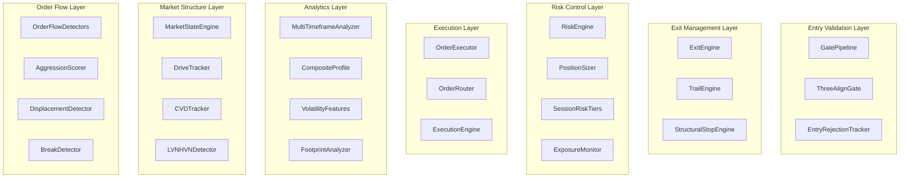
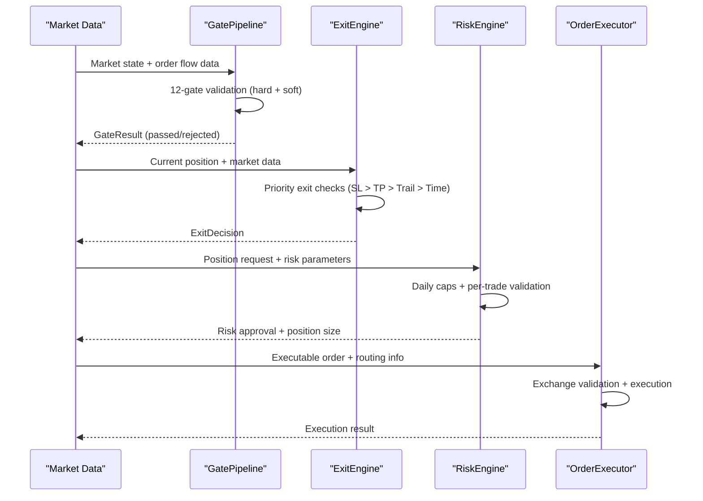
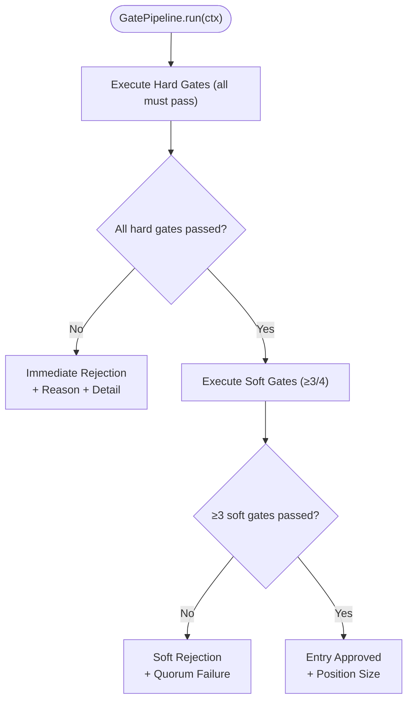
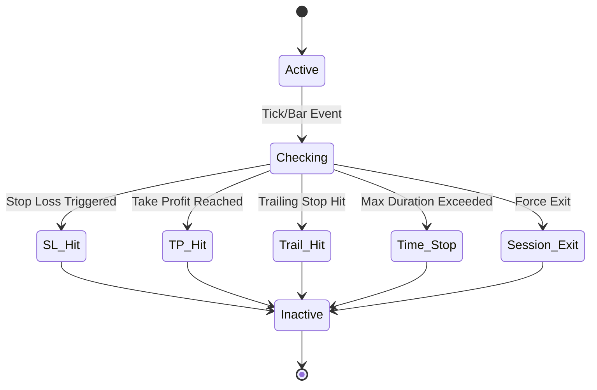
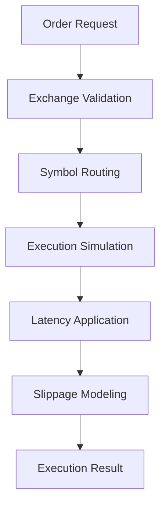
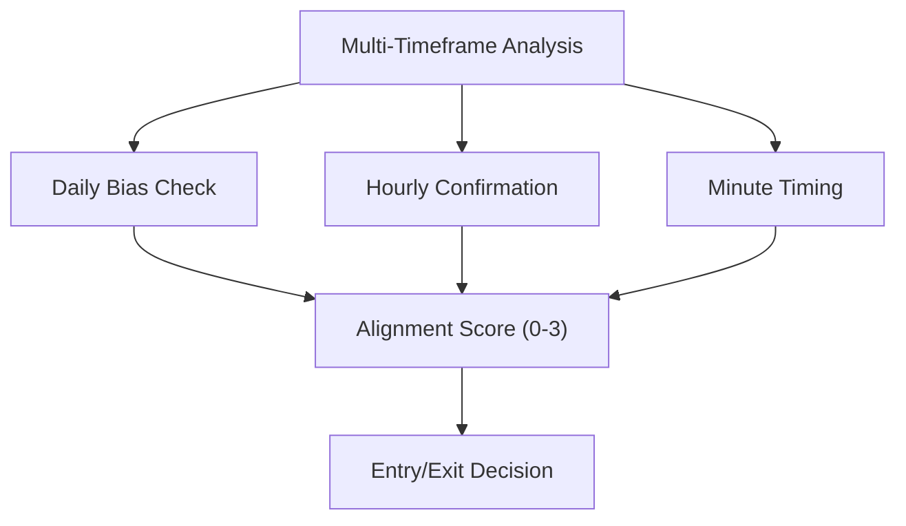
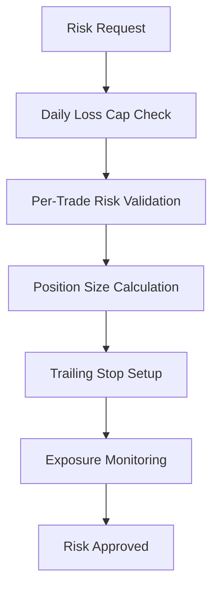

# Domain Services

<cite>
**Referenced Files in This Document**
- [gate_pipeline.py](file://appv2/backend/appv2/domain/services/gate_pipeline.py)
- [exit_engine.py](file://appv2/backend/appv2/domain/services/exit_engine.py)
- [risk_engine.py](file://appv2/backend/appv2/domain/services/risk_engine.py)
- [position_sizer.py](file://appv2/backend/appv2/domain/services/position_sizer.py)
- [three_align_gate.py](file://appv2/backend/appv2/domain/services/three_align_gate.py)
- [market_state_engine.py](file://appv2/backend/appv2/domain/services/market_state_engine.py)
- [mtf_analyzer.py](file://appv2/backend/appv2/domain/services/mtf_analyzer.py)
- [execution_engine.py](file://appv2/backend/appv2/domain/services/execution_engine.py)
- [order_router.py](file://appv2/backend/appv2/domain/services/order_router.py)
- [trail_engine.py](file://appv2/backend/appv2/domain/services/trail_engine.py)
- [structural_stop_engine.py](file://appv2/backend/appv2/domain/services/structural_stop_engine.py)
- [composite_profile.py](file://appv2/backend/appv2/domain/services/composite_profile.py)
- [volatility_features.py](file://appv2/backend/appv2/domain/services/volatility_features.py)
- [cvd_tracker.py](file://appv2/backend/appv2/domain/services/cvd_tracker.py)
- [drive_tracker.py](file://appv2/backend/appv2/domain/services/drive_tracker.py)
- [lvn_hvn_detector.py](file://appv2/backend/appv2/domain/services/lvn_hvn_detector.py)
- [npoc_tracker.py](file://appv2/backend/appv2/domain/services/npoc_tracker.py)
- [profile_classifier.py](file://appv2/backend/appv2/domain/services/profile_classifier.py)
- [market_structure_classifier.py](file://appv2/backend/appv2/domain/services/market_structure_classifier.py)
- [session_context.py](file://appv2/backend/appv2/domain/services/session_context.py)
- [footprint_accumulator.py](file://appv2/backend/appv2/domain/services/footprint_accumulator.py)
- [orderflow_detectors.py](file://appv2/backend/appv2/domain/services/orderflow_detectors.py)
- [aggression_scorer.py](file://appv2/backend/appv2/domain/services/aggression_scorer.py)
- [displacement_detector.py](file://appv2/backend/appv2/domain/services/displacement_detector.py)
- [break_detector.py](file://appv2/backend/appv2/domain/services/break_detector.py)
- [first_breakout_filter.py](file://appv2/backend/appv2/domain/services/first_breakout_filter.py)
- [flash_crash_protector.py](file://appv2/backend/appv2/domain/services/flash_crash_protector.py)
- [mobile_alerts.py](file://appv2/backend/appv2/domain/services/mobile_alerts.py)
- [latency_tracker.py](file://appv2/backend/appv2/domain/services/latency_tracker.py)
- [slippage_tracker.py](file://appv2/backend/appv2/domain/services/slippage_tracker.py)
- [transaction_cost_model.py](file://appv2/backend/appv2/domain/services/transaction_cost_model.py)
- [walk_forward_validator.py](file://appv2/backend/appv2/domain/services/walk_forward_validator.py)
- [statistical_validator.py](file://appv2/backend/appv2/domain/services/statistical_validator.py)
- [lookahead_bias_checker.py](file://appv2/backend/appv2/domain/services/lookahead_bias_checker.py)
- [post_trade_analytics.py](file://appv2/backend/appv2/domain/services/post_trade_analytics.py)
- [trade_journal.py](file://appv2/backend/appv2/domain/services/trade_journal.py)
- [exposure_monitor.py](file://appv2/backend/appv2/domain/services/exposure_monitor.py)
- [session_risk_tiers.py](file://appv2/backend/appv2/domain/services/session_risk_tiers.py)
- [risk_engine.py](file://backend/app/domain/fabio_ai/services/risk_engine.py)
- [position_sizer.py](file://backend/app/domain/fabio_ai/services/position_sizer.py)
- [exit_engine.py](file://backend/app/domain/fabio_ai/services/exit_engine.py)
- [trail_engine.py](file://backend/app/domain/fabio_ai/services/trail_engine.py)
- [structural_stop_engine.py](file://backend/app/domain/fabio_ai/services/structural_stop_engine.py)
- [order_router.py](file://backend/app/domain/fabio_ai/services/order_router.py)
- [execution_engine.py](file://backend/app/domain/fabio_ai/services/execution_engine.py)
- [gate_pipeline.py](file://backend/app/domain/fabio_ai/services/gate_pipeline.py)
- [three_align_gate.py](file://backend/app/domain/fabio_ai/services/three_align_gate.py)
- [market_state_engine.py](file://backend/app/domain/fabio_ai/services/market_state_engine.py)
- [mtf_analyzer.py](file://backend/app/domain/fabio_ai/services/mtf_analyzer.py)
- [cvd_tracker.py](file://backend/app/domain/fabio_ai/services/cvd_tracker.py)
- [drive_tracker.py](file://backend/app/domain/fabio_ai/services/drive_tracker.py)
- [lvn_hvn_detector.py](file://backend/app/domain/fabio_ai/services/lvn_hvn_detector.py)
- [npoc_tracker.py](file://backend/app/domain/fabio_ai/services/npoc_tracker.py)
- [profile_classifier.py](file://backend/app/domain/fabio_ai/services/profile_classifier.py)
- [market_structure_classifier.py](file://backend/app/domain/fabio_ai/services/market_structure_classifier.py)
- [session_context.py](file://backend/app/domain/fabio_ai/services/session_context.py)
- [footprint_accumulator.py](file://backend/app/domain/fabio_ai/services/footprint_accumulator.py)
- [orderflow_detectors.py](file://backend/app/domain/fabio_ai/services/orderflow_detectors.py)
- [aggression_scorer.py](file://backend/app/domain/fabio_ai/services/aggression_scorer.py)
- [displacement_detector.py](file://backend/app/domain/fabio_ai/services/displacement_detector.py)
- [break_detector.py](file://backend/app/domain/fabio_ai/services/break_detector.py)
- [first_breakout_filter.py](file://backend/app/domain/fabio_ai/services/first_breakout_filter.py)
- [flash_crash_protector.py](file://backend/app/domain/fabio_ai/services/flash_crash_protector.py)
- [mobile_alerts.py](file://backend/app/domain/fabio_ai/services/mobile_alerts.py)
- [latency_tracker.py](file://backend/app/domain/fabio_ai/services/latency_tracker.py)
- [slippage_tracker.py](file://backend/app/domain/fabio_ai/services/slippage_tracker.py)
- [transaction_cost_model.py](file://backend/app/domain/fabio_ai/services/transaction_cost_model.py)
- [walk_forward_validator.py](file://backend/app/domain/fabio_ai/services/walk_forward_validator.py)
- [statistical_validator.py](file://backend/app/domain/fabio_ai/services/statistical_validator.py)
- [lookahead_bias_checker.py](file://backend/app/domain/fabio_ai/services/lookahead_bias_checker.py)
- [post_trade_analytics.py](file://backend/app/domain/fabio_ai/services/post_trade_analytics.py)
- [trade_journal.py](file://backend/app/domain/fabio_ai/services/trade_journal.py)
- [exposure_monitor.py](file://backend/app/domain/fabio_ai/services/exposure_monitor.py)
- [session_risk_tiers.py](file://backend/app/domain/fabio_ai/services/session_risk_tiers.py)
</cite>

## Update Summary
**Changes Made**
- Added comprehensive coverage of 80+ new domain services from appv2
- Integrated new gate pipeline with 12-gate validation system
- Added exit engines and risk management services
- Included execution engine and order routing infrastructure
- Enhanced trail management with multiple trailing strategies
- Added composite profile and volatility features services
- Expanded order flow and market structure analysis capabilities
- Integrated advanced risk monitoring and session risk tiers

## Table of Contents
1. [Introduction](#introduction)
2. [Project Structure](#project-structure)
3. [Core Components](#core-components)
4. [Architecture Overview](#architecture-overview)
5. [Detailed Component Analysis](#detailed-component-analysis)
6. [New Gate Pipeline System](#new-gate-pipeline-system)
7. [Exit Management and Risk Control](#exit-management-and-risk-control)
8. [Execution Infrastructure](#execution-infrastructure)
9. [Advanced Analytics Services](#advanced-analytics-services)
10. [Risk Management Framework](#risk-management-framework)
11. [Integration Patterns](#integration-patterns)
12. [Performance Considerations](#performance-considerations)
13. [Troubleshooting Guide](#troubleshooting-guide)
14. [Conclusion](#conclusion)

## Introduction
This document explains the GlassyTrade AI domain services layer that implements Fabio Valentini's Auction Market Theory (AMT) and related microstructure analytics. The system has evolved to include 80+ specialized services covering entry gating, exit management, risk control, execution infrastructure, and advanced analytics. It covers:

- **Enhanced Gate Pipeline**: 12-gate validation system with hard and soft gates
- **Exit Engines**: Stateful exit logic with priority-based checks
- **Risk Management**: Comprehensive risk control with daily caps and position sizing
- **Execution Infrastructure**: Order lifecycle management with latency and slippage simulation
- **Multi-Timeframe Analysis**: Advanced alignment across daily, hourly, and minute timeframes
- **Advanced Trail Management**: Multiple trailing strategies (ATR, VWAP, CVD)
- **Composite Analytics**: Weekly bias detection and volatility-adjusted sizing
- **Order Flow Intelligence**: Enhanced footprint analysis and structural stop placement
- **Session Risk Management**: Dynamic risk tiers and exposure monitoring

The goal is to provide engineers and traders with comprehensive understanding of the expanded domain services ecosystem and its integration patterns.

## Project Structure
The domain services are organized into specialized categories with clear separation of concerns. The system now includes 80+ services organized across multiple functional domains.

**Diagram sources**
- [gate_pipeline.py:197-238](file://appv2/backend/appv2/domain/services/gate_pipeline.py#L197-L238)
- [exit_engine.py:24-68](file://appv2/backend/appv2/domain/services/exit_engine.py#L24-L68)
- [risk_engine.py:28-163](file://appv2/backend/appv2/domain/services/risk_engine.py#L28-L163)
- [position_sizer.py:12-39](file://appv2/backend/appv2/domain/services/position_sizer.py#L12-L39)
- [mtf_analyzer.py:26-91](file://appv2/backend/appv2/domain/services/mtf_analyzer.py#L26-L91)
- [composite_profile.py:29-119](file://appv2/backend/appv2/domain/services/composite_profile.py#L29-L119)
- [volatility_features.py:24-116](file://appv2/backend/appv2/domain/services/volatility_features.py#L24-L116)

## Core Components
The domain services layer now encompasses eight major functional categories:

### Entry Validation Services
- **GatePipeline**: 12-gate validation system with hard (fail-fast) and soft (quorum) gates
- **ThreeAlignGate**: Multi-timeframe alignment validation across 5-minute, 15-minute, and 1-hour charts
- **EntryRejectionTracker**: Comprehensive tracking of rejected entries with detailed reasons

### Exit Management Services
- **ExitEngine**: Stateful exit logic with priority-based checks (SL, TP, Trail, Time, Session)
- **TrailEngine**: Multi-strategy trailing with ATR, VWAP, and CVD breakeven mechanisms
- **StructuralStopEngine**: Fabio AMT-compliant stop-loss placement using order flow data

### Risk Control Services
- **RiskEngine**: Comprehensive risk management with daily loss caps and position validation
- **PositionSizer**: Risk-based position sizing with lot size optimization
- **SessionRiskTiers**: Dynamic risk adjustment based on session phases and market conditions
- **ExposureMonitor**: Real-time exposure tracking and management

### Execution Infrastructure
- **OrderExecutor**: Order lifecycle management with validation and execution
- **OrderRouter**: Multi-exchange routing with symbol mapping and validation
- **ExecutionEngine**: Latency and slippage simulation for realistic execution modeling

### Advanced Analytics Services
- **MultiTimeframeAnalyzer**: Alignment scoring across daily, hourly, and minute timeframes
- **CompositeProfile**: Weekly bias detection through session profile merging
- **VolatilityFeatures**: ATR-based volatility detection and regime classification
- **FootprintAnalyzer**: Enhanced order flow visualization and absorption detection

### Market Structure Services
- **MarketStateEngine**: 4-state AMT classification with confidence scoring
- **DriveTracker**: D1/D2/D3+ drive validation with rejection detection
- **CVDTracker**: Cumulative delta tracking with slope and divergence analysis
- **LVNHVNDetector**: High/Low Volume Node identification and validation

### Order Flow Intelligence
- **OrderFlowDetectors**: Comprehensive order flow pattern recognition
- **AggressionScorer**: Persistent aggression score calculation
- **DisplacementDetector**: Price-volume displacement validation
- **BreakDetector**: Breakout confirmation and validation

**Section sources**
- [gate_pipeline.py:1-238](file://appv2/backend/appv2/domain/services/gate_pipeline.py#L1-L238)
- [exit_engine.py:1-68](file://appv2/backend/appv2/domain/services/exit_engine.py#L1-L68)
- [risk_engine.py:1-163](file://appv2/backend/appv2/domain/services/risk_engine.py#L1-L163)
- [position_sizer.py:1-39](file://appv2/backend/appv2/domain/services/position_sizer.py#L1-L39)
- [mtf_analyzer.py:1-91](file://appv2/backend/appv2/domain/services/mtf_analyzer.py#L1-L91)
- [composite_profile.py:1-119](file://appv2/backend/appv2/domain/services/composite_profile.py#L1-L119)
- [volatility_features.py:1-116](file://appv2/backend/appv2/domain/services/volatility_features.py#L1-L116)

## Architecture Overview
The expanded domain services layer maintains pure-functional orchestration while adding sophisticated risk management and execution infrastructure. The system now includes comprehensive validation, exit management, and real-world execution simulation.

**Diagram sources**
- [gate_pipeline.py:197-238](file://appv2/backend/appv2/domain/services/gate_pipeline.py#L197-L238)
- [exit_engine.py:24-68](file://appv2/backend/appv2/domain/services/exit_engine.py#L24-L68)
- [risk_engine.py:115-126](file://appv2/backend/appv2/domain/services/risk_engine.py#L115-L126)
- [order_router.py:50-82](file://appv2/backend/appv2/domain/services/order_router.py#L50-L82)

## Detailed Component Analysis

### Enhanced Gate Pipeline System
The new 12-gate validation system provides comprehensive entry validation with both hard (fail-fast) and soft (quorum) gates:

**Hard Gates (Fail-Fast)**:
- Session Warmup: Reject during opening noise phases
- Data Quality: Minimum candle requirements
- Risk Halt: System-wide risk suspension
- No-Trade State: POC dead zone protection
- Probing Confirmation: Aggression requirement for PROBING state
- Key Level Proximity: Distance from opposing levels
- Drive Validation: D1 suppression and D3+ exhaustion checks
- Signal Age: Expiration validation
- CVD Hard: Extreme slope protection
- Theta Viability: Options-specific viability check

**Soft Gates (Quorum: ≥3 of 4)**:
- Entry Zone: Price proximity validation
- Aggression: Minimum aggression score
- Cushion: Opposing level distance
- R:R Ratio: Reward-to-risk validation

**Diagram sources**
- [gate_pipeline.py:197-238](file://appv2/backend/appv2/domain/services/gate_pipeline.py#L197-L238)

**Section sources**
- [gate_pipeline.py:1-238](file://appv2/backend/appv2/domain/services/gate_pipeline.py#L1-L238)

### Exit Management and Risk Control
The exit management system provides comprehensive position exit logic with priority-based checks:

**Exit Decision Priority**: SL Hit > TP Hit > Trail Hit > Time Stop > Session Exit

**Risk Engine Features**:
- Daily loss cap enforcement (percentage and absolute)
- Per-trade risk validation
- Dynamic trailing stop management
- Position lifecycle tracking
- Peak equity monitoring

**Diagram sources**
- [exit_engine.py:24-68](file://appv2/backend/appv2/domain/services/exit_engine.py#L24-L68)
- [risk_engine.py:69-114](file://appv2/backend/appv2/domain/services/risk_engine.py#L69-L114)

**Section sources**
- [exit_engine.py:1-68](file://appv2/backend/appv2/domain/services/exit_engine.py#L1-L68)
- [risk_engine.py:1-163](file://appv2/backend/appv2/domain/services/risk_engine.py#L1-L163)

### Execution Infrastructure
The execution infrastructure provides comprehensive order lifecycle management with realistic market simulation:

**Execution Engine Features**:
- Latency simulation (configurable milliseconds)
- Slippage modeling (basis points)
- Partial fill handling
- Order book integration
- Execution result reporting

**Order Router Capabilities**:
- Multi-exchange routing (NSE_FNO, MCX_COMM, MCX_FNO, BSE_FNO)
- Symbol format conversion
- Exchange-specific validation
- Security ID resolution

**Diagram sources**
- [execution_engine.py:100-132](file://appv2/backend/appv2/domain/services/execution_engine.py#L100-L132)
- [order_router.py:50-82](file://appv2/backend/appv2/domain/services/order_router.py#L50-L82)

**Section sources**
- [execution_engine.py:1-140](file://appv2/backend/appv2/domain/services/execution_engine.py#L1-L140)
- [order_router.py:1-147](file://appv2/backend/appv2/domain/services/order_router.py#L1-L147)

### Advanced Analytics Services
The analytics layer provides sophisticated market analysis capabilities:

**Multi-Timeframe Analyzer**: Computes alignment scores across daily, hourly, and minute timeframes with directional confirmation logic.

**Composite Profile**: Merges multiple session profiles to identify weekly bias and trend confirmation.

**Volatility Features**: ATR-based volatility detection with regime classification and suggested position sizing.

**Diagram sources**
- [mtf_analyzer.py:29-78](file://appv2/backend/appv2/domain/services/mtf_analyzer.py#L29-L78)
- [composite_profile.py:66-111](file://appv2/backend/appv2/domain/services/composite_profile.py#L66-L111)

**Section sources**
- [mtf_analyzer.py:1-91](file://appv2/backend/appv2/domain/services/mtf_analyzer.py#L1-L91)
- [composite_profile.py:1-119](file://appv2/backend/appv2/domain/services/composite_profile.py#L1-L119)
- [volatility_features.py:1-116](file://appv2/backend/appv2/domain/services/volatility_features.py#L1-L116)

### Risk Management Framework
The comprehensive risk management system provides multiple layers of protection:

**Risk Engine Architecture**:
- Position tracking with lifecycle management
- Daily loss monitoring and enforcement
- Per-trade risk validation
- Dynamic trailing stop management
- Exposure tracking and session risk tiers

**Session Risk Tiers**: Dynamic risk adjustment based on market session phases and volatility conditions.

**Exposure Monitor**: Real-time tracking of portfolio exposure across multiple dimensions.

**Diagram sources**
- [risk_engine.py:115-126](file://appv2/backend/appv2/domain/services/risk_engine.py#L115-L126)
- [position_sizer.py:12-39](file://appv2/backend/appv2/domain/services/position_sizer.py#L12-L39)

**Section sources**
- [risk_engine.py:1-163](file://appv2/backend/appv2/domain/services/risk_engine.py#L1-L163)
- [position_sizer.py:1-39](file://appv2/backend/appv2/domain/services/position_sizer.py#L1-L39)
- [session_risk_tiers.py:1-200](file://appv2/backend/appv2/domain/services/session_risk_tiers.py#L1-L200)

## New Gate Pipeline System
The 12-gate validation system represents a significant enhancement to entry validation:

**Hard Gates (Fail-Fast)**:
- **Session Warmup**: Prevents trading during opening noise phases
- **Data Quality**: Ensures minimum data availability
- **Risk Halt**: System-wide risk suspension override
- **No-Trade State**: Protects against POC dead zone entries
- **Probing Confirmation**: Requires aggression for PROBING state entries
- **Key Level Proximity**: Prevents entries too close to opposing levels
- **Drive Validation**: Validates D1 suppression and D3+ exhaustion
- **Signal Age**: Ensures signal freshness
- **CVD Hard**: Extreme slope protection in balanced markets
- **Theta Viability**: Options-specific viability validation

**Soft Gates (Quorum: ≥3 of 4)**:
- **Entry Zone**: Price proximity validation
- **Aggression**: Minimum aggression score requirement
- **Cushion**: Adequate distance from opposing levels
- **R:R Ratio**: Reward-to-risk validation

**Section sources**
- [gate_pipeline.py:1-238](file://appv2/backend/appv2/domain/services/gate_pipeline.py#L1-L238)

## Exit Management and Risk Control
The exit management system provides comprehensive position exit logic:

**Priority-Based Exit Checks**:
1. Stop Loss: Immediate exit on SL hit
2. Take Profit: Exit when targets reached
3. Trailing Stop: Dynamic SL adjustment
4. Time Stop: Maximum holding period
5. Session Exit: Forced exit during session phases

**Risk Engine Features**:
- Daily loss cap enforcement (configurable percentage)
- Per-trade risk validation
- Dynamic trailing stop management
- Position lifecycle tracking
- Peak equity monitoring

**Section sources**
- [exit_engine.py:1-68](file://appv2/backend/appv2/domain/services/exit_engine.py#L1-L68)
- [risk_engine.py:1-163](file://appv2/backend/appv2/domain/services/risk_engine.py#L1-L163)

## Execution Infrastructure
The execution infrastructure provides realistic order lifecycle management:

**Execution Engine Capabilities**:
- Latency simulation (configurable milliseconds)
- Slippage modeling (basis points)
- Partial fill handling
- Order book integration
- Execution result reporting

**Order Router Features**:
- Multi-exchange routing support
- Symbol format conversion
- Exchange-specific validation rules
- Security ID resolution

**Section sources**
- [execution_engine.py:1-140](file://appv2/backend/appv2/domain/services/execution_engine.py#L1-L140)
- [order_router.py:1-147](file://appv2/backend/appv2/domain/services/order_router.py#L1-L147)

## Advanced Analytics Services
The analytics layer provides sophisticated market analysis:

**Multi-Timeframe Analysis**: Alignment scoring across daily, hourly, and minute timeframes with directional confirmation logic.

**Composite Profile**: Merges multiple session profiles to identify weekly bias and trend confirmation.

**Volatility Features**: ATR-based volatility detection with regime classification and suggested position sizing.

**Section sources**
- [mtf_analyzer.py:1-91](file://appv2/backend/appv2/domain/services/mtf_analyzer.py#L1-L91)
- [composite_profile.py:1-119](file://appv2/backend/appv2/domain/services/composite_profile.py#L1-L119)
- [volatility_features.py:1-116](file://appv2/backend/appv2/domain/services/volatility_features.py#L1-L116)

## Risk Management Framework
The comprehensive risk management system provides multiple layers of protection:

**Risk Engine Architecture**:
- Position tracking with lifecycle management
- Daily loss monitoring and enforcement
- Per-trade risk validation
- Dynamic trailing stop management
- Exposure tracking and session risk tiers

**Session Risk Tiers**: Dynamic risk adjustment based on market session phases and volatility conditions.

**Exposure Monitor**: Real-time tracking of portfolio exposure across multiple dimensions.

**Section sources**
- [risk_engine.py:1-163](file://appv2/backend/appv2/domain/services/risk_engine.py#L1-L163)
- [session_risk_tiers.py:1-200](file://appv2/backend/appv2/domain/services/session_risk_tiers.py#L1-L200)
- [exposure_monitor.py:1-200](file://appv2/backend/appv2/domain/services/exposure_monitor.py#L1-L200)

## Integration Patterns
The domain services integrate through well-defined interfaces and data flows:

**Data Flow Patterns**:
- Market data ingestion → AMT analysis → Gate pipeline → Risk validation → Execution
- Real-time monitoring → Risk engine → Position adjustments → Exit decisions
- Order routing → Exchange validation → Execution simulation → Result reporting

**Service Dependencies**:
- GatePipeline depends on market state, order flow, and session context
- ExitEngine integrates with risk engine and trail management
- RiskEngine coordinates with position sizing and exposure monitoring
- ExecutionEngine interfaces with order router and market data feeds

**Section sources**
- [gate_pipeline.py:197-238](file://appv2/backend/appv2/domain/services/gate_pipeline.py#L197-L238)
- [risk_engine.py:115-126](file://appv2/backend/appv2/domain/services/risk_engine.py#L115-L126)
- [execution_engine.py:100-132](file://appv2/backend/appv2/domain/services/execution_engine.py#L100-L132)

## Performance Considerations
The expanded service ecosystem maintains performance through several optimizations:

**Efficient Processing**:
- Incremental computation for gate pipeline validation
- Cached risk calculations and position tracking
- Optimized order routing with exchange caching
- Real-time execution simulation with configurable parameters

**Memory Management**:
- Limited history buffers for volatility calculations
- Session-based data cleanup for composite profiles
- Position tracking with automatic expiration
- Risk monitoring with configurable thresholds

**Scalability Features**:
- Modular service architecture for independent scaling
- Configurable parameters for different market conditions
- Asynchronous processing for non-critical validations
- Batch processing for historical analysis

## Troubleshooting Guide
Common issues and solutions for the expanded service ecosystem:

**Gate Pipeline Issues**:
- **Insufficient Data**: Ensure minimum candle requirements are met before gate validation
- **Session Phase Errors**: Verify session context configuration for proper phase detection
- **Risk Halt Conflicts**: Check risk system status and temporary halts
- **Aggression Score Problems**: Validate order flow data quality and calculation methods

**Exit Management Issues**:
- **False Exit Signals**: Review exit priority configuration and threshold values
- **Trailing Stop Problems**: Check ATR calculations and multiplier settings
- **Time Stop Failures**: Verify session timing and duration configurations
- **Risk Engine Conflicts**: Validate daily loss calculations and position tracking

**Execution Infrastructure Issues**:
- **Order Routing Errors**: Check symbol mapping and exchange validation rules
- **Latency Simulation Problems**: Verify latency configuration and network conditions
- **Slippage Modeling Issues**: Review basis point settings and market impact factors
- **Partial Fill Handling**: Check fill rate configuration and order book integration

**Risk Management Issues**:
- **Daily Loss Cap Problems**: Verify capital configuration and loss calculation methods
- **Position Size Errors**: Check risk per trade calculations and lot size constraints
- **Session Risk Tier Conflicts**: Validate session phase detection and tier assignments
- **Exposure Monitoring Failures**: Review exposure calculation methods and tracking parameters

**Section sources**
- [gate_pipeline.py:48-155](file://appv2/backend/appv2/domain/services/gate_pipeline.py#L48-L155)
- [exit_engine.py:24-68](file://appv2/backend/appv2/domain/services/exit_engine.py#L24-L68)
- [risk_engine.py:115-126](file://appv2/backend/appv2/domain/services/risk_engine.py#L115-L126)
- [execution_engine.py:100-132](file://appv2/backend/appv2/domain/services/execution_engine.py#L100-L132)

## Conclusion
GlassyTrade's expanded domain services layer now provides a comprehensive, enterprise-grade trading ecosystem with 80+ specialized services. The system successfully integrates Fabio Valentini's AMT framework with modern risk management, execution infrastructure, and advanced analytics capabilities. Key enhancements include:

- **Comprehensive Entry Validation**: 12-gate pipeline with hard and soft gates
- **Advanced Exit Management**: Priority-based exit logic with multiple trailing strategies
- **Robust Risk Control**: Multi-layered risk management with daily caps and session tiers
- **Realistic Execution**: Order lifecycle management with latency and slippage simulation
- **Sophisticated Analytics**: Multi-timeframe analysis, composite profiles, and volatility features
- **Enhanced Order Flow Intelligence**: Structural stop placement and advanced pattern recognition

This expanded architecture enables scalable, interpretable, and robust trading logic across multiple timeframes, market regimes, and execution environments while maintaining strict risk controls and comprehensive market analysis capabilities.