# Entry and Exit Validation

<cite>
**Referenced Files in This Document**
- [PHASE_5_ENTRY_GATE_EXTRACTION.md](file://backend/PHASE_5_ENTRY_GATE_EXTRACTION.md)
- [entry_gates/__init__.py](file://backend/app/domain/fabio_ai/services/entry_gates/__init__.py)
- [three_align.py](file://backend/app/domain/fabio_ai/services/entry_gates/three_align.py)
- [confirmation_bundle.py](file://backend/app/domain/fabio_ai/services/entry_gates/confirmation_bundle.py)
- [signal_builder.py](file://backend/app/domain/fabio_ai/services/entry_gates/signal_builder.py)
- [grading.py](file://backend/app/domain/fabio_ai/services/entry_gates/grading.py)
- [gate_runner.py](file://backend/app/domain/fabio_ai/services/entry_gates/gate_runner.py)
- [gate_pipeline.py](file://backend/app/domain/fabio_ai/services/gate_pipeline.py)
- [aggression_scorer.py](file://backend/app/domain/fabio_ai/services/aggression_scorer.py)
- [rr_validator.py](file://backend/app/domain/fabio_ai/services/rr_validator.py)
- [absorption_validator.py](file://backend/app/domain/fabio_ai/services/absorption_validator.py)
- [position_sizer.py](file://backend/app/domain/fabio_ai/services/position_sizer.py)
- [constants.py](file://backend/app/domain/constants.py)
- [test_aggression_scorer.py](file://backend/tests/unit/test_aggression_scorer.py)
- [test_live_trading_safeguards.py](file://backend/tests/unit/test_live_trading_safeguards.py)
</cite>

## Table of Contents
1. [Introduction](#introduction)
2. [Project Structure](#project-structure)
3. [Core Components](#core-components)
4. [Architecture Overview](#architecture-overview)
5. [Detailed Component Analysis](#detailed-component-analysis)
6. [Dependency Analysis](#dependency-analysis)
7. [Performance Considerations](#performance-considerations)
8. [Troubleshooting Guide](#troubleshooting-guide)
9. [Conclusion](#conclusion)

## Introduction
This document describes the entry and exit validation system that evaluates trading opportunities against predefined criteria. It covers:
- EntryGate service orchestration via a 12-gate pipeline
- RRValidator for dynamic risk-reward validation using live ask prices
- AbsorptionValidator for confirming accumulation/distribution phases with forward-looking displacement
- AggressionScorer for quantifying market sentiment and reaction strength
- Integration with position sizing and risk management
- Performance optimization, false positive reduction, and adaptive threshold management

## Project Structure
The entry validation logic is organized into focused modules under the entry gates package, plus supporting validators and pipeline orchestration.

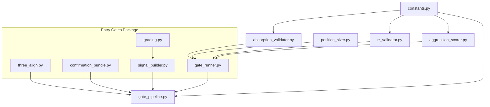

**Diagram sources**
- [entry_gates/__init__.py:1-63](file://backend/app/domain/fabio_ai/services/entry_gates/__init__.py#L1-L63)
- [gate_pipeline.py:1-256](file://backend/app/domain/fabio_ai/services/gate_pipeline.py#L1-L256)
- [aggression_scorer.py:1-282](file://backend/app/domain/fabio_ai/services/aggression_scorer.py#L1-L282)
- [rr_validator.py:1-117](file://backend/app/domain/fabio_ai/services/rr_validator.py#L1-L117)
- [absorption_validator.py:1-146](file://backend/app/domain/fabio_ai/services/absorption_validator.py#L1-L146)
- [position_sizer.py:1-106](file://backend/app/domain/fabio_ai/services/position_sizer.py#L1-L106)
- [constants.py:1-166](file://backend/app/domain/constants.py#L1-L166)

**Section sources**
- [PHASE_5_ENTRY_GATE_EXTRACTION.md:1-114](file://backend/PHASE_5_ENTRY_GATE_EXTRACTION.md#L1-L114)
- [entry_gates/__init__.py:1-63](file://backend/app/domain/fabio_ai/services/entry_gates/__init__.py#L1-L63)

## Core Components
- EntryGate orchestration: The gate runner constructs a GateContext and invokes the GatePipeline to evaluate 12 gates in sequence.
- GatePipeline: A strict sequential pipeline that short-circuits on the first failure, returning a reason and detail.
- ConfirmationBundle: Enforces volume impulse, delta pressure, and spread tightness with time-aware adjustments.
- AggressionScorer: Additive scoring across footprint, CVD, big trades, absorption, OFI, confluence, and bubbles; includes persistent filtering.
- RRValidator: Recomputes risk-reward using live ask price to prevent slippage-induced invalid setups.
- AbsorptionValidator: Validates absorption with forward-looking displacement confirmation.
- PositionSizer: Fixed fractional sizing with hard ceilings and risk-per-trade constraints.

**Section sources**
- [gate_runner.py:1-112](file://backend/app/domain/fabio_ai/services/entry_gates/gate_runner.py#L1-L112)
- [gate_pipeline.py:1-256](file://backend/app/domain/fabio_ai/services/gate_pipeline.py#L1-L256)
- [confirmation_bundle.py:1-154](file://backend/app/domain/fabio_ai/services/entry_gates/confirmation_bundle.py#L1-L154)
- [aggression_scorer.py:1-282](file://backend/app/domain/fabio_ai/services/aggression_scorer.py#L1-L282)
- [rr_validator.py:1-117](file://backend/app/domain/fabio_ai/services/rr_validator.py#L1-L117)
- [absorption_validator.py:1-146](file://backend/app/domain/fabio_ai/services/absorption_validator.py#L1-L146)
- [position_sizer.py:1-106](file://backend/app/domain/fabio_ai/services/position_sizer.py#L1-L106)

## Architecture Overview
The system integrates multiple order flow and structural signals into a unified gating framework. The flow begins with three-align validation, confirmation bundle checks, and aggression scoring, then proceeds through the 12-gate pipeline, SL/TP construction, and position sizing.

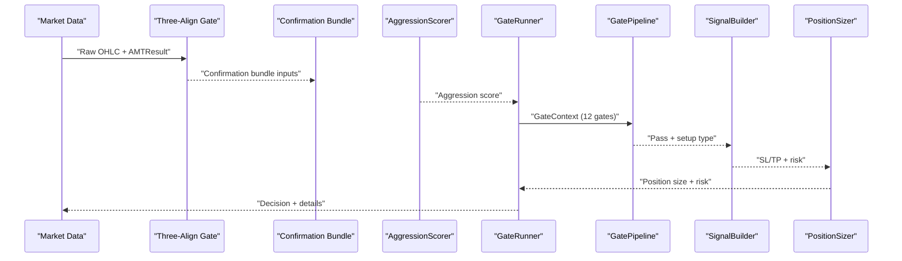

**Diagram sources**
- [three_align.py:111-227](file://backend/app/domain/fabio_ai/services/entry_gates/three_align.py#L111-L227)
- [confirmation_bundle.py:26-86](file://backend/app/domain/fabio_ai/services/entry_gates/confirmation_bundle.py#L26-L86)
- [aggression_scorer.py:77-153](file://backend/app/domain/fabio_ai/services/aggression_scorer.py#L77-L153)
- [gate_runner.py:6-95](file://backend/app/domain/fabio_ai/services/entry_gates/gate_runner.py#L6-L95)
- [gate_pipeline.py:139-245](file://backend/app/domain/fabio_ai/services/gate_pipeline.py#L139-L245)
- [signal_builder.py:60-232](file://backend/app/domain/fabio_ai/services/entry_gates/signal_builder.py#L60-L232)
- [position_sizer.py:32-105](file://backend/app/domain/fabio_ai/services/position_sizer.py#L32-L105)

## Detailed Component Analysis

### EntryGate Service (GateRunner)
- Builds GateContext from incoming data, AMT results, and configuration.
- Translates market state strings to enums and computes derived metrics (distance to levels, risk, reward, RR).
- Invokes GatePipeline and returns a compact decision tuple: (passed, reason, detail).
- Provides position sizing wrapper integrating with PositionSizer.

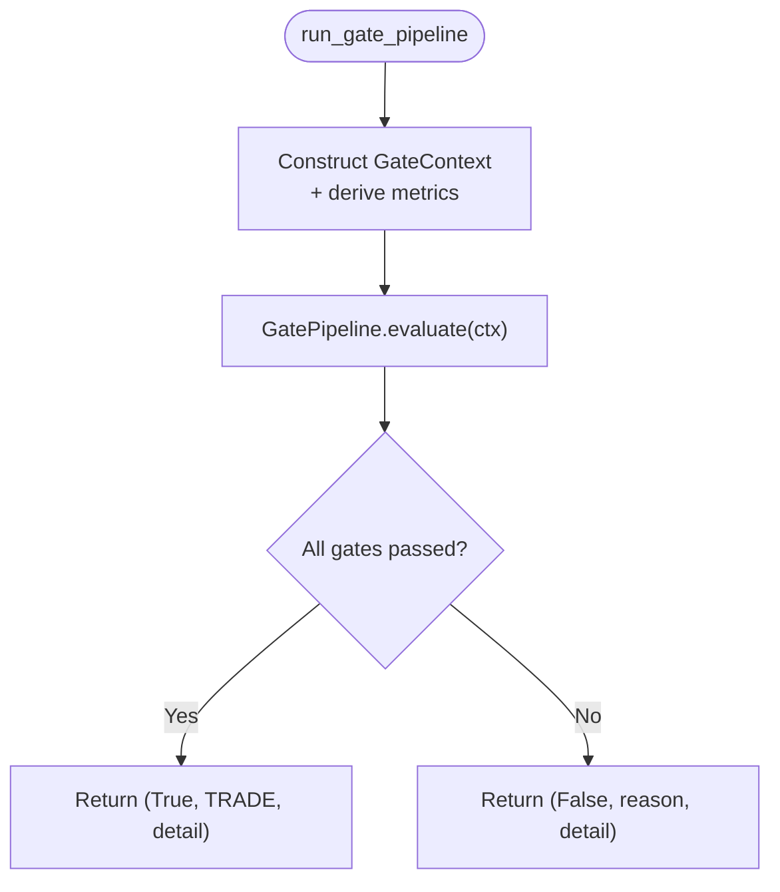

**Diagram sources**
- [gate_runner.py:6-95](file://backend/app/domain/fabio_ai/services/entry_gates/gate_runner.py#L6-L95)
- [gate_pipeline.py:139-245](file://backend/app/domain/fabio_ai/services/gate_pipeline.py#L139-L245)

**Section sources**
- [gate_runner.py:1-112](file://backend/app/domain/fabio_ai/services/entry_gates/gate_runner.py#L1-L112)
- [gate_pipeline.py:56-137](file://backend/app/domain/fabio_ai/services/gate_pipeline.py#L56-L137)

### GatePipeline (12-Gate Orchestration)
- Gates 0–12 enforce session warm-up, data freshness, session risk, market state, profile presence, proximity to levels, drive state, aggression, cushion, R:R, position sizing, and EIA suppression windows.
- Short-circuit evaluation ensures minimal computation on failure.
- GateContext consolidates all inputs for deterministic, side-effect-free evaluation.

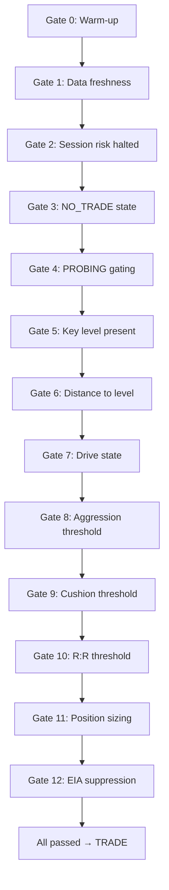

**Diagram sources**
- [gate_pipeline.py:142-245](file://backend/app/domain/fabio_ai/services/gate_pipeline.py#L142-L245)

**Section sources**
- [gate_pipeline.py:1-256](file://backend/app/domain/fabio_ai/services/gate_pipeline.py#L1-L256)

### Confirmation Bundle (Volume/Delta/Sprd + Momentum Fade)
- Enforces 2 out of 3: volume impulse (EMA-multiplier adjusted by time-of-day), delta pressure, and tight spread.
- Includes momentum fade filter to avoid entering against strong directional impulses without rejection.
- Computes ATR for robustness.

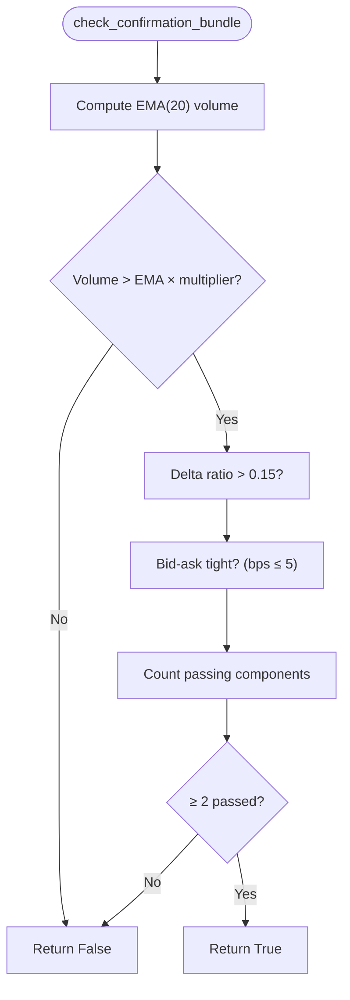

**Diagram sources**
- [confirmation_bundle.py:26-86](file://backend/app/domain/fabio_ai/services/entry_gates/confirmation_bundle.py#L26-L86)

**Section sources**
- [confirmation_bundle.py:1-154](file://backend/app/domain/fabio_ai/services/entry_gates/confirmation_bundle.py#L1-L154)

### AggressionScorer (Sentiment and Reaction Strength)
- Additive scoring across footprint, CVD, big trades, absorption, OFI, confluence, and bubbles.
- Confidence classification and optional persistent filtering to reduce false positives.
- Supports dynamic persistence based on market state.

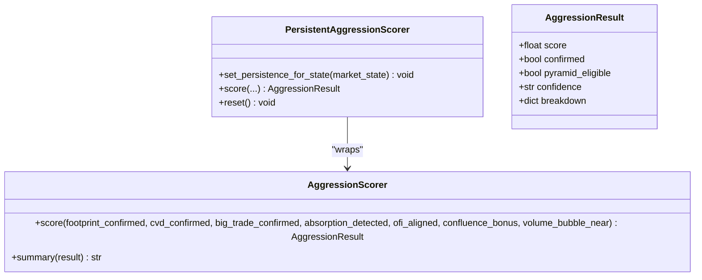

**Diagram sources**
- [aggression_scorer.py:60-153](file://backend/app/domain/fabio_ai/services/aggression_scorer.py#L60-L153)
- [aggression_scorer.py:165-282](file://backend/app/domain/fabio_ai/services/aggression_scorer.py#L165-L282)

**Section sources**
- [aggression_scorer.py:1-282](file://backend/app/domain/fabio_ai/services/aggression_scorer.py#L1-L282)
- [test_aggression_scorer.py:44-178](file://backend/tests/unit/test_aggression_scorer.py#L44-L178)

### RRValidator (Dynamic Risk-Reward)
- Recalculates live R:R using the live ask price to guard against slippage.
- Returns a structured result indicating validity, ratio, and reason.

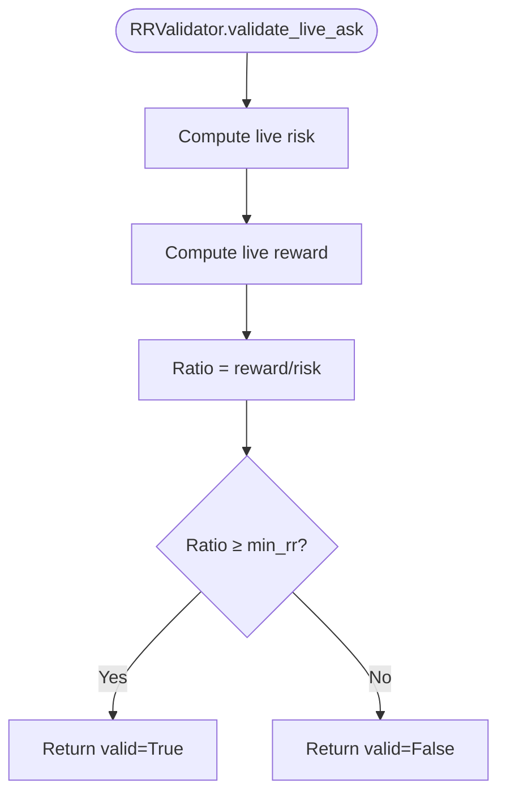

**Diagram sources**
- [rr_validator.py:38-117](file://backend/app/domain/fabio_ai/services/rr_validator.py#L38-L117)

**Section sources**
- [rr_validator.py:1-117](file://backend/app/domain/fabio_ai/services/rr_validator.py#L1-L117)

### AbsorptionValidator (Absorption + Displacement)
- Records absorption candles (small range, high volume).
- Validates forward-looking displacement beyond the absorption high/low within a bounded horizon.
- Resets state per session.

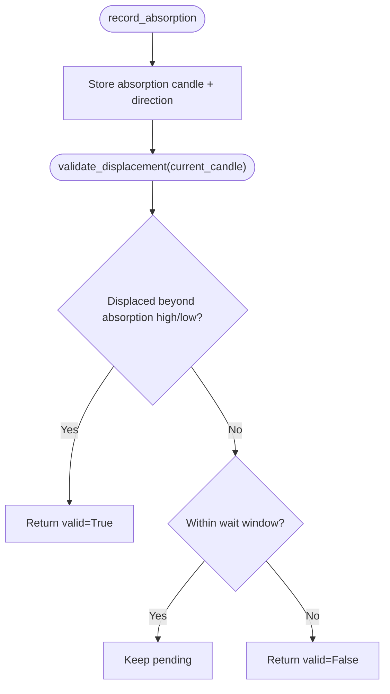

**Diagram sources**
- [absorption_validator.py:59-129](file://backend/app/domain/fabio_ai/services/absorption_validator.py#L59-L129)

**Section sources**
- [absorption_validator.py:1-146](file://backend/app/domain/fabio_ai/services/absorption_validator.py#L1-L146)
- [test_live_trading_safeguards.py:117-142](file://backend/tests/unit/test_live_trading_safeguards.py#L117-L142)

### SignalBuilder (SL/TP Construction)
- Builds Signals with SL/TP according to setup type (mean reversion vs trend).
- Incorporates aggressive prints, VWAP, ATR-based floors, and tick-size rounding.
- Computes grade score and attaches metadata for downstream use.

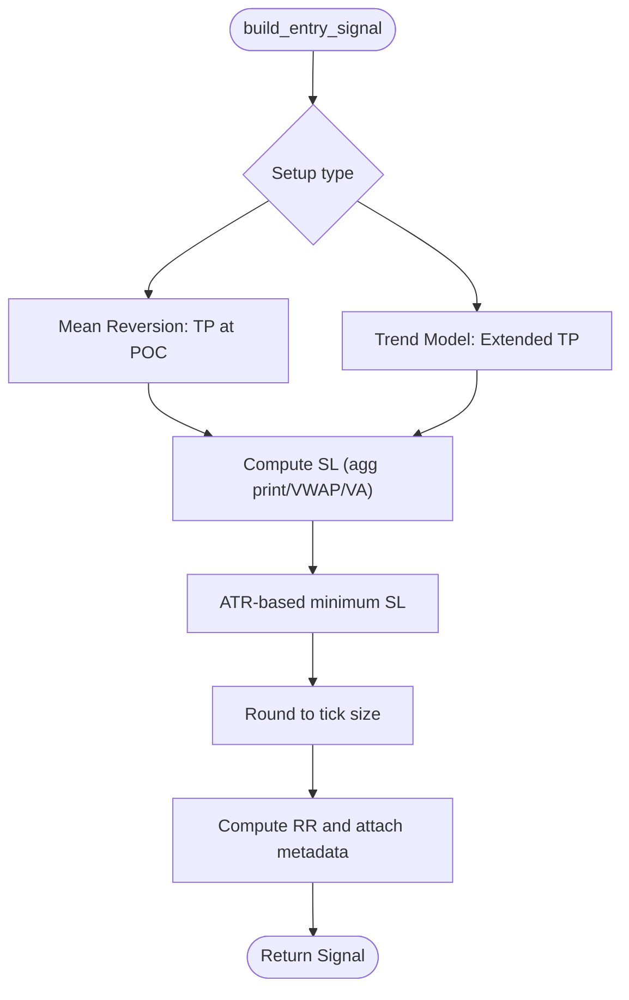

**Diagram sources**
- [signal_builder.py:60-232](file://backend/app/domain/fabio_ai/services/entry_gates/signal_builder.py#L60-L232)

**Section sources**
- [signal_builder.py:1-233](file://backend/app/domain/fabio_ai/services/entry_gates/signal_builder.py#L1-L233)

### PositionSizer (Risk-Constrained Sizing)
- Fixed fractional sizing with hard ceiling per trade.
- Calculates risk per lot and caps at absolute ceiling.

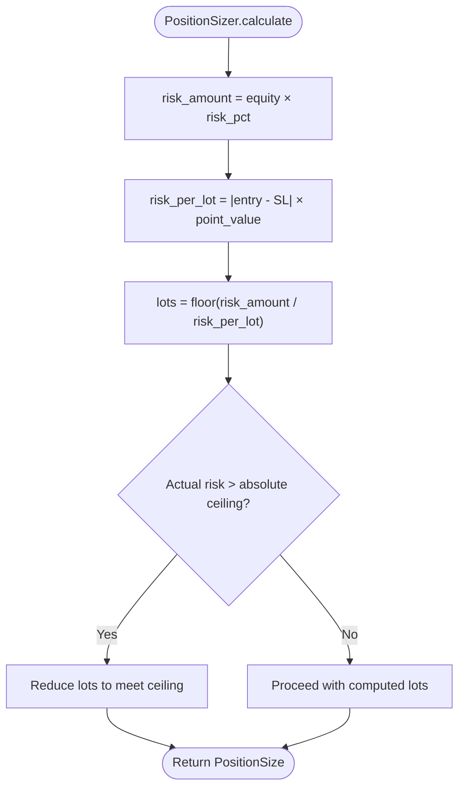

**Diagram sources**
- [position_sizer.py:32-105](file://backend/app/domain/fabio_ai/services/position_sizer.py#L32-L105)

**Section sources**
- [position_sizer.py:1-106](file://backend/app/domain/fabio_ai/services/position_sizer.py#L1-L106)

## Dependency Analysis
- Constants are centrally configured and injected into validators and scorers.
- GateRunner depends on GatePipeline, constants, and market-state mapping.
- SignalBuilder depends on confirmation metrics and grading.
- AggressionScorer and AbsorptionValidator are independent units feeding into GateRunner.
- RRValidator is invoked during live order placement to validate R:R.

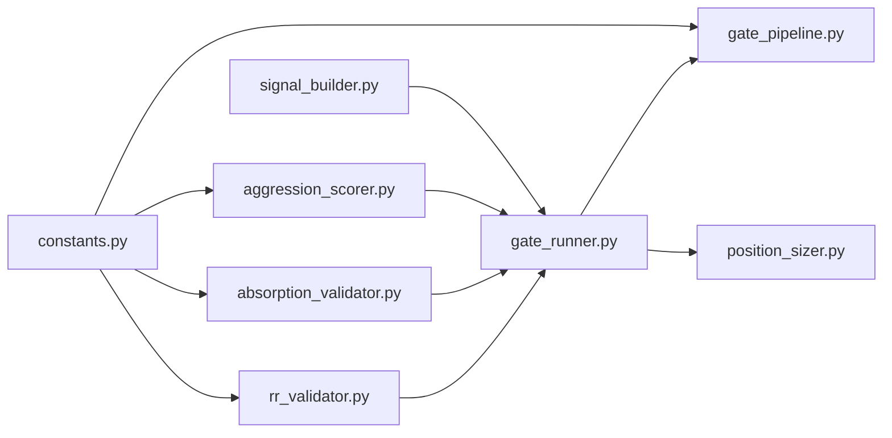

**Diagram sources**
- [constants.py:1-166](file://backend/app/domain/constants.py#L1-L166)
- [gate_pipeline.py:1-256](file://backend/app/domain/fabio_ai/services/gate_pipeline.py#L1-L256)
- [aggression_scorer.py:1-282](file://backend/app/domain/fabio_ai/services/aggression_scorer.py#L1-L282)
- [rr_validator.py:1-117](file://backend/app/domain/fabio_ai/services/rr_validator.py#L1-L117)
- [absorption_validator.py:1-146](file://backend/app/domain/fabio_ai/services/absorption_validator.py#L1-L146)
- [gate_runner.py:1-112](file://backend/app/domain/fabio_ai/services/entry_gates/gate_runner.py#L1-L112)
- [position_sizer.py:1-106](file://backend/app/domain/fabio_ai/services/position_sizer.py#L1-L106)
- [signal_builder.py:1-233](file://backend/app/domain/fabio_ai/services/entry_gates/signal_builder.py#L1-L233)

**Section sources**
- [constants.py:1-166](file://backend/app/domain/constants.py#L1-L166)

## Performance Considerations
- Lazy imports and modular design minimize cold-start overhead.
- GatePipeline short-circuits on first failure to avoid unnecessary computations.
- Confirmation bundle uses lightweight EMA and simple thresholds; ATR computation is bounded by recent bars.
- Aggression scoring is additive and constant-time; persistent filter maintains bounded history.
- Position sizing is O(1) arithmetic with early exits for invalid inputs.

[No sources needed since this section provides general guidance]

## Troubleshooting Guide
Common issues and mitigations:
- Excessive rejections in PROBING: Increase probing aggression threshold or ensure key-level proximity.
- Frequent EIA suppression: Monitor EIA calendar and schedule around release windows.
- Low aggression scores: Verify footprint, CVD, big trade, absorption, OFI, and confluence signals.
- R:R failures at live price: Use RRValidator to confirm slippage-adjusted R:R before order submission.
- Absorption not confirmed: Ensure displacement occurs within the validator’s wait window.

**Section sources**
- [gate_pipeline.py:173-183](file://backend/app/domain/fabio_ai/services/gate_pipeline.py#L173-L183)
- [aggression_scorer.py:165-282](file://backend/app/domain/fabio_ai/services/aggression_scorer.py#L165-L282)
- [rr_validator.py:38-117](file://backend/app/domain/fabio_ai/services/rr_validator.py#L38-L117)
- [absorption_validator.py:79-129](file://backend/app/domain/fabio_ai/services/absorption_validator.py#L79-L129)

## Conclusion
The entry and exit validation system combines structural, order-flow, and sentiment signals into a robust, configurable pipeline. Its modular design, adaptive thresholds, and risk-aware sizing enable reliable real-time decision-making while reducing false positives through persistent filters and forward-looking validations.