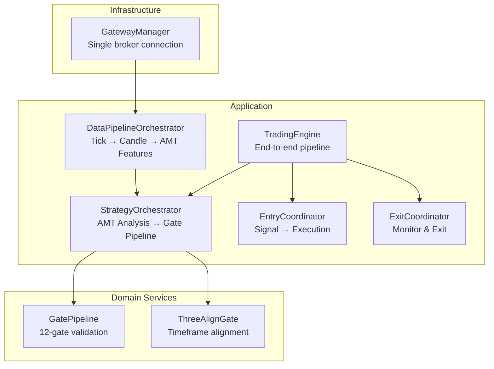
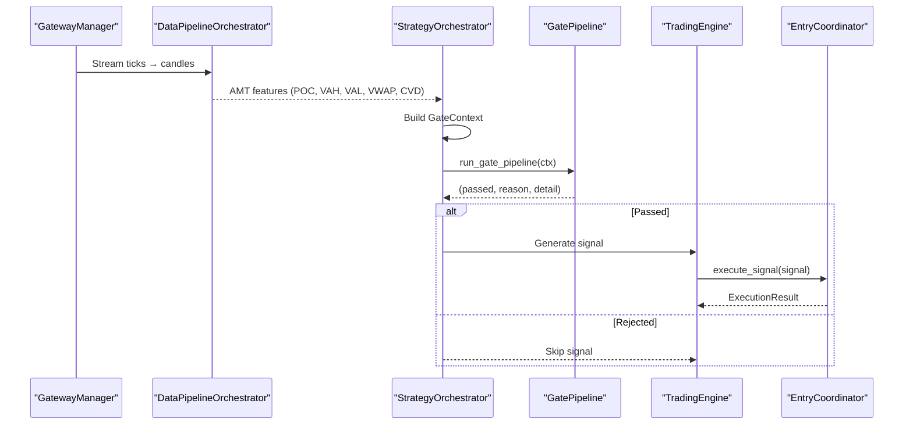
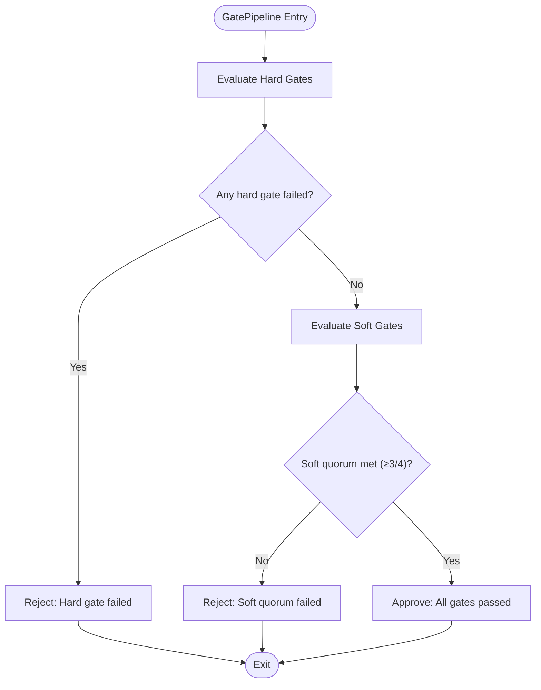
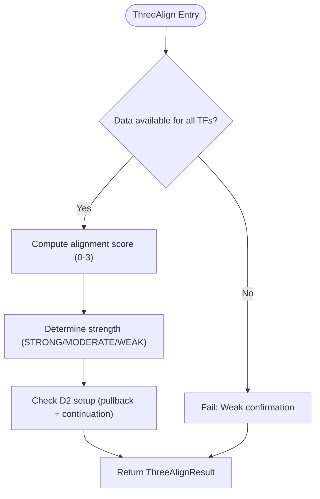
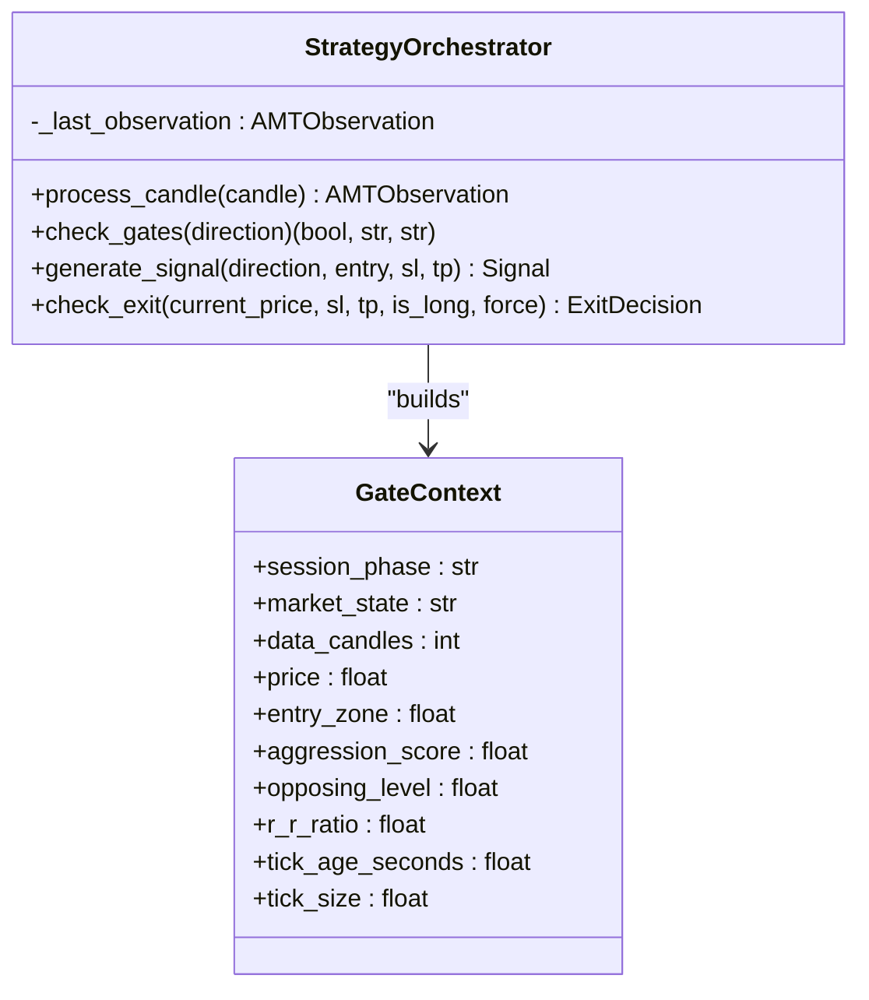
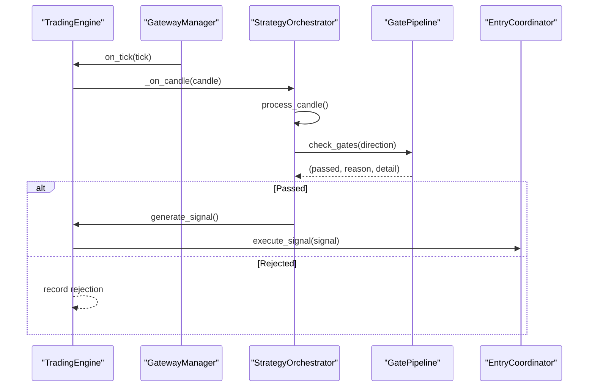
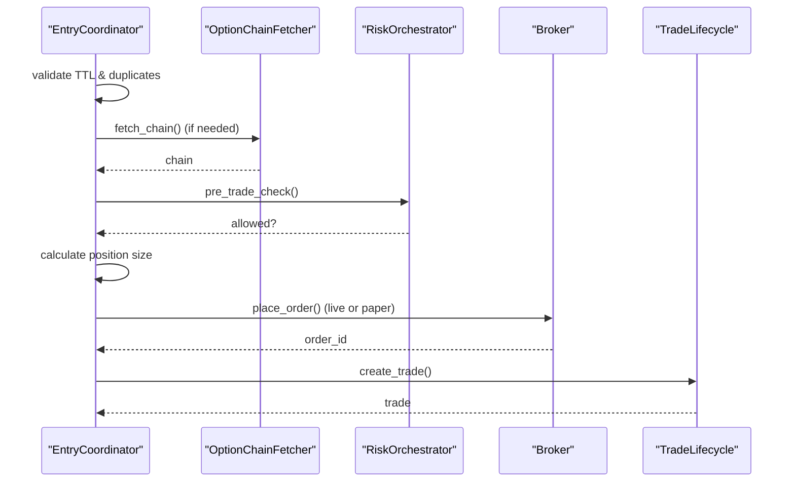
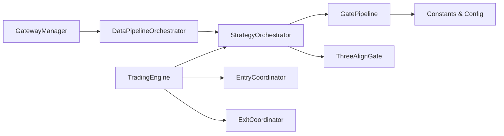

# Gate Pipeline

<cite>
**Referenced Files in This Document**
- [gate_pipeline.py](file://appv2/backend/appv2/domain/services/gate_pipeline.py)
- [three_align_gate.py](file://appv2/backend/appv2/domain/services/three_align_gate.py)
- [strategy_orchestrator.py](file://appv2/backend/appv2/application/strategy_orchestrator.py)
- [trading_engine.py](file://appv2/backend/appv2/application/trading_engine.py)
- [entry_coordinator.py](file://appv2/backend/appv2/application/entry_coordinator.py)
- [exit_coordinator.py](file://appv2/backend/appv2/application/exit_coordinator.py)
- [data_pipeline.py](file://appv2/backend/appv2/application/data_pipeline.py)
- [gateway_manager.py](file://appv2/backend/appv2/infrastructure/gateway_manager.py)
- [test_gate_pipeline.py](file://appv2/backend/tests/test_gate_pipeline.py)
- [entry_gate_coordinator.py](file://backend/app/application/handlers/entry_gate_coordinator.py)
- [gate_pipeline.py](file://backend/app/domain/fabio_ai/services/gate_pipeline.py)
</cite>

## Table of Contents
1. [Introduction](#introduction)
2. [Project Structure](#project-structure)
3. [Core Components](#core-components)
4. [Architecture Overview](#architecture-overview)
5. [Detailed Component Analysis](#detailed-component-analysis)
6. [Dependency Analysis](#dependency-analysis)
7. [Performance Considerations](#performance-considerations)
8. [Troubleshooting Guide](#troubleshooting-guide)
9. [Conclusion](#conclusion)

## Introduction
This document provides a comprehensive analysis of the Gate Pipeline system, which serves as the decision-making layer for validating trade entries in the trading engine. The Gate Pipeline enforces both hard gates (fail-fast safety controls) and soft gates (quorum-based quality filters) to ensure robust, disciplined trading decisions. It integrates tightly with the broader trading ecosystem, including market data ingestion, AMT analysis, risk management, and execution coordination.

## Project Structure
The Gate Pipeline spans multiple layers:
- Domain services: Gate pipeline logic, three-align validation, and gate context management
- Application orchestration: Strategy orchestrator, trading engine, entry/exit coordinators
- Infrastructure: Gateway manager for unified broker connectivity
- Testing: Unit tests validating gate behavior under various market conditions

**Diagram sources**
- [gateway_manager.py:27-307](file://appv2/backend/appv2/infrastructure/gateway_manager.py#L27-L307)
- [data_pipeline.py:40-151](file://appv2/backend/appv2/application/data_pipeline.py#L40-L151)
- [strategy_orchestrator.py:54-245](file://appv2/backend/appv2/application/strategy_orchestrator.py#L54-L245)
- [trading_engine.py:77-642](file://appv2/backend/appv2/application/trading_engine.py#L77-L642)
- [entry_coordinator.py:33-185](file://appv2/backend/appv2/application/entry_coordinator.py#L33-L185)
- [exit_coordinator.py:23-178](file://appv2/backend/appv2/application/exit_coordinator.py#L23-L178)
- [gate_pipeline.py:17-238](file://appv2/backend/appv2/domain/services/gate_pipeline.py#L17-L238)
- [three_align_gate.py:26-157](file://appv2/backend/appv2/domain/services/three_align_gate.py#L26-L157)

**Section sources**
- [gateway_manager.py:27-307](file://appv2/backend/appv2/infrastructure/gateway_manager.py#L27-L307)
- [data_pipeline.py:40-151](file://appv2/backend/appv2/application/data_pipeline.py#L40-L151)
- [strategy_orchestrator.py:54-245](file://appv2/backend/appv2/application/strategy_orchestrator.py#L54-L245)
- [trading_engine.py:77-642](file://appv2/backend/appv2/application/trading_engine.py#L77-L642)
- [entry_coordinator.py:33-185](file://appv2/backend/appv2/application/entry_coordinator.py#L33-L185)
- [exit_coordinator.py:23-178](file://appv2/backend/appv2/application/exit_coordinator.py#L23-L178)
- [gate_pipeline.py:17-238](file://appv2/backend/appv2/domain/services/gate_pipeline.py#L17-L238)
- [three_align_gate.py:26-157](file://appv2/backend/appv2/domain/services/three_align_gate.py#L26-L157)

## Core Components
- GatePipeline (12-gate): Implements hard gates (fail-fast) and soft gates (quorum scoring) with configurable thresholds and logging.
- ThreeAlignGate: Validates multi-timeframe alignment across 5-minute, 15-minute, and 1-hour charts.
- StrategyOrchestrator: Coordinates AMT analysis, builds GateContext, and triggers gate evaluation.
- TradingEngine: Integrates gate evaluation into the full trading loop, including signal generation and execution.
- Entry/Exit Coordinators: Manage signal lifecycle and position management after gate approval.
- GatewayManager: Centralized broker connectivity and rate-limit enforcement.

**Section sources**
- [gate_pipeline.py:17-238](file://appv2/backend/appv2/domain/services/gate_pipeline.py#L17-L238)
- [three_align_gate.py:26-157](file://appv2/backend/appv2/domain/services/three_align_gate.py#L26-L157)
- [strategy_orchestrator.py:138-162](file://appv2/backend/appv2/application/strategy_orchestrator.py#L138-L162)
- [trading_engine.py:340-383](file://appv2/backend/appv2/application/trading_engine.py#L340-L383)
- [entry_coordinator.py:51-185](file://appv2/backend/appv2/application/entry_coordinator.py#L51-L185)
- [exit_coordinator.py:41-178](file://appv2/backend/appv2/application/exit_coordinator.py#L41-L178)
- [gateway_manager.py:69-104](file://appv2/backend/appv2/infrastructure/gateway_manager.py#L69-L104)

## Architecture Overview
The Gate Pipeline sits at the intersection of market data processing and execution. The flow is:
1. Market data enters via GatewayManager and is processed through DataPipelineOrchestrator.
2. StrategyOrchestrator performs AMT analysis and constructs GateContext.
3. GatePipeline evaluates hard gates (immediate rejection) and soft gates (quorum requirement).
4. Approved signals are passed to EntryCoordinator for execution.
5. ExitCoordinator monitors positions and manages exits.

**Diagram sources**
- [gateway_manager.py:199-258](file://appv2/backend/appv2/infrastructure/gateway_manager.py#L199-L258)
- [data_pipeline.py:67-114](file://appv2/backend/appv2/application/data_pipeline.py#L67-L114)
- [strategy_orchestrator.py:75-136](file://appv2/backend/appv2/application/strategy_orchestrator.py#L75-L136)
- [gate_pipeline.py:197-237](file://appv2/backend/appv2/domain/services/gate_pipeline.py#L197-L237)
- [trading_engine.py:372-383](file://appv2/backend/appv2/application/trading_engine.py#L372-L383)
- [entry_coordinator.py:51-185](file://appv2/backend/appv2/application/entry_coordinator.py#L51-L185)

## Detailed Component Analysis

### GatePipeline (12-gate Validation)
The GatePipeline enforces:
- Hard gates (fail-fast): session warm-up, data quality, risk halt, NO_TRADE state, PROBING without aggression, key level proximity, drive validation, signal age, profile shape, CVD extremes, theta viability.
- Soft gates (quorum ≥ 3/4): entry zone proximity, aggression threshold, cushion to key level, R:R ratio.

**Diagram sources**
- [gate_pipeline.py:197-237](file://appv2/backend/appv2/domain/services/gate_pipeline.py#L197-L237)

**Section sources**
- [gate_pipeline.py:17-238](file://appv2/backend/appv2/domain/services/gate_pipeline.py#L17-L238)

### ThreeAlignGate (Multi-Timeframe Alignment)
Validates three-timeframe agreement:
- 5-minute: close relative to open for trend confirmation
- 15-minute: price relationship to POC for medium-term bias
- 1-hour: POC shift direction for trend bias
- Detects second drive setups (D2) requiring pullback followed by continuation.

**Diagram sources**
- [three_align_gate.py:26-102](file://appv2/backend/appv2/domain/services/three_align_gate.py#L26-L102)

**Section sources**
- [three_align_gate.py:26-157](file://appv2/backend/appv2/domain/services/three_align_gate.py#L26-L157)

### StrategyOrchestrator Integration
Builds GateContext from AMT observations and invokes GatePipeline. Computes R:R ratio from VWAP distances and uses tick size for precise thresholds.

**Diagram sources**
- [strategy_orchestrator.py:138-162](file://appv2/backend/appv2/application/strategy_orchestrator.py#L138-L162)
- [gate_pipeline.py:24-44](file://appv2/backend/appv2/domain/services/gate_pipeline.py#L24-L44)

**Section sources**
- [strategy_orchestrator.py:138-162](file://appv2/backend/appv2/application/strategy_orchestrator.py#L138-L162)

### TradingEngine Integration
The TradingEngine coordinates gate evaluation within the full trading loop:
- Subscribes to market data via GatewayManager
- Processes ticks into candles and AMT features
- Evaluates gates for both LONG and SHORT directions
- Generates signals upon gate approval and delegates execution to EntryCoordinator

**Diagram sources**
- [trading_engine.py:221-383](file://appv2/backend/appv2/application/trading_engine.py#L221-L383)
- [gateway_manager.py:199-258](file://appv2/backend/appv2/infrastructure/gateway_manager.py#L199-L258)
- [strategy_orchestrator.py:138-162](file://appv2/backend/appv2/application/strategy_orchestrator.py#L138-L162)
- [gate_pipeline.py:197-237](file://appv2/backend/appv2/domain/services/gate_pipeline.py#L197-L237)
- [entry_coordinator.py:51-185](file://appv2/backend/appv2/application/entry_coordinator.py#L51-L185)

**Section sources**
- [trading_engine.py:340-383](file://appv2/backend/appv2/application/trading_engine.py#L340-L383)

### Entry and Exit Coordination
After gate approval, EntryCoordinator validates TTL, enriches signals with options, performs risk checks, calculates position sizes, and executes orders. ExitCoordinator monitors open positions, applies trailing stops, and manages exits with strict broker-state alignment.

**Diagram sources**
- [entry_coordinator.py:51-185](file://appv2/backend/appv2/application/entry_coordinator.py#L51-L185)

**Section sources**
- [entry_coordinator.py:51-185](file://appv2/backend/appv2/application/entry_coordinator.py#L51-L185)
- [exit_coordinator.py:41-178](file://appv2/backend/appv2/application/exit_coordinator.py#L41-L178)

## Dependency Analysis
The Gate Pipeline depends on:
- AMT-derived features (POC, VAH, VAL, VWAP, CVD) from DataPipelineOrchestrator
- StrategyOrchestrator for GateContext construction
- Configuration constants for thresholds (tick sizes, aggression, R:R, cushion)
- GatewayManager for unified broker access and rate limiting

**Diagram sources**
- [data_pipeline.py:40-151](file://appv2/backend/appv2/application/data_pipeline.py#L40-L151)
- [strategy_orchestrator.py:54-245](file://appv2/backend/appv2/application/strategy_orchestrator.py#L54-L245)
- [gate_pipeline.py:17-238](file://appv2/backend/appv2/domain/services/gate_pipeline.py#L17-L238)
- [three_align_gate.py:26-157](file://appv2/backend/appv2/domain/services/three_align_gate.py#L26-L157)
- [trading_engine.py:77-642](file://appv2/backend/appv2/application/trading_engine.py#L77-L642)
- [entry_coordinator.py:33-185](file://appv2/backend/appv2/application/entry_coordinator.py#L33-L185)
- [exit_coordinator.py:23-178](file://appv2/backend/appv2/application/exit_coordinator.py#L23-L178)
- [gateway_manager.py:69-104](file://appv2/backend/appv2/infrastructure/gateway_manager.py#L69-L104)

**Section sources**
- [data_pipeline.py:40-151](file://appv2/backend/appv2/application/data_pipeline.py#L40-L151)
- [strategy_orchestrator.py:54-245](file://appv2/backend/appv2/application/strategy_orchestrator.py#L54-L245)
- [gate_pipeline.py:17-238](file://appv2/backend/appv2/domain/services/gate_pipeline.py#L17-L238)
- [three_align_gate.py:26-157](file://appv2/backend/appv2/domain/services/three_align_gate.py#L26-L157)
- [trading_engine.py:77-642](file://appv2/backend/appv2/application/trading_engine.py#L77-L642)
- [entry_coordinator.py:33-185](file://appv2/backend/appv2/application/entry_coordinator.py#L33-L185)
- [exit_coordinator.py:23-178](file://appv2/backend/appv2/application/exit_coordinator.py#L23-L178)
- [gateway_manager.py:69-104](file://appv2/backend/appv2/infrastructure/gateway_manager.py#L69-L104)

## Performance Considerations
- Tick throttling: TradingEngine employs a 500ms throttle to reduce computational load during dense streams.
- Rate limiting: GatewayManager centralizes broker requests to respect exchange limits.
- Logging and diagnostics: GatePipeline logs hard and soft gate outcomes for observability and tuning.
- Quorum efficiency: Soft gate evaluation short-circuits after meeting the quorum threshold.

[No sources needed since this section provides general guidance]

## Troubleshooting Guide
Common issues and resolutions:
- Gate rejections:
  - Hard gates: Verify session phase, data quality, risk halt, market state, and drive conditions.
  - Soft gates: Adjust entry zone proximity, aggression thresholds, cushion limits, and R:R ratios.
- Signal TTL and duplicates: Ensure SignalTTLManager is functioning and not blocking legitimate signals.
- Broker connectivity: Confirm GatewayManager is connected and not rate-limited.
- Position mismatches: Use reconciliation loop to align internal state with broker positions.

**Section sources**
- [test_gate_pipeline.py:18-89](file://appv2/backend/tests/test_gate_pipeline.py#L18-L89)
- [gateway_manager.py:111-136](file://appv2/backend/appv2/infrastructure/gateway_manager.py#L111-L136)
- [entry_coordinator.py:64-70](file://appv2/backend/appv2/application/entry_coordinator.py#L64-L70)
- [trading_engine.py:523-568](file://appv2/backend/appv2/application/trading_engine.py#L523-L568)

## Conclusion
The Gate Pipeline provides a robust, configurable framework for disciplined trade entry validation. By combining hard gates for safety with soft gates for quality, it ensures high-probability setups while maintaining strict risk controls. Its integration with AMT analysis, broker connectivity, and execution systems creates a cohesive trading pipeline suitable for both paper and live markets.