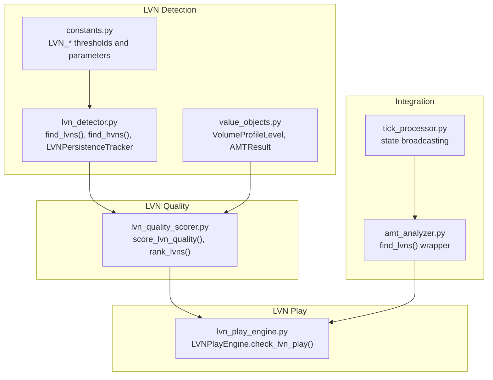
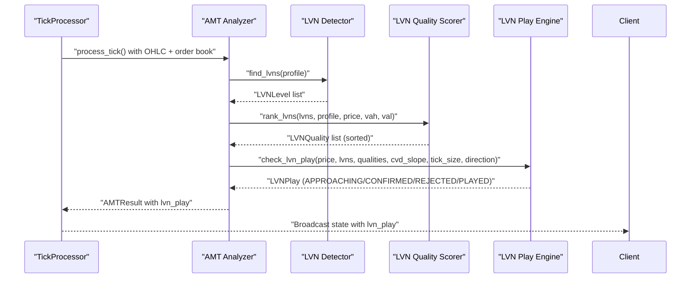
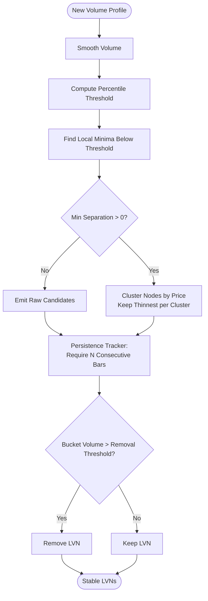
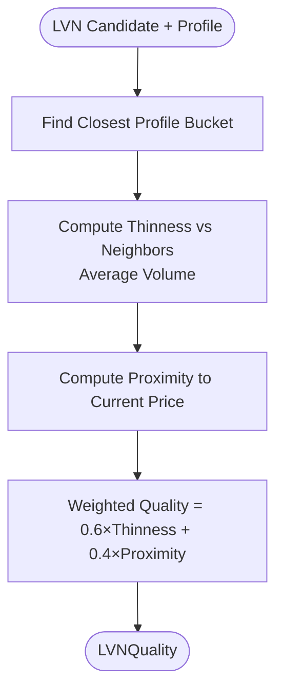
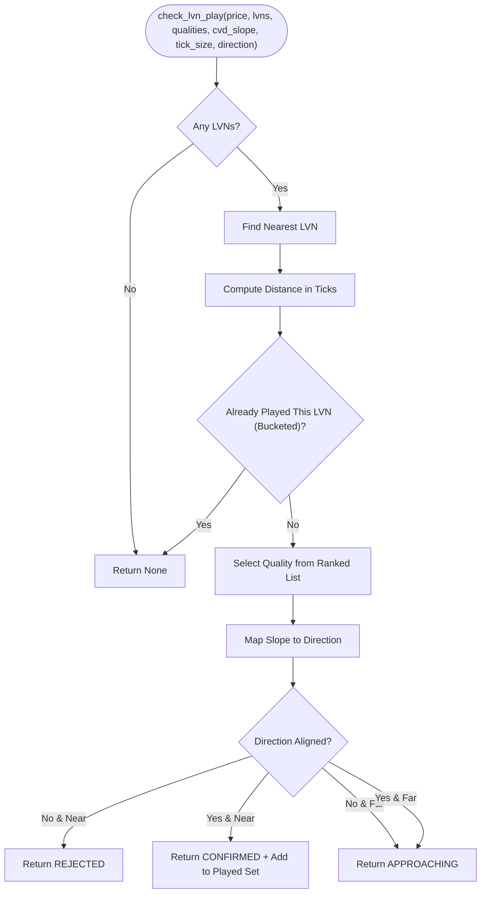
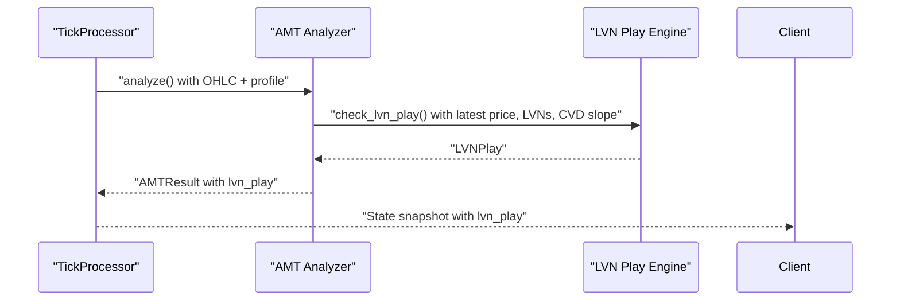
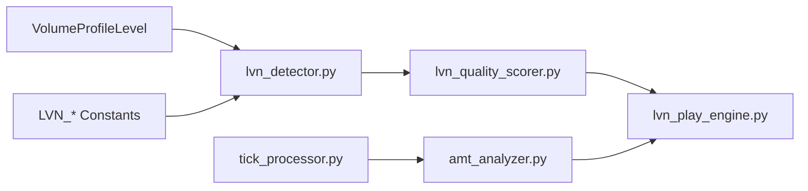

# LVN Analyzer

<cite>
**Referenced Files in This Document**
- [lvn_play_engine.py](file://backend/app/domain/fabio_ai/services/lvn_play_engine.py)
- [lvn_quality_scorer.py](file://backend/app/domain/fabio_ai/services/lvn_quality_scorer.py)
- [lvn_detector.py](file://backend/app/domain/services/lvn_detector.py)
- [value_objects.py](file://backend/app/domain/trading/models/value_objects.py)
- [constants.py](file://backend/app/domain/constants.py)
- [amt_analyzer.py](file://backend/app/domain/fabio_ai/services/amt_analyzer.py)
- [tick_processor.py](file://backend/app/application/services/tick_processor.py)
- [FABIO_PRINCIPLES_VS_SYSTEM.md](file://docs/FABIO_PRINCIPLES_VS_SYSTEM.md)
- [volume_profile_logic_correctness_analysis.md](file://backups/docs/volume_profile_logic_correctness_analysis.md)
- [test_lvn_detector.py](file://backend/tests/unit/domain/test_lvn_detector.py)
- [test_amt_stability_fixes.py](file://backend/tests/validation/test_amt_stability_fixes.py)
</cite>

## Table of Contents
1. [Introduction](#introduction)
2. [Project Structure](#project-structure)
3. [Core Components](#core-components)
4. [Architecture Overview](#architecture-overview)
5. [Detailed Component Analysis](#detailed-component-analysis)
6. [Dependency Analysis](#dependency-analysis)
7. [Performance Considerations](#performance-considerations)
8. [Troubleshooting Guide](#troubleshooting-guide)
9. [Conclusion](#conclusion)

## Introduction
This document describes the LVN (Low Volume Node) Analyzer subsystem within the trading system. LVNs are critical price levels where the market historically exhibits low trading activity and strong price movement potential. The LVN Analyzer integrates volume profile detection, quality scoring, and CVD (Cumulative Volume Delta) alignment to identify retest opportunities and generate actionable signals for intraday scalping.

The analyzer follows Fabio AMT (Auction Market Theory) principles, emphasizing:
- LVN detection from the volume profile
- Quality scoring prioritizing thinness vs neighbors and proximity to current price
- CVD slope alignment with intended trade direction
- Session-scoped play prevention to avoid repeated entries at the same LVN

## Project Structure
The LVN Analyzer spans several modules:
- LVN detection and persistence tracking
- LVN quality scoring
- LVN play engine combining detection, scoring, and CVD alignment
- Integration with AMT analysis pipeline and trading session state

**Diagram sources**
- [lvn_detector.py:131-393](file://backend/app/domain/services/lvn_detector.py#L131-L393)
- [lvn_quality_scorer.py:38-121](file://backend/app/domain/fabio_ai/services/lvn_quality_scorer.py#L38-L121)
- [lvn_play_engine.py:45-135](file://backend/app/domain/fabio_ai/services/lvn_play_engine.py#L45-L135)
- [value_objects.py:84-120](file://backend/app/domain/trading/models/value_objects.py#L84-L120)
- [constants.py:45-64](file://backend/app/domain/constants.py#L45-L64)
- [amt_analyzer.py:170-185](file://backend/app/domain/fabio_ai/services/amt_analyzer.py#L170-L185)
- [tick_processor.py:259-309](file://backend/app/application/services/tick_processor.py#L259-L309)

**Section sources**
- [lvn_detector.py:1-393](file://backend/app/domain/services/lvn_detector.py#L1-L393)
- [lvn_quality_scorer.py:1-121](file://backend/app/domain/fabio_ai/services/lvn_quality_scorer.py#L1-L121)
- [lvn_play_engine.py:1-136](file://backend/app/domain/fabio_ai/services/lvn_play_engine.py#L1-L136)
- [value_objects.py:84-207](file://backend/app/domain/trading/models/value_objects.py#L84-L207)
- [constants.py:45-64](file://backend/app/domain/constants.py#L45-L64)
- [amt_analyzer.py:170-185](file://backend/app/domain/fabio_ai/services/amt_analyzer.py#L170-L185)
- [tick_processor.py:259-309](file://backend/app/application/services/tick_processor.py#L259-L309)

## Core Components
- LVN Detection and Persistence:
  - Detects LVNs using percentile-based thresholds on smoothed volume.
  - Tracks LVN persistence across bars to prevent flickering and emits only stable LVNs.
  - Clusters nearby LVNs based on minimum price separation.

- LVN Quality Scoring:
  - Scores each LVN by thinness relative to neighboring buckets and proximity to current price.
  - Ranks LVNs to prioritize the best retest targets.

- LVN Play Engine:
  - Identifies when price approaches or reaches an LVN.
  - Checks CVD slope alignment with intended direction.
  - Prevents repeated plays at the same LVN within a session by bucketing to tick size.
  - Emits signals: APPROACHING, CONFIRMED, REJECTED, PLAYED.

- Integration with AMT and Trading Pipeline:
  - AMT analyzer wraps LVN detection for downstream consumers.
  - Tick processor broadcasts AMT results including LVN play signals to clients.

**Section sources**
- [lvn_detector.py:131-393](file://backend/app/domain/services/lvn_detector.py#L131-L393)
- [lvn_quality_scorer.py:38-121](file://backend/app/domain/fabio_ai/services/lvn_quality_scorer.py#L38-L121)
- [lvn_play_engine.py:45-135](file://backend/app/domain/fabio_ai/services/lvn_play_engine.py#L45-L135)
- [amt_analyzer.py:170-185](file://backend/app/domain/fabio_ai/services/amt_analyzer.py#L170-L185)
- [tick_processor.py:259-309](file://backend/app/application/services/tick_processor.py#L259-L309)

## Architecture Overview
The LVN Analyzer participates in the broader AMT analysis pipeline and trading lifecycle:

**Diagram sources**
- [tick_processor.py:259-309](file://backend/app/application/services/tick_processor.py#L259-L309)
- [amt_analyzer.py:170-185](file://backend/app/domain/fabio_ai/services/amt_analyzer.py#L170-L185)
- [lvn_detector.py:131-194](file://backend/app/domain/services/lvn_detector.py#L131-L194)
- [lvn_quality_scorer.py:105-121](file://backend/app/domain/fabio_ai/services/lvn_quality_scorer.py#L105-L121)
- [lvn_play_engine.py:45-135](file://backend/app/domain/fabio_ai/services/lvn_play_engine.py#L45-L135)

## Detailed Component Analysis

### LVN Detection and Persistence
- Detection:
  - Smoothes volume with a centered moving average.
  - Finds local minima below a percentile threshold (default bottom 25%).
  - Filters candidates to ensure local minima on both sides.
- Persistence:
  - Requires N consecutive bars (default 3) before emitting an LVN.
  - Removes LVNs when bucket volume exceeds a removal threshold relative to mean volume.
- Clustering:
  - Merges nearby LVNs within a minimum price separation (default 3 ticks) and keeps the thinnest-volume node per cluster.

**Diagram sources**
- [lvn_detector.py:131-393](file://backend/app/domain/services/lvn_detector.py#L131-L393)
- [constants.py:45-64](file://backend/app/domain/constants.py#L45-L64)

**Section sources**
- [lvn_detector.py:131-393](file://backend/app/domain/services/lvn_detector.py#L131-L393)
- [constants.py:45-64](file://backend/app/domain/constants.py#L45-L64)
- [test_lvn_detector.py:1-305](file://backend/tests/unit/domain/test_lvn_detector.py#L1-L305)
- [test_amt_stability_fixes.py:311-346](file://backend/tests/validation/test_amt_stability_fixes.py#L311-L346)

### LVN Quality Scoring
- Thinness score measures how much lower the LVN volume is compared to neighboring buckets.
- Proximity score measures closeness to current price within a given price range.
- Combined quality is a weighted sum favoring thinness (60%) and proximity (40%).

**Diagram sources**
- [lvn_quality_scorer.py:38-121](file://backend/app/domain/fabio_ai/services/lvn_quality_scorer.py#L38-L121)

**Section sources**
- [lvn_quality_scorer.py:38-121](file://backend/app/domain/fabio_ai/services/lvn_quality_scorer.py#L38-L121)

### LVN Play Engine
- Determines if price is approaching or at an LVN within a configurable distance in ticks.
- Checks CVD slope direction alignment with intended direction (LONG vs SHORT).
- Prevents repeated plays at the same LVN within a session by bucketing to tick size.
- Emits actionable signals with reasons for transparency.

**Diagram sources**
- [lvn_play_engine.py:45-135](file://backend/app/domain/fabio_ai/services/lvn_play_engine.py#L45-L135)

**Section sources**
- [lvn_play_engine.py:45-135](file://backend/app/domain/fabio_ai/services/lvn_play_engine.py#L45-L135)

### Integration with AMT and Trading Pipeline
- AMT analyzer exposes a thin wrapper to extract LVN prices from detected LVNLevel objects.
- Tick processor includes AMT results (including lvn_play) in throttled state updates for real-time client consumption.

**Diagram sources**
- [tick_processor.py:259-309](file://backend/app/application/services/tick_processor.py#L259-L309)
- [amt_analyzer.py:170-185](file://backend/app/domain/fabio_ai/services/amt_analyzer.py#L170-L185)
- [lvn_play_engine.py:45-135](file://backend/app/domain/fabio_ai/services/lvn_play_engine.py#L45-L135)

**Section sources**
- [amt_analyzer.py:170-185](file://backend/app/domain/fabio_ai/services/amt_analyzer.py#L170-L185)
- [tick_processor.py:259-309](file://backend/app/application/services/tick_processor.py#L259-L309)

## Dependency Analysis
Key dependencies and relationships:
- LVN Detection depends on VolumeProfileLevel and configuration constants.
- LVN Quality Scoring depends on VolumeProfileLevel and current price/range.
- LVN Play Engine depends on LVN quality ranking and CVD slope.
- AMT Analyzer wraps LVN detection for external consumers.
- Tick Processor integrates AMT results (including LVN play) into state snapshots.

**Diagram sources**
- [lvn_detector.py:131-393](file://backend/app/domain/services/lvn_detector.py#L131-L393)
- [lvn_quality_scorer.py:38-121](file://backend/app/domain/fabio_ai/services/lvn_quality_scorer.py#L38-L121)
- [lvn_play_engine.py:45-135](file://backend/app/domain/fabio_ai/services/lvn_play_engine.py#L45-L135)
- [amt_analyzer.py:170-185](file://backend/app/domain/fabio_ai/services/amt_analyzer.py#L170-L185)
- [tick_processor.py:259-309](file://backend/app/application/services/tick_processor.py#L259-L309)
- [value_objects.py:84-92](file://backend/app/domain/trading/models/value_objects.py#L84-L92)
- [constants.py:45-64](file://backend/app/domain/constants.py#L45-L64)

**Section sources**
- [lvn_detector.py:131-393](file://backend/app/domain/services/lvn_detector.py#L131-L393)
- [lvn_quality_scorer.py:38-121](file://backend/app/domain/fabio_ai/services/lvn_quality_scorer.py#L38-L121)
- [lvn_play_engine.py:45-135](file://backend/app/domain/fabio_ai/services/lvn_play_engine.py#L45-L135)
- [amt_analyzer.py:170-185](file://backend/app/domain/fabio_ai/services/amt_analyzer.py#L170-L185)
- [tick_processor.py:259-309](file://backend/app/application/services/tick_processor.py#L259-L309)
- [value_objects.py:84-92](file://backend/app/domain/trading/models/value_objects.py#L84-L92)
- [constants.py:45-64](file://backend/app/domain/constants.py#L45-L64)

## Performance Considerations
- LVN detection and smoothing operate on the profile array; complexity is approximately O(n) per bar where n is the number of price buckets.
- Clustering and persistence tracking add minimal overhead but ensure stability and reduce false positives.
- Quality scoring and LVN play checks are lightweight and performed per tick.
- Broadcasting AMT results (including LVN play) is throttled to avoid excessive network load.

[No sources needed since this section provides general guidance]

## Troubleshooting Guide
Common issues and resolutions:
- No LVNs Detected:
  - Verify the profile window and tick size are appropriate for the symbol.
  - Check that the percentile thresholds and minimum separation are configured correctly.
  - Ensure the profile is built on the underlying instrument, not on option premiums.

- Incorrect LVN Play Signals:
  - Confirm CVD slope is computed consistently and aligned with the intended direction.
  - Validate tick size rounding for bucketing to prevent repeated plays.
  - Review quality scoring weights and proximity range.

- Inconsistent Behavior Across Sessions:
  - Reset the LVN play engine at session open to prevent repeated entries.
  - Ensure persistence thresholds and removal criteria are met before emitting LVNs.

**Section sources**
- [FABIO_PRINCIPLES_VS_SYSTEM.md:23-34](file://docs/FABIO_PRINCIPLES_VS_SYSTEM.md#L23-L34)
- [volume_profile_logic_correctness_analysis.md:161-186](file://backups/docs/volume_profile_logic_correctness_analysis.md#L161-L186)
- [lvn_play_engine.py:132-135](file://backend/app/domain/fabio_ai/services/lvn_play_engine.py#L132-L135)
- [lvn_detector.py:291-356](file://backend/app/domain/services/lvn_detector.py#L291-L356)

## Conclusion
The LVN Analyzer provides a robust, Fabio AMT-aligned mechanism for identifying high-probability retest opportunities at low-volume nodes. By combining stable LVN detection, quality scoring, and CVD alignment, it generates actionable signals while preventing session-wide repetition. Proper configuration of thresholds, tick size handling, and profile construction is essential for reliable performance.

[No sources needed since this section summarizes without analyzing specific files]