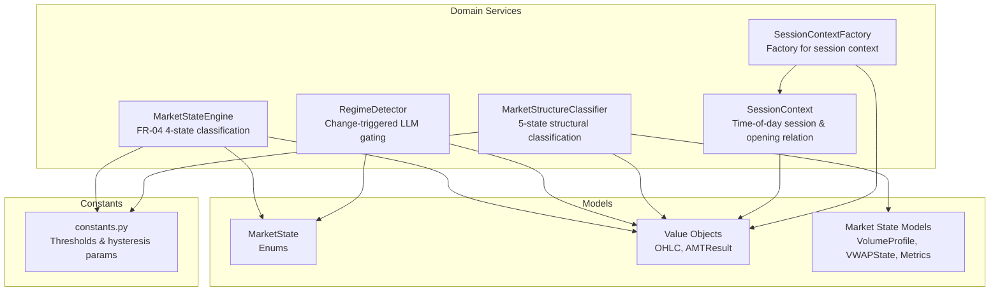
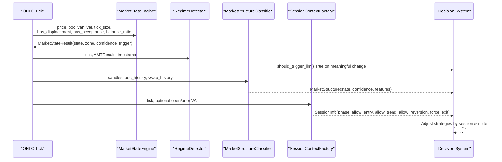
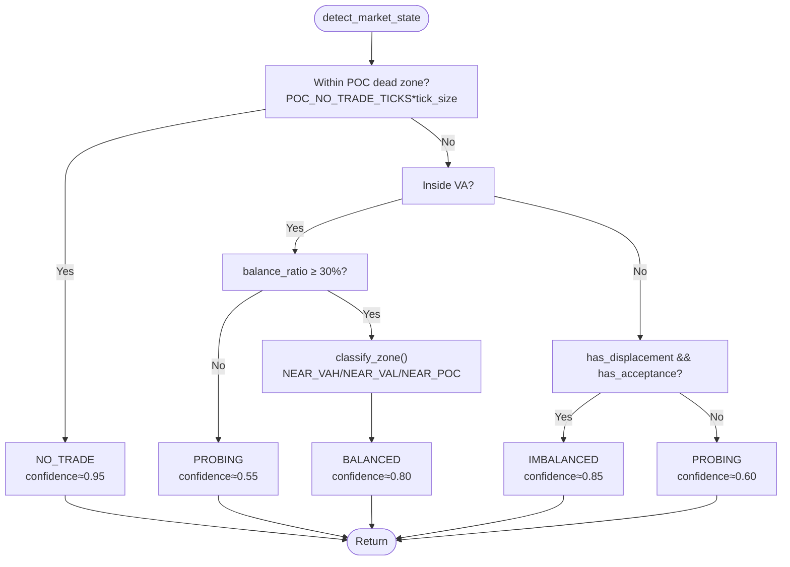
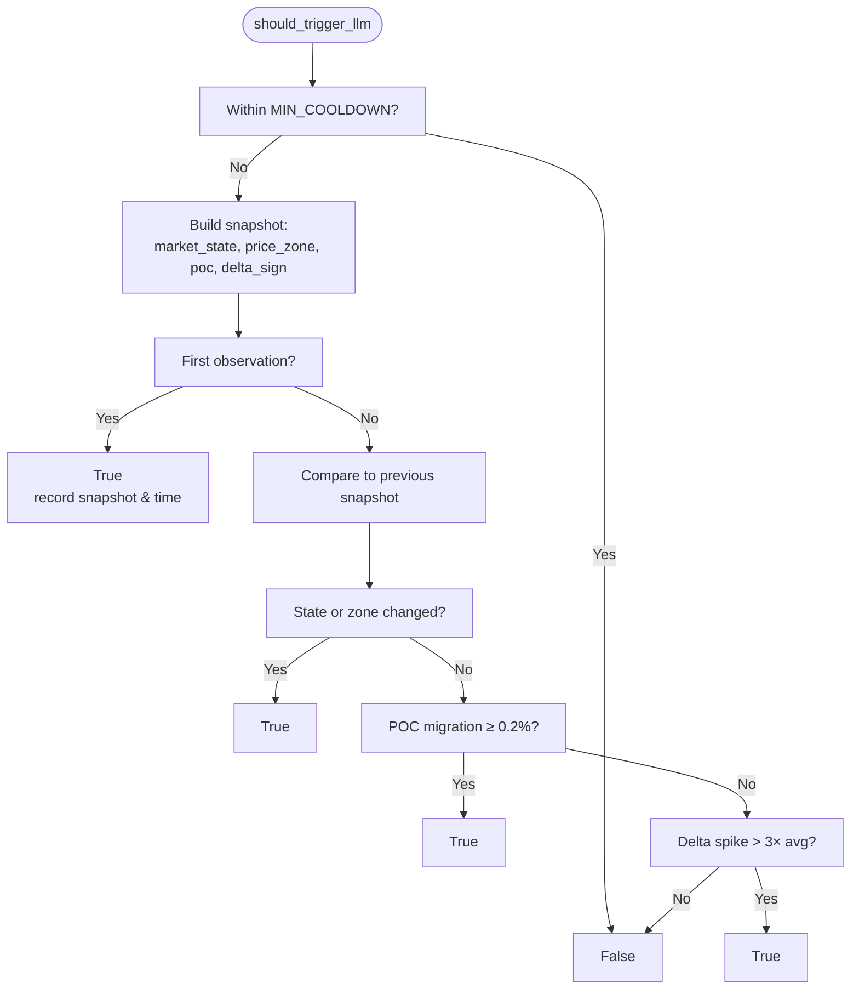
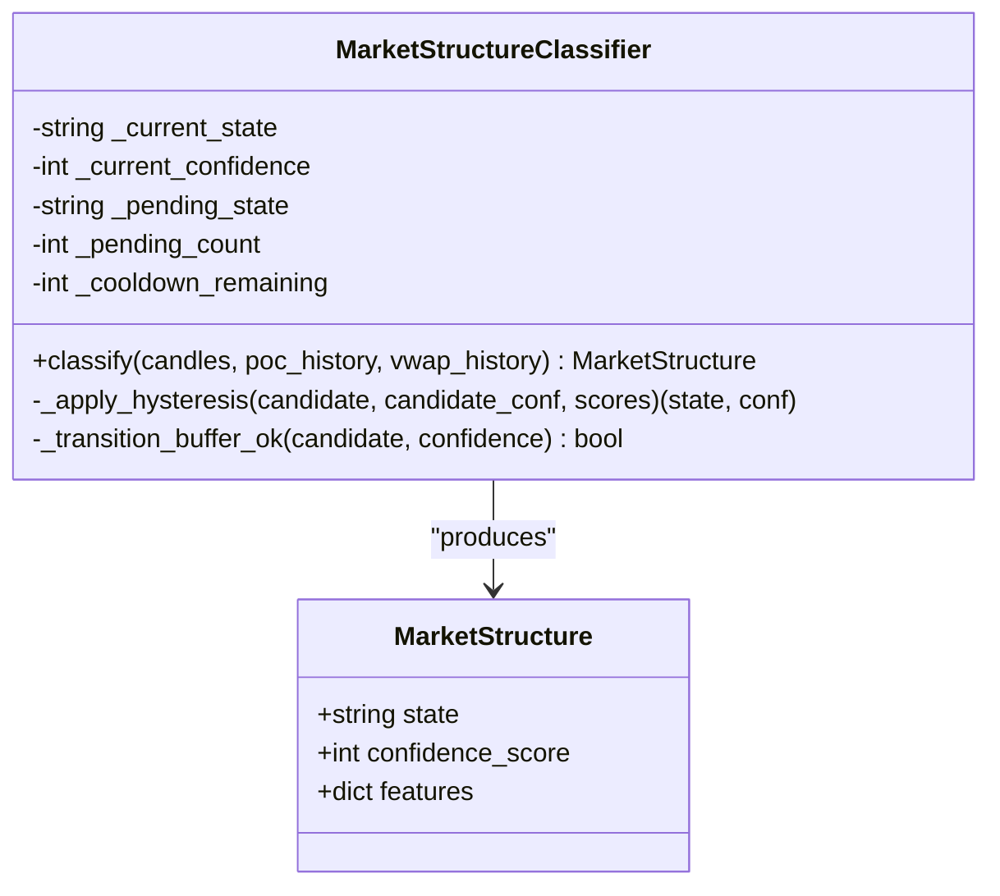
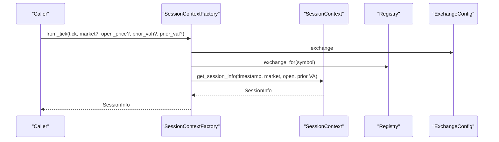
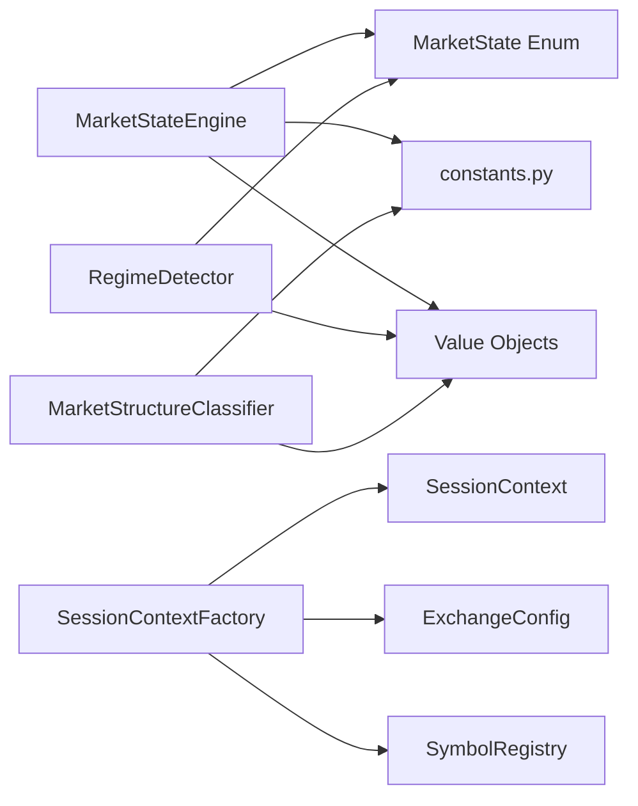

# Market State Classification

<cite>
**Referenced Files in This Document**
- [market_state_engine.py](file://backend/app/domain/fabio_ai/services/market_state_engine.py)
- [regime_detector.py](file://backend/app/domain/fabio_ai/services/regime_detector.py)
- [market_structure_classifier.py](file://backend/app/domain/fabio_ai/services/market_structure_classifier.py)
- [session_context.py](file://backend/app/domain/fabio_ai/services/session_context.py)
- [session_context_factory.py](file://backend/app/domain/fabio_ai/services/session_context_factory.py)
- [market_state.py](file://backend/app/domain/models/market_state.py)
- [constants.py](file://backend/app/domain/constants.py)
- [enums.py](file://backend/app/domain/trading/models/enums.py)
- [value_objects.py](file://backend/app/domain/trading/models/value_objects.py)
- [test_market_state_engine.py](file://backend/tests/unit/domain/test_market_state_engine.py)
- [test_regime_detector.py](file://backend/tests/unit/domain/test_regime_detector.py)
- [test_market_structure_classifier.py](file://backend/tests/unit/domain/test_market_structure_classifier.py)
- [test_session_context.py](file://backend/tests/unit/domain/test_session_context.py)
</cite>

## Table of Contents
1. [Introduction](#introduction)
2. [Project Structure](#project-structure)
3. [Core Components](#core-components)
4. [Architecture Overview](#architecture-overview)
5. [Detailed Component Analysis](#detailed-component-analysis)
6. [Dependency Analysis](#dependency-analysis)
7. [Performance Considerations](#performance-considerations)
8. [Troubleshooting Guide](#troubleshooting-guide)
9. [Conclusion](#conclusion)
10. [Appendices](#appendices)

## Introduction
This document describes the market state classification system that powers real-time detection and categorization of market conditions. It covers:
- MarketStateEngine: 4-state classification (NO_TRADE, BALANCED, IMBALANCED, PROBING) with zone sub-classification and transition logging.
- RegimeDetector: intelligent triggering of higher-level analysis on meaningful regime changes (state transitions, VA boundary crossings, POC migration, delta spikes).
- MarketStructureClassifier: 5-state structural classification (BALANCE, IMBALANCE, TRANSITION, EXPANSION, CHOP) with hysteresis to reduce noise.
- SessionContext and SessionContextFactory: session-aware context management for NSE/MCX and global markets, including opening relations and time-based anchors.
It also documents thresholds, algorithms, state transitions, integration points, performance optimizations, persistence considerations, and practical examples of state detection workflows and their impact on trading strategies.

## Project Structure
The classification system spans domain services, models, and constants:
- Domain services implement the classification logic and session-aware utilities.
- Models define typed domain objects and enums for market states and value objects.
- Constants centralize tunable thresholds and configuration parameters.

**Diagram sources**
- [market_state_engine.py:1-193](file://backend/app/domain/fabio_ai/services/market_state_engine.py#L1-L193)
- [regime_detector.py:1-507](file://backend/app/domain/fabio_ai/services/regime_detector.py#L1-L507)
- [market_structure_classifier.py:1-424](file://backend/app/domain/fabio_ai/services/market_structure_classifier.py#L1-L424)
- [session_context.py:1-535](file://backend/app/domain/fabio_ai/services/session_context.py#L1-L535)
- [session_context_factory.py:1-94](file://backend/app/domain/fabio_ai/services/session_context_factory.py#L1-L94)
- [enums.py:137-160](file://backend/app/domain/trading/models/enums.py#L137-L160)
- [value_objects.py:18-194](file://backend/app/domain/trading/models/value_objects.py#L18-L194)
- [market_state.py:20-173](file://backend/app/domain/models/market_state.py#L20-L173)
- [constants.py:70-99](file://backend/app/domain/constants.py#L70-L99)

**Section sources**
- [market_state_engine.py:1-193](file://backend/app/domain/fabio_ai/services/market_state_engine.py#L1-L193)
- [regime_detector.py:1-507](file://backend/app/domain/fabio_ai/services/regime_detector.py#L1-L507)
- [market_structure_classifier.py:1-424](file://backend/app/domain/fabio_ai/services/market_structure_classifier.py#L1-L424)
- [session_context.py:1-535](file://backend/app/domain/fabio_ai/services/session_context.py#L1-L535)
- [session_context_factory.py:1-94](file://backend/app/domain/fabio_ai/services/session_context_factory.py#L1-L94)
- [enums.py:137-160](file://backend/app/domain/trading/models/enums.py#L137-L160)
- [value_objects.py:18-194](file://backend/app/domain/trading/models/value_objects.py#L18-L194)
- [market_state.py:20-173](file://backend/app/domain/models/market_state.py#L20-L173)
- [constants.py:70-99](file://backend/app/domain/constants.py#L70-L99)

## Core Components
- MarketStateEngine: Implements FR-04 4-state classification with explicit priority and zone sub-classification. Uses tick size, POC proximity, VA boundaries, displacement/acceptance flags, and balance ratio to decide state and confidence.
- RegimeDetector: Triggers LLM analysis only on meaningful changes—state transitions, VA boundary crossings, POC migration, and delta divergence spikes—while enforcing a minimum cooldown.
- MarketStructureClassifier: Computes microstructure features (range/ATR ratio, VWAP slope, candle overlap, volume acceleration, POC migration) and applies hysteresis to produce a 5-state classification with confidence.
- SessionContext and SessionContextFactory: Provide session-aware context (time-of-day phases, opening relation, anchors, and bias) for NSE/MCX and global markets, enabling strategy alignment with session dynamics.

**Section sources**
- [market_state_engine.py:45-156](file://backend/app/domain/fabio_ai/services/market_state_engine.py#L45-L156)
- [regime_detector.py:113-176](file://backend/app/domain/fabio_ai/services/regime_detector.py#L113-L176)
- [market_structure_classifier.py:281-409](file://backend/app/domain/fabio_ai/services/market_structure_classifier.py#L281-L409)
- [session_context.py:230-327](file://backend/app/domain/fabio_ai/services/session_context.py#L230-L327)
- [session_context_factory.py:55-94](file://backend/app/domain/fabio_ai/services/session_context_factory.py#L55-L94)

## Architecture Overview
The classification system integrates tightly with trading decision services:
- MarketStateEngine feeds AMTResult with market_state, balance_ratio, and displacement/acceptance flags.
- RegimeDetector monitors MarketState changes and AMTResult to gate LLM analysis.
- MarketStructureClassifier consumes OHLC, POC/VWAP histories to inform structural bias.
- SessionContextFactory supplies session context to align strategies with market phases and anchors.

**Diagram sources**
- [market_state_engine.py:45-156](file://backend/app/domain/fabio_ai/services/market_state_engine.py#L45-L156)
- [regime_detector.py:113-176](file://backend/app/domain/fabio_ai/services/regime_detector.py#L113-L176)
- [market_structure_classifier.py:281-409](file://backend/app/domain/fabio_ai/services/market_structure_classifier.py#L281-L409)
- [session_context_factory.py:55-94](file://backend/app/domain/fabio_ai/services/session_context_factory.py#L55-L94)
- [value_objects.py:104-194](file://backend/app/domain/trading/models/value_objects.py#L104-L194)

## Detailed Component Analysis

### MarketStateEngine
- Purpose: Real-time 4-state classification aligned with FR-04.
- Inputs: price, POC, VAH, VAL, tick_size, has_displacement, has_acceptance, balance_ratio.
- Priority logic:
  1) NO_TRADE: price within POC_NO_TRADE_TICKS × tick_size of POC.
  2) PROBING: price outside VA without displacement.
  3) IMBALANCED: price outside VA with displacement and acceptance.
  4) BALANCED: price inside VA with meaningful balance_ratio (>30%).
- Zone sub-classification within BALANCED: NEAR_VAH, NEAR_VAL, NEAR_POC.
- Edge sensitivity: preemptive PROBING when price near VA edge and displacement is present.
- Outputs: MarketStateResult with state, zone, confidence, trigger, and flags.

**Diagram sources**
- [market_state_engine.py:45-156](file://backend/app/domain/fabio_ai/services/market_state_engine.py#L45-L156)
- [constants.py:72-75](file://backend/app/domain/constants.py#L72-L75)

**Section sources**
- [market_state_engine.py:45-156](file://backend/app/domain/fabio_ai/services/market_state_engine.py#L45-L156)
- [enums.py:137-149](file://backend/app/domain/trading/models/enums.py#L137-L149)
- [test_market_state_engine.py:15-147](file://backend/tests/unit/domain/test_market_state_engine.py#L15-L147)

### RegimeDetector
- Purpose: Gate LLM analysis to meaningful regime changes, reducing unnecessary inference calls.
- Triggers:
  - Market state transition (BALANCED ↔ IMBALANCED).
  - VA boundary zone change (e.g., INSIDE_VA → ABOVE_VAH).
  - POC migration exceeding POC_MIGRATION_THRESHOLD (0.2%).
  - Delta divergence spike: current delta > average_delta × DELTA_SPIKE_MULTIPLIER (3.0).
- Additional capabilities:
  - Contraction detection (Fabio Rule 8): detects compression after expansion using a ratio threshold.
  - Failed auction re-entry blocking (Fabio Rule 11): blocks re-entry at same level/direction after stop-outs, with circuit breaker after consecutive losses.
  - Squeeze detection: trapped participants’ forced exit as entry catalyst.
  - Follow-through analysis: continuation/reversal/consolidation after a break.
- Controls: minimum cooldown between triggers, buffers for re-entry, and optional ATR-based tolerance.

**Diagram sources**
- [regime_detector.py:113-176](file://backend/app/domain/fabio_ai/services/regime_detector.py#L113-L176)
- [regime_detector.py:22-23](file://backend/app/domain/fabio_ai/services/regime_detector.py#L22-L23)
- [regime_detector.py:84-87](file://backend/app/domain/fabio_ai/services/regime_detector.py#L84-L87)

**Section sources**
- [regime_detector.py:74-176](file://backend/app/domain/fabio_ai/services/regime_detector.py#L74-L176)
- [regime_detector.py:182-222](file://backend/app/domain/fabio_ai/services/regime_detector.py#L182-L222)
- [regime_detector.py:228-339](file://backend/app/domain/fabio_ai/services/regime_detector.py#L228-L339)
- [regime_detector.py:392-428](file://backend/app/domain/fabio_ai/services/regime_detector.py#L392-L428)
- [regime_detector.py:434-479](file://backend/app/domain/fabio_ai/services/regime_detector.py#L434-L479)
- [test_regime_detector.py:26-83](file://backend/tests/unit/domain/test_regime_detector.py#L26-L83)

### MarketStructureClassifier
- Purpose: Structural classification using microstructure features with hysteresis to avoid frequent flips.
- Features:
  - range_atr_ratio: (high-low)/ATR over a period.
  - vwap_slope: normalized linear regression slope of VWAP.
  - candle_overlap_pct: overlap between consecutive candles.
  - vol_accel: EMA(volume,5)/EMA(volume,20).
  - poc_migration: normalized absolute slope of POC.
- Scoring: Separate scorers for BALANCE, IMBALANCE, TRANSITION, EXPANSION, CHOP; each feature contributes up to 20 points.
- Hysteresis:
  - Dwell time: new state must persist for STRUCTURE_DWELL_TICKS consecutive ticks.
  - Confidence gate: candidate must meet STRUCTURE_CONFIDENCE_GATE.
  - Transition buffer: BALANCE ↔ IMBALANCE must pass through TRANSITION unless confidence exceeds STRUCTURE_BYPASS_CONFIDENCE.
  - Cooldown: hold for STRUCTURE_COOLDOWN_TICKS after a state change.

**Diagram sources**
- [market_structure_classifier.py:261-424](file://backend/app/domain/fabio_ai/services/market_structure_classifier.py#L261-L424)

**Section sources**
- [market_structure_classifier.py:281-409](file://backend/app/domain/fabio_ai/services/market_structure_classifier.py#L281-L409)
- [constants.py:95-98](file://backend/app/domain/constants.py#L95-L98)
- [test_market_structure_classifier.py:32-184](file://backend/tests/unit/domain/test_market_structure_classifier.py#L32-L184)

### SessionContext and SessionContextFactory
- SessionContext:
  - Provides session info for NSE (5-phase), MCX (multi-subsession), and global/crypto markets.
  - Encodes opening relation (IN_BALANCE, OUT_ABOVE, OUT_BELOW) and inventory bias.
  - Offers anchors (IB windows, VWAP resets) and helpers (expiry day checks, seconds to close).
- SessionContextFactory:
  - Centralized factory that resolves market from configuration and symbol registry.
  - Normalizes market identifiers (e.g., NFO/BSE → NSE).
  - Produces SessionInfo from tick data and optional prior-day VA values.

**Diagram sources**
- [session_context_factory.py:55-94](file://backend/app/domain/fabio_ai/services/session_context_factory.py#L55-L94)
- [session_context.py:230-327](file://backend/app/domain/fabio_ai/services/session_context.py#L230-L327)

**Section sources**
- [session_context.py:230-327](file://backend/app/domain/fabio_ai/services/session_context.py#L230-L327)
- [session_context.py:358-406](file://backend/app/domain/fabio_ai/services/session_context.py#L358-L406)
- [session_context_factory.py:30-94](file://backend/app/domain/fabio_ai/services/session_context_factory.py#L30-L94)
- [test_session_context.py:15-67](file://backend/tests/unit/domain/test_session_context.py#L15-L67)

## Dependency Analysis
- MarketStateEngine depends on:
  - Enums for MarketState.
  - Constants for POC_NO_TRADE_TICKS, BALANCE_RATIO_THRESHOLD, DISPLACEMENT_MULTIPLIER.
  - Value objects for OHLC/AMTResult inputs.
- RegimeDetector depends on:
  - Value objects for OHLC/AMTResult.
  - Constants for MIN_COOLDOWN and spike thresholds.
- MarketStructureClassifier depends on:
  - Constants for hysteresis parameters.
  - MLX-accelerated helpers for statistical computations.
- SessionContextFactory depends on:
  - ExchangeConfig and SymbolRegistry for market resolution.

**Diagram sources**
- [market_state_engine.py:22-27](file://backend/app/domain/fabio_ai/services/market_state_engine.py#L22-L27)
- [constants.py:72-75](file://backend/app/domain/constants.py#L72-L75)
- [enums.py:137-149](file://backend/app/domain/trading/models/enums.py#L137-L149)
- [value_objects.py:18-194](file://backend/app/domain/trading/models/value_objects.py#L18-L194)
- [market_structure_classifier.py:19-24](file://backend/app/domain/fabio_ai/services/market_structure_classifier.py#L19-L24)
- [session_context_factory.py:20-22](file://backend/app/domain/fabio_ai/services/session_context_factory.py#L20-L22)

**Section sources**
- [market_state_engine.py:22-27](file://backend/app/domain/fabio_ai/services/market_state_engine.py#L22-L27)
- [regime_detector.py:18-20](file://backend/app/domain/fabio_ai/services/regime_detector.py#L18-L20)
- [market_structure_classifier.py:19-24](file://backend/app/domain/fabio_ai/services/market_structure_classifier.py#L19-L24)
- [session_context_factory.py:20-22](file://backend/app/domain/fabio_ai/services/session_context_factory.py#L20-L22)

## Performance Considerations
- MarketStateEngine:
  - Constant-time logic with minimal allocations; uses cached constants and simple arithmetic.
- RegimeDetector:
  - Maintains sliding windows (deque) for delta history; enforces cooldown to limit LLM calls.
  - Uses cached snapshots to compare state efficiently.
- MarketStructureClassifier:
  - Leverages MLX-accelerated helpers for statistical computations (slope, EMA, ATR, overlap).
  - Applies hysteresis to avoid frequent emissions, reducing downstream processing overhead.
- SessionContext:
  - Uses LRU caches for phase lookups and opening relation to minimize repeated computations.
  - Converts timestamps to IST/UTC efficiently and caches results.

[No sources needed since this section provides general guidance]

## Troubleshooting Guide
- MarketStateEngine
  - Symptoms: Unexpected NO_TRADE classification near POC.
  - Causes: POC_NO_TRADE_TICKS too large or tick_size misconfigured.
  - Checks: Verify constants and ensure price is within tick_size × POC_NO_TRADE_TICKS of POC.
  - Tests: See [test_market_state_engine.py:15-55](file://backend/tests/unit/domain/test_market_state_engine.py#L15-L55).
- RegimeDetector
  - Symptoms: LLM not triggered despite state changes.
  - Causes: Within MIN_COOLDOWN or insufficient change criteria.
  - Checks: Confirm cooldown elapsed and at least one trigger condition met.
  - Tests: See [test_regime_detector.py:26-83](file://backend/tests/unit/domain/test_regime_detector.py#L26-L83).
- MarketStructureClassifier
  - Symptoms: Frequent state flips or delayed transitions.
  - Causes: Hysteresis parameters too strict or too lenient.
  - Checks: Tune STRUCTURE_DWELL_TICKS, CONFIDENCE_GATE, BYPASS_CONFIDENCE, COOLDOWN_TICKS.
  - Tests: See [test_market_structure_classifier.py:152-184](file://backend/tests/unit/domain/test_market_structure_classifier.py#L152-L184).
- SessionContext
  - Symptoms: Incorrect session phase or anchors.
  - Causes: Wrong market identifier or timestamp parsing issues.
  - Checks: Normalize market via factory and ensure timestamp is valid ISO/epoch.
  - Tests: See [test_session_context.py:15-67](file://backend/tests/unit/domain/test_session_context.py#L15-L67).

**Section sources**
- [test_market_state_engine.py:15-55](file://backend/tests/unit/domain/test_market_state_engine.py#L15-L55)
- [test_regime_detector.py:26-83](file://backend/tests/unit/domain/test_regime_detector.py#L26-L83)
- [test_market_structure_classifier.py:152-184](file://backend/tests/unit/domain/test_market_structure_classifier.py#L152-L184)
- [test_session_context.py:15-67](file://backend/tests/unit/domain/test_session_context.py#L15-L67)

## Conclusion
The market state classification system combines precise, rule-based detection (MarketStateEngine), intelligent change-triggered analysis (RegimeDetector), robust structural classification (MarketStructureClassifier), and session-aware context (SessionContext/Factory) to support dynamic trading strategies. Tunable thresholds and hysteresis parameters enable reliable operation under real-time constraints, while performance optimizations ensure low-latency processing. Integration with decision systems is straightforward: use MarketStateEngine for immediate state, RegimeDetector to gate higher-level analysis, MarketStructureClassifier for structural bias, and SessionContext/Factory for session alignment.

[No sources needed since this section summarizes without analyzing specific files]

## Appendices

### Thresholds and Parameters
- Market State (FR-04):
  - POC_NO_TRADE_TICKS: controls dead-zone width around POC.
  - BALANCE_RATIO_THRESHOLD: minimum balance ratio to consider BALANCED.
  - DISPLACEMENT_MULTIPLIER: used in displacement logic.
- Structure Hysteresis:
  - STRUCTURE_DWELL_TICKS: dwell time for state acceptance.
  - STRUCTURE_COOLDOWN_TICKS: cooldown after state change.
  - STRUCTURE_CONFIDENCE_GATE: minimum confidence to accept a new state.
  - STRUCTURE_BYPASS_CONFIDENCE: bypass transition buffer when confidence is high.
- RegimeDetector:
  - MIN_COOLDOWN: minimum seconds between LLM triggers.
  - POC_MIGRATION_THRESHOLD: relative POC shift threshold.
  - DELTA_SPIKE_MULTIPLIER: multiplier for delta divergence spike detection.

**Section sources**
- [constants.py:72-75](file://backend/app/domain/constants.py#L72-L75)
- [constants.py:95-98](file://backend/app/domain/constants.py#L95-L98)
- [regime_detector.py:22-23](file://backend/app/domain/fabio_ai/services/regime_detector.py#L22-L23)
- [regime_detector.py:84-87](file://backend/app/domain/fabio_ai/services/regime_detector.py#L84-L87)

### Example Workflows and Strategy Impact
- Trending entry (IMBALANCED):
  - Detect IMBALANCED via MarketStateEngine with displacement and acceptance.
  - RegimeDetector confirms meaningful change and triggers LLM analysis.
  - MarketStructureClassifier supports trending bias; SessionContextFactory ensures trend models are active.
  - Strategy: Enter with trend filters and tighten stops on squeeze signals.
- Mean-reversion setup (BALANCED):
  - Detect BALANCED with high balance_ratio and NEAR_VAH/NEAR_VAL zone.
  - RegimeDetector avoids unnecessary LLM calls; MarketStructureClassifier may show CHOP or TRANSITION.
  - Strategy: Place reversion orders near POC or at edges with session-aware constraints.
- Probable break (PROBING):
  - Detect PROBING near VA edge with displacement; wait for acceptance confirmation.
  - RegimeDetector may trigger on POC migration or delta spike.
  - Strategy: Await follow-through analysis; enter on confirmation with session-aware sizing.

[No sources needed since this section provides general guidance]