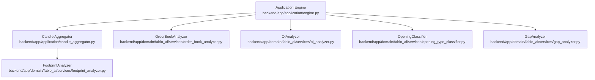
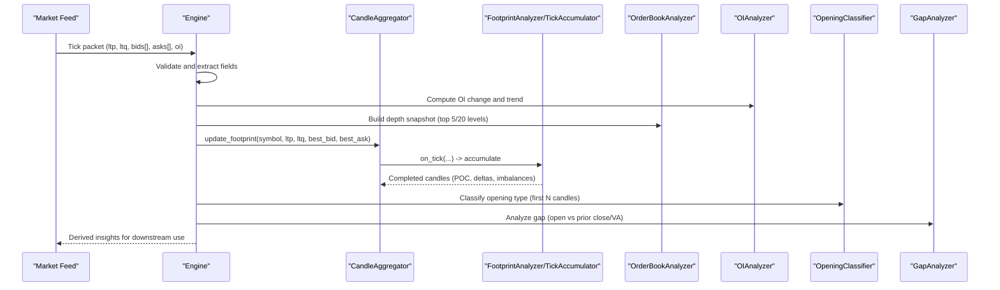
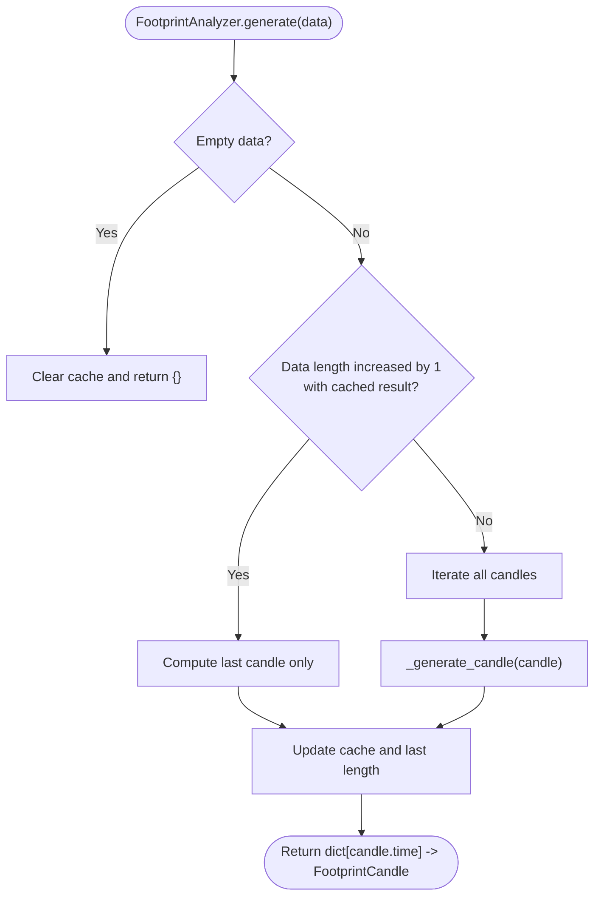
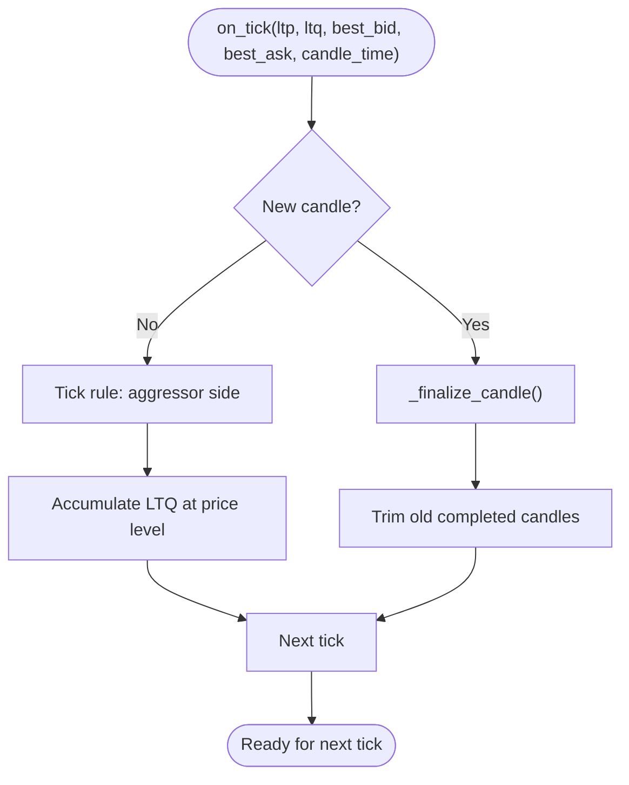
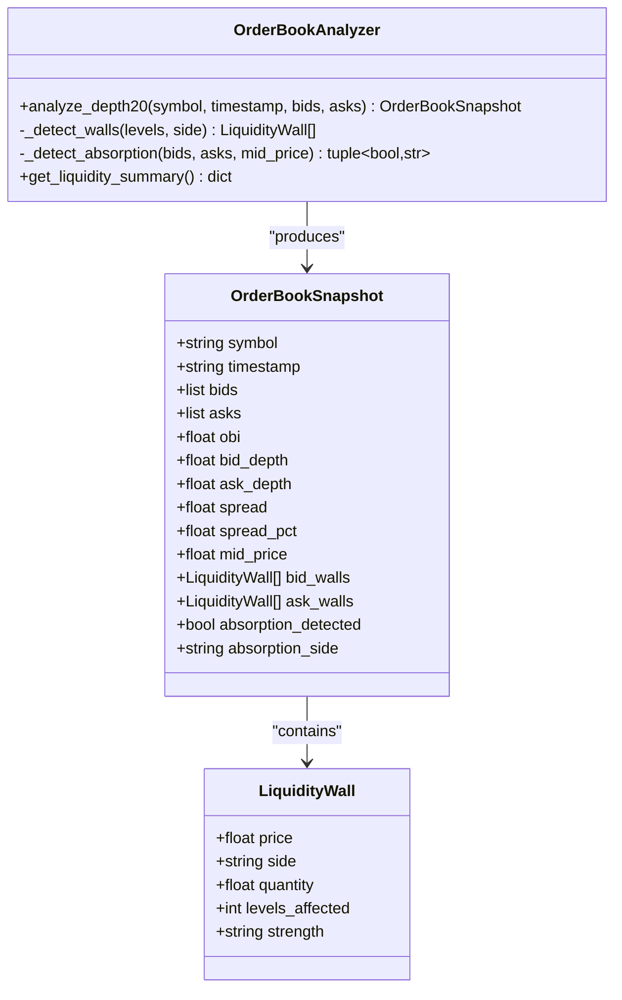
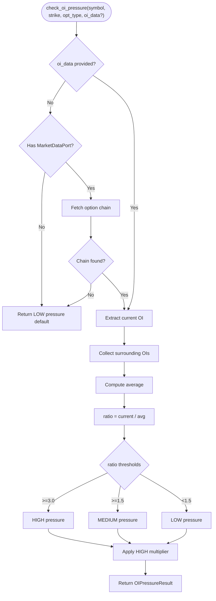
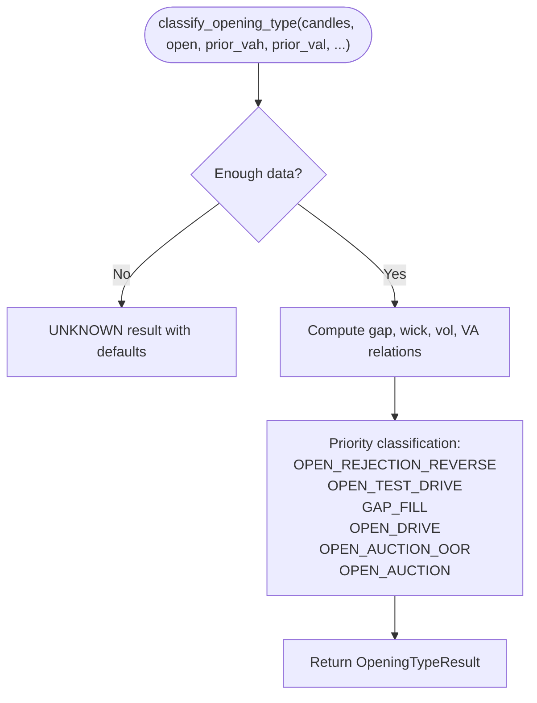
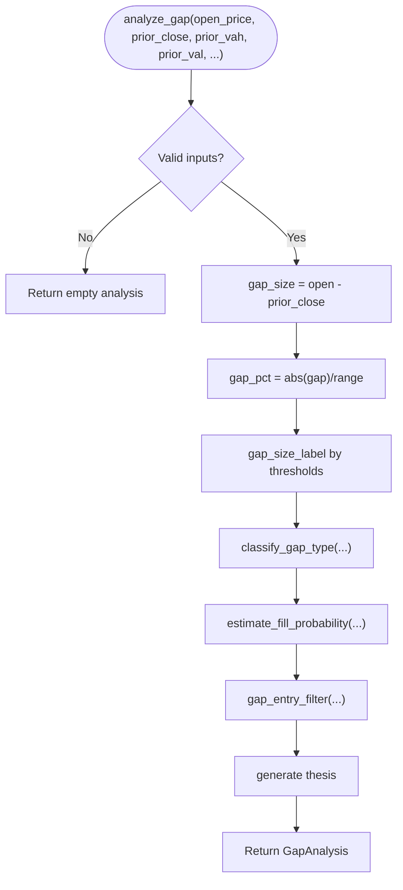
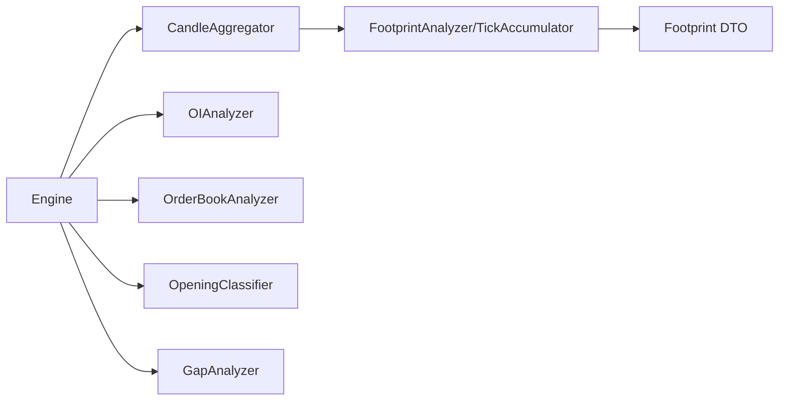

# Order Flow Analysis

<cite>
**Referenced Files in This Document**
- [footprint_analyzer.py](file://backend/app/domain/fabio_ai/services/footprint_analyzer.py)
- [order_book_analyzer.py](file://backend/app/domain/fabio_ai/services/order_book_analyzer.py)
- [oi_analyzer.py](file://backend/app/domain/fabio_ai/services/oi_analyzer.py)
- [opening_type_classifier.py](file://backend/app/domain/fabio_ai/services/opening_type_classifier.py)
- [gap_analyzer.py](file://backend/app/domain/fabio_ai/services/gap_analyzer.py)
- [engine.py](file://backend/app/application/engine.py)
- [candle_aggregator.py](file://backend/app/application/candle_aggregator.py)
- [test_footprint_analyzer.py](file://backend/tests/unit/domain/test_footprint_analyzer.py)
- [test_gap_analyzer.py](file://backend/tests/unit/domain/test_gap_analyzer.py)
</cite>

## Table of Contents
1. [Introduction](#introduction)
2. [Project Structure](#project-structure)
3. [Core Components](#core-components)
4. [Architecture Overview](#architecture-overview)
5. [Detailed Component Analysis](#detailed-component-analysis)
6. [Dependency Analysis](#dependency-analysis)
7. [Performance Considerations](#performance-considerations)
8. [Troubleshooting Guide](#troubleshooting-guide)
9. [Conclusion](#conclusion)

## Introduction
This document explains the order flow analysis subsystem that powers high-quality intraday insights from tick and depth data. It covers:
- FootprintAnalyzer: constructs order flow footprints from OHLC and delta, modeling price-level distributions with Gaussian kernels and computing POI and imbalances.
- OrderBookAnalyzer: processes depth20 snapshots to detect liquidity walls, absorption, and order book imbalance.
- OIAnalyzer: evaluates Open Interest pressure at option strikes to inform confidence adjustments.
- OpeningClassifier: classifies the opening session dynamics into six types with setup permissions and gate overrides.
- GapAnalyzer: detects and analyzes price gaps at session open with fill probability and entry filters.

These components integrate with the broader market analysis pipeline via the application engine and candle aggregator, enabling incremental updates and efficient high-frequency processing.

## Project Structure
The order flow analysis lives in the Fabio AI domain services and is orchestrated by the application engine and candle aggregator. Unit tests validate behavior and edge cases.

**Diagram sources**
- [engine.py:384-747](file://backend/app/application/engine.py#L384-L747)
- [candle_aggregator.py:258-306](file://backend/app/application/candle_aggregator.py#L258-L306)
- [footprint_analyzer.py:17-123](file://backend/app/domain/fabio_ai/services/footprint_analyzer.py#L17-L123)
- [order_book_analyzer.py:59-141](file://backend/app/domain/fabio_ai/services/order_book_analyzer.py#L59-L141)
- [oi_analyzer.py:58-140](file://backend/app/domain/fabio_ai/services/oi_analyzer.py#L58-L140)
- [opening_type_classifier.py:42-179](file://backend/app/domain/fabio_ai/services/opening_type_classifier.py#L42-L179)
- [gap_analyzer.py:38-122](file://backend/app/domain/fabio_ai/services/gap_analyzer.py#L38-L122)

**Section sources**
- [engine.py:384-747](file://backend/app/application/engine.py#L384-L747)
- [candle_aggregator.py:258-306](file://backend/app/application/candle_aggregator.py#L258-L306)

## Core Components
- FootprintAnalyzer: Generates footprint candles from OHLC and delta using Gaussian kernel density around VWAP, with incremental caching for performance.
- TickFootprintAccumulator: Builds real-time footprints from tick streams using tick rule classification and diagonal imbalance detection.
- OrderBookAnalyzer: Computes OB metrics (OBI, spread, depth), detects liquidity walls, and identifies absorption signals from depth snapshots.
- OIAnalyzer: Compares current OI at a strike to surrounding strikes and returns pressure classification and confidence multipliers.
- OpeningClassifier: Classifies opening session type and provides setup permissions and gate overrides.
- GapAnalyzer: Analyzes session open gaps with structural context and returns fill probability and entry filter.

**Section sources**
- [footprint_analyzer.py:17-123](file://backend/app/domain/fabio_ai/services/footprint_analyzer.py#L17-L123)
- [footprint_analyzer.py:126-265](file://backend/app/domain/fabio_ai/services/footprint_analyzer.py#L126-L265)
- [order_book_analyzer.py:59-141](file://backend/app/domain/fabio_ai/services/order_book_analyzer.py#L59-L141)
- [oi_analyzer.py:58-140](file://backend/app/domain/fabio_ai/services/oi_analyzer.py#L58-L140)
- [opening_type_classifier.py:42-179](file://backend/app/domain/fabio_ai/services/opening_type_classifier.py#L42-L179)
- [gap_analyzer.py:38-122](file://backend/app/domain/fabio_ai/services/gap_analyzer.py#L38-L122)

## Architecture Overview
The system integrates tick and depth feeds into derived order flow features. The engine validates incoming packets, extracts OI and depth, and triggers footprint accumulation. The candle aggregator exposes footprint retrieval and incremental updates. Domain services encapsulate pure logic for footprint construction, depth analysis, OI pressure, opening classification, and gap analysis.

**Diagram sources**
- [engine.py:384-747](file://backend/app/application/engine.py#L384-L747)
- [candle_aggregator.py:258-306](file://backend/app/application/candle_aggregator.py#L258-L306)
- [footprint_analyzer.py:126-265](file://backend/app/domain/fabio_ai/services/footprint_analyzer.py#L126-L265)
- [order_book_analyzer.py:74-141](file://backend/app/domain/fabio_ai/services/order_book_analyzer.py#L74-L141)
- [oi_analyzer.py:68-140](file://backend/app/domain/fabio_ai/services/oi_analyzer.py#L68-L140)
- [opening_type_classifier.py:42-179](file://backend/app/domain/fabio_ai/services/opening_type_classifier.py#L42-L179)
- [gap_analyzer.py:38-122](file://backend/app/domain/fabio_ai/services/gap_analyzer.py#L38-L122)

## Detailed Component Analysis

### FootprintAnalyzer
FootprintAnalyzer builds footprint candles from OHLC and delta:
- Gaussian kernel density centered at VWAP normalizes volume allocation across price bins.
- Step sizing balances resolution with volume per bin to avoid truncation.
- Imbalance detection flags levels where ask/bid diverge by a factor threshold.
- Incremental mode caches prior results and recomputes only the newest candle when data grows by one.

**Diagram sources**
- [footprint_analyzer.py:101-123](file://backend/app/domain/fabio_ai/services/footprint_analyzer.py#L101-L123)
- [footprint_analyzer.py:24-99](file://backend/app/domain/fabio_ai/services/footprint_analyzer.py#L24-L99)

Key algorithms:
- Gaussian weighting and volume allocation per price bin.
- Imbalance detection using ask vs bid thresholds.
- POC selection as the price with maximum total volume.

Validation references:
- [test_footprint_analyzer.py:9-61](file://backend/tests/unit/domain/test_footprint_analyzer.py#L9-L61)

**Section sources**
- [footprint_analyzer.py:17-123](file://backend/app/domain/fabio_ai/services/footprint_analyzer.py#L17-L123)
- [test_footprint_analyzer.py:9-61](file://backend/tests/unit/domain/test_footprint_analyzer.py#L9-L61)

### TickFootprintAccumulator
TickFootprintAccumulator processes real-time ticks:
- Tick rule determines aggressor side using trade price vs best bid/ask and mid-price.
- Accumulates LTQ into price bins and finalizes on candle boundary.
- Diagonal imbalance detection compares current level to neighbors; stacked flags mark persistent imbalances.
- Provides get_all() returning completed and in-progress candles.

**Diagram sources**
- [footprint_analyzer.py:141-182](file://backend/app/domain/fabio_ai/services/footprint_analyzer.py#L141-L182)
- [footprint_analyzer.py:184-265](file://backend/app/domain/fabio_ai/services/footprint_analyzer.py#L184-L265)

Additional utilities:
- detect_absorption: identifies absorption when strong aggression meets minimal price change.
- detect_contested_zone: flags when both buy and sell stacked imbalances appear in recent candles.

**Section sources**
- [footprint_analyzer.py:126-265](file://backend/app/domain/fabio_ai/services/footprint_analyzer.py#L126-L265)

### OrderBookAnalyzer
OrderBookAnalyzer transforms depth snapshots into actionable insights:
- Computes OB metrics: OBI, spread, spread_pct, mid price, top-5 bid/ask depths.
- Detects liquidity walls by comparing level volumes to averages.
- Identifies absorption by comparing recent vs current depth profiles.
- Maintains history for temporal comparisons and provides a concise liquidity summary.

**Diagram sources**
- [order_book_analyzer.py:59-141](file://backend/app/domain/fabio_ai/services/order_book_analyzer.py#L59-L141)
- [order_book_analyzer.py:24-57](file://backend/app/domain/fabio_ai/services/order_book_analyzer.py#L24-L57)

**Section sources**
- [order_book_analyzer.py:59-141](file://backend/app/domain/fabio_ai/services/order_book_analyzer.py#L59-L141)

### OIAnalyzer
OIAnalyzer evaluates OI pressure at option strikes:
- Compares current OI to surrounding strikes (±200, ±100) and classifies pressure as HIGH/MEDIUM/LOW.
- Applies confidence multipliers to reduce base confidence when pressure is high/medium.
- Provides a default result when market data is unavailable.

**Diagram sources**
- [oi_analyzer.py:68-140](file://backend/app/domain/fabio_ai/services/oi_analyzer.py#L68-L140)

**Section sources**
- [oi_analyzer.py:58-140](file://backend/app/domain/fabio_ai/services/oi_analyzer.py#L58-L140)

### OpeningClassifier
OpeningClassifier determines the opening session type from early candles:
- Uses structural context: prior VA, gap size/pct, first candle wick ratio, volume expansion, and whether the session filled a gap.
- Returns a typed result with confidence, direction, allowed/blocked setups, and gate overrides.

**Diagram sources**
- [opening_type_classifier.py:42-179](file://backend/app/domain/fabio_ai/services/opening_type_classifier.py#L42-L179)
- [opening_type_classifier.py:182-345](file://backend/app/domain/fabio_ai/services/opening_type_classifier.py#L182-L345)

**Section sources**
- [opening_type_classifier.py:42-179](file://backend/app/domain/fabio_ai/services/opening_type_classifier.py#L42-L179)

### GapAnalyzer
GapAnalyzer evaluates session open gaps with structural context:
- Computes gap size and percent of prior range; labels gap size; classifies gap type (inside IB/VA, outside VA, extreme).
- Estimates fill probability and recommends entry filters; generates a human-readable thesis.

**Diagram sources**
- [gap_analyzer.py:38-122](file://backend/app/domain/fabio_ai/services/gap_analyzer.py#L38-L122)
- [gap_analyzer.py:125-282](file://backend/app/domain/fabio_ai/services/gap_analyzer.py#L125-L282)

Validation references:
- [test_gap_analyzer.py:1-169](file://backend/tests/unit/domain/test_gap_analyzer.py#L1-L169)

**Section sources**
- [gap_analyzer.py:38-122](file://backend/app/domain/fabio_ai/services/gap_analyzer.py#L38-L122)
- [test_gap_analyzer.py:1-169](file://backend/tests/unit/domain/test_gap_analyzer.py#L1-L169)

## Dependency Analysis
- Application Engine orchestrates ingestion, validation, OI tracking, depth snapshotting, and footprint updates.
- Candle Aggregator exposes update_footprint and get_footprint APIs used by the engine.
- Domain services are decoupled and rely on clean interfaces (e.g., MarketDataPort for OIAnalyzer).
- Tests validate correctness of footprint generation and gap analysis.

**Diagram sources**
- [engine.py:384-747](file://backend/app/application/engine.py#L384-L747)
- [candle_aggregator.py:258-306](file://backend/app/application/candle_aggregator.py#L258-L306)
- [footprint_analyzer.py:17-123](file://backend/app/domain/fabio_ai/services/footprint_analyzer.py#L17-L123)
- [order_book_analyzer.py:59-141](file://backend/app/domain/fabio_ai/services/order_book_analyzer.py#L59-L141)
- [oi_analyzer.py:58-140](file://backend/app/domain/fabio_ai/services/oi_analyzer.py#L58-L140)
- [opening_type_classifier.py:42-179](file://backend/app/domain/fabio_ai/services/opening_type_classifier.py#L42-L179)
- [gap_analyzer.py:38-122](file://backend/app/domain/fabio_ai/services/gap_analyzer.py#L38-L122)

**Section sources**
- [engine.py:384-747](file://backend/app/application/engine.py#L384-L747)
- [candle_aggregator.py:258-306](file://backend/app/application/candle_aggregator.py#L258-L306)

## Performance Considerations
- Incremental footprint generation: FootprintAnalyzer caches previous results and recomputes only the newest candle when data grows by one, minimizing CPU cost for streaming updates.
- Tick-level accumulation: TickFootprintAccumulator maintains a rolling set of levels and trims old completed candles to bound memory usage.
- Depth snapshotting: OrderBookAnalyzer computes top-5 depth sums and wall detection using small windows to keep overhead low.
- OI pressure: OIAnalyzer compares a fixed set of surrounding strikes and applies simple ratios and multipliers.
- Engine-level validation: Early filtering of invalid ticks prevents unnecessary work downstream.
- MLX acceleration: FootprintAnalyzer leverages MLX-accelerated Gaussian weights for fast kernel computations.

[No sources needed since this section provides general guidance]

## Troubleshooting Guide
Common issues and diagnostics:
- Invalid or missing inputs: Engine validates LTP/LTQ and drops malformed packets; ensure feed provides non-zero, finite values.
- Empty depth snapshots: OrderBookAnalyzer returns minimal snapshots when bids/asks are absent; confirm depth stream availability.
- No OI data: OIAnalyzer returns default LOW pressure when market data port is unavailable; verify option chain retrieval.
- Gap analysis edge cases: GapAnalyzer returns neutral results for invalid inputs; confirm prior close/VA values are provided.
- Footprint anomalies: Unit tests cover flat candles, imbalances, and multiple candles; review test coverage to validate expected behavior.

**Section sources**
- [engine.py:384-400](file://backend/app/application/engine.py#L384-L400)
- [order_book_analyzer.py:93-97](file://backend/app/domain/fabio_ai/services/order_book_analyzer.py#L93-L97)
- [oi_analyzer.py:171-181](file://backend/app/domain/fabio_ai/services/oi_analyzer.py#L171-L181)
- [gap_analyzer.py:61-71](file://backend/app/domain/fabio_ai/services/gap_analyzer.py#L61-L71)
- [test_footprint_analyzer.py:9-61](file://backend/tests/unit/domain/test_footprint_analyzer.py#L9-L61)
- [test_gap_analyzer.py:108-121](file://backend/tests/unit/domain/test_gap_analyzer.py#L108-L121)

## Conclusion
The order flow analysis subsystem combines footprint construction, depth analytics, OI pressure evaluation, opening session classification, and gap analysis to deliver robust intraday insights. Its modular design, incremental computation, and strict validation enable reliable operation on high-frequency feeds while remaining adaptable to diverse markets and exchanges.