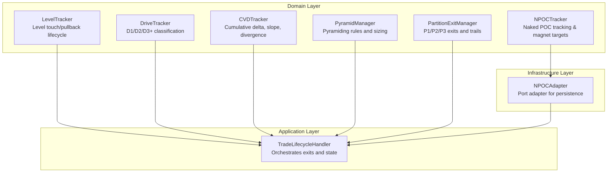
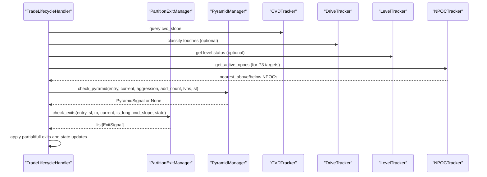
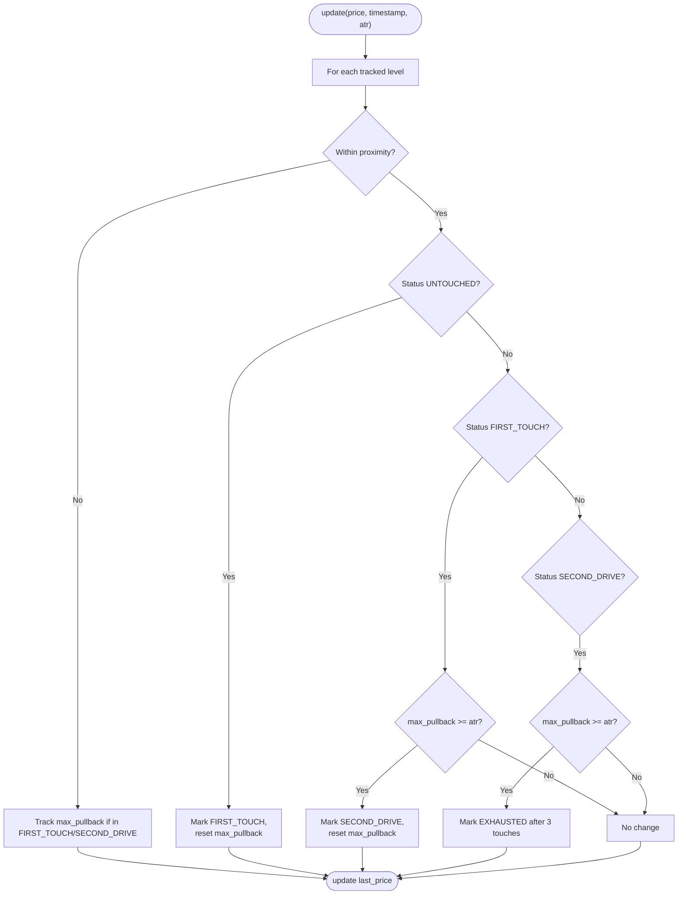
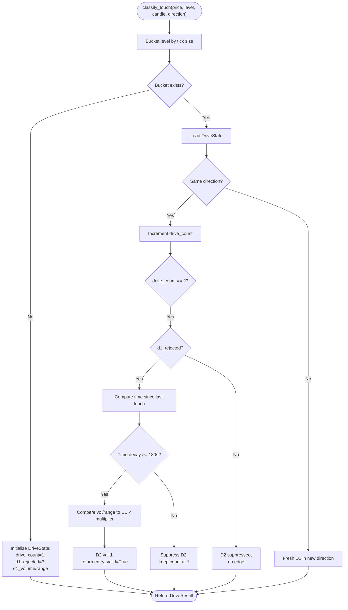
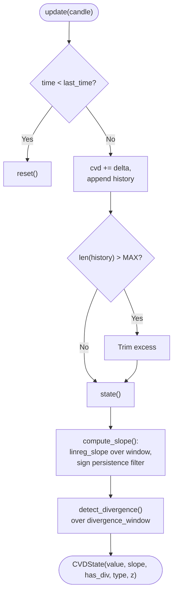
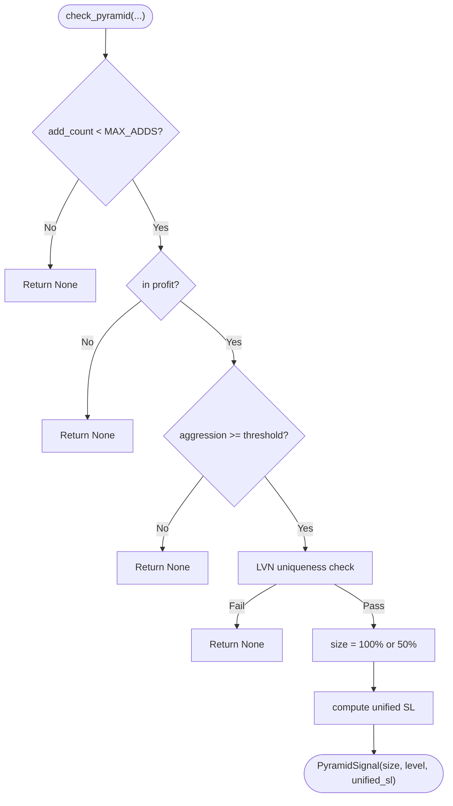
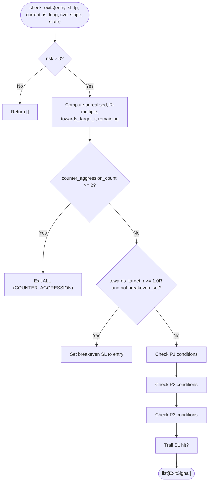
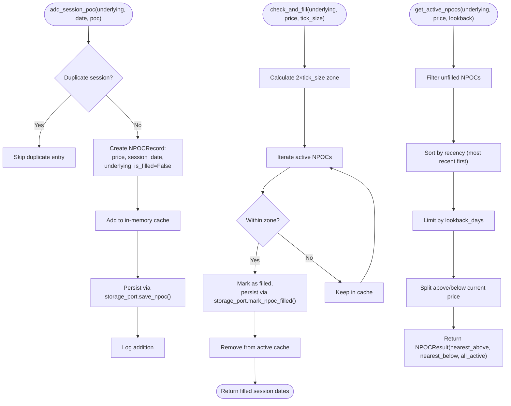
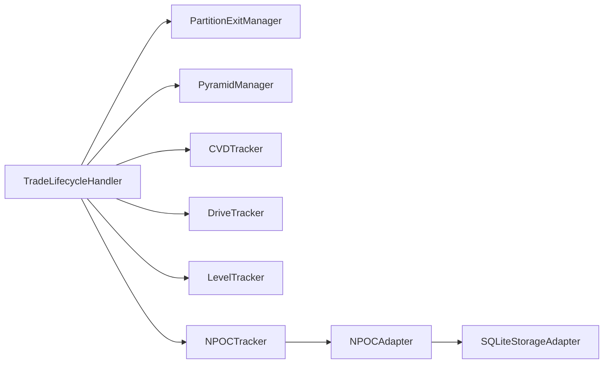

# Specialized Tracking Services

<cite>
**Referenced Files in This Document**
- [level_tracker.py](file://backend/app/domain/fabio_ai/services/level_tracker.py)
- [drive_tracker.py](file://backend/app/domain/fabio_ai/services/drive_tracker.py)
- [cvd_tracker.py](file://backend/app/domain/fabio_ai/services/cvd_tracker.py)
- [pyramid_manager.py](file://backend/app/domain/fabio_ai/services/pyramid_manager.py)
- [partition_exit_manager.py](file://backend/app/domain/fabio_ai/services/partition_exit_manager.py)
- [npoc_tracker.py](file://backend/app/domain/fabio_ai/services/npoc_tracker.py)
- [npoc_adapter.py](file://backend/app/infrastructure/adapters/npoc_adapter.py)
- [npoc.py](file://backend/app/domain/ports/npoc.py)
- [service_graph.py](file://backend/app/application/service_graph.py)
- [trade_lifecycle_handler.py](file://backend/app/application/handlers/trade_lifecycle_handler.py)
- [test_level_tracker.py](file://backend/tests/unit/domain/test_level_tracker.py)
- [test_drive_tracker.py](file://backend/tests/unit/domain/test_drive_tracker.py)
- [test_npoc_tracker.py](file://backend/tests/unit/test_npoc_tracker.py)
- [test_pyramid_manager.py](file://backend/tests/unit/domain/test_pyramid_manager.py)
- [test_partition_exit_manager.py](file://backend/tests/unit/domain/test_partition_exit_manager.py)
</cite>

## Update Summary
**Changes Made**
- Added comprehensive documentation for the new NPOCTracker service
- Integrated NPOCTracker with existing tracking services architecture
- Documented NPocAdapter infrastructure integration
- Updated dependency analysis to include NPOC tracking capabilities
- Enhanced performance considerations for NPOC data management

## Table of Contents
1. [Introduction](#introduction)
2. [Project Structure](#project-structure)
3. [Core Components](#core-components)
4. [Architecture Overview](#architecture-overview)
5. [Detailed Component Analysis](#detailed-component-analysis)
6. [Dependency Analysis](#dependency-analysis)
7. [Performance Considerations](#performance-considerations)
8. [Troubleshooting Guide](#troubleshooting-guide)
9. [Conclusion](#conclusion)

## Introduction
This document describes six specialized tracking and management services that power advanced intraday scalping and trend-following workflows:
- LevelTracker: Enforces "second drive" confirmation for structural levels and grades entries accordingly.
- DriveTracker: Tracks D1/D2/D3+ touches and rejection patterns to qualify entries.
- CVDTracker: Computes cumulative volume delta, slope, and divergence to detect accumulation/distribution pressure.
- PyramidManager: Manages pyramiding into winning positions with strict rules and unified stops.
- PartitionExitManager: Implements partial profit-taking and trailing exits aligned with Fabio AMT specifications.
- **NPOCTracker: Tracks naked (unfilled) previous session POCs as price magnets for secondary targets.**

These services integrate with position sizing and risk management systems to enforce disciplined trade execution and risk controls.

## Project Structure
The services are implemented under the domain layer and are consumed by the trade lifecycle handler during live sessions. The new NPOCTracker complements existing delta profile and volume profile services with Number of Points of Control analysis.

**Diagram sources**
- [level_tracker.py:24-108](file://backend/app/domain/fabio_ai/services/level_tracker.py#L24-L108)
- [drive_tracker.py:52-315](file://backend/app/domain/fabio_ai/services/drive_tracker.py#L52-L315)
- [cvd_tracker.py:41-164](file://backend/app/domain/fabio_ai/services/cvd_tracker.py#L41-L164)
- [pyramid_manager.py:31-107](file://backend/app/domain/fabio_ai/services/pyramid_manager.py#L31-L107)
- [partition_exit_manager.py:44-232](file://backend/app/domain/fabio_ai/services/partition_exit_manager.py#L44-L232)
- [npoc_tracker.py:17-190](file://backend/app/domain/fabio_ai/services/npoc_tracker.py#L17-L190)
- [npoc_adapter.py:13-65](file://backend/app/infrastructure/adapters/npoc_adapter.py#L13-L65)
- [trade_lifecycle_handler.py:175-223](file://backend/app/application/handlers/trade_lifecycle_handler.py#L175-L223)

**Section sources**
- [level_tracker.py:1-108](file://backend/app/domain/fabio_ai/services/level_tracker.py#L1-L108)
- [drive_tracker.py:1-315](file://backend/app/domain/fabio_ai/services/drive_tracker.py#L1-L315)
- [cvd_tracker.py:1-164](file://backend/app/domain/fabio_ai/services/cvd_tracker.py#L1-L164)
- [pyramid_manager.py:1-107](file://backend/app/domain/fabio_ai/services/pyramid_manager.py#L1-L107)
- [partition_exit_manager.py:1-232](file://backend/app/domain/fabio_ai/services/partition_exit_manager.py#L1-L232)
- [npoc_tracker.py:1-190](file://backend/app/domain/fabio_ai/services/npoc_tracker.py#L1-L190)
- [npoc_adapter.py:1-65](file://backend/app/infrastructure/adapters/npoc_adapter.py#L1-L65)
- [trade_lifecycle_handler.py:175-223](file://backend/app/application/handlers/trade_lifecycle_handler.py#L175-L223)

## Core Components
- LevelTracker: Maintains per-level state (touch history, max pullback, status) and enforces second-drive confirmation using ATR thresholds and proximity bands.
- DriveTracker: Tracks drive counts per level bucket, detects rejection, enforces time decay between touches, and supports alerting for D1 retests.
- CVDTracker: Accumulates delta per candle, maintains bounded histories, computes extended-window slope with sign persistence, and detects price/CVD divergence.
- PyramidManager: Validates pyramiding eligibility (profit, aggression, LVN uniqueness), computes add sizes, and sets unified stops after each add.
- PartitionExitManager: Implements P1/P2/P3 exits at 1R/2R with CVD confirmation in trending regimes, break-even at 1R, and trailing mechanics with counter-aggression hard exit.
- **NPOCTracker: Tracks naked (unfilled) previous session POCs as price magnets, storing session POCs and marking them as filled when price trades within 2 ticks.**

**Section sources**
- [level_tracker.py:24-108](file://backend/app/domain/fabio_ai/services/level_tracker.py#L24-L108)
- [drive_tracker.py:52-315](file://backend/app/domain/fabio_ai/services/drive_tracker.py#L52-L315)
- [cvd_tracker.py:41-164](file://backend/app/domain/fabio_ai/services/cvd_tracker.py#L41-L164)
- [pyramid_manager.py:31-107](file://backend/app/domain/fabio_ai/services/pyramid_manager.py#L31-L107)
- [partition_exit_manager.py:44-232](file://backend/app/domain/fabio_ai/services/partition_exit_manager.py#L44-L232)
- [npoc_tracker.py:17-190](file://backend/app/domain/fabio_ai/services/npoc_tracker.py#L17-L190)

## Architecture Overview
The trade lifecycle handler coordinates periodic checks from these trackers and managers to decide partial exits and manage position scaling. The NPOCTracker integrates seamlessly with the existing architecture through the INPOC port interface.

**Diagram sources**
- [trade_lifecycle_handler.py:175-223](file://backend/app/application/handlers/trade_lifecycle_handler.py#L175-L223)
- [partition_exit_manager.py:58-220](file://backend/app/domain/fabio_ai/services/partition_exit_manager.py#L58-L220)
- [pyramid_manager.py:36-107](file://backend/app/domain/fabio_ai/services/pyramid_manager.py#L36-L107)
- [cvd_tracker.py:97-107](file://backend/app/domain/fabio_ai/services/cvd_tracker.py#L97-L107)
- [drive_tracker.py:72-257](file://backend/app/domain/fabio_ai/services/drive_tracker.py#L72-L257)
- [npoc_tracker.py:124-156](file://backend/app/domain/fabio_ai/services/npoc_tracker.py#L124-L156)

## Detailed Component Analysis

### LevelTracker
Purpose: Enforce "second drive" confirmation for structural levels and grade entries accordingly.

Key behaviors:
- Proximity band around each level determines "near" status.
- Touch tracking increments per level with timestamps.
- Pullback measurement against ATR threshold to confirm second drive.
- Status progression: UNTOUCHED → FIRST_TOUCH → SECOND_DRIVE → EXHAUSTED.
- Grade adjustment helper returns score deltas for downstream use.

**Diagram sources**
- [level_tracker.py:46-74](file://backend/app/domain/fabio_ai/services/level_tracker.py#L46-L74)

Thresholds and state maintenance:
- Proximity percentage defines near-zone width per level.
- Pullback minimum equals ATR multiplied by a configurable factor.
- Intraday reset clears touch history and statuses.

Integration:
- Grade adjustment helper informs downstream scoring systems.

Validation:
- Unit tests cover first touch, second drive confirmation, exhaustion, proximity boundaries, and intraday clearing.

**Section sources**
- [level_tracker.py:24-108](file://backend/app/domain/fabio_ai/services/level_tracker.py#L24-L108)
- [test_level_tracker.py:11-133](file://backend/tests/unit/domain/test_level_tracker.py#L11-L133)

### DriveTracker
Purpose: Classify touches at key levels (VAH, VAL, LVN) into D1/D2/D3+ and detect rejection.

Key behaviors:
- Bucket levels by tick-rounded price to group nearby levels.
- Track drive count, first-drive rejection flag, and first-drive volume/range.
- Enforce time decay between touches to avoid rapid re-entry.
- Detect rejection via wick-through ratio and close-side validation.
- Momentum fade detection compares current candle's volume/range to first drive.
- Market state awareness influences P1 exit behavior downstream.

**Diagram sources**
- [drive_tracker.py:72-257](file://backend/app/domain/fabio_ai/services/drive_tracker.py#L72-L257)

Thresholds and state maintenance:
- Rejection wick ratio threshold and momentum fade multiplier are configurable.
- Time decay enforcement prevents rapid retests within 3 minutes.
- Session reset clears all drive histories.

Integration:
- Optional alert manager integrates with price alerts for D1 retests.

Validation:
- Unit tests cover D1/D2/D3+ classification, rejection detection, and session reset.

**Section sources**
- [drive_tracker.py:52-315](file://backend/app/domain/fabio_ai/services/drive_tracker.py#L52-L315)
- [test_drive_tracker.py:15-114](file://backend/tests/unit/domain/test_drive_tracker.py#L15-L114)

### CVDTracker
Purpose: Track cumulative volume delta, compute slope over an extended window, and detect price/CVD divergence.

Key behaviors:
- Accumulate delta per candle and maintain bounded histories to cap memory.
- Compute slope using MLX-accelerated linear regression over an extended window.
- Apply sign persistence filter to avoid noisy flips; emits stable slope after consistent sign for N bars.
- Detect divergence between price and CVD over a shorter window.

**Diagram sources**
- [cvd_tracker.py:74-164](file://backend/app/domain/fabio_ai/services/cvd_tracker.py#L74-L164)

Thresholds and state maintenance:
- Extended slope window and persistence bars are configurable via constants.
- Divergence detection uses a shorter window for responsiveness.
- Session boundary detection triggers reset when time moves backward.

Integration:
- Downstream components consume slope and divergence flags for trade decisions.

Validation:
- Unit tests verify accumulation, positive/negative slope generation, and divergence detection.

**Section sources**
- [cvd_tracker.py:41-164](file://backend/app/domain/fabio_ai/services/cvd_tracker.py#L41-L164)
- [test_partition_exit_manager.py:137-168](file://backend/tests/unit/domain/test_partition_exit_manager.py#L137-L168)

### PyramidManager
Purpose: Structured pyramiding into winning positions with strict rules and unified stops.

Key behaviors:
- Validate maximum adds (2 additional), profit status, aggression threshold, and LVN uniqueness.
- Compute add sizes: first add = 100%, second add = 50%.
- After each add, unify stops across all entries to protect the pyramid.

**Diagram sources**
- [pyramid_manager.py:36-107](file://backend/app/domain/fabio_ai/services/pyramid_manager.py#L36-L107)

Integration:
- Unified stops are enforced post-add to protect the pyramid.

Validation:
- Unit tests cover max adds, profit requirement, aggression threshold, LVN uniqueness, and add sizes.

**Section sources**
- [pyramid_manager.py:31-107](file://backend/app/domain/fabio_ai/services/pyramid_manager.py#L31-L107)
- [test_pyramid_manager.py:7-104](file://backend/tests/unit/domain/test_pyramid_manager.py#L7-L104)

### PartitionExitManager
Purpose: Implement P1/P2/P3 partial exits and trailing mechanics aligned with Fabio AMT specifications.

Key behaviors:
- P1: 30% at 1R; in balanced regimes fires at 1R; in imbalanced regimes fires only if CVD confirms.
- P2: 40% at 2R; sets trail SL to current price upon activation.
- P3: 30% trail if CVD slope strong; otherwise exit with P2 if momentum weak.
- Break-even: move stop to entry at 1R toward target.
- Counter-aggression: 2+ opposite signals trigger full exit.

**Diagram sources**
- [partition_exit_manager.py:58-220](file://backend/app/domain/fabio_ai/services/partition_exit_manager.py#L58-L220)

Integration:
- Trade lifecycle handler applies partial exits and updates realized PnL into risk systems.

Validation:
- Unit tests cover P1/P2/P3 triggers, CVD confirmation in imbalanced regimes, break-even timing, and counter-aggression hard exit.

**Section sources**
- [partition_exit_manager.py:44-232](file://backend/app/domain/fabio_ai/services/partition_exit_manager.py#L44-L232)
- [test_partition_exit_manager.py:13-226](file://backend/tests/unit/domain/test_partition_exit_manager.py#L13-L226)
- [trade_lifecycle_handler.py:175-223](file://backend/app/application/handlers/trade_lifecycle_handler.py#L175-L223)

### NPOCTracker
Purpose: Track naked (unfilled) previous session POCs as price magnets for secondary targets in P3 trailing exits.

Key behaviors:
- Store session POCs with underlying symbol, session date, and price level.
- Mark NPOCs as filled when price trades within 2 ticks of the POC level.
- Maintain in-memory cache with persistent storage backup.
- Provide nearest above/below NPOC queries for target calculation.
- Load active NPOCs from storage on startup for crash recovery.

**Diagram sources**
- [npoc_tracker.py:42-78](file://backend/app/domain/fabio_ai/services/npoc_tracker.py#L42-L78)
- [npoc_tracker.py:80-122](file://backend/app/domain/fabio_ai/services/npoc_tracker.py#L80-L122)
- [npoc_tracker.py:124-156](file://backend/app/domain/fabio_ai/services/npoc_tracker.py#L124-L156)

Thresholds and state maintenance:
- **2-tick zone threshold** for marking NPOCs as filled (tight enough to capture meaningful retests).
- Lookback window limits active NPOCs to most recent sessions (default 5 days).
- Duplicate prevention ensures single POC per session per underlying.
- Persistent storage with recovery capability for crash scenarios.

Integration:
- **INPOC port interface** enables dependency injection and testing flexibility.
- **NPOCAdapter** bridges domain service to infrastructure storage layer.
- **SQLiteStorageAdapter** provides persistent storage for NPOC records.

Validation:
- Unit tests cover session POC creation, duplicate handling, fill detection, and active NPOC queries.
- Comprehensive test coverage for edge cases and integration scenarios.

**Section sources**
- [npoc_tracker.py:17-190](file://backend/app/domain/fabio_ai/services/npoc_tracker.py#L17-L190)
- [npoc.py:29-57](file://backend/app/domain/ports/npoc.py#L29-L57)
- [npoc_adapter.py:13-65](file://backend/app/infrastructure/adapters/npoc_adapter.py#L13-L65)
- [test_npoc_tracker.py:78-110](file://backend/tests/unit/test_npoc_tracker.py#L78-L110)

## Dependency Analysis
- TradeLifecycleHandler orchestrates periodic checks from PartitionExitManager and PyramidManager and reads CVD slope for decision-making.
- DriveTracker and LevelTracker are optional inputs to entry gating and can influence downstream signals.
- CVDTracker is a shared dependency feeding slope/divergence to multiple components.
- **NPOCTracker provides secondary target calculation for P3 trailing exits.**
- All managers rely on constants (e.g., aggression thresholds, partition sizes, CVD thresholds) configured at the system level.
- **NPOCTracker depends on INPOC port and integrates through NPOCAdapter.**

**Diagram sources**
- [trade_lifecycle_handler.py:175-223](file://backend/app/application/handlers/trade_lifecycle_handler.py#L175-L223)
- [partition_exit_manager.py:58-220](file://backend/app/domain/fabio_ai/services/partition_exit_manager.py#L58-L220)
- [pyramid_manager.py:36-107](file://backend/app/domain/fabio_ai/services/pyramid_manager.py#L36-L107)
- [cvd_tracker.py:97-107](file://backend/app/domain/fabio_ai/services/cvd_tracker.py#L97-L107)
- [drive_tracker.py:72-257](file://backend/app/domain/fabio_ai/services/drive_tracker.py#L72-L257)
- [level_tracker.py:46-82](file://backend/app/domain/fabio_ai/services/level_tracker.py#L46-L82)
- [npoc_tracker.py:124-156](file://backend/app/domain/fabio_ai/services/npoc_tracker.py#L124-L156)
- [npoc_adapter.py:13-65](file://backend/app/infrastructure/adapters/npoc_adapter.py#L13-L65)
- [service_graph.py:83-84](file://backend/app/application/service_graph.py#L83-L84)

**Section sources**
- [trade_lifecycle_handler.py:175-223](file://backend/app/application/handlers/trade_lifecycle_handler.py#L175-L223)
- [service_graph.py:83-84](file://backend/app/application/service_graph.py#L83-L84)

## Performance Considerations
- Continuous monitoring:
  - LevelTracker and DriveTracker operate per tick; keep proximity and pullback thresholds tuned to avoid excessive churn.
  - CVDTracker caps history length to limit memory growth; ensure extended slope window aligns with session leg needs.
  - **NPOCTracker maintains lightweight in-memory cache with O(1) lookups per underlying; storage operations are minimal.**
- Data retention:
  - CVDTracker trims histories beyond a maximum length; choose window sizes to balance responsiveness and memory footprint.
  - DriveTracker buckets levels by tick size to reduce state proliferation.
  - **NPOCTracker limits active NPOCs by lookback_days (default 5) to prevent unbounded growth.**
- Real-time update mechanisms:
  - CVDTracker auto-resets on session boundary detection (time moving backward).
  - PartitionExitManager and PyramidManager compute signals on each tick; ensure constant checks are lightweight and cached where appropriate.
  - **NPOCTracker performs zone-based fill detection on every tick with O(n) complexity per underlying.**
- Integration with position sizing and risk:
  - PartitionExitManager feeds realized PnL back into risk systems to inform future sizing and tiering.
  - **NPOCTracker provides secondary targets for P3 trailing, enhancing exit optimization without additional computational overhead.**

## Troubleshooting Guide
Common issues and resolutions:
- Excessive false positives in LevelTracker:
  - Adjust proximity percentage and pullback ATR multiplier to tighten or relax criteria.
  - Verify intraday clearing is called at session start to reset statuses.
- DriveTracker not firing D2:
  - Confirm time decay between touches exceeds the minimum threshold.
  - Ensure first drive was properly rejected; otherwise D2 suppression is expected.
- CVDTracker slope flips rapidly:
  - Increase sign persistence bars or adjust extended slope window to stabilize emissions.
  - Validate divergence window is appropriate for the current timeframe.
- PartitionExitManager not triggering P1 in trending regimes:
  - Ensure CVD slope meets confirmation thresholds for imbalanced regimes.
  - Verify market state flags are correctly propagated.
- PyramidManager rejects adds:
  - Check profit status, aggression threshold, and LVN uniqueness.
  - Confirm add count has not exceeded the maximum.
- **NPOCTracker not detecting filled NPOCs:**
  - **Verify tick_size parameter is correctly passed to check_and_fill().**
  - **Check that storage_port.mark_npoc_filled() is being called and persisted.**
  - **Confirm 2-tick zone calculation matches instrument tick size specifications.**
- **NPOCTracker returning incorrect nearest NPOCs:**
  - **Verify lookback_days parameter and recency sorting logic.**
  - **Check that is_filled flag filtering is working correctly.**
- **NPOCTracker memory growth concerns:**
  - **Monitor active_npocs dictionary size per underlying.**
  - **Adjust lookback_days configuration based on trading frequency and session patterns.**

**Section sources**
- [level_tracker.py:27-30](file://backend/app/domain/fabio_ai/services/level_tracker.py#L27-L30)
- [drive_tracker.py:62-66](file://backend/app/domain/fabio_ai/services/drive_tracker.py#L62-L66)
- [cvd_tracker.py:48-49](file://backend/app/domain/fabio_ai/services/cvd_tracker.py#L48-L49)
- [partition_exit_manager.py:129-158](file://backend/app/domain/fabio_ai/services/partition_exit_manager.py#L129-L158)
- [pyramid_manager.py:62-82](file://backend/app/domain/fabio_ai/services/pyramid_manager.py#L62-L82)
- [npoc_tracker.py:80-122](file://backend/app/domain/fabio_ai/services/npoc_tracker.py#L80-L122)
- [npoc_tracker.py:124-156](file://backend/app/domain/fabio_ai/services/npoc_tracker.py#L124-L156)

## Conclusion
These specialized tracking and management services form a cohesive framework for disciplined intraday trading:
- LevelTracker and DriveTracker provide robust entry qualification grounded in structural and rejection dynamics.
- CVDTracker offers reliable momentum and distribution signals with sign stability.
- PyramidManager and PartitionExitManager enforce strict pyramiding and partial profit-taking discipline aligned with Fabio AMT specifications.
- **NPOCTracker extends the system with Number of Points of Control analysis, providing price magnet targets for enhanced P3 trailing exit optimization.**
Together, they integrate with position sizing and risk systems to support consistent, rule-driven execution with comprehensive market structure analysis.