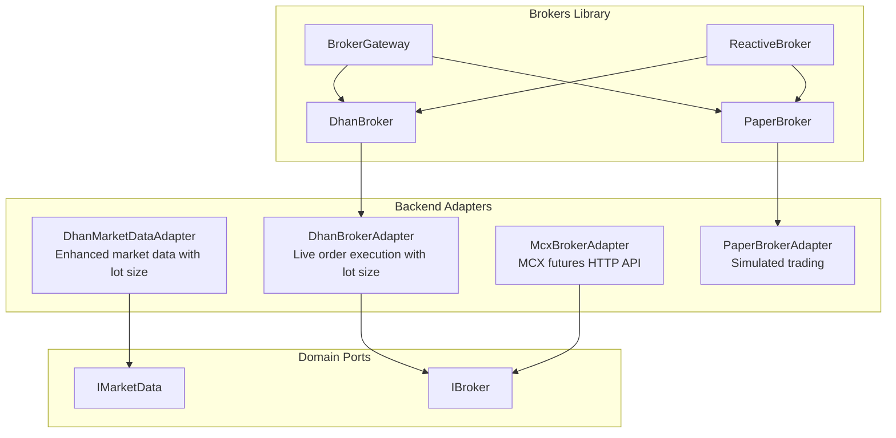
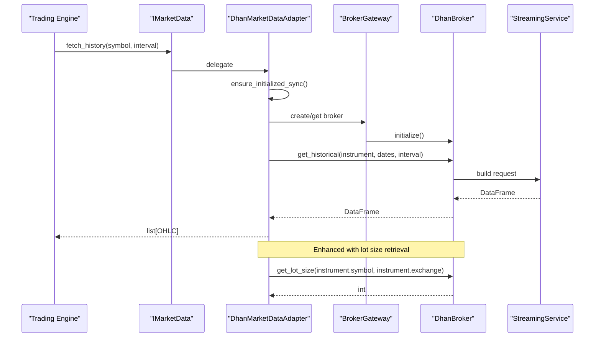
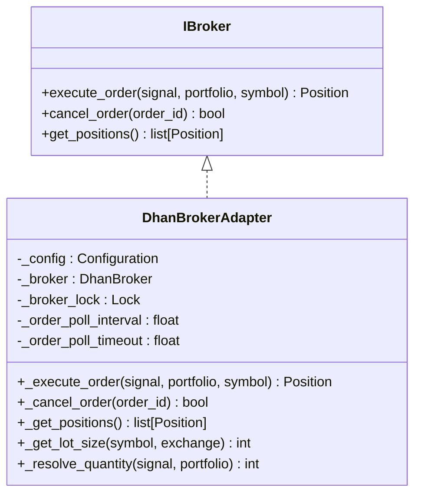
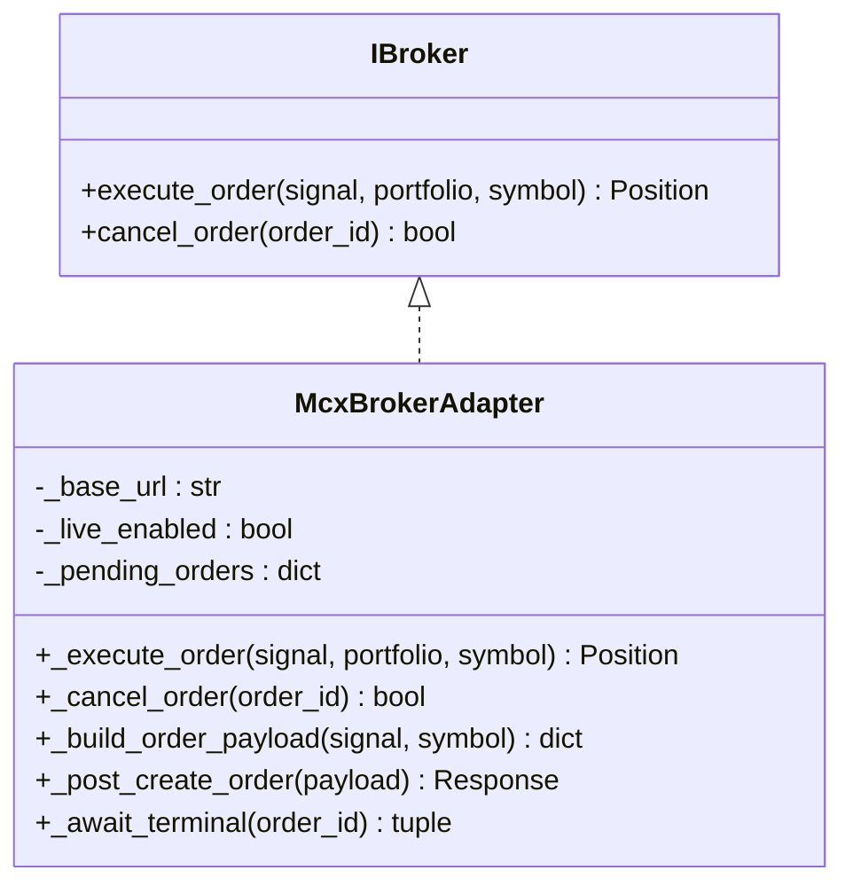
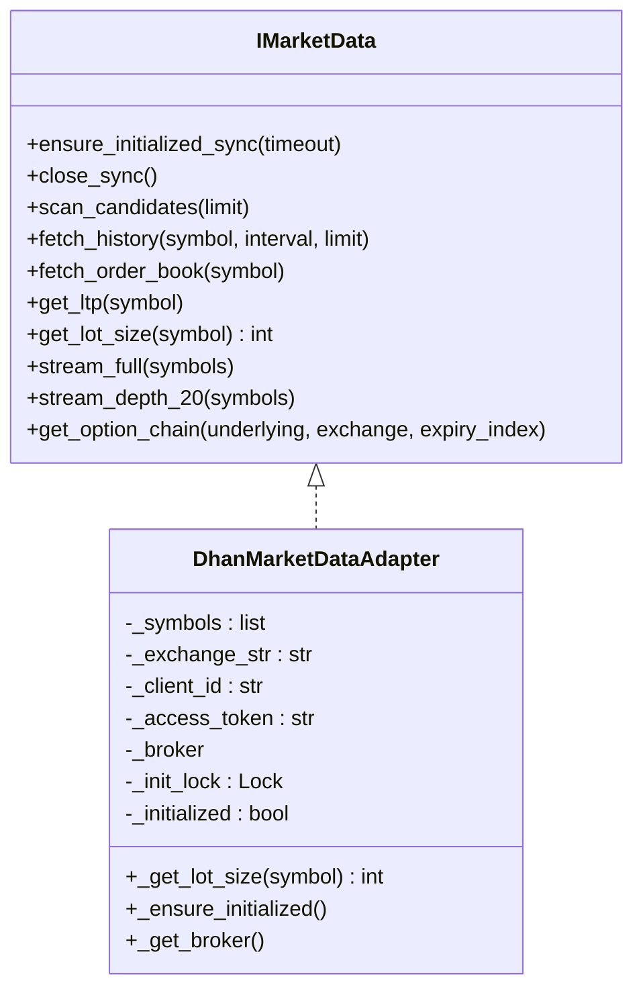
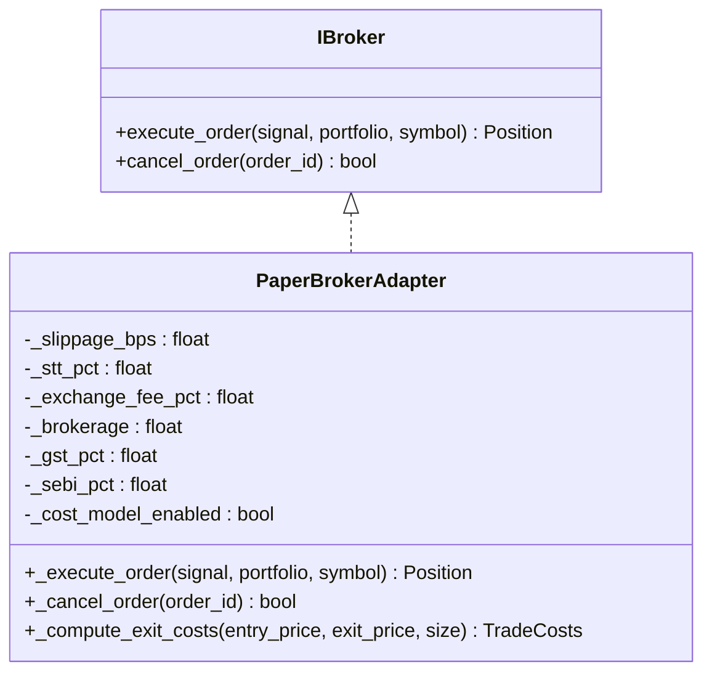
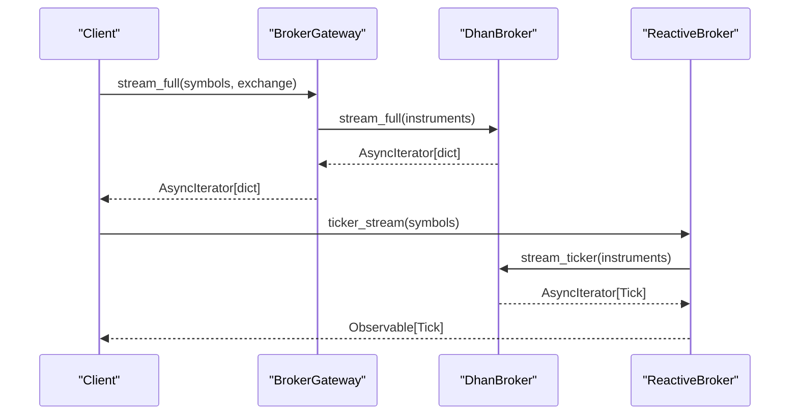
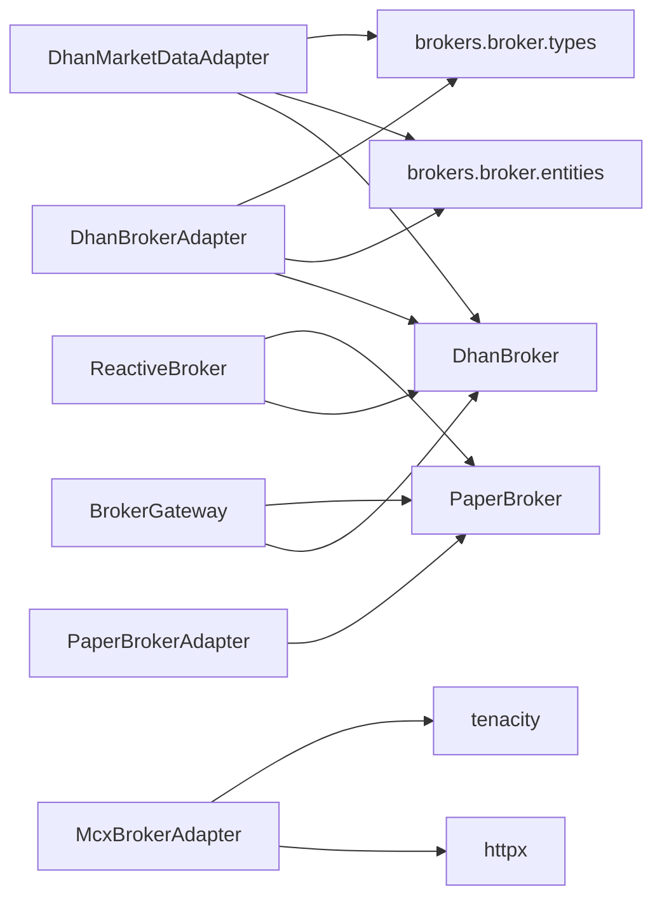

# Broker Adapters

<cite>
**Referenced Files in This Document**
- [dhan_broker_adapter.py](file://backend/app/infrastructure/adapters/dhan_broker_adapter.py)
- [mcx_broker.py](file://backend/app/infrastructure/adapters/broker/mcx_broker.py)
- [dhan_adapter.py](file://backend/app/infrastructure/adapters/dhan_adapter.py)
- [paper_broker.py](file://backend/app/infrastructure/adapters/paper_broker.py)
- [broker.py](file://brokers/broker/paper/broker.py)
- [broker.py](file://brokers/broker/dhan/application/broker.py)
- [ports.py](file://brokers/broker/ports.py)
- [gateway.py](file://brokers/gateway.py)
- [reactive.py](file://brokers/reactive.py)
- [market_info.py](file://brokers/broker/market_info.py)
</cite>

## Update Summary
**Changes Made**
- Added comprehensive DhanBrokerAdapter implementation for live order execution with lot size retrieval and API prefixing support
- Introduced MCXBrokerAdapter for Multi-Commodity Exchange futures trading with HTTP-based API integration
- Updated DhanMarketDataAdapter to include lot size retrieval functionality
- Enhanced broker integration patterns with improved error handling and performance optimizations
- Expanded adapter contract interfaces to support new brokerage capabilities

## Table of Contents
1. [Introduction](#introduction)
2. [Project Structure](#project-structure)
3. [Core Components](#core-components)
4. [Architecture Overview](#architecture-overview)
5. [Detailed Component Analysis](#detailed-component-analysis)
6. [Dependency Analysis](#dependency-analysis)
7. [Performance Considerations](#performance-considerations)
8. [Troubleshooting Guide](#troubleshooting-guide)
9. [Conclusion](#conclusion)
10. [Appendices](#appendices)

## Introduction
This document describes the GlassyTrade AI broker adapters subsystem with a focus on:
- DhanBrokerAdapter for comprehensive live brokerage integration with lot size retrieval and API prefixing support
- MCXBrokerAdapter for Multi-Commodity Exchange futures trading with HTTP-based API integration
- Enhanced DhanMarketDataAdapter with lot size retrieval capabilities
- PaperBroker adapter for simulated trading environments
- Adapter contract interfaces, initialization patterns, error handling, and performance optimizations
- Practical configuration, symbol resolution, exchange mapping, and fallback mechanisms
- Threading-safe initialization, async/sync compatibility, and integration with the broader trading pipeline

## Project Structure
The broker adapters subsystem spans three primary layers:
- Backend adapters: Live brokerage adapters (DhanBrokerAdapter, MCXBrokerAdapter) and market data adapters (DhanMarketDataAdapter)
- Backend adapters: MarketDataPort and BrokerPort implementations for Dhan and Paper
- Brokers library: A reusable, reactive, and resilient broker abstraction with Dhan and Paper implementations

**Diagram sources**
- [dhan_broker_adapter.py:77-500](file://backend/app/infrastructure/adapters/dhan_broker_adapter.py#L77-L500)
- [mcx_broker.py:54-218](file://backend/app/infrastructure/adapters/broker/mcx_broker.py#L54-L218)
- [dhan_adapter.py:67-507](file://backend/app/infrastructure/adapters/dhan_adapter.py#L67-L507)
- [paper_broker.py:39-130](file://backend/app/infrastructure/adapters/paper_broker.py#L39-L130)
- [ports.py:87-418](file://brokers/broker/ports.py#L87-L418)
- [gateway.py:155-424](file://brokers/gateway.py#L155-L424)
- [reactive.py:61-800](file://brokers/reactive.py#L61-L800)
- [broker.py:51-397](file://brokers/broker/paper/broker.py#L51-L397)
- [broker.py:76-823](file://brokers/broker/dhan/application/broker.py#L76-L823)

**Section sources**
- [dhan_broker_adapter.py:1-500](file://backend/app/infrastructure/adapters/dhan_broker_adapter.py#L1-L500)
- [mcx_broker.py:1-218](file://backend/app/infrastructure/adapters/broker/mcx_broker.py#L1-L218)
- [dhan_adapter.py:1-507](file://backend/app/infrastructure/adapters/dhan_adapter.py#L1-L507)
- [paper_broker.py:1-130](file://backend/app/infrastructure/adapters/paper_broker.py#L1-L130)
- [ports.py:1-805](file://brokers/broker/ports.py#L1-L805)
- [gateway.py:1-424](file://brokers/gateway.py#L1-L424)
- [reactive.py:1-800](file://brokers/reactive.py#L1-L800)
- [broker.py:1-397](file://brokers/broker/paper/broker.py#L1-L397)
- [broker.py:1-823](file://brokers/broker/dhan/application/broker.py#L1-L823)

## Core Components
- **DhanBrokerAdapter**: Comprehensive live brokerage adapter implementing IBroker with order execution, cancellation, position management, and lot size retrieval. Features include automatic order sizing with lot multiples, configurable poll intervals, and robust error handling.
- **McxBrokerAdapter**: HTTP-based adapter for Multi-Commodity Exchange futures trading with signature-based authentication, retry logic, and order lifecycle management.
- **Enhanced DhanMarketDataAdapter**: Improved market data adapter with lot size retrieval functionality, option chain caching, and comprehensive symbol resolution.
- **PaperBrokerAdapter**: Realistic simulated trading adapter with detailed cost modeling including slippage, STT, exchange fees, brokerage, GST, and SEBI charges.
- **Domain contracts**: IMarketData and IBroker define abstract interfaces for market data providers and order executors respectively.
- **Brokers library**: BrokerGateway and ReactiveBroker provide unified APIs, circuit breakers, and reactive streams over Dhan and Paper brokers.

Key capabilities:
- Exchange mapping and symbol detection for NSE/NFO/MCX
- Option chain retrieval with expiry and strike handling
- Streaming via WebSocket with fallback polling
- Cost-aware paper trading execution
- Lot size retrieval and API prefixing support
- Comprehensive order lifecycle management

**Section sources**
- [dhan_broker_adapter.py:77-500](file://backend/app/infrastructure/adapters/dhan_broker_adapter.py#L77-L500)
- [mcx_broker.py:54-218](file://backend/app/infrastructure/adapters/broker/mcx_broker.py#L54-L218)
- [dhan_adapter.py:67-507](file://backend/app/infrastructure/adapters/dhan_adapter.py#L67-L507)
- [paper_broker.py:39-130](file://backend/app/infrastructure/adapters/paper_broker.py#L39-L130)
- [ports.py:87-418](file://brokers/broker/ports.py#L87-L418)
- [gateway.py:155-424](file://brokers/gateway.py#L155-L424)
- [reactive.py:61-800](file://brokers/reactive.py#L61-L800)

## Architecture Overview
The adapters integrate with the broader trading pipeline through standardized ports and the brokers library, featuring enhanced brokerage capabilities.

**Diagram sources**
- [dhan_adapter.py:253-357](file://backend/app/infrastructure/adapters/dhan_adapter.py#L253-L357)
- [gateway.py:232-242](file://brokers/gateway.py#L232-L242)
- [broker.py:494-501](file://brokers/broker/dhan/application/broker.py#L494-L501)

## Detailed Component Analysis

### DhanBrokerAdapter
**New Implementation** - Comprehensive live brokerage adapter with advanced features.

Implements IBroker and provides complete order execution lifecycle with lot size awareness and API prefixing support.

- **Initialization patterns**
  - Thread-safe broker creation with lock-based synchronization
  - Environment variable configuration for client credentials
  - Automatic broker recreation on failure
  - Configurable poll intervals and timeouts for order status checking

- **Order execution capabilities**
  - Automatic quantity calculation with lot size constraints
  - Support for various order types (MARKET, LIMIT, SL, SLM)
  - Product type resolution (INTRADAY, DELIVERY, etc.)
  - Comprehensive order metadata preservation
  - Automatic order cancellation on timeout

- **Lot size integration**
  - Automatic detection of commodity underlyings (GOLD, SILVER, CRUDEOIL, etc.)
  - Proper exchange routing based on underlying type
  - Lot size-based quantity rounding and validation
  - Option-specific lot size handling

- **Error handling and resilience**
  - DhanError exception mapping
  - Graceful fallback for missing filled quantities
  - Comprehensive logging for debugging
  - Timeout handling with automatic cancellation

**Diagram sources**
- [ports.py:87-418](file://brokers/broker/ports.py#L87-L418)
- [dhan_broker_adapter.py:77-500](file://backend/app/infrastructure/adapters/dhan_broker_adapter.py#L77-L500)

**Section sources**
- [dhan_broker_adapter.py:77-500](file://backend/app/infrastructure/adapters/dhan_broker_adapter.py#L77-L500)

### McxBrokerAdapter
**New Implementation** - HTTP-based adapter for Multi-Commodity Exchange futures trading.

Provides comprehensive futures trading capabilities with secure API integration.

- **HTTP API Integration**
  - HMAC signature-based authentication
  - Configurable base URLs and API keys
  - Retry logic with exponential backoff
  - Structured error handling and response validation

- **Order Management**
  - Complete order lifecycle (create, cancel, status)
  - Signature verification for request integrity
  - Terminal state monitoring with polling
  - Position materialization from fill responses

- **Security Features**
  - HMAC SHA256 signature generation
  - Configurable API credentials
  - Request/response logging with sensitive data masking
  - Production safety with explicit enable flags

**Diagram sources**
- [ports.py:87-418](file://brokers/broker/ports.py#L87-L418)
- [mcx_broker.py:54-218](file://backend/app/infrastructure/adapters/broker/mcx_broker.py#L54-L218)

**Section sources**
- [mcx_broker.py:54-218](file://backend/app/infrastructure/adapters/broker/mcx_broker.py#L54-L218)

### Enhanced DhanMarketDataAdapter
**Updated Implementation** - Improved market data adapter with lot size retrieval.

Extends the original DhanMarketDataAdapter with comprehensive lot size integration and enhanced functionality.

- **Lot Size Retrieval**
  - New `get_lot_size()` method for symbol lot size lookup
  - Integration with DhanBroker's instrument resolution
  - Default fallback to 1 for unknown symbols
  - Comprehensive error handling and logging

- **Enhanced Symbol Resolution**
  - Improved exchange detection for commodity derivatives
  - Better option symbol identification (CALL/PUT, CE/PE)
  - Automatic exchange routing based on underlying type
  - Support for API prefixing in symbol resolution

- **Performance Optimizations**
  - Enhanced option chain caching with TTL controls
  - Serializable option chain fetches for thread safety
  - Improved initialization synchronization
  - Memory-efficient cache management

**Diagram sources**
- [ports.py:44-81](file://brokers/broker/ports.py#L44-L81)
- [dhan_adapter.py:67-507](file://backend/app/infrastructure/adapters/dhan_adapter.py#L67-L507)

**Section sources**
- [dhan_adapter.py:67-507](file://backend/app/infrastructure/adapters/dhan_adapter.py#L67-L507)

### PaperBrokerAdapter
Implements IBroker for realistic simulated trading with comprehensive cost modeling.

- **Cost computation**
  - Slippage: directional slippage on notional
  - STT: applicable on sell side for options
  - Exchange fee: applied on both sides
  - Brokerage: flat per order × 2
  - GST: on brokerage only
  - SEBI: turnover charge on both sides

- **Execution behavior**
  - Opens positions with optional scale-in support
  - Applies cost model on entry and exit
  - Returns None if order rejected (not implemented in adapter)

**Diagram sources**
- [ports.py:87-418](file://brokers/broker/ports.py#L87-L418)
- [paper_broker.py:39-130](file://backend/app/infrastructure/adapters/paper_broker.py#L39-L130)

**Section sources**
- [paper_broker.py:39-130](file://backend/app/infrastructure/adapters/paper_broker.py#L39-L130)

### Adapter Contracts and Interfaces
- **IMarketData**: Defines contract for market data providers including lifecycle hooks, historical queries, order book retrieval, LTP, lot size retrieval, streaming endpoints, and option chain support.
- **IBroker**: Defines contract for order execution with order placement, cancellation, position management, and portfolio queries.
- **IReactiveBroker**: Provides reactive programming interfaces with Observable streams for market data and order updates.

These contracts enable seamless swapping between implementations (Dhan, Paper, MCX) without changing the rest of the system.

**Section sources**
- [ports.py:87-418](file://brokers/broker/ports.py#L87-L418)
- [ports.py:420-620](file://brokers/broker/ports.py#L420-L620)

### Brokers Library Integration
- **BrokerGateway**: Provides unified API over Dhan and Paper brokers with circuit breaker protection and convenience methods for quotes, historical data, streaming, and option chains.
- **ReactiveBroker**: Wraps any IBrokerPort with RxPY Observables enabling functional reactive programming patterns and operators.

**Diagram sources**
- [gateway.py:390-395](file://brokers/gateway.py#L390-L395)
- [reactive.py:248-251](file://brokers/reactive.py#L248-L251)
- [broker.py:674-684](file://brokers/broker/dhan/application/broker.py#L674-L684)

**Section sources**
- [gateway.py:155-424](file://brokers/gateway.py#L155-L424)
- [reactive.py:61-800](file://brokers/reactive.py#L61-L800)
- [broker.py:1-823](file://brokers/broker/dhan/application/broker.py#L1-L823)

## Dependency Analysis
- **DhanBrokerAdapter** depends on:
  - brokers.broker.dhan.application.DhanBroker for order execution and position management
  - brokers.broker.entities for Instrument, Order, Position, etc.
  - brokers.broker.types for Exchange and OrderType
  - app.config.Configuration for credential management

- **McxBrokerAdapter** depends on:
  - httpx for HTTP communication
  - tenacity for retry logic
  - app.config.settings for API configuration
  - brokers.broker.types for Exchange enumeration

- **Enhanced DhanMarketDataAdapter** depends on:
  - brokers.broker.dhan.application.DhanBroker for market data, historical, streaming, and options
  - brokers.broker.entities for Instrument, OptionType, OrderBook, etc.
  - brokers.broker.types for Exchange and OptionType
  - shared.timezones for IST conversions

- **PaperBrokerAdapter** depends on:
  - app.domain.ports.broker.IBroker
  - app.domain.trading.models for Position, Signal, Portfolio
  - app.domain.services.trade_costs for realistic cost modeling

- **Brokers library** provides:
  - BrokerGateway and ReactiveBroker abstractions
  - DhanBroker and PaperBroker implementations
  - Entities and types re-exported from shared layers

**Diagram sources**
- [dhan_broker_adapter.py:24-37](file://backend/app/infrastructure/adapters/dhan_broker_adapter.py#L24-L37)
- [mcx_broker.py:21-28](file://backend/app/infrastructure/adapters/broker/mcx_broker.py#L21-L28)
- [dhan_adapter.py:31-37](file://backend/app/infrastructure/adapters/dhan_adapter.py#L31-L37)
- [gateway.py:111-133](file://brokers/gateway.py#L111-L133)
- [reactive.py:115-133](file://brokers/reactive.py#L115-L133)
- [broker.py:76-136](file://brokers/broker/dhan/application/broker.py#L76-L136)
- [broker.py:51-74](file://brokers/broker/paper/broker.py#L51-L74)

**Section sources**
- [dhan_broker_adapter.py:1-500](file://backend/app/infrastructure/adapters/dhan_broker_adapter.py#L1-L500)
- [mcx_broker.py:1-218](file://backend/app/infrastructure/adapters/broker/mcx_broker.py#L1-L218)
- [dhan_adapter.py:1-507](file://backend/app/infrastructure/adapters/dhan_adapter.py#L1-L507)
- [paper_broker.py:1-130](file://backend/app/infrastructure/adapters/paper_broker.py#L1-L130)
- [gateway.py:1-424](file://brokers/gateway.py#L1-L424)
- [reactive.py:1-800](file://brokers/reactive.py#L1-L800)
- [broker.py:1-397](file://brokers/broker/paper/broker.py#L1-L397)
- [broker.py:1-823](file://brokers/broker/dhan/application/broker.py#L1-L823)

## Performance Considerations
- **Threading-safe initialization**
  - DhanBrokerAdapter uses lock-based synchronization for broker creation
  - Enhanced DhanMarketDataAdapter maintains thread-safe option chain caching
  - McxBrokerAdapter implements production safety with explicit enable flags

- **Streaming efficiency**
  - Enhanced DhanMarketDataAdapter includes lot size retrieval optimization
  - Stream polling with configurable intervals for MCX OPTFUT fallback
  - ReactiveBroker isolates async streams with proper cancellation handling

- **Lot size optimization**
  - DhanBrokerAdapter automatically detects commodity underlyings for proper lot sizing
  - Enhanced symbol resolution reduces API calls through intelligent caching
  - Automatic quantity rounding to nearest lot multiple prevents order rejections

- **Circuit breaking and resilience**
  - BrokerGateway integrates circuit breaker protection for all operations
  - McxBrokerAdapter implements retry logic with exponential backoff
  - DhanBrokerAdapter provides timeout handling with automatic order cancellation

## Troubleshooting Guide
Common issues and remedies:
- **DhanBrokerAdapter initialization failures**
  - Symptom: DhanBroker creation fails with missing credentials
  - Action: Verify DHAN_CLIENT_ID and DHAN_ACCESS_TOKEN environment variables; check configuration precedence

- **Order execution timeouts**
  - Symptom: Orders don't reach terminal state within timeout period
  - Action: Adjust DHAN_ORDER_POLL_TIMEOUT_SEC environment variable; verify order status manually

- **Lot size calculation errors**
  - Symptom: Quantity not aligned to lot multiples causing order rejection
  - Action: Ensure option_lot_size metadata is provided for options; verify commodity underlyings

- **MCXBrokerAdapter disabled for production**
  - Symptom: NotImplementedError when attempting live execution
  - Action: Set MCX_LIVE_ENABLED or settings.mcx.enabled to True; verify API credentials

- **HTTP API authentication failures**
  - Symptom: 401 Unauthorized responses from MCX API
  - Action: Verify HMAC signature generation; check API key and secret configuration

- **Option chain unavailable**
  - Symptom: get_option_chain returns None for MCX commodities
  - Action: Verify commodity options support; check exchange mapping and underlying type

- **Cost model discrepancies in paper trading**
  - Symptom: Unexpected entry/exit costs in simulated environment
  - Action: Review cost parameters and slippage basis points; ensure cost_model_enabled is set appropriately

**Section sources**
- [dhan_broker_adapter.py:121-133](file://backend/app/infrastructure/adapters/dhan_broker_adapter.py#L121-L133)
- [dhan_broker_adapter.py:436-463](file://backend/app/infrastructure/adapters/dhan_broker_adapter.py#L436-L463)
- [mcx_broker.py:80-83](file://backend/app/infrastructure/adapters/broker/mcx_broker.py#L80-L83)
- [dhan_adapter.py:201-248](file://backend/app/infrastructure/adapters/dhan_adapter.py#L201-L248)
- [paper_broker.py:70-76](file://backend/app/infrastructure/adapters/paper_broker.py#L70-L76)

## Conclusion
The GlassyTrade broker adapters subsystem has been comprehensively enhanced with new brokerage capabilities. The DhanBrokerAdapter provides robust live order execution with lot size awareness and API prefixing support. The McxBrokerAdapter enables Multi-Commodity Exchange futures trading through secure HTTP integration. Enhanced DhanMarketDataAdapter now includes lot size retrieval functionality for improved trading accuracy. Together with the existing PaperBrokerAdapter and expanded domain contracts, the system provides a complete brokerage solution supporting multiple markets, exchanges, and trading styles while maintaining scalability and maintainability.

## Appendices

### Practical Examples

- **Broker configuration**
  - DhanBrokerAdapter: Configure DHAN_CLIENT_ID and DHAN_ACCESS_TOKEN environment variables; adjust poll intervals via DHAN_ORDER_POLL_INTERVAL_SEC and DHAN_ORDER_POLL_TIMEOUT_SEC
  - McxBrokerAdapter: Set MCX_LIVE_ENABLED to True for production use; configure API credentials in settings.mcx
  - Enhanced DhanMarketDataAdapter: Provide client_id and access_token during instantiation; lot size retrieval is automatic

- **Symbol resolution and exchange mapping**
  - DhanBrokerAdapter: Automatic detection of commodity underlyings (GOLD, SILVER, CRUDEOIL, etc.) for proper exchange routing
  - Enhanced DhanMarketDataAdapter: Auto-detection of options and routing to NFO or MCX based on underlying; fallback to NSE for unknown exchanges
  - MarketInfo utilities provide lot sizes, step sizes, and expiry information for downstream logic

- **Lot size integration**
  - DhanBrokerAdapter: Automatic lot size detection for commodity derivatives; proper quantity rounding to lot multiples
  - Enhanced DhanMarketDataAdapter: New get_lot_size() method for symbol lot size lookup; integration with DhanBroker's instrument resolution
  - Manual override available through option_lot_size metadata parameter

- **Fallback mechanisms**
  - Enhanced DhanMarketDataAdapter: stream_poll REST polling for MCX OPTFUT when WebSocket is limited
  - Option chain retrieval falls back to None if unavailable; enhanced caching reduces API load
  - McxBrokerAdapter: Production safety with explicit enable flags prevents accidental live trading

- **Integration with trading pipeline**
  - IMarketData implementations plug into the trading engine for historical and streaming data with lot size support
  - IBroker implementations integrate with order lifecycle services including comprehensive error handling
  - ReactiveBroker provides functional reactive programming patterns for complex trading strategies

**Section sources**
- [dhan_broker_adapter.py:103-133](file://backend/app/infrastructure/adapters/dhan_broker_adapter.py#L103-L133)
- [mcx_broker.py:65-71](file://backend/app/infrastructure/adapters/broker/mcx_broker.py#L65-L71)
- [dhan_adapter.py:403-412](file://backend/app/infrastructure/adapters/dhan_adapter.py#L403-L412)
- [dhan_adapter.py:177-200](file://backend/app/infrastructure/adapters/dhan_adapter.py#L177-L200)
- [gateway.py:232-242](file://brokers/gateway.py#L232-L242)