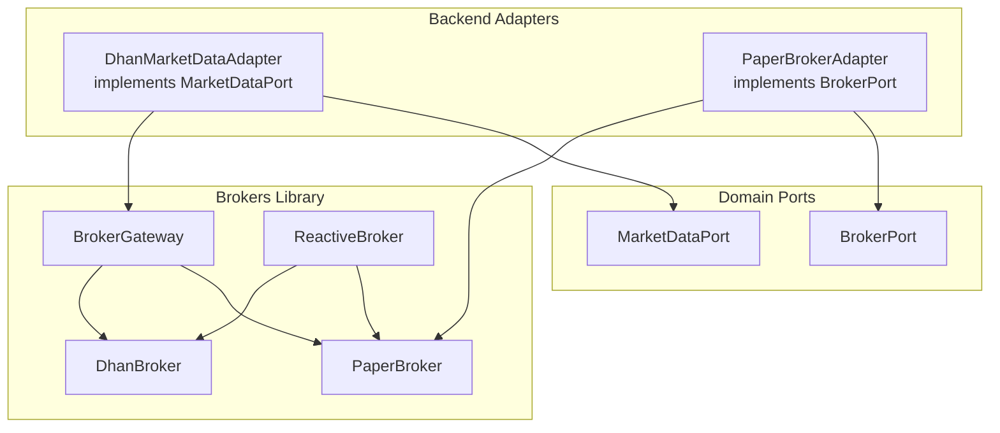
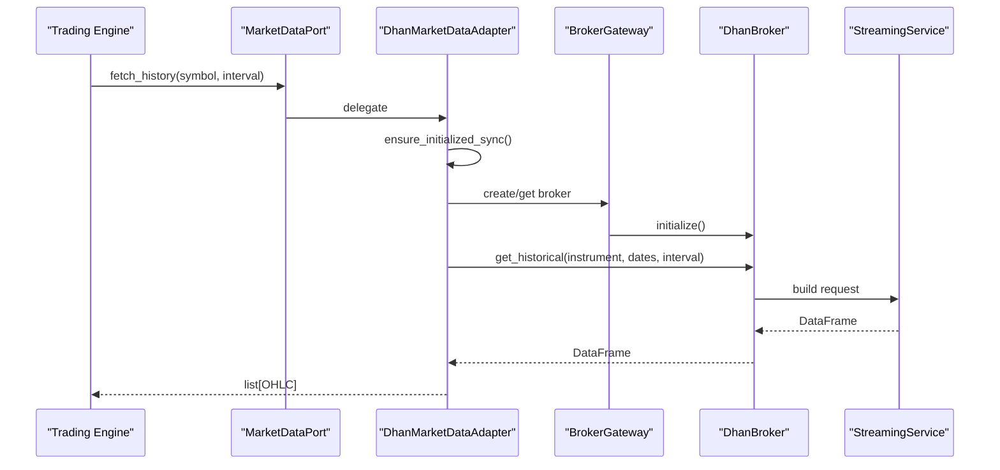
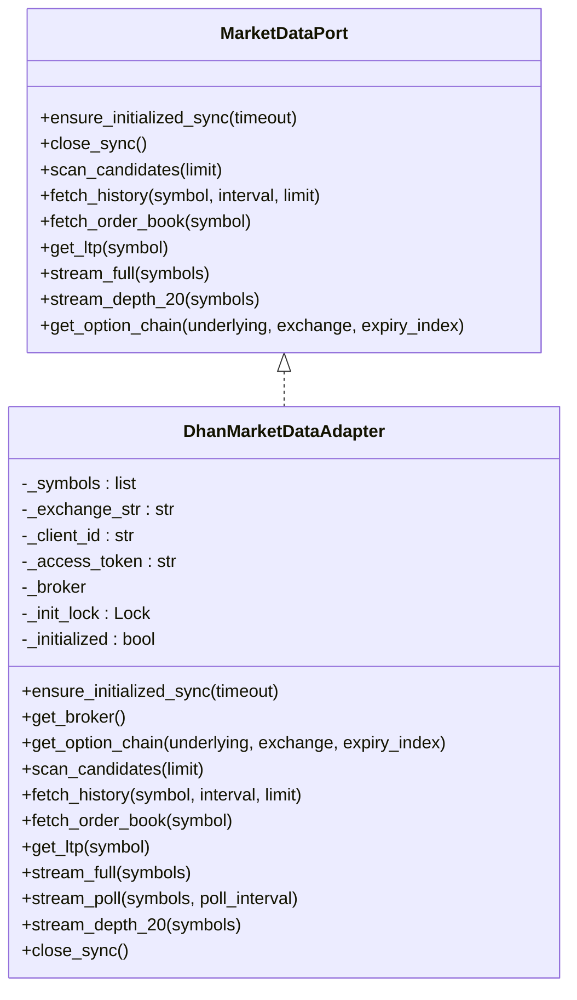
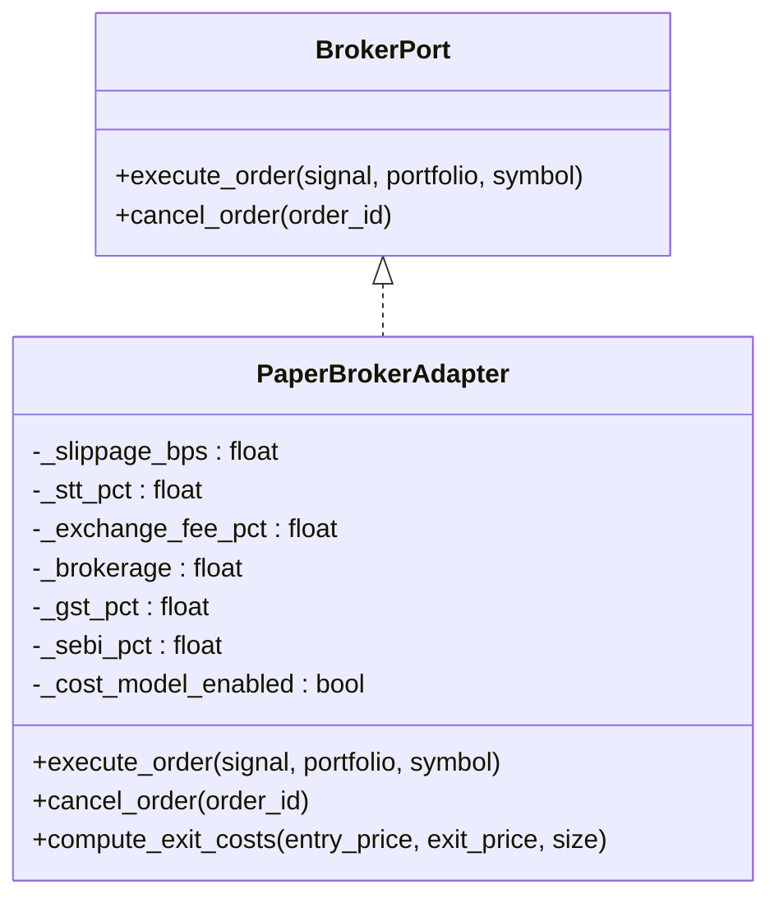
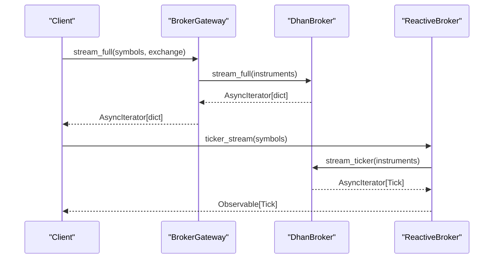
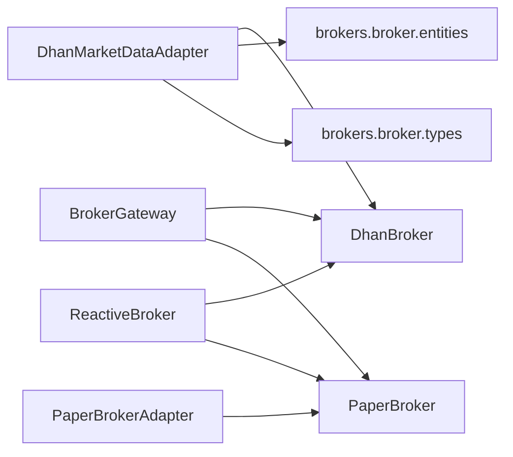

# Broker Adapters

<cite>
**Referenced Files in This Document**
- [dhan_adapter.py](file://backend/app/infrastructure/adapters/dhan_adapter.py)
- [paper_broker.py](file://backend/app/infrastructure/adapters/paper_broker.py)
- [broker.py](file://backend/app/domain/ports/broker.py)
- [market_data.py](file://backend/app/domain/ports/market_data.py)
- [gateway.py](file://brokers/gateway.py)
- [reactive.py](file://brokers/reactive.py)
- [broker.py](file://brokers/broker/paper/broker.py)
- [broker.py](file://brokers/broker/dhan/application/broker.py)
- [types.py](file://brokers/broker/types.py)
- [entities.py](file://brokers/broker/entities.py)
- [market_info.py](file://brokers/broker/market_info.py)
</cite>

## Table of Contents
1. [Introduction](#introduction)
2. [Project Structure](#project-structure)
3. [Core Components](#core-components)
4. [Architecture Overview](#architecture-overview)
5. [Detailed Component Analysis](#detailed-component-analysis)
6. [Dependency Analysis](#dependency-analysis)
7. [Performance Considerations](#performance-considerations)
8. [Troubleshooting Guide](#troubleshooting-guide)
9. [Conclusion](#conclusion)
10. [Appendices](#appendices)

## Introduction
This document describes the GlassyTrade AI broker adapters subsystem with a focus on:
- DhanMarketDataAdapter for NSE/NFO/MCX market data integration (WebSocket streaming, historical data, order book depth, and option chain retrieval)
- PaperBroker adapter for simulated trading environments
- Adapter contract interfaces, initialization patterns, error handling, and performance optimizations
- Practical configuration, symbol resolution, exchange mapping, and fallback mechanisms
- Threading-safe initialization, async/sync compatibility, and integration with the broader trading pipeline

## Project Structure
The broker adapters subsystem spans two primary layers:
- Backend adapters: MarketDataPort and BrokerPort implementations for Dhan and Paper
- Brokers library: A reusable, reactive, and resilient broker abstraction with Dhan and Paper implementations

**Diagram sources**
- [dhan_adapter.py:66-457](file://backend/app/infrastructure/adapters/dhan_adapter.py#L66-L457)
- [paper_broker.py:118-199](file://backend/app/infrastructure/adapters/paper_broker.py#L118-L199)
- [market_data.py:19-112](file://backend/app/domain/ports/market_data.py#L19-L112)
- [broker.py:11-27](file://backend/app/domain/ports/broker.py#L11-L27)
- [gateway.py:154-423](file://brokers/gateway.py#L154-L423)
- [reactive.py:61-800](file://brokers/reactive.py#L61-L800)
- [broker.py:76-823](file://brokers/broker/dhan/application/broker.py#L76-L823)
- [broker.py:51-397](file://brokers/broker/paper/broker.py#L51-L397)

**Section sources**
- [dhan_adapter.py:1-457](file://backend/app/infrastructure/adapters/dhan_adapter.py#L1-L457)
- [paper_broker.py:1-199](file://backend/app/infrastructure/adapters/paper_broker.py#L1-L199)
- [market_data.py:1-112](file://backend/app/domain/ports/market_data.py#L1-L112)
- [broker.py:1-27](file://backend/app/domain/ports/broker.py#L1-L27)
- [gateway.py:1-423](file://brokers/gateway.py#L1-L423)
- [reactive.py:1-800](file://brokers/reactive.py#L1-L800)
- [broker.py:1-823](file://brokers/broker/dhan/application/broker.py#L1-L823)
- [broker.py:1-397](file://brokers/broker/paper/broker.py#L1-L397)

## Core Components
- DhanMarketDataAdapter: Implements MarketDataPort using the brokers/ DhanBroker. Provides historical data, quotes, full packets, 20-level depth, and option chain retrieval. Includes a thread-safe initialization guard and fallback REST polling for MCX OPTFUT.
- PaperBrokerAdapter: Implements BrokerPort with a realistic cost model for simulated trading, including slippage, STT, exchange fees, brokerage, GST, and SEBI charges.
- Domain contracts: MarketDataPort and BrokerPort define the abstract interfaces for market data providers and order executors respectively.
- Brokers library: BrokerGateway and ReactiveBroker provide unified APIs, circuit breakers, and reactive streams over Dhan and Paper brokers.

Key capabilities:
- Exchange mapping and symbol detection for NSE/NFO/MCX
- Option chain retrieval with expiry and strike handling
- Streaming via WebSocket with fallback polling
- Cost-aware paper trading execution

**Section sources**
- [dhan_adapter.py:66-457](file://backend/app/infrastructure/adapters/dhan_adapter.py#L66-L457)
- [paper_broker.py:118-199](file://backend/app/infrastructure/adapters/paper_broker.py#L118-L199)
- [market_data.py:19-112](file://backend/app/domain/ports/market_data.py#L19-L112)
- [broker.py:11-27](file://backend/app/domain/ports/broker.py#L11-L27)
- [gateway.py:154-423](file://brokers/gateway.py#L154-L423)
- [reactive.py:61-800](file://brokers/reactive.py#L61-L800)

## Architecture Overview
The adapters integrate with the broader trading pipeline through standardized ports and the brokers library.

**Diagram sources**
- [dhan_adapter.py:214-318](file://backend/app/infrastructure/adapters/dhan_adapter.py#L214-L318)
- [gateway.py:230-247](file://brokers/gateway.py#L230-L247)
- [broker.py:510-522](file://brokers/broker/dhan/application/broker.py#L510-L522)

## Detailed Component Analysis

### DhanMarketDataAdapter
Implements MarketDataPort and adapts the brokers/ DhanBroker for GlassyTrade’s needs.

- Initialization patterns
  - Thread-safe guard using a lock to ensure exactly one initialization runs concurrently across sync and async contexts.
  - Synchronous path creates a temporary event loop to run async initialize() with a configurable timeout.
  - Asynchronous path calls initialize() directly within an event loop.

- Exchange mapping and symbol resolution
  - Converts exchange strings to brokers.Exchange enums with fallback to NSE.
  - Auto-detects options by symbol suffixes or CALL/PUT keywords and routes to NFO or MCX depending on the underlying.
  - Builds Instrument objects with option_type for downstream routing.

- Market data retrieval
  - Historical: maps common intervals to Dhan-specific intervals, computes delta proxy when taker_buy_volume is unavailable, and returns OHLC with VWAP.
  - LTP: synchronous wrapper around broker.get_ltp().
  - Order book: constructs OrderBook from bid/ask depths returned by broker.get_quote().
  - Option chain: converts exchange string to enum and delegates to broker.get_option_chain().

- Streaming
  - stream_full: yields FullPacket dicts converted to dictionaries for compatibility.
  - stream_depth_20: yields MarketDepth objects for 20-level depth.
  - stream_poll: REST fallback polling for MCX OPTFUT where WebSocket may be limited.

- Shutdown
  - close_sync: closes the underlying DhanBroker and disconnects its WebSocket.

**Diagram sources**
- [market_data.py:19-112](file://backend/app/domain/ports/market_data.py#L19-L112)
- [dhan_adapter.py:66-457](file://backend/app/infrastructure/adapters/dhan_adapter.py#L66-L457)

**Section sources**
- [dhan_adapter.py:66-457](file://backend/app/infrastructure/adapters/dhan_adapter.py#L66-L457)

### PaperBrokerAdapter
Implements BrokerPort for realistic simulated trading with a comprehensive cost model.

- Cost computation
  - Slippage: directional slippage on notional
  - STT: applicable on sell side for options
  - Exchange fee: applied on both sides
  - Brokerage: flat per order × 2
  - GST: on brokerage only
  - SEBI: turnover charge on both sides

- Execution behavior
  - Opens positions with optional scale-in support
  - Applies cost model on entry and exit
  - Returns None if order rejected (not implemented in adapter)

**Diagram sources**
- [broker.py:11-27](file://backend/app/domain/ports/broker.py#L11-L27)
- [paper_broker.py:118-199](file://backend/app/infrastructure/adapters/paper_broker.py#L118-L199)

**Section sources**
- [paper_broker.py:1-199](file://backend/app/infrastructure/adapters/paper_broker.py#L1-L199)

### Adapter Contracts and Interfaces
- MarketDataPort defines the contract for market data providers, including lifecycle hooks, historical queries, order book retrieval, LTP, streaming endpoints, and optional option chain support.
- BrokerPort defines the contract for order execution, including order placement and cancellation.

These contracts enable swapping implementations (Dhan vs Paper) without changing the rest of the system.

**Section sources**
- [market_data.py:1-112](file://backend/app/domain/ports/market_data.py#L1-L112)
- [broker.py:1-27](file://backend/app/domain/ports/broker.py#L1-L27)

### Brokers Library Integration
- BrokerGateway provides a unified API over Dhan and Paper brokers, with circuit breaker protection and convenience methods for quotes, historical data, streaming, and option chains.
- ReactiveBroker wraps any IBrokerPort with RxPY Observables, enabling functional reactive programming patterns and operators.

**Diagram sources**
- [gateway.py:389-394](file://brokers/gateway.py#L389-L394)
- [reactive.py:219-251](file://brokers/reactive.py#L219-L251)
- [broker.py:652-662](file://brokers/broker/dhan/application/broker.py#L652-L662)

**Section sources**
- [gateway.py:154-423](file://brokers/gateway.py#L154-L423)
- [reactive.py:61-800](file://brokers/reactive.py#L61-L800)
- [broker.py:1-823](file://brokers/broker/dhan/application/broker.py#L1-L823)

## Dependency Analysis
- DhanMarketDataAdapter depends on:
  - brokers.broker.dhan.application.DhanBroker for market data, historical, streaming, and options
  - brokers.broker.entities for Instrument, OptionType, OrderBook, etc.
  - brokers.broker.types for Exchange and OptionType
  - shared.timezones for IST conversions

- PaperBrokerAdapter depends on:
  - app.domain.ports.broker.BrokerPort
  - app.domain.trading.models for Position, Signal, Portfolio
  - TradeCosts computation for realistic cost modeling

- Brokers library provides:
  - BrokerGateway and ReactiveBroker abstractions
  - DhanBroker and PaperBroker implementations
  - Entities and types re-exported from shared layers

**Diagram sources**
- [dhan_adapter.py:29-34](file://backend/app/infrastructure/adapters/dhan_adapter.py#L29-L34)
- [entities.py:8-25](file://brokers/broker/entities.py#L8-L25)
- [types.py:5-11](file://brokers/broker/types.py#L5-L11)
- [gateway.py:111-133](file://brokers/gateway.py#L111-L133)
- [reactive.py:115-133](file://brokers/reactive.py#L115-L133)
- [broker.py:76-136](file://brokers/broker/dhan/application/broker.py#L76-L136)
- [broker.py:51-74](file://brokers/broker/paper/broker.py#L51-L74)

**Section sources**
- [dhan_adapter.py:1-457](file://backend/app/infrastructure/adapters/dhan_adapter.py#L1-L457)
- [paper_broker.py:1-199](file://backend/app/infrastructure/adapters/paper_broker.py#L1-L199)
- [gateway.py:1-423](file://brokers/gateway.py#L1-L423)
- [reactive.py:1-800](file://brokers/reactive.py#L1-L800)
- [entities.py:1-47](file://brokers/broker/entities.py#L1-L47)
- [types.py:1-20](file://brokers/broker/types.py#L1-L20)
- [broker.py:1-823](file://brokers/broker/dhan/application/broker.py#L1-L823)
- [broker.py:1-397](file://brokers/broker/paper/broker.py#L1-L397)

## Performance Considerations
- Threading-safe initialization
  - Uses a lock to prevent redundant initialization and race conditions across sync and async callers.
  - Synchronous path spins up a temporary event loop only when needed.

- Streaming efficiency
  - stream_full yields FullPacket dicts to minimize conversion overhead.
  - stream_depth_20 leverages dedicated depth feeds for up to 50 NSE instruments.
  - stream_poll provides a lightweight fallback for MCX OPTFUT where WebSocket is constrained.

- Data transformations
  - Historical OHLC construction avoids unnecessary copies and uses efficient iteration.
  - Delta approximation avoids dependency on unavailable taker_buy_volume for NSE.

- Circuit breaking and resilience
  - BrokerGateway integrates a circuit breaker to protect upstream services.
  - ReactiveBroker isolates async streams and manages subscriptions with proper cancellation.

[No sources needed since this section provides general guidance]

## Troubleshooting Guide
Common issues and remedies:
- Initialization failures
  - Symptom: DhanBroker initialization fails in ensure_initialized_sync.
  - Action: Verify credentials and network connectivity; check logs for detailed exceptions.

- No data returned
  - Symptom: fetch_history returns empty list; fetch_order_book returns None; get_ltp returns 0.0.
  - Action: Confirm symbol resolution and exchange mapping; ensure broker is initialized; validate instrument cache.

- WebSocket limitations for MCX OPTFUT
  - Symptom: stream_full yields no data for certain MCX options.
  - Action: Use stream_poll fallback to REST LTP polling.

- Option chain unavailable
  - Symptom: get_option_chain returns None.
  - Action: Verify exchange mapping and underlying type; confirm the instrument supports options.

- Cost model discrepancies in paper trading
  - Symptom: unexpected entry/exit costs.
  - Action: Review cost parameters and slippage basis points; ensure cost_model_enabled is set appropriately.

**Section sources**
- [dhan_adapter.py:102-147](file://backend/app/infrastructure/adapters/dhan_adapter.py#L102-L147)
- [dhan_adapter.py:214-318](file://backend/app/infrastructure/adapters/dhan_adapter.py#L214-L318)
- [dhan_adapter.py:364-434](file://backend/app/infrastructure/adapters/dhan_adapter.py#L364-L434)
- [paper_broker.py:139-199](file://backend/app/infrastructure/adapters/paper_broker.py#L139-L199)

## Conclusion
The GlassyTrade broker adapters subsystem cleanly separates concerns through domain contracts and leverages the brokers library for robust, reactive, and resilient market data and order execution. DhanMarketDataAdapter provides comprehensive coverage for NSE/NFO/MCX with thread-safe initialization, streaming, and fallbacks. PaperBrokerAdapter enables realistic simulation with a detailed cost model. Together, they integrate seamlessly with the broader trading pipeline and support scalable, maintainable trading systems.

[No sources needed since this section summarizes without analyzing specific files]

## Appendices

### Practical Examples

- Broker configuration
  - DhanMarketDataAdapter: Provide client_id and access_token during instantiation; initialization is lazy and guarded.
  - PaperBrokerAdapter: Configure cost parameters and enable/disable cost model as needed.

- Symbol resolution and exchange mapping
  - DhanMarketDataAdapter auto-detects options and routes to NFO or MCX based on underlying; fallback to NSE for unknown exchanges.
  - MarketInfo utilities provide lot sizes, step sizes, and expiry information for downstream logic.

- Fallback mechanisms
  - stream_poll REST polling for MCX OPTFUT when WebSocket is limited.
  - Option chain retrieval falls back to None if unavailable.

- Integration with trading pipeline
  - MarketDataPort implementations plug into the trading engine for historical and streaming data.
  - BrokerPort implementations integrate with order lifecycle services.

**Section sources**
- [dhan_adapter.py:49-63](file://backend/app/infrastructure/adapters/dhan_adapter.py#L49-L63)
- [dhan_adapter.py:167-189](file://backend/app/infrastructure/adapters/dhan_adapter.py#L167-L189)
- [dhan_adapter.py:383-434](file://backend/app/infrastructure/adapters/dhan_adapter.py#L383-L434)
- [market_info.py:28-115](file://brokers/broker/market_info.py#L28-L115)
- [gateway.py:230-247](file://brokers/gateway.py#L230-L247)