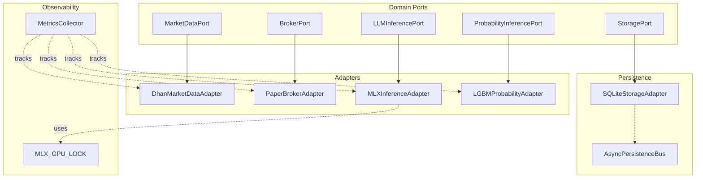
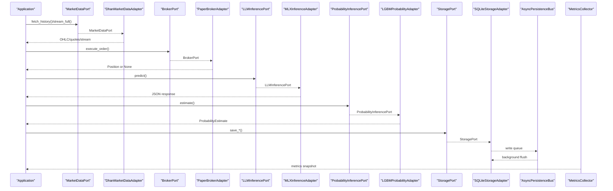
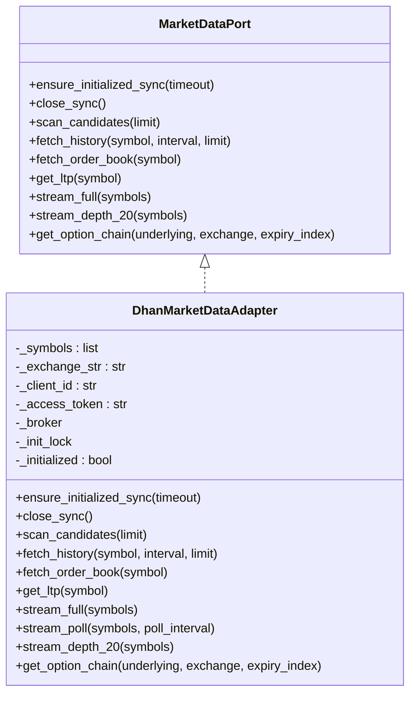
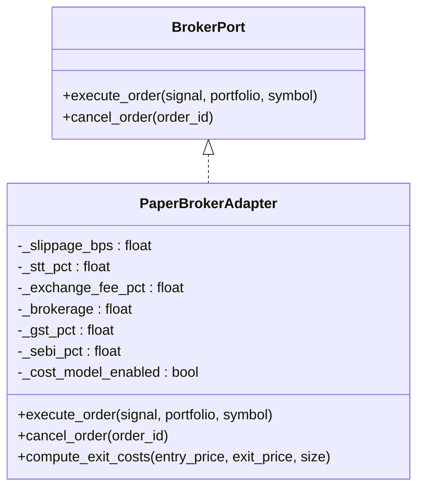
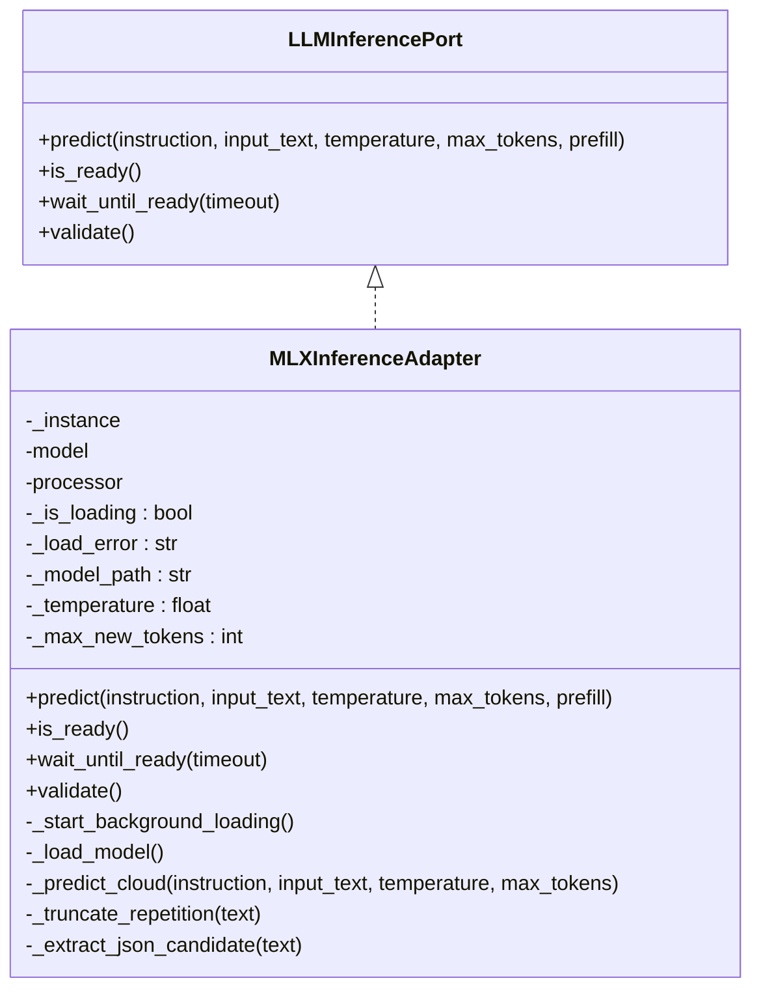
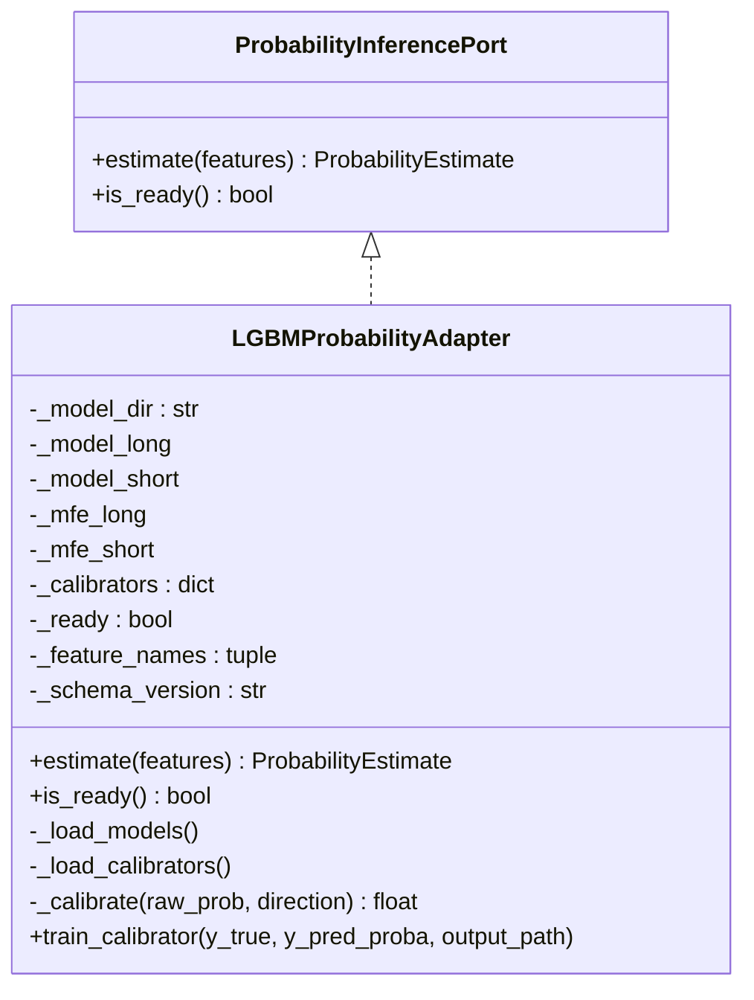
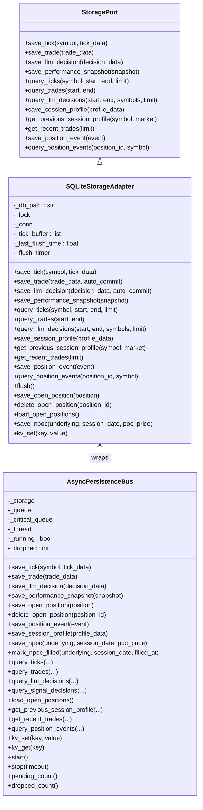
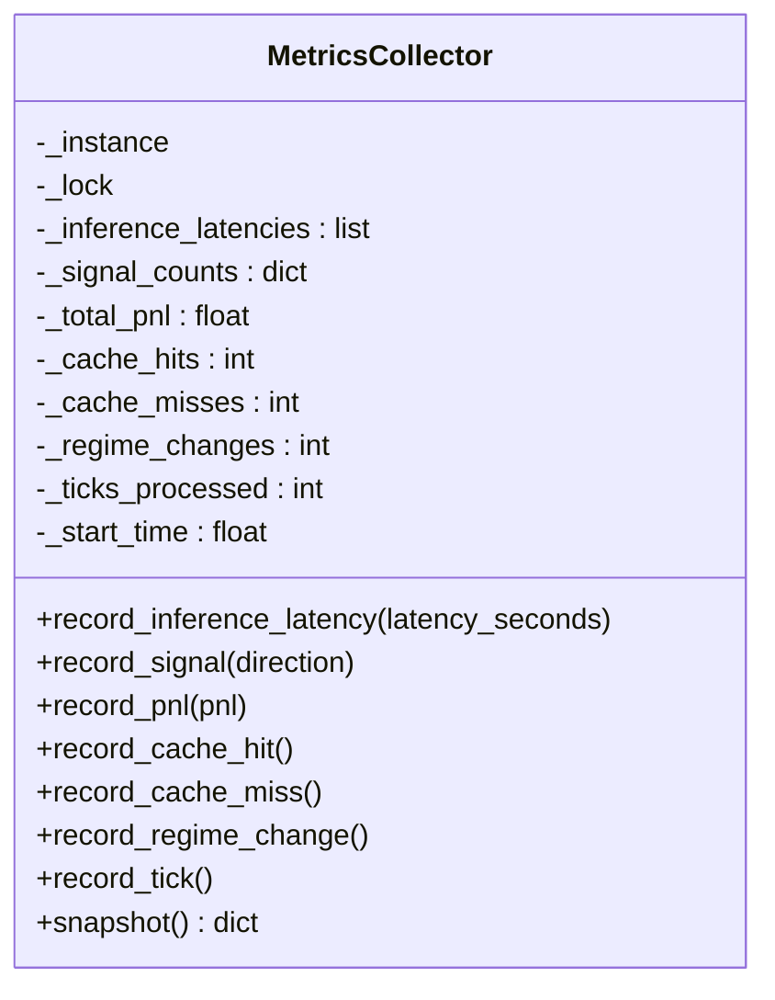
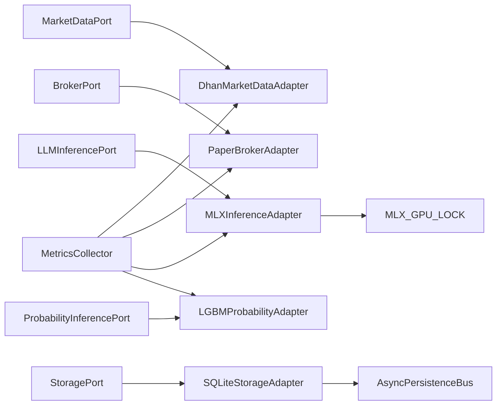

# Infrastructure Adapters

<cite>
**Referenced Files in This Document**
- [market_data.py](file://backend/app/domain/ports/market_data.py)
- [broker.py](file://backend/app/domain/ports/broker.py)
- [llm_inference.py](file://backend/app/domain/ports/llm_inference.py)
- [probability_inference.py](file://backend/app/domain/ports/probability_inference.py)
- [storage.py](file://backend/app/domain/ports/storage.py)
- [dhan_adapter.py](file://backend/app/infrastructure/adapters/dhan_adapter.py)
- [paper_broker.py](file://backend/app/infrastructure/adapters/paper_broker.py)
- [mlx_inference_adapter.py](file://backend/app/infrastructure/adapters/mlx_inference_adapter.py)
- [lgbm_probability_adapter.py](file://backend/app/infrastructure/adapters/lgbm_probability_adapter.py)
- [database.py](file://backend/app/infrastructure/storage/database.py)
- [metrics.py](file://backend/app/infrastructure/metrics.py)
- [async_persistence.py](file://backend/app/infrastructure/async_persistence.py)
- [mlx_gpu_lock.py](file://backend/app/infrastructure/mlx_gpu_lock.py)
</cite>

## Table of Contents
1. [Introduction](#introduction)
2. [Project Structure](#project-structure)
3. [Core Components](#core-components)
4. [Architecture Overview](#architecture-overview)
5. [Detailed Component Analysis](#detailed-component-analysis)
6. [Dependency Analysis](#dependency-analysis)
7. [Performance Considerations](#performance-considerations)
8. [Troubleshooting Guide](#troubleshooting-guide)
9. [Conclusion](#conclusion)
10. [Appendices](#appendices)

## Introduction
This document explains the GlassyTrade AI infrastructure adapters layer. It covers:
- Market data integration via DhanAdapter
- Simulated trading via PaperBroker
- Apple Silicon–optimized machine learning inference via MLXInferenceAdapter
- Gradient boosting probability inference via LGBMProbabilityAdapter
- Persistent storage via Database adapter
- Observability via Metrics service

It provides adapter contract interfaces, configuration management, error handling strategies, performance optimization techniques, and testing approaches for each adapter type.

## Project Structure
The adapters reside in the infrastructure layer and implement domain ports. Supporting infrastructure includes asynchronous persistence, metrics collection, and GPU locking for Apple Silicon.

**Diagram sources**
- [market_data.py:19-112](file://backend/app/domain/ports/market_data.py#L19-L112)
- [broker.py:11-27](file://backend/app/domain/ports/broker.py#L11-L27)
- [llm_inference.py:10-42](file://backend/app/domain/ports/llm_inference.py#L10-L42)
- [probability_inference.py:19-44](file://backend/app/domain/ports/probability_inference.py#L19-L44)
- [storage.py:54-121](file://backend/app/domain/ports/storage.py#L54-L121)
- [dhan_adapter.py:66-457](file://backend/app/infrastructure/adapters/dhan_adapter.py#L66-L457)
- [paper_broker.py:118-199](file://backend/app/infrastructure/adapters/paper_broker.py#L118-L199)
- [mlx_inference_adapter.py:12-396](file://backend/app/infrastructure/adapters/mlx_inference_adapter.py#L12-L396)
- [lgbm_probability_adapter.py:24-167](file://backend/app/infrastructure/adapters/lgbm_probability_adapter.py#L24-L167)
- [database.py:183-800](file://backend/app/infrastructure/storage/database.py#L183-L800)
- [async_persistence.py:24-277](file://backend/app/infrastructure/async_persistence.py#L24-L277)
- [metrics.py:14-98](file://backend/app/infrastructure/metrics.py#L14-L98)
- [mlx_gpu_lock.py:1-19](file://backend/app/infrastructure/mlx_gpu_lock.py#L1-L19)

**Section sources**
- [market_data.py:1-112](file://backend/app/domain/ports/market_data.py#L1-L112)
- [broker.py:1-27](file://backend/app/domain/ports/broker.py#L1-L27)
- [llm_inference.py:1-42](file://backend/app/domain/ports/llm_inference.py#L1-L42)
- [probability_inference.py:1-44](file://backend/app/domain/ports/probability_inference.py#L1-L44)
- [storage.py:1-121](file://backend/app/domain/ports/storage.py#L1-L121)

## Core Components
- MarketDataPort: Defines market data queries and streaming contracts.
- BrokerPort: Defines order execution and cancellation contracts.
- LLMInferencePort: Defines LLM inference readiness and prediction contracts.
- ProbabilityInferencePort: Defines first-passage probability estimation contracts.
- StoragePort: Defines tick/trade/decision persistence and queries.

Implementation adapters:
- DhanMarketDataAdapter: Implements MarketDataPort using the Dhan broker library.
- PaperBrokerAdapter: Implements BrokerPort with a realistic cost model for paper trading.
- MLXInferenceAdapter: Implements LLMInferencePort using Apple Silicon MLX runtime with cloud fallback.
- LGBMProbabilityAdapter: Implements ProbabilityInferencePort using LightGBM models.
- SQLiteStorageAdapter: Implements StoragePort with SQLite, WAL mode, and batching.
- AsyncPersistenceBus: Offloads storage writes to a background thread.
- MetricsCollector: Tracks latency, signals, PnL, cache stats, and regime changes.

**Section sources**
- [dhan_adapter.py:66-457](file://backend/app/infrastructure/adapters/dhan_adapter.py#L66-L457)
- [paper_broker.py:118-199](file://backend/app/infrastructure/adapters/paper_broker.py#L118-L199)
- [mlx_inference_adapter.py:12-396](file://backend/app/infrastructure/adapters/mlx_inference_adapter.py#L12-L396)
- [lgbm_probability_adapter.py:24-167](file://backend/app/infrastructure/adapters/lgbm_probability_adapter.py#L24-L167)
- [database.py:183-800](file://backend/app/infrastructure/storage/database.py#L183-L800)
- [async_persistence.py:24-277](file://backend/app/infrastructure/async_persistence.py#L24-L277)
- [metrics.py:14-98](file://backend/app/infrastructure/metrics.py#L14-L98)

## Architecture Overview
The adapters layer sits between the domain and external systems. Domain ports define contracts; adapters implement them. Persistence is decoupled via AsyncPersistenceBus and a concrete SQLite adapter. Metrics are collected centrally.

**Diagram sources**
- [market_data.py:19-112](file://backend/app/domain/ports/market_data.py#L19-L112)
- [broker.py:11-27](file://backend/app/domain/ports/broker.py#L11-L27)
- [llm_inference.py:10-42](file://backend/app/domain/ports/llm_inference.py#L10-L42)
- [probability_inference.py:19-44](file://backend/app/domain/ports/probability_inference.py#L19-L44)
- [storage.py:54-121](file://backend/app/domain/ports/storage.py#L54-L121)
- [dhan_adapter.py:66-457](file://backend/app/infrastructure/adapters/dhan_adapter.py#L66-L457)
- [paper_broker.py:118-199](file://backend/app/infrastructure/adapters/paper_broker.py#L118-L199)
- [mlx_inference_adapter.py:12-396](file://backend/app/infrastructure/adapters/mlx_inference_adapter.py#L12-L396)
- [lgbm_probability_adapter.py:24-167](file://backend/app/infrastructure/adapters/lgbm_probability_adapter.py#L24-L167)
- [database.py:183-800](file://backend/app/infrastructure/storage/database.py#L183-L800)
- [async_persistence.py:24-277](file://backend/app/infrastructure/async_persistence.py#L24-L277)
- [metrics.py:14-98](file://backend/app/infrastructure/metrics.py#L14-L98)

## Detailed Component Analysis

### DhanMarketDataAdapter
Implements MarketDataPort using the Dhan broker library. Provides:
- Historical OHLCV with delta proxy computation
- Quote snapshots and order book retrieval
- Synchronous LTP and live streaming
- Option chain retrieval with exchange routing
- REST polling fallback for specific instruments

Key behaviors:
- Lazy initialization guarded by a lock to avoid race conditions across sync/async contexts
- Exchange and option symbol detection
- Streaming with periodic logs and packet counting
- Graceful fallbacks and logging on failures

**Diagram sources**
- [market_data.py:19-112](file://backend/app/domain/ports/market_data.py#L19-L112)
- [dhan_adapter.py:66-457](file://backend/app/infrastructure/adapters/dhan_adapter.py#L66-L457)

Practical implementation patterns:
- Initialize once and reuse the broker instance
- Map intervals and exchanges to Dhan’s expectations
- Normalize timestamps to the configured timezone
- Use delta proxy when taker buy volume is unavailable

External service integration:
- DhanBroker via brokers package
- REST polling fallback for specific futures options

Error handling:
- Exceptions are logged and surfaced to callers
- Empty results return sensible defaults per port contract

Performance optimization:
- Batched tick writes via AsyncPersistenceBus
- Streaming throttling and periodic logs
- Lazy initialization and caching

Configuration management:
- Environment-driven client credentials
- Exchange and interval normalization

Testing approaches:
- Unit tests validate adapter methods and error paths
- Integration tests exercise streaming and polling

**Section sources**
- [dhan_adapter.py:66-457](file://backend/app/infrastructure/adapters/dhan_adapter.py#L66-L457)
- [market_data.py:19-112](file://backend/app/domain/ports/market_data.py#L19-L112)

### PaperBrokerAdapter
Implements BrokerPort for paper trading with a realistic cost model:
- Slippage, STT, exchange fees, brokerage, GST, SEBI charges
- Contract-type-specific slippage basis points
- Entry/exit cost computations
- Scale-in behavior for LLM-generated entries

**Diagram sources**
- [broker.py:11-27](file://backend/app/domain/ports/broker.py#L11-L27)
- [paper_broker.py:118-199](file://backend/app/infrastructure/adapters/paper_broker.py#L118-L199)

Practical implementation patterns:
- Cost model enabled/disabled via constructor
- Entry price adjusted by slippage before position opening
- Exit costs computed separately for accurate PnL accounting

External service integration:
- Delegates to Portfolio.open_position for invariants and state transitions

Error handling:
- Returns None on rejection; logs cost breakdown for transparency

Performance optimization:
- Minimal overhead—pure computation and delegation

Configuration management:
- Tunable cost parameters per deployment

Testing approaches:
- Unit tests validate cost calculations and position creation
- Integration tests simulate end-to-end paper execution

**Section sources**
- [paper_broker.py:118-199](file://backend/app/infrastructure/adapters/paper_broker.py#L118-L199)
- [broker.py:11-27](file://backend/app/domain/ports/broker.py#L11-L27)

### MLXInferenceAdapter
Implements LLMInferencePort for Apple Silicon using MLX runtime with:
- Singleton model loader with background initialization
- Cloud fallback via OpenRouter when no local model
- GPU lock for Metal concurrency safety
- JSON-prefill and overseer-aware truncation
- Validation and readiness checks

**Diagram sources**
- [llm_inference.py:10-42](file://backend/app/domain/ports/llm_inference.py#L10-L42)
- [mlx_inference_adapter.py:12-396](file://backend/app/infrastructure/adapters/mlx_inference_adapter.py#L12-L396)
- [mlx_gpu_lock.py:1-19](file://backend/app/infrastructure/mlx_gpu_lock.py#L1-L19)

Practical implementation patterns:
- Background loading avoids blocking server startup
- Prefill injection ensures JSON-aligned outputs
- Overseer prompts receive specialized truncation
- Cloud fallback with exponential backoff for rate limits

External service integration:
- Local: mlx_vlm.load/generate
- Remote: OpenRouter chat completions

Error handling:
- LLMNotReadyError raised during loading or missing model
- Detailed logging for fallbacks and failures

Performance optimization:
- Metal GPU lock prevents crashes from concurrent submissions
- Deterministic sampling when no sampling overrides
- Timed generation reporting

Configuration management:
- Model path via constructor or environment variable
- Adapter path optional
- Cloud fallback requires API key and model identifier

Testing approaches:
- Unit tests validate readiness, prediction, and fallback behavior
- Integration tests verify GPU lock usage and JSON extraction

**Section sources**
- [mlx_inference_adapter.py:12-396](file://backend/app/infrastructure/adapters/mlx_inference_adapter.py#L12-L396)
- [llm_inference.py:10-42](file://backend/app/domain/ports/llm_inference.py#L10-L42)
- [mlx_gpu_lock.py:1-19](file://backend/app/infrastructure/mlx_gpu_lock.py#L1-L19)

### LGBMProbabilityAdapter
Implements ProbabilityInferencePort using LightGBM models:
- Loads separate long/short models and optional MFE quantiles
- Optional Platt scaling calibration via pickled LogisticRegression
- Feature schema validation and neutral estimates when models unavailable

**Diagram sources**
- [probability_inference.py:19-44](file://backend/app/domain/ports/probability_inference.py#L19-L44)
- [lgbm_probability_adapter.py:24-167](file://backend/app/infrastructure/adapters/lgbm_probability_adapter.py#L24-L167)

Practical implementation patterns:
- Feature payload constructed from active model features
- Raw probabilities clamped to [0, 1]
- Optional MFE quantiles for dynamic take-profit targets
- Calibrator training helper for online calibration

External service integration:
- LightGBM Booster models and scikit-learn LogisticRegression

Error handling:
- Neutral estimates when models are not loaded
- Logging for schema mismatches and load failures

Performance optimization:
- Efficient vectorized prediction with NumPy arrays
- Minimal overhead—single-threaded inference

Configuration management:
- Model directory path determines availability
- Schema version checked against runtime features

Testing approaches:
- Unit tests validate estimates, readiness, and calibration
- Integration tests verify model loading and MFE behavior

**Section sources**
- [lgbm_probability_adapter.py:24-167](file://backend/app/infrastructure/adapters/lgbm_probability_adapter.py#L24-L167)
- [probability_inference.py:19-44](file://backend/app/domain/ports/probability_inference.py#L19-L44)

### Database Storage Adapter
Implements StoragePort with SQLite:
- WAL mode for concurrency and durability
- Tick batching with background flush timer
- Unique index on (symbol, time) with deduplication
- Rich set of tables for ticks, trades, decisions, positions, events, profiles, and fine-tuning features
- Asynchronous persistence bus to remove I/O from the hot path

**Diagram sources**
- [storage.py:54-121](file://backend/app/domain/ports/storage.py#L54-L121)
- [database.py:183-800](file://backend/app/infrastructure/storage/database.py#L183-L800)
- [async_persistence.py:24-277](file://backend/app/infrastructure/async_persistence.py#L24-L277)

Practical implementation patterns:
- Tick batching reduces write frequency and contention
- Critical writes prioritized in the async bus
- JSON extras for flexible schema evolution
- Unique index on ticks to prevent duplicates

External service integration:
- SQLite via sqlite3 module
- Background thread worker for I/O

Error handling:
- Rollback on exceptions; warnings for dropped writes
- Deduplication on schema upgrade

Performance optimization:
- WAL mode and NORMAL synchronous setting
- Background flush timer and batch threshold
- Priority draining of critical writes

Configuration management:
- Database path configurable
- Index upgrades handled automatically

Testing approaches:
- Unit tests validate writes, queries, and indexing
- Integration tests cover async bus and critical paths

**Section sources**
- [database.py:183-800](file://backend/app/infrastructure/storage/database.py#L183-L800)
- [async_persistence.py:24-277](file://backend/app/infrastructure/async_persistence.py#L24-L277)
- [storage.py:54-121](file://backend/app/domain/ports/storage.py#L54-L121)

### Metrics Service
Collects and exposes operational metrics:
- Inference latency (count, average, p50, p95)
- Signal counts by direction
- Total PnL
- Cache hits/misses and hit rate
- Regime changes and ticks processed
- Uptime

**Diagram sources**
- [metrics.py:14-98](file://backend/app/infrastructure/metrics.py#L14-L98)

Practical implementation patterns:
- Thread-safe updates with bounded latency history
- Snapshot aggregates percentiles and totals

External service integration:
- Consumed by API endpoints and monitoring systems

Error handling:
- Defensive bounds and logging around percentile calculation

Performance optimization:
- Lock-protected snapshots avoid contention on hot path

Testing approaches:
- Unit tests validate aggregation and snapshot correctness

**Section sources**
- [metrics.py:14-98](file://backend/app/infrastructure/metrics.py#L14-L98)

## Dependency Analysis
- Adapters depend on domain ports for contracts and on external libraries for integrations.
- MLXInferenceAdapter depends on MLX_GPU_LOCK to serialize GPU operations.
- AsyncPersistenceBus wraps StoragePort to decouple I/O from the trading loop.
- MetricsCollector is independent and records from all adapters.

**Diagram sources**
- [market_data.py:19-112](file://backend/app/domain/ports/market_data.py#L19-L112)
- [broker.py:11-27](file://backend/app/domain/ports/broker.py#L11-L27)
- [llm_inference.py:10-42](file://backend/app/domain/ports/llm_inference.py#L10-L42)
- [probability_inference.py:19-44](file://backend/app/domain/ports/probability_inference.py#L19-L44)
- [storage.py:54-121](file://backend/app/domain/ports/storage.py#L54-L121)
- [dhan_adapter.py:66-457](file://backend/app/infrastructure/adapters/dhan_adapter.py#L66-L457)
- [paper_broker.py:118-199](file://backend/app/infrastructure/adapters/paper_broker.py#L118-L199)
- [mlx_inference_adapter.py:12-396](file://backend/app/infrastructure/adapters/mlx_inference_adapter.py#L12-L396)
- [lgbm_probability_adapter.py:24-167](file://backend/app/infrastructure/adapters/lgbm_probability_adapter.py#L24-L167)
- [database.py:183-800](file://backend/app/infrastructure/storage/database.py#L183-L800)
- [async_persistence.py:24-277](file://backend/app/infrastructure/async_persistence.py#L24-L277)
- [metrics.py:14-98](file://backend/app/infrastructure/metrics.py#L14-L98)
- [mlx_gpu_lock.py:1-19](file://backend/app/infrastructure/mlx_gpu_lock.py#L1-L19)

**Section sources**
- [dhan_adapter.py:66-457](file://backend/app/infrastructure/adapters/dhan_adapter.py#L66-L457)
- [paper_broker.py:118-199](file://backend/app/infrastructure/adapters/paper_broker.py#L118-L199)
- [mlx_inference_adapter.py:12-396](file://backend/app/infrastructure/adapters/mlx_inference_adapter.py#L12-L396)
- [lgbm_probability_adapter.py:24-167](file://backend/app/infrastructure/adapters/lgbm_probability_adapter.py#L24-L167)
- [database.py:183-800](file://backend/app/infrastructure/storage/database.py#L183-L800)
- [async_persistence.py:24-277](file://backend/app/infrastructure/async_persistence.py#L24-L277)
- [metrics.py:14-98](file://backend/app/infrastructure/metrics.py#L14-L98)
- [mlx_gpu_lock.py:1-19](file://backend/app/infrastructure/mlx_gpu_lock.py#L1-L19)

## Performance Considerations
- DhanMarketDataAdapter
  - Lazy initialization prevents redundant setup
  - Delta proxy avoids missing taker buy volume
- PaperBrokerAdapter
  - Cost model is pure computation; negligible overhead
- MLXInferenceAdapter
  - Background loading prevents cold-start latency
  - GPU lock prevents Metal crashes under concurrency
  - Cloud fallback with exponential backoff for rate limiting
- LGBMProbabilityAdapter
  - Vectorized predictions minimize Python overhead
  - Optional MFE quantiles enable dynamic TP
- Database and AsyncPersistenceBus
  - Tick batching and WAL mode improve throughput
  - Critical writes prioritized to avoid starvation
- MetricsCollector
  - Bounded latency history and thread-safe snapshots

[No sources needed since this section provides general guidance]

## Troubleshooting Guide
Common issues and resolutions:
- DhanMarketDataAdapter
  - Initialization failures: check credentials and network connectivity; inspect logs for detailed errors
  - Missing option chains: some exchanges/commodities do not expose options; adapter returns None gracefully
  - Streaming gaps: use REST polling fallback for specific instruments
- PaperBrokerAdapter
  - Cost discrepancies: verify cost parameters and contract types
  - Position not created: order may be rejected; check portfolio constraints
- MLXInferenceAdapter
  - Model not ready: wait until ready or configure cloud fallback; ensure GPU lock is held during generate
  - Cloud fallback errors: verify API key and model ID; watch for rate limits and retry with backoff
- LGBMProbabilityAdapter
  - Models not found: ensure model directory contains required files; adapter returns neutral estimates
  - Feature schema mismatch: align features with expected names and version
- Database and AsyncPersistenceBus
  - Queue drops: increase queue sizes or reduce write frequency; monitor dropped count
  - Index upgrade failures: logs indicate transient issues; retry or investigate schema
- MetricsCollector
  - Latency spikes: investigate inference or I/O bottlenecks; review snapshots for trends

**Section sources**
- [dhan_adapter.py:66-457](file://backend/app/infrastructure/adapters/dhan_adapter.py#L66-L457)
- [paper_broker.py:118-199](file://backend/app/infrastructure/adapters/paper_broker.py#L118-L199)
- [mlx_inference_adapter.py:12-396](file://backend/app/infrastructure/adapters/mlx_inference_adapter.py#L12-L396)
- [lgbm_probability_adapter.py:24-167](file://backend/app/infrastructure/adapters/lgbm_probability_adapter.py#L24-L167)
- [database.py:183-800](file://backend/app/infrastructure/storage/database.py#L183-L800)
- [async_persistence.py:24-277](file://backend/app/infrastructure/async_persistence.py#L24-L277)
- [metrics.py:14-98](file://backend/app/infrastructure/metrics.py#L14-L98)

## Conclusion
The adapters layer cleanly separates domain logic from infrastructure concerns. Each adapter adheres to its port contract, integrates with external systems thoughtfully, and incorporates robust error handling and performance optimizations. Together with asynchronous persistence and centralized metrics, the system achieves reliability, scalability, and observability.

[No sources needed since this section summarizes without analyzing specific files]

## Appendices

### Adapter Contract Interfaces
- MarketDataPort: defines market data queries and streaming
- BrokerPort: defines order execution and cancellation
- LLMInferencePort: defines inference readiness and prediction
- ProbabilityInferencePort: defines probability estimation and readiness
- StoragePort: defines persistence and querying

**Section sources**
- [market_data.py:19-112](file://backend/app/domain/ports/market_data.py#L19-L112)
- [broker.py:11-27](file://backend/app/domain/ports/broker.py#L11-L27)
- [llm_inference.py:10-42](file://backend/app/domain/ports/llm_inference.py#L10-L42)
- [probability_inference.py:19-44](file://backend/app/domain/ports/probability_inference.py#L19-L44)
- [storage.py:54-121](file://backend/app/domain/ports/storage.py#L54-L121)

### Configuration Management
- DhanMarketDataAdapter: client credentials via constructor/environment
- MLXInferenceAdapter: model path, adapter path, and cloud fallback via environment variables
- LGBMProbabilityAdapter: model directory path
- SQLiteStorageAdapter: database path
- AsyncPersistenceBus: queue sizes and critical write handling

**Section sources**
- [dhan_adapter.py:74-88](file://backend/app/infrastructure/adapters/dhan_adapter.py#L74-L88)
- [mlx_inference_adapter.py:23-36](file://backend/app/infrastructure/adapters/mlx_inference_adapter.py#L23-L36)
- [lgbm_probability_adapter.py:27-37](file://backend/app/infrastructure/adapters/lgbm_probability_adapter.py#L27-L37)
- [database.py:186-196](file://backend/app/infrastructure/storage/database.py#L186-L196)
- [async_persistence.py:27-40](file://backend/app/infrastructure/async_persistence.py#L27-L40)

### Testing Approaches
- Unit tests validate contracts, readiness, predictions, and error paths
- Integration tests cover end-to-end flows and persistence
- Mocks and fixtures isolate adapters from external systems

[No sources needed since this section provides general guidance]