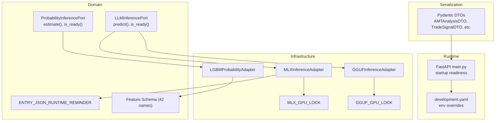
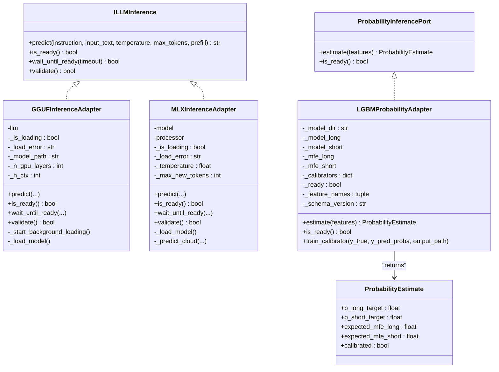
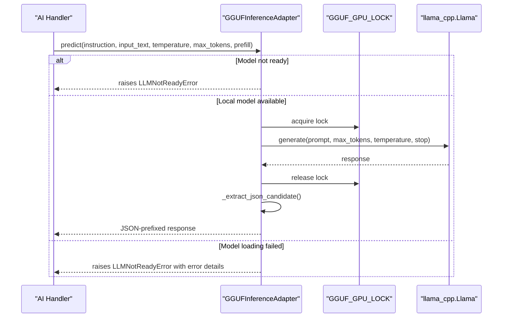
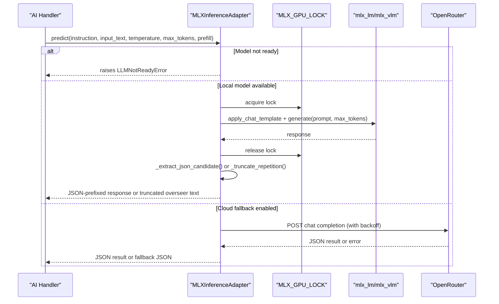
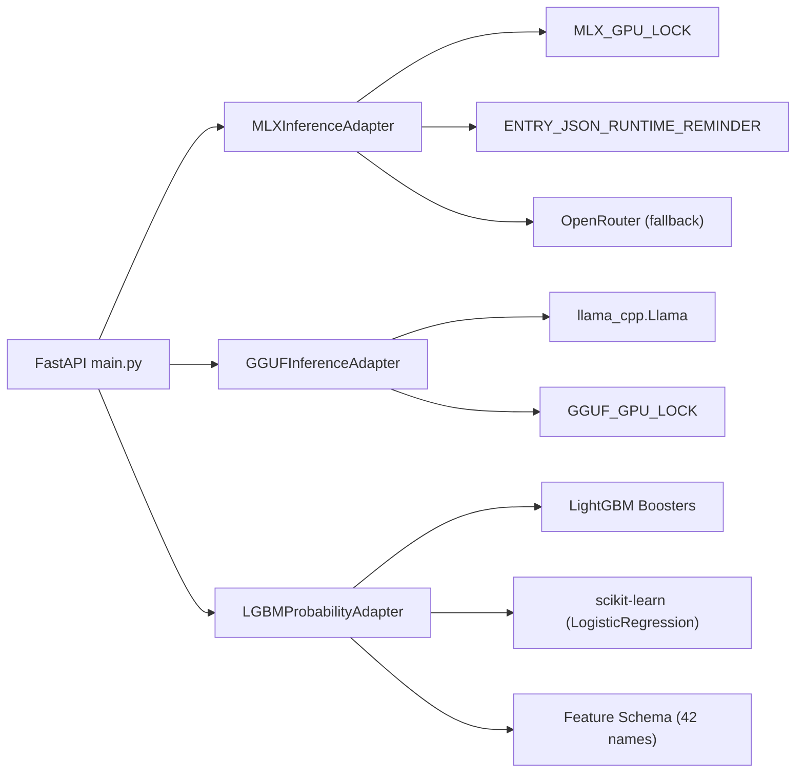

# ML Inference Adapters

<cite>
**Referenced Files in This Document**
- [gguf_inference_adapter.py](file://backend/app/infrastructure/adapters/gguf_inference_adapter.py)
- [mlx_inference_adapter.py](file://backend/app/infrastructure/adapters/mlx_inference_adapter.py)
- [lgbm_probability_adapter.py](file://backend/app/infrastructure/adapters/lgbm_probability_adapter.py)
- [llm_inference.py](file://backend/app/domain/ports/llm_inference.py)
- [probability_inference.py](file://backend/app/domain/ports/probability_inference.py)
- [llm_contract.py](file://backend/app/domain/fabio_ai/services/llm_contract.py)
- [features.py](file://backend/app/domain/probability/features.py)
- [mlx_gpu_lock.py](file://backend/app/infrastructure/mlx_gpu_lock.py)
- [schemas.py](file://backend/app/infrastructure/serialization/schemas.py)
- [main.py](file://backend/app/main.py)
- [development.yaml](file://backend/config/environments/development.yaml)
</cite>

## Update Summary
**Changes Made**
- Added new GGUFInferenceAdapter for GGUF-format model support using llama-cpp-python
- Enhanced MLXInferenceAdapter with improved environment variable loading and Metal GPU serialization
- Updated architecture diagrams to include the new GGUF adapter
- Added GGUF-specific configuration and environment variables
- Improved error handling and model validation for both adapters

## Table of Contents
1. [Introduction](#introduction)
2. [Project Structure](#project-structure)
3. [Core Components](#core-components)
4. [Architecture Overview](#architecture-overview)
5. [Detailed Component Analysis](#detailed-component-analysis)
6. [Dependency Analysis](#dependency-analysis)
7. [Performance Considerations](#performance-considerations)
8. [Troubleshooting Guide](#troubleshooting-guide)
9. [Conclusion](#conclusion)
10. [Appendices](#appendices)

## Introduction
This document describes the machine learning inference adapters used by GlassyTrade AI for AI-driven decision-making. It covers three main adapters:
- **GGUFInferenceAdapter**: Llama.cpp-based GGUF inference adapter for high-capacity models like Gemopus-26B, supporting Metal GPU acceleration and global serialization locks.
- **MLXInferenceAdapter**: Apple Silicon–optimized multimodal LLM inference using the MLX framework, including model loading, background initialization, GPU serialization, and cloud fallback.
- **LGBMProbabilityAdapter**: Gradient boosting–based first-passage probability inference for directional bias and expected move forecasting, including model serialization, calibration, and optional dynamic TP modeling.

The system now supports multiple inference backends with unified interfaces, enabling flexible deployment across different hardware configurations and model formats. It also documents adapter interfaces, model format requirements, inference pipelines, performance characteristics, and integration with the AI decision-making pipeline.

## Project Structure
The adapters reside in the infrastructure layer and integrate with domain ports and runtime contracts. The MLX adapter depends on a GPU lock for Metal concurrency safety, while the GGUF adapter uses its own global lock for similar purposes. The probability adapter integrates with feature extraction and DTOs for serialization.

**Diagram sources**
- [gguf_inference_adapter.py:15-139](file://backend/app/infrastructure/adapters/gguf_inference_adapter.py#L15-L139)
- [mlx_inference_adapter.py:23-552](file://backend/app/infrastructure/adapters/mlx_inference_adapter.py#L23-L552)
- [lgbm_probability_adapter.py:24-167](file://backend/app/infrastructure/adapters/lgbm_probability_adapter.py#L24-L167)
- [llm_inference.py:10-42](file://backend/app/domain/ports/llm_inference.py#L10-L42)
- [probability_inference.py:19-44](file://backend/app/domain/ports/probability_inference.py#L19-L44)
- [llm_contract.py:44-47](file://backend/app/domain/fabio_ai/services/llm_contract.py#L44-L47)
- [features.py:21-71](file://backend/app/domain/probability/features.py#L21-L71)
- [mlx_gpu_lock.py:18-18](file://backend/app/infrastructure/mlx_gpu_lock.py#L18-L18)
- [schemas.py:91-163](file://backend/app/infrastructure/serialization/schemas.py#L91-L163)
- [main.py:83-127](file://backend/app/main.py#L83-L127)
- [development.yaml:1-33](file://backend/config/environments/development.yaml#L1-L33)

**Section sources**
- [gguf_inference_adapter.py:15-139](file://backend/app/infrastructure/adapters/gguf_inference_adapter.py#L15-L139)
- [mlx_inference_adapter.py:23-552](file://backend/app/infrastructure/adapters/mlx_inference_adapter.py#L23-L552)
- [lgbm_probability_adapter.py:24-167](file://backend/app/infrastructure/adapters/lgbm_probability_adapter.py#L24-L167)
- [llm_inference.py:10-42](file://backend/app/domain/ports/llm_inference.py#L10-L42)
- [probability_inference.py:19-44](file://backend/app/domain/ports/probability_inference.py#L19-L44)
- [llm_contract.py:44-47](file://backend/app/domain/fabio_ai/services/llm_contract.py#L44-L47)
- [features.py:21-71](file://backend/app/domain/probability/features.py#L21-L71)
- [mlx_gpu_lock.py:18-18](file://backend/app/infrastructure/mlx_gpu_lock.py#L18-L18)
- [schemas.py:91-163](file://backend/app/infrastructure/serialization/schemas.py#L91-L163)
- [main.py:83-127](file://backend/app/main.py#L83-L127)
- [development.yaml:1-33](file://backend/config/environments/development.yaml#L1-L33)

## Core Components
- **GGUFInferenceAdapter**
  - Implements ILLMInference for GGUF-format model inference using llama-cpp-python.
  - Supports Metal GPU acceleration, global serialization locks, and robust error handling.
  - Provides singleton pattern for single-instance management and background loading.
- **MLXInferenceAdapter**
  - Implements ILLMInference for multimodal LLM inference on Apple Silicon.
  - Supports background model loading, enhanced GPU serialization with MLX_GPU_LOCK, JSON-prefill prompts, and cloud fallback.
  - Provides improved environment variable loading and readiness checks.
- **LGBMProbabilityAdapter**
  - Implements ProbabilityInferencePort for first-passage probability estimation.
  - Loads LightGBM models, applies optional Platt scaling calibration, and optionally predicts dynamic TP via MFE quantiles.
  - Validates feature schema compatibility and gracefully degrades to neutral estimates when models are unavailable.

**Section sources**
- [gguf_inference_adapter.py:15-139](file://backend/app/infrastructure/adapters/gguf_inference_adapter.py#L15-L139)
- [mlx_inference_adapter.py:23-552](file://backend/app/infrastructure/adapters/mlx_inference_adapter.py#L23-L552)
- [lgbm_probability_adapter.py:24-167](file://backend/app/infrastructure/adapters/lgbm_probability_adapter.py#L24-L167)
- [llm_inference.py:10-42](file://backend/app/domain/ports/llm_inference.py#L10-L42)
- [probability_inference.py:19-44](file://backend/app/domain/ports/probability_inference.py#L19-L44)

## Architecture Overview
The adapters sit behind domain ports, ensuring clean separation between domain logic and infrastructure. The MLX adapter integrates with MLX_GPU_LOCK for Metal concurrency and supports cloud fallback when a local model is not configured. The GGUF adapter uses its own GGUF_GPU_LOCK for Metal serialization and supports high-capacity models. The probability adapter consumes a strict 42-feature schema and returns calibrated probabilities and optional MFE estimates.

**Diagram sources**
- [gguf_inference_adapter.py:15-139](file://backend/app/infrastructure/adapters/gguf_inference_adapter.py#L15-L139)
- [mlx_inference_adapter.py:23-552](file://backend/app/infrastructure/adapters/mlx_inference_adapter.py#L23-L552)
- [llm_inference.py:10-42](file://backend/app/domain/ports/llm_inference.py#L10-L42)
- [probability_inference.py:19-44](file://backend/app/domain/ports/probability_inference.py#L19-L44)
- [lgbm_probability_adapter.py:24-167](file://backend/app/infrastructure/adapters/lgbm_probability_adapter.py#L24-L167)

## Detailed Component Analysis

### GGUFInferenceAdapter
- **Singleton Pattern Implementation**
  - Uses `__new__` method to ensure single instance creation across the application lifecycle.
  - Prevents multiple concurrent model loads and maintains consistent state.
- **Initialization and Background Loading**
  - Accepts model_path, n_gpu_layers, and n_ctx parameters; starts a daemon thread to load the model.
  - Respects GGUF_MODEL_PATH environment variable for model configuration.
- **Metal GPU Serialization and Concurrency**
  - Uses GGUF_GPU_LOCK to serialize load() and generate() calls to avoid Metal command buffer concurrency issues.
  - Ensures thread-safe GPU resource access for llama-cpp-python operations.
- **Prompting and Output Processing**
  - Applies ChatML template with <|im_start|>/<|im_end|> delimiters for GGUF models.
  - Enforces JSON output format using ENTRY_JSON_RUNTIME_REMINDER for canonical runtime contract.
  - Extracts first balanced JSON object from generated text to ensure proper parsing.
- **Error Handling and Validation**
  - Provides is_ready(), wait_until_ready(), and validate() methods for inference gating.
  - Comprehensive error logging and graceful degradation when model fails to load.

**Diagram sources**
- [gguf_inference_adapter.py:71-115](file://backend/app/infrastructure/adapters/gguf_inference_adapter.py#L71-L115)
- [gguf_inference_adapter.py:51-70](file://backend/app/infrastructure/adapters/gguf_inference_adapter.py#L51-L70)
- [gguf_inference_adapter.py:116-128](file://backend/app/infrastructure/adapters/gguf_inference_adapter.py#L116-L128)

**Section sources**
- [gguf_inference_adapter.py:15-36](file://backend/app/infrastructure/adapters/gguf_inference_adapter.py#L15-L36)
- [gguf_inference_adapter.py:38-70](file://backend/app/infrastructure/adapters/gguf_inference_adapter.py#L38-L70)
- [gguf_inference_adapter.py:71-115](file://backend/app/infrastructure/adapters/gguf_inference_adapter.py#L71-L115)
- [gguf_inference_adapter.py:116-139](file://backend/app/infrastructure/adapters/gguf_inference_adapter.py#L116-L139)

### MLXInferenceAdapter
- **Enhanced Environment Variable Loading**
  - Improved `_ensure_runtime_env_loaded()` method checks both backend directory and project root for .env files.
  - Prioritizes backend directory (.env) over project root for better deployment flexibility.
- **Initialization and Background Loading**
  - Accepts model path, temperature, and max tokens; loads model synchronously in main thread to avoid OpenMP crashes.
  - Respects environment variables for model and adapter paths with enhanced path resolution.
- **GPU Serialization and Concurrency**
  - Uses MLX_GPU_LOCK to serialize load() and generate() calls to avoid Metal command buffer concurrency issues.
  - Enhanced Metal GPU crash prevention through proper threading model.
- **Prompting and Output Shaping**
  - Applies ChatML template with optional prefill to enforce JSON output for the canonical runtime contract.
  - Detects overseer prompts and truncates repetitive thinking blocks; otherwise extracts the first balanced JSON object.
  - Improved JSON extraction with better error handling and validation.
- **Cloud Fallback with Enhanced Error Handling**
  - When no local model is configured, sends structured request to OpenRouter with exponential backoff on rate limits.
  - Enhanced rate limiting with configurable intervals and comprehensive error recovery.
- **Readiness and Validation**
  - Provides is_ready(), wait_until_ready(), and validate() to gate inference until the model is usable.
  - Improved validation with better error reporting and diagnostic information.

**Diagram sources**
- [mlx_inference_adapter.py:336-425](file://backend/app/infrastructure/adapters/mlx_inference_adapter.py#L336-L425)
- [mlx_inference_adapter.py:206-334](file://backend/app/infrastructure/adapters/mlx_inference_adapter.py#L206-L334)
- [mlx_gpu_lock.py:18-18](file://backend/app/infrastructure/mlx_gpu_lock.py#L18-L18)

**Section sources**
- [mlx_inference_adapter.py:23-54](file://backend/app/infrastructure/adapters/mlx_inference_adapter.py#L23-L54)
- [mlx_inference_adapter.py:55-81](file://backend/app/infrastructure/adapters/mlx_inference_adapter.py#L55-L81)
- [mlx_inference_adapter.py:206-334](file://backend/app/infrastructure/adapters/mlx_inference_adapter.py#L206-L334)
- [mlx_inference_adapter.py:336-425](file://backend/app/infrastructure/adapters/mlx_inference_adapter.py#L336-L425)
- [mlx_gpu_lock.py:18-18](file://backend/app/infrastructure/mlx_gpu_lock.py#L18-L18)

### LGBMProbabilityAdapter
- **Model Loading and Readiness**
  - Loads two LightGBM Boosters (long and short) from a configured directory; validates feature schema alignment.
  - Optionally loads Platt scaling calibrators and MFE quantile models for dynamic TP.
- **Prediction Pipeline**
  - Normalizes features to the active schema, clamps probabilities to [0, 1], applies calibration if available, and optionally predicts MFE.
- **Calibration and Diagnostics**
  - Includes a static helper to train calibrators from historical predictions.

**Diagram sources**
- [lgbm_probability_adapter.py:119-155](file://backend/app/infrastructure/adapters/lgbm_probability_adapter.py#L119-L155)
- [lgbm_probability_adapter.py:39-77](file://backend/app/infrastructure/adapters/lgbm_probability_adapter.py#L39-L77)
- [features.py:343-346](file://backend/app/domain/probability/features.py#L343-L346)

**Section sources**
- [lgbm_probability_adapter.py:27-37](file://backend/app/infrastructure/adapters/lgbm_probability_adapter.py#L27-L37)
- [lgbm_probability_adapter.py:39-77](file://backend/app/infrastructure/adapters/lgbm_probability_adapter.py#L39-L77)
- [lgbm_probability_adapter.py:119-155](file://backend/app/infrastructure/adapters/lgbm_probability_adapter.py#L119-L155)
- [features.py:21-71](file://backend/app/domain/probability/features.py#L21-L71)

### Adapter Interfaces and Contracts
- **ILLMInference**
  - Defines predict(), is_ready(), wait_until_ready(), and validate() for all LLM adapters.
  - Provides standardized interface for both GGUF and MLX adapters.
- **ProbabilityInferencePort**
  - Defines estimate(), is_ready(); returns a ProbabilityEstimate with directional probabilities, expected MFE, and calibration flag.
- **Runtime Contract Reminder**
  - Ensures JSON-only responses for entry decisions, guiding prompt construction and parsing across all adapters.

**Section sources**
- [llm_inference.py:10-42](file://backend/app/domain/ports/llm_inference.py#L10-L42)
- [probability_inference.py:19-44](file://backend/app/domain/ports/probability_inference.py#L19-L44)
- [llm_contract.py:44-47](file://backend/app/domain/fabio_ai/services/llm_contract.py#L44-L47)

### Model Format Requirements and Feature Schema
- **GGUF Models**
  - Loaded via llama_cpp.Llama with Metal GPU acceleration; supports n_gpu_layers and n_ctx configuration.
  - Environment variable GGUF_MODEL_PATH controls model location; requires .gguf format files.
- **MLX Models**
  - Loaded via mlx_lm.load() or mlx_vlm.load(); supports optional adapter path. Environment variables control model path and adapter path.
  - Enhanced path resolution with support for both absolute and relative paths.
- **LightGBM Models**
  - Expected files: fp_long.txt, fp_short.txt; optional fp_long_calibrator.pkl, fp_short_calibrator.pkl; optional mfe_long_q50.txt, mfe_short_q50.txt.
  - Active feature schema is 42-dimensional; mismatches trigger warnings and neutral fallback behavior.

**Section sources**
- [gguf_inference_adapter.py:26-35](file://backend/app/infrastructure/adapters/gguf_inference_adapter.py#L26-L35)
- [gguf_inference_adapter.py:51-62](file://backend/app/infrastructure/adapters/gguf_inference_adapter.py#L51-L62)
- [mlx_inference_adapter.py:55-81](file://backend/app/infrastructure/adapters/mlx_inference_adapter.py#L55-L81)
- [lgbm_probability_adapter.py:40-48](file://backend/app/infrastructure/adapters/lgbm_probability_adapter.py#L40-L48)
- [lgbm_probability_adapter.py:65-74](file://backend/app/infrastructure/adapters/lgbm_probability_adapter.py#L65-L74)
- [features.py:18-71](file://backend/app/domain/probability/features.py#L18-L71)

### Inference Pipelines and Integration
- **Startup Readiness**
  - The FastAPI lifespan waits for LLM readiness and runs a validation inference before serving traffic.
  - Enhanced environment variable loading ensures proper configuration across different deployment scenarios.
- **DTO Integration**
  - AMT and AI DTOs carry reasoning and JSON outputs that complement inference adapter results.

**Section sources**
- [main.py:83-127](file://backend/app/main.py#L83-L127)
- [schemas.py:91-163](file://backend/app/infrastructure/serialization/schemas.py#L91-L163)

## Dependency Analysis
- **Coupling**
  - GGUFInferenceAdapter depends on llama_cpp and uses GGUF_GPU_LOCK for Metal concurrency.
  - MLXInferenceAdapter depends on MLX_GPU_LOCK and mlx_lm/mlx_vlm; it also depends on the LLM runtime contract for prompt formatting.
  - LGBMProbabilityAdapter depends on LightGBM and scikit-learn for calibration; it depends on the feature schema for input normalization.
- **Cohesion**
  - All adapters encapsulate infrastructure concerns behind domain ports, maintaining high cohesion within each adapter.
- **External Dependencies**
  - GGUF: llama_cpp-python with Metal support
  - MLX: Apple Silicon MLX framework, mlx_lm/mlx_vlm
  - LightGBM: Gradient boosting library
  - scikit-learn: Calibration algorithms
  - OpenRouter: Cloud fallback service

**Diagram sources**
- [gguf_inference_adapter.py:15-139](file://backend/app/infrastructure/adapters/gguf_inference_adapter.py#L15-L139)
- [mlx_inference_adapter.py:23-552](file://backend/app/infrastructure/adapters/mlx_inference_adapter.py#L23-L552)
- [lgbm_probability_adapter.py:24-167](file://backend/app/infrastructure/adapters/lgbm_probability_adapter.py#L24-L167)
- [llm_contract.py:44-47](file://backend/app/domain/fabio_ai/services/llm_contract.py#L44-L47)
- [mlx_gpu_lock.py:18-18](file://backend/app/infrastructure/mlx_gpu_lock.py#L18-L18)
- [main.py:83-127](file://backend/app/main.py#L83-L127)

**Section sources**
- [gguf_inference_adapter.py:15-139](file://backend/app/infrastructure/adapters/gguf_inference_adapter.py#L15-L139)
- [mlx_inference_adapter.py:23-552](file://backend/app/infrastructure/adapters/mlx_inference_adapter.py#L23-L552)
- [lgbm_probability_adapter.py:24-167](file://backend/app/infrastructure/adapters/lgbm_probability_adapter.py#L24-L167)
- [llm_contract.py:44-47](file://backend/app/domain/fabio_ai/services/llm_contract.py#L44-L47)
- [mlx_gpu_lock.py:18-18](file://backend/app/infrastructure/mlx_gpu_lock.py#L18-L18)
- [main.py:83-127](file://backend/app/main.py#L83-L127)

## Performance Considerations
- **GGUFInferenceAdapter**
  - Singleton pattern prevents redundant model loading and memory usage.
  - Metal GPU acceleration provides efficient inference for large GGUF models.
  - Global lock ensures thread safety without blocking other operations.
- **MLXInferenceAdapter**
  - Enhanced environment variable loading reduces configuration overhead.
  - Synchronous loading in main thread prevents OpenMP crashes on macOS.
  - Improved Metal GPU serialization with better error handling.
  - Prefill JSON reduces parsing overhead and improves reliability.
- **LGBMProbabilityAdapter**
  - Feature extraction is vectorized and clamped to reduce outliers.
  - Optional calibration adds minimal overhead; MFE quantiles enable dynamic TP adjustments.

## Troubleshooting Guide
- **GGUFInferenceAdapter**
  - Symptoms: LLMNotReadyError during predict().
    - Cause: Model still loading or failed to load.
    - Resolution: Use wait_until_ready() before inference; check logs for load errors; configure GGUF_MODEL_PATH.
  - Symptoms: Metal concurrency crashes or hangs.
    - Cause: Multiple generate() calls without GGUF_GPU_LOCK.
    - Resolution: Ensure all llama_cpp operations are guarded by GGUF_GPU_LOCK.
  - Symptoms: Empty or malformed response.
    - Cause: Model path invalid or GGUF file corrupted.
    - Resolution: Verify GGUF file integrity; check model path configuration.
- **MLXInferenceAdapter**
  - Symptoms: LLMNotReadyError during predict().
    - Cause: Model still loading or failed to load.
    - Resolution: Use wait_until_ready() before inference; check logs for load errors; configure MLX_MODEL_PATH and MLX_ADAPTER_PATH.
  - Symptoms: Metal concurrency crashes or hangs.
    - Cause: Multiple generate() calls without MLX_GPU_LOCK.
    - Resolution: Ensure all load/generate calls are guarded by MLX_GPU_LOCK.
  - Symptoms: Empty or malformed cloud fallback response.
    - Cause: Missing OPENROUTER_API_KEY or malformed JSON.
    - Resolution: Set API key; review fallback logic and retry/backoff behavior.
  - Symptoms: Environment variables not loading.
    - Cause: .env file not found in expected locations.
    - Resolution: Place .env in backend directory or project root; verify file permissions.
- **LGBMProbabilityAdapter**
  - Symptoms: Neutral estimates returned.
    - Cause: Models not found or schema mismatch.
    - Resolution: Verify model files exist; align feature schema; check warnings logged during load.
  - Symptoms: Unexpected probabilities.
    - Cause: Missing or misconfigured calibrator.
    - Resolution: Train and load calibrators via train_calibrator() and corresponding pickle files.

**Section sources**
- [gguf_inference_adapter.py:80-84](file://backend/app/infrastructure/adapters/gguf_inference_adapter.py#L80-L84)
- [gguf_inference_adapter.py:130-139](file://backend/app/infrastructure/adapters/gguf_inference_adapter.py#L130-L139)
- [mlx_inference_adapter.py:354-365](file://backend/app/infrastructure/adapters/mlx_inference_adapter.py#L354-L365)
- [mlx_inference_adapter.py:511-517](file://backend/app/infrastructure/adapters/mlx_inference_adapter.py#L511-L517)
- [lgbm_probability_adapter.py:43-48](file://backend/app/infrastructure/adapters/lgbm_probability_adapter.py#L43-L48)
- [lgbm_probability_adapter.py:58-63](file://backend/app/infrastructure/adapters/lgbm_probability_adapter.py#L58-L63)
- [lgbm_probability_adapter.py:101-117](file://backend/app/infrastructure/adapters/lgbm_probability_adapter.py#L101-L117)

## Conclusion
GlassyTrade AI's enhanced inference system now provides multiple backend options through unified adapter interfaces. The new GGUFInferenceAdapter enables high-capacity model deployment with Metal GPU acceleration, while the improved MLXInferenceAdapter offers robust Apple Silicon optimization with enhanced environment management. The LGBMProbabilityAdapter continues to deliver calibrated first-passage probabilities. Together, they provide flexible deployment options, strong reliability, performance, and maintainability across diverse hardware configurations.

## Appendices

### Practical Configuration Examples
- **GGUF Model Configuration**
  - Set GGUF_MODEL_PATH to the GGUF model file location; configure n_gpu_layers for Metal acceleration.
  - Temperature and max tokens can be overridden per call; defaults are configured at initialization.
- **MLX Model Configuration**
  - Set MLX_MODEL_PATH to the model directory; optionally set MLX_ADAPTER_PATH for LoRA-style adapters.
  - Enhanced environment variable loading supports both backend directory and project root .env files.
  - Temperature and max tokens can be overridden per call; defaults are configured at initialization.
- **Cloud Fallback**
  - Set OPENROUTER_API_KEY and MODEL_ID; adjust CLOUD_FALLBACK_URL if needed.
  - MLX adapter supports opt-in cloud fallback via LLM_CLOUD_FALLBACK_ENABLED environment variable.
- **Probability Models**
  - Place fp_long.txt and fp_short.txt in the model directory; include optional calibrators and MFE quantiles for advanced features.
- **Environment Overrides**
  - Use development.yaml to tailor risk and broker behavior in development.
  - GGUF adapter supports n_ctx parameter for context window sizing.

**Section sources**
- [gguf_inference_adapter.py:26-35](file://backend/app/infrastructure/adapters/gguf_inference_adapter.py#L26-L35)
- [mlx_inference_adapter.py:35-53](file://backend/app/infrastructure/adapters/mlx_inference_adapter.py#L35-L53)
- [mlx_inference_adapter.py:184-204](file://backend/app/infrastructure/adapters/mlx_inference_adapter.py#L184-L204)
- [development.yaml:1-33](file://backend/config/environments/development.yaml#L1-L33)