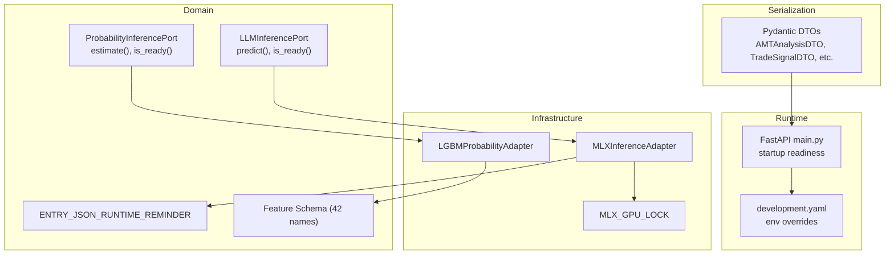
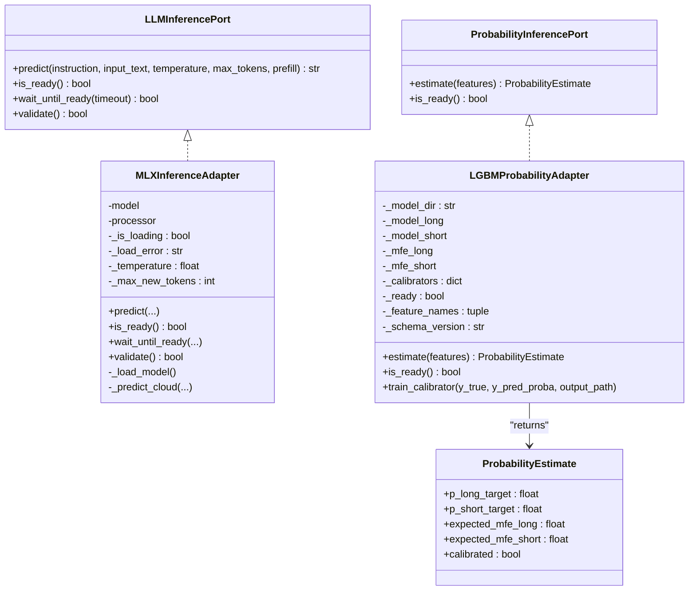
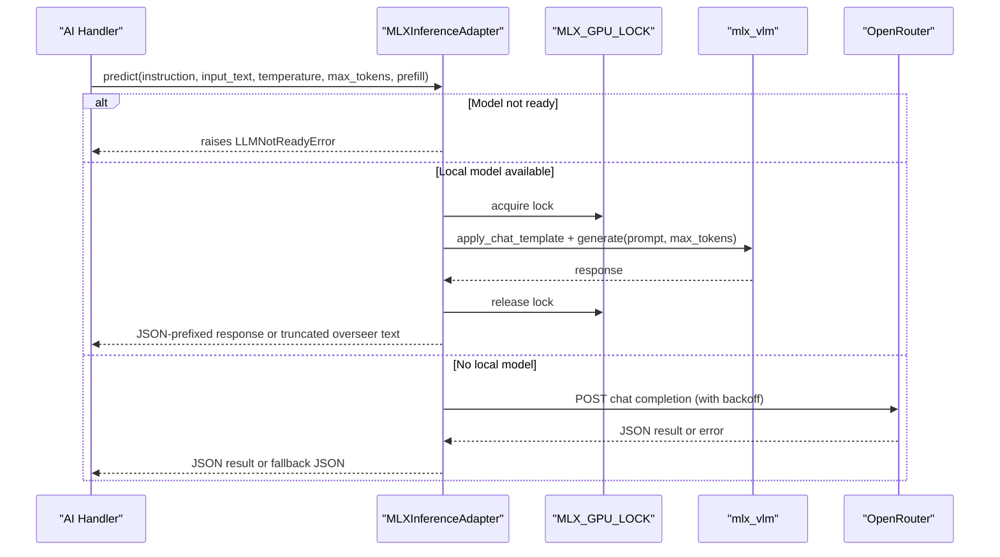
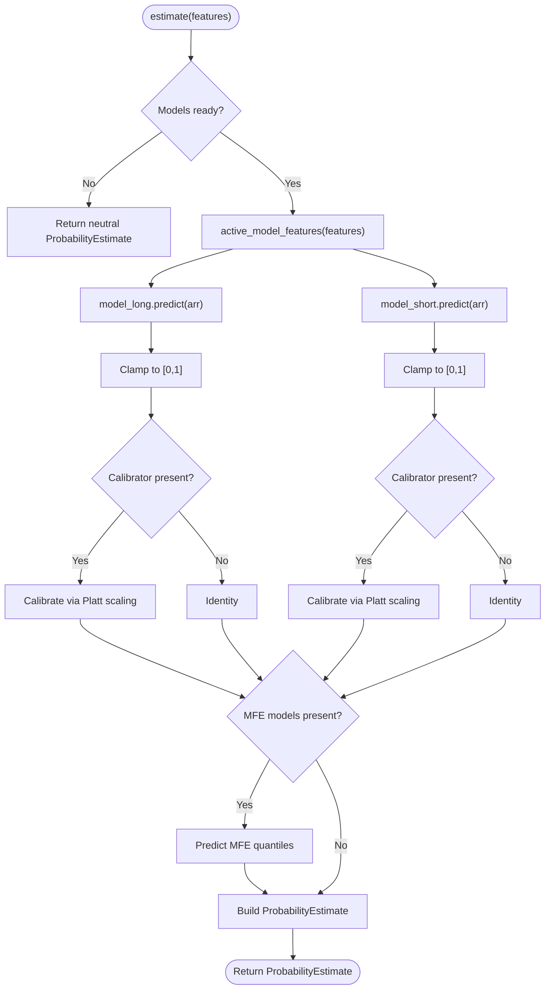
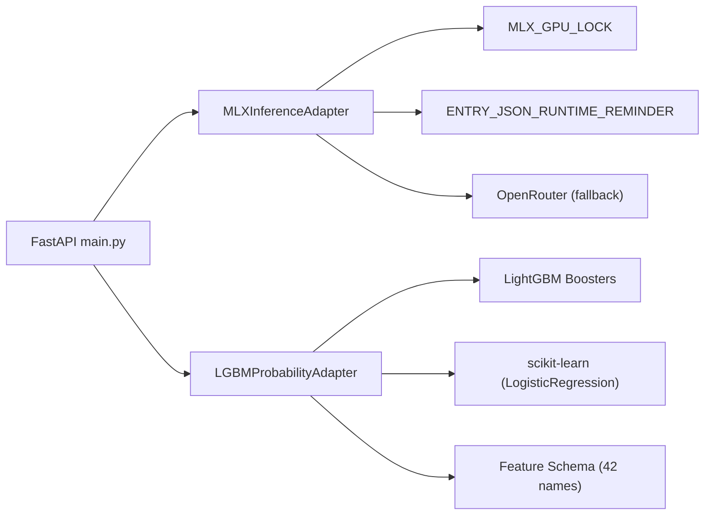

# ML Inference Adapters

<cite>
**Referenced Files in This Document**
- [mlx_inference_adapter.py](file://backend/app/infrastructure/adapters/mlx_inference_adapter.py)
- [lgbm_probability_adapter.py](file://backend/app/infrastructure/adapters/lgbm_probability_adapter.py)
- [llm_inference.py](file://backend/app/domain/ports/llm_inference.py)
- [probability_inference.py](file://backend/app/domain/ports/probability_inference.py)
- [llm_contract.py](file://backend/app/domain/fabio_ai/services/llm_contract.py)
- [features.py](file://backend/app/domain/probability/features.py)
- [mlx_gpu_lock.py](file://backend/app/infrastructure/mlx_gpu_lock.py)
- [schemas.py](file://backend/app/infrastructure/serialization/schemas.py)
- [main.py](file://backend/app/main.py)
- [development.yaml](file://backend/config/environments/development.yaml)
</cite>

## Table of Contents
1. [Introduction](#introduction)
2. [Project Structure](#project-structure)
3. [Core Components](#core-components)
4. [Architecture Overview](#architecture-overview)
5. [Detailed Component Analysis](#detailed-component-analysis)
6. [Dependency Analysis](#dependency-analysis)
7. [Performance Considerations](#performance-considerations)
8. [Troubleshooting Guide](#troubleshooting-guide)
9. [Conclusion](#conclusion)
10. [Appendices](#appendices)

## Introduction
This document describes the machine learning inference adapters used by GlassyTrade AI for AI-driven decision-making. It covers:
- MLXInferenceAdapter: Apple Silicon–optimized multimodal LLM inference using the MLX framework, including model loading, background initialization, GPU serialization, and cloud fallback.
- LGBMProbabilityAdapter: Gradient boosting–based first-passage probability inference for directional bias and expected move forecasting, including model serialization, calibration, and optional dynamic TP modeling.

It also documents adapter interfaces, model format requirements, inference pipelines, performance characteristics, and integration with the AI decision-making pipeline, including practical configuration examples and error handling.

## Project Structure
The adapters reside in the infrastructure layer and integrate with domain ports and runtime contracts. The MLX adapter depends on a GPU lock for Metal concurrency safety, while the probability adapter integrates with feature extraction and DTOs for serialization.

**Diagram sources**
- [mlx_inference_adapter.py:12-396](file://backend/app/infrastructure/adapters/mlx_inference_adapter.py#L12-L396)
- [lgbm_probability_adapter.py:24-167](file://backend/app/infrastructure/adapters/lgbm_probability_adapter.py#L24-L167)
- [llm_inference.py:10-42](file://backend/app/domain/ports/llm_inference.py#L10-L42)
- [probability_inference.py:19-44](file://backend/app/domain/ports/probability_inference.py#L19-L44)
- [llm_contract.py:44-47](file://backend/app/domain/fabio_ai/services/llm_contract.py#L44-L47)
- [features.py:21-71](file://backend/app/domain/probability/features.py#L21-L71)
- [mlx_gpu_lock.py:18-18](file://backend/app/infrastructure/mlx_gpu_lock.py#L18-L18)
- [schemas.py:91-163](file://backend/app/infrastructure/serialization/schemas.py#L91-L163)
- [main.py:83-127](file://backend/app/main.py#L83-L127)
- [development.yaml:1-33](file://backend/config/environments/development.yaml#L1-L33)

**Section sources**
- [mlx_inference_adapter.py:12-396](file://backend/app/infrastructure/adapters/mlx_inference_adapter.py#L12-L396)
- [lgbm_probability_adapter.py:24-167](file://backend/app/infrastructure/adapters/lgbm_probability_adapter.py#L24-L167)
- [llm_inference.py:10-42](file://backend/app/domain/ports/llm_inference.py#L10-L42)
- [probability_inference.py:19-44](file://backend/app/domain/ports/probability_inference.py#L19-L44)
- [llm_contract.py:44-47](file://backend/app/domain/fabio_ai/services/llm_contract.py#L44-L47)
- [features.py:21-71](file://backend/app/domain/probability/features.py#L21-L71)
- [mlx_gpu_lock.py:18-18](file://backend/app/infrastructure/mlx_gpu_lock.py#L18-L18)
- [schemas.py:91-163](file://backend/app/infrastructure/serialization/schemas.py#L91-L163)
- [main.py:83-127](file://backend/app/main.py#L83-L127)
- [development.yaml:1-33](file://backend/config/environments/development.yaml#L1-L33)

## Core Components
- MLXInferenceAdapter
  - Implements LLMInferencePort for multimodal LLM inference on Apple Silicon.
  - Supports background model loading, GPU serialization lock, JSON-prefill prompts, and cloud fallback.
  - Provides readiness checks, validation, and robust error handling.
- LGBMProbabilityAdapter
  - Implements ProbabilityInferencePort for first-passage probability estimation.
  - Loads LightGBM models, applies optional Platt scaling calibration, and optionally predicts dynamic TP via MFE quantiles.
  - Validates feature schema compatibility and gracefully degrades to neutral estimates when models are unavailable.

**Section sources**
- [mlx_inference_adapter.py:12-396](file://backend/app/infrastructure/adapters/mlx_inference_adapter.py#L12-L396)
- [lgbm_probability_adapter.py:24-167](file://backend/app/infrastructure/adapters/lgbm_probability_adapter.py#L24-L167)
- [llm_inference.py:10-42](file://backend/app/domain/ports/llm_inference.py#L10-L42)
- [probability_inference.py:19-44](file://backend/app/domain/ports/probability_inference.py#L19-L44)

## Architecture Overview
The adapters sit behind domain ports, ensuring clean separation between domain logic and infrastructure. The MLX adapter integrates with a GPU lock for Metal concurrency and supports a cloud fallback when a local model is not configured. The probability adapter consumes a strict 42-feature schema and returns calibrated probabilities and optional MFE estimates.

**Diagram sources**
- [llm_inference.py:10-42](file://backend/app/domain/ports/llm_inference.py#L10-L42)
- [mlx_inference_adapter.py:12-396](file://backend/app/infrastructure/adapters/mlx_inference_adapter.py#L12-L396)
- [probability_inference.py:19-44](file://backend/app/domain/ports/probability_inference.py#L19-L44)
- [lgbm_probability_adapter.py:24-167](file://backend/app/infrastructure/adapters/lgbm_probability_adapter.py#L24-L167)

## Detailed Component Analysis

### MLXInferenceAdapter
- Initialization and background loading
  - Accepts model path, temperature, and max tokens; starts a daemon thread to load the model.
  - Respects environment variables for model and adapter paths.
- GPU serialization and concurrency
  - Uses MLX_GPU_LOCK to serialize load() and generate() calls to avoid Metal command buffer concurrency issues.
- Prompting and output shaping
  - Applies a ChatML template with optional prefill to enforce JSON output for the canonical runtime contract.
  - Detects overseer prompts and truncates repetitive thinking blocks; otherwise extracts the first balanced JSON object.
- Cloud fallback
  - When no local model is configured, sends a structured request to OpenRouter with exponential backoff on rate limits.
- Readiness and validation
  - Provides is_ready(), wait_until_ready(), and validate() to gate inference until the model is usable.

**Diagram sources**
- [mlx_inference_adapter.py:184-266](file://backend/app/infrastructure/adapters/mlx_inference_adapter.py#L184-L266)
- [mlx_inference_adapter.py:82-183](file://backend/app/infrastructure/adapters/mlx_inference_adapter.py#L82-L183)
- [mlx_gpu_lock.py:18-18](file://backend/app/infrastructure/mlx_gpu_lock.py#L18-L18)

**Section sources**
- [mlx_inference_adapter.py:23-36](file://backend/app/infrastructure/adapters/mlx_inference_adapter.py#L23-L36)
- [mlx_inference_adapter.py:55-81](file://backend/app/infrastructure/adapters/mlx_inference_adapter.py#L55-L81)
- [mlx_inference_adapter.py:245-266](file://backend/app/infrastructure/adapters/mlx_inference_adapter.py#L245-L266)
- [mlx_inference_adapter.py:82-183](file://backend/app/infrastructure/adapters/mlx_inference_adapter.py#L82-L183)
- [mlx_gpu_lock.py:18-18](file://backend/app/infrastructure/mlx_gpu_lock.py#L18-L18)

### LGBMProbabilityAdapter
- Model loading and readiness
  - Loads two LightGBM Boosters (long and short) from a configured directory; validates feature schema alignment.
  - Optionally loads Platt scaling calibrators and MFE quantile models for dynamic TP.
- Prediction pipeline
  - Normalizes features to the active schema, clamps probabilities to [0, 1], applies calibration if available, and optionally predicts MFE.
- Calibration and diagnostics
  - Includes a static helper to train calibrators from historical predictions.

**Diagram sources**
- [lgbm_probability_adapter.py:119-155](file://backend/app/infrastructure/adapters/lgbm_probability_adapter.py#L119-L155)
- [lgbm_probability_adapter.py:39-77](file://backend/app/infrastructure/adapters/lgbm_probability_adapter.py#L39-L77)
- [features.py:343-346](file://backend/app/domain/probability/features.py#L343-L346)

**Section sources**
- [lgbm_probability_adapter.py:27-37](file://backend/app/infrastructure/adapters/lgbm_probability_adapter.py#L27-L37)
- [lgbm_probability_adapter.py:39-77](file://backend/app/infrastructure/adapters/lgbm_probability_adapter.py#L39-L77)
- [lgbm_probability_adapter.py:119-155](file://backend/app/infrastructure/adapters/lgbm_probability_adapter.py#L119-L155)
- [features.py:21-71](file://backend/app/domain/probability/features.py#L21-L71)

### Adapter Interfaces and Contracts
- LLMInferencePort
  - Defines predict(), is_ready(), wait_until_ready(), and validate().
- ProbabilityInferencePort
  - Defines estimate(), is_ready(); returns a ProbabilityEstimate with directional probabilities, expected MFE, and calibration flag.
- Runtime contract reminder
  - Ensures JSON-only responses for entry decisions, guiding prompt construction and parsing.

**Section sources**
- [llm_inference.py:10-42](file://backend/app/domain/ports/llm_inference.py#L10-L42)
- [probability_inference.py:19-44](file://backend/app/domain/ports/probability_inference.py#L19-L44)
- [llm_contract.py:44-47](file://backend/app/domain/fabio_ai/services/llm_contract.py#L44-L47)

### Model Format Requirements and Feature Schema
- MLX models
  - Loaded via mlx_vlm.load(); supports optional adapter path. Environment variables control model path and adapter path.
- LightGBM models
  - Expected files: fp_long.txt, fp_short.txt; optional fp_long_calibrator.pkl, fp_short_calibrator.pkl; optional mfe_long_q50.txt, mfe_short_q50.txt.
  - Active feature schema is 42-dimensional; mismatches trigger warnings and neutral fallback behavior.

**Section sources**
- [mlx_inference_adapter.py:55-81](file://backend/app/infrastructure/adapters/mlx_inference_adapter.py#L55-L81)
- [lgbm_probability_adapter.py:40-48](file://backend/app/infrastructure/adapters/lgbm_probability_adapter.py#L40-L48)
- [lgbm_probability_adapter.py:65-74](file://backend/app/infrastructure/adapters/lgbm_probability_adapter.py#L65-L74)
- [features.py:18-71](file://backend/app/domain/probability/features.py#L18-L71)

### Inference Pipelines and Integration
- Startup readiness
  - The FastAPI lifespan waits for LLM readiness and runs a validation inference before serving traffic.
- DTO integration
  - AMT and AI DTOs carry reasoning and JSON outputs that complement MLX inference results.

**Section sources**
- [main.py:83-127](file://backend/app/main.py#L83-L127)
- [schemas.py:91-163](file://backend/app/infrastructure/serialization/schemas.py#L91-L163)

## Dependency Analysis
- Coupling
  - MLXInferenceAdapter depends on MLX_GPU_LOCK and mlx_vlm; it also depends on the LLM runtime contract for prompt formatting.
  - LGBMProbabilityAdapter depends on LightGBM and scikit-learn for calibration; it depends on the feature schema for input normalization.
- Cohesion
  - Both adapters encapsulate infrastructure concerns behind domain ports, maintaining high cohesion within each adapter.
- External dependencies
  - MLX (Apple Silicon), LightGBM, scikit-learn, and OpenRouter (cloud fallback).

**Diagram sources**
- [mlx_inference_adapter.py:12-396](file://backend/app/infrastructure/adapters/mlx_inference_adapter.py#L12-L396)
- [lgbm_probability_adapter.py:24-167](file://backend/app/infrastructure/adapters/lgbm_probability_adapter.py#L24-L167)
- [llm_contract.py:44-47](file://backend/app/domain/fabio_ai/services/llm_contract.py#L44-L47)
- [mlx_gpu_lock.py:18-18](file://backend/app/infrastructure/mlx_gpu_lock.py#L18-L18)
- [main.py:83-127](file://backend/app/main.py#L83-L127)

**Section sources**
- [mlx_inference_adapter.py:12-396](file://backend/app/infrastructure/adapters/mlx_inference_adapter.py#L12-L396)
- [lgbm_probability_adapter.py:24-167](file://backend/app/infrastructure/adapters/lgbm_probability_adapter.py#L24-L167)
- [llm_contract.py:44-47](file://backend/app/domain/fabio_ai/services/llm_contract.py#L44-L47)
- [mlx_gpu_lock.py:18-18](file://backend/app/infrastructure/mlx_gpu_lock.py#L18-L18)
- [main.py:83-127](file://backend/app/main.py#L83-L127)

## Performance Considerations
- MLXInferenceAdapter
  - Background loading prevents cold-start delays during server startup.
  - GPU lock ensures Metal concurrency safety; avoid issuing multiple generate() calls concurrently.
  - Prefill JSON reduces parsing overhead and improves reliability.
- LGBMProbabilityAdapter
  - Feature extraction is vectorized and clamped to reduce outliers.
  - Optional calibration adds minimal overhead; MFE quantiles enable dynamic TP adjustments.

[No sources needed since this section provides general guidance]

## Troubleshooting Guide
- MLXInferenceAdapter
  - Symptoms: LLMNotReadyError during predict().
    - Cause: Model still loading or failed to load.
    - Resolution: Use wait_until_ready() before inference; check logs for load errors; configure MLX_MODEL_PATH and MLX_ADAPTER_PATH.
  - Symptoms: Metal concurrency crashes or hangs.
    - Cause: Multiple generate() calls without MLX_GPU_LOCK.
    - Resolution: Ensure all load/generate calls are guarded by MLX_GPU_LOCK.
  - Symptoms: Empty or malformed cloud fallback response.
    - Cause: Missing OPENROUTER_API_KEY or malformed JSON.
    - Resolution: Set API key; review fallback logic and retry/backoff behavior.
- LGBMProbabilityAdapter
  - Symptoms: Neutral estimates returned.
    - Cause: Models not found or schema mismatch.
    - Resolution: Verify model files exist; align feature schema; check warnings logged during load.
  - Symptoms: Unexpected probabilities.
    - Cause: Missing or misconfigured calibrator.
    - Resolution: Train and load calibrators via train_calibrator() and corresponding pickle files.

**Section sources**
- [mlx_inference_adapter.py:201-210](file://backend/app/infrastructure/adapters/mlx_inference_adapter.py#L201-L210)
- [mlx_inference_adapter.py:245-266](file://backend/app/infrastructure/adapters/mlx_inference_adapter.py#L245-L266)
- [mlx_inference_adapter.py:82-183](file://backend/app/infrastructure/adapters/mlx_inference_adapter.py#L82-L183)
- [lgbm_probability_adapter.py:43-48](file://backend/app/infrastructure/adapters/lgbm_probability_adapter.py#L43-L48)
- [lgbm_probability_adapter.py:58-63](file://backend/app/infrastructure/adapters/lgbm_probability_adapter.py#L58-L63)
- [lgbm_probability_adapter.py:101-117](file://backend/app/infrastructure/adapters/lgbm_probability_adapter.py#L101-L117)

## Conclusion
GlassyTrade AI’s inference adapters cleanly separate domain logic from infrastructure. The MLX adapter leverages Apple Silicon efficiently with GPU serialization and a robust cloud fallback, while the LGBM adapter delivers calibrated first-passage probabilities grounded in a strict feature schema. Together, they power the AI decision-making pipeline with strong reliability, performance, and maintainability.

[No sources needed since this section summarizes without analyzing specific files]

## Appendices

### Practical Configuration Examples
- MLX model configuration
  - Set MLX_MODEL_PATH to the model directory; optionally set MLX_ADAPTER_PATH for LoRA-style adapters.
  - Temperature and max tokens can be overridden per call; defaults are configured at initialization.
- Cloud fallback
  - Set OPENROUTER_API_KEY and MODEL_ID; adjust CLOUD_FALLBACK_URL if needed.
- Probability models
  - Place fp_long.txt and fp_short.txt in the model directory; include optional calibrators and MFE quantiles for advanced features.
- Environment overrides
  - Use development.yaml to tailor risk and broker behavior in development.

**Section sources**
- [mlx_inference_adapter.py:42-49](file://backend/app/infrastructure/adapters/mlx_inference_adapter.py#L42-L49)
- [mlx_inference_adapter.py:95-99](file://backend/app/infrastructure/adapters/mlx_inference_adapter.py#L95-L99)
- [development.yaml:1-33](file://backend/config/environments/development.yaml#L1-L33)