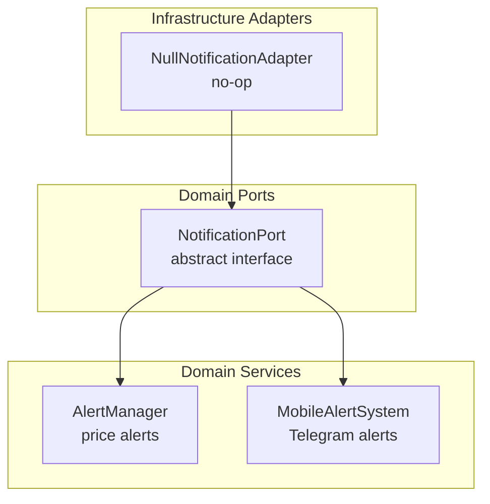
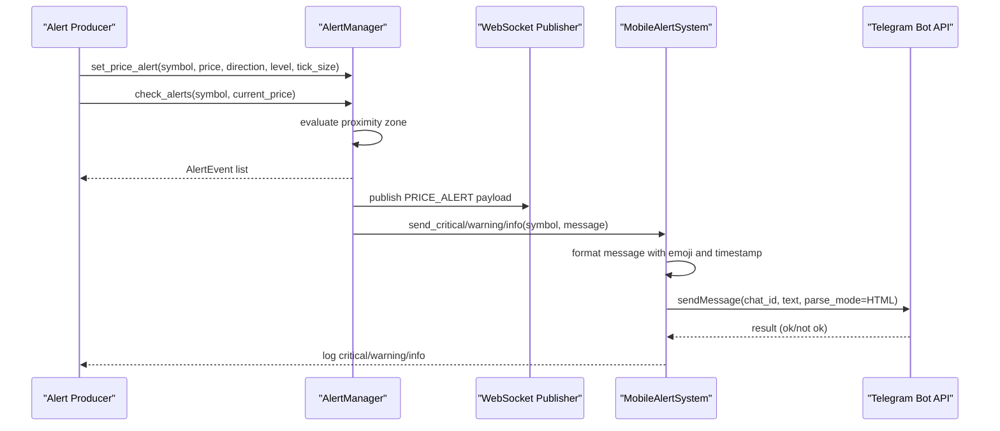
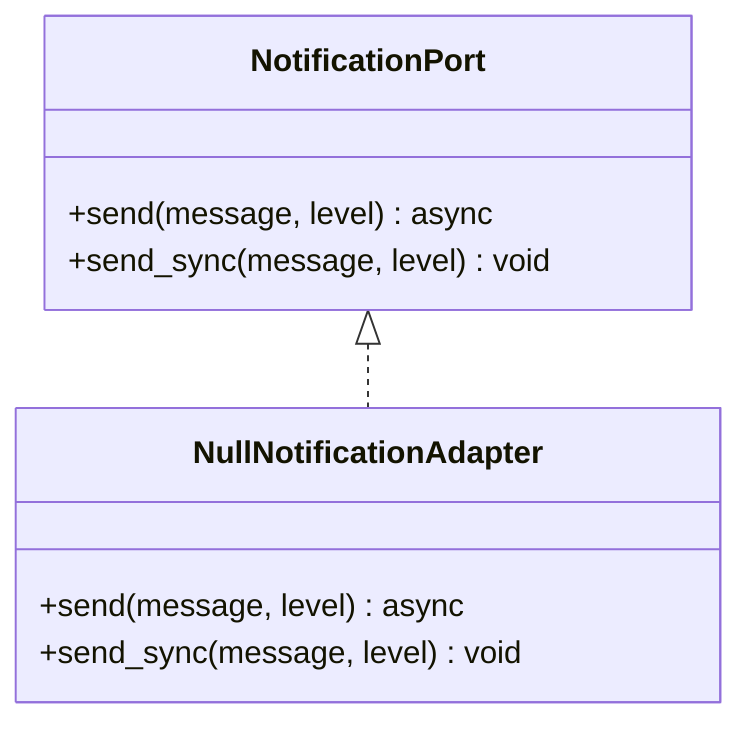
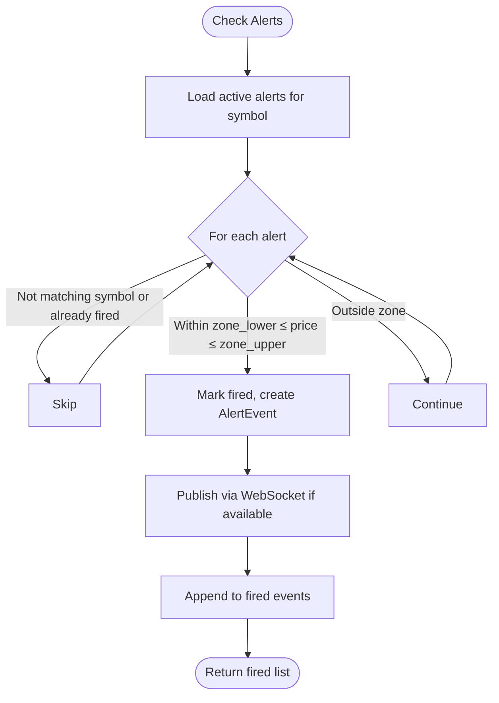
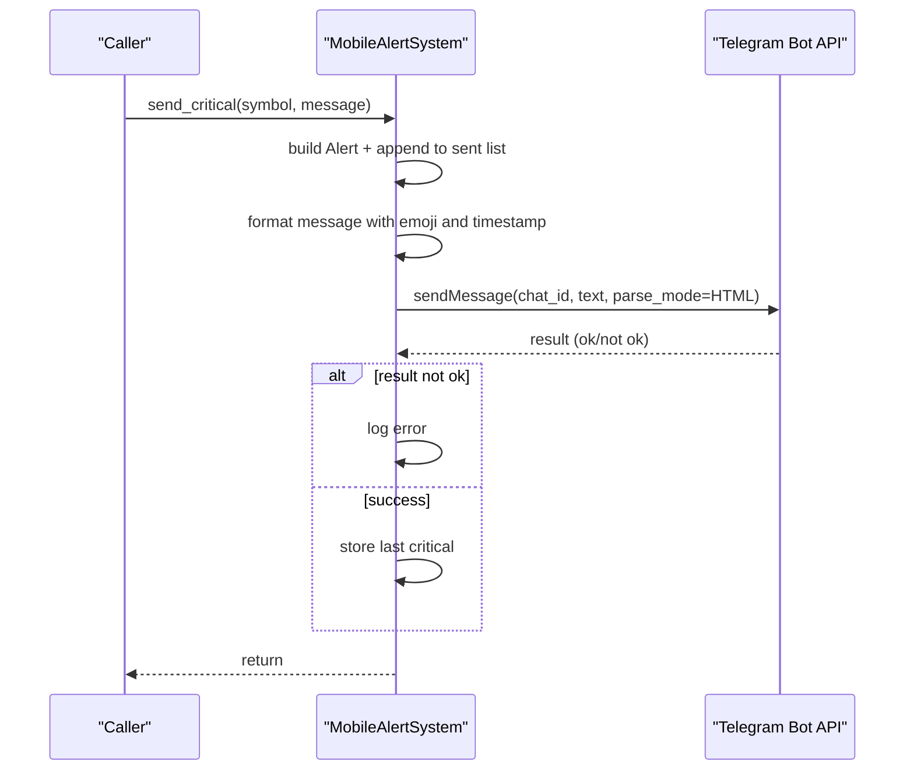
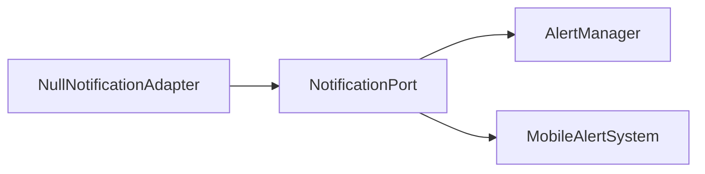

# Notification Adapters

<cite>
**Referenced Files in This Document**
- [notifications.py](file://backend/app/domain/ports/notifications.py)
- [null_notification_adapter.py](file://backend/app/infrastructure/adapters/null_notification_adapter.py)
- [mobile_alerts.py](file://backend/app/domain/services/mobile_alerts.py)
- [alert_manager.py](file://backend/app/domain/fabio_ai/services/alert_manager.py)
</cite>

## Table of Contents
1. [Introduction](#introduction)
2. [Project Structure](#project-structure)
3. [Core Components](#core-components)
4. [Architecture Overview](#architecture-overview)
5. [Detailed Component Analysis](#detailed-component-analysis)
6. [Dependency Analysis](#dependency-analysis)
7. [Performance Considerations](#performance-considerations)
8. [Troubleshooting Guide](#troubleshooting-guide)
9. [Conclusion](#conclusion)

## Introduction
This document describes the GlassyTrade AI notification adapters subsystem. It covers the adapter contract for notifications, a no-op implementation for development, a centralized alert manager for price-driven triggers, and a mobile alerts integration for real-time Telegram-based trading alerts. It explains message formatting, delivery mechanisms, retry strategies, filtering, rate limiting, and user preference management, and provides practical configuration guidance.

## Project Structure
The notification subsystem spans two primary areas:
- Domain ports and services define the alerting contract and alerting logic.
- Infrastructure adapters implement the contract for delivery channels.

**Diagram sources**
- [notifications.py:6-22](file://backend/app/domain/ports/notifications.py#L6-L22)
- [alert_manager.py:46-243](file://backend/app/domain/fabio_ai/services/alert_manager.py#L46-L243)
- [mobile_alerts.py:38-141](file://backend/app/domain/services/mobile_alerts.py#L38-L141)
- [null_notification_adapter.py:9-17](file://backend/app/infrastructure/adapters/null_notification_adapter.py#L9-L17)

**Section sources**
- [notifications.py:1-22](file://backend/app/domain/ports/notifications.py#L1-L22)
- [alert_manager.py:1-243](file://backend/app/domain/fabio_ai/services/alert_manager.py#L1-L243)
- [mobile_alerts.py:1-141](file://backend/app/domain/services/mobile_alerts.py#L1-L141)
- [null_notification_adapter.py:1-17](file://backend/app/infrastructure/adapters/null_notification_adapter.py#L1-L17)

## Core Components
- NotificationPort: Defines asynchronous and synchronous fire-and-forget notification delivery semantics with three severity levels.
- NullNotificationAdapter: No-op implementation that logs messages locally and discards them otherwise; ideal for development and testing.
- AlertManager: Manages price-level proximity alerts, fires events when price re-approaches a watched level, and pushes via WebSocket.
- MobileAlertSystem: Centralized Telegram-based alerting with emoji-tagged formatting, fallback logging, and optional statistics.

**Section sources**
- [notifications.py:6-22](file://backend/app/domain/ports/notifications.py#L6-L22)
- [null_notification_adapter.py:9-17](file://backend/app/infrastructure/adapters/null_notification_adapter.py#L9-L17)
- [alert_manager.py:46-243](file://backend/app/domain/fabio_ai/services/alert_manager.py#L46-L243)
- [mobile_alerts.py:38-141](file://backend/app/domain/services/mobile_alerts.py#L38-L141)

## Architecture Overview
The subsystem separates concerns:
- Contract-first design: NotificationPort decouples producers from delivery channels.
- Adapter pattern: NullNotificationAdapter satisfies the contract for dev/test; other adapters can be added later.
- Centralized alerting: AlertManager encapsulates alert lifecycle and event publishing.
- Real-time mobile alerts: MobileAlertSystem handles Telegram delivery with robust fallback logging.

**Diagram sources**
- [alert_manager.py:66-153](file://backend/app/domain/fabio_ai/services/alert_manager.py#L66-L153)
- [mobile_alerts.py:69-114](file://backend/app/domain/services/mobile_alerts.py#L69-L114)

## Detailed Component Analysis

### NotificationPort and NullNotificationAdapter
- Contract: Asynchronous send(message, level) and synchronous send_sync(message, level) must be non-blocking and fire-and-forget.
- NullNotificationAdapter: Implements the contract with minimal overhead—logs at appropriate levels and returns immediately without network calls.

**Diagram sources**
- [notifications.py:6-22](file://backend/app/domain/ports/notifications.py#L6-L22)
- [null_notification_adapter.py:9-17](file://backend/app/infrastructure/adapters/null_notification_adapter.py#L9-L17)

**Section sources**
- [notifications.py:6-22](file://backend/app/domain/ports/notifications.py#L6-L22)
- [null_notification_adapter.py:9-17](file://backend/app/infrastructure/adapters/null_notification_adapter.py#L9-L17)

### AlertManager
- Purpose: Watches price levels and fires alerts when price returns within N ticks of a key level. Clears per-level alerts when drive 3+ is detected.
- Proximity zone: Derived from tick_size × proximity_ticks.
- Event publishing: Emits AlertEvent objects and pushes via WebSocket if a publisher is configured.
- Filtering and retrieval: Provides APIs to list active unfired alerts and recent fired events.

**Diagram sources**
- [alert_manager.py:107-153](file://backend/app/domain/fabio_ai/services/alert_manager.py#L107-L153)

**Section sources**
- [alert_manager.py:46-243](file://backend/app/domain/fabio_ai/services/alert_manager.py#L46-L243)

### MobileAlertSystem (Telegram Integration)
- Levels: CRITICAL, WARNING, INFO with distinct semantics and emoji.
- Formatting: Emoji + level + symbol + concise message + ISO timestamp.
- Delivery: Sends HTML-formatted messages via Telegram Bot API; falls back to logging on failure.
- Stats: Tracks totals and last critical alert for dashboards.

**Diagram sources**
- [mobile_alerts.py:69-114](file://backend/app/domain/services/mobile_alerts.py#L69-L114)

**Section sources**
- [mobile_alerts.py:38-141](file://backend/app/domain/services/mobile_alerts.py#L38-L141)

## Dependency Analysis
- NotificationPort is the core abstraction consumed by higher-level services.
- AlertManager depends on NotificationPort for outbound events and on a WebSocket publisher for real-time updates.
- MobileAlertSystem is a concrete alert sink that can be wired behind NotificationPort or used independently for Telegram delivery.
- NullNotificationAdapter satisfies NotificationPort for development/testing without external dependencies.

**Diagram sources**
- [notifications.py:6-22](file://backend/app/domain/ports/notifications.py#L6-L22)
- [alert_manager.py:46-64](file://backend/app/domain/fabio_ai/services/alert_manager.py#L46-L64)
- [mobile_alerts.py:38-55](file://backend/app/domain/services/mobile_alerts.py#L38-L55)
- [null_notification_adapter.py:9-17](file://backend/app/infrastructure/adapters/null_notification_adapter.py#L9-L17)

**Section sources**
- [notifications.py:6-22](file://backend/app/domain/ports/notifications.py#L6-L22)
- [alert_manager.py:46-64](file://backend/app/domain/fabio_ai/services/alert_manager.py#L46-L64)
- [mobile_alerts.py:38-55](file://backend/app/domain/services/mobile_alerts.py#L38-L55)
- [null_notification_adapter.py:9-17](file://backend/app/infrastructure/adapters/null_notification_adapter.py#L9-L17)

## Performance Considerations
- Non-blocking contract: NotificationPort mandates non-blocking send/send_sync to avoid delaying tick processing.
- AlertManager proximity checks: O(N) over active alerts per symbol; keep proximity_ticks tuned to reduce N.
- WebSocket publishing: Best-effort delivery; exceptions are caught and logged to prevent alert storms.
- Telegram delivery: Uses blocking HTTP call with timeout; wrap invocations to avoid blocking critical paths if needed.
- Rate limiting: No built-in throttling; consider upstream rate limits and implement client-side backoff if integrating with external providers.

[No sources needed since this section provides general guidance]

## Troubleshooting Guide
- Telegram delivery failures: Errors are logged when sendMessage fails or returns not ok; verify bot token and chat_id configuration.
- Alert not firing: Confirm proximity_ticks and tick_size produce a zone that includes current_price; check symbol filtering and fired flag.
- WebSocket alerts not received: Ensure ws_publisher is supplied to AlertManager and remains callable; inspect logs for “WS alert push failed”.
- Null adapter behavior: Messages are logged locally; confirm logging level and handler configuration.

**Section sources**
- [mobile_alerts.py:88-114](file://backend/app/domain/services/mobile_alerts.py#L88-L114)
- [alert_manager.py:137-151](file://backend/app/domain/fabio_ai/services/alert_manager.py#L137-L151)
- [null_notification_adapter.py:12-16](file://backend/app/infrastructure/adapters/null_notification_adapter.py#L12-L16)

## Conclusion
The GlassyTrade AI notification subsystem cleanly separates contract, alerting logic, and delivery channels. The adapter contract ensures flexibility, while the AlertManager and MobileAlertSystem provide robust, real-time alerting capabilities. The NullNotificationAdapter enables safe development and testing without external dependencies. With careful configuration of thresholds, delivery channels, and monitoring, the system supports high-frequency trading environments reliably.