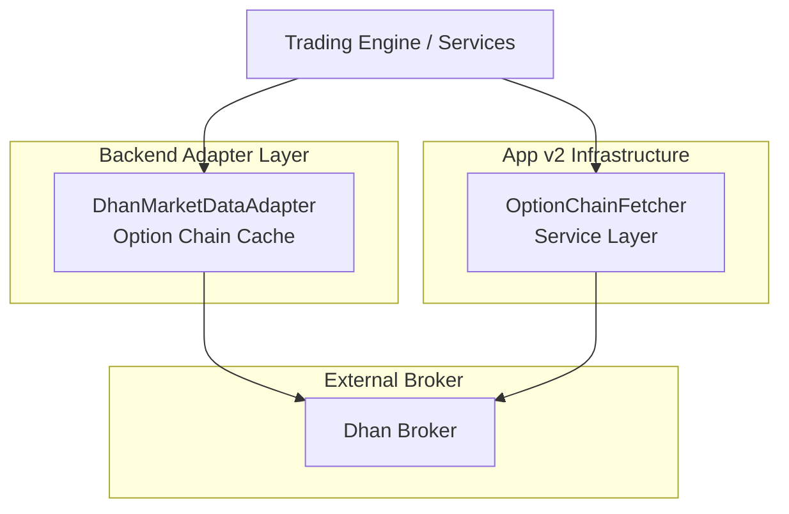
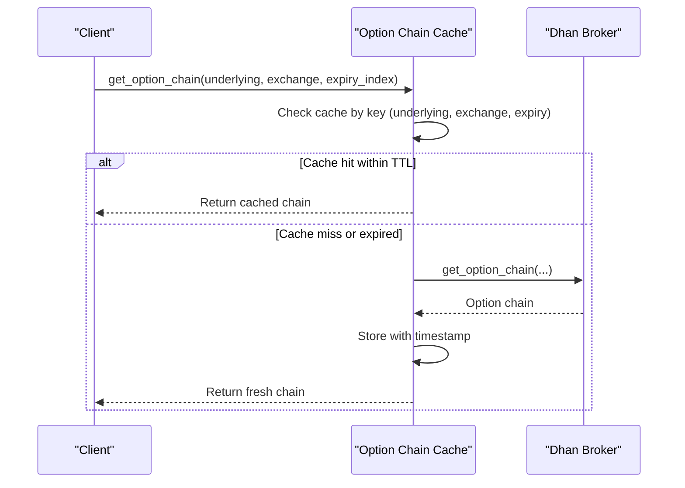
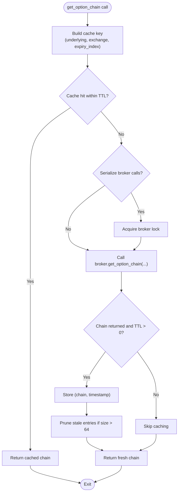
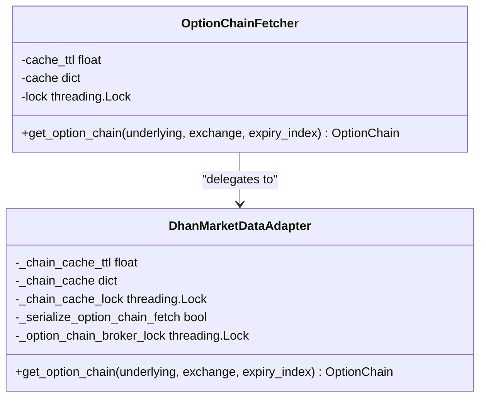
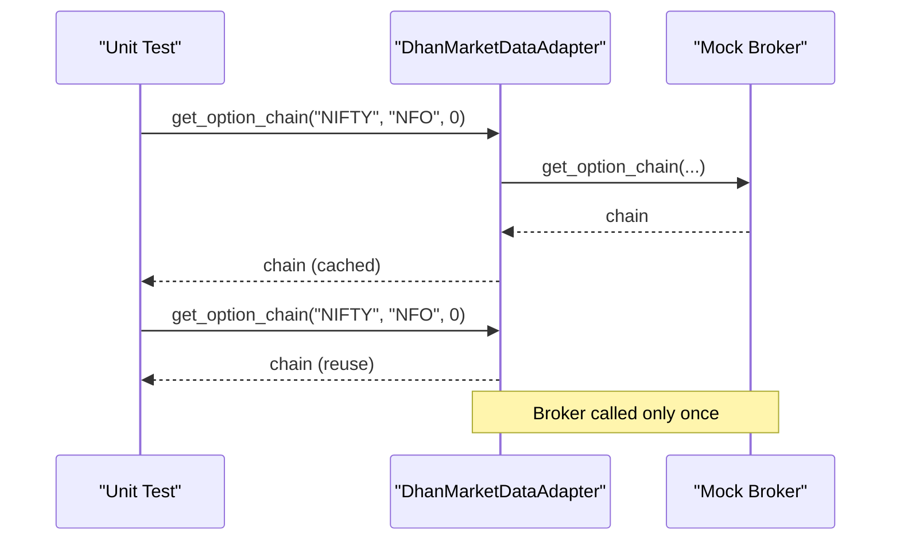

# Option Chain Caching

<cite>
**Referenced Files in This Document**
- [dhan_adapter.py](file://backend/app/infrastructure/adapters/dhan_adapter.py)
- [test_dhan_option_chain_cache.py](file://backend/tests/unit/infrastructure/test_dhan_option_chain_cache.py)
- [option_chain_fetcher.py](file://appv2/backend/appv2/infrastructure/option_chain_fetcher.py)
</cite>

## Table of Contents
1. [Introduction](#introduction)
2. [Project Structure](#project-structure)
3. [Core Components](#core-components)
4. [Architecture Overview](#architecture-overview)
5. [Detailed Component Analysis](#detailed-component-analysis)
6. [Dependency Analysis](#dependency-analysis)
7. [Performance Considerations](#performance-considerations)
8. [Troubleshooting Guide](#troubleshooting-guide)
9. [Conclusion](#conclusion)

## Introduction
This document explains the Option Chain Caching mechanism implemented in the trading system. The caching reduces redundant broker calls when fetching option chains for the same underlying instrument and expiry index within a short time window. It provides thread-safe access, automatic cleanup of stale entries, and configurable time-to-live (TTL) behavior.

## Project Structure
The option chain caching spans two primary areas:
- Backend adapter layer: Implements the caching logic for option chain retrieval via the Dhan broker adapter.
- App v2 infrastructure: Provides a dedicated option chain fetcher service for the newer backend.

**Diagram sources**
- [dhan_adapter.py:207-249](file://backend/app/infrastructure/adapters/dhan_adapter.py#L207-L249)
- [option_chain_fetcher.py](file://appv2/backend/appv2/infrastructure/option_chain_fetcher.py)

**Section sources**
- [dhan_adapter.py:207-249](file://backend/app/infrastructure/adapters/dhan_adapter.py#L207-L249)
- [option_chain_fetcher.py](file://appv2/backend/appv2/infrastructure/option_chain_fetcher.py)

## Core Components
- DhanMarketDataAdapter option chain cache: Implements a short-TTL cache keyed by (underlying, exchange, expiry_index). It ensures thread safety with locks, serializes broker calls when configured, and prunes stale entries to bound memory usage.
- OptionChainFetcher (App v2): Provides a service-level abstraction for fetching option chains, integrating with the same caching behavior.

Key behaviors:
- Cache key normalization: Uppercase underlying and exchange, integer expiry index.
- TTL enforcement: Uses monotonic time to decide freshness.
- Memory management: Evicts entries older than TTL to prevent unbounded growth.
- Serialization: Optional mutual exclusion around broker calls to avoid concurrent fetches.

**Section sources**
- [dhan_adapter.py:207-249](file://backend/app/infrastructure/adapters/dhan_adapter.py#L207-L249)
- [option_chain_fetcher.py](file://appv2/backend/appv2/infrastructure/option_chain_fetcher.py)

## Architecture Overview
The caching sits between the trading engine/services and the broker, intercepting repeated requests for the same option chain within the TTL window.

**Diagram sources**
- [dhan_adapter.py:207-249](file://backend/app/infrastructure/adapters/dhan_adapter.py#L207-L249)

## Detailed Component Analysis

### DhanMarketDataAdapter Option Chain Cache
The adapter centralizes option chain retrieval with built-in caching:
- Key composition: (underlying.upper(), exchange.upper(), int(expiry_index)).
- Locking: Uses a lock to guard cache reads/writes and broker call serialization.
- TTL logic: Stores chain plus timestamp; reuse if now - ts <= ttl.
- Memory pruning: Evicts entries older than TTL when size exceeds a threshold.
- Serialization: Optional mutual exclusion around broker calls to avoid duplicate fetches.

**Diagram sources**
- [dhan_adapter.py:207-249](file://backend/app/infrastructure/adapters/dhan_adapter.py#L207-L249)

**Section sources**
- [dhan_adapter.py:207-249](file://backend/app/infrastructure/adapters/dhan_adapter.py#L207-L249)

### OptionChainFetcher (App v2)
The App v2 service encapsulates option chain fetching and leverages the same caching semantics. It integrates with the broader trading engine and provides a clean interface for downstream components.

**Diagram sources**
- [option_chain_fetcher.py](file://appv2/backend/appv2/infrastructure/option_chain_fetcher.py)
- [dhan_adapter.py:207-249](file://backend/app/infrastructure/adapters/dhan_adapter.py#L207-L249)

**Section sources**
- [option_chain_fetcher.py](file://appv2/backend/appv2/infrastructure/option_chain_fetcher.py)

### Unit Test Coverage
The caching behavior is validated by unit tests that:
- Verify reuse of a single broker call within TTL.
- Verify that disabling TTL allows multiple broker calls.
- Validate that cache keys are normalized and compared correctly.

**Diagram sources**
- [test_dhan_option_chain_cache.py:9-26](file://backend/tests/unit/infrastructure/test_dhan_option_chain_cache.py#L9-L26)

**Section sources**
- [test_dhan_option_chain_cache.py:9-26](file://backend/tests/unit/infrastructure/test_dhan_option_chain_cache.py#L9-L26)

## Dependency Analysis
- Internal dependencies:
  - DhanMarketDataAdapter depends on the broker adapter and enforces caching.
  - OptionChainFetcher depends on DhanMarketDataAdapter for the actual broker interaction.
- External dependencies:
  - Broker SDK for option chain retrieval.
  - Threading primitives for synchronization and locking.

**Diagram sources**
- [option_chain_fetcher.py](file://appv2/backend/appv2/infrastructure/option_chain_fetcher.py)
- [dhan_adapter.py:207-249](file://backend/app/infrastructure/adapters/dhan_adapter.py#L207-L249)

**Section sources**
- [option_chain_fetcher.py](file://appv2/backend/appv2/infrastructure/option_chain_fetcher.py)
- [dhan_adapter.py:207-249](file://backend/app/infrastructure/adapters/dhan_adapter.py#L207-L249)

## Performance Considerations
- TTL tuning: Lower TTL reduces staleness but increases broker calls; higher TTL improves throughput but risks serving outdated chains.
- Concurrency: Locking prevents duplicate broker calls but may serialize hot-path requests; consider enabling serialization only when needed.
- Memory footprint: Pruning keeps cache bounded; monitor cache size under heavy load.
- Broker rate limits: The cache helps avoid hitting rate limits by consolidating identical requests.

## Troubleshooting Guide
Common issues and resolutions:
- Unexpected broker calls despite identical parameters:
  - Verify TTL configuration and ensure cache key normalization (uppercase underlying/exchange).
- Stale option chains:
  - Increase TTL or disable caching temporarily to confirm staleness.
- High broker call volume:
  - Enable serialization around broker calls and review cache hit ratio.
- Memory growth:
  - Confirm pruning logic is active and cache size remains within bounds.

**Section sources**
- [dhan_adapter.py:207-249](file://backend/app/infrastructure/adapters/dhan_adapter.py#L207-L249)
- [test_dhan_option_chain_cache.py:29-44](file://backend/tests/unit/infrastructure/test_dhan_option_chain_cache.py#L29-L44)

## Conclusion
The Option Chain Caching mechanism provides a robust, thread-safe solution to reduce redundant broker calls while maintaining freshness through TTL-based invalidation. Its design supports both the legacy adapter and the newer App v2 service, ensuring consistent behavior across the system.