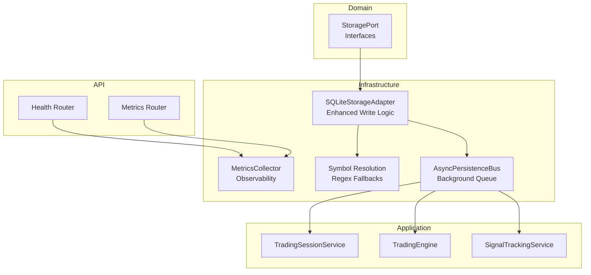
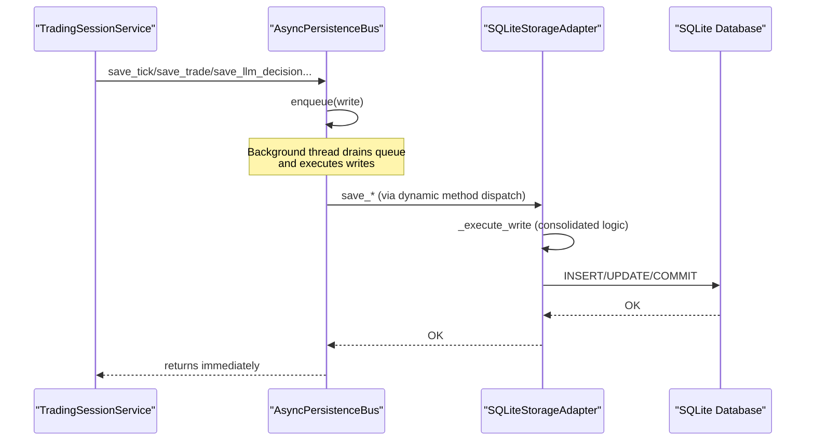
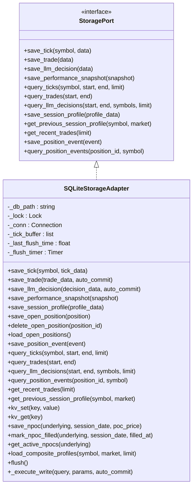
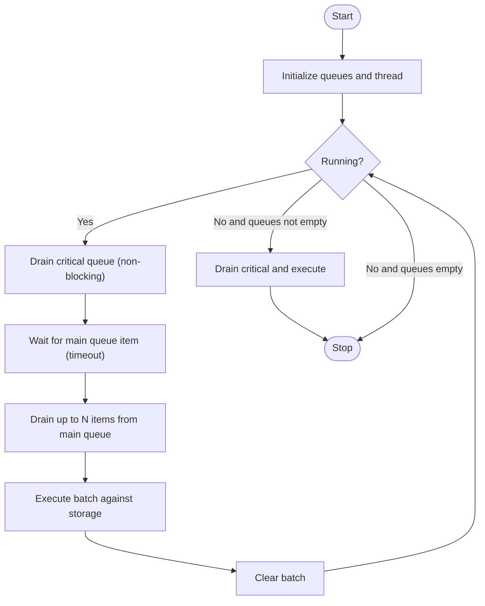
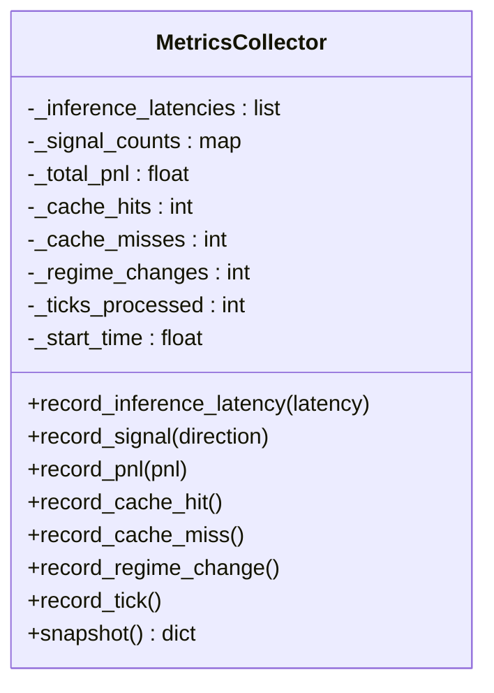
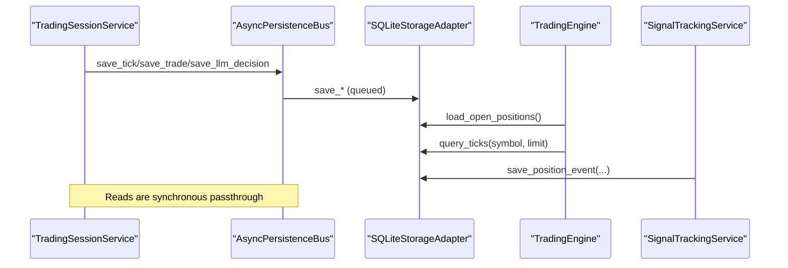
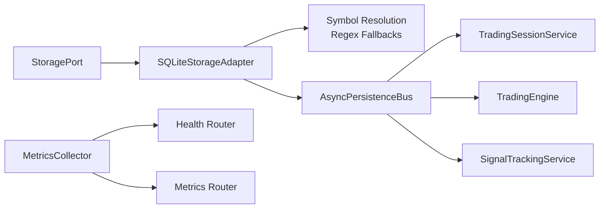

# Storage Adapters

<cite>
**Referenced Files in This Document**
- [database.py](file://backend/app/infrastructure/storage/database.py)
- [async_persistence.py](file://backend/app/infrastructure/async_persistence.py)
- [metrics.py](file://backend/app/infrastructure/metrics.py)
- [storage.py](file://backend/app/domain/ports/storage.py)
- [dependencies.py](file://backend/app/api/dependencies.py)
- [main.py](file://backend/app/main.py)
- [metrics.py](file://backend/app/api/routers/metrics.py)
- [health.py](file://backend/app/api/routers/health.py)
- [trading.py](file://backend/app/application/services/trading_session.py)
- [engine.py](file://backend/app/application/engine.py)
- [signal_tracking_service.py](file://backend/app/application/services/signal_tracking_service.py)
- [ai.py](file://backend/app/api/routers/ai.py)
- [run_backtest.py](file://backend/scripts/run_backtest.py)
- [collect_training_data.py](file://backend/scripts/collect_training_data.py)
- [test_session_storage.py](file://backend/tests/unit/infrastructure/test_session_storage.py)
- [test_phase1_bugs.py](file://backend/tests/unit/infrastructure/test_phase1_bugs.py)
- [test_trading_session_unit.py](file://backend/tests/unit/application/test_trading_session_unit.py)
</cite>

## Update Summary
**Changes Made**
- Added documentation for the new `_execute_write` method that consolidates database write logic
- Enhanced error handling and transaction management documentation
- Added comprehensive coverage of sophisticated fallback strategies for symbol resolution with regex-based pattern matching
- Updated database infrastructure improvements section
- Added new section on advanced symbol resolution patterns for NSE/MCX markets

## Table of Contents
1. [Introduction](#introduction)
2. [Project Structure](#project-structure)
3. [Core Components](#core-components)
4. [Architecture Overview](#architecture-overview)
5. [Detailed Component Analysis](#detailed-component-analysis)
6. [Enhanced Database Infrastructure](#enhanced-database-infrastructure)
7. [Advanced Symbol Resolution Strategies](#advanced-symbol-resolution-strategies)
8. [Dependency Analysis](#dependency-analysis)
9. [Performance Considerations](#performance-considerations)
10. [Troubleshooting Guide](#troubleshooting-guide)
11. [Conclusion](#conclusion)
12. [Appendices](#appendices)

## Introduction
This document describes the GlassyTrade AI storage adapters layer, focusing on:
- Database storage adapter implementation for persistent data management with enhanced write consolidation
- AsyncPersistence layer for non-blocking I/O operations
- Metrics service for observability and performance tracking
- Advanced symbol resolution strategies with regex-based pattern matching for NSE/MCX markets
- Storage interfaces, data models, indexing strategies, and query optimization
- Practical patterns for persistence, backup, recovery, and integration with the trading pipeline

The storage layer persists ticks, trades, LLM decisions, session profiles, open positions, position events, and performance snapshots. It is designed for production-grade throughput and reliability, with explicit separation of concerns between synchronous domain interfaces and asynchronous persistence.

## Project Structure
The storage adapters reside in the infrastructure layer and integrate with the domain via a unified StoragePort interface. The AsyncPersistenceBus wraps the storage adapter to offload writes to a background thread, ensuring the trading hot path remains latency-insensitive. Metrics are collected centrally and exposed via API endpoints.



**Diagram sources**
- [storage.py:54-121](file://backend/app/domain/ports/storage.py#L54-L121)
- [database.py:183-861](file://backend/app/infrastructure/storage/database.py#L183-L861)
- [async_persistence.py:24-277](file://backend/app/infrastructure/async_persistence.py#L24-L277)
- [metrics.py:14-98](file://backend/app/infrastructure/metrics.py#L14-L98)
- [dependencies.py:106-112](file://backend/app/api/dependencies.py#L106-L112)
- [health.py:81-84](file://backend/app/api/routers/health.py#L81-L84)
- [metrics.py:30-56](file://backend/app/api/routers/metrics.py#L30-L56)

**Section sources**
- [dependencies.py:106-112](file://backend/app/api/dependencies.py#L106-L112)
- [main.py:139-148](file://backend/app/main.py#L139-L148)

## Core Components
- StoragePort interface defines the contract for ticks, trades, decisions, open positions, and position events persistence and queries.
- SQLiteStorageAdapter implements StoragePort with WAL mode, indexing, and consolidated write logic via `_execute_write` method.
- AsyncPersistenceBus queues writes and executes them in a background thread, prioritizing critical writes (trade/position).
- MetricsCollector aggregates latency, signals, PnL, cache hits/misses, regime changes, and tick counts.
- Advanced symbol resolution with regex-based fallback strategies for NSE/MCX market instruments.

Key responsibilities:
- Data serialization: JSON serialization for "extra" fields and float conversions for numeric fields.
- Transaction handling: Consolidated error handling with rollback on errors; explicit flush for batched commits.
- Indexing: Unique index on ticks (symbol, time), plus indexes for trades, decisions, snapshots, session profiles, position events, and fine-tuning features.
- Query optimization: Parameterized queries with optional filters and limits; defensive deduplication upgrade for ticks.
- Symbol resolution: Sophisticated fallback strategies with regex pattern matching for complex instrument naming conventions.

**Section sources**
- [storage.py:54-121](file://backend/app/domain/ports/storage.py#L54-L121)
- [database.py:183-861](file://backend/app/infrastructure/storage/database.py#L183-L861)
- [async_persistence.py:24-277](file://backend/app/infrastructure/async_persistence.py#L24-L277)
- [metrics.py:14-98](file://backend/app/infrastructure/metrics.py#L14-L98)

## Architecture Overview
The storage adapters layer sits between the trading pipeline and the persistence backend. Writes from the trading session and handlers are queued asynchronously, while reads remain synchronous to ensure consistency. Metrics are recorded centrally and exposed via health and metrics endpoints. The enhanced database infrastructure provides consolidated write operations and sophisticated symbol resolution capabilities.



**Diagram sources**
- [async_persistence.py:24-277](file://backend/app/infrastructure/async_persistence.py#L24-L277)
- [database.py:183-861](file://backend/app/infrastructure/storage/database.py#L183-L861)
- [trading.py:288-390](file://backend/app/application/services/trading_session.py#L288-L390)

**Section sources**
- [dependencies.py:106-112](file://backend/app/api/dependencies.py#L106-L112)
- [async_persistence.py:24-277](file://backend/app/infrastructure/async_persistence.py#L24-L277)
- [database.py:183-861](file://backend/app/infrastructure/storage/database.py#L183-L861)

## Detailed Component Analysis

### Database Storage Adapter (SQLiteStorageAdapter)
- Purpose: Persistent storage for ticks, trades, LLM decisions, performance snapshots, session profiles, open positions, position events, fine-tuning features, and a key-value store.
- Connection and concurrency:
  - Single persistent connection with row_factory for dict-like access.
  - Threading lock protects all writes; tick flush timer ensures bounded latency.
- Enhanced write consolidation:
  - New `_execute_write` method centralizes database write logic with consistent error handling and transaction management.
  - Eliminates duplicated try/except/rollback pattern across multiple write methods.
- Batched writes:
  - Tick buffer flushed when size threshold or interval elapses.
  - Flush occurs inside a lock; batch insert uses executemany with "INSERT OR REPLACE" for deduplication.
- Transactions:
  - Consolidated per-operation commits via `_execute_write`; rollback on exceptions; explicit flush() for batched commits.
- Indexing and schema:
  - Unique index on (symbol, time) for ticks; additional indexes for efficient queries.
  - Schema upgrades handle deduplication and index recreation safely.
- Data serialization:
  - Extra fields serialized as JSON; numeric fields converted via shared utilities.
- Query APIs:
  - Parameterized queries with optional start/end filters and limits.
  - Helpers for recent trades, session profiles, position events, and composite profiles.



**Diagram sources**
- [storage.py:54-121](file://backend/app/domain/ports/storage.py#L54-L121)
- [database.py:183-861](file://backend/app/infrastructure/storage/database.py#L183-L861)

**Section sources**
- [database.py:183-861](file://backend/app/infrastructure/storage/database.py#L183-L861)

### AsyncPersistence Layer (AsyncPersistenceBus)
- Purpose: Offload storage writes to a background thread to avoid blocking the trading hot path.
- Queues:
  - Main queue for non-critical writes (e.g., ticks, LLM decisions).
  - Critical queue for trade/position persistence; always drained first.
- Backpressure and drop handling:
  - Drops writes when queues are full; logs critical drops separately.
- Lifecycle:
  - start(): spawns background thread.
  - stop(timeout): flushes pending writes, drains critical queue, and joins thread.
- Read passthrough:
  - All read APIs are forwarded synchronously to the underlying storage.



**Diagram sources**
- [async_persistence.py:24-277](file://backend/app/infrastructure/async_persistence.py#L24-L277)

**Section sources**
- [async_persistence.py:24-277](file://backend/app/infrastructure/async_persistence.py#L24-L277)

### Metrics Service (MetricsCollector)
- Purpose: Centralized metrics collection for inference latency, signal counts, PnL, cache hits/misses, regime changes, and ticks processed.
- Snapshot:
  - Returns uptime, counts, latency percentiles (p50/p95), signal totals, total PnL, cache hit rate, and regime change count.
- Thread-safe:
  - Uses a lock to protect internal counters and buffers.



**Diagram sources**
- [metrics.py:14-98](file://backend/app/infrastructure/metrics.py#L14-L98)

**Section sources**
- [metrics.py:14-98](file://backend/app/infrastructure/metrics.py#L14-L98)

### Storage Interfaces and Data Models
- StoragePort consolidates sub-ports for ticks, trades, decisions, open positions, and position events.
- Data models:
  - Ticks: symbol, time, OHLCV, delta, and extra JSON.
  - Trades: position metadata, prices, size, PnL, source/reason, timestamps, and extra JSON.
  - LLM decisions: symbol, direction/confidence, rationale, prompt, raw output, market state/aggression, price/volume/profile metrics, and extra JSON.
  - Performance snapshots: symbol, equity/balance/open PnL, open positions, total trades, win rate, and extra JSON.
  - Session profiles: symbol, market, session date, VAH/VAL/POC, shape, total volume, and extra JSON.
  - Open positions: id, symbol, side, entry/size/SL/TP, source, opened_at, and extra JSON.
  - Position events: position_id, symbol, event_type/time, and extra JSON.
  - Fine-tuning features: trade_id and derived features for ML training.
  - KV store: key/value with updated timestamp.

Indexing strategies:
- Ticks: unique index on (symbol, time); deduplication performed during schema upgrade.
- Trades: index on closed_at for closed trade queries.
- Decisions/Snapshots: index on created_at for time-series queries.
- Session profiles: composite index on (symbol, market, session_date).
- Position events: indexes on (position_id, created_at) and (symbol, created_at).
- Fine-tuning features: indexes on (symbol, created_at) and result.

**Section sources**
- [storage.py:13-121](file://backend/app/domain/ports/storage.py#L13-L121)
- [database.py:24-176](file://backend/app/infrastructure/storage/database.py#L24-L176)
- [database.py:178-181](file://backend/app/infrastructure/storage/database.py#L178-L181)

### Integration with the Trading Pipeline
- TradingSessionService uses the async storage bus for:
  - Persisting ticks (non-blocking)
  - Saving trades and performance snapshots
  - Recording position events and session profiles
- TradingEngine loads open positions at startup and queries ticks for backtesting.
- SignalTrackingService persists gate decisions as position events.
- Health and metrics endpoints expose system health and runtime metrics.



**Diagram sources**
- [trading.py:288-607](file://backend/app/application/services/trading_session.py#L288-L607)
- [engine.py:446-588](file://backend/app/application/engine.py#L446-L588)
- [signal_tracking_service.py:277-277](file://backend/app/application/services/signal_tracking_service.py#L277-L277)
- [async_persistence.py:81-107](file://backend/app/infrastructure/async_persistence.py#L81-L107)

**Section sources**
- [trading.py:288-607](file://backend/app/application/services/trading_session.py#L288-L607)
- [engine.py:446-588](file://backend/app/application/engine.py#L446-L588)
- [signal_tracking_service.py:277-277](file://backend/app/application/services/signal_tracking_service.py#L277-L277)

### Practical Patterns and Procedures

#### Data Persistence Patterns
- Asynchronous writes: Use the async bus for non-critical writes (ticks, LLM decisions) to keep the hot path responsive.
- Critical writes: Trade and position persistence are prioritized and less likely to drop under load.
- Consolidated write operations: The `_execute_write` method ensures consistent error handling across all write operations.

#### Backup and Recovery
- Database backup: Use SQLite's built-in file-level backup or WAL replay to maintain consistency.
- Recovery: On startup, TradingEngine reloads open positions from storage; TradingSessionService queries recent trades and ticks for continuity.
- Health check: The health endpoint validates database availability via a key-value write.

#### Query Optimization
- Prefer indexed columns in WHERE clauses (e.g., closed_at for trades, created_at for decisions/snapshots).
- Use parameterized queries and limits to constrain result sets.
- For ticks, leverage the unique index on (symbol, time) and flush buffers before queries to ensure visibility.

#### Observability and Monitoring
- Metrics endpoint: Expose latency percentiles, signal counts, PnL, cache hit rate, and regime changes.
- Health endpoint: Reports database readiness and other subsystem statuses.

**Section sources**
- [async_persistence.py:133-159](file://backend/app/infrastructure/async_persistence.py#L133-L159)
- [engine.py:446-446](file://backend/app/application/engine.py#L446-L446)
- [health.py:26-78](file://backend/app/api/routers/health.py#L26-L78)
- [metrics.py:30-56](file://backend/app/api/routers/metrics.py#L30-L56)

## Enhanced Database Infrastructure

### Consolidated Write Logic with _execute_write Method

The new `_execute_write` method represents a significant enhancement to the database infrastructure, providing centralized write operation handling:

**Key Features:**
- **Consolidated Error Handling**: Eliminates duplicated try/except/rollback pattern across multiple write methods
- **Lock Management**: Ensures thread safety with consistent locking mechanism
- **Transaction Control**: Automatic commit handling with optional manual control
- **Exception Propagation**: Proper error handling with rollback on failures

**Implementation Benefits:**
- **Reduced Code Duplication**: Multiple write methods now share common logic
- **Improved Maintainability**: Single point of modification for transaction handling
- **Enhanced Reliability**: Consistent error handling across all write operations
- **Better Performance**: Optimized transaction management reduces overhead

**Usage Pattern:**
```python
self._execute_write(
    "INSERT INTO trades (position_id, symbol, side, entry_price, exit_price, size, pnl, source, reason, opened_at, closed_at, extra) VALUES (?, ?, ?, ?, ?, ?, ?, ?, ?, ?, ?, ?)",
    params,
    auto_commit=True
)
```

**Section sources**
- [database.py:220-234](file://backend/app/infrastructure/storage/database.py#L220-L234)
- [database.py:295-337](file://backend/app/infrastructure/storage/database.py#L295-L337)
- [database.py:339-390](file://backend/app/infrastructure/storage/database.py#L339-L390)

### Improved Transaction Management

The enhanced transaction management system provides:

**Transaction Flow:**
1. Acquire lock for thread safety
2. Execute SQL query with parameters
3. Auto-commit based on configuration
4. Rollback on sqlite3.Error exceptions
5. Proper exception propagation

**Error Handling Strategy:**
- **Automatic Rollback**: All write operations automatically rollback on database errors
- **Consistent Logging**: Standardized error logging with exception information
- **Exception Propagation**: Maintains stack traces for debugging
- **Resource Cleanup**: Ensures proper cleanup even on failures

**Section sources**
- [database.py:220-234](file://backend/app/infrastructure/storage/database.py#L220-L234)

## Advanced Symbol Resolution Strategies

### Regex-Based Fallback Strategies for NSE/MCX Markets

The storage adapter now implements sophisticated fallback strategies for symbol resolution, particularly important for complex financial instruments:

**Resolution Priority:**
1. **Exact Symbol Match**: Direct lookup by symbol and market combination
2. **Underlying Extraction**: Extract base instrument from option contracts
3. **Market-Specific Patterns**: Apply regex patterns specific to NSE and MCX conventions
4. **Last Resort Fallback**: Return most recent profile for the specified market

**NSE Market Patterns:**
- **Options Contracts**: Extract underlying from "NIFTY 26APR 24000 CALL" → "NIFTY"
- **Futures Contracts**: Handle "BANKNIFTY-WED-FUT" → "BANKNIFTY"
- **Equities**: Direct symbol matching for "RELIANCE"

**MCX Market Patterns:**
- **Commodity Extraction**: Extract commodity from "CRUDEOIL26APR" → "CRUDEOIL"
- **Gold/Silver Options**: Handle "GOLD26MAY" → "GOLD"
- **Silver Mini Options**: "SILVERM21APR" → "SILVERM"

**Regex Implementation Details:**
```python
# NSE style pattern: first word before space
underlying_match = re.match(r'^([A-Z]+)', symbol)

# MCX style pattern: extract commodity before 2-digit expiry + 3-letter month
mcx_match = re.match(r'^([A-Z]+?)(?=\d{2}[A-Z]{3})', symbol)
```

**Fallback Chain:**
1. **Primary**: Exact symbol match with market filter
2. **Secondary**: Underlying extraction for options contracts
3. **Tertiary**: Market-specific pattern matching
4. **Quaternary**: Most recent profile for the market

**Testing Coverage:**
The symbol resolution functionality is thoroughly tested with:
- Round-trip save/load operations for session profiles
- Multiple date scenarios with chronological ordering
- Graceful degradation when no prior data exists
- AMT analyzer compatibility with missing prior data

**Section sources**
- [database.py:595-650](file://backend/app/infrastructure/storage/database.py#L595-L650)
- [test_session_storage.py:44-100](file://backend/tests/unit/infrastructure/test_session_storage.py#L44-L100)
- [test_trading_session_unit.py:420-444](file://backend/tests/unit/application/test_trading_session_unit.py#L420-L444)

## Dependency Analysis
- Domain depends on StoragePort; infrastructure implements it.
- Application services depend on StoragePort for persistence.
- AsyncPersistenceBus depends on any StoragePort implementation.
- MetricsCollector is independent and exposed via routers.
- Symbol resolution strategies enhance the storage adapter's market intelligence.



**Diagram sources**
- [storage.py:54-121](file://backend/app/domain/ports/storage.py#L54-L121)
- [database.py:183-861](file://backend/app/infrastructure/storage/database.py#L183-L861)
- [async_persistence.py:24-277](file://backend/app/infrastructure/async_persistence.py#L24-L277)
- [metrics.py:14-98](file://backend/app/infrastructure/metrics.py#L14-L98)
- [health.py:81-84](file://backend/app/api/routers/health.py#L81-L84)
- [metrics.py:30-56](file://backend/app/api/routers/metrics.py#L30-L56)

**Section sources**
- [dependencies.py:106-112](file://backend/app/api/dependencies.py#L106-L112)

## Performance Considerations
- Write throughput:
  - Tick batching reduces write frequency; adjust batch size and flush interval based on workload.
  - Critical queue prioritization prevents starvation of trade/position writes.
  - Consolidated write operations reduce overhead through shared error handling logic.
- Concurrency:
  - Single connection with a lock; consider connection pooling if scaling horizontally.
  - Enhanced thread safety through centralized lock management.
- Indexing:
  - Ensure appropriate indexes exist for frequent queries; monitor query plans.
  - Unique index on (symbol, time) prevents duplicate tick entries.
- Serialization overhead:
  - JSON serialization of extra fields adds CPU cost; minimize unnecessary fields.
- Memory footprint:
  - Metrics buffers cap at a fixed size; consider downsampling for long-running sessions.
- Symbol resolution performance:
  - Regex pattern matching adds minimal overhead compared to database lookups.
  - Fallback strategies ensure quick resolution through cached database queries.

## Troubleshooting Guide
- Database errors:
  - Look for rollback and commit failures; inspect logs around storage operations.
  - The `_execute_write` method provides consistent error handling and logging.
- Queue drops:
  - Monitor dropped_count and critical pending counts; increase queue sizes if needed.
- Health check failures:
  - Verify database connectivity and permissions; confirm WAL mode and schema initialization.
- Metrics anomalies:
  - Check latency percentiles and cache hit rates; investigate spikes in ticks processed.
- Symbol resolution issues:
  - Verify regex patterns match expected instrument naming conventions.
  - Check fallback chain progression through different market resolution strategies.

**Section sources**
- [database.py:232-248](file://backend/app/infrastructure/storage/database.py#L232-L248)
- [async_persistence.py:150-159](file://backend/app/infrastructure/async_persistence.py#L150-L159)
- [health.py:37-44](file://backend/app/api/routers/health.py#L37-L44)

## Conclusion
The storage adapters layer provides a robust, production-ready foundation for GlassyTrade AI with significant enhancements:
- SQLiteStorageAdapter offers durable, indexed persistence with consolidated write logic via `_execute_write`.
- AsyncPersistenceBus decouples the trading hot path from I/O latency.
- MetricsCollector enables continuous monitoring of pipeline health and performance.
- Advanced symbol resolution strategies provide sophisticated fallback mechanisms for complex NSE/MCX instruments.
- The unified StoragePort interface cleanly separates domain logic from infrastructure concerns.

These enhancements improve reliability, maintainability, and performance while supporting the complex requirements of modern trading systems.

## Appendices

### API Usage Examples
- Retrieve recent LLM decisions and signal decisions via API routers using the storage adapter.
- Query position events for a given position or symbol.
- Access session profiles with enhanced symbol resolution capabilities.

**Section sources**
- [ai.py:151-165](file://backend/app/api/routers/ai.py#L151-L165)
- [trading.py:82-95](file://backend/app/api/routers/trading.py#L82-L95)

### Scripts Integration
- Backtest runner and training data collector instantiate the storage adapter directly for offline operations.
- Symbol resolution tests demonstrate proper fallback strategies for market instruments.

**Section sources**
- [run_backtest.py:13-26](file://backend/scripts/run_backtest.py#L13-L26)
- [collect_training_data.py:21-23](file://backend/scripts/collect_training_data.py#L21-L23)
- [test_session_storage.py:1-236](file://backend/tests/unit/infrastructure/test_session_storage.py#L1-L236)

### Testing and Validation
- Comprehensive test coverage for session storage operations and symbol resolution.
- Concurrent write testing ensures thread safety and data integrity.
- Trading session unit tests validate prior profile loading functionality.

**Section sources**
- [test_session_storage.py:44-100](file://backend/tests/unit/infrastructure/test_session_storage.py#L44-L100)
- [test_phase1_bugs.py:70-84](file://backend/tests/unit/infrastructure/test_phase1_bugs.py#L70-L84)
- [test_trading_session_unit.py:420-444](file://backend/tests/unit/application/test_trading_session_unit.py#L420-L444)