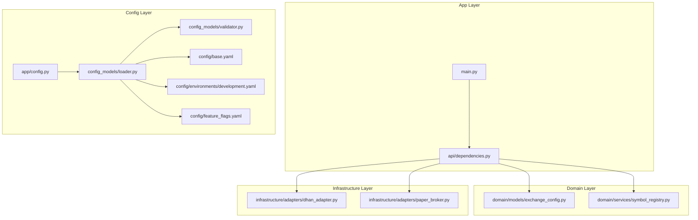
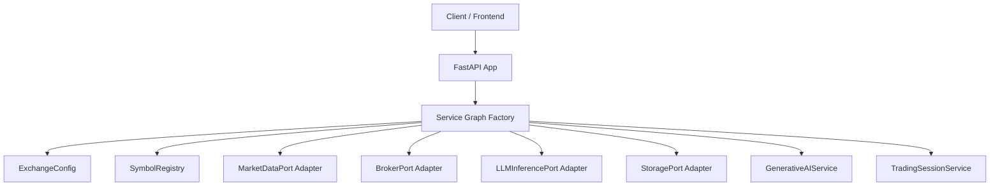
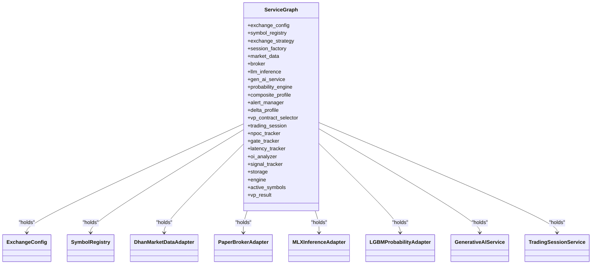
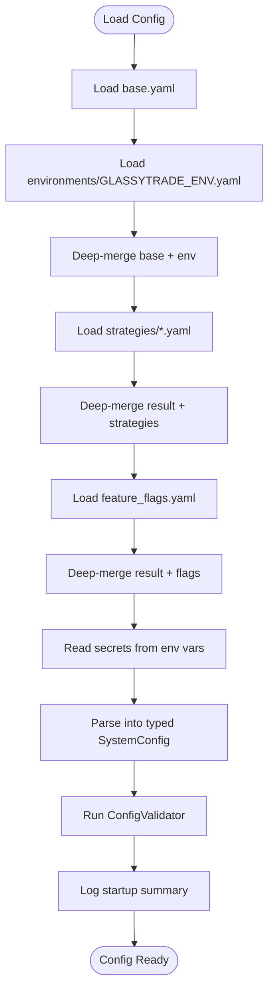
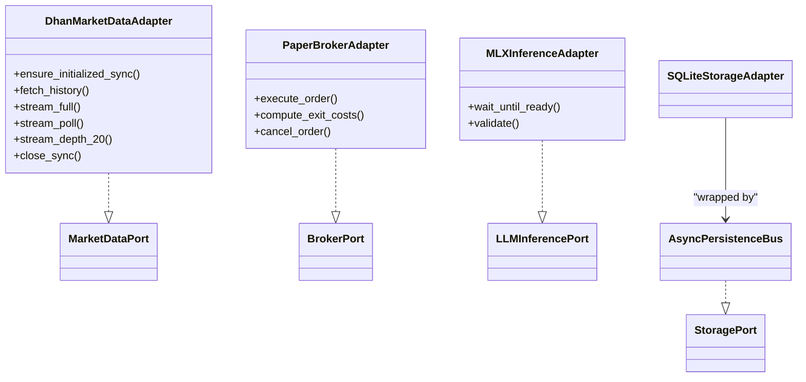
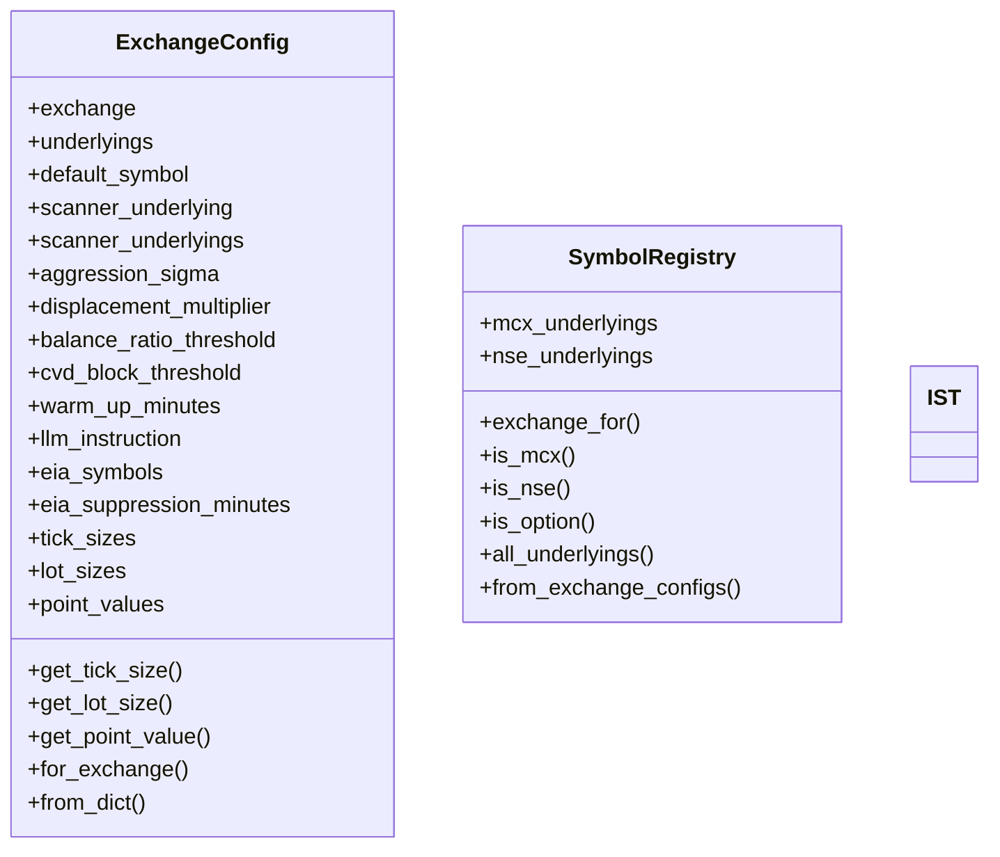
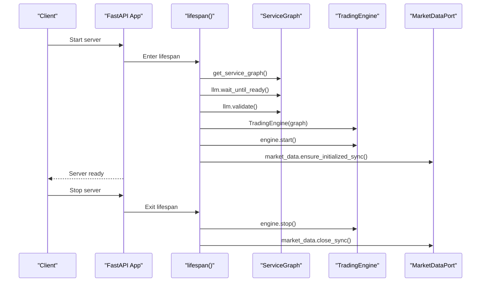
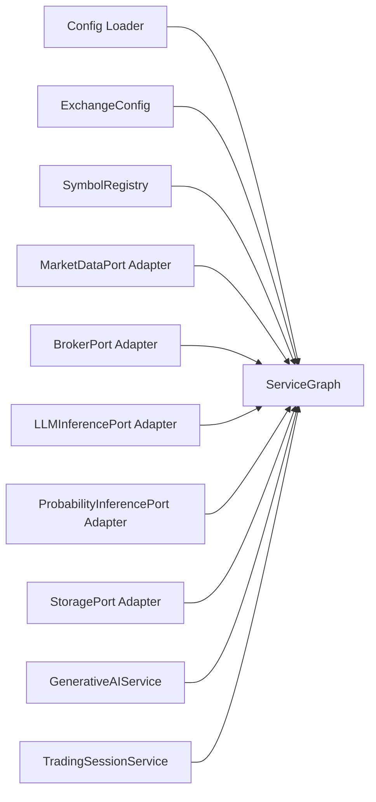

# Service Architecture

<cite>
**Referenced Files in This Document**
- [backend/app/main.py](file://backend/app/main.py)
- [backend/app/api/dependencies.py](file://backend/app/api/dependencies.py)
- [backend/app/config.py](file://backend/app/config.py)
- [backend/app/config_models/loader.py](file://backend/app/config_models/loader.py)
- [backend/app/config_models/validator.py](file://backend/app/config_models/validator.py)
- [backend/config/base.yaml](file://backend/config/base.yaml)
- [backend/config/environments/development.yaml](file://backend/config/environments/development.yaml)
- [backend/config/feature_flags.yaml](file://backend/config/feature_flags.yaml)
- [backend/app/shared/timezones.py](file://backend/app/shared/timezones.py)
- [backend/app/domain/models/exchange_config.py](file://backend/app/domain/models/exchange_config.py)
- [backend/app/domain/services/symbol_registry.py](file://backend/app/domain/services/symbol_registry.py)
- [backend/app/infrastructure/adapters/paper_broker.py](file://backend/app/infrastructure/adapters/paper_broker.py)
- [backend/app/infrastructure/adapters/dhan_adapter.py](file://backend/app/infrastructure/adapters/dhan_adapter.py)
</cite>

## Table of Contents
1. [Introduction](#introduction)
2. [Project Structure](#project-structure)
3. [Core Components](#core-components)
4. [Architecture Overview](#architecture-overview)
5. [Detailed Component Analysis](#detailed-component-analysis)
6. [Dependency Analysis](#dependency-analysis)
7. [Performance Considerations](#performance-considerations)
8. [Troubleshooting Guide](#troubleshooting-guide)
9. [Conclusion](#conclusion)
10. [Appendices](#appendices)

## Introduction
This document explains the GlassyTrade AI service architecture patterns with a focus on:
- Dependency Injection (DI) and the service graph creation mechanism
- Configuration management across environments and feature flags
- Utility and shared components supporting cross-cutting concerns
- Timezone handling and other shared utilities
- Practical examples of service wiring, dependency resolution, and architectural patterns such as Ports & Adapters and Hexagonal Architecture
- Service lifecycle management, startup sequence, and graceful shutdown

## Project Structure
The backend is organized around a layered, modular structure emphasizing separation of concerns:
- Application layer: API routers, handlers, and services orchestrating trading logic
- Domain layer: Models, ports, services, and domain-specific logic
- Infrastructure layer: Adapters, storage, and external integrations
- Shared layer: Cross-cutting utilities and configuration
- Config layer: YAML-based configuration hierarchy with environment overrides and feature flags

**Diagram sources**
- [backend/app/main.py:171-176](file://backend/app/main.py#L171-L176)
- [backend/app/api/dependencies.py:43-327](file://backend/app/api/dependencies.py#L43-L327)
- [backend/app/config.py:26-156](file://backend/app/config.py#L26-L156)
- [backend/app/config_models/loader.py:139-245](file://backend/app/config_models/loader.py#L139-L245)
- [backend/app/config_models/validator.py:22-176](file://backend/app/config_models/validator.py#L22-L176)
- [backend/config/base.yaml:1-493](file://backend/config/base.yaml#L1-L493)
- [backend/config/environments/development.yaml:1-33](file://backend/config/environments/development.yaml#L1-L33)
- [backend/config/feature_flags.yaml:1-37](file://backend/config/feature_flags.yaml#L1-L37)
- [backend/app/domain/models/exchange_config.py:20-307](file://backend/app/domain/models/exchange_config.py#L20-L307)
- [backend/app/domain/services/symbol_registry.py:19-94](file://backend/app/domain/services/symbol_registry.py#L19-L94)
- [backend/app/infrastructure/adapters/dhan_adapter.py:66-457](file://backend/app/infrastructure/adapters/dhan_adapter.py#L66-L457)
- [backend/app/infrastructure/adapters/paper_broker.py:118-199](file://backend/app/infrastructure/adapters/paper_broker.py#L118-L199)

**Section sources**
- [backend/app/main.py:1-227](file://backend/app/main.py#L1-L227)
- [backend/app/api/dependencies.py:1-384](file://backend/app/api/dependencies.py#L1-L384)
- [backend/app/config.py:1-157](file://backend/app/config.py#L1-L157)
- [backend/app/config_models/loader.py:1-288](file://backend/app/config_models/loader.py#L1-L288)
- [backend/app/config_models/validator.py:1-177](file://backend/app/config_models/validator.py#L1-L177)
- [backend/config/base.yaml:1-493](file://backend/config/base.yaml#L1-L493)
- [backend/config/environments/development.yaml:1-33](file://backend/config/environments/development.yaml#L1-L33)
- [backend/config/feature_flags.yaml:1-37](file://backend/config/feature_flags.yaml#L1-L37)
- [backend/app/domain/models/exchange_config.py:1-307](file://backend/app/domain/models/exchange_config.py#L1-L307)
- [backend/app/domain/services/symbol_registry.py:1-94](file://backend/app/domain/services/symbol_registry.py#L1-L94)
- [backend/app/infrastructure/adapters/dhan_adapter.py:1-457](file://backend/app/infrastructure/adapters/dhan_adapter.py#L1-L457)
- [backend/app/infrastructure/adapters/paper_broker.py:1-199](file://backend/app/infrastructure/adapters/paper_broker.py#L1-L199)

## Core Components
- Service Graph Factory: Builds and wires the entire service graph once at startup, exposing singleton instances via FastAPI dependency helpers.
- Configuration Loader and Validator: Loads YAML hierarchy, merges environment overrides, parses typed configuration, validates rules, and logs a startup summary.
- Adapter Layer: Implements ports for market data, broker, LLM inference, and storage; integrates with external systems.
- Domain Services: Provide exchange abstraction, symbol registry, and session context factories.
- Shared Utilities: Timezone constants and configuration base settings.

Key responsibilities:
- DI and Service Wiring: Centralized in the service graph factory; FastAPI dependencies resolve from the singleton graph.
- Configuration Management: Hierarchical YAML loading with environment-specific overrides and feature flags.
- Cross-Cutting Concerns: Structured logging, rate limiting, CORS, and timezone handling.

**Section sources**
- [backend/app/api/dependencies.py:43-327](file://backend/app/api/dependencies.py#L43-L327)
- [backend/app/config_models/loader.py:139-245](file://backend/app/config_models/loader.py#L139-L245)
- [backend/app/config_models/validator.py:22-176](file://backend/app/config_models/validator.py#L22-L176)
- [backend/app/infrastructure/adapters/dhan_adapter.py:66-457](file://backend/app/infrastructure/adapters/dhan_adapter.py#L66-L457)
- [backend/app/infrastructure/adapters/paper_broker.py:118-199](file://backend/app/infrastructure/adapters/paper_broker.py#L118-L199)
- [backend/app/domain/models/exchange_config.py:20-307](file://backend/app/domain/models/exchange_config.py#L20-L307)
- [backend/app/domain/services/symbol_registry.py:19-94](file://backend/app/domain/services/symbol_registry.py#L19-L94)
- [backend/app/shared/timezones.py:14-16](file://backend/app/shared/timezones.py#L14-L16)

## Architecture Overview
GlassyTrade AI follows a layered architecture aligned with Ports & Adapters and Hexagonal Architecture:
- Domain layer defines contracts (ports) and core business logic
- Infrastructure layer implements adapters for external systems
- Application layer orchestrates services and exposes HTTP APIs
- Configuration and shared utilities provide cross-cutting capabilities

**Diagram sources**
- [backend/app/main.py:171-176](file://backend/app/main.py#L171-L176)
- [backend/app/api/dependencies.py:43-327](file://backend/app/api/dependencies.py#L43-L327)

## Detailed Component Analysis

### Dependency Injection and Service Graph Creation
The service graph is created once at startup and exposed via FastAPI dependency helpers. It wires:
- Exchange abstraction: ExchangeConfig and Strategy
- Symbol registry and session factory
- Market data adapter (Dhan)
- Broker adapter (Paper)
- LLM inference adapter (MLX)
- Generative AI service
- Probability inference adapter (LightGBM)
- Storage adapter (SQLite) wrapped in an async persistence bus
- Trading session service and auxiliary services (alert manager, composite profile, gate rejection tracker, latency tracker, signal tracker, OI analyzer, NPOC tracker, VP contract selector)

**Diagram sources**
- [backend/app/api/dependencies.py:43-327](file://backend/app/api/dependencies.py#L43-L327)
- [backend/app/domain/models/exchange_config.py:20-307](file://backend/app/domain/models/exchange_config.py#L20-L307)
- [backend/app/domain/services/symbol_registry.py:19-94](file://backend/app/domain/services/symbol_registry.py#L19-L94)
- [backend/app/infrastructure/adapters/dhan_adapter.py:66-457](file://backend/app/infrastructure/adapters/dhan_adapter.py#L66-L457)
- [backend/app/infrastructure/adapters/paper_broker.py:118-199](file://backend/app/infrastructure/adapters/paper_broker.py#L118-L199)

Practical examples:
- Service wiring: The factory constructs adapters and services, initializes async persistence, and pre-warms the broker and scanners.
- Dependency resolution: FastAPI dependency helpers return singleton instances from the service graph.
- Strategy pattern: Exchange strategy is selected at startup based on ExchangeConfig.

**Section sources**
- [backend/app/api/dependencies.py:43-327](file://backend/app/api/dependencies.py#L43-L327)
- [backend/app/api/dependencies.py:324-384](file://backend/app/api/dependencies.py#L324-L384)

### Configuration Management System
Configuration is loaded from a YAML hierarchy with strict merge order:
1. base.yaml: Establishes defaults
2. environments/{GLASSYTRADE_ENV}.yaml: Deep-merge overrides base
3. strategies/*.yaml: Deep-merge overrides result
4. feature_flags.yaml: Feature flags
5. Environment variables: Secrets only
6. Typed SystemConfig: Immutable, frozen
7. Validation: ConfigValidator runs hard and warning rules
8. Logging: Startup summary

**Diagram sources**
- [backend/app/config_models/loader.py:139-245](file://backend/app/config_models/loader.py#L139-L245)
- [backend/app/config_models/validator.py:22-176](file://backend/app/config_models/validator.py#L22-L176)
- [backend/config/base.yaml:1-493](file://backend/config/base.yaml#L1-L493)
- [backend/config/environments/development.yaml:1-33](file://backend/config/environments/development.yaml#L1-L33)
- [backend/config/feature_flags.yaml:1-37](file://backend/config/feature_flags.yaml#L1-L37)

Environment-specific settings:
- Development environment restricts symbols and relaxes risk parameters.
- Feature flags enable/disable components and roles (e.g., LLM advisory, risk tier engine).

Feature flags:
- Short signals, risk tier engine, initial balance engine, correlation guard, LLM roles, and infrastructure flags.

**Section sources**
- [backend/app/config_models/loader.py:139-245](file://backend/app/config_models/loader.py#L139-L245)
- [backend/app/config_models/validator.py:22-176](file://backend/app/config_models/validator.py#L22-L176)
- [backend/config/environments/development.yaml:1-33](file://backend/config/environments/development.yaml#L1-L33)
- [backend/config/feature_flags.yaml:1-37](file://backend/config/feature_flags.yaml#L1-L37)

### Adapter Layer and Ports & Adapters Pattern
Adapters implement domain ports to integrate with external systems:
- MarketDataPort: DhanMarketDataAdapter provides historical data, quotes, streaming, and fallback polling
- BrokerPort: PaperBrokerAdapter simulates order execution with realistic cost modeling
- LLMInferencePort: MLXInferenceAdapter provides model loading, readiness checks, and validation
- StoragePort: SQLiteStorageAdapter wrapped by AsyncPersistenceBus for async writes

**Diagram sources**
- [backend/app/infrastructure/adapters/dhan_adapter.py:66-457](file://backend/app/infrastructure/adapters/dhan_adapter.py#L66-L457)
- [backend/app/infrastructure/adapters/paper_broker.py:118-199](file://backend/app/infrastructure/adapters/paper_broker.py#L118-L199)
- [backend/app/api/dependencies.py:97-112](file://backend/app/api/dependencies.py#L97-L112)

**Section sources**
- [backend/app/infrastructure/adapters/dhan_adapter.py:66-457](file://backend/app/infrastructure/adapters/dhan_adapter.py#L66-L457)
- [backend/app/infrastructure/adapters/paper_broker.py:118-199](file://backend/app/infrastructure/adapters/paper_broker.py#L118-L199)
- [backend/app/api/dependencies.py:97-112](file://backend/app/api/dependencies.py#L97-L112)

### Domain Abstractions and Shared Utilities
- ExchangeConfig: Immutable configuration for NSE/MCX with exchange-specific defaults, thresholds, and tick/lot sizes
- SymbolRegistry: Centralized exchange detection and symbol categorization
- Timezone utilities: Consistent IST usage across the system

**Diagram sources**
- [backend/app/domain/models/exchange_config.py:20-307](file://backend/app/domain/models/exchange_config.py#L20-L307)
- [backend/app/domain/services/symbol_registry.py:19-94](file://backend/app/domain/services/symbol_registry.py#L19-L94)
- [backend/app/shared/timezones.py:14-16](file://backend/app/shared/timezones.py#L14-L16)

**Section sources**
- [backend/app/domain/models/exchange_config.py:20-307](file://backend/app/domain/models/exchange_config.py#L20-L307)
- [backend/app/domain/services/symbol_registry.py:19-94](file://backend/app/domain/services/symbol_registry.py#L19-L94)
- [backend/app/shared/timezones.py:14-16](file://backend/app/shared/timezones.py#L14-L16)

### Service Lifecycle, Startup, and Shutdown
Lifecycle management is handled in the FastAPI lifespan:
- Startup:
  - Create service graph and load LLM model
  - Wait for model readiness and run validation
  - Start the trading engine and inject references
  - Initialize market data feed and scanners
- Running:
  - Serve API endpoints and WebSocket
- Shutdown:
  - Stop trading engine
  - Flush pending database ticks
  - Shutdown handler thread pools
  - Disconnect market data feed

**Diagram sources**
- [backend/app/main.py:83-170](file://backend/app/main.py#L83-L170)
- [backend/app/api/dependencies.py:324-327](file://backend/app/api/dependencies.py#L324-L327)

**Section sources**
- [backend/app/main.py:83-170](file://backend/app/main.py#L83-L170)
- [backend/app/api/dependencies.py:324-327](file://backend/app/api/dependencies.py#L324-L327)

## Dependency Analysis
The service graph exhibits strong cohesion within functional areas and loose coupling via ports. Key dependency relationships:
- ServiceGraph depends on configuration and adapters
- TradingSessionService depends on broker, gen AI service, storage, and probability engine
- Domain services depend on ExchangeConfig and SymbolRegistry
- Adapters depend on external libraries via the brokers package

Potential circular dependencies are avoided by:
- One-way imports from application to domain/infrastructure
- Singleton service graph preventing multiple instantiations
- Ports decoupling domain from infrastructure

**Diagram sources**
- [backend/app/config_models/loader.py:139-245](file://backend/app/config_models/loader.py#L139-L245)
- [backend/app/api/dependencies.py:43-327](file://backend/app/api/dependencies.py#L43-L327)

**Section sources**
- [backend/app/config_models/loader.py:139-245](file://backend/app/config_models/loader.py#L139-L245)
- [backend/app/api/dependencies.py:43-327](file://backend/app/api/dependencies.py#L43-L327)

## Performance Considerations
- Asynchronous persistence bus offloads storage writes to a background thread
- Pre-warming of market data and scanners reduces cold-start latency
- LLM model readiness and validation occur during startup to avoid runtime failures
- Rate limiting middleware protects the server from overload
- Timezone handling uses a single constant to avoid repeated timezone object construction

[No sources needed since this section provides general guidance]

## Troubleshooting Guide
Common issues and diagnostics:
- LLM model readiness: If model fails to load within timeout, backend starts but LLM calls will fail; validate readiness and run validation
- Trading engine start: Failures are logged; inspect engine initialization and dependencies
- Market data feed: Initialization failures are logged; ensure credentials and network connectivity
- Configuration validation: Hard errors block boot; review validation messages and fix misconfigurations
- Shutdown: Errors during engine stop, tick flush, thread pool cleanup, or market data disconnect are logged as debug; investigate exceptions

**Section sources**
- [backend/app/main.py:83-170](file://backend/app/main.py#L83-L170)
- [backend/app/config_models/validator.py:22-176](file://backend/app/config_models/validator.py#L22-L176)

## Conclusion
GlassyTrade AI employs a robust DI-driven architecture with a centralized service graph, a hierarchical configuration system, and clear separation of concerns through Ports & Adapters. The design supports environment-specific configurations, feature flags, and cross-cutting utilities like timezone handling. The lifecycle management ensures reliable startup and graceful shutdown, while the adapter layer facilitates integration with external systems.

[No sources needed since this section summarizes without analyzing specific files]

## Appendices

### Practical Examples: Service Wiring and Dependency Resolution
- Wiring adapters and services: Construct adapters and services in the service graph factory; wrap storage with async persistence; initialize trackers and inject into the trading session
- Resolving dependencies: Use FastAPI dependency helpers to retrieve singleton instances from the service graph
- Example paths:
  - [ServiceGraph.__init__:46-327](file://backend/app/api/dependencies.py#L46-L327)
  - [get_service_graph:324-327](file://backend/app/api/dependencies.py#L324-L327)
  - [get_* dependency helpers:333-383](file://backend/app/api/dependencies.py#L333-L383)

**Section sources**
- [backend/app/api/dependencies.py:43-383](file://backend/app/api/dependencies.py#L43-L383)

### Configuration Loading and Validation Reference
- Loading order and parsing: [load_config:139-245](file://backend/app/config_models/loader.py#L139-L245)
- Validation rules: [validate_config:22-176](file://backend/app/config_models/validator.py#L22-L176)
- Base defaults: [base.yaml:1-493](file://backend/config/base.yaml#L1-L493)
- Environment overrides: [development.yaml:1-33](file://backend/config/environments/development.yaml#L1-L33)
- Feature flags: [feature_flags.yaml:1-37](file://backend/config/feature_flags.yaml#L1-L37)

**Section sources**
- [backend/app/config_models/loader.py:139-245](file://backend/app/config_models/loader.py#L139-L245)
- [backend/app/config_models/validator.py:22-176](file://backend/app/config_models/validator.py#L22-L176)
- [backend/config/base.yaml:1-493](file://backend/config/base.yaml#L1-L493)
- [backend/config/environments/development.yaml:1-33](file://backend/config/environments/development.yaml#L1-L33)
- [backend/config/feature_flags.yaml:1-37](file://backend/config/feature_flags.yaml#L1-L37)

### Adapter Contracts and Implementations
- Market data adapter: [DhanMarketDataAdapter:66-457](file://backend/app/infrastructure/adapters/dhan_adapter.py#L66-L457)
- Broker adapter: [PaperBrokerAdapter:118-199](file://backend/app/infrastructure/adapters/paper_broker.py#L118-L199)
- LLM adapter: [MLXInferenceAdapter:97-101](file://backend/app/api/dependencies.py#L97-L101)
- Storage adapter: [SQLiteStorageAdapter:106-112](file://backend/app/api/dependencies.py#L106-L112)

**Section sources**
- [backend/app/infrastructure/adapters/dhan_adapter.py:66-457](file://backend/app/infrastructure/adapters/dhan_adapter.py#L66-L457)
- [backend/app/infrastructure/adapters/paper_broker.py:118-199](file://backend/app/infrastructure/adapters/paper_broker.py#L118-L199)
- [backend/app/api/dependencies.py:97-112](file://backend/app/api/dependencies.py#L97-L112)