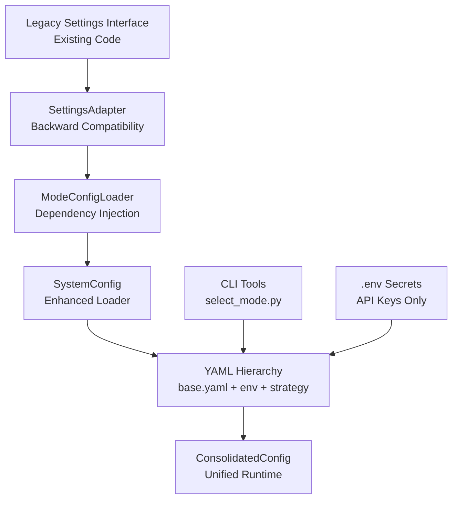
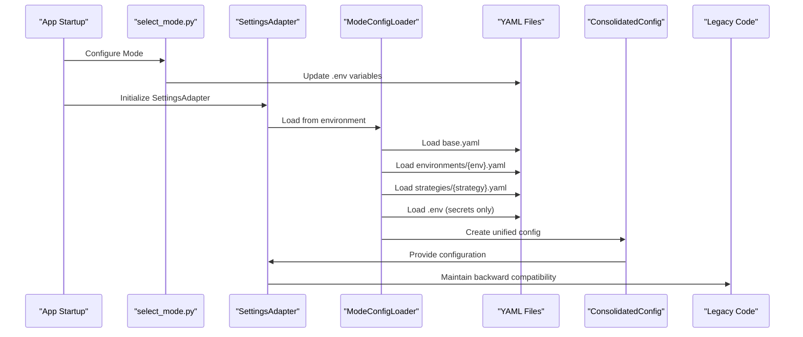
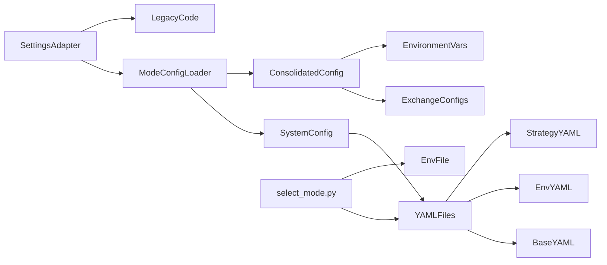

# Configuration Management

<cite>
**Referenced Files in This Document**
- [settings_adapter.py](file://backend/app/config_models/settings_adapter.py)
- [mode_config.py](file://backend/config/mode_config.py)
- [consolidated.py](file://backend/config/consolidated.py)
- [select_mode.py](file://backend/scripts/select_mode.py)
- [base.yaml](file://backend/config/base.yaml)
- [development.yaml](file://backend/config/environments/development.yaml)
- [paper.yaml](file://backend/config/environments/paper.yaml)
- [live.yaml](file://backend/config/environments/live.yaml)
- [mcx_options.yaml](file://backend/config/strategies/mcx_options.yaml)
- [nse_options.yaml](file://backend/config/strategies/nse_options.yaml)
- [feature_flags.yaml](file://backend/config/feature_flags.yaml)
- [config.py](file://backend/config/config.py)
</cite>

## Update Summary
**Changes Made**
- Updated to reflect comprehensive YAML-based configuration system with multi-layered hierarchy
- Added new CLI tools for mode selection and configuration management
- Enhanced SettingsAdapter documentation with backward compatibility layer
- Updated ModeConfigLoader documentation with dependency injection pattern
- Added new configuration files and strategies documentation
- Removed references to legacy environment path resolution and transitional debugging utilities

## Table of Contents
1. [Introduction](#introduction)
2. [Project Structure](#project-structure)
3. [Core Components](#core-components)
4. [Architecture Overview](#architecture-overview)
5. [Detailed Component Analysis](#detailed-component-analysis)
6. [CLI Tools and Mode Selection](#cli-tools-and-mode-selection)
7. [Dependency Analysis](#dependency-analysis)
8. [Performance Considerations](#performance-considerations)
9. [Security and Versioning](#security-and-versioning)
10. [Troubleshooting Guide](#troubleshooting-guide)
11. [Conclusion](#conclusion)

## Introduction
This document explains the comprehensive YAML-based configuration system used by GlassyTrade AI v5. The system introduces a multi-layered hierarchy with SettingsAdapter for backward compatibility, ModeConfigLoader for professional configuration management, and new CLI tools for mode selection. It covers how YAML files define base defaults, environment-specific overrides, strategy configurations, and feature flags; how configuration is loaded, validated, and applied at startup; and how to safely manage secrets and runtime parameters through the unified architecture.

## Project Structure
GlassyTrade AI v5 introduces a comprehensive configuration system with clear separation of concerns:

- **SettingsAdapter**: Backward compatibility layer maintaining existing import interfaces
- **ModeConfigLoader**: Professional configuration loader with dependency injection pattern
- **YAML-based Hierarchy**: Multi-layered configuration merging from base, environment, and strategy files
- **ConsolidatedConfig**: Unified runtime configuration with type safety and validation
- **CLI Tools**: New command-line interface for mode selection and configuration management
- **Secret Management**: Environment variables for sensitive data only

**Diagram sources**
- [settings_adapter.py:28-75](file://backend/app/config_models/settings_adapter.py#L28-L75)
- [mode_config.py:69-178](file://backend/config/mode_config.py#L69-L178)
- [consolidated.py:173-428](file://backend/config/consolidated.py#L173-L428)
- [select_mode.py:1-153](file://backend/scripts/select_mode.py#L1-L153)

**Section sources**
- [settings_adapter.py:1-314](file://backend/app/config_models/settings_adapter.py#L1-L314)
- [mode_config.py:1-264](file://backend/config/mode_config.py#L1-L264)
- [consolidated.py:1-532](file://backend/config/consolidated.py#L1-L532)
- [select_mode.py:1-153](file://backend/scripts/select_mode.py#L1-L153)

## Core Components
The new unified configuration system consists of several key components:

- **SettingsAdapter**: Maintains 100% backward compatibility while loading configuration from YAML files
- **ModeConfigLoader**: Professional configuration loader with dependency injection pattern
- **ModeConfig**: Complete configuration object containing system, scanner, and exchange configurations
- **ConsolidatedConfig**: Unified runtime configuration with type safety and validation
- **YAML Hierarchy**: Multi-layered configuration merging from base, environment, and strategy files
- **CLI Tools**: Command-line interface for mode selection and configuration management
- **Secret Management**: Environment variables for sensitive data only

**Section sources**
- [settings_adapter.py:28-314](file://backend/app/config_models/settings_adapter.py#L28-L314)
- [mode_config.py:35-178](file://backend/config/mode_config.py#L35-L178)
- [consolidated.py:173-428](file://backend/config/consolidated.py#L173-L428)
- [select_mode.py:60-111](file://backend/scripts/select_mode.py#L60-L111)

## Architecture Overview
The new configuration pipeline enforces a strict multi-layered YAML hierarchy with backward compatibility. It supports environment-specific tuning, strategy configurations, and feature gating while maintaining secrets in environment variables.

**Diagram sources**
- [settings_adapter.py:48-75](file://backend/app/config_models/settings_adapter.py#L48-L75)
- [mode_config.py:180-198](file://backend/config/mode_config.py#L180-L198)
- [consolidated.py:317-428](file://backend/config/consolidated.py#L317-L428)
- [select_mode.py:60-111](file://backend/scripts/select_mode.py#L60-L111)

## Detailed Component Analysis

### SettingsAdapter: Backward Compatibility Layer
SettingsAdapter serves as the critical bridge between the old environment-variable-only system and the new YAML-based hierarchy. It maintains 100% backward compatibility while loading configuration from YAML files.

Key features:
- **Configuration Hierarchy**: base.yaml → environments/{GLASSYTRADE_ENV}.yaml → strategies/{GLASSYTRADE_STRATEGY}.yaml → .env (secrets only)
- **Property Delegation**: All configuration properties are delegated to underlying ModeConfig and SystemConfig objects
- **Secret Management**: API keys and tokens loaded exclusively from .env file
- **Fallback Mechanism**: Graceful degradation if YAML configuration fails

**Section sources**
- [settings_adapter.py:28-107](file://backend/app/config_models/settings_adapter.py#L28-L107)
- [settings_adapter.py:287-300](file://backend/app/config_models/settings_adapter.py#L287-L300)

### ModeConfigLoader: Professional Configuration Loader
ModeConfigLoader implements the professional configuration hierarchy with dependency injection pattern. It loads configuration based on environment and strategy combinations.

Configuration loading process:
1. Set GLASSYTRADE_ENV and GLASSYTRADE_STRATEGY environment variables
2. Load SystemConfig using enhanced loader with strategy support
3. Load raw YAML files for scanner and exchange configurations
4. Extract configuration from all sources and create ModeConfig object
5. Log human-readable configuration summary

**Section sources**
- [mode_config.py:69-178](file://backend/config/mode_config.py#L69-L178)
- [mode_config.py:180-264](file://backend/config/mode_config.py#L180-L264)

### ConsolidatedConfig: Unified Runtime Configuration
ConsolidatedConfig provides a single source of truth for all configuration with comprehensive type safety and validation. It bridges between environment variables and YAML configurations.

Key capabilities:
- **Unified Loading**: from_env() + from_unified() methods for flexible configuration loading
- **Type Safety**: Pydantic models for all configuration sections
- **Environment Integration**: Environment variables override YAML where appropriate
- **Exchange Configuration**: Dynamic exchange-specific configuration from YAML

**Section sources**
- [consolidated.py:173-428](file://backend/config/consolidated.py#L173-L428)
- [consolidated.py:489-532](file://backend/config/consolidated.py#L489-L532)

### YAML-Based Configuration Hierarchy
The new system uses a comprehensive multi-layered configuration hierarchy that replaces the previous environment-variable-only approach:

**Configuration Merge Order**:
1. **base.yaml**: All defaults and global settings
2. **environments/{environment}.yaml**: Environment-specific overrides
3. **strategies/{strategy}.yaml**: Strategy-specific configurations
4. **.env file**: Secrets only (API keys, tokens)

**Section sources**
- [base.yaml:1-493](file://backend/config/base.yaml#L1-L493)
- [development.yaml:1-46](file://backend/config/environments/development.yaml#L1-L46)
- [paper.yaml:1-39](file://backend/config/environments/paper.yaml#L1-L39)
- [live.yaml:1-50](file://backend/config/environments/live.yaml#L1-L50)

### Strategy Configuration System
The new system supports multiple trading strategies through dedicated YAML files:

**Available Strategies**:
- **mcx_options.yaml**: MCX commodity options trading with CRUDEOIL and NATURALGAS
- **nse_options.yaml**: NSE index options trading with NIFTY, BANKNIFTY, and FINNIFTY

Each strategy file contains:
- Scanner configuration optimized for the specific market
- Exchange configuration with default symbols and segments
- AMT thresholds tuned for the strategy
- Feature flags specific to the strategy
- LLM configuration with strategy-specific instructions

**Section sources**
- [mcx_options.yaml:1-77](file://backend/config/strategies/mcx_options.yaml#L1-L77)
- [nse_options.yaml:1-77](file://backend/config/strategies/nse_options.yaml#L1-L77)

### Environment Configuration Management
The system supports three distinct environments with specific configurations:

**Development Environment**:
- Single symbol (NIFTY) for focused testing
- Paper broker mode with DEBUG logging
- Relaxed risk parameters for development
- Minimal scanner scope for faster testing

**Paper Environment**:
- All symbols enabled for comprehensive testing
- Realistic cost models and risk parameters
- Balanced scanner configuration
- Production-like settings for validation

**Live Environment**:
- Conservative risk parameters and production settings
- Full feature flags enabled
- Optimized scanner and LLM configurations
- Production-grade security and monitoring

**Section sources**
- [development.yaml:1-46](file://backend/config/environments/development.yaml#L1-L46)
- [paper.yaml:1-39](file://backend/config/environments/paper.yaml#L1-L39)
- [live.yaml:1-50](file://backend/config/environments/live.yaml#L1-L50)

### Feature Flag Management
The new system provides comprehensive feature flag management through YAML files:

**Feature Categories**:
- **Phase 0**: Basic functionality flags
- **Phase 1**: Infrastructure improvements
- **Phase 2**: Advanced trading features
- **Phase 3**: Machine learning enhancements
- **Phase 4**: Scalping and advanced features
- **Infrastructure**: System-level configuration

**Hardcoded Security Features**:
- `llm_entry_gate`: Always false for safety
- `llm_execution_enabled`: Controlled via environment variable only

**Section sources**
- [feature_flags.yaml:1-37](file://backend/config/feature_flags.yaml#L1-L37)
- [settings_adapter.py:260-262](file://backend/app/config_models/settings_adapter.py#L260-L262)

### Secret Management and Security
The new system implements proper separation of configuration and secrets:

**Configuration vs Secrets Separation**:
- **Configuration**: Loaded from YAML files (version-controlled)
- **Secrets**: Loaded exclusively from .env file (not version-controlled)
- **Security Principle**: 12-factor app compliance with environment variables for secrets only

**Supported Secrets**:
- DHAN API credentials (client ID, access token, API key, API secret)
- OpenRouter API key
- Telegram bot configuration
- LLM model paths and adapters

**Section sources**
- [mode_config.py:201-237](file://backend/config/mode_config.py#L201-L237)
- [settings_adapter.py:76-106](file://backend/app/config_models/settings_adapter.py#L76-L106)

## CLI Tools and Mode Selection
The new system includes comprehensive CLI tools for configuration management:

### select_mode.py: Interactive Mode Selection
The select_mode.py script provides an intuitive interface for choosing trading modes:

**Features**:
- Interactive mode selection with validation
- Automatic .env file updates
- Configuration hierarchy visualization
- Usage examples and restart instructions

**Usage Patterns**:
- `python scripts/select_mode.py --list`: Show available modes
- `python scripts/select_mode.py --env paper --strategy mcx_options`: Set specific mode
- Automatic backup and validation of .env file

**Section sources**
- [select_mode.py:1-153](file://backend/scripts/select_mode.py#L1-L153)

## Dependency Analysis
The new unified configuration system creates clear dependencies between components:

**Diagram sources**
- [settings_adapter.py:54-65](file://backend/app/config_models/settings_adapter.py#L54-L65)
- [mode_config.py:112-115](file://backend/config/mode_config.py#L112-L115)
- [consolidated.py:329-331](file://backend/config/consolidated.py#L329-L331)
- [select_mode.py:60-111](file://backend/scripts/select_mode.py#L60-L111)

**Section sources**
- [settings_adapter.py:54-65](file://backend/app/config_models/settings_adapter.py#L54-L65)
- [mode_config.py:112-115](file://backend/config/mode_config.py#L112-L115)
- [consolidated.py:329-331](file://backend/config/consolidated.py#L329-L331)
- [select_mode.py:60-111](file://backend/scripts/select_mode.py#L60-L111)

## Performance Considerations
The new unified configuration system offers several performance benefits:

- **Lazy Loading**: Configuration is loaded only when needed
- **Singleton Pattern**: ConsolidatedConfig instances are cached globally
- **Efficient Merging**: YAML files are processed once during initialization
- **Memory Optimization**: Type-safe models minimize memory overhead
- **Environment Variable Caching**: Frequently accessed environment variables are cached
- **CLI Optimization**: select_mode.py provides batch operations for configuration updates

Best practices:
- Keep YAML files minimal and focused
- Use environment variables for frequently changing values
- Leverage strategy-specific configurations to reduce merge complexity
- Monitor configuration loading performance in production
- Use CLI tools for bulk configuration changes

## Security and Versioning
The new system implements comprehensive security and versioning practices:

**Security Measures**:
- **Secret Isolation**: API keys and tokens stored separately from configuration
- **Environment Variable Protection**: Sensitive data never committed to version control
- **Hardcoded Security**: Critical security flags are hardcoded for protection
- **Access Control**: Limited access to configuration loading mechanisms
- **CLI Security**: select_mode.py validates inputs and prevents invalid configurations

**Versioning Strategy**:
- **YAML Files**: Version-controlled in Git for configuration history
- **Environment Variables**: Managed externally for deployment-specific values
- **Migration Support**: Backward compatibility maintained during transitions
- **Audit Trail**: Configuration loading logs provide traceability
- **Backup Strategy**: CLI tools automatically backup .env files before modifications

**Section sources**
- [mode_config.py:201-237](file://backend/config/mode_config.py#L201-L237)
- [settings_adapter.py:67-74](file://backend/app/config_models/settings_adapter.py#L67-L74)
- [select_mode.py:60-111](file://backend/scripts/select_mode.py#L60-L111)

## Troubleshooting Guide
Common issues and resolutions for the new unified configuration system:

**Configuration Loading Issues**:
- **YAML Syntax Errors**: Check YAML files for proper indentation and syntax
- **Missing Environment Variables**: Ensure GLASSYTRADE_ENV and GLASSYTRADE_STRATEGY are set
- **Strategy File Not Found**: Verify strategy filename matches GLASSYTRADE_STRATEGY value
- **Secret Loading Failures**: Check .env file existence and format

**Backward Compatibility Issues**:
- **Settings Import Failures**: Verify SettingsAdapter initialization
- **Property Access Errors**: Check if property exists in new configuration hierarchy
- **Legacy Code Breaking**: Review SettingsAdapter fallback mechanisms

**Configuration Validation Issues**:
- **Invalid Risk Parameters**: Ensure values fall within configured bounds
- **Missing Required Fields**: Verify all mandatory configuration fields are present
- **Environment Mismatch**: Check that environment-specific settings are valid

**CLI Tool Issues**:
- **Mode Selection Failures**: Verify select_mode.py has write permissions to .env
- **Invalid Arguments**: Check CLI arguments match available modes
- **File Permission Errors**: Ensure .env file is writable by current user

**Section sources**
- [settings_adapter.py:67-74](file://backend/app/config_models/settings_adapter.py#L67-L74)
- [mode_config.py:143-144](file://backend/config/mode_config.py#L143-L144)
- [consolidated.py:332-336](file://backend/config/consolidated.py#L332-L336)
- [select_mode.py:60-111](file://backend/scripts/select_mode.py#L60-L111)

## Conclusion
GlassyTrade AI's new unified configuration system represents a significant architectural improvement that maintains backward compatibility while introducing powerful new capabilities. The SettingsAdapter and ModeConfig components provide seamless migration from the previous environment-variable-only approach to a comprehensive multi-layered YAML hierarchy. This system offers improved maintainability, security, and flexibility while ensuring zero downtime during the transition period.

The professional configuration architecture supports complex trading strategies, environment-specific configurations, and comprehensive feature flag management while maintaining strict separation between configuration and secrets. The addition of CLI tools like select_mode.py provides intuitive mode selection and configuration management capabilities.

Teams can now safely tailor trading behavior across development, paper, and live environments using the comprehensive YAML hierarchy while benefiting from type safety, validation, and comprehensive logging. The system's modular design ensures easy maintenance and future extensibility while providing robust security and performance characteristics essential for production trading systems.