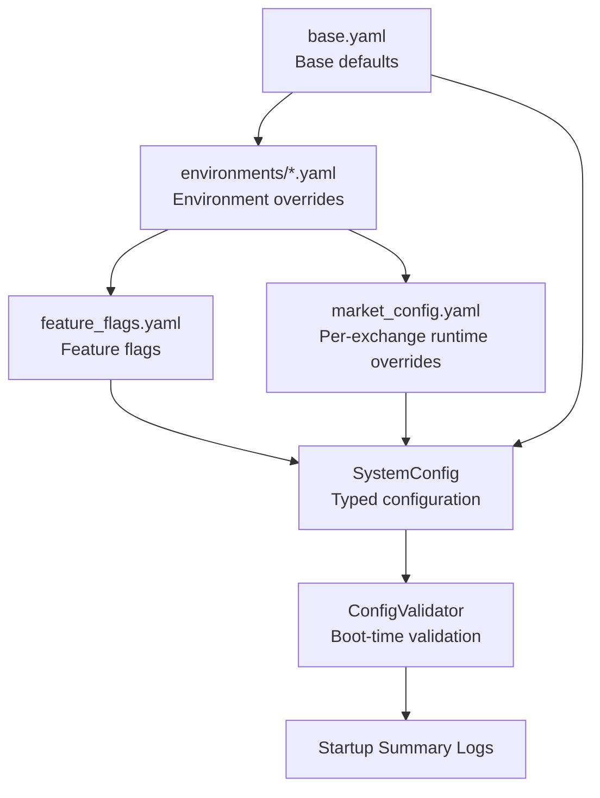
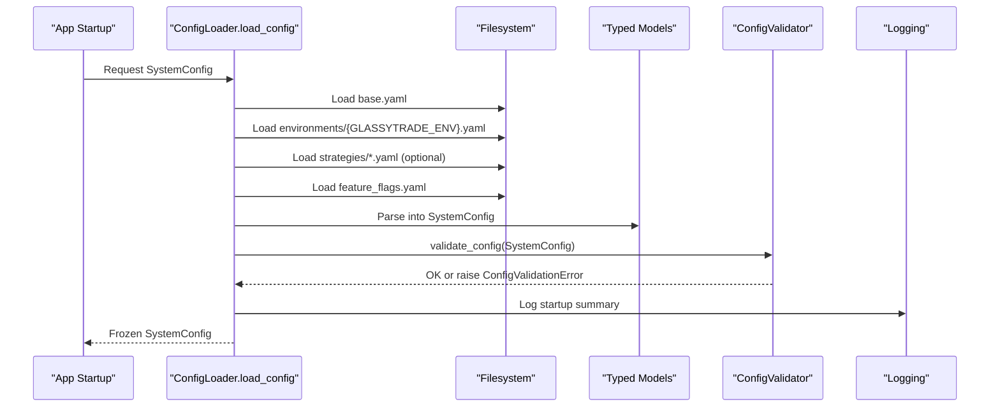
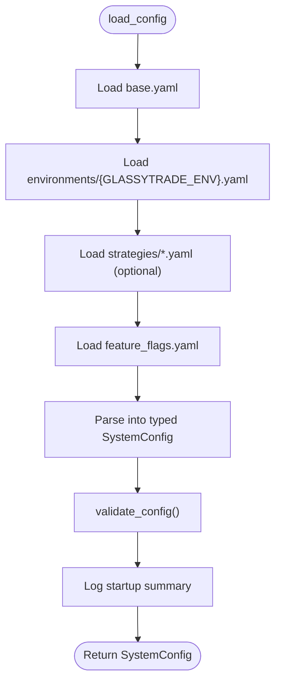
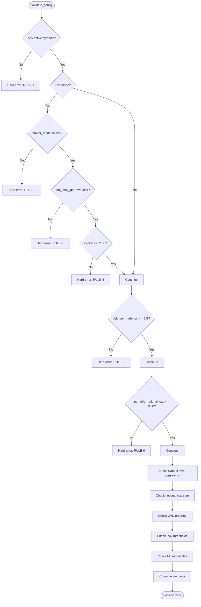
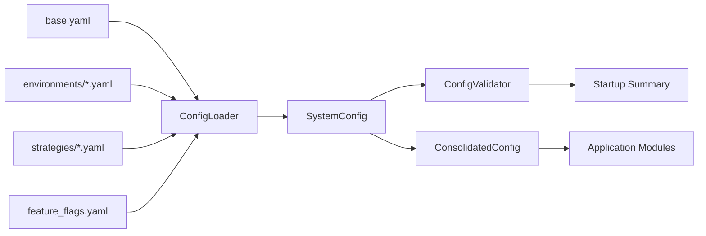

# Configuration Management

<cite>
**Referenced Files in This Document**
- [base.yaml](file://backend/config/base.yaml)
- [development.yaml](file://backend/config/environments/development.yaml)
- [paper.yaml](file://backend/config/environments/paper.yaml)
- [live.yaml](file://backend/config/environments/live.yaml)
- [feature_flags.yaml](file://backend/config/feature_flags.yaml)
- [instruments.json](file://backend/config/instruments.json)
- [loader.py](file://backend/app/config_models/loader.py)
- [validator.py](file://backend/app/config_models/validator.py)
- [consolidated.py](file://backend/config/consolidated.py)
- [market_config.yaml](file://backend/app/market_config.yaml)
- [config.py](file://backend/app/config.py)
- [main.py](file://backend/app/main.py)
</cite>

## Table of Contents
1. [Introduction](#introduction)
2. [Project Structure](#project-structure)
3. [Core Components](#core-components)
4. [Architecture Overview](#architecture-overview)
5. [Detailed Component Analysis](#detailed-component-analysis)
6. [Dependency Analysis](#dependency-analysis)
7. [Performance Considerations](#performance-considerations)
8. [Security and Versioning](#security-and-versioning)
9. [Troubleshooting Guide](#troubleshooting-guide)
10. [Conclusion](#conclusion)

## Introduction
This document explains the hierarchical configuration system used by GlassyTrade AI v5. It covers how YAML files define base defaults, environment-specific overrides, and feature flags; how configuration is loaded, validated, and applied at startup; and how to safely manage secrets and runtime parameters. Practical examples show how to configure development, paper, and live environments, customize risk controls, and toggle features.

## Project Structure
GlassyTrade AI separates configuration into:
- Base defaults and global settings in YAML
- Environment-specific overrides
- Feature flags
- Exchange and instrument metadata
- A consolidated Python configuration model for runtime access and validation

**Diagram sources**
- [base.yaml:1-493](file://backend/config/base.yaml#L1-L493)
- [development.yaml:1-33](file://backend/config/environments/development.yaml#L1-L33)
- [paper.yaml:1-25](file://backend/config/environments/paper.yaml#L1-L25)
- [live.yaml:1-26](file://backend/config/environments/live.yaml#L1-L26)
- [feature_flags.yaml:1-37](file://backend/config/feature_flags.yaml#L1-L37)
- [market_config.yaml:1-60](file://backend/app/market_config.yaml#L1-L60)
- [loader.py:139-245](file://backend/app/config_models/loader.py#L139-L245)
- [validator.py:22-177](file://backend/app/config_models/validator.py#L22-L177)

**Section sources**
- [base.yaml:1-493](file://backend/config/base.yaml#L1-L493)
- [development.yaml:1-33](file://backend/config/environments/development.yaml#L1-L33)
- [paper.yaml:1-25](file://backend/config/environments/paper.yaml#L1-L25)
- [live.yaml:1-26](file://backend/config/environments/live.yaml#L1-L26)
- [feature_flags.yaml:1-37](file://backend/config/feature_flags.yaml#L1-L37)
- [market_config.yaml:1-60](file://backend/app/market_config.yaml#L1-L60)

## Core Components
- Base configuration: global constants, exchange and symbol defaults, risk, and LLM settings.
- Environment files: development, paper, and live with broker modes, logging levels, and risk envelopes.
- Feature flags: granular feature toggles across phases and roles.
- Instrument catalog: exchange-specific instrument metadata for scanners and sessions.
- Loader and validator: merge YAML, parse into typed objects, validate, and log startup summary.
- Consolidated runtime config: typed settings for application modules with environment variable overrides.

**Section sources**
- [base.yaml:1-493](file://backend/config/base.yaml#L1-L493)
- [loader.py:139-245](file://backend/app/config_models/loader.py#L139-L245)
- [validator.py:22-177](file://backend/app/config_models/validator.py#L22-L177)
- [consolidated.py:173-418](file://backend/config/consolidated.py#L173-L418)
- [config.py:26-157](file://backend/app/config.py#L26-L157)

## Architecture Overview
The configuration pipeline enforces a strict merge order and validates at boot. It supports environment-specific tuning and feature gating while keeping secrets out of committed YAML.

**Diagram sources**
- [loader.py:139-245](file://backend/app/config_models/loader.py#L139-L245)
- [validator.py:22-177](file://backend/app/config_models/validator.py#L22-L177)

## Detailed Component Analysis

### Hierarchical Merge and Overrides
- Merge order:
  1) base.yaml
  2) environments/{GLASSYTRADE_ENV}.yaml
  3) strategies/*.yaml (optional)
  4) feature_flags.yaml
  5) Typed SystemConfig
  6) Validation
  7) Startup summary
- Environment selection: GLASSYTRADE_ENV determines which environment file is loaded.
- Strategy overrides: optional YAML files in strategies/ are deep-merged after environment overrides.
- Feature flags: loaded from feature_flags.yaml with explicit defaults and environment-specific overrides.

Practical example: To enable paper trading with relaxed risk and realistic costs:
- Set GLASSYTRADE_ENV to paper.
- Keep exchanges enabled for both NSE and MCX.
- risk and cost_model are set in the environment file.

**Section sources**
- [loader.py:139-245](file://backend/app/config_models/loader.py#L139-L245)
- [development.yaml:1-33](file://backend/config/environments/development.yaml#L1-L33)
- [paper.yaml:1-25](file://backend/config/environments/paper.yaml#L1-L25)
- [live.yaml:1-26](file://backend/config/environments/live.yaml#L1-L26)
- [feature_flags.yaml:1-37](file://backend/config/feature_flags.yaml#L1-L37)

### Base Configuration (Global Settings, Exchanges, Risk, LLM)
- Global constants: volume profile, order flow, market state, aggression scoring, structure, trade setup, risk thresholds, time, LLM throttling, grade, and data limits.
- Exchange configurations: NSE and MCX with segments, sessions, warm-up minutes, timezone, and symbol-specific defaults.
- Risk configuration: per-trade risk, daily loss, drawdown, ceilings, position caps, Kelly parameters, and bootstrap count.
- LLM configuration: model IDs, temperatures, token limits, timeouts, and instruction prompts.

Example highlights:
- Global risk per trade capped at 0.005 in base; environment files can relax or tighten.
- Exchange symbol defaults include lot sizes, tick sizes, value area percentiles, thresholds, and cost profiles.
- LLM settings include entry and overseer temperatures and reasoning model ID.

**Section sources**
- [base.yaml:14-493](file://backend/config/base.yaml#L14-L493)

### Environment-Specific Configurations
- Development:
  - Broker mode: paper
  - Log level: DEBUG
  - Restrict to one symbol (NIFTY) and disable others
  - Relaxed risk and realistic cost model
- Paper:
  - Broker mode: paper
  - Log level: INFO
  - Enable both exchanges
  - Realistic risk and cost model
- Live:
  - Broker mode: live
  - Log level: WARNING
  - Enable both exchanges
  - Tight risk envelope and LLM restrictions

Runtime behavior:
- Environment selection is controlled by GLASSYTRADE_ENV.
- Broker mode must be live in live environment; otherwise, startup validation fails.

**Section sources**
- [development.yaml:1-33](file://backend/config/environments/development.yaml#L1-L33)
- [paper.yaml:1-25](file://backend/config/environments/paper.yaml#L1-L25)
- [live.yaml:1-26](file://backend/config/environments/live.yaml#L1-L26)
- [validator.py:32-44](file://backend/app/config_models/validator.py#L32-L44)

### Feature Flag Management
- Feature flags are grouped by phase and role.
- Some flags are hardcoded in the loader for safety (e.g., llm_entry_gate is forced false).
- Environment files can override flag defaults.
- Examples:
  - realistic_cost_model enabled in paper.
  - short_signals_enabled enabled by default; requires walk_forward_validation for safe operation.
  - risk_tier_engine and bootstrap_trade_count thresholds are validated.

**Section sources**
- [feature_flags.yaml:1-37](file://backend/config/feature_flags.yaml#L1-L37)
- [loader.py:167-189](file://backend/app/config_models/loader.py#L167-L189)
- [validator.py:121-131](file://backend/app/config_models/validator.py#L121-L131)

### Runtime Configuration Bridge (ConsolidatedConfig)
- Provides a single source of truth for application modules.
- Loads from environment variables and optionally merges with YAML market_config.yaml.
- Exposes helpers to get exchange-specific overrides and a singleton accessor.
- Supports environment variable overrides for trading, LLM, risk, AMT thresholds, notifications, and server settings.

Practical usage:
- Use get_config() to obtain the singleton configuration.
- Use get_exchange_config(exchange) to bridge to domain ExchangeConfig with YAML overrides.

**Section sources**
- [consolidated.py:173-418](file://backend/config/consolidated.py#L173-L418)
- [market_config.yaml:1-60](file://backend/app/market_config.yaml#L1-L60)

### Configuration Loading Mechanism
- Loader loads base, environment, strategies, and flags; deep-merges dictionaries; parses into typed models; validates; logs summary.
- The loader also logs a human-readable snapshot of effective configuration at startup.

**Diagram sources**
- [loader.py:139-245](file://backend/app/config_models/loader.py#L139-L245)
- [validator.py:22-177](file://backend/app/config_models/validator.py#L22-L177)

**Section sources**
- [loader.py:139-245](file://backend/app/config_models/loader.py#L139-L245)

### Validation Processes
Validation runs at boot and includes:
- Hard errors (block boot): active symbols present, live environment constraints (broker_mode, llm_entry_gate, capital), risk caps, symbol-level constraints (value_area_pct, min_rr_ratio), notional caps, CVD thresholds, LVN thresholds, ML model availability.
- Warnings (allow boot): unusually high paper capital, short signals without walk-forward validation, risk tier bootstrap count, min_rr_ratio below recommended floor, LLM advisory without model, MCX futures-only symbols.

**Diagram sources**
- [validator.py:22-177](file://backend/app/config_models/validator.py#L22-L177)

**Section sources**
- [validator.py:22-177](file://backend/app/config_models/validator.py#L22-L177)

### Practical Configuration Examples

- Development environment:
  - Set GLASSYTRADE_ENV=development.
  - Keep broker_mode=paper and log_level=DEBUG.
  - Only NIFTY enabled; BANKNIFTY and FINNIFTY disabled.
  - Relaxed risk and realistic cost model enabled.

- Paper environment:
  - Set GLASSYTRADE_ENV=paper.
  - Enable both NSE and MCX.
  - Realistic risk and cost model enabled.

- Live environment:
  - Set GLASSYTRADE_ENV=live.
  - broker_mode must be live; llm_entry_gate is forced false.
  - Tight risk envelope and reduced max_concurrent_positions.

- Customizing risk controls:
  - Adjust risk.* parameters in environment files or base.yaml.
  - Example: increase max_daily_loss_pct in development for testing.

- Enabling/disabling features:
  - Toggle flags in feature_flags.yaml or environment files.
  - Example: enable short_signals_enabled and ensure walk_forward_validation is true.

- Exchange and symbol tuning:
  - Use market_config.yaml to override per-exchange settings (e.g., scanner underlyings, big trade thresholds).
  - Use ConsolidatedConfig to read environment variable overrides for trading, LLM, and risk.

**Section sources**
- [development.yaml:1-33](file://backend/config/environments/development.yaml#L1-L33)
- [paper.yaml:1-25](file://backend/config/environments/paper.yaml#L1-L25)
- [live.yaml:1-26](file://backend/config/environments/live.yaml#L1-L26)
- [market_config.yaml:1-60](file://backend/app/market_config.yaml#L1-L60)
- [consolidated.py:232-314](file://backend/config/consolidated.py#L232-L314)

## Dependency Analysis
The configuration system depends on:
- YAML files for declarative configuration
- Loader to merge and type-check
- Validator to enforce safety rules
- Runtime configuration bridge for application modules

**Diagram sources**
- [loader.py:139-245](file://backend/app/config_models/loader.py#L139-L245)
- [validator.py:22-177](file://backend/app/config_models/validator.py#L22-L177)
- [consolidated.py:173-418](file://backend/config/consolidated.py#L173-L418)

**Section sources**
- [loader.py:139-245](file://backend/app/config_models/loader.py#L139-L245)
- [validator.py:22-177](file://backend/app/config_models/validator.py#L22-L177)
- [consolidated.py:173-418](file://backend/config/consolidated.py#L173-L418)

## Performance Considerations
- Keep YAML files minimal and focused; avoid deep nesting to ease merges.
- Prefer environment variables for frequently changing values (e.g., ports, tokens).
- Limit strategy overrides to essential changes to reduce merge complexity.
- Use feature flags to gate experimental features during development to avoid runtime overhead.

## Security and Versioning
- Secrets:
  - Store API keys and tokens in environment variables; do not commit them to YAML.
  - The loader reads environment variables for secrets only.
- Versioning:
  - Track configuration changes alongside code changes.
  - Use environment files to isolate environment-specific values.
- Auditing:
  - Startup summary logs effective configuration; review for unexpected overrides.

[No sources needed since this section provides general guidance]

## Troubleshooting Guide
Common issues and resolutions:
- No active symbols:
  - Ensure at least one symbol is enabled per exchange.
- Live environment misconfiguration:
  - Set broker_mode to live and keep llm_entry_gate false.
- Capital too low for live:
  - Increase capital to at least ₹10,00,000.
- Risk parameters out of bounds:
  - Ensure risk_per_trade_pct ≤ 2%, portfolio_notional_cap ≤ 0.80.
  - Verify symbol-level constraints (value_area_pct, min_rr_ratio).
- Notional cap exceeded:
  - Sum of max_notional_pct across enabled symbols must not exceed 1.50.
- CVD/LVN thresholds invalid:
  - Ensure cvd_slope_warning < cvd_slope_hard_block < cvd_slope_extreme and lvn_threshold < lvn_removal_threshold.
- Missing ML models:
  - Ensure model files exist for all active symbols under ML_MODEL_DIR.
- Warnings:
  - Short signals without walk-forward validation: enable walk_forward_validation.
  - Low min_rr_ratio: consider raising to at least 1.5.
  - LLM advisory without model: provide model_id or disable llm_pre_candle_advisory.
  - MCX futures-only symbols: confirm intended use or switch to options.

**Section sources**
- [validator.py:22-177](file://backend/app/config_models/validator.py#L22-L177)

## Conclusion
GlassyTrade AI’s configuration system combines YAML-based defaults, environment-specific overrides, and feature flags with robust validation and logging. By following the merge order, using environment variables for secrets, and leveraging the consolidated runtime configuration, teams can safely tailor trading behavior across development, paper, and live environments while maintaining strong safety checks and operational visibility.