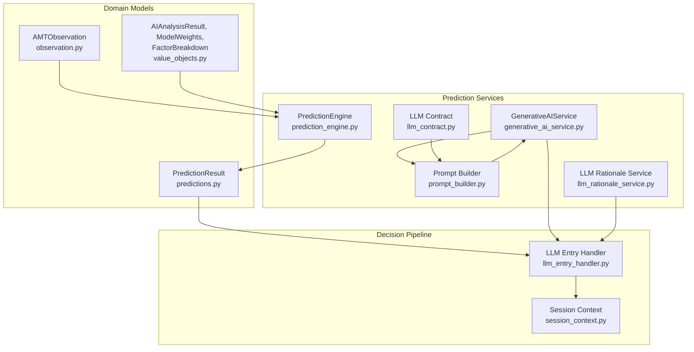
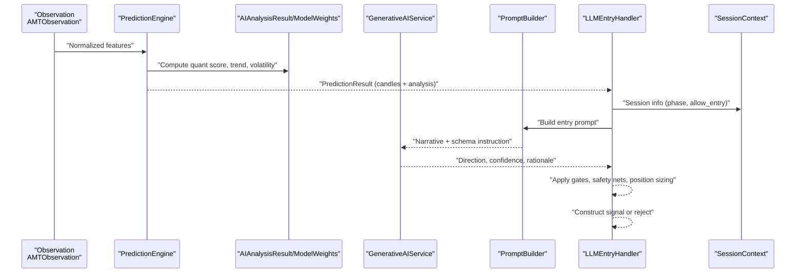
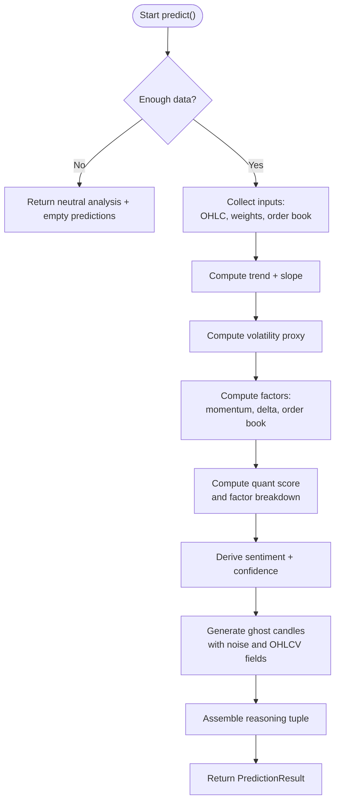
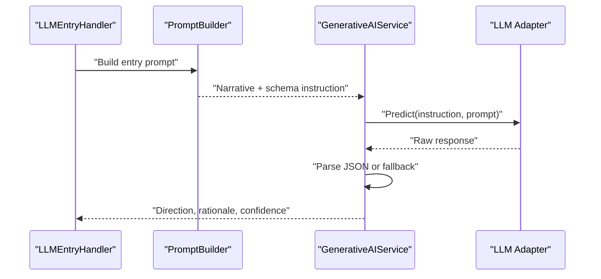
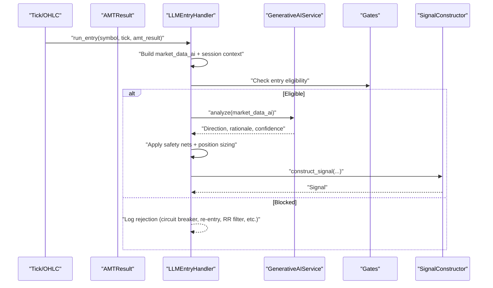
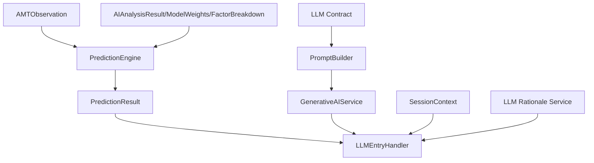

# AI Prediction Schemas

<cite>
**Referenced Files in This Document**
- [observation.py](file://backend/app/domain/fabio_ai/models/observation.py)
- [predictions.py](file://backend/app/domain/fabio_ai/models/predictions.py)
- [value_objects.py](file://backend/app/domain/trading/models/value_objects.py)
- [prediction_engine.py](file://backend/app/domain/fabio_ai/services/prediction_engine.py)
- [generative_ai_service.py](file://backend/app/domain/fabio_ai/services/generative_ai_service.py)
- [prompt_builder.py](file://backend/app/domain/fabio_ai/services/prompt_builder.py)
- [llm_rationale_service.py](file://backend/app/domain/fabio_ai/services/llm_rationale_service.py)
- [llm_contract.py](file://backend/app/domain/fabio_ai/services/llm_contract.py)
- [session_context.py](file://backend/app/domain/fabio_ai/services/session_context.py)
- [llm_entry_handler.py](file://backend/app/application/handlers/llm_entry_handler.py)
</cite>

## Table of Contents
1. [Introduction](#introduction)
2. [Project Structure](#project-structure)
3. [Core Components](#core-components)
4. [Architecture Overview](#architecture-overview)
5. [Detailed Component Analysis](#detailed-component-analysis)
6. [Dependency Analysis](#dependency-analysis)
7. [Performance Considerations](#performance-considerations)
8. [Troubleshooting Guide](#troubleshooting-guide)
9. [Conclusion](#conclusion)

## Introduction
This document describes the AI prediction models and schemas used by the GlassyTrade AI v5 Fabio AI system. It focuses on the prediction data structures, the AI inference pipeline from market observations to trading predictions, and the integration with the trading decision pipeline. It also documents schema definitions for inputs, outputs, and intermediate representations, including confidence scores, prediction probabilities, and rationale generation formats. Finally, it explains how AI predictions influence entry/exit decisions and how the system balances AI outputs with traditional market analysis and hybrid decision-making.

## Project Structure
The AI prediction stack spans several layers:
- Domain models define canonical prediction value objects and the AMT observation schema.
- Services implement the quant prediction engine and the generative AI service.
- Handlers coordinate inference, gating, and signal construction.
- Contracts and prompts standardize LLM inference outputs and parsing.

**Diagram sources**
- [observation.py:21-67](file://backend/app/domain/fabio_ai/models/observation.py#L21-L67)
- [predictions.py:27-32](file://backend/app/domain/fabio_ai/models/predictions.py#L27-L32)
- [value_objects.py:271-304](file://backend/app/domain/trading/models/value_objects.py#L271-L304)
- [prediction_engine.py:62-210](file://backend/app/domain/fabio_ai/services/prediction_engine.py#L62-L210)
- [generative_ai_service.py:26-99](file://backend/app/domain/fabio_ai/services/generative_ai_service.py#L26-L99)
- [prompt_builder.py:261-283](file://backend/app/domain/fabio_ai/services/prompt_builder.py#L261-L283)
- [llm_rationale_service.py:30-118](file://backend/app/domain/fabio_ai/services/llm_rationale_service.py#L30-L118)
- [llm_contract.py:24-47](file://backend/app/domain/fabio_ai/services/llm_contract.py#L24-L47)
- [session_context.py:230-327](file://backend/app/domain/fabio_ai/services/session_context.py#L230-L327)
- [llm_entry_handler.py:61-1082](file://backend/app/application/handlers/llm_entry_handler.py#L61-L1082)

**Section sources**
- [observation.py:1-67](file://backend/app/domain/fabio_ai/models/observation.py#L1-L67)
- [predictions.py:1-32](file://backend/app/domain/fabio_ai/models/predictions.py#L1-L32)
- [value_objects.py:1-309](file://backend/app/domain/trading/models/value_objects.py#L1-L309)
- [prediction_engine.py:1-210](file://backend/app/domain/fabio_ai/services/prediction_engine.py#L1-L210)
- [generative_ai_service.py:1-99](file://backend/app/domain/fabio_ai/services/generative_ai_service.py#L1-L99)
- [prompt_builder.py:1-694](file://backend/app/domain/fabio_ai/services/prompt_builder.py#L1-L694)
- [llm_rationale_service.py:1-118](file://backend/app/domain/fabio_ai/services/llm_rationale_service.py#L1-L118)
- [llm_contract.py:1-48](file://backend/app/domain/fabio_ai/services/llm_contract.py#L1-L48)
- [session_context.py:1-535](file://backend/app/domain/fabio_ai/services/session_context.py#L1-L535)
- [llm_entry_handler.py:1-1082](file://backend/app/application/handlers/llm_entry_handler.py#L1-L1082)

## Core Components
- AMTObservation: RL state vector for the Valentini AMT environment, encapsulating normalized features from price microstructure, order flow, order book, options-specific context, temporal markers, and AMT context.
- PredictionResult: Combined output of the prediction engine, including a tuple of projected OHLC candles and an AIAnalysisResult carrying sentiment, confidence, trend, volatility, quant score, projected price, reasoning, and factor breakdown.
- AIAnalysisResult, ModelWeights, FactorBreakdown: Canonical value objects for AI analysis results and dynamic weighting used by the prediction engine.
- PredictionEngine: Pure domain service computing a multi-factor quant score and generating projected “ghost” candles; also produces sentiment and confidence.
- GenerativeAIService: LLM service for entry decisions, enforcing a canonical JSON contract and caching repeated prompts.
- Prompt Builder: Constructs human-readable narratives and parses LLM outputs into structured directions, confidences, and rationales.
- LLM Rationale Service: Asynchronous enrichment of trade rationale without blocking the signal pipeline.
- LLM Contract: Defines canonical runtime contract and schema instruction for entry decisions.
- Session Context: Provides session-aware gating and market regime awareness influencing entry logic.
- LLM Entry Handler: Coordinates inference, gating, and signal construction, integrating AI predictions with traditional AMT analysis.

**Section sources**
- [observation.py:21-67](file://backend/app/domain/fabio_ai/models/observation.py#L21-L67)
- [predictions.py:27-32](file://backend/app/domain/fabio_ai/models/predictions.py#L27-L32)
- [value_objects.py:271-304](file://backend/app/domain/trading/models/value_objects.py#L271-L304)
- [prediction_engine.py:62-210](file://backend/app/domain/fabio_ai/services/prediction_engine.py#L62-L210)
- [generative_ai_service.py:26-99](file://backend/app/domain/fabio_ai/services/generative_ai_service.py#L26-L99)
- [prompt_builder.py:261-283](file://backend/app/domain/fabio_ai/services/prompt_builder.py#L261-L283)
- [llm_rationale_service.py:30-118](file://backend/app/domain/fabio_ai/services/llm_rationale_service.py#L30-L118)
- [llm_contract.py:24-47](file://backend/app/domain/fabio_ai/services/llm_contract.py#L24-L47)
- [session_context.py:230-327](file://backend/app/domain/fabio_ai/services/session_context.py#L230-L327)
- [llm_entry_handler.py:61-1082](file://backend/app/application/handlers/llm_entry_handler.py#L61-L1082)

## Architecture Overview
The AI inference pipeline transforms market observations into actionable predictions and rationales, then integrates with gating and signal construction to inform entry decisions.

**Diagram sources**
- [observation.py:21-67](file://backend/app/domain/fabio_ai/models/observation.py#L21-L67)
- [prediction_engine.py:62-210](file://backend/app/domain/fabio_ai/services/prediction_engine.py#L62-L210)
- [value_objects.py:271-304](file://backend/app/domain/trading/models/value_objects.py#L271-L304)
- [generative_ai_service.py:53-99](file://backend/app/domain/fabio_ai/services/generative_ai_service.py#L53-L99)
- [prompt_builder.py:261-283](file://backend/app/domain/fabio_ai/services/prompt_builder.py#L261-L283)
- [llm_entry_handler.py:379-781](file://backend/app/application/handlers/llm_entry_handler.py#L379-L781)
- [session_context.py:230-327](file://backend/app/domain/fabio_ai/services/session_context.py#L230-L327)

## Detailed Component Analysis

### AMTObservation Schema
AMTObservation is the RL state vector for the Valentini AMT environment. It groups normalized features into:
- Price Microstructure (e.g., distance to POC, CVD slope, profile shape, POC migration)
- Order Flow (e.g., aggression sigma)
- Order Book (e.g., bid/depth imbalance, spread percentage)
- Options-Specific (e.g., put/call ratio, open interest change, moneyness, IV rank)
- Temporal (e.g., session minute, minutes to expiry, day of week)
- AMT Context (e.g., drive state, absorption side, gap fill probability, opening type, MTF alignment)

These features are normalized to approximate [-1, 1] or [0, 1] before being fed to the policy network.

**Section sources**
- [observation.py:21-67](file://backend/app/domain/fabio_ai/models/observation.py#L21-L67)

### PredictionResult and AIAnalysisResult
PredictionResult combines:
- predictions: tuple of projected OHLC candles generated by the prediction engine
- analysis: AIAnalysisResult with sentiment, confidence, long-term trend, volatility score, quant score, projected price, reasoning, and factor breakdown

AIAnalysisResult includes:
- sentiment: enum value (BULLISH/BEARISH/NEUTRAL)
- confidence: percentage score derived from quant score magnitude
- long_term_trend: trend direction
- volatility_score: recent realized volatility proxy
- quant_score: weighted multi-factor score
- projected_price: estimated future price level
- reasoning: tuple of strings explaining the score composition
- factor_breakdown: contribution of trend, momentum, delta, order book, and volatility

ModelWeights and FactorBreakdown define dynamic weights and per-factor contributions used by the prediction engine.

**Section sources**
- [predictions.py:27-32](file://backend/app/domain/fabio_ai/models/predictions.py#L27-L32)
- [value_objects.py:271-304](file://backend/app/domain/trading/models/value_objects.py#L271-L304)

### PredictionEngine: Quant Scoring and Ghost Candles
The prediction engine computes:
- Trend direction and slope over a rolling window
- Volatility proxy from recent candles
- Momentum proxy (RSI-like) and delta ratio
- Order book imbalance score when order book is available
- Quant score as a clipped sum of weighted factors
- Sentiment and confidence thresholds
- Projected candles (“ghost candles”) with noise and realistic OHLC/volume/vwap/delta

**Diagram sources**
- [prediction_engine.py:69-210](file://backend/app/domain/fabio_ai/services/prediction_engine.py#L69-L210)

**Section sources**
- [prediction_engine.py:62-210](file://backend/app/domain/fabio_ai/services/prediction_engine.py#L62-L210)

### GenerativeAIService and Prompt Builder
GenerativeAIService:
- Builds a canonical entry prompt from market data
- Enforces a strict JSON schema instruction for reliable parsing
- Caches repeated prompts to avoid redundant inference
- Returns direction, rationale, and confidence; guards against None from the LLM adapter

Prompt Builder:
- Constructs a narrative combining session context, market state, order flow, and AMT features
- Adds option-specific context (IV, theta)
- Parses LLM outputs with JSON-first, code-block extraction, structured fallback, and keyword fallback
- Provides overseer and advisory prompt builders for trade management and dashboard use

**Diagram sources**
- [llm_entry_handler.py:739-770](file://backend/app/application/handlers/llm_entry_handler.py#L739-L770)
- [prompt_builder.py:261-283](file://backend/app/domain/fabio_ai/services/prompt_builder.py#L261-L283)
- [generative_ai_service.py:53-99](file://backend/app/domain/fabio_ai/services/generative_ai_service.py#L53-L99)

**Section sources**
- [generative_ai_service.py:26-99](file://backend/app/domain/fabio_ai/services/generative_ai_service.py#L26-L99)
- [prompt_builder.py:261-283](file://backend/app/domain/fabio_ai/services/prompt_builder.py#L261-L283)
- [llm_contract.py:24-47](file://backend/app/domain/fabio_ai/services/llm_contract.py#L24-L47)

### LLM Rationale Service
The rationale service asynchronously enriches signals with human-readable explanations. It:
- Builds prompts from AMT results and context
- Calls an async LLM predict function with a bounded timeout
- Returns a RationaleResult with text, success flag, and latency
- Falls back gracefully when LLM is unavailable or times out

**Section sources**
- [llm_rationale_service.py:30-118](file://backend/app/domain/fabio_ai/services/llm_rationale_service.py#L30-L118)

### Session Context and Gating
SessionContext provides:
- SessionInfo with session name, phase, allow_entry/allow_trend/allow_reversion, and force_exit flags
- Opening relation and inventory bias
- Gap classification and session-aware anchors

LLMEntryHandler applies:
- Session gates (block entries during restricted phases)
- Quant engine gates (skip when regime is dead or probability near 50%)
- Safety nets (e.g., buy-only mode, VWAP extreme checks)
- Position sizing and signal construction

**Section sources**
- [session_context.py:230-327](file://backend/app/domain/fabio_ai/services/session_context.py#L230-L327)
- [llm_entry_handler.py:330-781](file://backend/app/application/handlers/llm_entry_handler.py#L330-L781)

### Integration with Trading Decision Pipeline
The LLMEntryHandler orchestrates:
- Determining market state and session context
- Building gate context and strategy hints
- Enqueuing LLM inference with per-symbol workers
- Applying gates, safety nets, and risk caps
- Constructing signals or logging rejections
- Saving AI decisions and enriching journals

**Diagram sources**
- [llm_entry_handler.py:379-781](file://backend/app/application/handlers/llm_entry_handler.py#L379-L781)
- [generative_ai_service.py:53-99](file://backend/app/domain/fabio_ai/services/generative_ai_service.py#L53-L99)

**Section sources**
- [llm_entry_handler.py:61-1082](file://backend/app/application/handlers/llm_entry_handler.py#L61-L1082)

## Dependency Analysis
The AI prediction stack exhibits clear separation of concerns:
- Domain models (Observation, PredictionResult, AIAnalysisResult) are independent and reusable.
- PredictionEngine depends on domain value objects and enums; it is pure and stateless.
- GenerativeAIService depends on PromptBuilder and LLM contract; it caches and guards inference.
- LLMEntryHandler coordinates gating, session context, and signal construction; it delegates to specialized services.

**Diagram sources**
- [observation.py:21-67](file://backend/app/domain/fabio_ai/models/observation.py#L21-L67)
- [predictions.py:27-32](file://backend/app/domain/fabio_ai/models/predictions.py#L27-L32)
- [value_objects.py:271-304](file://backend/app/domain/trading/models/value_objects.py#L271-L304)
- [prediction_engine.py:62-210](file://backend/app/domain/fabio_ai/services/prediction_engine.py#L62-L210)
- [generative_ai_service.py:26-99](file://backend/app/domain/fabio_ai/services/generative_ai_service.py#L26-L99)
- [prompt_builder.py:261-283](file://backend/app/domain/fabio_ai/services/prompt_builder.py#L261-L283)
- [llm_rationale_service.py:30-118](file://backend/app/domain/fabio_ai/services/llm_rationale_service.py#L30-L118)
- [llm_contract.py:24-47](file://backend/app/domain/fabio_ai/services/llm_contract.py#L24-L47)
- [session_context.py:230-327](file://backend/app/domain/fabio_ai/services/session_context.py#L230-L327)
- [llm_entry_handler.py:61-1082](file://backend/app/application/handlers/llm_entry_handler.py#L61-L1082)

**Section sources**
- [prediction_engine.py:62-210](file://backend/app/domain/fabio_ai/services/prediction_engine.py#L62-L210)
- [generative_ai_service.py:26-99](file://backend/app/domain/fabio_ai/services/generative_ai_service.py#L26-L99)
- [prompt_builder.py:261-283](file://backend/app/domain/fabio_ai/services/prompt_builder.py#L261-L283)
- [llm_entry_handler.py:61-1082](file://backend/app/application/handlers/llm_entry_handler.py#L61-L1082)

## Performance Considerations
- Caching: GenerativeAIService caches LLM prompts to reduce redundant inference.
- Bounded queues and per-symbol workers: LLMEntryHandler uses bounded queues and dedicated threads to prevent overload and maintain fairness across symbols.
- Async rationale: LLM Rationale Service runs asynchronously with timeouts to avoid blocking the signal pipeline.
- Data sufficiency guard: PredictionEngine returns neutral analysis when insufficient data is available.
- Session-aware gating: Early exits during restricted phases reduce unnecessary inference.

[No sources needed since this section provides general guidance]

## Troubleshooting Guide
Common issues and mitigations:
- LLM returns None: GenerativeAIService logs a warning and returns a flat decision with a rationale indicating the issue.
- Parsing failures: PromptBuilder attempts JSON parsing, code-block extraction, structured fallback, and keyword fallback; logs warnings for unparseable outputs.
- Session gates: If session phase blocks entries, LLM is bypassed and a rationale is saved reflecting the session gate.
- Quant gates: If regime is dead or probability near 50%, LLM is skipped and a rationale is saved.
- Safety nets: Buy-only mode and VWAP extreme checks can downgrade or override directions.
- Timeout in rationale: LLM Rationale Service returns a placeholder rationale and marks success as false.

**Section sources**
- [generative_ai_service.py:71-95](file://backend/app/domain/fabio_ai/services/generative_ai_service.py#L71-L95)
- [prompt_builder.py:364-409](file://backend/app/domain/fabio_ai/services/prompt_builder.py#L364-L409)
- [llm_entry_handler.py:413-460](file://backend/app/application/handlers/llm_entry_handler.py#L413-L460)
- [llm_entry_handler.py:630-677](file://backend/app/application/handlers/llm_entry_handler.py#L630-L677)
- [llm_rationale_service.py:64-87](file://backend/app/domain/fabio_ai/services/llm_rationale_service.py#L64-L87)

## Conclusion
GlassyTrade AI v5’s Fabio AI system cleanly separates quant prediction (PredictionEngine) from generative reasoning (GenerativeAIService and PromptBuilder), integrates them with session-aware gating and safety nets (LLMEntryHandler), and exposes canonical schemas (AMTObservation, PredictionResult, AIAnalysisResult) for interoperability. Confidence and rationale formats are standardized, and asynchronous enrichment ensures non-blocking operation. The hybrid decision-making process harmonizes AI outputs with traditional market analysis, enabling robust entry/exit decisions under controlled risk and regime-aware constraints.