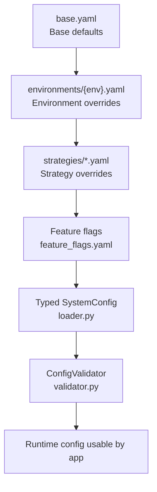
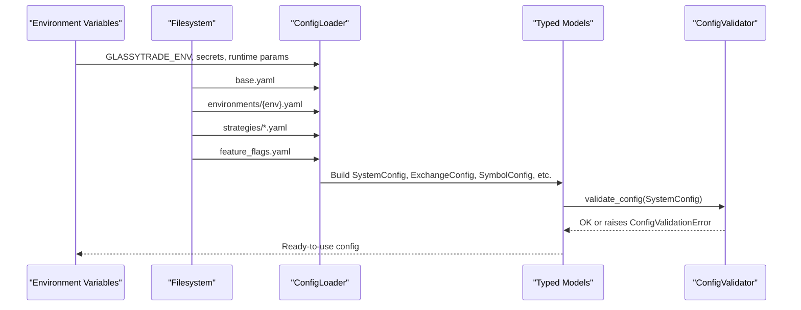
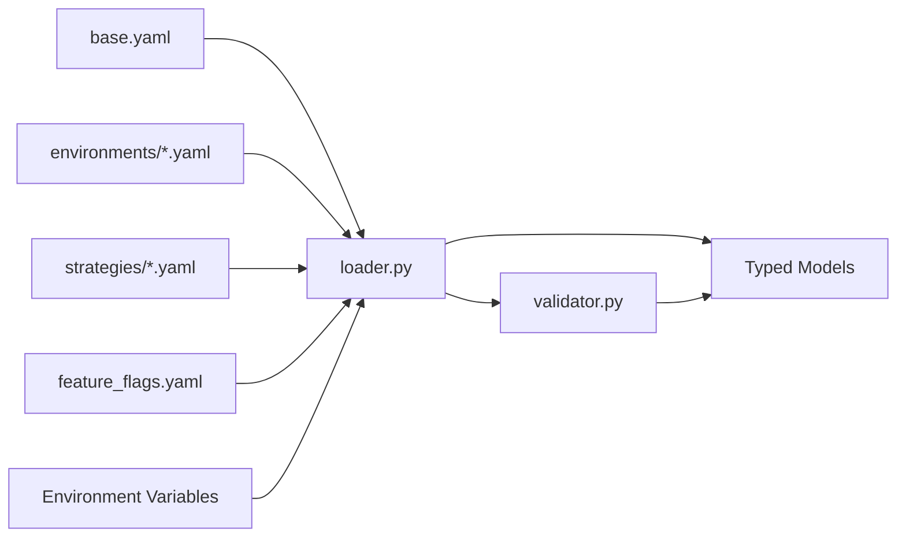
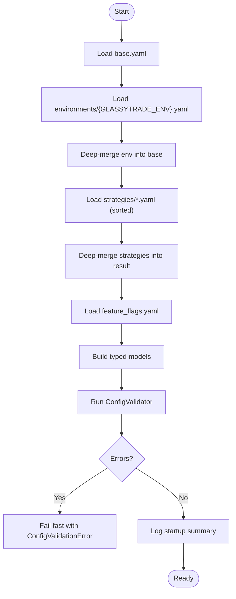

# Configuration Schemas

<cite>
**Referenced Files in This Document**
- [base.yaml](file://backend/config/base.yaml)
- [feature_flags.yaml](file://backend/config/feature_flags.yaml)
- [development.yaml](file://backend/config/environments/development.yaml)
- [paper.yaml](file://backend/config/environments/paper.yaml)
- [live.yaml](file://backend/config/environments/live.yaml)
- [loader.py](file://backend/app/config_models/loader.py)
- [validator.py](file://backend/app/config_models/validator.py)
- [consolidated.py](file://backend/config/consolidated.py)
- [market_config.yaml](file://backend/app/market_config.yaml)
</cite>

## Table of Contents
1. [Introduction](#introduction)
2. [Project Structure](#project-structure)
3. [Core Components](#core-components)
4. [Architecture Overview](#architecture-overview)
5. [Detailed Component Analysis](#detailed-component-analysis)
6. [Dependency Analysis](#dependency-analysis)
7. [Performance Considerations](#performance-considerations)
8. [Troubleshooting Guide](#troubleshooting-guide)
9. [Conclusion](#conclusion)
10. [Appendices](#appendices)

## Introduction
This document explains the configuration schemas and settings management in GlassyTrade AI v5. It covers the YAML configuration structure, environment-specific overrides, runtime parameter management via environment variables, and the configuration loading, validation, and inheritance pipeline. It also documents the base configuration schema, feature flag definitions, trading and risk parameters, broker configurations, and AI model settings. Guidance is included for secure handling of sensitive data and deployment-specific settings.

## Project Structure
Configuration is organized into:
- Base defaults and global settings
- Environment-specific overrides
- Feature flags
- Strategy overrides
- Runtime environment variable overrides
- Typed configuration models and validators

**Diagram sources**
- [base.yaml:1-493](file://backend/config/base.yaml#L1-L493)
- [development.yaml:1-33](file://backend/config/environments/development.yaml#L1-L33)
- [paper.yaml:1-25](file://backend/config/environments/paper.yaml#L1-L25)
- [live.yaml:1-26](file://backend/config/environments/live.yaml#L1-L26)
- [feature_flags.yaml:1-37](file://backend/config/feature_flags.yaml#L1-L37)
- [loader.py:139-245](file://backend/app/config_models/loader.py#L139-L245)
- [validator.py:22-176](file://backend/app/config_models/validator.py#L22-L176)

**Section sources**
- [base.yaml:1-493](file://backend/config/base.yaml#L1-L493)
- [feature_flags.yaml:1-37](file://backend/config/feature_flags.yaml#L1-L37)
- [development.yaml:1-33](file://backend/config/environments/development.yaml#L1-L33)
- [paper.yaml:1-25](file://backend/config/environments/paper.yaml#L1-L25)
- [live.yaml:1-26](file://backend/config/environments/live.yaml#L1-L26)

## Core Components
- Base configuration schema: Defines system-wide defaults, global constants, exchange and symbol configurations, risk parameters, and LLM settings.
- Environment overrides: Per-environment files tailor broker mode, logging, symbol enablement, risk caps, and LLM behavior.
- Feature flags: Centralized toggles for feature phases, roles, and infrastructure options.
- Loader: Orchestrates YAML merge order, parses typed models, and logs a startup summary.
- Validator: Enforces hard and warning rules at boot, blocking unsafe configurations.
- Runtime environment variables: Provide secret overrides and dynamic parameter tuning.

Key configuration areas:
- Trading parameters: default symbol, intervals, scanning modes, and risk per trade.
- Risk controls: per-trade, daily, drawdown, and position caps; Kelly fraction and bootstrap counts.
- Broker configurations: broker mode selection and cost modeling.
- AI model settings: model identifiers, temperatures, tokens, and timeouts.
- Exchange and symbol settings: sessions, lot sizes, tick sizes, thresholds, and cost profiles.

**Section sources**
- [base.yaml:1-493](file://backend/config/base.yaml#L1-L493)
- [feature_flags.yaml:1-37](file://backend/config/feature_flags.yaml#L1-L37)
- [development.yaml:1-33](file://backend/config/environments/development.yaml#L1-L33)
- [paper.yaml:1-25](file://backend/config/environments/paper.yaml#L1-L25)
- [live.yaml:1-26](file://backend/config/environments/live.yaml#L1-L26)
- [loader.py:139-245](file://backend/app/config_models/loader.py#L139-L245)
- [validator.py:22-176](file://backend/app/config_models/validator.py#L22-L176)

## Architecture Overview
The configuration pipeline merges YAML files in a strict order, then applies environment variable overrides. Typed models are constructed and validated before being used by the application.

**Diagram sources**
- [loader.py:139-245](file://backend/app/config_models/loader.py#L139-L245)
- [validator.py:22-176](file://backend/app/config_models/validator.py#L22-L176)

## Detailed Component Analysis

### Base Configuration Schema (base.yaml)
- System-level settings: name, version, candle timeframe, history depth, DB path, log level, and capital.
- Global constants: volume profile thresholds, order flow parameters, market state gates, aggression scoring, structure detection, trade setup rules, risk caps, volume thresholds, time windows, LLM throttling, grade thresholds, and data limits.
- Exchange configurations: NSE and MCX segments, sessions, warm-up minutes, timezones, EIA suppression, and symbol-specific parameters including lot sizes, tick sizes, value area percentages, LVN/HVN thresholds, imbalance thresholds, displacement multipliers, balance ratios, CVD slopes, OI minimums, strike intervals, slippage, notional caps, RR ratios, ML thresholds, and cost profiles.
- Risk configuration: per-trade, daily loss, consecutive losses, drawdown, absolute ceiling, concurrent positions, notional caps, Kelly parameters, and bootstrap trade count.
- LLM configuration: model identifiers, reasoning model, temperatures, token limits, timeouts, and instruction prompt.

Practical implications:
- All symbols and exchanges inherit defaults from base.yaml.
- Environment files override base settings.
- Strategy files further refine per-symbol parameters.
- Feature flags toggle optional behaviors.

**Section sources**
- [base.yaml:1-493](file://backend/config/base.yaml#L1-L493)

### Environment-Specific Overrides
- Development: paper broker, DEBUG logs, restricts to NIFTY only, relaxed risk, realistic paper costs.
- Paper: paper broker, INFO logs, full symbol sets, realistic risk and costs.
- Live: live broker, WARNING logs, strict risk, disabled LLM entry gate, conservative caps.

Inheritance pattern:
- base.yaml provides defaults.
- environments/{env}.yaml deep-merges overrides.
- strategies/*.yaml deep-merges additional refinements.
- feature_flags.yaml contributes feature flags.
- Environment variables override secrets and runtime parameters.

**Section sources**
- [development.yaml:1-33](file://backend/config/environments/development.yaml#L1-L33)
- [paper.yaml:1-25](file://backend/config/environments/paper.yaml#L1-L25)
- [live.yaml:1-26](file://backend/config/environments/live.yaml#L1-L26)

### Feature Flag Definitions
Feature flags are centralized with default values and environment-specific overrides. Notable toggles include:
- Phase 0–4 flags: delta proxy vs true delta, realistic cost model, parallel sessions, DuckDB storage, short signals, risk tiers, IB tracking, correlation guard, IV/VIX features, walk-forward validation, SHAP pruning, scalp engine, IB breakout scalp, print-level triggers.
- LLM role flags: entry gate (hardcoded disabled), pre-candle advisory, overseer, post-trade.
- Infrastructure flags: none defined in the referenced file.

Usage:
- Flags are parsed during YAML load and applied to SystemConfig.
- Live environment enforces llm_entry_gate to remain disabled regardless of YAML.

**Section sources**
- [feature_flags.yaml:1-37](file://backend/config/feature_flags.yaml#L1-L37)
- [loader.py:167-189](file://backend/app/config_models/loader.py#L167-L189)

### Configuration Loading Mechanism
The loader performs:
- Step 1: Load base.yaml.
- Step 2: Load environments/{GLASSYTRADE_ENV}.yaml and deep-merge.
- Step 3: Load strategies/*.yaml and deep-merge in sorted order.
- Step 4: Load feature_flags.yaml and build FeatureFlags.
- Step 5: Parse typed models (SystemConfig, ExchangeConfig, SymbolConfig, RiskConfig, LLMConfig).
- Step 6: Run ConfigValidator.
- Step 7: Log a human-readable startup summary.

Deep merge semantics:
- Nested dictionaries are merged; leaf values from overrides replace base values.

Environment variable precedence:
- Only secrets and runtime parameters are taken from environment variables.
- The loader reads GLASSYTRADE_ENV to select the environment file.

**Section sources**
- [loader.py:36-53](file://backend/app/config_models/loader.py#L36-L53)
- [loader.py:139-245](file://backend/app/config_models/loader.py#L139-L245)

### Configuration Validation Logic
Hard errors (block boot):
- At least one active symbol must be enabled.
- Live environment requires broker_mode="live".
- Live environment requires llm_entry_gate=false.
- Live environment requires capital ≥ ₹10,00,000.
- risk_per_trade_pct must be ≤ 2%.
- portfolio_notional_cap must be ≤ 0.80.
- value_area_pct must be within [0.60, 0.85] for all symbols.
- min_rr_ratio must be ≥ 1.0 for all symbols.
- Sum of max_notional_pct across enabled symbols must not exceed 1.50.
- CVD slope thresholds must satisfy warning < hard_block < extreme.
- lvn_threshold must be less than lvn_removal_threshold.
- ML model files must exist for all active symbols if ML_MODEL_DIR is set.

Warnings (allow boot):
- Paper capital unusually high.
- Short signals enabled without walk-forward validation.
- Risk tier engine enabled with insufficient bootstrap trades.
- min_rr_ratio below recommended floor.
- Pre-candle advisory enabled without a model.
- MCX enabled with futures-only symbols.

**Section sources**
- [validator.py:22-176](file://backend/app/config_models/validator.py#L22-L176)

### Runtime Parameter Management (Environment Variables)
The consolidated configuration supports runtime overrides for:
- Trading: DEFAULT_SYMBOL, STREAM_INTERVAL, TICK_POLL_SECONDS, ALLOW_SHORT, SCANNER_MODE, SCANNER_TOP_N, SCANNER_TOP_PER_UNDERLYING, STRIKES_AROUND_ATM.
- LLM: LLM_BACKEND, LLM_TEMPERATURE, LLM_ENTRY_TEMPERATURE, LLM_OVERSEER_TEMPERATURE, LLM_MAX_NEW_TOKENS, LLM_TIMEOUT_SECONDS, MLX_MODEL_PATH, MLX_ADAPTER_PATH, REASONING_MODEL_PATH.
- Risk: MAX_DAILY_DRAWDOWN, MAX_CONSECUTIVE_LOSSES, COOLDOWN_SECONDS, SLIPPAGE_PCT, PLAYBOOK_GUARD_MAX_REJECTIONS.
- AMT: AGGRESSION_SIGMA, DISPLACEMENT_MULTIPLIER, BALANCE_RATIO_THRESHOLD, COMPOSITE_SESSION_WINDOW, ALERT_PROXIMITY_TICKS.
- Notifications: TELEGRAM_BOT_TOKEN, TELEGRAM_CHAT_ID.
- Exchange and scanners: DEFAULT_EXCHANGE, DHAN_SYMBOLS, SCANNER_UNDERLYINGS.
- Server: PORT.

List fields support comma-separated strings and are assembled into lists.

**Section sources**
- [consolidated.py:233-314](file://backend/config/consolidated.py#L233-L314)

### Exchange and Symbol Configuration Schema
Parsed from YAML into typed models:
- ExchangeConfig: exchange name, enabled flag, segment, session hours, warmup minutes, timezone, EIA suppression, and symbol map.
- SymbolConfig: symbol-level parameters including lot size, tick size, value area percent, LVN/HVN thresholds, imbalance threshold, displacement parameters, balance ratio, CVD thresholds, OI minimum, strike interval, slippage, notional cap, RR ratio, ML thresholds, and cost profile.

These are built from base.yaml and environment overrides, then validated.

**Section sources**
- [loader.py:70-136](file://backend/app/config_models/loader.py#L70-L136)

### AI Model Settings Schema
- LLMConfig: model identifiers, reasoning model, entry and overseer temperatures, token limits, timeouts, and instruction text.
- These are loaded from base.yaml and environment overrides, validated for presence and consistency.

**Section sources**
- [base.yaml:480-493](file://backend/config/base.yaml#L480-L493)
- [loader.py:225-233](file://backend/app/config_models/loader.py#L225-L233)

### Broker Configuration Schema
- Broker mode: controlled by environment files (paper vs live).
- Cost model: enabled/disabled and base slippage configured in environment files.
- Consolidated runtime config exposes Dhan credentials and scanner symbols for broker integration.

**Section sources**
- [development.yaml:29-32](file://backend/config/environments/development.yaml#L29-L32)
- [paper.yaml:21-24](file://backend/config/environments/paper.yaml#L21-L24)
- [live.yaml:4-6](file://backend/config/environments/live.yaml#L4-L6)
- [consolidated.py:213-215](file://backend/config/consolidated.py#L213-L215)

### Trading Parameters Schema
- Default symbol and stream interval.
- Tick poll interval bounds.
- Allow short positions toggle.
- Scanner mode and top-N selections.
- Strikes around ATM.

Values are validated for safe ranges.

**Section sources**
- [consolidated.py:23-57](file://backend/config/consolidated.py#L23-L57)

### Risk Controls Schema
- Per-trade risk percentage.
- Daily loss cap.
- Consecutive loss limit.
- Drawdown cap and absolute ceiling.
- Concurrent positions cap.
- Portfolio and per-symbol notional caps.
- Kelly fraction, win probability, and win/loss ratio.
- Bootstrap trade count for risk tier engine.

Validation ensures safe and coherent risk parameters.

**Section sources**
- [base.yaml:464-479](file://backend/config/base.yaml#L464-L479)
- [loader.py:211-224](file://backend/app/config_models/loader.py#L211-L224)

### Example: Environment-Specific Configurations
- Development:
  - Broker: paper
  - Logging: DEBUG
  - Symbols: NIFTY only
  - Risk: relaxed caps
  - Costs: realistic paper model
- Paper:
  - Broker: paper
  - Logging: INFO
  - Symbols: NSE and MCX enabled
  - Risk: moderate caps
  - Costs: realistic model
- Live:
  - Broker: live
  - Logging: WARNING
  - Symbols: NSE and MCX enabled
  - Risk: tight caps
  - LLM: entry gate disabled

**Section sources**
- [development.yaml:1-33](file://backend/config/environments/development.yaml#L1-L33)
- [paper.yaml:1-25](file://backend/config/environments/paper.yaml#L1-L25)
- [live.yaml:1-26](file://backend/config/environments/live.yaml#L1-L26)

### Example: Feature Flag Usage
- Enable short signals with walk-forward validation for robustness.
- Enable risk tier engine with sufficient bootstrap trades.
- Keep LLM entry gate disabled in live.

**Section sources**
- [feature_flags.yaml:1-37](file://backend/config/feature_flags.yaml#L1-L37)
- [validator.py:121-131](file://backend/app/config_models/validator.py#L121-L131)

### Example: Dynamic Parameter Updates
- Set GLASSYTRADE_ENV to choose development, paper, or live.
- Override runtime parameters via environment variables for quick tuning without redeploying YAML.
- Use ML_MODEL_DIR to validate model availability for active symbols.

**Section sources**
- [loader.py:156-157](file://backend/app/config_models/loader.py#L156-L157)
- [validator.py:104-113](file://backend/app/config_models/validator.py#L104-L113)
- [consolidated.py:233-314](file://backend/config/consolidated.py#L233-L314)

### Security Considerations and Sensitive Data Handling
- Secrets are read from environment variables only (not embedded in YAML).
- Live environment enforces broker_mode="live" and disables LLM entry gate.
- Capital thresholds and risk caps protect live deployments.
- ML model path validation prevents runtime failures due to missing assets.

Recommendations:
- Store API keys and tokens in environment variables.
- Avoid committing secrets to version control.
- Use separate environment files per deployment stage.
- Validate model paths and permissions in CI/CD.

**Section sources**
- [validator.py:32-44](file://backend/app/config_models/validator.py#L32-L44)
- [validator.py:104-113](file://backend/app/config_models/validator.py#L104-L113)
- [live.yaml:4-6](file://backend/config/environments/live.yaml#L4-L6)

## Dependency Analysis
The configuration system depends on:
- YAML files for declarative configuration.
- Pydantic models for type safety and validation.
- Environment variables for secrets and runtime overrides.
- Loader and validator modules for orchestration and enforcement.

**Diagram sources**
- [loader.py:139-245](file://backend/app/config_models/loader.py#L139-L245)
- [validator.py:22-176](file://backend/app/config_models/validator.py#L22-L176)

**Section sources**
- [loader.py:139-245](file://backend/app/config_models/loader.py#L139-L245)
- [validator.py:22-176](file://backend/app/config_models/validator.py#L22-L176)

## Performance Considerations
- YAML parsing and deep merge are linear in the size of configuration data; keep strategy files minimal and focused.
- Validation runs once at startup; avoid excessive symbol or strategy files to reduce boot time.
- Use environment variables for hot-swapping runtime parameters without reloading YAML.

## Troubleshooting Guide
Common issues and resolutions:
- Boot blocked by validation:
  - Ensure at least one symbol is enabled.
  - Set broker_mode="live" in live environment.
  - Disable llm_entry_gate in live.
  - Meet capital and risk thresholds.
  - Fix CVD and LVN thresholds ordering.
  - Provide ML model files for active symbols.
- Warnings:
  - Adjust bootstrap trade count for risk tier engine.
  - Increase min_rr_ratio toward recommended floor.
  - Provide model_id when enabling pre-candle advisory.
  - Review futures-only symbols on MCX.

**Section sources**
- [validator.py:27-114](file://backend/app/config_models/validator.py#L27-L114)
- [validator.py:115-159](file://backend/app/config_models/validator.py#L115-L159)

## Conclusion
GlassyTrade AI v5 employs a layered, typed configuration system with strong validation and clear inheritance. Base defaults are environment- and strategy-overridable, while secrets and runtime parameters are supplied via environment variables. The loader and validator enforce safety and consistency, ensuring reliable operation across development, paper, and live deployments.

## Appendices

### Appendix A: Configuration Loading Flow

**Diagram sources**
- [loader.py:139-245](file://backend/app/config_models/loader.py#L139-L245)
- [validator.py:22-176](file://backend/app/config_models/validator.py#L22-L176)