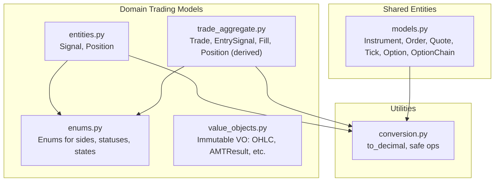
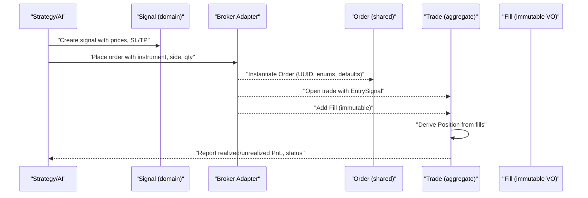
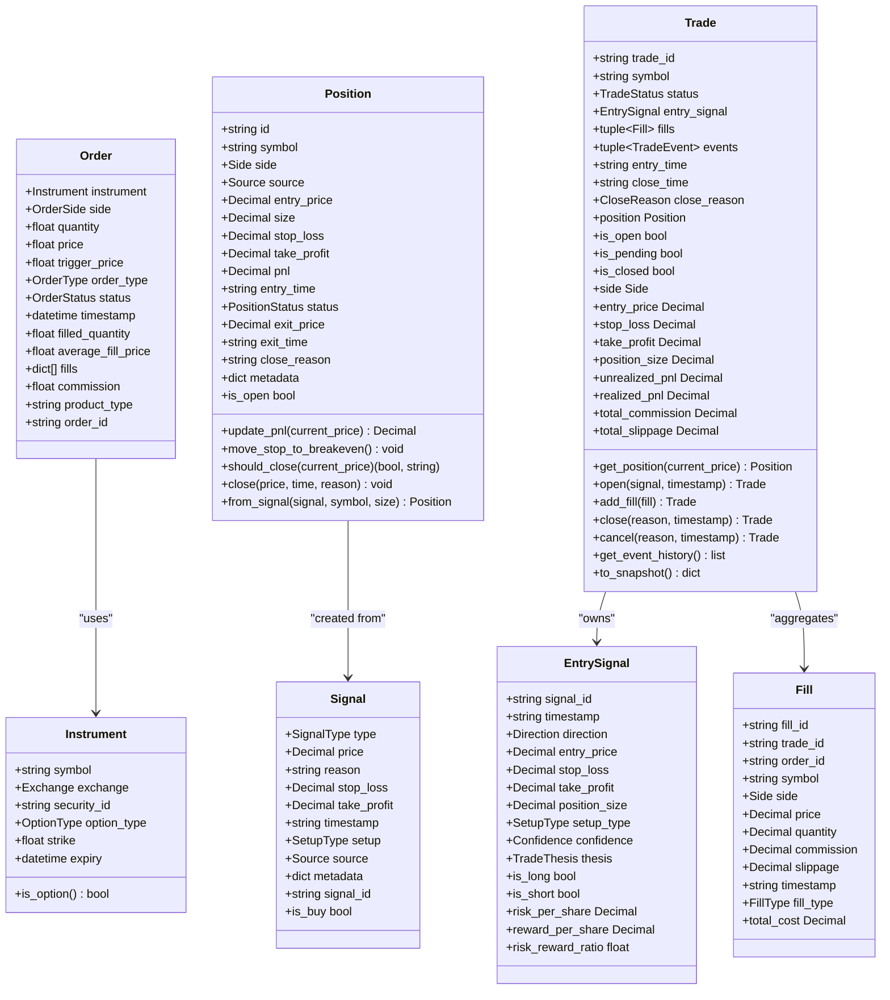
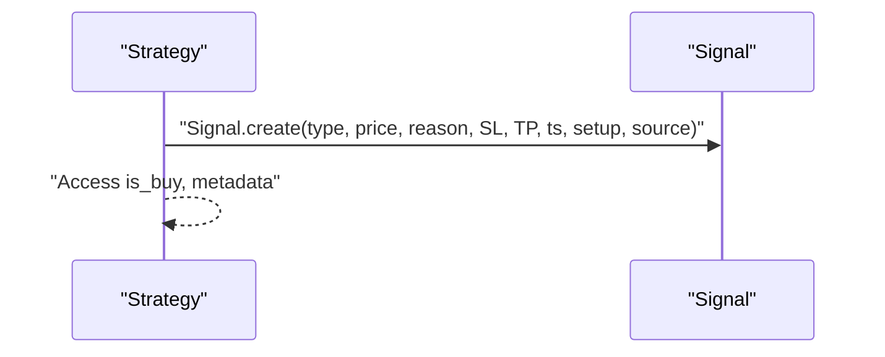
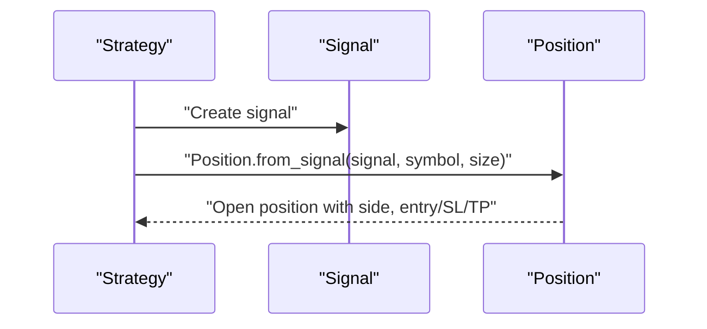
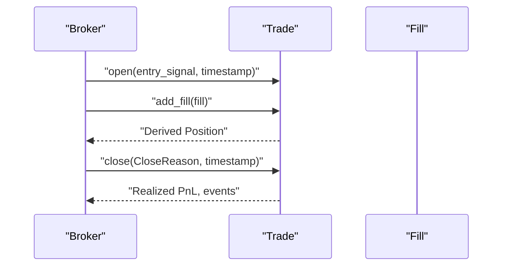

# Core Trading Entities

<cite>
**Referenced Files in This Document**
- [entities.py](file://backend/app/domain/trading/models/entities.py)
- [trade_aggregate.py](file://backend/app/domain/trading/models/trade_aggregate.py)
- [enums.py](file://backend/app/domain/trading/models/enums.py)
- [models.py](file://shared/entities/models.py)
- [conversion.py](file://shared/conversion.py)
- [test_entities.py](file://backend/tests/unit/domain/test_entities.py)
- [test_value_objects.py](file://backend/tests/unit/domain/test_value_objects.py)
</cite>

## Table of Contents
1. [Introduction](#introduction)
2. [Project Structure](#project-structure)
3. [Core Components](#core-components)
4. [Architecture Overview](#architecture-overview)
5. [Detailed Component Analysis](#detailed-component-analysis)
6. [Dependency Analysis](#dependency-analysis)
7. [Performance Considerations](#performance-considerations)
8. [Troubleshooting Guide](#troubleshooting-guide)
9. [Conclusion](#conclusion)
10. [Appendices](#appendices)

## Introduction
This document describes the core trading entities in GlassyTrade AI v5, focusing on Instrument, Order, Position, and their relationships. It explains field definitions, data types, validation rules, and business logic; documents initialization patterns, backward compatibility handling, and enum conversions; and outlines UUID-based ID generation, timestamp handling, and metadata storage. It also clarifies immutability semantics, the trading lifecycle, and provides concrete usage examples via file references.

## Project Structure
GlassyTrade AI v5 organizes trading domain models under the backend domain layer and shares cross-cutting entities and utilities with the brokers and infrastructure layers. The relevant modules include:
- Domain trading models: entities, value objects, enums, and the trade aggregate
- Shared entities and types used across backend and brokers
- Conversion utilities for precise financial arithmetic

**Diagram sources**
- [entities.py:1-168](file://backend/app/domain/trading/models/entities.py#L1-L168)
- [trade_aggregate.py:1-795](file://backend/app/domain/trading/models/trade_aggregate.py#L1-L795)
- [enums.py:1-200](file://backend/app/domain/trading/models/enums.py#L1-L200)
- [value_objects.py:1-309](file://backend/app/domain/trading/models/value_objects.py#L1-L309)
- [models.py:1-341](file://shared/entities/models.py#L1-L341)
- [conversion.py:1-150](file://shared/conversion.py#L1-L150)

**Section sources**
- [entities.py:1-168](file://backend/app/domain/trading/models/entities.py#L1-L168)
- [trade_aggregate.py:1-795](file://backend/app/domain/trading/models/trade_aggregate.py#L1-L795)
- [enums.py:1-200](file://backend/app/domain/trading/models/enums.py#L1-L200)
- [value_objects.py:1-309](file://backend/app/domain/trading/models/value_objects.py#L1-L309)
- [models.py:1-341](file://shared/entities/models.py#L1-L341)
- [conversion.py:1-150](file://shared/conversion.py#L1-L150)

## Core Components
This section summarizes the primary trading entities and their roles in the system.

- Instrument (shared): Identifies tradable assets with symbol, exchange, and optional option attributes. Immutable value object used by Order and market data.
- Order (shared): Broker-facing order entity with side, quantity, price/trigger, order type, status, timestamps, fills, and UUID-based IDs. Includes backward compatibility handling for legacy field names and enum conversions.
- Position (domain): Lifecycle-managed entity tracking entry/exit prices, sizes, stops/profits, PnL, and status. Provides behavior for updating PnL, moving stops, and closing positions.
- Trade (aggregate): Central aggregate owning an immutable entry signal, append-only immutable fills, and derived position. Maintains trade status, realized/unrealized PnL, and event history.
- EntrySignal (immutable VO): Immutable entry decision with direction, price levels, position size, setup type, and confidence.
- Fill (immutable VO): Immutable record of a completed order with cost/slippage/commissions.
- Signal (domain VO): Generated signal with monetary values, reason, setup/source, and metadata; factory converts floats to Decimal.

Key design principles:
- Single source of truth: position/state derived from immutable events
- No mutable state: position computed on-demand from fills
- Idempotency and determinism: replayable event histories
- Precision: Decimal arithmetic via shared conversion utilities

**Section sources**
- [models.py:72-153](file://shared/entities/models.py#L72-L153)
- [entities.py:28-168](file://backend/app/domain/trading/models/entities.py#L28-L168)
- [trade_aggregate.py:86-795](file://backend/app/domain/trading/models/trade_aggregate.py#L86-L795)
- [enums.py:113-200](file://backend/app/domain/trading/models/enums.py#L113-L200)
- [conversion.py:13-150](file://shared/conversion.py#L13-L150)

## Architecture Overview
The trading lifecycle centers around signals and orders, culminating in trades tracked by immutable events and derived positions.

**Diagram sources**
- [entities.py:28-76](file://backend/app/domain/trading/models/entities.py#L28-L76)
- [models.py:137-153](file://shared/entities/models.py#L137-L153)
- [trade_aggregate.py:86-343](file://backend/app/domain/trading/models/trade_aggregate.py#L86-L343)

## Detailed Component Analysis

### Instrument
- Purpose: Identifies tradable assets with symbol, exchange, and optional option attributes (option type, strike, expiry).
- Data types: symbol (string), exchange (enum), option_type (optional enum), strike (optional float), expiry (optional datetime).
- Validation rules:
  - Option contracts require option_type and strike.
  - Expiry is optional; absence indicates underlying or non-option instruments.
- Business logic:
  - is_option(): True when option_type is present.
- Usage examples:
  - Creating an equity instrument and verifying immutability.
  - Creating an option instrument and confirming is_option().

**Section sources**
- [models.py:72-83](file://shared/entities/models.py#L72-L83)
- [test_broker_interface.py:42-81](file://brokers/tests/test_broker_interface.py#L42-L81)

### Order
- Purpose: Broker-facing order entity representing a single order request.
- Data types: instrument (Instrument), side (OrderSide), quantity (float), price/trigger (optional float), order_type (OrderType), status (OrderStatus), timestamps (datetime), filled_quantity (float), average_fill_price (optional float), fills (list), commission (float), product_type (string).
- Initialization patterns:
  - Default UUID generation for order_id.
  - Default order_type to MARKET, status to PENDING, timestamp to now, filled_quantity to 0, empty fills list, commission to 0.0, product_type to INTRADAY.
  - Backward compatibility:
    - Accepts symbol and exchange to construct Instrument automatically.
    - Converts string enums to proper enum types (side, order_type, status).
- Validation rules:
  - Ensures required fields are populated with defaults if missing.
  - Enum normalization prevents invalid values.
- Business logic:
  - Normalized side mapping: LONG/LONG alias to BUY; SHORT/SHORT alias to SELL.
- Usage examples:
  - Constructing an Order with minimal fields and defaults.
  - Passing legacy symbol/exchange fields for backward compatibility.

**Section sources**
- [models.py:137-190](file://shared/entities/models.py#L137-L190)
- [models.py:154-190](file://shared/entities/models.py#L154-L190)

### Position (domain)
- Purpose: Lifecycle-managed position with entry/exit tracking, PnL computation, and stop/TP enforcement.
- Data types: id (string), symbol (string), side (Side), source (Source), entry_price/size/stop_loss/take_profit/pnl (Decimal), entry_time (string), status (PositionStatus), exit_price/exit_time/close_reason (optional), metadata (dict).
- Initialization patterns:
  - Defaults for all numeric fields as Decimal("0").
  - Status defaults to OPEN; exit fields initialized to None.
- Validation rules:
  - Once status is CLOSED, no further mutations are allowed (invariant enforced by design).
- Business logic:
  - update_pnl(current_price): Recompute unrealized PnL using Decimal arithmetic.
  - move_stop_to_breakeven(): Move stop-loss to entry price.
  - should_close(current_price): Evaluate stop-loss and take-profit conditions by side.
  - close(price, time, reason): Set status to CLOSED, populate exit fields, and update PnL.
  - from_signal(signal, symbol, size): Factory to create an open position from a Signal.
- Usage examples:
  - Creating a position from a signal and verifying side/size.
  - Updating PnL for long and short positions.
  - Closing a position and asserting closed state and exit fields.

**Section sources**
- [entities.py:83-168](file://backend/app/domain/trading/models/entities.py#L83-L168)
- [test_entities.py:38-126](file://backend/tests/unit/domain/test_entities.py#L38-L126)

### Trade (aggregate)
- Purpose: Aggregate root encapsulating entry signal, immutable fills, derived position, and event history.
- Data types: trade_id (string), symbol (string), status (TradeStatus), entry_signal (EntrySignal), fills (tuple of Fill), events (tuple of TradeEvent), entry_time (string), close_time (optional string), close_reason (optional CloseReason).
- Initialization patterns:
  - Default UUID generation for trade_id.
  - PENDING status initially; status transitions on open/close/cancel.
- Validation rules:
  - Enforces state transitions (open only from PENDING, close only from OPEN).
  - Ensures fill trade_id consistency.
- Business logic:
  - get_position(current_market_price): Derive Position from fills with current price for accurate unrealized PnL.
  - position (legacy property): Computed on-demand; warns that it lacks current price.
  - is_open/is_pending/is_closed: Status predicates.
  - side/entry_price/stop_loss/take_profit/position_size: Derived from entry_signal or fills.
  - unrealized_pnl: Mark-to-market for open trades.
  - realized_pnl: Properly calculated by matching exits to entries (FIFO) and subtracting commissions/slippage.
  - Commands: open(), add_fill(), close(), cancel(); each returns a new immutable Trade reflecting the change and appending a TradeEvent.
  - Query: get_event_history(), to_snapshot().
- Usage examples:
  - Opening a trade with an EntrySignal and recording TRADE_OPENED event.
  - Adding fills and transitioning to CLOSED upon full exit.
  - Calculating realized PnL and total commission/slippage.

**Section sources**
- [trade_aggregate.py:293-795](file://backend/app/domain/trading/models/trade_aggregate.py#L293-L795)

### EntrySignal (immutable VO)
- Purpose: Immutable entry decision with direction, price levels, position size, setup type, and confidence.
- Data types: signal_id (string), timestamp (string), direction (Direction), entry_price/stop_loss/take_profit/position_size (Decimal), setup_type (SetupType), confidence (Confidence), thesis (optional TradeThesis).
- Validation rules:
  - Uses Direction enum for LONG/SHORT/FLAT.
  - Risk/reward derived from prices; ratios guarded against zero risk.
- Business logic:
  - is_long/is_short predicates.
  - risk_per_share/reward_per_share/risk_reward_ratio computed from prices.

**Section sources**
- [trade_aggregate.py:98-141](file://backend/app/domain/trading/models/trade_aggregate.py#L98-L141)

### Fill (immutable VO)
- Purpose: Immutable record of a completed order with cost, slippage, and commission.
- Data types: fill_id (string), trade_id (string), order_id (string), symbol (string), side (Side), price/quantity/commission/slippage (Decimal), timestamp (string), fill_type (FillType).
- Validation rules:
  - Fills are never modified after creation.
- Business logic:
  - total_cost: Base cost plus/minus commission and slippage depending on side.
  - Deprecated pnl property; use Position.from_fills() for accurate PnL.

**Section sources**
- [trade_aggregate.py:143-180](file://backend/app/domain/trading/models/trade_aggregate.py#L143-L180)

### Signal (domain VO)
- Purpose: Trade signal with monetary values, reason, setup/source, and metadata.
- Data types: type (SignalType), price/stop_loss/take_profit (Decimal), reason (string), timestamp (string), setup (SetupType), source (Source), metadata (dict), signal_id (string).
- Initialization patterns:
  - Factory create() accepts float or Decimal for monetary values and normalizes to Decimal.
- Validation rules:
  - Monetary values normalized via shared conversion utilities.
- Business logic:
  - is_buy predicate based on SignalType.

**Section sources**
- [entities.py:28-76](file://backend/app/domain/trading/models/entities.py#L28-L76)
- [conversion.py:13-48](file://shared/conversion.py#L13-L48)

### Enums and Conversions
- Enums: Side, SignalType, Source, MarketState, SetupType, PositionStatus, Direction, FillType, Confidence, Sentiment, TrendDirection, MessageRole.
- Enum conversions:
  - Order side aliases: LONG/LONG mapped to BUY; SHORT/SHORT mapped to SELL.
  - String-to-enum normalization in Order constructor.
- Conversion utilities:
  - to_decimal(): Consistent Decimal conversion for financial arithmetic.
  - safe_decimal_operation(): Safe arithmetic with automatic conversion and error handling.

**Section sources**
- [enums.py:113-200](file://backend/app/domain/trading/models/enums.py#L113-L200)
- [models.py:154-190](file://shared/entities/models.py#L154-L190)
- [conversion.py:13-150](file://shared/conversion.py#L13-L150)

## Dependency Analysis
The following diagram shows key dependencies among core entities and supporting modules.

**Diagram sources**
- [models.py:72-153](file://shared/entities/models.py#L72-L153)
- [entities.py:28-168](file://backend/app/domain/trading/models/entities.py#L28-L168)
- [trade_aggregate.py:86-343](file://backend/app/domain/trading/models/trade_aggregate.py#L86-L343)

**Section sources**
- [models.py:72-153](file://shared/entities/models.py#L72-L153)
- [entities.py:28-168](file://backend/app/domain/trading/models/entities.py#L28-L168)
- [trade_aggregate.py:86-343](file://backend/app/domain/trading/models/trade_aggregate.py#L86-L343)

## Performance Considerations
- Decimal arithmetic: Financial computations consistently use Decimal to avoid floating-point precision errors. Prefer shared conversion utilities for all numeric operations.
- Immutable value objects: Using frozen dataclasses reduces mutation overhead and simplifies concurrency; however, frequent recomputation of derived state (e.g., Position.from_fills) should be cached at higher layers if needed.
- UUID generation: Entity IDs are generated at object creation time; ensure persistence avoids unnecessary repeated generation.
- Event sourcing: Trade events are immutable and append-only, enabling deterministic replay and audit trails with minimal runtime overhead.

[No sources needed since this section provides general guidance]

## Troubleshooting Guide
Common issues and resolutions:
- Decimal conversion errors: Ensure all monetary values are converted to Decimal using the shared utility before arithmetic.
- Enum normalization failures: Verify string enums are properly normalized; Order constructor handles side/order_type/status conversions.
- Position invariant violations: Once a Position is closed, do not mutate it; enforce this at the application boundary.
- Trade state transitions: Only open trades from PENDING; only close trades from OPEN; otherwise, expect validation errors.
- Fill consistency: Ensure fill.trade_id matches the target Trade; mismatches raise validation errors.

**Section sources**
- [conversion.py:13-48](file://shared/conversion.py#L13-L48)
- [models.py:154-190](file://shared/entities/models.py#L154-L190)
- [entities.py:83-168](file://backend/app/domain/trading/models/entities.py#L83-L168)
- [trade_aggregate.py:521-664](file://backend/app/domain/trading/models/trade_aggregate.py#L521-L664)

## Conclusion
GlassyTrade AI v5 models trading entities with strong immutability guarantees, precise financial arithmetic, and deterministic state derivation. The domain focuses on Signals and Positions for internal lifecycle management, while the aggregate Trade encapsulates broker-facing events and derived state. Shared entities like Instrument and Order provide interoperability across layers, with robust backward compatibility and enum normalization. Following the patterns documented here ensures correctness, maintainability, and performance across the trading pipeline.

[No sources needed since this section summarizes without analyzing specific files]

## Appendices

### Field Definitions and Types Reference
- Instrument: symbol (string), exchange (Exchange), security_id (string), option_type (OptionType?), strike (float?), expiry (datetime?)
- Order: instrument (Instrument), side (OrderSide), quantity (float), price/trigger (float?), order_type (OrderType), status (OrderStatus), timestamp (datetime), filled_quantity (float), average_fill_price (float?), fills (list), commission (float), product_type (string), order_id (string)
- Position (domain): id (string), symbol (string), side (Side), source (Source), entry_price/size/stop_loss/take_profit/pnl (Decimal), entry_time (string), status (PositionStatus), exit_price/exit_time/close_reason (Decimal|string?), metadata (dict)
- Trade: trade_id (string), symbol (string), status (TradeStatus), entry_signal (EntrySignal), fills (tuple), events (tuple), entry_time (string), close_time (string?), close_reason (CloseReason?)
- EntrySignal: signal_id (string), timestamp (string), direction (Direction), entry_price/stop_loss/take_profit/position_size (Decimal), setup_type (SetupType), confidence (Confidence), thesis (TradeThesis?)
- Fill: fill_id (string), trade_id (string), order_id (string), symbol (string), side (Side), price/quantity/commission/slippage (Decimal), timestamp (string), fill_type (FillType)

**Section sources**
- [models.py:72-153](file://shared/entities/models.py#L72-L153)
- [entities.py:83-168](file://backend/app/domain/trading/models/entities.py#L83-L168)
- [trade_aggregate.py:98-180](file://backend/app/domain/trading/models/trade_aggregate.py#L98-L180)

### Example Workflows

#### Workflow: Creating and Using a Signal

**Diagram sources**
- [entities.py:51-76](file://backend/app/domain/trading/models/entities.py#L51-L76)

**Section sources**
- [entities.py:51-76](file://backend/app/domain/trading/models/entities.py#L51-L76)
- [test_entities.py:10-36](file://backend/tests/unit/domain/test_entities.py#L10-L36)

#### Workflow: Creating a Position from a Signal

**Diagram sources**
- [entities.py:151-168](file://backend/app/domain/trading/models/entities.py#L151-L168)

**Section sources**
- [entities.py:151-168](file://backend/app/domain/trading/models/entities.py#L151-L168)
- [test_entities.py:106-126](file://backend/tests/unit/domain/test_entities.py#L106-L126)

#### Workflow: Trade Lifecycle with Fills

**Diagram sources**
- [trade_aggregate.py:521-664](file://backend/app/domain/trading/models/trade_aggregate.py#L521-L664)

**Section sources**
- [trade_aggregate.py:521-664](file://backend/app/domain/trading/models/trade_aggregate.py#L521-L664)

### Validation Rules Summary
- Monetary values: Always convert to Decimal before arithmetic.
- Enums: Normalize strings to enums; Order supports aliases for side.
- Position invariant: CLOSED status forbids further mutations.
- Trade transitions: Enforce PENDING→OPEN→CLOSED; OPEN→CLOSED or manual cancel.
- Fill consistency: fill.trade_id must match Trade trade_id.

**Section sources**
- [conversion.py:13-48](file://shared/conversion.py#L13-L48)
- [models.py:154-190](file://shared/entities/models.py#L154-L190)
- [entities.py:83-168](file://backend/app/domain/trading/models/entities.py#L83-L168)
- [trade_aggregate.py:521-664](file://backend/app/domain/trading/models/trade_aggregate.py#L521-L664)