# Data Models and Schemas

<cite>
**Referenced Files in This Document**
- [market_state.py](file://backend/app/domain/models/market_state.py)
- [schemas.py](file://backend/app/infrastructure/serialization/schemas.py)
- [trade_aggregate.py](file://backend/app/domain/trading/models/trade_aggregate.py)
- [exchange_config.py](file://backend/app/domain/models/exchange_config.py)
- [database.py](file://backend/app/infrastructure/storage/database.py)
- [models.py](file://shared/entities/models.py)
- [predictions.py](file://backend/app/domain/fabio_ai/models/predictions.py)
- [features.py](file://backend/app/domain/probability/features.py)
- [loader.py](file://backend/app/config_models/loader.py)
- [validator.py](file://backend/app/config_models/validator.py)
</cite>

## Table of Contents
1. [Introduction](#introduction)
2. [Project Structure](#project-structure)
3. [Core Components](#core-components)
4. [Architecture Overview](#architecture-overview)
5. [Detailed Component Analysis](#detailed-component-analysis)
6. [Dependency Analysis](#dependency-analysis)
7. [Performance Considerations](#performance-considerations)
8. [Troubleshooting Guide](#troubleshooting-guide)
9. [Conclusion](#conclusion)
10. [Appendices](#appendices)

## Introduction
This document provides comprehensive data model documentation for the GlassyTrade AI v5 system. It covers trading entities (candles, trades, positions), market state objects, AI prediction models, configuration schemas, and persistence structures. It explains data validation rules, business rules, transformation logic, serialization formats, and performance characteristics. It also outlines database schema diagrams, data access patterns, lifecycle and retention considerations, and security/access control mechanisms.

## Project Structure
The data model spans three primary layers:
- Domain models: Immutable value objects and aggregates for trading and market state
- Serialization DTOs: Pydantic models for API transport and conversion helpers
- Infrastructure storage: SQLite schema and persistence adapters

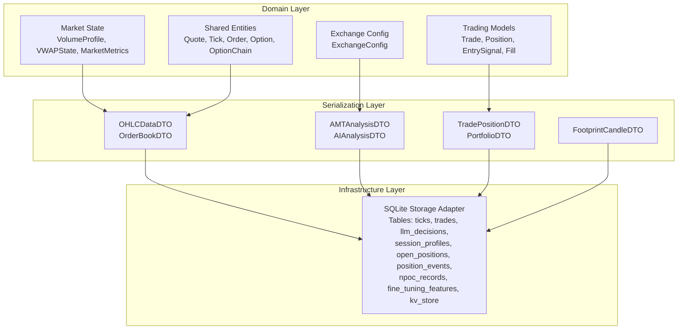

**Diagram sources**
- [market_state.py:20-173](file://backend/app/domain/models/market_state.py#L20-L173)
- [trade_aggregate.py:86-795](file://backend/app/domain/trading/models/trade_aggregate.py#L86-L795)
- [models.py:88-341](file://shared/entities/models.py#L88-L341)
- [exchange_config.py:20-307](file://backend/app/domain/models/exchange_config.py#L20-L307)
- [schemas.py:31-667](file://backend/app/infrastructure/serialization/schemas.py#L31-L667)
- [database.py:24-176](file://backend/app/infrastructure/storage/database.py#L24-L176)

**Section sources**
- [market_state.py:1-173](file://backend/app/domain/models/market_state.py#L1-L173)
- [schemas.py:1-667](file://backend/app/infrastructure/serialization/schemas.py#L1-L667)
- [trade_aggregate.py:1-795](file://backend/app/domain/trading/models/trade_aggregate.py#L1-L795)
- [exchange_config.py:1-307](file://backend/app/domain/models/exchange_config.py#L1-L307)
- [database.py:1-861](file://backend/app/infrastructure/storage/database.py#L1-L861)
- [models.py:1-341](file://shared/entities/models.py#L1-L341)

## Core Components
This section introduces the principal data structures and their roles.

- Market State Models
  - VolumeProfile: Immutable volume profile with VAL < POC < VAH and positivity constraints
  - VWAPState: Session VWAP with sigma ≥ 0, vwap > 0, and sign-congruence checks
  - MarketMetrics: Balanced-state metrics with normalized balance_pct ∈ [0, 1]
  - IndicatorLineage: Provenance tracking for indicator values
  - RuleChecklistResult: Gate results with pass/total invariants
  - SessionContext: Session identity with non-empty identifiers

- Trading Models
  - Trade: Aggregate root with immutable EntrySignal, append-only fills, and derived Position
  - Position: Derived from fills; supports unrealized PnL, market value, and cost basis
  - EntrySignal: Immutable decision with risk/reward and thesis
  - Fill: Immutable executed order with cost computation
  - TradeEvent: Audit trail event

- Shared Entities
  - Quote, Tick: Market data with optional depth
  - Order, Option, OptionChain: Broker-facing entities
  - Instrument: Symbol and option metadata

- Exchange Configuration
  - ExchangeConfig: Exchange-specific thresholds, symbols, tick/lot sizes, and point values

- Serialization DTOs
  - OHLCDataDTO, OrderBookDTO, OrderBookLevelDTO
  - AMTAnalysisDTO, AIAnalysisDTO, TradePositionDTO, PortfolioDTO, PositionEventDTO
  - FootprintCandleDTO, FootprintLevelDTO
  - Converters: ohlc_to_dto, dto_to_ohlc, dto_to_order_book, dto_to_weights, position_to_dto, etc.

- Infrastructure Storage
  - SQLite tables for ticks, trades, LLM decisions, performance snapshots, session profiles, open positions, position events, NPOC records, fine tuning features, and key-value store

**Section sources**
- [market_state.py:20-173](file://backend/app/domain/models/market_state.py#L20-L173)
- [trade_aggregate.py:86-795](file://backend/app/domain/trading/models/trade_aggregate.py#L86-L795)
- [models.py:88-341](file://shared/entities/models.py#L88-L341)
- [exchange_config.py:20-307](file://backend/app/domain/models/exchange_config.py#L20-L307)
- [schemas.py:31-667](file://backend/app/infrastructure/serialization/schemas.py#L31-L667)
- [database.py:24-176](file://backend/app/infrastructure/storage/database.py#L24-L176)

## Architecture Overview
The system enforces strict separation between domain and transport:
- Domain models are immutable and free of framework dependencies
- DTOs isolate API concerns and provide camelCase serialization
- Persistence adapters persist structured payloads to SQLite with indexes and WAL mode

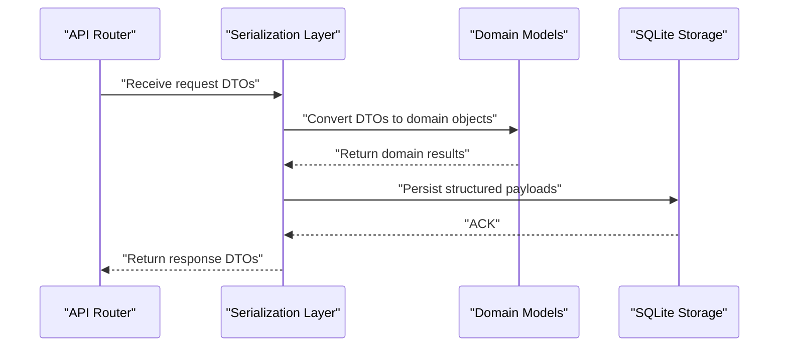

**Diagram sources**
- [schemas.py:367-667](file://backend/app/infrastructure/serialization/schemas.py#L367-L667)
- [database.py:254-479](file://backend/app/infrastructure/storage/database.py#L254-L479)

## Detailed Component Analysis

### Market State Models
Market state models enforce invariants to prevent anomalies and ensure deterministic behavior.

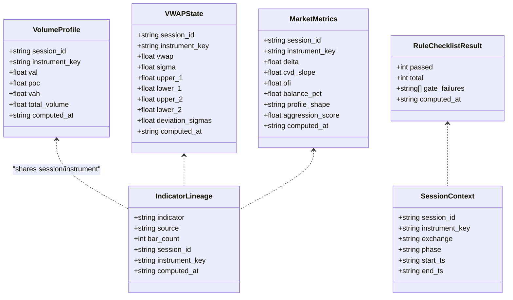

**Diagram sources**
- [market_state.py:20-173](file://backend/app/domain/models/market_state.py#L20-L173)

Validation rules:
- VolumeProfile: val > 0, poc > 0, vah > 0; val < poc; poc < vah
- VWAPState: sigma ≥ 0; vwap > 0; sign alignment between deviation_sigmas and (vwap ± sigma)
- MarketMetrics: 0.0 ≤ balance_pct ≤ 1.0
- RuleChecklistResult: total > 0; passed ≤ total
- SessionContext: session_id and instrument_key non-empty

**Section sources**
- [market_state.py:20-173](file://backend/app/domain/models/market_state.py#L20-L173)

### Trading Models
The trading aggregate encapsulates the entire lifecycle of a trade with immutable signals and append-only fills.

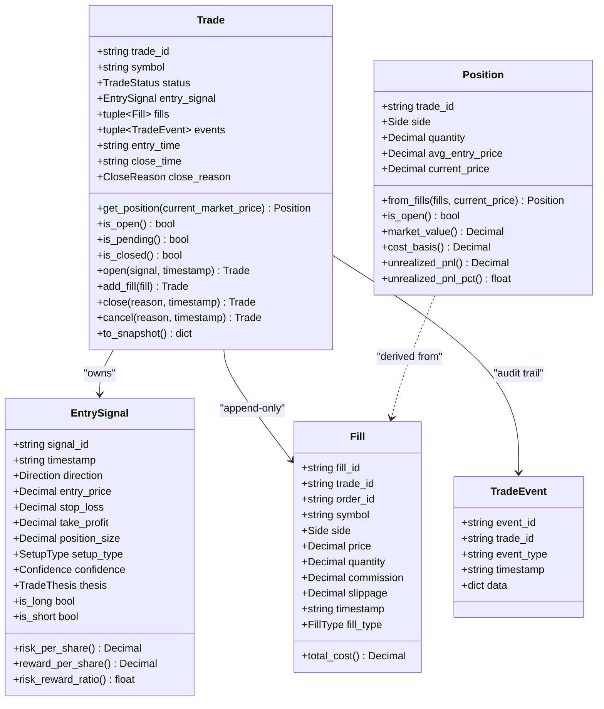

Key business rules:
- Position derived from fills; invariant: position = sum(fills.quantity)
- Status transitions: PENDING → OPEN → CLOSED
- Realized PnL computed by FIFO matching entry fills to exits
- Unrealized PnL computed using current price

**Diagram sources**
- [trade_aggregate.py:293-795](file://backend/app/domain/trading/models/trade_aggregate.py#L293-L795)

**Section sources**
- [trade_aggregate.py:35-795](file://backend/app/domain/trading/models/trade_aggregate.py#L35-L795)

### Shared Entities
Common domain entities used across backend and brokers.

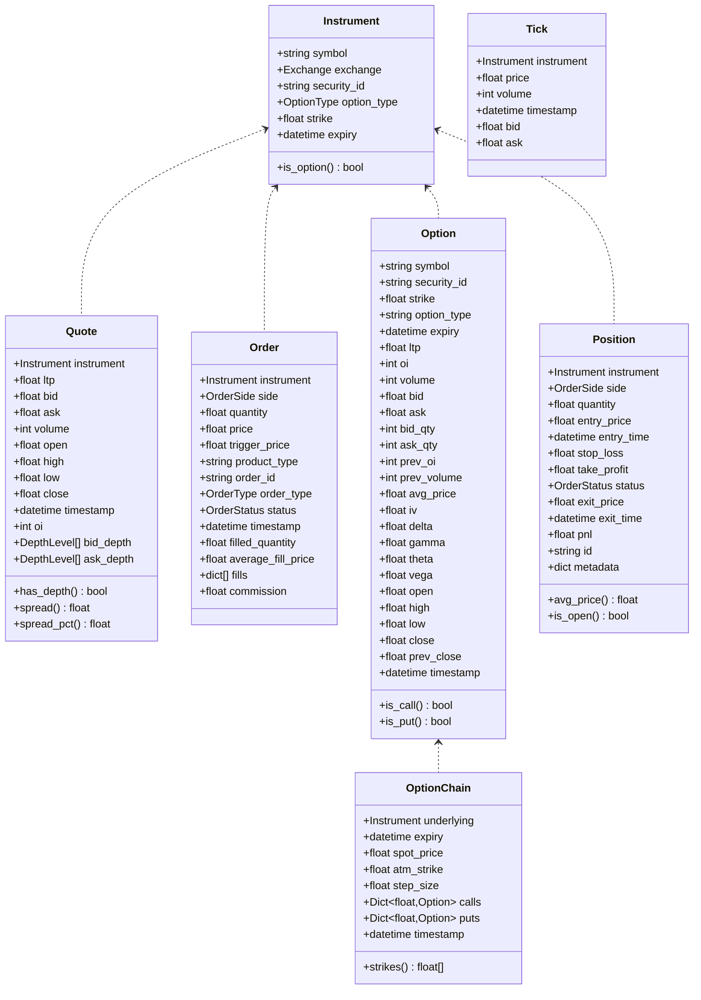

**Diagram sources**
- [models.py:72-341](file://shared/entities/models.py#L72-L341)

**Section sources**
- [models.py:17-341](file://shared/entities/models.py#L17-L341)

### Exchange Configuration
Centralized exchange-specific configuration to eliminate scattered constants.

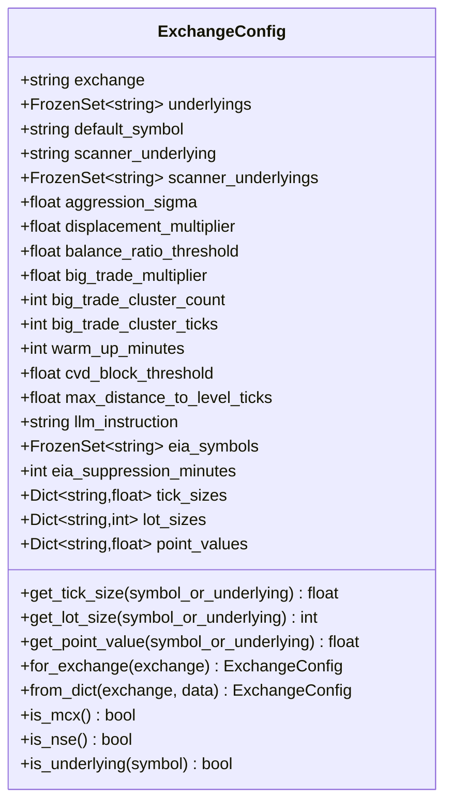

**Diagram sources**
- [exchange_config.py:20-307](file://backend/app/domain/models/exchange_config.py#L20-L307)

**Section sources**
- [exchange_config.py:94-307](file://backend/app/domain/models/exchange_config.py#L94-L307)

### Serialization DTOs and Converters
Pydantic DTOs define the JSON contract and converters bridge domain and DTO worlds.

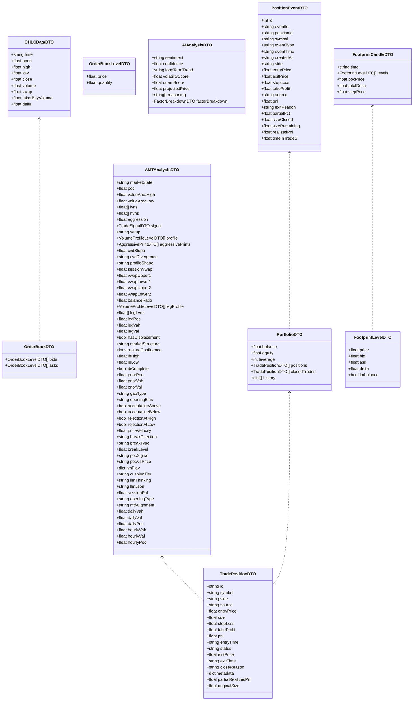

Converters:
- ohlc_to_dto/dto_to_ohlc
- dto_to_order_book
- dto_to_weights
- position_to_dto
- portfolio_to_dto
- position_event_to_dto
- amt_result_to_dto
- stats_to_dto
- footprint_to_dto

**Diagram sources**
- [schemas.py:31-667](file://backend/app/infrastructure/serialization/schemas.py#L31-L667)

**Section sources**
- [schemas.py:31-667](file://backend/app/infrastructure/serialization/schemas.py#L31-L667)

### AI Prediction Models and Probability Features
AI models produce combined outputs and feature vectors for probabilistic inference.

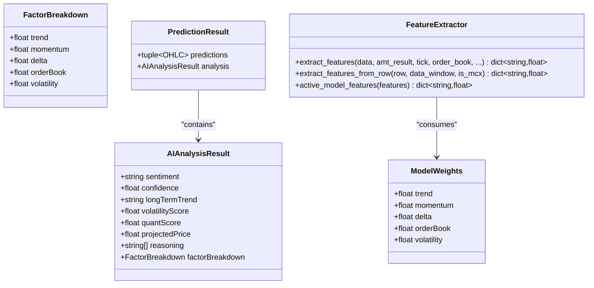

Feature schema:
- 42-feature canonical schema with groups for price microstructure, order flow, volume profile structure, order book, temporal, and options-specific features
- Versioned schema: fp-42-v1

**Diagram sources**
- [predictions.py:27-32](file://backend/app/domain/fabio_ai/models/predictions.py#L27-L32)
- [features.py:18-71](file://backend/app/domain/probability/features.py#L18-L71)

**Section sources**
- [predictions.py:1-32](file://backend/app/domain/fabio_ai/models/predictions.py#L1-L32)
- [features.py:1-423](file://backend/app/domain/probability/features.py#L1-L423)

### Configuration Models and Validation
Configuration loading and validation ensure safe operation across environments.

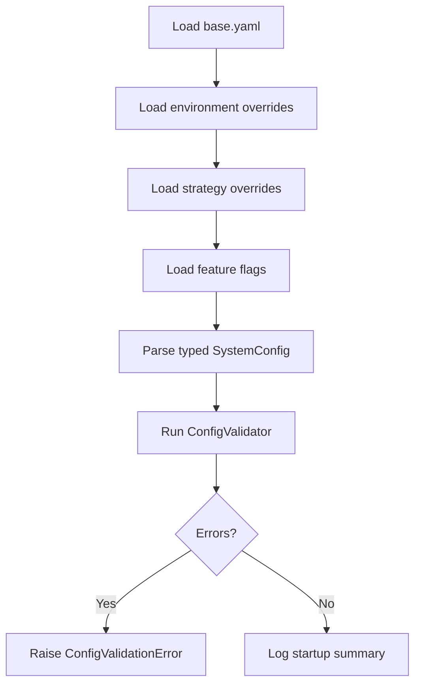

Validation rules include:
- At least one active symbol
- Live mode constraints (broker_mode, llm_entry_gate, capital)
- Risk limits (risk_per_trade_pct, portfolio_notional_cap)
- Symbol-level constraints (value_area_pct, min_rr_ratio, thresholds)
- ML model availability for active symbols

**Diagram sources**
- [loader.py:139-245](file://backend/app/config_models/loader.py#L139-L245)
- [validator.py:22-170](file://backend/app/config_models/validator.py#L22-L170)

**Section sources**
- [loader.py:1-288](file://backend/app/config_models/loader.py#L1-L288)
- [validator.py:1-177](file://backend/app/config_models/validator.py#L1-L177)

## Dependency Analysis
The following diagram shows key dependencies among data models and persistence.

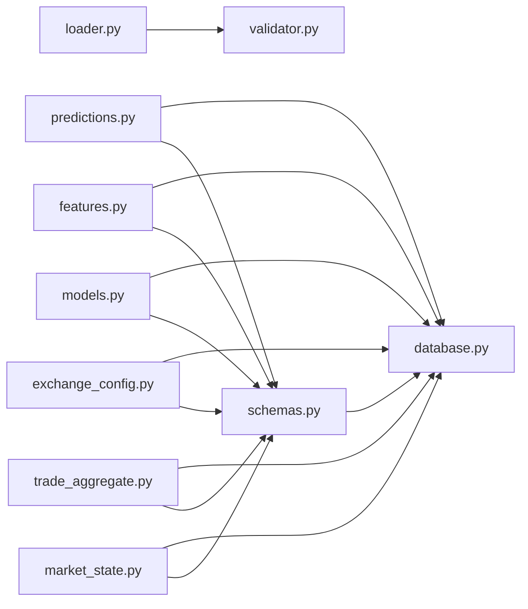

**Diagram sources**
- [market_state.py:1-173](file://backend/app/domain/models/market_state.py#L1-L173)
- [schemas.py:1-667](file://backend/app/infrastructure/serialization/schemas.py#L1-L667)
- [trade_aggregate.py:1-795](file://backend/app/domain/trading/models/trade_aggregate.py#L1-L795)
- [exchange_config.py:1-307](file://backend/app/domain/models/exchange_config.py#L1-L307)
- [models.py:1-341](file://shared/entities/models.py#L1-L341)
- [features.py:1-423](file://backend/app/domain/probability/features.py#L1-L423)
- [predictions.py:1-32](file://backend/app/domain/fabio_ai/models/predictions.py#L1-L32)
- [loader.py:1-288](file://backend/app/config_models/loader.py#L1-L288)
- [validator.py:1-177](file://backend/app/config_models/validator.py#L1-L177)
- [database.py:1-861](file://backend/app/infrastructure/storage/database.py#L1-L861)

**Section sources**
- [schemas.py:1-667](file://backend/app/infrastructure/serialization/schemas.py#L1-L667)
- [database.py:1-861](file://backend/app/infrastructure/storage/database.py#L1-L861)

## Performance Considerations
- SQLite batch writes: ticks buffered and flushed in batches with a timer to reduce I/O overhead
- WAL mode enabled for improved concurrency and durability
- Unique index on (symbol, time) for ticks to prevent duplicates
- Dedicated indexes on frequently queried columns (e.g., trades closed_at, llm_decisions created_at)
- DTO conversion helpers minimize object copying and preserve camelCase aliases for frontend compatibility
- Feature extraction computes rolling statistics efficiently and falls back gracefully for missing data

[No sources needed since this section provides general guidance]

## Troubleshooting Guide
Common issues and resolutions:
- Configuration validation failures: Review hard errors/warnings and adjust base.yaml, environment overrides, or strategy files accordingly
- Market state invariants: Ensure VAL < POC < VAH and positivity constraints; validate deviation_sign alignment for VWAP
- Trade state anomalies: Verify fills are append-only and position derivation matches expected quantities
- Persistence errors: Confirm WAL mode initialization and index creation succeeded; check batch flush intervals and locks

**Section sources**
- [validator.py:22-170](file://backend/app/config_models/validator.py#L22-L170)
- [market_state.py:37-89](file://backend/app/domain/models/market_state.py#L37-L89)
- [trade_aggregate.py:322-343](file://backend/app/domain/trading/models/trade_aggregate.py#L322-L343)
- [database.py:198-218](file://backend/app/infrastructure/storage/database.py#L198-L218)

## Conclusion
GlassyTrade AI v5 employs a robust, invariant-enforcing data model layered with typed DTOs and a durable SQLite persistence layer. The design emphasizes immutability, deterministic state, and strict validation to ensure reliable trading and analysis workflows. Configuration management and validation provide operational safety across environments.

[No sources needed since this section summarizes without analyzing specific files]

## Appendices

### Database Schema Diagram
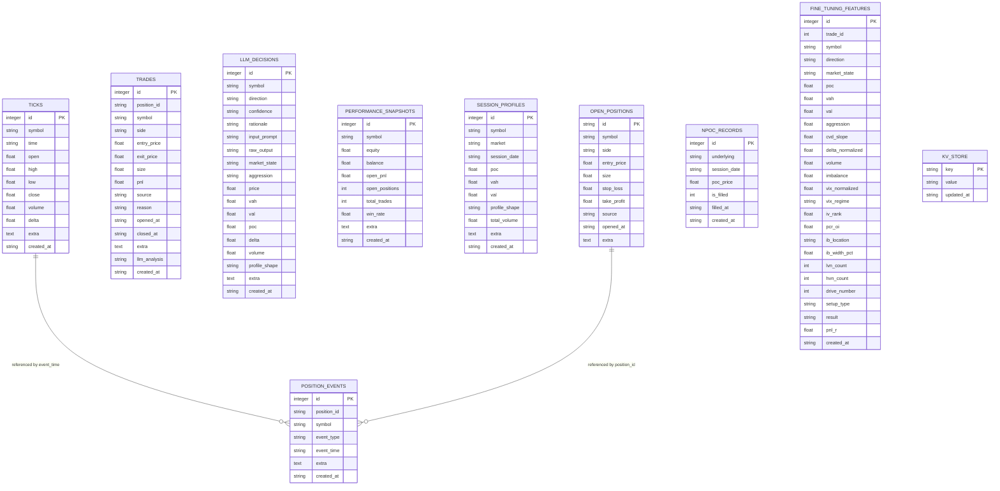

**Diagram sources**
- [database.py:24-176](file://backend/app/infrastructure/storage/database.py#L24-L176)

### Sample Data Examples
- Market State: VolumeProfile with val, poc, vah and computed_at
- Trading: Trade with EntrySignal, fills, and derived Position
- DTOs: AMTAnalysisDTO with marketState, profile, aggressivePrints, and sessionVwap
- Persistence: Trades with extra metadata, session_profiles with prior-day levels

**Section sources**
- [market_state.py:20-173](file://backend/app/domain/models/market_state.py#L20-L173)
- [trade_aggregate.py:293-795](file://backend/app/domain/trading/models/trade_aggregate.py#L293-L795)
- [schemas.py:91-163](file://backend/app/infrastructure/serialization/schemas.py#L91-L163)
- [database.py:35-176](file://backend/app/infrastructure/storage/database.py#L35-L176)

### Data Access Patterns
- Query ticks with symbol/time filters and limits
- Retrieve closed trades by date range
- Persist LLM decisions with known keys and extra metadata
- Save performance snapshots and fine-tuning features
- Manage open positions across restarts with replace-on-conflict

**Section sources**
- [database.py:485-764](file://backend/app/infrastructure/storage/database.py#L485-L764)

### Serialization Formats
- JSON payloads with camelCase aliases for frontend consumption
- Extra fields stored as JSON blobs for extensibility
- DTO converters ensure type-safe transformations

**Section sources**
- [schemas.py:367-667](file://backend/app/infrastructure/serialization/schemas.py#L367-L667)

### Security and Privacy
- Configuration secrets loaded from environment variables only
- Validation prevents unsafe configurations in live mode
- DTOs restrict unknown fields for safety

**Section sources**
- [loader.py:139-245](file://backend/app/config_models/loader.py#L139-L245)
- [validator.py:22-170](file://backend/app/config_models/validator.py#L22-L170)
- [schemas.py:230-231](file://backend/app/infrastructure/serialization/schemas.py#L230-L231)

### Migration and Version Management
- Schema upgrades performed via index replacement and deduplication
- Feature schema version tracked (fp-42-v1)
- Configuration hierarchy supports environment-specific overrides and strategy-driven tuning

**Section sources**
- [database.py:204-217](file://backend/app/infrastructure/storage/database.py#L204-L217)
- [features.py:18-71](file://backend/app/domain/probability/features.py#L18-L71)
- [loader.py:139-245](file://backend/app/config_models/loader.py#L139-L245)