# Market Data Structures

<cite>
**Referenced Files in This Document**
- [models.py](file://shared/entities/models.py)
- [value_objects.py](file://backend/app/domain/trading/models/value_objects.py)
- [market_data.py](file://backend/app/domain/ports/market_data.py)
- [dhan_adapter.py](file://backend/app/infrastructure/adapters/dhan_adapter.py)
- [websocket_client.py](file://brokers/broker/dhan/infrastructure/websocket_client.py)
- [depth_websocket_client.py](file://brokers/broker/dhan/infrastructure/depth_websocket_client.py)
- [websocket_port.py](file://brokers/broker/dhan/ports/websocket_port.py)
- [ARCHITECTURE.md](file://ARCHITECTURE.md)
- [schemas.py](file://backend/app/infrastructure/serialization/schemas.py)
- [depth_dto.py](file://backend/app/shared/depth_dto.py)
</cite>

## Table of Contents
1. [Introduction](#introduction)
2. [Project Structure](#project-structure)
3. [Core Components](#core-components)
4. [Architecture Overview](#architecture-overview)
5. [Detailed Component Analysis](#detailed-component-analysis)
6. [Dependency Analysis](#dependency-analysis)
7. [Performance Considerations](#performance-considerations)
8. [Troubleshooting Guide](#troubleshooting-guide)
9. [Conclusion](#conclusion)

## Introduction
This document describes the market data structures used in GlassyTrade AI v5, focusing on Quote, Tick, DepthLevel, MarketDepth, and FullPacket. It explains how these entities represent real-time market data, how they relate to each other, and how they integrate with the Dhan WebSocket feeds. It also covers spread calculations, market state enumerations, validation logic, serialization patterns, and performance considerations for high-frequency data handling.

## Project Structure
The market data domain is defined centrally and reused across the backend and brokers layers:
- Domain entities and enums are defined in the shared layer for canonical semantics.
- Domain value objects (e.g., OHLC, OrderBook, OrderBookLevel) are defined in the backend domain.
- The Dhan adapter implements the MarketDataPort interface and streams FullPacket and MarketDepth.
- DTOs and serializers bridge domain models to API payloads.

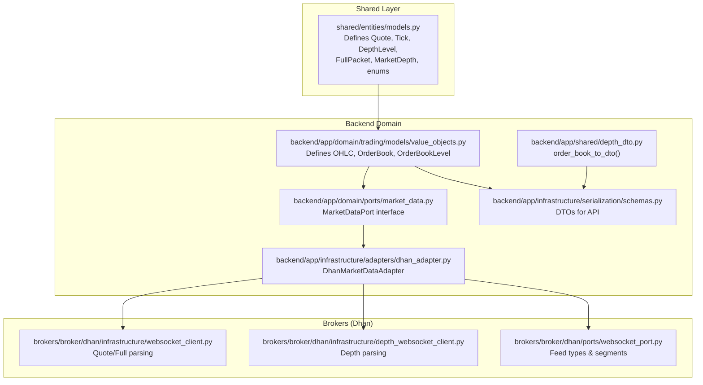

**Diagram sources**
- [models.py:88-288](file://shared/entities/models.py#L88-L288)
- [value_objects.py:18-77](file://backend/app/domain/trading/models/value_objects.py#L18-L77)
- [market_data.py:19-112](file://backend/app/domain/ports/market_data.py#L19-L112)
- [dhan_adapter.py:66-457](file://backend/app/infrastructure/adapters/dhan_adapter.py#L66-L457)
- [websocket_client.py:577-643](file://brokers/broker/dhan/infrastructure/websocket_client.py#L577-L643)
- [depth_websocket_client.py:260-289](file://brokers/broker/dhan/infrastructure/depth_websocket_client.py#L260-L289)
- [websocket_port.py:103-114](file://brokers/broker/dhan/ports/websocket_port.py#L103-L114)
- [schemas.py:31-52](file://backend/app/infrastructure/serialization/schemas.py#L31-L52)
- [depth_dto.py:16-32](file://backend/app/shared/depth_dto.py#L16-L32)

**Section sources**
- [models.py:1-341](file://shared/entities/models.py#L1-L341)
- [value_objects.py:1-309](file://backend/app/domain/trading/models/value_objects.py#L1-L309)
- [market_data.py:1-112](file://backend/app/domain/ports/market_data.py#L1-L112)
- [dhan_adapter.py:1-457](file://backend/app/infrastructure/adapters/dhan_adapter.py#L1-L457)
- [websocket_client.py:577-643](file://brokers/broker/dhan/infrastructure/websocket_client.py#L577-L643)
- [depth_websocket_client.py:260-289](file://brokers/broker/dhan/infrastructure/depth_websocket_client.py#L260-L289)
- [websocket_port.py:103-114](file://brokers/broker/dhan/ports/websocket_port.py#L103-L114)
- [schemas.py:1-52](file://backend/app/infrastructure/serialization/schemas.py#L1-L52)
- [depth_dto.py:1-33](file://backend/app/shared/depth_dto.py#L1-L33)

## Core Components
This section documents the core market data structures and their roles.

- Quote
  - Purpose: Encapsulates the latest trading information including LTP, OHLC, volume, open interest (OI), and optional depth arrays.
  - Fields: instrument, ltp, bid, ask, volume, open, high, low, close, timestamp, oi, bid_depth, ask_depth.
  - Utilities: has_depth, spread, spread_pct.
  - Usage: Returned by quote feeds and used to construct FullPacket and MarketDepth.

- Tick
  - Purpose: Captures a single trade event with price, volume, and optional bid/ask at the time of the trade.
  - Fields: instrument, price, volume, timestamp, bid, ask.
  - Usage: Represents individual trade events for analytics and alerts.

- DepthLevel
  - Purpose: Represents a single level in the order book with price, quantity, and optional number of orders.
  - Fields: price, quantity, orders.
  - Usage: Base building block for MarketDepth and OrderBook.

- MarketDepth
  - Purpose: 20-level depth snapshots with side (bid/ask) and list of DepthLevel entries.
  - Fields: symbol, security_id, side, levels, timestamp.
  - Usage: Streamed via Dhan’s depth feed; adapter exposes stream_depth_20.

- FullPacket
  - Purpose: Complete WebSocket packet combining Quote-like fields, OI, and 5-level depth.
  - Fields: symbol, ltp, open, high, low, close, volume, oi, atp, total_buy_qty, total_sell_qty, depth_bids, depth_asks, security_id, exchange_segment, timestamp, ltq, ltt.
  - Usage: Streamed by Dhan’s feed type 21; adapter converts to dict for legacy compatibility.

- OrderBook and OrderBookLevel (Backend domain)
  - Purpose: Immutable order book representation for internal processing.
  - Fields: bids (tuple of OrderBookLevel), asks (tuple of OrderBookLevel).
  - OrderBookLevel: price, quantity.
  - Usage: Adapter constructs OrderBook from Quote/FullPacket depth; serialized via order_book_to_dto.

- MarketState (Enum)
  - Purpose: Classifies market conditions for higher-level logic.
  - Values: BALANCED, IMBALANCED, INITIATIVE, BALANCE, UNKNOWN.
  - Usage: Integrated into derived metrics and gating logic.

**Section sources**
- [models.py:88-288](file://shared/entities/models.py#L88-L288)
- [value_objects.py:18-77](file://backend/app/domain/trading/models/value_objects.py#L18-L77)
- [market_data.py:19-112](file://backend/app/domain/ports/market_data.py#L19-L112)
- [dhan_adapter.py:320-351](file://backend/app/infrastructure/adapters/dhan_adapter.py#L320-L351)

## Architecture Overview
The Dhan adapter implements the MarketDataPort interface and bridges domain models to Dhan’s WebSocket feeds. The adapter streams FullPacket and MarketDepth, and converts them to dictionaries for backward compatibility. DTOs and serializers ensure clean API boundaries.

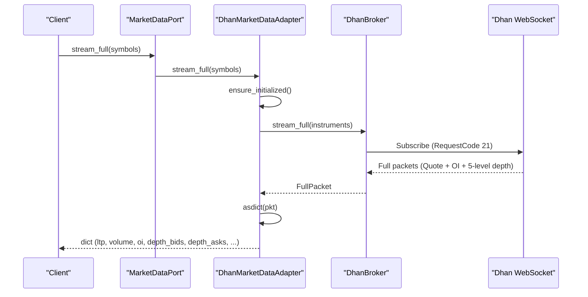

**Diagram sources**
- [market_data.py:88-96](file://backend/app/domain/ports/market_data.py#L88-L96)
- [dhan_adapter.py:364-381](file://backend/app/infrastructure/adapters/dhan_adapter.py#L364-L381)
- [websocket_client.py:603-643](file://brokers/broker/dhan/infrastructure/websocket_client.py#L603-L643)
- [websocket_port.py:103-114](file://brokers/broker/dhan/ports/websocket_port.py#L103-L114)

## Detailed Component Analysis

### Quote
- Definition: Canonical entity with LTP, OHLC, volume, OI, and optional depth arrays.
- Spread and percentage spread: Computed from bid/ask and LTP respectively.
- Integration: Used to populate FullPacket and MarketDepth; also returned by quote feeds.

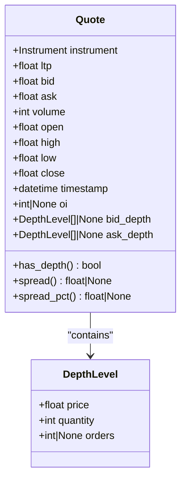

**Diagram sources**
- [models.py:88-123](file://shared/entities/models.py#L88-L123)
- [models.py:191-201](file://shared/entities/models.py#L191-L201)

**Section sources**
- [models.py:88-123](file://shared/entities/models.py#L88-L123)

### Tick
- Definition: Minimal representation of a single trade with price, volume, and optional bid/ask.
- Usage: Supports trade-centric analytics and alerting.

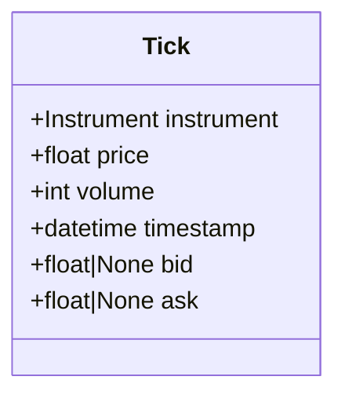

**Diagram sources**
- [models.py:124-132](file://shared/entities/models.py#L124-L132)

**Section sources**
- [models.py:124-132](file://shared/entities/models.py#L124-L132)

### DepthLevel
- Definition: Single order book level with price, quantity, and optional order count.
- Usage: Base for MarketDepth and OrderBookLevel.

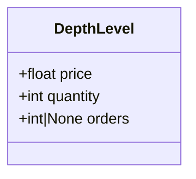

**Diagram sources**
- [models.py:191-201](file://shared/entities/models.py#L191-L201)

**Section sources**
- [models.py:191-201](file://shared/entities/models.py#L191-L201)

### MarketDepth
- Definition: 20-level depth snapshots with side and levels.
- Streaming: Adapter exposes stream_depth_20 yielding MarketDepth objects.

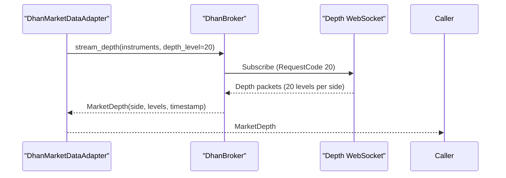

**Diagram sources**
- [dhan_adapter.py:436-445](file://backend/app/infrastructure/adapters/dhan_adapter.py#L436-L445)
- [depth_websocket_client.py:260-289](file://brokers/broker/dhan/infrastructure/depth_websocket_client.py#L260-L289)
- [websocket_port.py:103-114](file://brokers/broker/dhan/ports/websocket_port.py#L103-L114)

**Section sources**
- [dhan_adapter.py:436-445](file://backend/app/infrastructure/adapters/dhan_adapter.py#L436-L445)
- [depth_websocket_client.py:260-289](file://brokers/broker/dhan/infrastructure/depth_websocket_client.py#L260-L289)
- [websocket_port.py:103-114](file://brokers/broker/dhan/ports/websocket_port.py#L103-L114)

### FullPacket
- Definition: Complete feed combining Quote-like fields, OI, and 5-level depth.
- Streaming: Adapter exposes stream_full yielding dicts for compatibility.

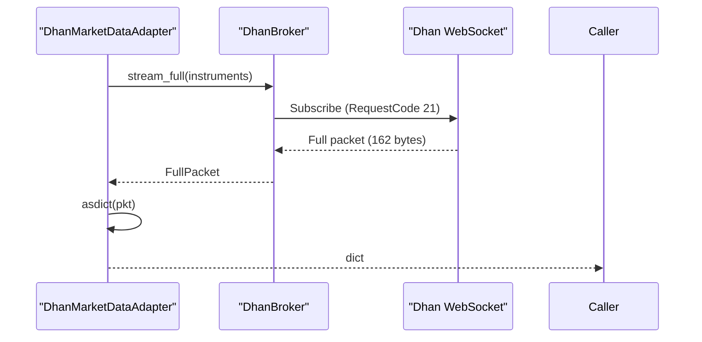

**Diagram sources**
- [dhan_adapter.py:364-381](file://backend/app/infrastructure/adapters/dhan_adapter.py#L364-L381)
- [websocket_client.py:603-643](file://brokers/broker/dhan/infrastructure/websocket_client.py#L603-L643)
- [ARCHITECTURE.md:584-595](file://ARCHITECTURE.md#L584-L595)

**Section sources**
- [dhan_adapter.py:364-381](file://backend/app/infrastructure/adapters/dhan_adapter.py#L364-L381)
- [websocket_client.py:603-643](file://brokers/broker/dhan/infrastructure/websocket_client.py#L603-L643)
- [ARCHITECTURE.md:584-595](file://ARCHITECTURE.md#L584-L595)

### OrderBook and OrderBookLevel (Backend Domain)
- Definition: Immutable order book with tuples of levels for bids and asks.
- Serialization: order_book_to_dto caps levels at 20 and produces plain dicts.

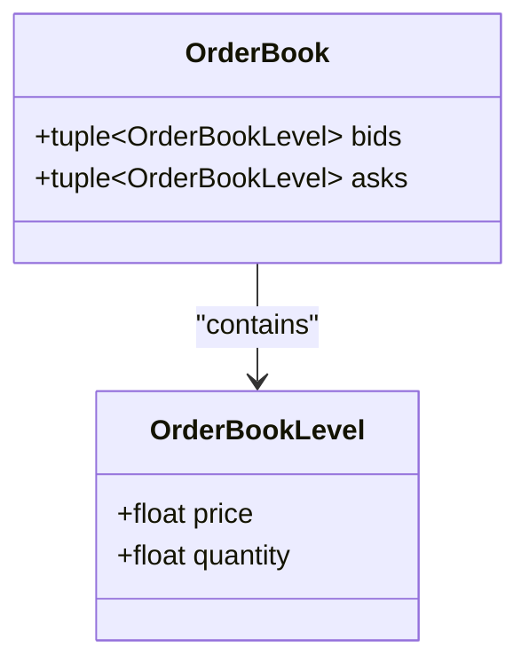

**Diagram sources**
- [value_objects.py:67-77](file://backend/app/domain/trading/models/value_objects.py#L67-L77)

**Section sources**
- [value_objects.py:67-77](file://backend/app/domain/trading/models/value_objects.py#L67-L77)
- [depth_dto.py:16-32](file://backend/app/shared/depth_dto.py#L16-L32)

### Market State Enumeration
- MarketState enum defines BALANCED, IMBALANCED, INITIATIVE, BALANCE, UNKNOWN.
- Used by higher-level logic and derived metrics.

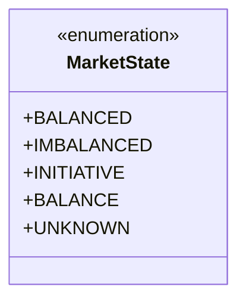

**Diagram sources**
- [models.py:53-58](file://shared/entities/models.py#L53-L58)

**Section sources**
- [models.py:53-58](file://shared/entities/models.py#L53-L58)

### Spread Calculations and Validation Logic
- Quote.spread and Quote.spread_pct compute bid-ask spread and percentage spread from LTP.
- Validation: Market state and derived metrics enforce invariants (e.g., positive prices, proper ordering).

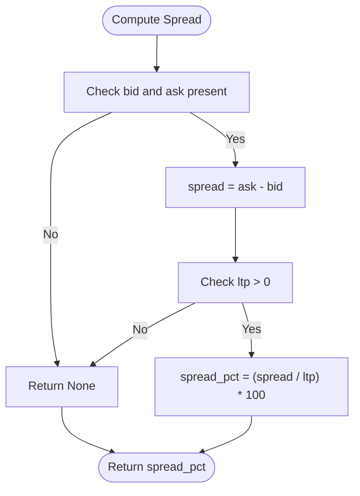

**Diagram sources**
- [models.py:110-122](file://shared/entities/models.py#L110-L122)

**Section sources**
- [models.py:110-122](file://shared/entities/models.py#L110-L122)

### Data Validation Logic
- Domain models enforce invariants (e.g., positive prices, proper ordering in derived metrics).
- MarketDataPort defines error contracts for fetch and stream operations.

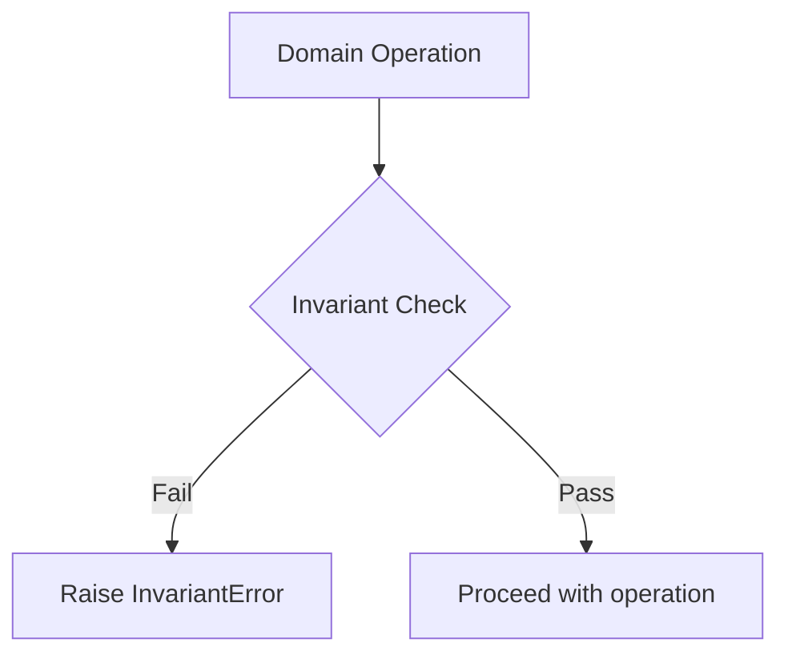

**Diagram sources**
- [models.py:14-17](file://shared/entities/models.py#L14-L17)
- [models.py:37-52](file://shared/entities/models.py#L37-L52)
- [market_data.py:3-8](file://backend/app/domain/ports/market_data.py#L3-L8)

**Section sources**
- [models.py:14-17](file://shared/entities/models.py#L14-L17)
- [models.py:37-52](file://shared/entities/models.py#L37-L52)
- [market_data.py:3-8](file://backend/app/domain/ports/market_data.py#L3-L8)

### Serialization Patterns
- DTOs for API boundary: OHLCDataDTO, OrderBookDTO, OrderBookLevelDTO.
- Round-trip converters: domain models ↔ DTOs.
- Order book serialization: order_book_to_dto caps at 20 levels.

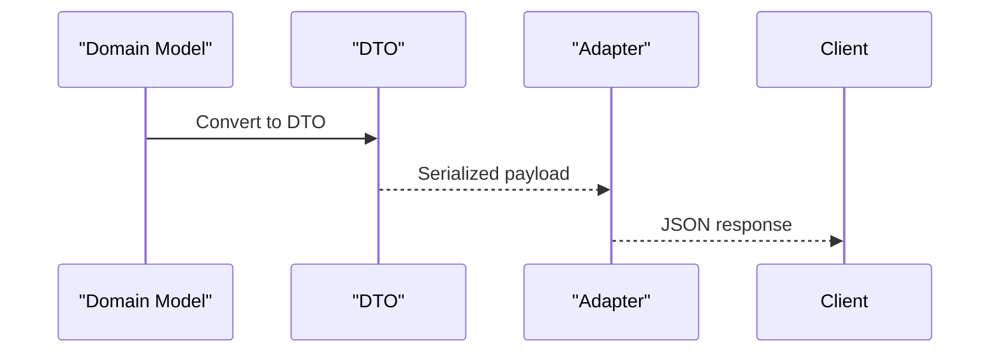

**Diagram sources**
- [schemas.py:31-52](file://backend/app/infrastructure/serialization/schemas.py#L31-L52)
- [depth_dto.py:16-32](file://backend/app/shared/depth_dto.py#L16-L32)

**Section sources**
- [schemas.py:31-52](file://backend/app/infrastructure/serialization/schemas.py#L31-L52)
- [depth_dto.py:16-32](file://backend/app/shared/depth_dto.py#L16-L32)

## Dependency Analysis
The Dhan adapter depends on the shared entities and brokers WebSocket clients to produce domain models and DTOs.

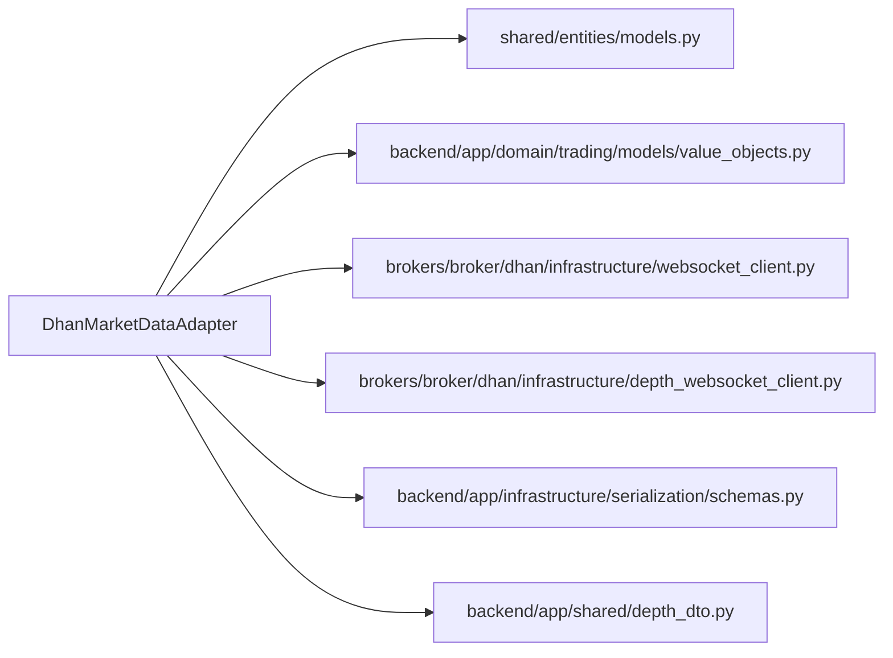

**Diagram sources**
- [dhan_adapter.py:29-30](file://backend/app/infrastructure/adapters/dhan_adapter.py#L29-L30)
- [models.py:88-288](file://shared/entities/models.py#L88-L288)
- [value_objects.py:18-77](file://backend/app/domain/trading/models/value_objects.py#L18-L77)
- [websocket_client.py:577-643](file://brokers/broker/dhan/infrastructure/websocket_client.py#L577-L643)
- [depth_websocket_client.py:260-289](file://brokers/broker/dhan/infrastructure/depth_websocket_client.py#L260-L289)
- [schemas.py:31-52](file://backend/app/infrastructure/serialization/schemas.py#L31-L52)
- [depth_dto.py:16-32](file://backend/app/shared/depth_dto.py#L16-L32)

**Section sources**
- [dhan_adapter.py:29-30](file://backend/app/infrastructure/adapters/dhan_adapter.py#L29-L30)
- [models.py:88-288](file://shared/entities/models.py#L88-L288)
- [value_objects.py:18-77](file://backend/app/domain/trading/models/value_objects.py#L18-L77)
- [websocket_client.py:577-643](file://brokers/broker/dhan/infrastructure/websocket_client.py#L577-L643)
- [depth_websocket_client.py:260-289](file://brokers/broker/dhan/infrastructure/depth_websocket_client.py#L260-L289)
- [schemas.py:31-52](file://backend/app/infrastructure/serialization/schemas.py#L31-L52)
- [depth_dto.py:16-32](file://backend/app/shared/depth_dto.py#L16-L32)

## Performance Considerations
- WebSocket packet sizes: Quote (50 bytes), Full (162 bytes), Depth level (18 bytes), Depth packet (170 bytes).
- Streaming caps: FullPacket provides 5-level depth; MarketDepth provides 20-level depth.
- Serialization overhead: order_book_to_dto caps levels to reduce payload size.
- Polling fallback: stream_poll provides REST LTP polling for instruments without WS depth.

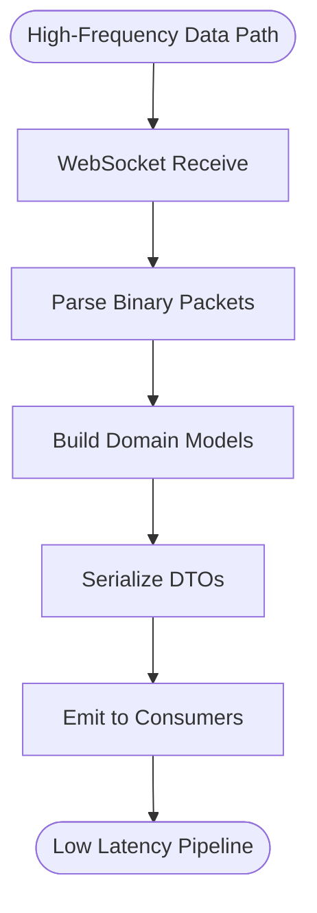

**Diagram sources**
- [ARCHITECTURE.md:557-595](file://ARCHITECTURE.md#L557-L595)
- [websocket_client.py:603-643](file://brokers/broker/dhan/infrastructure/websocket_client.py#L603-L643)
- [depth_websocket_client.py:260-289](file://brokers/broker/dhan/infrastructure/depth_websocket_client.py#L260-L289)
- [depth_dto.py:16-32](file://backend/app/shared/depth_dto.py#L16-L32)

**Section sources**
- [ARCHITECTURE.md:557-595](file://ARCHITECTURE.md#L557-L595)
- [websocket_client.py:603-643](file://brokers/broker/dhan/infrastructure/websocket_client.py#L603-L643)
- [depth_websocket_client.py:260-289](file://brokers/broker/dhan/infrastructure/depth_websocket_client.py#L260-L289)
- [depth_dto.py:16-32](file://backend/app/shared/depth_dto.py#L16-L32)

## Troubleshooting Guide
- Connection failures: MarketDataPort stream_full raises on connection failure; Dhan adapter logs and propagates exceptions.
- No data scenarios: fetch_history returns empty list; get_ltp returns 0.0; fetch_order_book returns None.
- Exchange mapping: Unknown exchanges default to NSE; verify exchange strings.
- Polling fallback: stream_poll provides REST LTP polling for MCX OPTFUT when WS depth is unavailable.

**Section sources**
- [market_data.py:3-8](file://backend/app/domain/ports/market_data.py#L3-L8)
- [dhan_adapter.py:314-318](file://backend/app/infrastructure/adapters/dhan_adapter.py#L314-L318)
- [dhan_adapter.py:353-362](file://backend/app/infrastructure/adapters/dhan_adapter.py#L353-L362)
- [dhan_adapter.py:383-434](file://backend/app/infrastructure/adapters/dhan_adapter.py#L383-L434)

## Conclusion
GlassyTrade AI v5 models market data consistently across layers using canonical entities (Quote, Tick, DepthLevel, MarketDepth, FullPacket) and immutable domain value objects (OHLC, OrderBook). The Dhan adapter integrates tightly with WebSocket feeds, exposing standardized streams and DTOs. Built-in validations, spread computations, and serialization patterns ensure correctness and performance for high-frequency real-time processing.