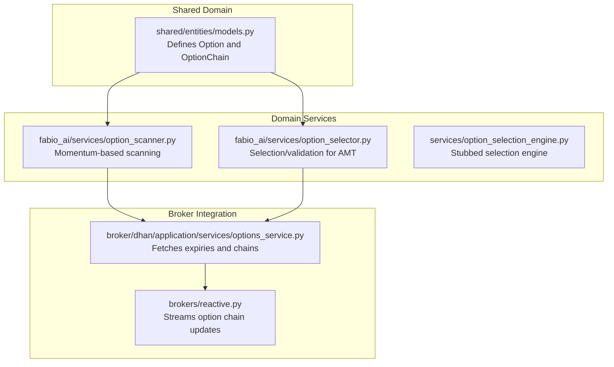
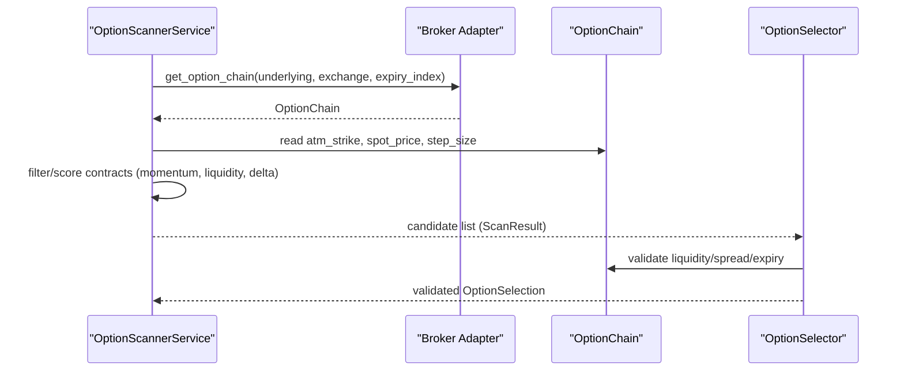
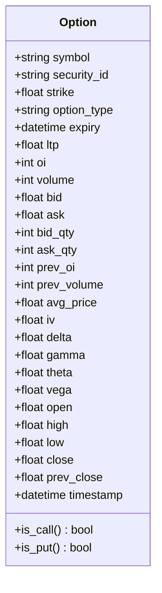
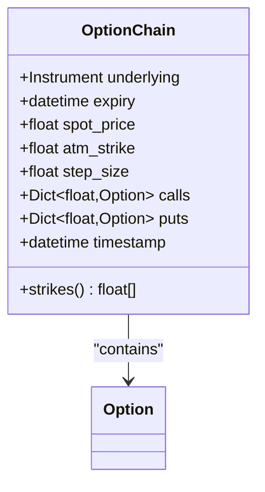
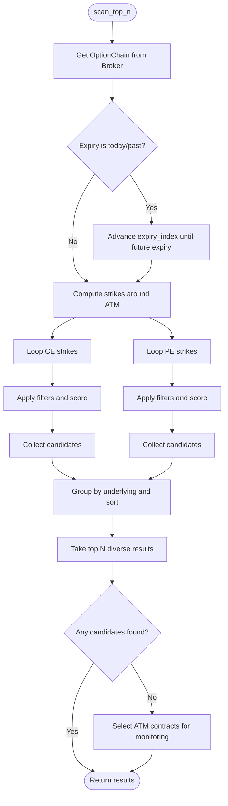
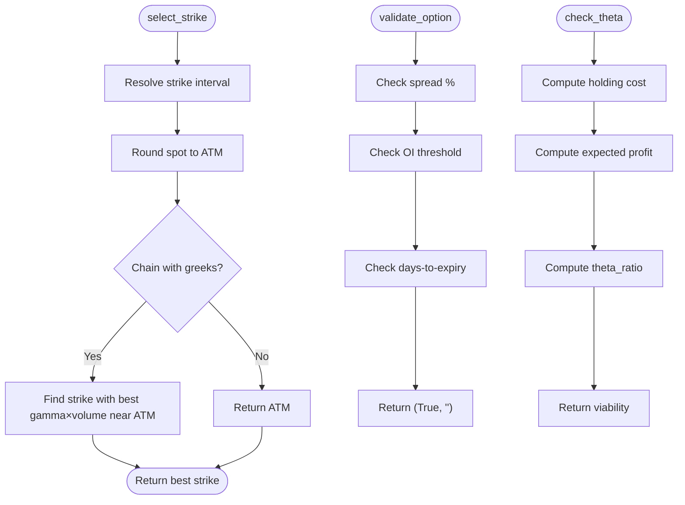
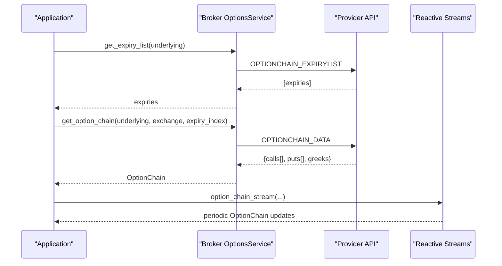
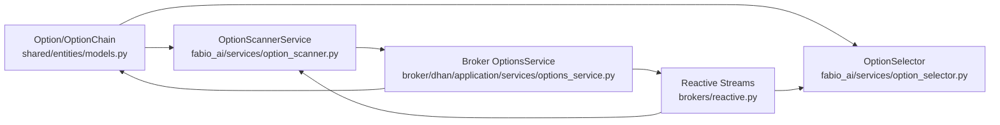

# Option Chain Models

<cite>
**Referenced Files in This Document**
- [models.py](file://shared/entities/models.py)
- [option_scanner.py](file://backend/app/domain/fabio_ai/services/option_scanner.py)
- [option_selector.py](file://backend/app/domain/fabio_ai/services/option_selector.py)
- [option_selection_engine.py](file://backend/app/domain/services/option_selection_engine.py)
- [options_service.py](file://brokers/broker/dhan/application/services/options_service.py)
- [reactive.py](file://brokers/reactive.py)
</cite>

## Table of Contents
1. [Introduction](#introduction)
2. [Project Structure](#project-structure)
3. [Core Components](#core-components)
4. [Architecture Overview](#architecture-overview)
5. [Detailed Component Analysis](#detailed-component-analysis)
6. [Dependency Analysis](#dependency-analysis)
7. [Performance Considerations](#performance-considerations)
8. [Troubleshooting Guide](#troubleshooting-guide)
9. [Conclusion](#conclusion)

## Introduction
This document describes the option chain data models and related structures used in GlassyTrade AI v5. It focuses on the Option and OptionChain domain entities, detailing their fields, properties, and business logic. It also explains how option chains are constructed, filtered, and selected for trading strategies, including ATM strike computation, strike list generation, bid/ask handling, and integration with market data feeds and real-time updates. The document provides examples of constructing option chains, applying filters, and selecting contracts aligned with strategies such as gamma scalping and momentum-following.

## Project Structure
Option chain models are defined in the shared domain layer and consumed by domain services that implement selection and scanning logic. Brokers integrate with external providers to supply option chain data, including Greeks and timestamps. The following diagram shows the primary files involved in option chain modeling and usage.

**Diagram sources**
- [models.py:203-251](file://shared/entities/models.py#L203-L251)
- [option_scanner.py:38-377](file://backend/app/domain/fabio_ai/services/option_scanner.py#L38-L377)
- [option_selector.py:98-335](file://backend/app/domain/fabio_ai/services/option_selector.py#L98-L335)
- [option_selection_engine.py:46-71](file://backend/app/domain/services/option_selection_engine.py#L46-L71)
- [options_service.py:45-257](file://brokers/broker/dhan/application/services/options_service.py#L45-L257)
- [reactive.py:624-668](file://brokers/reactive.py#L624-L668)

**Section sources**
- [models.py:203-251](file://shared/entities/models.py#L203-L251)
- [option_scanner.py:38-377](file://backend/app/domain/fabio_ai/services/option_scanner.py#L38-L377)
- [option_selector.py:98-335](file://backend/app/domain/fabio_ai/services/option_selector.py#L98-L335)
- [option_selection_engine.py:46-71](file://backend/app/domain/services/option_selection_engine.py#L46-L71)
- [options_service.py:45-257](file://brokers/broker/dhan/application/services/options_service.py#L45-L257)
- [reactive.py:624-668](file://brokers/reactive.py#L624-L668)

## Core Components
This section documents the Option and OptionChain data models, their fields, and derived properties.

- Option
  - Purpose: Represents a single option contract with market data and Greeks.
  - Key fields:
    - Identity: symbol, security_id
    - Specification: strike, option_type ('CE' or 'PE'), expiry
    - Market data: ltp, oi, volume, bid, ask, bid_qty, ask_qty, prev_oi, prev_volume, avg_price
    - OHLC: open, high, low, close, prev_close
    - Greeks: iv, delta, gamma, theta, vega
    - Timestamp: timestamp
  - Properties:
    - is_call: True when option_type is 'CE'
    - is_put: True when option_type is 'PE'

- OptionChain
  - Purpose: Holds a complete option chain for an underlying instrument.
  - Key fields:
    - underlying: Instrument
    - expiry: Expiration datetime
    - spot_price: Current spot price
    - atm_strike: At-the-money strike
    - step_size: Strike interval step
    - calls: Dict[float, Option] — CE options keyed by strike
    - puts: Dict[float, Option] — PE options keyed by strike
    - timestamp: Last-updated timestamp
  - Property:
    - strikes: Returns a sorted list of all unique strikes present in the chain

**Section sources**
- [models.py:203-251](file://shared/entities/models.py#L203-L251)

## Architecture Overview
The option chain architecture spans three layers:
- Domain models define Option and OptionChain with canonical fields and properties.
- Domain services implement selection and scanning logic:
  - OptionScannerService builds candidate lists using momentum, liquidity, and ATM proximity.
  - OptionSelector validates candidates against theta, spread, OI, and expiry constraints.
- Broker integration supplies real-time option chain data and streams updates.

**Diagram sources**
- [option_scanner.py:157-377](file://backend/app/domain/fabio_ai/services/option_scanner.py#L157-L377)
- [option_selector.py:192-335](file://backend/app/domain/fabio_ai/services/option_selector.py#L192-L335)
- [options_service.py:45-257](file://brokers/broker/dhan/application/services/options_service.py#L45-L257)

## Detailed Component Analysis

### Option Model
- Fields and semantics:
  - Symbol and security identifiers uniquely identify the contract.
  - Strike and option_type define the specification; expiry determines maturity.
  - Market data fields capture LTP, OI, volume, bid/ask, quantities, previous values, OHLC, and average price.
  - Greeks fields capture IV, delta, gamma, theta, and vega.
  - Timestamp captures the last update time.
- Business logic:
  - is_call and is_put provide type checks for downstream selection logic.

**Diagram sources**
- [models.py:203-239](file://shared/entities/models.py#L203-L239)

**Section sources**
- [models.py:203-239](file://shared/entities/models.py#L203-L239)

### OptionChain Model
- Fields and semantics:
  - underlying: Instrument representing the underlying asset.
  - expiry: Expiration datetime for the selected option series.
  - spot_price: Latest spot price used for ATM calculation and filtering.
  - atm_strike: At-the-money strike computed from spot and step_size.
  - step_size: Strike interval step used for generating and indexing strikes.
  - calls and puts: Dictionaries mapping strike prices to Option instances.
  - timestamp: Last-updated timestamp for the chain snapshot.
- Derived property:
  - strikes: Returns a sorted list of all unique strikes present in the chain.

**Diagram sources**
- [models.py:241-251](file://shared/entities/models.py#L241-L251)

**Section sources**
- [models.py:241-251](file://shared/entities/models.py#L241-L251)

### OptionScannerService
- Purpose: Scans option chains to produce ranked candidates based on momentum, liquidity, and ATM proximity.
- Key behaviors:
  - Detects momentum via CE vs PE volume ratios.
  - Scores contracts using ATM distance, OI, volume, delta sweet-spot, and spread penalty.
  - Filters by exchange-specific minima and premium ranges.
  - Automatically advances expiry index if the selected expiry is today or in the past.
  - Returns top-N contracts per underlying and diversity constraints.
- ATM and strike handling:
  - Uses chain.atm_strike and configured strike intervals to scan nearby strikes.
  - Processes both CE and PE sides around ATM.

**Diagram sources**
- [option_scanner.py:157-377](file://backend/app/domain/fabio_ai/services/option_scanner.py#L157-L377)

**Section sources**
- [option_scanner.py:38-377](file://backend/app/domain/fabio_ai/services/option_scanner.py#L38-L377)

### OptionSelector
- Purpose: Translates directional signals into concrete option contracts for AMT-based strategies.
- Key behaviors:
  - Strike selection: prefers ATM for scalping; optionally picks the highest gamma×volume near ATM.
  - Symbol building: formats Dhan-style symbols from underlying, expiry, strike, and option type.
  - Validation: checks bid-ask spread, OI thresholds, and days-to-expiry.
  - Theta viability: computes holding cost vs expected profit to assess trade feasibility.
  - Lot sizing: derives number of lots from account equity, risk%, stop loss points, and lot size.
  - Expiry selection: prefers current week for maximum gamma; avoids last gamma-trap hours on expiry day.

**Diagram sources**
- [option_selector.py:131-335](file://backend/app/domain/fabio_ai/services/option_selector.py#L131-L335)

**Section sources**
- [option_selector.py:98-335](file://backend/app/domain/fabio_ai/services/option_selector.py#L98-L335)

### Broker Integration and Real-Time Updates
- Expiry and chain retrieval:
  - Broker resolves security IDs and fetches expiry lists and option chains for indices and equities.
  - Chains include contract greeks (delta, gamma, theta, vega) and market data.
- Real-time streaming:
  - Reactive broker exposes streams for spot price, OI, and other metrics, enabling continuous updates for option chains.

**Diagram sources**
- [options_service.py:45-257](file://brokers/broker/dhan/application/services/options_service.py#L45-L257)
- [reactive.py:624-668](file://brokers/reactive.py#L624-L668)

**Section sources**
- [options_service.py:45-257](file://brokers/broker/dhan/application/services/options_service.py#L45-L257)
- [reactive.py:624-668](file://brokers/reactive.py#L624-L668)

## Dependency Analysis
Option chain models and services form a cohesive pipeline:
- Option and OptionChain are consumed by OptionScannerService and OptionSelector.
- OptionScannerService depends on broker-provided OptionChain data and performs filtering and scoring.
- OptionSelector consumes OptionChain and applies validation and theta checks.
- Broker integration supplies OptionChain with Greeks and timestamps, and reactive streams keep OptionChain fresh.

**Diagram sources**
- [models.py:203-251](file://shared/entities/models.py#L203-L251)
- [option_scanner.py:38-377](file://backend/app/domain/fabio_ai/services/option_scanner.py#L38-L377)
- [option_selector.py:98-335](file://backend/app/domain/fabio_ai/services/option_selector.py#L98-L335)
- [options_service.py:45-257](file://brokers/broker/dhan/application/services/options_service.py#L45-L257)
- [reactive.py:624-668](file://brokers/reactive.py#L624-L668)

**Section sources**
- [models.py:203-251](file://shared/entities/models.py#L203-L251)
- [option_scanner.py:38-377](file://backend/app/domain/fabio_ai/services/option_scanner.py#L38-L377)
- [option_selector.py:98-335](file://backend/app/domain/fabio_ai/services/option_selector.py#L98-L335)
- [options_service.py:45-257](file://brokers/broker/dhan/application/services/options_service.py#L45-L257)
- [reactive.py:624-668](file://brokers/reactive.py#L624-L668)

## Performance Considerations
- Filtering and scoring complexity:
  - Scanning near ATM involves iterating over a bounded set of strikes around ATM; complexity is O(k) per side where k is the number of strikes considered.
  - Sorting and grouping by underlying adds O(n log n) for n total candidates.
- Greeks availability:
  - When Greeks are absent, OptionSelector falls back to ATM selection, avoiding expensive computations.
- Streaming updates:
  - Using reactive streams reduces polling overhead and ensures timely updates for chain snapshots and Greeks.

## Troubleshooting Guide
- No option chain returned:
  - The scanner advances expiry index automatically when the selected expiry is today or in the past. Verify expiry list retrieval and index bounds.
- Low liquidity or wide spreads:
  - Increase OI thresholds or adjust spread tolerance in selection/validation steps.
- Theta viability issues:
  - Reduce expected hold time or choose contracts with lower theta for the intended holding horizon.
- Real-time freshness:
  - Ensure reactive streams are active and OptionChain timestamps reflect recent updates.

**Section sources**
- [option_scanner.py:203-230](file://backend/app/domain/fabio_ai/services/option_scanner.py#L203-L230)
- [option_selector.py:192-227](file://backend/app/domain/fabio_ai/services/option_selector.py#L192-L227)
- [reactive.py:624-668](file://brokers/reactive.py#L624-L668)

## Conclusion
GlassyTrade AI v5’s option chain models provide a robust foundation for options trading strategies. Option and OptionChain encapsulate essential contract and chain metadata, while OptionScannerService and OptionSelector implement practical selection logic grounded in momentum, liquidity, ATM proximity, and theta viability. Broker integration supplies timely chain data and streams, enabling responsive, real-time decision-making within the broader trading system.