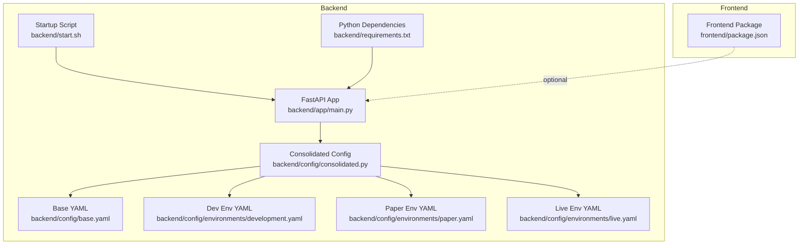
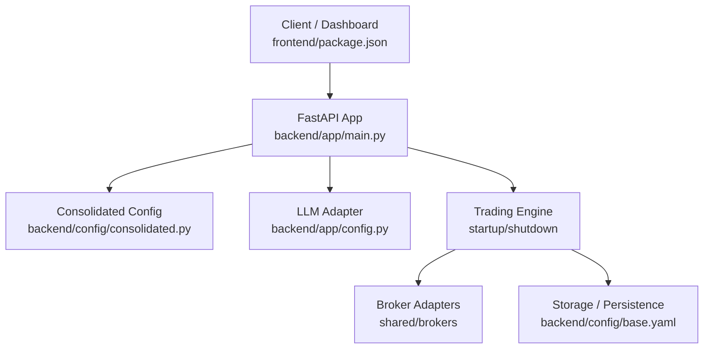
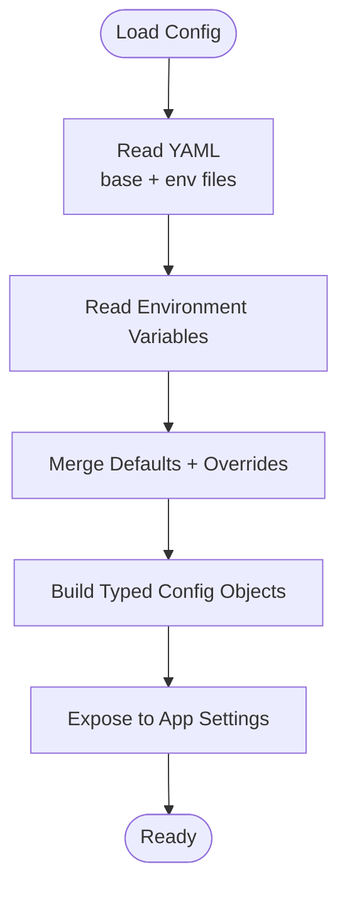
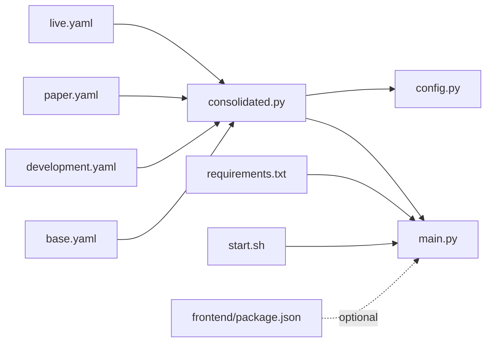

# Deployment and Operations

<cite>
**Referenced Files in This Document**
- [backend/app/main.py](file://backend/app/main.py)
- [backend/app/config.py](file://backend/app/config.py)
- [backend/config/consolidated.py](file://backend/config/consolidated.py)
- [backend/config/base.yaml](file://backend/config/base.yaml)
- [backend/config/environments/development.yaml](file://backend/config/environments/development.yaml)
- [backend/config/environments/paper.yaml](file://backend/config/environments/paper.yaml)
- [backend/config/environments/live.yaml](file://backend/config/environments/live.yaml)
- [backend/start.sh](file://backend/start.sh)
- [backend/requirements.txt](file://backend/requirements.txt)
- [frontend/package.json](file://frontend/package.json)
</cite>

## Table of Contents
1. [Introduction](#introduction)
2. [Project Structure](#project-structure)
3. [Core Components](#core-components)
4. [Architecture Overview](#architecture-overview)
5. [Detailed Component Analysis](#detailed-component-analysis)
6. [Dependency Analysis](#dependency-analysis)
7. [Performance Considerations](#performance-considerations)
8. [Troubleshooting Guide](#troubleshooting-guide)
9. [Conclusion](#conclusion)
10. [Appendices](#appendices)

## Introduction
This document provides comprehensive deployment and operations guidance for GlassyTrade AI v5. It covers production deployment configuration, environment setup, scaling considerations, deployment pipelines, containerization options, infrastructure requirements, monitoring and alerting, rolling updates, maintenance, backup and disaster recovery, security and access control, compliance, troubleshooting, performance optimization, capacity planning, and operational runbooks for 24/7 management.

## Project Structure
GlassyTrade AI v5 consists of:
- Backend trading engine and API built with FastAPI and Uvicorn, located under backend/.
- Frontend dashboard and analytics under frontend/.
- Centralized configuration under backend/config/, including base and environment-specific YAML files.
- Startup script under backend/start.sh for local execution.
- Python dependencies under backend/requirements.txt.

**Diagram sources**
- [backend/app/main.py:1-227](file://backend/app/main.py#L1-L227)
- [backend/config/consolidated.py:1-418](file://backend/config/consolidated.py#L1-L418)
- [backend/config/base.yaml:1-493](file://backend/config/base.yaml#L1-L493)
- [backend/config/environments/development.yaml:1-33](file://backend/config/environments/development.yaml#L1-L33)
- [backend/config/environments/paper.yaml:1-25](file://backend/config/environments/paper.yaml#L1-L25)
- [backend/config/environments/live.yaml:1-26](file://backend/config/environments/live.yaml#L1-L26)
- [backend/start.sh:1-6](file://backend/start.sh#L1-L6)
- [backend/requirements.txt:1-22](file://backend/requirements.txt#L1-L22)
- [frontend/package.json:1-39](file://frontend/package.json#L1-L39)

**Section sources**
- [backend/app/main.py:1-227](file://backend/app/main.py#L1-L227)
- [backend/config/consolidated.py:1-418](file://backend/config/consolidated.py#L1-L418)
- [backend/config/base.yaml:1-493](file://backend/config/base.yaml#L1-L493)
- [backend/config/environments/development.yaml:1-33](file://backend/config/environments/development.yaml#L1-L33)
- [backend/config/environments/paper.yaml:1-25](file://backend/config/environments/paper.yaml#L1-L25)
- [backend/config/environments/live.yaml:1-26](file://backend/config/environments/live.yaml#L1-L26)
- [backend/start.sh:1-6](file://backend/start.sh#L1-L6)
- [backend/requirements.txt:1-22](file://backend/requirements.txt#L1-L22)
- [frontend/package.json:1-39](file://frontend/package.json#L1-L39)

## Core Components
- Application entrypoint and lifecycle: FastAPI app with structured JSON logging, CORS, in-memory rate limiting, and a lifespan manager that initializes the service graph, loads and validates the LLM model, starts the trading engine, and performs graceful shutdown.
- Configuration: A consolidated configuration system that merges environment variables, YAML overrides, and defaults, enabling flexible runtime tuning.
- Environment profiles: Separate YAML files define development, paper, and live modes with distinct risk, broker mode, logging level, and LLM constraints.
- Startup and hosting: A shell script executes Uvicorn on port 9090, ensuring environment prerequisites for MLX on macOS.

Key operational controls:
- Logging: Structured JSON logs for production observability.
- Rate limiting: Simple sliding-window middleware to protect the API.
- LLM readiness: Startup blocks until the model is ready and validated.
- Graceful shutdown: Engine stop, tick flush, thread pool cleanup, and market data disconnect.

**Section sources**
- [backend/app/main.py:43-176](file://backend/app/main.py#L43-L176)
- [backend/app/main.py:171-227](file://backend/app/main.py#L171-L227)
- [backend/config/consolidated.py:232-314](file://backend/config/consolidated.py#L232-L314)
- [backend/config/environments/live.yaml:1-26](file://backend/config/environments/live.yaml#L1-L26)
- [backend/config/environments/paper.yaml:1-25](file://backend/config/environments/paper.yaml#L1-L25)
- [backend/config/environments/development.yaml:1-33](file://backend/config/environments/development.yaml#L1-L33)
- [backend/start.sh:1-6](file://backend/start.sh#L1-L6)

## Architecture Overview
The backend exposes REST and WebSocket endpoints, integrates with market data feeds, and runs a trading engine independently of the frontend. Configuration is centralized and environment-aware.

**Diagram sources**
- [backend/app/main.py:171-227](file://backend/app/main.py#L171-L227)
- [backend/config/consolidated.py:173-231](file://backend/config/consolidated.py#L173-L231)
- [backend/app/config.py:92-125](file://backend/app/config.py#L92-L125)
- [backend/config/base.yaml:10-12](file://backend/config/base.yaml#L10-L12)

**Section sources**
- [backend/app/main.py:171-227](file://backend/app/main.py#L171-L227)
- [backend/config/consolidated.py:173-231](file://backend/config/consolidated.py#L173-L231)
- [backend/app/config.py:92-125](file://backend/app/config.py#L92-L125)
- [backend/config/base.yaml:10-12](file://backend/config/base.yaml#L10-L12)

## Detailed Component Analysis

### Production Deployment Configuration
- Environment selection: Choose backend/config/environments/live.yaml for production deployments. It sets broker_mode to live, WARNING log level, enables both NSE and MCX exchanges, tight risk parameters, and disables the LLM entry gate in live.
- Risk and cost controls: Tight risk caps and realistic cost models are configured in live.yaml and base.yaml. Adjust via environment variables or YAML overrides.
- LLM constraints: Temperature and throttling limits are tuned for live to reduce variability.

Operational steps:
- Set environment variables for credentials and runtime overrides (see Consolidated Config environment variable mapping).
- Mount model directories for MLX inference as configured in backend/app/config.py.
- Run the startup script to launch Uvicorn on port 9090.

**Section sources**
- [backend/config/environments/live.yaml:1-26](file://backend/config/environments/live.yaml#L1-L26)
- [backend/config/base.yaml:79-85](file://backend/config/base.yaml#L79-L85)
- [backend/app/config.py:92-125](file://backend/app/config.py#L92-L125)
- [backend/start.sh:1-6](file://backend/start.sh#L1-L6)

### Environment Setup and Configuration Management
- Base configuration: Defines system-wide defaults, global constants, exchange configurations, risk parameters, and LLM settings.
- Environment-specific overrides: development.yaml, paper.yaml, live.yaml tailor risk, broker mode, logging, and LLM behavior.
- Consolidated configuration: Loads from YAML and environment variables, supports exchange-specific overrides, and exposes typed configuration for the app.

Runtime configuration flow:
- Load YAML (markets section) and environment variables.
- Merge with defaults to form a single source of truth.
- Expose settings to the application.

**Diagram sources**
- [backend/config/consolidated.py:316-359](file://backend/config/consolidated.py#L316-L359)
- [backend/config/consolidated.py:232-314](file://backend/config/consolidated.py#L232-L314)

**Section sources**
- [backend/config/base.yaml:1-493](file://backend/config/base.yaml#L1-L493)
- [backend/config/environments/development.yaml:1-33](file://backend/config/environments/development.yaml#L1-L33)
- [backend/config/environments/paper.yaml:1-25](file://backend/config/environments/paper.yaml#L1-L25)
- [backend/config/environments/live.yaml:1-26](file://backend/config/environments/live.yaml#L1-L26)
- [backend/config/consolidated.py:316-359](file://backend/config/consolidated.py#L316-L359)
- [backend/config/consolidated.py:232-314](file://backend/config/consolidated.py#L232-L314)

### Scaling Considerations
- Concurrency and throughput: The backend uses Uvicorn with a single worker by default. Scale horizontally by deploying multiple instances behind a load balancer.
- Rate limiting: Built-in middleware enforces a per-IP sliding window limit to protect upstream systems.
- Model readiness: Startup waits for LLM readiness and validation, which impacts cold start duration; provision adequate CPU/GPU resources for model loading.
- Database and persistence: The SQLite path is configurable; for production, use a managed database and connection pooling.

Recommendations:
- Horizontal pod autoscaling for Kubernetes deployments.
- Separate read replicas for analytics endpoints.
- Queue-based ingestion for high-volume tick data.

**Section sources**
- [backend/app/main.py:195-209](file://backend/app/main.py#L195-L209)
- [backend/start.sh:1-6](file://backend/start.sh#L1-L6)
- [backend/config/base.yaml:10](file://backend/config/base.yaml#L10)

### Deployment Pipeline and Containerization Options
- Local execution: Use backend/start.sh to run Uvicorn on port 9090.
- Containerization: Package the backend into a container image with Python dependencies from backend/requirements.txt. Expose port 9090 and mount model directories as volumes.
- CI/CD: Build images on tagged releases, push to a registry, and deploy via Helm/Kubernetes manifests or container orchestration platform.

Containerization notes:
- Install dependencies from requirements.txt.
- Ensure MLX model paths are mounted at runtime.
- Configure environment variables for credentials and runtime overrides.

**Section sources**
- [backend/start.sh:1-6](file://backend/start.sh#L1-L6)
- [backend/requirements.txt:1-22](file://backend/requirements.txt#L1-L22)
- [backend/app/config.py:92-125](file://backend/app/config.py#L92-L125)

### Infrastructure Requirements
- Compute: CPU-intensive for MLX inference; GPU recommended for faster model loading and generation. Ensure sufficient memory for concurrent sessions and model caching.
- Storage: Persistent storage for models and logs; consider ephemeral containers with mounted volumes for models.
- Networking: Port 9090 open for internal/external traffic; configure TLS termination at ingress or reverse proxy.
- Security: Enforce least privilege for broker credentials; rotate secrets regularly; restrict CORS origins in production.

**Section sources**
- [backend/app/config.py:35-44](file://backend/app/config.py#L35-L44)
- [backend/app/config.py:214-215](file://backend/app/config.py#L214-L215)
- [backend/config/environments/live.yaml:4-6](file://backend/config/environments/live.yaml#L4-L6)

### Monitoring and Alerting
- Logging: Structured JSON logs emitted at INFO/WARNING/ERROR levels. Forward logs to a centralized logging system (e.g., ELK, Loki).
- Health endpoint: Use the health router to probe service status.
- Metrics: Expose Prometheus-compatible metrics via the metrics router and scrape them with Prometheus.
- Alerts: Define alerts for high error rates, latency spikes, model readiness failures, and downstream broker connectivity issues.

**Section sources**
- [backend/app/main.py:43-68](file://backend/app/main.py#L43-L68)
- [backend/app/main.py:212-220](file://backend/app/main.py#L212-L220)

### Rolling Updates
- Blue-green or rolling deployment: Keep at least two backend pods running during updates to minimize downtime.
- Readiness probes: Ensure the LLM readiness check passes before marking pods as ready.
- Graceful shutdown: Use SIGTERM to trigger the lifespan shutdown hook, allowing the engine to flush and close connections cleanly.

**Section sources**
- [backend/app/main.py:83-170](file://backend/app/main.py#L83-L170)

### Operational Procedures
- Maintenance windows: Schedule updates during off-peak hours; notify stakeholders.
- Backup and restore: Back up the database file path configured in base.yaml and model directories. Test restoration procedures regularly.
- Disaster recovery: Maintain hot standby instances; automate failover and data replication.

**Section sources**
- [backend/config/base.yaml:10](file://backend/config/base.yaml#L10)

### Security, Access Control, and Compliance
- Secrets management: Store broker credentials and tokens in environment variables or a secret manager; avoid committing secrets to source control.
- Network policies: Restrict inbound traffic to port 9090; enable mutual TLS if integrating with internal systems.
- Audit logging: Enable DEBUG-level logging temporarily for audits; sanitize sensitive fields.
- Compliance: Ensure data retention and deletion policies align with regulatory requirements; encrypt data at rest and in transit.

**Section sources**
- [backend/app/config.py:147-153](file://backend/app/config.py#L147-L153)
- [backend/config/environments/live.yaml:4-6](file://backend/config/environments/live.yaml#L4-L6)

### Capacity Planning
- Throughput: Estimate requests per second and allocate CPU/memory accordingly; monitor rate-limiting events.
- Latency: Track p95/p99 latencies for LLM inference and market data endpoints; scale out when thresholds are exceeded.
- Model memory: Plan disk and memory capacity for model loading; consider quantization or adapter strategies to reduce footprint.

**Section sources**
- [backend/app/main.py:195-209](file://backend/app/main.py#L195-L209)
- [backend/config/consolidated.py:62-86](file://backend/config/consolidated.py#L62-L86)

## Dependency Analysis
Configuration dependencies and runtime relationships:

**Diagram sources**
- [backend/config/consolidated.py:1-418](file://backend/config/consolidated.py#L1-L418)
- [backend/app/main.py:1-227](file://backend/app/main.py#L1-L227)
- [backend/app/config.py:1-157](file://backend/app/config.py#L1-L157)
- [backend/config/base.yaml:1-493](file://backend/config/base.yaml#L1-L493)
- [backend/config/environments/development.yaml:1-33](file://backend/config/environments/development.yaml#L1-L33)
- [backend/config/environments/paper.yaml:1-25](file://backend/config/environments/paper.yaml#L1-L25)
- [backend/config/environments/live.yaml:1-26](file://backend/config/environments/live.yaml#L1-L26)
- [backend/requirements.txt:1-22](file://backend/requirements.txt#L1-L22)
- [backend/start.sh:1-6](file://backend/start.sh#L1-L6)
- [frontend/package.json:1-39](file://frontend/package.json#L1-L39)

**Section sources**
- [backend/config/consolidated.py:1-418](file://backend/config/consolidated.py#L1-L418)
- [backend/app/main.py:1-227](file://backend/app/main.py#L1-L227)
- [backend/app/config.py:1-157](file://backend/app/config.py#L1-L157)
- [backend/config/base.yaml:1-493](file://backend/config/base.yaml#L1-L493)
- [backend/config/environments/development.yaml:1-33](file://backend/config/environments/development.yaml#L1-L33)
- [backend/config/environments/paper.yaml:1-25](file://backend/config/environments/paper.yaml#L1-L25)
- [backend/config/environments/live.yaml:1-26](file://backend/config/environments/live.yaml#L1-L26)
- [backend/requirements.txt:1-22](file://backend/requirements.txt#L1-L22)
- [backend/start.sh:1-6](file://backend/start.sh#L1-L6)
- [frontend/package.json:1-39](file://frontend/package.json#L1-L39)

## Performance Considerations
- Model loading: Startup waits for LLM readiness; optimize model paths and consider quantization/adapters to reduce load times.
- Rate limiting: Tune the sliding window and request count thresholds to match expected traffic.
- Database I/O: For SQLite, ensure adequate disk throughput; consider migration to a managed database for production.
- Concurrency: Increase workers or deploy multiple replicas; monitor queue depths for market data ingestion.

[No sources needed since this section provides general guidance]

## Troubleshooting Guide
Common issues and resolutions:
- LLM model not ready: Verify model paths and permissions; check readiness logs and timeouts.
- Broker credentials missing: Ensure DHAN_CLIENT_ID and DHAN_ACCESS_TOKEN are set; validate environment overrides.
- CORS errors: Confirm allowed origins in settings and environment variables.
- Rate limit exceeded: Investigate client-side retry logic or adjust middleware thresholds.
- Database write failures: Check disk space and file permissions for the configured database path.

**Section sources**
- [backend/app/main.py:88-106](file://backend/app/main.py#L88-L106)
- [backend/app/config.py:147-153](file://backend/app/config.py#L147-L153)
- [backend/app/config.py:35-44](file://backend/app/config.py#L35-L44)
- [backend/app/main.py:195-209](file://backend/app/main.py#L195-L209)
- [backend/config/base.yaml:10](file://backend/config/base.yaml#L10)

## Conclusion
GlassyTrade AI v5 provides a robust, configuration-driven backend suitable for production deployment. By leveraging environment-specific YAML files, a consolidated configuration system, and structured logging, teams can operate reliably at scale. Apply the operational procedures, monitoring practices, and security controls outlined here to maintain uptime, performance, and compliance.

[No sources needed since this section summarizes without analyzing specific files]

## Appendices

### Appendix A: Environment Variable Reference
- DEFAULT_SYMBOL, STREAM_INTERVAL, ALLOW_SHORT, SCANNER_MODE, SCANNER_TOP_N, SCANNER_TOP_PER_UNDERLYING, STRIKES_AROUND_ATM
- LLM_BACKEND, LLM_TEMPERATURE, LLM_ENTRY_TEMPERATURE, LLM_OVERSEER_TEMPERATURE, LLM_MAX_NEW_TOKENS, LLM_TIMEOUT_SECONDS, MLX_MODEL_PATH, MLX_ADAPTER_PATH, REASONING_MODEL_PATH
- MAX_DAILY_DRAWDOWN, MAX_CONSECUTIVE_LOSSES, COOLDOWN_SECONDS, SLIPPAGE_PCT, PLAYBOOK_GUARD_MAX_REJECTIONS
- AGGRESSION_SIGMA, DISPLACEMENT_MULTIPLIER, BALANCE_RATIO_THRESHOLD, COMPOSITE_SESSION_WINDOW, ALERT_PROXIMITY_TICKS
- TELEGRAM_BOT_TOKEN, TELEGRAM_CHAT_ID
- CORS_ORIGINS, DEFAULT_EXCHANGE, DHAN_CLIENT_ID, DHAN_ACCESS_TOKEN, PORT

**Section sources**
- [backend/config/consolidated.py:232-314](file://backend/config/consolidated.py#L232-L314)

### Appendix B: Example Production Deployment Steps
- Prepare environment files: Select live.yaml and set environment variables for broker credentials and runtime overrides.
- Build container image: Install dependencies from requirements.txt; mount model directories; expose port 9090.
- Deploy: Use blue-green rollout; ensure LLM readiness probe succeeds; monitor logs and metrics.
- Validate: Call health and metrics endpoints; verify trading engine status and broker connectivity.

**Section sources**
- [backend/config/environments/live.yaml:1-26](file://backend/config/environments/live.yaml#L1-L26)
- [backend/requirements.txt:1-22](file://backend/requirements.txt#L1-L22)
- [backend/start.sh:1-6](file://backend/start.sh#L1-L6)
- [backend/app/main.py:212-220](file://backend/app/main.py#L212-L220)