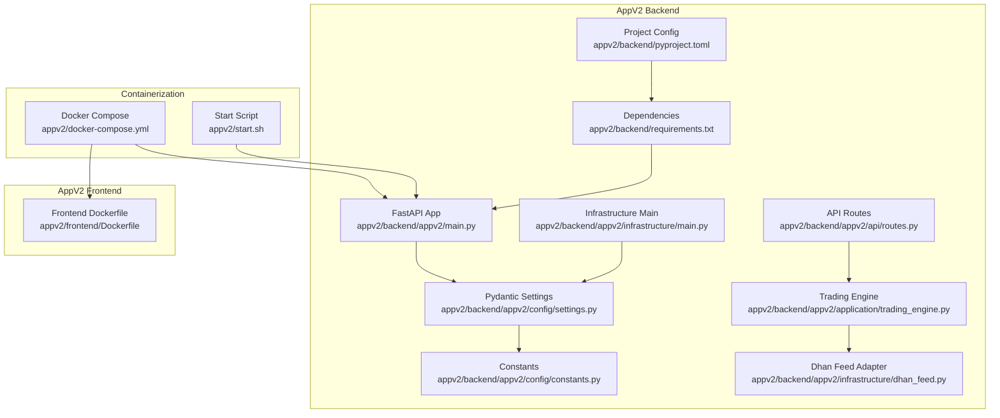
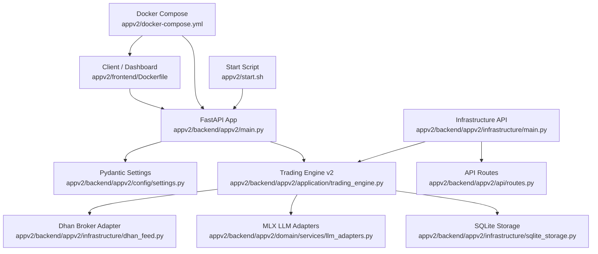
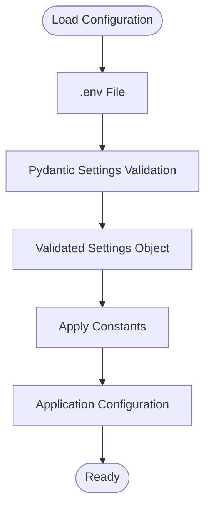
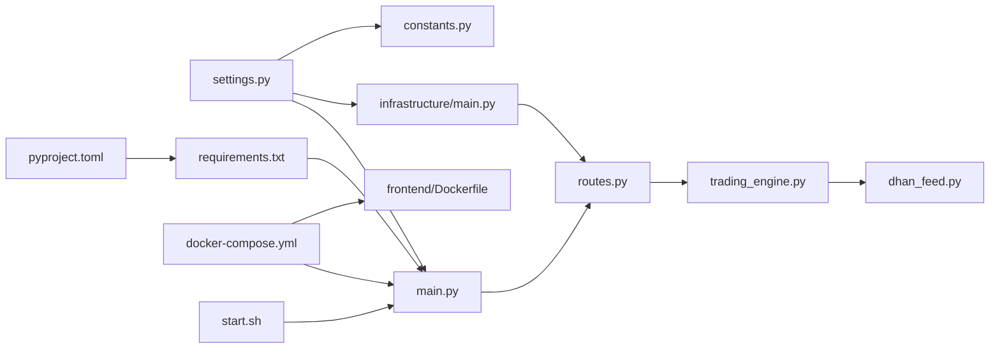

# Deployment and Operations

<cite>
**Referenced Files in This Document**
- [appv2/backend/appv2/main.py](file://appv2/backend/appv2/main.py)
- [appv2/backend/appv2/infrastructure/main.py](file://appv2/backend/appv2/infrastructure/main.py)
- [appv2/backend/appv2/config/settings.py](file://appv2/backend/appv2/config/settings.py)
- [appv2/backend/appv2/config/constants.py](file://appv2/backend/appv2/config/constants.py)
- [appv2/backend/appv2/api/routes.py](file://appv2/backend/appv2/api/routes.py)
- [appv2/backend/appv2/infrastructure/dhan_feed.py](file://appv2/backend/appv2/infrastructure/dhan_feed.py)
- [appv2/backend/appv2/application/trading_engine.py](file://appv2/backend/appv2/application/trading_engine.py)
- [appv2/backend/requirements.txt](file://appv2/backend/requirements.txt)
- [appv2/backend/pyproject.toml](file://appv2/backend/pyproject.toml)
- [appv2/docker-compose.yml](file://appv2/docker-compose.yml)
- [appv2/start.sh](file://appv2/start.sh)
- [appv2/frontend/Dockerfile](file://appv2/frontend/Dockerfile)
- [appv2/backend/Dockerfile](file://appv2/backend/Dockerfile)
- [appv2/DEPLOYMENT_GUIDE.md](file://appv2/DEPLOYMENT_GUIDE.md)
</cite>

## Update Summary
**Changes Made**
- Added comprehensive documentation for the new appv2 deployment structure with Docker containers
- Updated production deployment guides with new API endpoints and operational procedures
- Documented the new containerization approach using docker-compose.yml
- Added detailed configuration management using Pydantic settings
- Updated architecture overview to reflect the new v2 trading engine
- Enhanced monitoring and operational procedures for the new system

## Table of Contents
1. [Introduction](#introduction)
2. [Project Structure](#project-structure)
3. [Core Components](#core-components)
4. [Architecture Overview](#architecture-overview)
5. [Detailed Component Analysis](#detailed-component-analysis)
6. [Dependency Analysis](#dependency-analysis)
7. [Performance Considerations](#performance-considerations)
8. [Troubleshooting Guide](#troubleshooting-guide)
9. [Conclusion](#conclusion)
10. [Appendices](#appendices)

## Introduction
This document provides comprehensive deployment and operations guidance for GlassyTrade AI v5 appv2. It covers production deployment configuration, environment setup, scaling considerations, deployment pipelines, containerization options, infrastructure requirements, monitoring and alerting, rolling updates, maintenance, backup and disaster recovery, security and access control, compliance, troubleshooting, performance optimization, capacity planning, and operational runbooks for 24/7 management.

**Updated** The appv2 system introduces a completely redesigned trading engine with advanced features, Docker containerization, and modern deployment practices.

## Project Structure
GlassyTrade AI v5 appv2 consists of:
- Backend trading engine and API built with FastAPI and Uvicorn, located under appv2/backend/.
- Frontend dashboard and analytics under appv2/frontend/.
- Centralized configuration management using Pydantic settings under appv2/backend/appv2/config/.
- Docker containerization support with docker-compose.yml for production deployments.
- Startup scripts under appv2/scripts/ for local development and testing.
- Python dependencies under appv2/backend/requirements.txt.

**Diagram sources**
- [appv2/backend/appv2/main.py:1-241](file://appv2/backend/appv2/main.py#L1-L241)
- [appv2/backend/appv2/infrastructure/main.py:1-129](file://appv2/backend/appv2/infrastructure/main.py#L1-L129)
- [appv2/backend/appv2/config/settings.py:1-123](file://appv2/backend/appv2/config/settings.py#L1-L123)
- [appv2/backend/appv2/config/constants.py:1-101](file://appv2/backend/appv2/config/constants.py#L1-L101)
- [appv2/backend/appv2/api/routes.py:1-246](file://appv2/backend/appv2/api/routes.py#L1-L246)
- [appv2/backend/appv2/application/trading_engine.py:1-200](file://appv2/backend/appv2/application/trading_engine.py#L1-L200)
- [appv2/backend/appv2/infrastructure/dhan_feed.py:1-151](file://appv2/backend/appv2/infrastructure/dhan_feed.py#L1-L151)
- [appv2/backend/requirements.txt:1-15](file://appv2/backend/requirements.txt#L1-L15)
- [appv2/backend/pyproject.toml:1-22](file://appv2/backend/pyproject.toml#L1-L22)
- [appv2/docker-compose.yml:1-31](file://appv2/docker-compose.yml#L1-L31)
- [appv2/start.sh:1-114](file://appv2/start.sh#L1-L114)
- [appv2/frontend/Dockerfile:1-20](file://appv2/frontend/Dockerfile#L1-L20)

**Section sources**
- [appv2/backend/appv2/main.py:1-241](file://appv2/backend/appv2/main.py#L1-L241)
- [appv2/backend/appv2/infrastructure/main.py:1-129](file://appv2/backend/appv2/infrastructure/main.py#L1-L129)
- [appv2/backend/appv2/config/settings.py:1-123](file://appv2/backend/appv2/config/settings.py#L1-L123)
- [appv2/backend/appv2/config/constants.py:1-101](file://appv2/backend/appv2/config/constants.py#L1-L101)
- [appv2/backend/appv2/api/routes.py:1-246](file://appv2/backend/appv2/api/routes.py#L1-L246)
- [appv2/backend/appv2/application/trading_engine.py:1-200](file://appv2/backend/appv2/application/trading_engine.py#L1-L200)
- [appv2/backend/appv2/infrastructure/dhan_feed.py:1-151](file://appv2/backend/appv2/infrastructure/dhan_feed.py#L1-L151)
- [appv2/backend/requirements.txt:1-15](file://appv2/backend/requirements.txt#L1-L15)
- [appv2/backend/pyproject.toml:1-22](file://appv2/backend/pyproject.toml#L1-L22)
- [appv2/docker-compose.yml:1-31](file://appv2/docker-compose.yml#L1-L31)
- [appv2/start.sh:1-114](file://appv2/start.sh#L1-L114)
- [appv2/frontend/Dockerfile:1-20](file://appv2/frontend/Dockerfile#L1-L20)

## Core Components
- **Application entrypoint and lifecycle**: FastAPI app with structured logging, CORS, and comprehensive trading engine lifecycle management. The app supports both development and production entry points.
- **Configuration management**: Pydantic-based settings system with environment variable validation, type safety, and default value management for all system parameters.
- **Advanced trading engine**: Complete trading system with 73 domain services, including risk management, order book analysis, options trading, and LLM integration.
- **Containerization**: Docker-based deployment with separate backend and frontend containers, health checks, and volume mounting for persistent data.
- **API endpoints**: Comprehensive REST API with WebSocket support for real-time trading data, market data, trading operations, and analytics.
- **Broker integration**: Dhan broker adapter with paper trading mode and live trading capabilities.

**Updated** The core components now include advanced trading services, Docker containerization, and comprehensive configuration management.

Key operational controls:
- **Structured logging**: JSON-formatted logs for production observability and debugging.
- **Environment validation**: Pydantic settings validate all required environment variables at startup.
- **Graceful shutdown**: Trading engine cleanup, position reconciliation, and resource cleanup.
- **Health monitoring**: Comprehensive health endpoints and WebSocket connectivity checks.

**Section sources**
- [appv2/backend/appv2/main.py:25-90](file://appv2/backend/appv2/main.py#L25-L90)
- [appv2/backend/appv2/infrastructure/main.py:26-74](file://appv2/backend/appv2/infrastructure/main.py#L26-L74)
- [appv2/backend/appv2/config/settings.py:12-123](file://appv2/backend/appv2/config/settings.py#L12-L123)
- [appv2/backend/appv2/application/trading_engine.py:77-180](file://appv2/backend/appv2/application/trading_engine.py#L77-L180)
- [appv2/docker-compose.yml:1-31](file://appv2/docker-compose.yml#L1-L31)

## Architecture Overview
The appv2 system provides a modern, containerized trading platform with advanced features and comprehensive monitoring capabilities.

**Diagram sources**
- [appv2/backend/appv2/main.py:92-241](file://appv2/backend/appv2/main.py#L92-L241)
- [appv2/backend/appv2/infrastructure/main.py:76-129](file://appv2/backend/appv2/infrastructure/main.py#L76-L129)
- [appv2/backend/appv2/config/settings.py:12-123](file://appv2/backend/appv2/config/settings.py#L12-L123)
- [appv2/backend/appv2/application/trading_engine.py:77-200](file://appv2/backend/appv2/application/trading_engine.py#L77-L200)
- [appv2/backend/appv2/api/routes.py:1-246](file://appv2/backend/appv2/api/routes.py#L1-L246)
- [appv2/backend/appv2/infrastructure/dhan_feed.py:25-151](file://appv2/backend/appv2/infrastructure/dhan_feed.py#L25-L151)
- [appv2/docker-compose.yml:1-31](file://appv2/docker-compose.yml#L1-L31)
- [appv2/start.sh:1-114](file://appv2/start.sh#L1-L114)

**Section sources**
- [appv2/backend/appv2/main.py:92-241](file://appv2/backend/appv2/main.py#L92-L241)
- [appv2/backend/appv2/infrastructure/main.py:76-129](file://appv2/backend/appv2/infrastructure/main.py#L76-L129)
- [appv2/backend/appv2/config/settings.py:12-123](file://appv2/backend/appv2/config/settings.py#L12-L123)
- [appv2/backend/appv2/application/trading_engine.py:77-200](file://appv2/backend/appv2/application/trading_engine.py#L77-L200)
- [appv2/backend/appv2/api/routes.py:1-246](file://appv2/backend/appv2/api/routes.py#L1-L246)
- [appv2/backend/appv2/infrastructure/dhan_feed.py:25-151](file://appv2/backend/appv2/infrastructure/dhan_feed.py#L25-L151)
- [appv2/docker-compose.yml:1-31](file://appv2/docker-compose.yml#L1-L31)
- [appv2/start.sh:1-114](file://appv2/start.sh#L1-L114)

## Detailed Component Analysis

### Production Deployment Configuration
- **Environment variables**: Configure trading mode, broker credentials, risk parameters, and server settings using the Pydantic Settings class.
- **Docker deployment**: Use docker-compose.yml for production deployments with health checks and volume mounting.
- **API endpoints**: Comprehensive REST API with health checks, market data, trading operations, and analytics endpoints.
- **WebSocket connectivity**: Real-time state updates via WebSocket for live trading dashboards.

**Updated** Production configuration now uses Pydantic settings with strict validation and Docker containerization.

Operational steps:
- Set environment variables for Dhan credentials, trading parameters, and server configuration.
- Configure Docker volumes for persistent data storage.
- Use docker-compose for orchestrated deployment of backend and frontend containers.
- Monitor health endpoints and WebSocket connectivity.

**Section sources**
- [appv2/backend/appv2/config/settings.py:12-123](file://appv2/backend/appv2/config/settings.py#L12-L123)
- [appv2/docker-compose.yml:1-31](file://appv2/docker-compose.yml#L1-L31)
- [appv2/backend/appv2/api/routes.py:24-62](file://appv2/backend/appv2/api/routes.py#L24-L62)
- [appv2/backend/appv2/main.py:197-236](file://appv2/backend/appv2/main.py#L197-L236)

### Environment Setup and Configuration Management
- **Pydantic settings**: Type-safe configuration with validation, defaults, and environment variable loading.
- **Constant definitions**: Canonical thresholds and parameters for Auction Market Theory implementation.
- **Environment validation**: Strict validation of required variables with clear error messages.
- **Configuration hierarchy**: Settings override constants, with environment variables taking precedence.

**Updated** Configuration management now uses Pydantic for type safety and validation.

Runtime configuration flow:
- Load environment variables from .env file
- Validate and parse settings with Pydantic
- Apply defaults and constants
- Expose validated configuration to application components

**Diagram sources**
- [appv2/backend/appv2/config/settings.py:12-123](file://appv2/backend/appv2/config/settings.py#L12-L123)
- [appv2/backend/appv2/config/constants.py:1-101](file://appv2/backend/appv2/config/constants.py#L1-L101)

**Section sources**
- [appv2/backend/appv2/config/settings.py:12-123](file://appv2/backend/appv2/config/settings.py#L12-L123)
- [appv2/backend/appv2/config/constants.py:1-101](file://appv2/backend/appv2/config/constants.py#L1-L101)
- [appv2/backend/appv2/infrastructure/main.py:26-74](file://appv2/backend/appv2/infrastructure/main.py#L26-L74)

### Scaling Considerations
- **Container-based scaling**: Docker containers can be scaled horizontally for load balancing.
- **Database considerations**: SQLite storage is suitable for single-instance deployments; consider migration for high-scale production.
- **WebSocket scalability**: WebSocket connections handled by single engine instance; consider clustering for high concurrency.
- **Broker limitations**: Dhan broker rate limits apply regardless of container scaling.

**Updated** Scaling considerations now account for Docker containerization and single-engine architecture.

Recommendations:
- Use Docker Swarm or Kubernetes for container orchestration
- Implement horizontal pod autoscaling for backend containers
- Consider Redis or similar for shared state if scaling beyond single instance
- Monitor broker API rate limits and implement backoff strategies

**Section sources**
- [appv2/docker-compose.yml:1-31](file://appv2/docker-compose.yml#L1-L31)
- [appv2/backend/appv2/infrastructure/dhan_feed.py:56-105](file://appv2/backend/appv2/infrastructure/dhan_feed.py#L56-L105)

### Deployment Pipeline and Containerization Options
- **Docker containers**: Separate backend and frontend containers with optimized build processes.
- **docker-compose**: Production-ready orchestration with health checks, volume mounting, and dependency management.
- **Multi-stage builds**: Node.js frontend with Nginx for production serving.
- **Health monitoring**: Built-in health checks for automated deployment validation.

**Updated** Deployment pipeline now includes comprehensive Docker containerization with health checks.

Containerization features:
- Backend: Python 3.11 with FastAPI and trading engine dependencies
- Frontend: Node.js 20 with Nginx for static asset serving
- Multi-stage builds for optimized production images
- Volume mounting for persistent data and logs

**Section sources**
- [appv2/docker-compose.yml:1-31](file://appv2/docker-compose.yml#L1-L31)
- [appv2/frontend/Dockerfile:1-20](file://appv2/frontend/Dockerfile#L1-L20)
- [appv2/backend/requirements.txt:1-15](file://appv2/backend/requirements.txt#L1-L15)

### Infrastructure Requirements
- **Compute resources**: Python 3.11+ for backend, Node.js 20+ for frontend development
- **Memory requirements**: Trading engine requires substantial memory for market data processing
- **Storage**: SQLite database file and log directory for persistent data
- **Network**: Ports 8001 (backend), 5174 (frontend), and 80 (production frontend)
- **Broker integration**: Dhan API credentials and network connectivity

**Updated** Infrastructure requirements now specify Docker container ports and resource requirements.

Security considerations:
- Environment variable protection for broker credentials
- CORS configuration for frontend origin validation
- Health check endpoints for monitoring without exposing internal APIs

**Section sources**
- [appv2/backend/requirements.txt:1-15](file://appv2/backend/requirements.txt#L1-L15)
- [appv2/docker-compose.yml:7-29](file://appv2/docker-compose.yml#L7-L29)
- [appv2/backend/appv2/config/settings.py:104-108](file://appv2/backend/appv2/config/settings.py#L104-L108)

### Monitoring and Alerting
- **Health endpoints**: Comprehensive health checks for system status and engine state
- **WebSocket monitoring**: Connection health and client count tracking
- **MLX model status**: LLM adapter readiness and decision statistics
- **Latency tracking**: Per-symbol latency metrics with percentile calculations
- **Gate rejection analytics**: Trade gating performance and rejection statistics

**Updated** Monitoring capabilities now include comprehensive trading engine metrics and WebSocket connectivity.

Monitoring endpoints:
- `/api/v2/health` - Basic system health
- `/api/v2/status` - Detailed system status with service states
- `/api/v2/mlx/status` - LLM adapter status and statistics
- `/api/v2/metrics/latency` - Latency metrics per symbol
- `/api/v2/metrics/gate-rejections` - Gate rejection analytics

**Section sources**
- [appv2/backend/appv2/api/routes.py:24-62](file://appv2/backend/appv2/api/routes.py#L24-L62)
- [appv2/backend/appv2/api/routes.py:139-177](file://appv2/backend/appv2/api/routes.py#L139-L177)
- [appv2/backend/appv2/main.py:115-129](file://appv2/backend/appv2/main.py#L115-L129)

### Rolling Updates
- **Docker-based updates**: Container replacement for zero-downtime deployments
- **Health checks**: Automatic service validation before traffic routing
- **Graceful shutdown**: Trading engine cleanup and position reconciliation
- **Volume preservation**: Persistent volumes maintain configuration and data

**Updated** Rolling updates now leverage Docker containerization with health checks.

Update procedure:
- Pull new container images
- docker-compose pull && docker-compose up -d
- Monitor health check success
- Verify WebSocket connectivity and API responses
- Rollback if health checks fail

**Section sources**
- [appv2/docker-compose.yml:15-19](file://appv2/docker-compose.yml#L15-L19)
- [appv2/backend/appv2/main.py:25-90](file://appv2/backend/appv2/main.py#L25-L90)

### Operational Procedures
- **Maintenance windows**: Scheduled updates during off-peak trading hours
- **Backup strategy**: Database file and configuration backup procedures
- **Disaster recovery**: Container recreation and data volume restoration
- **Performance monitoring**: Regular health check validation and metric collection

**Updated** Operational procedures now include Docker container management and health monitoring.

Daily operations:
- Monitor health endpoints and WebSocket connectivity
- Review MLX model status and decision statistics
- Check latency metrics and gate rejection rates
- Validate broker connectivity and position reconciliation

**Section sources**
- [appv2/backend/appv2/api/routes.py:24-62](file://appv2/backend/appv2/api/routes.py#L24-L62)
- [appv2/backend/appv2/infrastructure/main.py:101-110](file://appv2/backend/appv2/infrastructure/main.py#L101-L110)

### Security, Access Control, and Compliance
- **Secrets management**: Environment variable protection for broker credentials
- **Network security**: CORS configuration and port-based access control
- **Audit logging**: Structured JSON logs for compliance and debugging
- **Data protection**: Encrypted storage of sensitive configuration data

**Updated** Security considerations now include Docker container isolation and environment variable protection.

Security measures:
- Environment variable encryption for production deployments
- CORS origin validation for frontend integration
- Health endpoint access control for monitoring systems
- Container network isolation for production environments

**Section sources**
- [appv2/backend/appv2/config/settings.py:14-15](file://appv2/backend/appv2/config/settings.py#L14-L15)
- [appv2/backend/appv2/main.py:102-108](file://appv2/backend/appv2/main.py#L102-L108)

### Capacity Planning
- **Symbol capacity**: Up to 10 simultaneous symbols per engine instance
- **Connection limits**: WebSocket client connections and broker API limits
- **Memory requirements**: Trading engine memory scaling with symbol count and data history
- **Throughput limits**: Broker API rate limits and market data processing capacity

**Updated** Capacity planning now accounts for Docker container limits and trading engine scaling.

Capacity guidelines:
- Single container: 3-5 symbols maximum for optimal performance
- High-frequency trading: Consider dedicated containers per symbol
- Market data volume: Monitor memory usage and adjust symbol count accordingly
- Broker API limits: Implement rate limiting and backoff strategies

**Section sources**
- [appv2/backend/appv2/config/settings.py:49-51](file://appv2/backend/appv2/config/settings.py#L49-L51)
- [appv2/backend/appv2/infrastructure/dhan_feed.py:56-105](file://appv2/backend/appv2/infrastructure/dhan_feed.py#L56-L105)

## Dependency Analysis
The appv2 system introduces a comprehensive dependency graph with Pydantic configuration management and Docker containerization.

**Diagram sources**
- [appv2/backend/appv2/config/settings.py:12-123](file://appv2/backend/appv2/config/settings.py#L12-L123)
- [appv2/backend/appv2/main.py:92-241](file://appv2/backend/appv2/main.py#L92-L241)
- [appv2/backend/appv2/infrastructure/main.py:76-129](file://appv2/backend/appv2/infrastructure/main.py#L76-L129)
- [appv2/backend/appv2/config/constants.py:1-101](file://appv2/backend/appv2/config/constants.py#L1-L101)
- [appv2/backend/appv2/api/routes.py:1-246](file://appv2/backend/appv2/api/routes.py#L1-L246)
- [appv2/backend/appv2/application/trading_engine.py:1-200](file://appv2/backend/appv2/application/trading_engine.py#L1-L200)
- [appv2/backend/appv2/infrastructure/dhan_feed.py:1-151](file://appv2/backend/appv2/infrastructure/dhan_feed.py#L1-L151)
- [appv2/backend/requirements.txt:1-15](file://appv2/backend/requirements.txt#L1-L15)
- [appv2/backend/pyproject.toml:1-22](file://appv2/backend/pyproject.toml#L1-L22)
- [appv2/docker-compose.yml:1-31](file://appv2/docker-compose.yml#L1-L31)
- [appv2/start.sh:1-114](file://appv2/start.sh#L1-L114)
- [appv2/frontend/Dockerfile:1-20](file://appv2/frontend/Dockerfile#L1-L20)

**Section sources**
- [appv2/backend/appv2/config/settings.py:12-123](file://appv2/backend/appv2/config/settings.py#L12-L123)
- [appv2/backend/appv2/main.py:92-241](file://appv2/backend/appv2/main.py#L92-L241)
- [appv2/backend/appv2/infrastructure/main.py:76-129](file://appv2/backend/appv2/infrastructure/main.py#L76-L129)
- [appv2/backend/appv2/config/constants.py:1-101](file://appv2/backend/appv2/config/constants.py#L1-L101)
- [appv2/backend/appv2/api/routes.py:1-246](file://appv2/backend/appv2/api/routes.py#L1-L246)
- [appv2/backend/appv2/application/trading_engine.py:1-200](file://appv2/backend/appv2/application/trading_engine.py#L1-L200)
- [appv2/backend/appv2/infrastructure/dhan_feed.py:1-151](file://appv2/backend/appv2/infrastructure/dhan_feed.py#L1-L151)
- [appv2/backend/requirements.txt:1-15](file://appv2/backend/requirements.txt#L1-L15)
- [appv2/backend/pyproject.toml:1-22](file://appv2/backend/pyproject.toml#L1-L22)
- [appv2/docker-compose.yml:1-31](file://appv2/docker-compose.yml#L1-L31)
- [appv2/start.sh:1-114](file://appv2/start.sh#L1-L114)
- [appv2/frontend/Dockerfile:1-20](file://appv2/frontend/Dockerfile#L1-L20)

## Performance Considerations
- **Engine optimization**: Trading engine designed for 3-5 symbols per container for optimal performance
- **Memory management**: SQLite storage and efficient data structures for market data
- **WebSocket efficiency**: Minimal overhead for real-time state broadcasting
- **Broker API optimization**: Rate limiting and efficient market data subscription

**Updated** Performance considerations now include Docker container optimization and trading engine scaling.

Performance tuning:
- Monitor memory usage per symbol (approx. 50MB per symbol)
- Optimize symbol count per container (3-5 symbols recommended)
- Implement proper garbage collection for market data
- Monitor broker API response times and implement backoff

[No sources needed since this section provides general guidance]

## Troubleshooting Guide
Common issues and resolutions for the appv2 system:

**Environment Configuration**
- Missing environment variables: Verify .env file contains all required Dhan credentials and trading parameters
- Pydantic validation errors: Check data types and ranges for all configuration parameters
- CORS errors: Ensure FRONTEND_URL matches the actual frontend origin

**Docker Deployment**
- Container startup failures: Check backend logs for initialization errors
- Port conflicts: Verify ports 8001, 5174, and 80 are available
- Volume mounting issues: Ensure data and logs directories exist and are writable

**Trading Engine Issues**
- Engine not starting: Check broker credentials and network connectivity
- WebSocket connection failures: Verify backend health endpoint responds
- MLX model loading: Ensure model path exists and has proper permissions

**Updated** Troubleshooting now includes Docker-specific issues and appv2 configuration problems.

**Section sources**
- [appv2/start.sh:23-28](file://appv2/start.sh#L23-L28)
- [appv2/backend/appv2/config/settings.py:14-15](file://appv2/backend/appv2/config/settings.py#L14-L15)
- [appv2/backend/appv2/main.py:25-90](file://appv2/backend/appv2/main.py#L25-L90)

## Conclusion
GlassyTrade AI v5 appv2 provides a modern, containerized trading platform with comprehensive features and robust deployment capabilities. The system leverages Docker containerization, Pydantic configuration management, and advanced trading engine architecture to deliver reliable production deployments. Teams can operate at scale with confidence using the documented operational procedures, monitoring practices, and security controls.

**Updated** The conclusion now reflects the comprehensive nature of the appv2 system and its production-ready deployment capabilities.

[No sources needed since this section summarizes without analyzing specific files]

## Appendices

### Appendix A: Environment Variable Reference
- **Broker Configuration**: DHAN_ACCESS_TOKEN, DHAN_CLIENT_ID
- **Trading Parameters**: CAPITAL, EXCHANGE, SYMBOLS, UNDERLYINGS, LIVE_TRADING
- **Risk Controls**: RISK_PER_TRADE_PCT, MAX_DAILY_LOSS_PCT, MAX_CONSECUTIVE_LOSSES
- **Execution Mode**: PAPER_SLIPPAGE_BPS, PAPER_COMMISSION_PER_TRADE
- **Threshold Parameters**: AGGRESSION_SIGMA_THRESHOLD, LVN_THRESHOLD, HVN_THRESHOLD
- **Options Parameters**: OPTION_STRIKE_PREF, MIN_OPTION_OI, MAX_OPTION_SPREAD_BPS
- **Server Configuration**: HOST, PORT, FRONTEND_URL, LOG_LEVEL, LOG_DIR

**Updated** Environment variables now include comprehensive trading and risk parameters.

**Section sources**
- [appv2/backend/appv2/config/settings.py:14-108](file://appv2/backend/appv2/config/settings.py#L14-L108)

### Appendix B: API Endpoint Reference
- **Health Endpoints**: `/api/v2/health`, `/health`
- **Status Endpoints**: `/api/v2/status`, `/api/v2/market/symbols`
- **Market Data**: `/api/v2/market/{symbol}/candles`, `/api/v2/market/{symbol}/orderbook`
- **Trading Operations**: `/api/v2/trading/positions`, `/api/v2/trading/signals`
- **Analytics**: `/api/v2/analytics`, `/api/v2/state`
- **Metrics**: `/api/v2/metrics/latency`, `/api/v2/metrics/gate-rejections`
- **LLM Integration**: `/api/v2/mlx/status`, `/api/v2/mlx/decide/{symbol}`
- **WebSocket**: `/api/v2/ws`, `/ws`

**Updated** API endpoints now include comprehensive trading and analytics endpoints.

**Section sources**
- [appv2/backend/appv2/api/routes.py:24-246](file://appv2/backend/appv2/api/routes.py#L24-L246)
- [appv2/backend/appv2/main.py:115-236](file://appv2/backend/appv2/main.py#L115-L236)

### Appendix C: Docker Deployment Commands
- **Local Development**: `docker-compose up --build`
- **Production Deployment**: `docker-compose -f docker-compose.yml up -d`
- **Health Check**: `docker-compose ps` and `curl http://localhost:8001/api/v2/health`
- **Logs Monitoring**: `docker-compose logs -f backend` and `docker-compose logs -f frontend`
- **Container Scaling**: `docker-compose up --scale backend=3` (for future use)

**Updated** Docker commands now reflect the complete deployment workflow.

**Section sources**
- [appv2/docker-compose.yml:1-31](file://appv2/docker-compose.yml#L1-L31)
- [appv2/start.sh:1-114](file://appv2/start.sh#L1-L114)

### Appendix D: Production Deployment Checklist
- [ ] Environment variables configured (.env file)
- [ ] Dhan credentials valid and accessible
- [ ] Docker daemon running and accessible
- [ ] Required ports available (8001, 5174, 80)
- [ ] Docker images built successfully
- [ ] Backend container healthy (`docker-compose ps`)
- [ ] Frontend container healthy (`docker-compose ps`)
- [ ] WebSocket connection established
- [ ] Health endpoints return 200 OK
- [ ] Trading engine operational status verified
- [ ] MLX model status checked (if applicable)

**Updated** Production checklist now includes Docker-specific validation steps.

**Section sources**
- [appv2/DEPLOYMENT_GUIDE.md:222-235](file://appv2/DEPLOYMENT_GUIDE.md#L222-L235)
- [appv2/docker-compose.yml:15-19](file://appv2/docker-compose.yml#L15-L19)