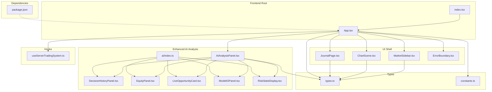
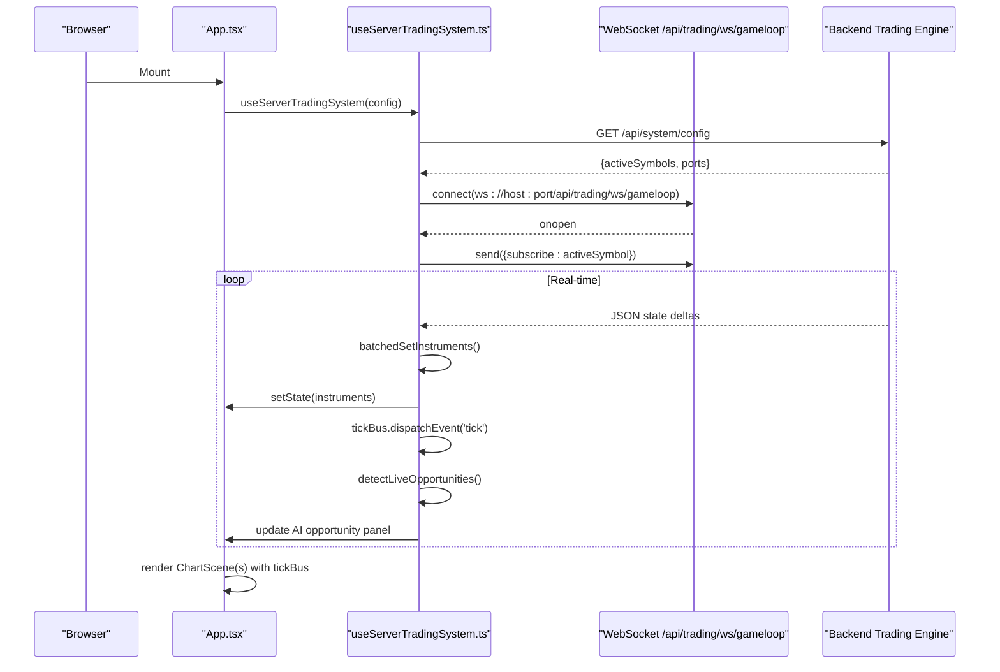
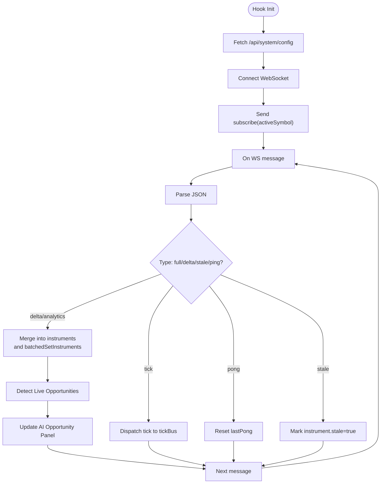
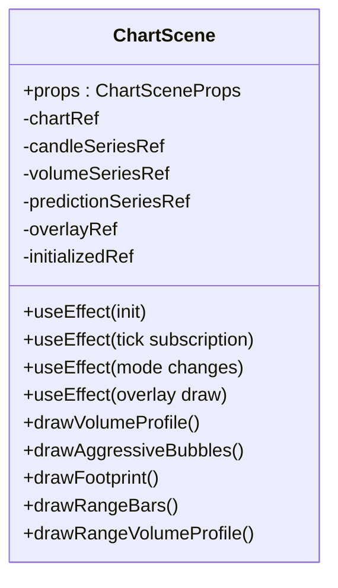
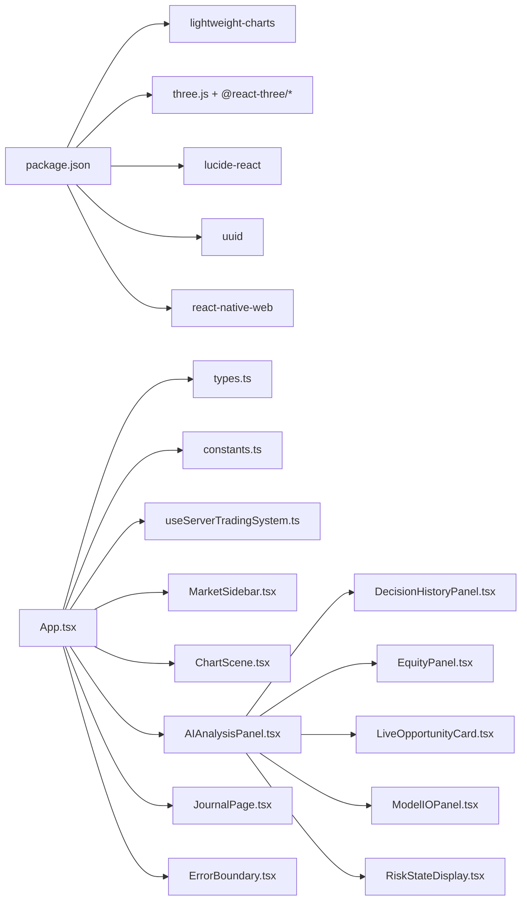

# Frontend Application

<cite>
**Referenced Files in This Document**
- [package.json](file://frontend/package.json)
- [App.tsx](file://frontend/App.tsx)
- [index.tsx](file://frontend/index.tsx)
- [constants.ts](file://frontend/constants.ts)
- [types.ts](file://frontend/types.ts)
- [useServerTradingSystem.ts](file://frontend/hooks/useServerTradingSystem.ts)
- [ChartScene.tsx](file://frontend/components/ChartScene.tsx)
- [AIAnalysisPanel.tsx](file://frontend/components/AIAnalysisPanel.tsx)
- [MarketSidebar.tsx](file://frontend/components/MarketSidebar.tsx)
- [JournalPage.tsx](file://frontend/components/JournalPage.tsx)
- [ErrorBoundary.tsx](file://frontend/components/ErrorBoundary.tsx)
- [DecisionHistoryPanel.tsx](file://frontend/components/ai/DecisionHistoryPanel.tsx)
- [EquityPanel.tsx](file://frontend/components/ai/EquityPanel.tsx)
- [LiveOpportunityCard.tsx](file://frontend/components/ai/LiveOpportunityCard.tsx)
- [ModelIOPanel.tsx](file://frontend/components/ai/ModelIOPanel.tsx)
- [RiskStateDisplay.tsx](file://frontend/components/ai/RiskStateDisplay.tsx)
- [ai/index.ts](file://frontend/components/ai/index.ts)
</cite>

## Update Summary
**Changes Made**
- Enhanced AI Analysis Panel with 262 additional lines of new functionality
- Added new AI sub-components: DecisionHistoryPanel, EquityPanel, LiveOpportunityCard, ModelIOPanel, RiskStateDisplay
- Improved trade journal visualization with enhanced filtering and statistics
- Expanded chart components with new volume profile modes and range bar support
- Added comprehensive AI agent panel with decision history tracking

## Table of Contents
1. [Introduction](#introduction)
2. [Project Structure](#project-structure)
3. [Core Components](#core-components)
4. [Architecture Overview](#architecture-overview)
5. [Detailed Component Analysis](#detailed-component-analysis)
6. [Enhanced AI Analysis System](#enhanced-ai-analysis-system)
7. [Improved Trade Journal Interface](#improved-trade-journal-interface)
8. [Advanced Chart Rendering](#advanced-chart-rendering)
9. [Dependency Analysis](#dependency-analysis)
10. [Performance Considerations](#performance-considerations)
11. [Troubleshooting Guide](#troubleshooting-guide)
12. [Conclusion](#conclusion)
13. [Appendices](#appendices)

## Introduction
This document describes the GlassyTrade AI React frontend application. It focuses on the component architecture, real-time data visualization, WebSocket integration patterns, chart rendering system using Lightweight Charts, enhanced AI analysis panels, and the improved trade journal interface. The application now features a comprehensive AI analysis ecosystem with decision history tracking, equity management, and live opportunity detection, alongside advanced chart visualization capabilities and sophisticated trade journal analytics.

## Project Structure
The frontend is a React application bootstrapped with Vite and TypeScript. It uses Tailwind CSS for styling and exposes a single-page trading dashboard with:
- A central chart area supporting multiple modes (standard candles, footprint, range bars)
- A left sidebar for scanning instruments and viewing recent trades
- A right sidebar for AI analysis and controls with enhanced AI agent panels
- An improved trade journal page with comprehensive analytics and filtering
- A global error boundary for graceful failure handling
- Advanced AI sub-components for decision tracking and risk management

**Diagram sources**
- [index.tsx:1-16](file://frontend/index.tsx#L1-L16)
- [App.tsx:1-392](file://frontend/App.tsx#L1-L392)
- [MarketSidebar.tsx:1-388](file://frontend/components/MarketSidebar.tsx#L1-L388)
- [ChartScene.tsx:1-1502](file://frontend/components/ChartScene.tsx#L1-L1502)
- [AIAnalysisPanel.tsx:1-1183](file://frontend/components/AIAnalysisPanel.tsx#L1-L1183)
- [JournalPage.tsx:1-378](file://frontend/components/JournalPage.tsx#L1-L378)
- [ErrorBoundary.tsx:1-60](file://frontend/components/ErrorBoundary.tsx#L1-L60)
- [DecisionHistoryPanel.tsx:1-94](file://frontend/components/ai/DecisionHistoryPanel.tsx#L1-L94)
- [EquityPanel.tsx:1-78](file://frontend/components/ai/EquityPanel.tsx#L1-L78)
- [LiveOpportunityCard.tsx:1-94](file://frontend/components/ai/LiveOpportunityCard.tsx#L1-L94)
- [ModelIOPanel.tsx:1-36](file://frontend/components/ai/ModelIOPanel.tsx#L1-L36)
- [RiskStateDisplay.tsx:1-37](file://frontend/components/ai/RiskStateDisplay.tsx#L1-L37)
- [ai/index.ts:1-6](file://frontend/components/ai/index.ts#L1-L6)
- [useServerTradingSystem.ts:1-655](file://frontend/hooks/useServerTradingSystem.ts#L1-L655)
- [types.ts:1-396](file://frontend/types.ts#L1-L396)
- [constants.ts:1-28](file://frontend/constants.ts#L1-L28)
- [package.json:1-39](file://frontend/package.json#L1-L39)

**Section sources**
- [index.tsx:1-16](file://frontend/index.tsx#L1-L16)
- [App.tsx:16-392](file://frontend/App.tsx#L16-L392)
- [package.json:13-24](file://frontend/package.json#L13-L24)

## Core Components
- App shell orchestrates UI state, chart modes, sidebar toggles, navigation to the journal, and the new AI opportunity detection system
- MarketSidebar displays instrument scan results, filters, sorting, and recent closed trades for the active symbol
- ChartScene renders real-time charts using Lightweight Charts, overlays volume profiles and AMT markers, and handles dynamic mode switching with enhanced range bar support
- AIAnalysisPanel presents GenAI and AMT insights with new sub-components for decision history, equity management, and risk state display
- JournalPage fetches and displays trade journal summaries, completed trades, and event logs with enhanced filtering and statistics
- ErrorBoundary wraps critical components to gracefully handle render errors
- LiveOpportunityCard displays actionable trading opportunities with estimated SL/TP levels
- DecisionHistoryPanel tracks AI decision history with error state detection
- EquityPanel manages portfolio equity and session performance metrics
- ModelIOPanel displays raw AI model inputs and outputs for debugging
- RiskStateDisplay monitors trading halts and consecutive loss counters

Key runtime data flows:
- useServerTradingSystem manages WebSocket connectivity, parses backend messages, batches state updates, and exposes a tick bus for real-time updates
- App composes multiple ChartScene instances for STANDARD, FOOTPRINT, and RANGE modes, sharing a single tick bus for native chart updates while maintaining separate state for analytics overlays
- Enhanced AI analysis system provides comprehensive decision tracking and risk monitoring

**Section sources**
- [App.tsx:16-392](file://frontend/App.tsx#L16-L392)
- [MarketSidebar.tsx:168-388](file://frontend/components/MarketSidebar.tsx#L168-L388)
- [ChartScene.tsx:51-1502](file://frontend/components/ChartScene.tsx#L51-L1502)
- [AIAnalysisPanel.tsx:20-1183](file://frontend/components/AIAnalysisPanel.tsx#L20-L1183)
- [JournalPage.tsx:115-378](file://frontend/components/JournalPage.tsx#L115-L378)
- [ErrorBoundary.tsx:13-60](file://frontend/components/ErrorBoundary.tsx#L13-L60)
- [LiveOpportunityCard.tsx:13-94](file://frontend/components/ai/LiveOpportunityCard.tsx#L13-L94)
- [DecisionHistoryPanel.tsx:11-94](file://frontend/components/ai/DecisionHistoryPanel.tsx#L11-L94)
- [EquityPanel.tsx:10-78](file://frontend/components/ai/EquityPanel.tsx#L10-L78)
- [ModelIOPanel.tsx:10-36](file://frontend/components/ai/ModelIOPanel.tsx#L10-L36)
- [RiskStateDisplay.tsx:10-37](file://frontend/components/ai/RiskStateDisplay.tsx#L10-L37)
- [useServerTradingSystem.ts:59-655](file://frontend/hooks/useServerTradingSystem.ts#L59-L655)

## Architecture Overview
The frontend is a pure renderer driven by a server-side trading system. The App component holds UI state and delegates data acquisition and processing to a custom hook that manages:
- Backend configuration retrieval
- WebSocket connection to the trading engine
- Real-time tick streaming via an EventTarget-based tick bus
- Batched React state updates to minimize render churn
- Heartbeat and reconnection logic
- Enhanced AI opportunity detection and decision tracking

**Diagram sources**
- [App.tsx:63-72](file://frontend/App.tsx#L63-L72)
- [useServerTradingSystem.ts:111-152](file://frontend/hooks/useServerTradingSystem.ts#L111-L152)
- [useServerTradingSystem.ts:509-570](file://frontend/hooks/useServerTradingSystem.ts#L509-L570)
- [useServerTradingSystem.ts:204-498](file://frontend/hooks/useServerTradingSystem.ts#L204-L498)
- [useServerTradingSystem.ts:296-324](file://frontend/hooks/useServerTradingSystem.ts#L296-L324)

## Detailed Component Analysis

### App Shell and State Orchestration
Responsibilities:
- Manage UI state: chart mode, sidebar visibility, right sidebar visibility, page routing, draggable "overseer" panel
- Compose multiple ChartScene instances for concurrent rendering of STANDARD, FOOTPRINT, and RANGE modes
- Derive best live opportunity across instruments and surface it in a floating LiveOpportunityCard
- Integrate MarketSidebar, AIAnalysisPanel, and JournalPage with error boundaries
- Coordinate AI opportunity detection and display

Notable patterns:
- Stable callbacks for symbol selection to avoid unnecessary re-renders of MarketSidebar
- Effective config merges active instrument symbol into the global config for chart rendering
- Conditional rendering when active instrument is not yet available
- Live opportunity detection with automatic symbol switching

**Section sources**
- [App.tsx:16-392](file://frontend/App.tsx#L16-L392)

### useServerTradingSystem Hook: WebSocket and Data Bus
Responsibilities:
- Fetch backend system config and initialize instrument states
- Maintain a tick EventTarget for high-frequency updates without triggering React renders
- Batch state updates per animation frame to reduce render pressure during multi-symbol scans
- Manage WebSocket lifecycle: connect, subscribe, heartbeat, reconnect, and cleanup
- Merge backend deltas into instrument state, handling analytics-only updates efficiently
- Detect live trading opportunities across multiple instruments

Key mechanisms:
- batchedSetInstruments queues updates and flushes once per RAF
- Heartbeat detects dead connections and triggers reconnect
- Deduplicates and sanitizes LLM history entries
- Handles stale data notifications and purges stale symbols on server mode changes
- Live opportunity detection with probability threshold filtering

**Diagram sources**
- [useServerTradingSystem.ts:111-152](file://frontend/hooks/useServerTradingSystem.ts#L111-L152)
- [useServerTradingSystem.ts:509-570](file://frontend/hooks/useServerTradingSystem.ts#L509-L570)
- [useServerTradingSystem.ts:204-498](file://frontend/hooks/useServerTradingSystem.ts#L204-L498)

**Section sources**
- [useServerTradingSystem.ts:59-655](file://frontend/hooks/useServerTradingSystem.ts#L59-L655)

### ChartScene: Lightweight Charts and Advanced Canvas Overlays
Responsibilities:
- Initialize Lightweight Charts with candlesticks, histograms, and optional prediction overlays
- Render historical data safely by ensuring ascending time ordering and IST offset handling
- Subscribe to the tick EventTarget to update the most recent candle and volume without reinitializing series
- Dynamically switch chart modes (STANDARD, FOOTPRINT, RANGE) and adjust scales and margins accordingly
- Draw advanced overlays on a canvas:
  - Volume Profiles (session and leg) with glassy gradients and zone indicators
  - Aggressive Print bubbles sized by volume
  - Footprint visualization with spine, bid/ask cells, and summary lines
  - Range bars with session/leg profiles and enhanced volume visualization
  - Range volume profiles with combined session/leg display modes

Optimization techniques:
- Memoize AMT analysis to avoid overlay redraws when only tick data changes
- Memoize OHLC data reference to prevent overlay refresh on intra-candle updates
- Defer overlay drawing until visible range changes and on mode switches
- Use ResizeObserver to adapt chart size and overlay canvas dimensions
- Enhanced range bar rendering with proper time scaling and volume profile integration

**Diagram sources**
- [ChartScene.tsx:51-1502](file://frontend/components/ChartScene.tsx#L51-L1502)

**Section sources**
- [ChartScene.tsx:116-374](file://frontend/components/ChartScene.tsx#L116-L374)
- [ChartScene.tsx:375-425](file://frontend/components/ChartScene.tsx#L375-L425)
- [ChartScene.tsx:428-683](file://frontend/components/ChartScene.tsx#L428-L683)
- [ChartScene.tsx:685-800](file://frontend/components/ChartScene.tsx#L685-L800)
- [ChartScene.tsx:653-682](file://frontend/components/ChartScene.tsx#L653-L682)

### AIAnalysisPanel: Comprehensive Intelligence Display
Responsibilities:
- Present GenAI and AMT insights in a modular layout with enhanced AI sub-components
- Display equity and leverage header with session performance metrics
- Show risk state warnings and consecutive loss counters
- Present session/leg state and displacement indicators with visual progress bars
- Display location visualization (VAH/VAL/POC vs LTP) with interactive markers
- Show aggression metrics (delta score, OFI, CVD slope) with divergence detection
- Present market structure and IB/break detection with confidence indicators
- Display LVN velocity play signals with rejection and delta flip indicators
- Show VWAP context and deviation meter with sigma calculations
- Present probability engine output (direction, probability, timing, size)
- Display overseer actions and reasons with priority indicators
- Integrate DecisionHistoryPanel for comprehensive decision tracking
- Provide ModelIOPanel for debugging raw AI model inputs and outputs
- Include RiskStateDisplay for trading halt monitoring

Design highlights:
- Sticky header for persistent controls and progress bars
- Color-coded status indicators and confidence meters
- Responsive layout with collapsible sections
- Enhanced decision history with error state detection
- Comprehensive equity management with partial profit tracking
- Live opportunity detection and display

**Section sources**
- [AIAnalysisPanel.tsx:20-1183](file://frontend/components/AIAnalysisPanel.tsx#L20-L1183)

### MarketSidebar: Instrument Scanner and Recent Trades
Responsibilities:
- Filter, sort, and display instruments by mode, action, and probability
- Provide quick symbol selection to switch the active instrument
- Show recent closed trades for the active symbol with entry/exit details

Patterns:
- Memoized symbol cards to avoid re-rendering the entire list on minor changes
- Sorting by action or probability with secondary criteria
- Dead market filtering and symbol shortening for readability

**Section sources**
- [MarketSidebar.tsx:168-388](file://frontend/components/MarketSidebar.tsx#L168-L388)

### JournalPage: Enhanced Trade Journal Interface
Responsibilities:
- Fetch and display comprehensive trade journal summaries with enhanced statistics
- Show daily summary statistics including signals, entries, rejections, exi
ts, wins, losses, win rate, and total PnL
- Display completed trades with entry/exit details, durations, and MFE/MAE metrics
- Present all journal events with filtering and hiding flat signals
- Provide date navigation and tabbed views for trades and events
- Enhanced filtering options for different event types and signal visibility
- Improved table layouts with better color coding and formatting

API interactions:
- Calls backend endpoints for trades, events, and summary by date
- Supports comprehensive filtering and date-based navigation

**Section sources**
- [JournalPage.tsx:115-378](file://frontend/components/JournalPage.tsx#L115-L378)

### ErrorBoundary: Robust Failure Handling
Responsibilities:
- Catch render errors in child components
- Display a friendly retry UI with a limited retry count
- Log error details for diagnostics

**Section sources**
- [ErrorBoundary.tsx:13-60](file://frontend/components/ErrorBoundary.tsx#L13-L60)

## Enhanced AI Analysis System

### DecisionHistoryPanel: Comprehensive Decision Tracking
The DecisionHistoryPanel provides an expandable list of past LLM entry/exit decisions with detailed prompt and output information. Key features include:
- Error state detection for consecutive API failures with visual warnings
- Timeline-based display with color-coded entries for different directions
- Export functionality for CSV decision history
- Timestamp tracking and rationale sanitization
- Support for overseer actions and quant-only decisions

**Section sources**
- [DecisionHistoryPanel.tsx:11-94](file://frontend/components/ai/DecisionHistoryPanel.tsx#L11-L94)

### EquityPanel: Portfolio Performance Management
The EquityPanel displays comprehensive equity and performance metrics:
- Symbol equity with Indian Rupee formatting
- Open PnL tracking with positive/negative coloring
- Session P&L breakdown with target/circuit progress bars
- Daily target and circuit breaker visualization
- Closed trade count and partial profit tracking
- Real-time progress bar with color-coded thresholds

**Section sources**
- [EquityPanel.tsx:10-78](file://frontend/components/ai/EquityPanel.tsx#L10-L78)

### LiveOpportunityCard: Actionable Trading Opportunities
The LiveOpportunityCard displays real-time trading opportunities with:
- Automatic detection of ENTER_NOW signals from AI agents
- Estimated stop-loss and take-profit levels based on LTP
- Probability display with color-coded confidence indicators
- Direct symbol switching capability
- Visual styling with gradient borders and blur effects
- Close button for manual dismissal

**Section sources**
- [LiveOpportunityCard.tsx:13-94](file://frontend/components/ai/LiveOpportunityCard.tsx#L13-L94)

### ModelIOPanel: AI Debugging Interface
The ModelIOPanel shows raw AI model inputs and outputs for debugging purposes:
- Prompt input display with model input formatting
- Raw output display with sanitization
- Scrollable content area with monospace font
- Separate sections for input and output with color coding

**Section sources**
- [ModelIOPanel.tsx:10-36](file://frontend/components/ai/ModelIOPanel.tsx#L10-L36)

### RiskStateDisplay: Trading Safety Monitoring
The RiskStateDisplay monitors trading safety conditions:
- Trading halt warnings with halt reason display
- Consecutive loss counter with color-coded thresholds
- Daily PnL tracking with positive/negative coloring
- Drift alerts and messages for system monitoring

**Section sources**
- [RiskStateDisplay.tsx:10-37](file://frontend/components/ai/RiskStateDisplay.tsx#L10-L37)

## Improved Trade Journal Interface

### Enhanced Filtering and Statistics
The JournalPage now provides comprehensive trade analytics:
- Enhanced summary cards with signals, entries, rejections, exits, wins, losses, win rate, and total PnL
- Tabbed interface for trades and events with separate filtering
- Event type filtering with color-coded badges
- Option to hide flat signals for focused analysis
- Improved table layouts with better formatting and color coding

### Advanced Trade Analytics
- Detailed trade tables with entry/exit times, prices, PnL, and duration
- Color-coded exit reasons with standardized categorization
- MFE/MAE tracking for performance analysis
- Market state context for each trade
- Shortened option symbols for better readability

**Section sources**
- [JournalPage.tsx:115-378](file://frontend/components/JournalPage.tsx#L115-L378)

## Advanced Chart Rendering

### Enhanced Volume Profile Modes
The ChartScene now supports advanced volume profile visualization:
- Session profile with blue-tinted direction bars and HVN/LVN/VA zones
- Leg profile with amber/orange bars and leg-specific levels
- Combined mode showing both session and leg profiles simultaneously
- No displacement indicator when leg mode is active but no leg data exists
- Enhanced glassy gradient fills with zone-specific styling

### Range Bar Visualization
Enhanced range bar rendering with:
- Proper time scaling using synthetic integer timestamps
- Volume profile integration for range bars
- Combined session/leg display modes for range data
- Enhanced visual styling with proper price scaling

### Footprint Chart Enhancements
Advanced footprint visualization with:
- Global levels (VAH/VAL/POC) drawn on canvas for visibility
- Enhanced cell rendering with bid/ask volume differentiation
- Improved spine rendering with proper candle body visualization
- Bottom summary section with separator line and level indicators

**Section sources**
- [ChartScene.tsx:624-682](file://frontend/components/ChartScene.tsx#L624-L682)
- [ChartScene.tsx:684-800](file://frontend/components/ChartScene.tsx#L684-L800)

## Dependency Analysis
External libraries and their roles:
- lightweight-charts: Core charting library for candlesticks, volumes, and overlays
- three.js + @react-three/fiber/@react-three/drei: 3D scene support (referenced in dependencies)
- lucide-react: UI icons for controls, status indicators, and visual elements
- uuid: Unique identifiers for entities
- react-native-web: Cross-platform rendering support

Internal dependencies:
- types.ts defines all data contracts for instruments, analyses, and UI state
- constants.ts provides default visual configuration for charts
- App.tsx composes components and integrates the trading system hook
- useServerTradingSystem.ts encapsulates backend integration and state management
- AI sub-components provide specialized functionality for the enhanced AI analysis system

**Diagram sources**
- [package.json:13-24](file://frontend/package.json#L13-L24)
- [App.tsx:1-12](file://frontend/App.tsx#L1-L12)
- [types.ts:1-396](file://frontend/types.ts#L1-L396)
- [constants.ts:1-28](file://frontend/constants.ts#L1-L28)
- [useServerTradingSystem.ts:1-11](file://frontend/hooks/useServerTradingSystem.ts#L1-L11)
- [MarketSidebar.tsx:1-5](file://frontend/components/MarketSidebar.tsx#L1-L5)
- [ChartScene.tsx:1-16](file://frontend/components/ChartScene.tsx#L1-L16)
- [AIAnalysisPanel.tsx:1-5](file://frontend/components/AIAnalysisPanel.tsx#L1-L5)
- [JournalPage.tsx:1-2](file://frontend/components/JournalPage.tsx#L1-L2)
- [ErrorBoundary.tsx:1-4](file://frontend/components/ErrorBoundary.tsx#L1-L4)
- [DecisionHistoryPanel.tsx:1-5](file://frontend/components/ai/DecisionHistoryPanel.tsx#L1-L5)
- [EquityPanel.tsx:1-5](file://frontend/components/ai/EquityPanel.tsx#L1-L5)
- [LiveOpportunityCard.tsx:1-5](file://frontend/components/ai/LiveOpportunityCard.tsx#L1-L5)
- [ModelIOPanel.tsx:1-5](file://frontend/components/ai/ModelIOPanel.tsx#L1-L5)
- [RiskStateDisplay.tsx:1-5](file://frontend/components/ai/RiskStateDisplay.tsx#L1-L5)

**Section sources**
- [package.json:13-24](file://frontend/package.json#L13-L24)
- [types.ts:1-396](file://frontend/types.ts#L1-L396)

## Performance Considerations
- Batched updates: useServerTradingSystem batches state updates per animation frame to reduce render churn during high-frequency updates
- Event-driven ticks: ChartScene listens to a dedicated tick EventTarget to update the chart natively without touching React state
- Memoization: ChartScene memoizes AMT analysis and OHLC data to avoid unnecessary overlay redraws
- Visibility-aware rendering: ChartScene recalculates sizes and redraws only when a hidden chart becomes visible
- Efficient overlays: Canvas overlay drawing is scoped to visible range changes and mode transitions
- Avoid deep re-renders: Stable callbacks and memoized lists in MarketSidebar prevent unnecessary renders
- AI opportunity detection: LiveOpportunityCard uses efficient probability filtering and automatic symbol switching
- Enhanced AI components: DecisionHistoryPanel uses React.memo for optimal rendering performance

## Troubleshooting Guide
Common issues and resolutions:
- Backend not ready:
  - Symptom: Waiting for backend screen and connection status banner
  - Resolution: Ensure backend is running and reachable on the configured port; the hook retries automatically
- WebSocket disconnects:
  - Symptom: Disconnected banner with reconnect countdown
  - Resolution: Check network connectivity and backend availability; the hook implements exponential backoff and heartbeat monitoring
- Stale or out-of-order ticks:
  - Symptom: Chart warnings or ignored updates
  - Resolution: The chart wrapper catches and ignores stale/out-of-order tick updates to prevent crashes
- Component render errors:
  - Symptom: Error banners with retry buttons
  - Resolution: ErrorBoundary displays a friendly UI and limits retries to avoid infinite loops
- No data in AI panel:
  - Symptom: Panel shows initializing state
  - Resolution: Wait for backend to stream initial AMT and GenAI data; the panel falls back to AMT-derived values when GenAI is unavailable
- AI opportunity detection failures:
  - Symptom: LiveOpportunityCard shows "Scanning Markets" message
  - Resolution: Ensure AI agents are generating valid ENTER_NOW signals with sufficient probability thresholds
- Decision history errors:
  - Symptom: Error state detection with warning banner
  - Resolution: Check AI model availability and API connectivity; the system automatically handles fallback scenarios

**Section sources**
- [useServerTradingSystem.ts:534-565](file://frontend/hooks/useServerTradingSystem.ts#L534-L565)
- [ChartScene.tsx:296-312](file://frontend/components/ChartScene.tsx#L296-L312)
- [ErrorBoundary.tsx:32-56](file://frontend/components/ErrorBoundary.tsx#L32-L56)
- [AIAnalysisPanel.tsx:87-104](file://frontend/components/AIAnalysisPanel.tsx#L87-L104)
- [LiveOpportunityCard.tsx:14-31](file://frontend/components/ai/LiveOpportunityCard.tsx#L14-L31)
- [DecisionHistoryPanel.tsx:14-24](file://frontend/components/ai/DecisionHistoryPanel.tsx#L14-L24)

## Conclusion
The GlassyTrade AI frontend is architected as a high-performance, real-time trading dashboard that delegates data ingestion and computation to a server-side engine. Its React components are lean renderers, augmented by a robust WebSocket integration, a native charting layer with advanced overlays, and a comprehensive AI analysis system with enhanced decision tracking, equity management, and live opportunity detection. The design emphasizes responsiveness, reliability, and clarity of market intelligence, with sophisticated trade journal analytics and advanced visualization capabilities.

## Appendices

### Component Composition Examples
- App composes ChartScene instances for STANDARD, FOOTPRINT, and RANGE modes, passing shared tickBus and distinct overlays
- AIAnalysisPanel receives consolidated analysis and decision data to render structured intelligence with new sub-components
- MarketSidebar provides filtered and sorted instrument listings with quick selection and recent trades
- LiveOpportunityCard integrates with AI opportunity detection for actionable trading signals
- Enhanced JournalPage provides comprehensive trade analytics with improved filtering and statistics

**Section sources**
- [App.tsx:150-205](file://frontend/App.tsx#L150-L205)
- [AIAnalysisPanel.tsx:20-1183](file://frontend/components/AIAnalysisPanel.tsx#L20-L1183)
- [MarketSidebar.tsx:168-388](file://frontend/components/MarketSidebar.tsx#L168-L388)
- [LiveOpportunityCard.tsx:13-94](file://frontend/components/ai/LiveOpportunityCard.tsx#L13-L94)
- [JournalPage.tsx:115-378](file://frontend/components/JournalPage.tsx#L115-L378)

### State Management Patterns
- Global UI state in App (chart mode, sidebar visibility, page routing)
- Instrument state maintained in useServerTradingSystem and exposed via React props
- Event-driven updates via tick EventTarget to decouple rendering from data ingestion
- AI opportunity state managed separately for real-time detection and display
- Enhanced AI component state with memoization for optimal performance

**Section sources**
- [App.tsx:17-30](file://frontend/App.tsx#L17-L30)
- [useServerTradingSystem.ts:60-76](file://frontend/hooks/useServerTradingSystem.ts#L60-L76)
- [ChartScene.tsx:277-319](file://frontend/components/ChartScene.tsx#L277-L319)
- [LiveOpportunityCard.tsx:13-94](file://frontend/components/ai/LiveOpportunityCard.tsx#L13-L94)

### Real-time Data Updates
- WebSocket messages are parsed and merged into instrument state; analytics-only deltas skip chart updates
- Tick bus dispatches individual tick events to the chart for native updates
- AI opportunity detection runs continuously to identify actionable trading signals
- Decision history tracking maintains comprehensive AI decision records

**Section sources**
- [useServerTradingSystem.ts:204-498](file://frontend/hooks/useServerTradingSystem.ts#L204-L498)
- [ChartScene.tsx:277-319](file://frontend/components/ChartScene.tsx#L277-L319)
- [useServerTradingSystem.ts:628-639](file://frontend/hooks/useServerTradingSystem.ts#L628-L639)

### Responsive Design and Interaction Patterns
- Sidebar toggles adjust layout margins; chart areas adapt via ResizeObserver
- Interactive controls for chart mode, volume profile modes, and AI panel visibility
- Drag-and-drop positioning for an "overseer" floating panel with cleanup on unmount
- Live opportunity card provides non-intrusive overlay with automatic dismissal
- Enhanced AI components use backdrop blur and glass-like styling for modern appearance

**Section sources**
- [App.tsx:29-60](file://frontend/App.tsx#L29-L60)
- [ChartScene.tsx:221-234](file://frontend/components/ChartScene.tsx#L221-L234)
- [LiveOpportunityCard.tsx:42-94](file://frontend/components/ai/LiveOpportunityCard.tsx#L42-L94)

### Browser Compatibility Considerations
- Uses modern JavaScript and ES modules; ensure supported browsers for ES2020+ features
- lightweight-charts and three.js require WebGL-capable environments for optimal performance
- Enhanced canvas-based chart rendering requires modern browser support for advanced graphics
- AI opportunity detection and enhanced components use contemporary React features with proper polyfills

**Section sources**
- [package.json:13-24](file://frontend/package.json#L13-L24)