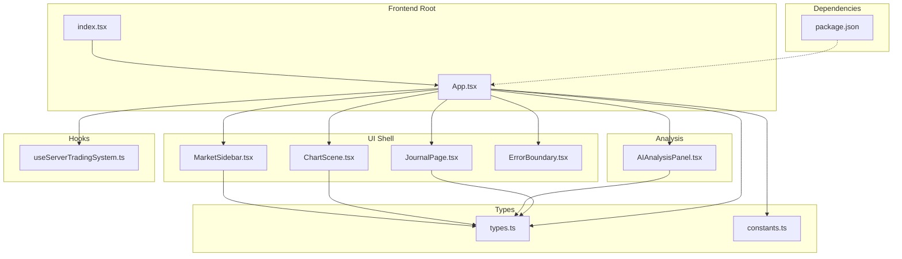
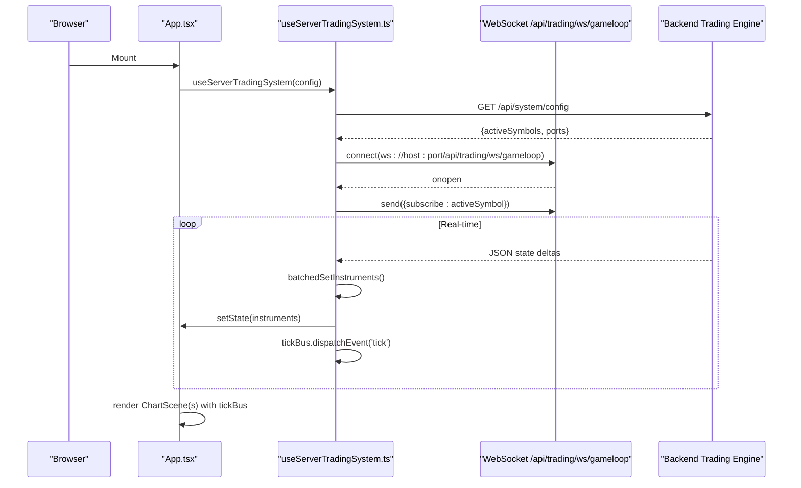
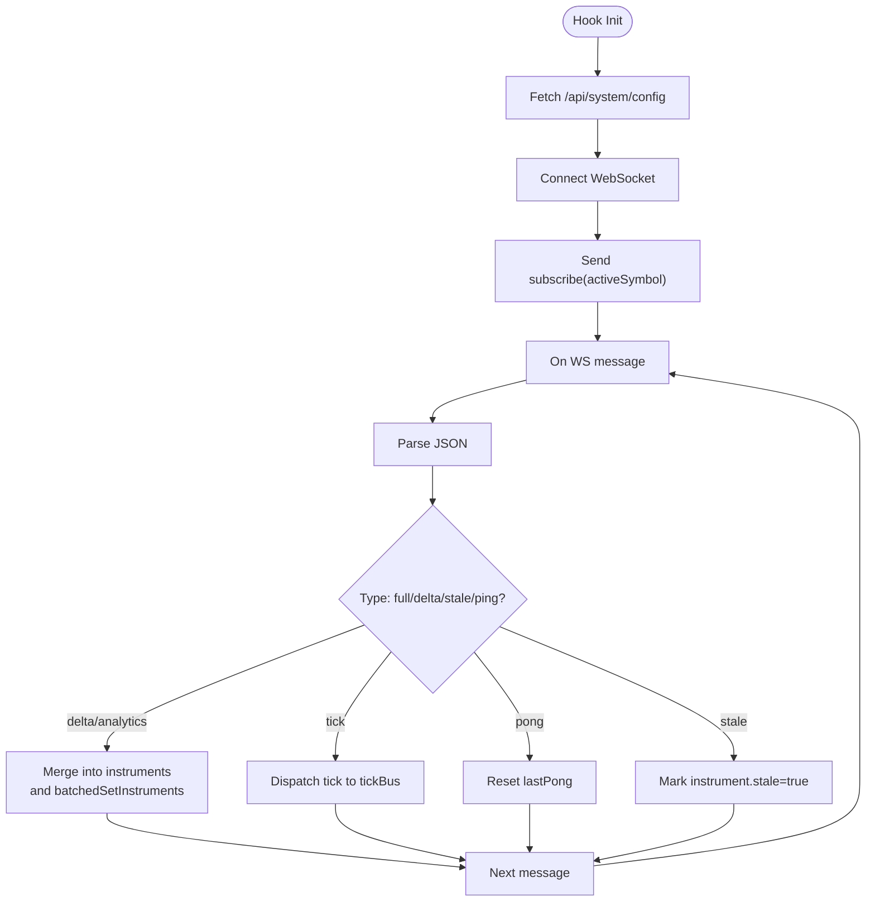
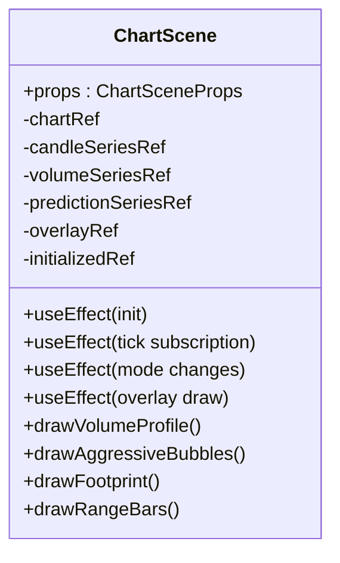
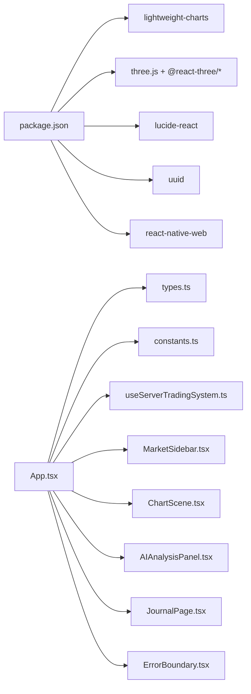

# Frontend Application

<cite>
**Referenced Files in This Document**
- [package.json](file://frontend/package.json)
- [App.tsx](file://frontend/App.tsx)
- [index.tsx](file://frontend/index.tsx)
- [constants.ts](file://frontend/constants.ts)
- [types.ts](file://frontend/types.ts)
- [useServerTradingSystem.ts](file://frontend/hooks/useServerTradingSystem.ts)
- [ChartScene.tsx](file://frontend/components/ChartScene.tsx)
- [AIAnalysisPanel.tsx](file://frontend/components/AIAnalysisPanel.tsx)
- [MarketSidebar.tsx](file://frontend/components/MarketSidebar.tsx)
- [JournalPage.tsx](file://frontend/components/JournalPage.tsx)
- [ErrorBoundary.tsx](file://frontend/components/ErrorBoundary.tsx)
</cite>

## Table of Contents
1. [Introduction](#introduction)
2. [Project Structure](#project-structure)
3. [Core Components](#core-components)
4. [Architecture Overview](#architecture-overview)
5. [Detailed Component Analysis](#detailed-component-analysis)
6. [Dependency Analysis](#dependency-analysis)
7. [Performance Considerations](#performance-considerations)
8. [Troubleshooting Guide](#troubleshooting-guide)
9. [Conclusion](#conclusion)
10. [Appendices](#appendices)

## Introduction
This document describes the GlassyTrade AI React frontend application. It focuses on the component architecture, real-time data visualization, WebSocket integration patterns, chart rendering system using Lightweight Charts, AI analysis panels, and the trade journal interface. It also provides usage examples, state management guidance, responsive design patterns, error handling, performance optimization, and integration details with backend APIs and WebSocket streams.

## Project Structure
The frontend is a React application bootstrapped with Vite and TypeScript. It uses Tailwind CSS for styling and exposes a single-page trading dashboard with:
- A central chart area supporting multiple modes (standard candles, footprint, range bars)
- A left sidebar for scanning instruments and viewing recent trades
- A right sidebar for AI analysis and controls
- A trade journal page for historical performance review
- A global error boundary for graceful failure handling

**Diagram sources**
- [index.tsx:1-16](file://frontend/index.tsx#L1-L16)
- [App.tsx:1-395](file://frontend/App.tsx#L1-L395)
- [MarketSidebar.tsx:1-388](file://frontend/components/MarketSidebar.tsx#L1-L388)
- [ChartScene.tsx:1-800](file://frontend/components/ChartScene.tsx#L1-L800)
- [AIAnalysisPanel.tsx:1-800](file://frontend/components/AIAnalysisPanel.tsx#L1-L800)
- [JournalPage.tsx:1-377](file://frontend/components/JournalPage.tsx#L1-L377)
- [ErrorBoundary.tsx:1-60](file://frontend/components/ErrorBoundary.tsx#L1-L60)
- [useServerTradingSystem.ts:1-655](file://frontend/hooks/useServerTradingSystem.ts#L1-L655)
- [types.ts:1-376](file://frontend/types.ts#L1-L376)
- [constants.ts:1-28](file://frontend/constants.ts#L1-L28)
- [package.json:1-39](file://frontend/package.json#L1-L39)

**Section sources**
- [index.tsx:1-16](file://frontend/index.tsx#L1-L16)
- [App.tsx:16-395](file://frontend/App.tsx#L16-L395)
- [package.json:13-24](file://frontend/package.json#L13-L24)

## Core Components
- App shell orchestrates UI state, chart modes, sidebar toggles, and navigation to the journal.
- MarketSidebar displays instrument scan results, filters, sorting, and recent closed trades for the active symbol.
- ChartScene renders real-time charts using Lightweight Charts, overlays volume profiles and AMT markers, and handles dynamic mode switching.
- AIAnalysisPanel presents GenAI and AMT insights, risk state, and decision logic in a structured layout.
- JournalPage fetches and displays trade journal summaries, completed trades, and event logs.
- ErrorBoundary wraps critical components to gracefully handle render errors.

Key runtime data flows:
- useServerTradingSystem manages WebSocket connectivity, parses backend messages, batches state updates, and exposes a tick bus for real-time updates.
- App composes multiple ChartScene instances for STANDARD, FOOTPRINT, and RANGE modes, sharing a single tick bus for native chart updates while maintaining separate state for analytics overlays.

**Section sources**
- [App.tsx:16-395](file://frontend/App.tsx#L16-L395)
- [MarketSidebar.tsx:168-388](file://frontend/components/MarketSidebar.tsx#L168-L388)
- [ChartScene.tsx:51-800](file://frontend/components/ChartScene.tsx#L51-L800)
- [AIAnalysisPanel.tsx:20-800](file://frontend/components/AIAnalysisPanel.tsx#L20-L800)
- [JournalPage.tsx:115-377](file://frontend/components/JournalPage.tsx#L115-L377)
- [ErrorBoundary.tsx:13-60](file://frontend/components/ErrorBoundary.tsx#L13-L60)
- [useServerTradingSystem.ts:59-655](file://frontend/hooks/useServerTradingSystem.ts#L59-L655)

## Architecture Overview
The frontend is a pure renderer driven by a server-side trading system. The App component holds UI state and delegates data acquisition and processing to a custom hook that manages:
- Backend configuration retrieval
- WebSocket connection to the trading engine
- Real-time tick streaming via an EventTarget-based tick bus
- Batched React state updates to minimize render churn
- Heartbeat and reconnection logic

**Diagram sources**
- [App.tsx:63-72](file://frontend/App.tsx#L63-L72)
- [useServerTradingSystem.ts:111-152](file://frontend/hooks/useServerTradingSystem.ts#L111-L152)
- [useServerTradingSystem.ts:509-570](file://frontend/hooks/useServerTradingSystem.ts#L509-L570)
- [useServerTradingSystem.ts:204-498](file://frontend/hooks/useServerTradingSystem.ts#L204-L498)
- [useServerTradingSystem.ts:296-324](file://frontend/hooks/useServerTradingSystem.ts#L296-L324)

## Detailed Component Analysis

### App Shell and State Orchestration
Responsibilities:
- Manage UI state: chart mode, sidebar visibility, right sidebar visibility, page routing, draggable “overseer” panel.
- Compose multiple ChartScene instances for concurrent rendering of STANDARD, FOOTPRINT, and RANGE modes.
- Derive best live opportunity across instruments and surface it in a floating control panel.
- Integrate MarketSidebar, AIAnalysisPanel, and JournalPage with error boundaries.

Notable patterns:
- Stable callbacks for symbol selection to avoid unnecessary re-renders of MarketSidebar.
- Effective config merges active instrument symbol into the global config for chart rendering.
- Conditional rendering when active instrument is not yet available.

**Section sources**
- [App.tsx:16-395](file://frontend/App.tsx#L16-L395)

### useServerTradingSystem Hook: WebSocket and Data Bus
Responsibilities:
- Fetch backend system config and initialize instrument states.
- Maintain a tick EventTarget for high-frequency updates without triggering React renders.
- Batch state updates per animation frame to reduce render pressure during multi-symbol scans.
- Manage WebSocket lifecycle: connect, subscribe, heartbeat, reconnect, and cleanup.
- Merge backend deltas into instrument state, handling analytics-only updates efficiently.

Key mechanisms:
- batchedSetInstruments queues updates and flushes once per RAF.
- Heartbeat detects dead connections and triggers reconnect.
- Deduplicates and sanitizes LLM history entries.
- Handles stale data notifications and purges stale symbols on server mode changes.

**Diagram sources**
- [useServerTradingSystem.ts:111-152](file://frontend/hooks/useServerTradingSystem.ts#L111-L152)
- [useServerTradingSystem.ts:509-570](file://frontend/hooks/useServerTradingSystem.ts#L509-L570)
- [useServerTradingSystem.ts:204-498](file://frontend/hooks/useServerTradingSystem.ts#L204-L498)

**Section sources**
- [useServerTradingSystem.ts:59-655](file://frontend/hooks/useServerTradingSystem.ts#L59-L655)

### ChartScene: Lightweight Charts and Canvas Overlays
Responsibilities:
- Initialize Lightweight Charts with candlesticks, histograms, and optional prediction overlays.
- Render historical data safely by ensuring ascending time ordering and IST offset handling.
- Subscribe to the tick EventTarget to update the most recent candle and volume without reinitializing series.
- Dynamically switch chart modes (STANDARD, FOOTPRINT, RANGE) and adjust scales and margins accordingly.
- Draw overlays on a canvas:
  - Volume Profiles (session and leg) with glassy gradients and zone indicators
  - Aggressive Print bubbles sized by volume
  - Footprint visualization with spine, bid/ask cells, and summary lines
  - Range bars with session/leg profiles

Optimization techniques:
- Memoize AMT analysis to avoid overlay redraws when only tick data changes.
- Memoize OHLC data reference to prevent overlay refresh on intra-candle updates.
- Defer overlay drawing until visible range changes and on mode switches.
- Use ResizeObserver to adapt chart size and overlay canvas dimensions.

**Diagram sources**
- [ChartScene.tsx:51-800](file://frontend/components/ChartScene.tsx#L51-L800)

**Section sources**
- [ChartScene.tsx:116-374](file://frontend/components/ChartScene.tsx#L116-L374)
- [ChartScene.tsx:375-425](file://frontend/components/ChartScene.tsx#L375-L425)
- [ChartScene.tsx:428-683](file://frontend/components/ChartScene.tsx#L428-L683)
- [ChartScene.tsx:685-800](file://frontend/components/ChartScene.tsx#L685-L800)

### AIAnalysisPanel: Structured Intelligence Display
Responsibilities:
- Present GenAI and AMT insights in a modular layout:
  - Equity and leverage header
  - Risk state warnings
  - Session/leg state and displacement indicators
  - Location visualization (VAH/VAL/POC vs LTP)
  - Aggression metrics (delta score, OFI, CVD slope)
  - Market structure and IB/break detection
  - LVN velocity play signals
  - VWAP context and deviation meter
  - Probability engine output (direction, probability, timing, size)
  - Overseer actions and reasons
- Sanitize and present LLM history with deduplication logic.

Design highlights:
- Sticky header for persistent controls and progress bars.
- Color-coded status indicators and confidence meters.
- Responsive layout with collapsible sections.

**Section sources**
- [AIAnalysisPanel.tsx:20-800](file://frontend/components/AIAnalysisPanel.tsx#L20-L800)

### MarketSidebar: Instrument Scanner and Recent Trades
Responsibilities:
- Filter, sort, and display instruments by mode, action, and probability.
- Provide quick symbol selection to switch the active instrument.
- Show recent closed trades for the active symbol with entry/exit details.

Patterns:
- Memoized symbol cards to avoid re-rendering the entire list on minor changes.
- Sorting by action or probability with secondary criteria.
- Dead market filtering and symbol shortening for readability.

**Section sources**
- [MarketSidebar.tsx:168-388](file://frontend/components/MarketSidebar.tsx#L168-L388)

### JournalPage: Trade Journal Interface
Responsibilities:
- Fetch and display:
  - Daily summary statistics
  - Completed trades with entry/exit, durations, and MFE/MAE
  - All journal events with filtering and hiding flat signals
- Provide date navigation and tabbed views.

API interactions:
- Calls backend endpoints for trades, events, and summary by date.

**Section sources**
- [JournalPage.tsx:115-377](file://frontend/components/JournalPage.tsx#L115-L377)

### ErrorBoundary: Robust Failure Handling
Responsibilities:
- Catch render errors in child components.
- Display a friendly retry UI with a limited retry count.
- Log error details for diagnostics.

**Section sources**
- [ErrorBoundary.tsx:13-60](file://frontend/components/ErrorBoundary.tsx#L13-L60)

## Dependency Analysis
External libraries and their roles:
- lightweight-charts: Core charting library for candlesticks, volumes, and overlays.
- three.js + @react-three/fiber/@react-three/drei: 3D scene support (referenced in dependencies).
- lucide-react: UI icons for controls and status indicators.
- uuid: Unique identifiers for entities.
- react-native-web: Cross-platform rendering support.

Internal dependencies:
- types.ts defines all data contracts for instruments, analyses, and UI state.
- constants.ts provides default visual configuration for charts.
- App.tsx composes components and integrates the trading system hook.
- useServerTradingSystem.ts encapsulates backend integration and state management.

**Diagram sources**
- [package.json:13-24](file://frontend/package.json#L13-L24)
- [App.tsx:1-12](file://frontend/App.tsx#L1-L12)
- [types.ts:1-376](file://frontend/types.ts#L1-L376)
- [constants.ts:1-28](file://frontend/constants.ts#L1-L28)
- [useServerTradingSystem.ts:1-11](file://frontend/hooks/useServerTradingSystem.ts#L1-L11)
- [MarketSidebar.tsx:1-5](file://frontend/components/MarketSidebar.tsx#L1-L5)
- [ChartScene.tsx:1-16](file://frontend/components/ChartScene.tsx#L1-L16)
- [AIAnalysisPanel.tsx:1-5](file://frontend/components/AIAnalysisPanel.tsx#L1-L5)
- [JournalPage.tsx:1-2](file://frontend/components/JournalPage.tsx#L1-L2)
- [ErrorBoundary.tsx:1-4](file://frontend/components/ErrorBoundary.tsx#L1-L4)

**Section sources**
- [package.json:13-24](file://frontend/package.json#L13-L24)
- [types.ts:1-376](file://frontend/types.ts#L1-L376)

## Performance Considerations
- Batched updates: useServerTradingSystem batches state updates per animation frame to reduce render churn during high-frequency updates.
- Event-driven ticks: ChartScene listens to a dedicated tick EventTarget to update the chart natively without touching React state.
- Memoization: ChartScene memoizes AMT analysis and OHLC data to avoid unnecessary overlay redraws.
- Visibility-aware rendering: ChartScene recalculates sizes and redraws only when a hidden chart becomes visible.
- Efficient overlays: Canvas overlay drawing is scoped to visible range changes and mode transitions.
- Avoid deep re-renders: Stable callbacks and memoized lists in MarketSidebar prevent unnecessary renders.

[No sources needed since this section provides general guidance]

## Troubleshooting Guide
Common issues and resolutions:
- Backend not ready:
  - Symptom: Waiting for backend screen and connection status banner.
  - Resolution: Ensure backend is running and reachable on the configured port; the hook retries automatically.
- WebSocket disconnects:
  - Symptom: Disconnected banner with reconnect countdown.
  - Resolution: Check network connectivity and backend availability; the hook implements exponential backoff and heartbeat monitoring.
- Stale or out-of-order ticks:
  - Symptom: Chart warnings or ignored updates.
  - Resolution: The chart wrapper catches and ignores stale/out-of-order tick updates to prevent crashes.
- Component render errors:
  - Symptom: Error banners with retry buttons.
  - Resolution: ErrorBoundary displays a friendly UI and limits retries to avoid infinite loops.
- No data in AI panel:
  - Symptom: Panel shows initializing state.
  - Resolution: Wait for backend to stream initial AMT and GenAI data; the panel falls back to AMT-derived values when GenAI is unavailable.

**Section sources**
- [useServerTradingSystem.ts:534-565](file://frontend/hooks/useServerTradingSystem.ts#L534-L565)
- [ChartScene.tsx:296-312](file://frontend/components/ChartScene.tsx#L296-L312)
- [ErrorBoundary.tsx:32-56](file://frontend/components/ErrorBoundary.tsx#L32-L56)
- [AIAnalysisPanel.tsx:87-104](file://frontend/components/AIAnalysisPanel.tsx#L87-L104)

## Conclusion
The GlassyTrade AI frontend is architected as a high-performance, real-time trading dashboard that delegates data ingestion and computation to a server-side engine. Its React components are lean renderers, augmented by a robust WebSocket integration, a native charting layer with advanced overlays, and a comprehensive AI analysis panel. The design emphasizes responsiveness, reliability, and clarity of market intelligence.

[No sources needed since this section summarizes without analyzing specific files]

## Appendices

### Component Composition Examples
- App composes ChartScene instances for STANDARD, FOOTPRINT, and RANGE modes, passing shared tickBus and distinct overlays.
- AIAnalysisPanel receives consolidated analysis and decision data to render structured intelligence.
- MarketSidebar provides filtered and sorted instrument listings with quick selection and recent trades.

**Section sources**
- [App.tsx:150-205](file://frontend/App.tsx#L150-L205)
- [AIAnalysisPanel.tsx:20-800](file://frontend/components/AIAnalysisPanel.tsx#L20-L800)
- [MarketSidebar.tsx:168-388](file://frontend/components/MarketSidebar.tsx#L168-L388)

### State Management Patterns
- Global UI state in App (chart mode, sidebar visibility, page routing).
- Instrument state maintained in useServerTradingSystem and exposed via React props.
- Event-driven updates via tick EventTarget to decouple rendering from data ingestion.

**Section sources**
- [App.tsx:17-30](file://frontend/App.tsx#L17-L30)
- [useServerTradingSystem.ts:60-76](file://frontend/hooks/useServerTradingSystem.ts#L60-L76)
- [ChartScene.tsx:277-319](file://frontend/components/ChartScene.tsx#L277-L319)

### Real-time Data Updates
- WebSocket messages are parsed and merged into instrument state; analytics-only deltas skip chart updates.
- Tick bus dispatches individual tick events to the chart for native updates.

**Section sources**
- [useServerTradingSystem.ts:204-498](file://frontend/hooks/useServerTradingSystem.ts#L204-L498)
- [ChartScene.tsx:277-319](file://frontend/components/ChartScene.tsx#L277-L319)

### Responsive Design and Interaction Patterns
- Sidebar toggles adjust layout margins; chart areas adapt via ResizeObserver.
- Interactive controls for chart mode, volume profile modes, and AI panel visibility.
- Drag-and-drop positioning for an “overseer” floating panel with cleanup on unmount.

**Section sources**
- [App.tsx:29-60](file://frontend/App.tsx#L29-L60)
- [ChartScene.tsx:221-234](file://frontend/components/ChartScene.tsx#L221-L234)

### Browser Compatibility Considerations
- Uses modern JavaScript and ES modules; ensure supported browsers for ES2020+ features.
- lightweight-charts and three.js require WebGL-capable environments for optimal performance.

**Section sources**
- [package.json:13-24](file://frontend/package.json#L13-L24)