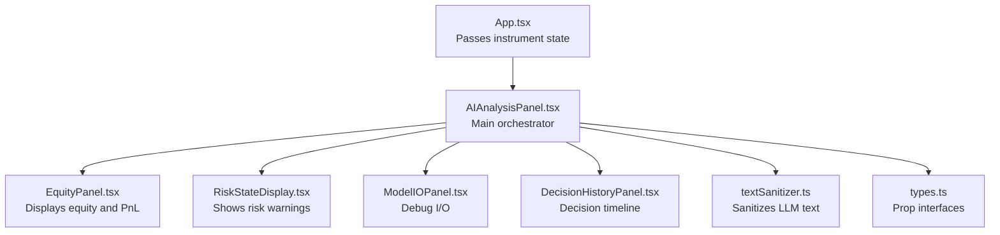
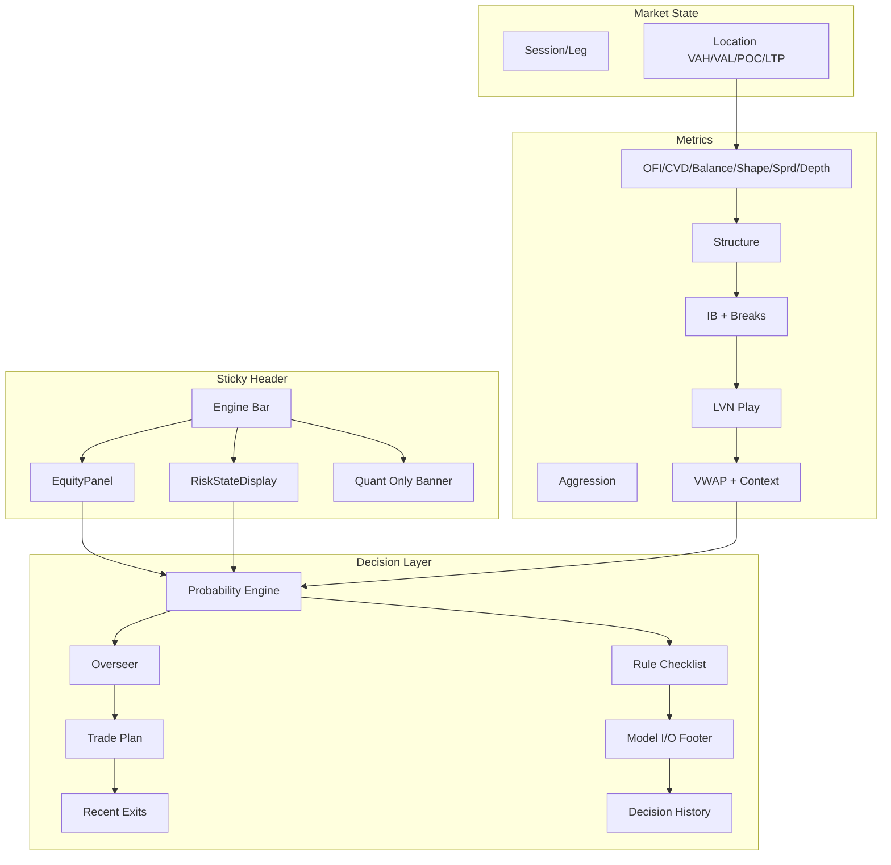
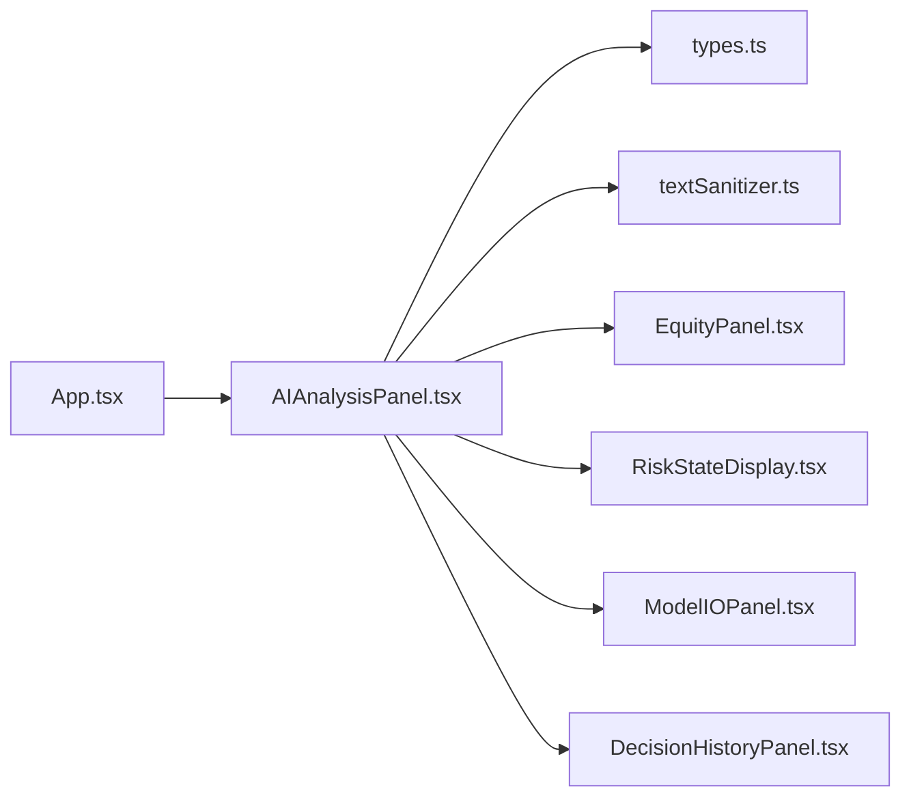

# AI Analysis Panel Core

<cite>
**Referenced Files in This Document**
- [AIAnalysisPanel.tsx](file://frontend/components/AIAnalysisPanel.tsx)
- [types.ts](file://frontend/types.ts)
- [textSanitizer.ts](file://frontend/utils/textSanitizer.ts)
- [EquityPanel.tsx](file://frontend/components/ai/EquityPanel.tsx)
- [RiskStateDisplay.tsx](file://frontend/components/ai/RiskStateDisplay.tsx)
- [ModelIOPanel.tsx](file://frontend/components/ai/ModelIOPanel.tsx)
- [DecisionHistoryPanel.tsx](file://frontend/components/ai/DecisionHistoryPanel.tsx)
- [App.tsx](file://frontend/App.tsx)
</cite>

## Table of Contents
1. [Introduction](#introduction)
2. [Project Structure](#project-structure)
3. [Core Components](#core-components)
4. [Architecture Overview](#architecture-overview)
5. [Detailed Component Analysis](#detailed-component-analysis)
6. [Dependency Analysis](#dependency-analysis)
7. [Performance Considerations](#performance-considerations)
8. [Troubleshooting Guide](#troubleshooting-guide)
9. [Conclusion](#conclusion)

## Introduction
The AI Analysis Panel is the central orchestrator of the AI-driven decision-making interface. It synthesizes multiple data streams—GenAI analysis, AMT (Auction Market Theory) results, portfolio state, risk conditions, agent decisions, and LLM history—into a cohesive, real-time dashboard. The panel manages state transitions, coordinates child components, and provides sticky header functionality with engine status indicators. It renders AI-generated insights, manages fallback mechanisms, and integrates with the equity panel and other specialized panels for structured display of market metrics, probability decisions, and historical reasoning.

## Project Structure
The AI Analysis Panel resides in the frontend components directory and integrates with several child panels and utilities:
- Parent container: App.tsx passes instrument state to AIAnalysisPanel
- Child panels: EquityPanel, RiskStateDisplay, ModelIOPanel, DecisionHistoryPanel
- Utilities: textSanitizer for LLM output sanitization
- Types: strongly typed interfaces for all data props

**Diagram sources**
- [App.tsx:371-387](file://frontend/App.tsx#L371-L387)
- [AIAnalysisPanel.tsx:1-18](file://frontend/components/AIAnalysisPanel.tsx#L1-L18)
- [EquityPanel.tsx:1-78](file://frontend/components/ai/EquityPanel.tsx#L1-L78)
- [RiskStateDisplay.tsx:1-37](file://frontend/components/ai/RiskStateDisplay.tsx#L1-L37)
- [ModelIOPanel.tsx:1-36](file://frontend/components/ai/ModelIOPanel.tsx#L1-L36)
- [DecisionHistoryPanel.tsx:1-98](file://frontend/components/ai/DecisionHistoryPanel.tsx#L1-L98)
- [textSanitizer.ts:1-51](file://frontend/utils/textSanitizer.ts#L1-L51)
- [types.ts:40-301](file://frontend/types.ts#L40-L301)

**Section sources**
- [App.tsx:371-387](file://frontend/App.tsx#L371-L387)
- [AIAnalysisPanel.tsx:1-18](file://frontend/components/AIAnalysisPanel.tsx#L1-L18)

## Core Components
- AIAnalysisPanel: Main component that orchestrates rendering, state derivation, and child component composition
- EquityPanel: Displays equity, open PnL, session realized PnL, and progress toward targets/circuit breakers
- RiskStateDisplay: Renders trading halts and consecutive loss indicators
- ModelIOPanel: Shows raw LLM prompt and model output for debugging
- DecisionHistoryPanel: Timeline of LLM decisions with confidence and rationale
- textSanitizer: Cleans escaped characters and JSON artifacts from LLM outputs

Key props interface:
- analysis: GenAIAnalysis | null
- amtResult: AMTAnalysis | null
- portfolio: Portfolio
- riskState?: RiskState | null
- agentDecision?: AgentDecision | null
- llmHistory?: LLMHistoryEntry[]
- orderBook?: OrderBook | null
- depth20Active?: boolean
- overseerAction?: string
- overseerReason?: string

**Section sources**
- [AIAnalysisPanel.tsx:7-18](file://frontend/components/AIAnalysisPanel.tsx#L7-L18)
- [types.ts:40-301](file://frontend/types.ts#L40-L301)

## Architecture Overview
The panel follows a layered rendering strategy:
- Sticky header: Engine status bar, equity panel, risk state warning, and LLM timeout banner
- Market state and location: Session/leg status, value area markers, and LTP indicator
- Aggression and market metrics: Delta score, OFI/CVD slope, balance ratio, shape/spread/depth
- Market structure: Confidence donut and acceptance/rejection signals
- IB + breaks: Initial balance range, break detection, POC migration
- LVN velocity play: Optional velocity play suggestion
- VWAP + context: Session VWAP bands and prior-day levels
- Probability engine: Agent decision with direction, probability, timing, size fraction
- Overseer: Supervisory actions and reasons
- Trade plan: Open positions with SL/TP/unrealized PnL and durations
- Recent exits: Closed trades with reasons and durations
- Rule checklist: Pre-defined gating rules with pass/fail status
- Model I/O footer: Collapsible rationale and raw output
- Decision history: Expandable timeline of past decisions

**Diagram sources**
- [AIAnalysisPanel.tsx:106-1030](file://frontend/components/AIAnalysisPanel.tsx#L106-L1030)
- [EquityPanel.tsx:10-72](file://frontend/components/ai/EquityPanel.tsx#L10-L72)
- [RiskStateDisplay.tsx:10-31](file://frontend/components/ai/RiskStateDisplay.tsx#L10-L31)
- [DecisionHistoryPanel.tsx:11-92](file://frontend/components/ai/DecisionHistoryPanel.tsx#L11-L92)

## Detailed Component Analysis

### AIAnalysisPanel Component
Responsibilities:
- Derives current best price proxy (LTP) with tiered fallback
- Constructs effective analysis for monitoring mode when GenAI is unavailable
- Prefers AMT-derived market state and aggression over stale LLM values
- Computes open PnL memoization for reuse across sections
- Renders sticky header with engine status, equity, risk warnings, and quant-only banner
- Displays market state, location, aggression, metrics, structure, IB/breaks, LVN play, VWAP context
- Renders probability engine, overseer, trade plan, recent exits, rule checklist, model I/O footer, and decision history

Rendering logic highlights:
- Sticky header uses z-index and backdrop blur for persistent visibility during scroll
- Engine bar shows target/circuit progress with normalized PnL
- Equity panel shows daily target/circuit progress and partial TP booking
- Risk state warning appears when halted or consecutive losses exceed thresholds
- Location section shows VAH/VAL/POC markers and LTP indicator with dynamic positioning
- Aggression and metrics sections use progress bars and color-coded indicators
- Structure section shows confidence donut and acceptance/rejection badges
- IB/breaks section shows IB range, break status, proximity warnings, and POC signals
- LVN play section shows direction, price, target, velocity ratio, and flags
- VWAP section shows session bands and sigma deviation meter
- Probability engine shows direction/probability/timing/size with rationale
- Overseer shows action and reason when present
- Trade plan lists open positions with SL/TP/unrealized PnL and durations
- Recent exits shows closed trades with reasons and durations
- Rule checklist evaluates gating rules and shows pass/fail status
- Model I/O footer collapses rationale and raw output
- Decision history shows expandable timeline with error detection

Conditional displays and fallbacks:
- If neither GenAI nor AMT data is available, shows initializing state with pulsing text
- If GenAI is absent but AMT is present, shows quant-only banner
- Location section falls back to “Building…” when VAH/VAL/POC are unavailable
- Probability section shows waiting message when no agent decision is available
- Rule checklist shows pass/fail counts and verdict based on gating rules

Real-time update coordination:
- Uses React.useMemo for derived values (LTP, effective analysis, display analysis, open PnL, aggression score)
- Wraps the main component in React.memo to prevent unnecessary re-renders when props are unchanged
- Child components are individually memoized for performance

**Section sources**
- [AIAnalysisPanel.tsx:20-1038](file://frontend/components/AIAnalysisPanel.tsx#L20-L1038)

#### Props Interface
- analysis: GenAIAnalysis | null
- amtResult: AMTAnalysis | null
- portfolio: Portfolio
- riskState?: RiskState | null
- agentDecision?: AgentDecision | null
- llmHistory?: LLMHistoryEntry[]
- orderBook?: OrderBook | null
- depth20Active?: boolean
- overseerAction?: string
- overseerReason?: string

**Section sources**
- [AIAnalysisPanel.tsx:7-18](file://frontend/components/AIAnalysisPanel.tsx#L7-L18)
- [types.ts:40-301](file://frontend/types.ts#L40-L301)

#### Rendering Logic and Conditional Displays
- Sticky header: Engine bar, equity panel, risk state display, quant-only banner
- Market state: Session/leg badges with live market state
- Location: VAH/VAL/POC markers and LTP indicator with fallback
- Aggression: Delta score with progress bar
- Metrics: OFI/CVD/balance/shape/spread/depth
- Structure: Confidence donut and acceptance/rejection signals
- IB/breaks: IB range, break detection, proximity warnings, POC signals
- LVN play: Optional velocity play suggestion
- VWAP: Session bands and sigma deviation
- Probability: Direction/probability/timing/size with rationale
- Overseer: Action and reason
- Trade plan: Open positions with SL/TP/unrealized PnL/durations
- Recent exits: Closed trades with reasons/durations
- Rule checklist: Gating rules with pass/fail
- Model I/O footer: Collapsible rationale/raw output
- Decision history: Expandable timeline with error detection

**Section sources**
- [AIAnalysisPanel.tsx:106-1030](file://frontend/components/AIAnalysisPanel.tsx#L106-L1030)

#### Fallback Mechanisms
- LTP fallback chain: order book mid-price → AMT session VWAP → zero
- Effective analysis fallback: monitoring mode using AMT data when GenAI is absent
- Location section fallback: “Building…” when VAH/VAL/POC unavailable
- Probability section fallback: waiting message when no agent decision
- Quant-only banner: appears when GenAI is absent but AMT is present

**Section sources**
- [AIAnalysisPanel.tsx:21-104](file://frontend/components/AIAnalysisPanel.tsx#L21-L104)

#### Data Sanitization Processes
- sanitizeLlmText: cleans escaped characters and removes JSON wrapping for raw output display
- sanitizeRationale: cleans rationale with more aggressive normalization for readable text

**Section sources**
- [textSanitizer.ts:17-50](file://frontend/utils/textSanitizer.ts#L17-L50)

#### Performance Optimizations
- React.useMemo for derived values (LTP, effective analysis, display analysis, open PnL, aggression score)
- React.memo for AIAnalysisPanel and child components (EquityPanel, RiskStateDisplay, ModelIOPanel, DecisionHistoryPanel)
- Memoized open PnL computation reused across multiple sections
- Conditional rendering to avoid heavy computations when data is unavailable

**Section sources**
- [AIAnalysisPanel.tsx:25-71](file://frontend/components/AIAnalysisPanel.tsx#L25-L71)
- [EquityPanel.tsx:9-73](file://frontend/components/ai/EquityPanel.tsx#L9-L73)
- [RiskStateDisplay.tsx:9-32](file://frontend/components/ai/RiskStateDisplay.tsx#L9-L32)
- [ModelIOPanel.tsx:9-35](file://frontend/components/ai/ModelIOPanel.tsx#L9-L35)
- [DecisionHistoryPanel.tsx:10-93](file://frontend/components/ai/DecisionHistoryPanel.tsx#L10-L93)

### Child Components Integration

#### Equity Panel
- Displays equity, open PnL, session realized PnL, and partial TP booking
- Shows daily target/circuit progress with color-coded bar
- Uses memoization to avoid recomputation

**Section sources**
- [EquityPanel.tsx:10-72](file://frontend/components/ai/EquityPanel.tsx#L10-L72)

#### Risk State Display
- Shows trading halt warnings and consecutive loss counters
- Conditionally renders based on risk state presence

**Section sources**
- [RiskStateDisplay.tsx:10-31](file://frontend/components/ai/RiskStateDisplay.tsx#L10-L31)

#### Model I/O Panel
- Displays raw LLM prompt and sanitized model output
- Used for debugging and transparency

**Section sources**
- [ModelIOPanel.tsx:10-31](file://frontend/components/ai/ModelIOPanel.tsx#L10-L31)

#### Decision History Panel
- Expandable timeline of past LLM decisions
- Detects error states and shows warning banner
- Sanitizes rationale for display

**Section sources**
- [DecisionHistoryPanel.tsx:11-92](file://frontend/components/ai/DecisionHistoryPanel.tsx#L11-L92)

### Integration with App
- App.tsx passes instrument state to AIAnalysisPanel, including GenAI analysis, AMT results, portfolio, risk state, agent decision, LLM history, order book, depth20Active flag, overseer action, and reason
- Wrapped in ErrorBoundary for robustness

**Section sources**
- [App.tsx:371-387](file://frontend/App.tsx#L371-L387)

## Dependency Analysis
The AI Analysis Panel depends on:
- Strongly typed interfaces from types.ts for all props
- Utility functions from textSanitizer.ts for LLM output sanitization
- Child panels for modular rendering and performance isolation

**Diagram sources**
- [AIAnalysisPanel.tsx:1-5](file://frontend/components/AIAnalysisPanel.tsx#L1-L5)
- [types.ts:40-301](file://frontend/types.ts#L40-L301)
- [textSanitizer.ts:1-51](file://frontend/utils/textSanitizer.ts#L1-L51)
- [EquityPanel.tsx:1-78](file://frontend/components/ai/EquityPanel.tsx#L1-L78)
- [RiskStateDisplay.tsx:1-37](file://frontend/components/ai/RiskStateDisplay.tsx#L1-L37)
- [ModelIOPanel.tsx:1-36](file://frontend/components/ai/ModelIOPanel.tsx#L1-L36)
- [DecisionHistoryPanel.tsx:1-98](file://frontend/components/ai/DecisionHistoryPanel.tsx#L1-L98)
- [App.tsx:371-387](file://frontend/App.tsx#L371-L387)

**Section sources**
- [AIAnalysisPanel.tsx:1-5](file://frontend/components/AIAnalysisPanel.tsx#L1-L5)
- [types.ts:40-301](file://frontend/types.ts#L40-L301)

## Performance Considerations
- Derived value memoization: LTP, effective analysis, display analysis, open PnL, and aggression score are computed with useMemo to avoid recalculation on re-renders
- Component memoization: AIAnalysisPanel and child panels are wrapped in React.memo to prevent unnecessary renders when props remain unchanged
- Conditional rendering: Sections only render when relevant data is available, reducing DOM overhead
- Sanitization: Efficient regex-based cleaning avoids expensive parsing for raw output display
- Scroll performance: Sticky header uses z-index and backdrop blur without heavy animations

[No sources needed since this section provides general guidance]

## Troubleshooting Guide
Common issues and resolutions:
- No GenAI or AMT data: Panel shows initializing state; verify backend feed connectivity and AMT pipeline readiness
- LLM Timeout banner: Indicates GenAI unavailability; panel continues with quant-only mode using AMT data
- Missing VAH/VAL/POC: Location section shows “Building…” until AMT volume profile is established
- No agent decision: Probability section shows waiting message; ensure probability engine is active
- Risk halt: RiskStateDisplay shows trading halt with reason; address underlying risk triggers
- Error state in decision history: Panel detects 3+ recent errors and shows warning banner; investigate LLM API availability

**Section sources**
- [AIAnalysisPanel.tsx:86-104](file://frontend/components/AIAnalysisPanel.tsx#L86-L104)
- [AIAnalysisPanel.tsx:176-184](file://frontend/components/AIAnalysisPanel.tsx#L176-L184)
- [AIAnalysisPanel.tsx:262-264](file://frontend/components/AIAnalysisPanel.tsx#L262-L264)
- [AIAnalysisPanel.tsx:767-770](file://frontend/components/AIAnalysisPanel.tsx#L767-L770)
- [RiskStateDisplay.tsx:15-23](file://frontend/components/ai/RiskStateDisplay.tsx#L15-L23)
- [DecisionHistoryPanel.tsx:14-24](file://frontend/components/ai/DecisionHistoryPanel.tsx#L14-L24)

## Conclusion
The AI Analysis Panel serves as the central hub for AI-driven trading insights, integrating GenAI analysis, AMT market metrics, portfolio state, and supervisory oversight into a cohesive, real-time interface. Its architecture emphasizes performance (memoization, conditional rendering), reliability (fallback mechanisms), and transparency (sanitized LLM outputs, decision history). The sticky header, engine status indicators, and equity panel integration provide traders with immediate context and actionable signals, while the modular child components enable scalable extension and maintenance.