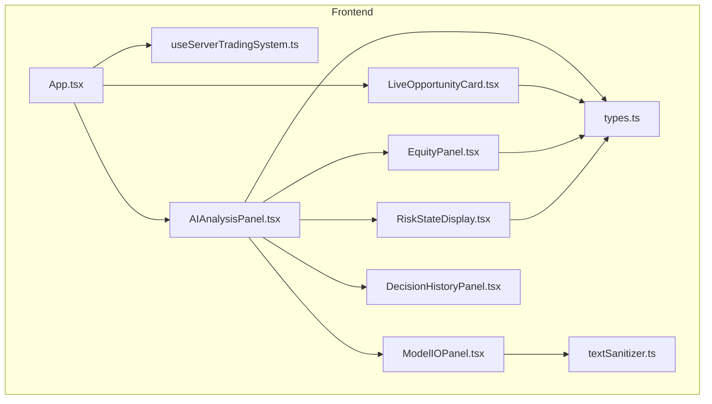
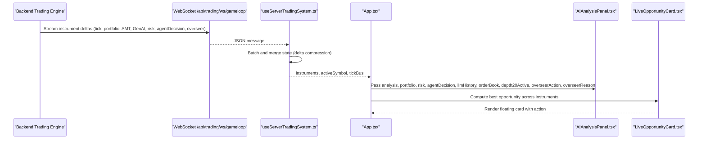
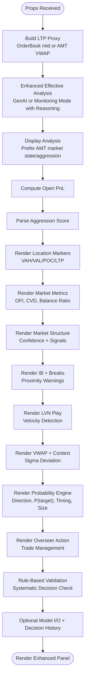
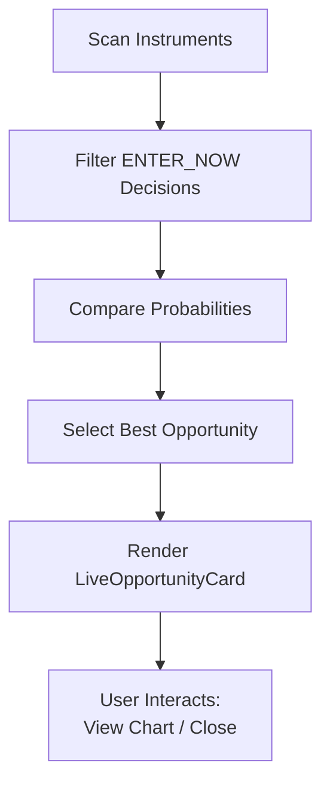
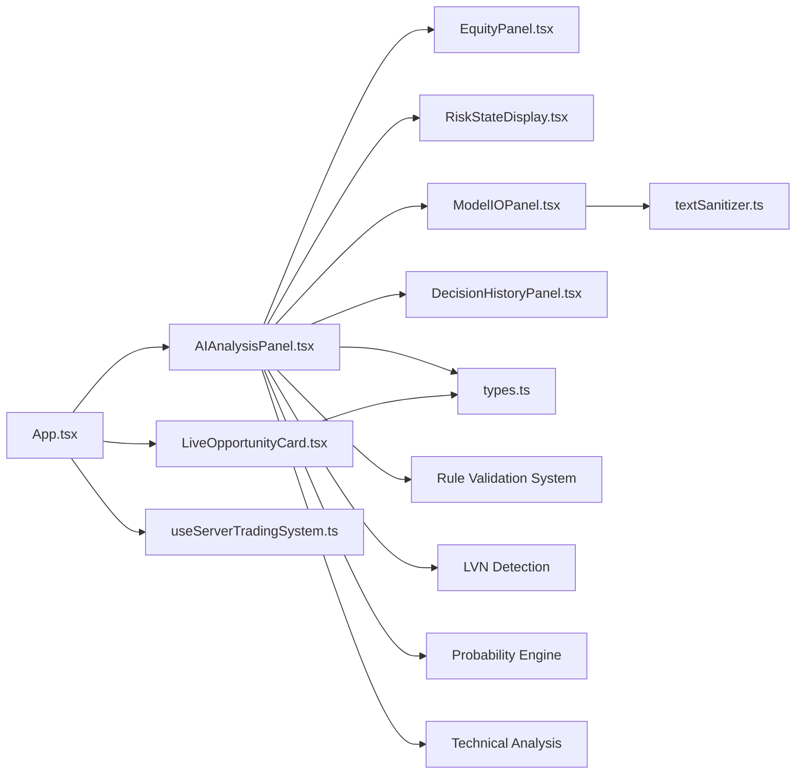

# AI Analysis Panels

<cite>
**Referenced Files in This Document**
- [AIAnalysisPanel.tsx](file://frontend/components/AIAnalysisPanel.tsx)
- [LiveOpportunityCard.tsx](file://frontend/components/ai/LiveOpportunityCard.tsx)
- [EquityPanel.tsx](file://frontend/components/ai/EquityPanel.tsx)
- [ModelIOPanel.tsx](file://frontend/components/ai/ModelIOPanel.tsx)
- [RiskStateDisplay.tsx](file://frontend/components/ai/RiskStateDisplay.tsx)
- [DecisionHistoryPanel.tsx](file://frontend/components/ai/DecisionHistoryPanel.tsx)
- [App.tsx](file://frontend/App.tsx)
- [useServerTradingSystem.ts](file://frontend/hooks/useServerTradingSystem.ts)
- [types.ts](file://frontend/types.ts)
- [textSanitizer.ts](file://frontend/utils/textSanitizer.ts)
</cite>

## Update Summary
**Changes Made**
- Enhanced AIAnalysisPanel core with comprehensive AI decision visualization and analysis capabilities
- Added new Rule Checklist section for systematic decision validation
- Improved monitoring mode with reasoning model integration
- Enhanced probability engine visualization with detailed logic formulas
- Expanded overseer panel with comprehensive trade management
- Added extensive market structure and technical analysis components
- Integrated LVN (Large Volume Node) velocity play detection
- Enhanced VWAP contextual analysis with sigma deviation visualization

## Table of Contents
1. [Introduction](#introduction)
2. [Project Structure](#project-structure)
3. [Core Components](#core-components)
4. [Architecture Overview](#architecture-overview)
5. [Detailed Component Analysis](#detailed-component-analysis)
6. [Enhanced AI Decision Visualization](#enhanced-ai-decision-visualization)
7. [Rule-Based Decision Validation](#rule-based-decision-validation)
8. [Dependency Analysis](#dependency-analysis)
9. [Performance Considerations](#performance-considerations)
10. [Troubleshooting Guide](#troubleshooting-guide)
11. [Conclusion](#conclusion)
12. [Appendices](#appendices)

## Introduction
This document explains the AI analysis panel ecosystem that powers intelligent trading insights in the frontend. The enhanced system now features comprehensive AI decision visualization and analysis capabilities, providing traders with detailed market structure analysis, opportunity scoring, equity tracking, and risk communication. The system has been significantly upgraded to include advanced rule-based validation, LVN detection, and sophisticated probability engine visualization.

The enhanced AI analysis panels consist of five primary components:
- AIAnalysisPanel: The central dashboard for AI-driven market insights, comprehensive decision validation, and advanced technical analysis
- LiveOpportunityCard: A floating card that highlights actionable trading opportunities across symbols
- EquityPanel: Real-time equity and session performance visualization
- ModelIOPanel: Debugging view of AI model inputs and outputs
- RiskStateDisplay: Immediate risk warnings and loss streak indicators

**Section sources**
- [AIAnalysisPanel.tsx:7-18](file://frontend/components/AIAnalysisPanel.tsx#L7-L18)
- [LiveOpportunityCard.tsx:5-11](file://frontend/components/ai/LiveOpportunityCard.tsx#L5-L11)
- [EquityPanel.tsx:4-7](file://frontend/components/ai/EquityPanel.tsx#L4-L7)
- [ModelIOPanel.tsx:5-7](file://frontend/components/ai/ModelIOPanel.tsx#L5-L7)
- [RiskStateDisplay.tsx:5-7](file://frontend/components/ai/RiskStateDisplay.tsx#L5-L7)

## Project Structure
The AI analysis panels are part of the frontend application and integrate with a server-driven trading system. The panels are composed inside the main App shell and receive data via a WebSocket-based hook that batches updates for performance. The enhanced system now includes comprehensive rule validation, LVN detection, and advanced technical analysis components.

**Diagram sources**
- [App.tsx:374-386](file://frontend/App.tsx#L374-L386)
- [useServerTradingSystem.ts:641-654](file://frontend/hooks/useServerTradingSystem.ts#L641-L654)
- [AIAnalysisPanel.tsx:1-1183](file://frontend/components/AIAnalysisPanel.tsx#L1-L1183)
- [LiveOpportunityCard.tsx:1-94](file://frontend/components/ai/LiveOpportunityCard.tsx#L1-L94)
- [EquityPanel.tsx:1-78](file://frontend/components/ai/EquityPanel.tsx#L1-L78)
- [ModelIOPanel.tsx:1-36](file://frontend/components/ai/ModelIOPanel.tsx#L1-L36)
- [RiskStateDisplay.tsx:1-37](file://frontend/components/ai/RiskStateDisplay.tsx#L1-L37)
- [DecisionHistoryPanel.tsx:1-94](file://frontend/components/ai/DecisionHistoryPanel.tsx#L1-L94)
- [types.ts:1-396](file://frontend/types.ts#L1-L396)
- [textSanitizer.ts:1-51](file://frontend/utils/textSanitizer.ts#L1-L51)

**Section sources**
- [App.tsx:374-386](file://frontend/App.tsx#L374-L386)
- [useServerTradingSystem.ts:641-654](file://frontend/hooks/useServerTradingSystem.ts#L641-L654)

## Core Components
- **AIAnalysisPanel**: Enhanced central hub aggregating GenAIAnalysis, AMTAnalysis, Portfolio, RiskState, AgentDecision, LLM history, order book, depth settings, and overseer actions. Now features comprehensive rule validation, LVN detection, advanced probability engine visualization, and detailed market structure analysis.
- **LiveOpportunityCard**: Highlights the best "ENTER_NOW" opportunity across symbols with direction, probability, estimated SL/TP, and navigation to the chart.
- **EquityPanel**: Displays equity, open PnL, session realized PnL, target/circuit progress bar, and partial TP booking.
- **ModelIOPanel**: Shows the AI prompt and raw output for debugging and transparency.
- **RiskStateDisplay**: Communicates trading halts and consecutive loss streaks.

**Section sources**
- [AIAnalysisPanel.tsx:7-18](file://frontend/components/AIAnalysisPanel.tsx#L7-L18)
- [LiveOpportunityCard.tsx:5-11](file://frontend/components/ai/LiveOpportunityCard.tsx#L5-L11)
- [EquityPanel.tsx:4-7](file://frontend/components/ai/EquityPanel.tsx#L4-L7)
- [ModelIOPanel.tsx:5-7](file://frontend/components/ai/ModelIOPanel.tsx#L5-L7)
- [RiskStateDisplay.tsx:5-7](file://frontend/components/ai/RiskStateDisplay.tsx#L5-L7)

## Architecture Overview
The panels are driven by a server-side trading system that streams instrument states over WebSocket. The frontend batches updates and renders UI components with minimal re-renders. The enhanced AIAnalysisPanel now includes comprehensive rule validation, LVN detection, and advanced technical analysis components. The system prioritizes AMT-derived market state and aggression over stale LLM values, ensuring real-time market intelligence.

**Diagram sources**
- [useServerTradingSystem.ts:204-498](file://frontend/hooks/useServerTradingSystem.ts#L204-L498)
- [App.tsx:374-386](file://frontend/App.tsx#L374-L386)
- [AIAnalysisPanel.tsx:20-50](file://frontend/components/AIAnalysisPanel.tsx#L20-L50)
- [LiveOpportunityCard.tsx:13-31](file://frontend/components/ai/LiveOpportunityCard.tsx#L13-L31)

## Detailed Component Analysis

### Enhanced AIAnalysisPanel
**Purpose:**
- Aggregate and present comprehensive AI-driven insights, market structure analysis, opportunity scoring, equity, and risk state in an enhanced, scrollable dashboard with rule-based validation.

**Key Responsibilities:**
- Construct enhanced "monitoring mode" analysis from AMT when GenAI is unavailable, integrating reasoning model data
- Prefer AMT-derived market state and aggression over stale LLM values
- Compute derived metrics (LTP proxy, open PnL, balance ratio, sigma deviation)
- Render comprehensive session state, location markers, aggression metrics, market structure, IB/breaks, LVN plays, VWAP context, probability engine, overseer actions, and optional Model I/O and Decision History panels
- Implement systematic rule validation for decision-making
- Provide advanced technical analysis with LVN detection and sigma deviation visualization

**Data Requirements:**
- GenAIAnalysis (direction, rationale, confidence, marketState, aggression, rawOutput, inputPrompt)
- AMTAnalysis (comprehensive market analysis with LVN detection, VWAP bands, structure confidence)
- Portfolio (positions, closedTrades, equity, leverage)
- RiskState (halted, haltReason, consecutiveLosses, dailyPnl)
- AgentDecision (direction, probability, timing, sizeFraction, rationale)
- LLMHistory (entries for decision history)
- OrderBook (for LTP proxy and spread)
- depth20Active flag
- overseerAction and overseerReason

**Visual Presentation:**
- Enhanced sticky header with engine status, target/circuit progress bar, EquityPanel, RiskStateDisplay, and LLM timeout banner
- Comprehensive sections for Session & Leg, Location, Volume Aggression, Market Metrics, Market Structure, IB + Breaks, LVN Play, VWAP + Context, Probability Engine, Overseer, Trade Plan, Recent Exits, Rule Checklist, and Decision History
- Advanced technical indicators with visual progress bars and sigma deviation meters
- Systematic rule validation with pass/fail indicators
- LVN (Large Volume Node) detection with velocity play visualization

**Interaction Patterns:**
- Uses extensive memoization to avoid unnecessary re-computations
- Renders fallback states when data is initializing or missing
- Integrates with DecisionHistoryPanel and ModelIOPanel conditionally
- Provides expandable sections for detailed analysis
- Implements rule-based decision validation with visual feedback

**Real-time Updates:**
- Receives deltas from the server via the hook; updates are batched and merged efficiently
- Enhanced monitoring mode automatically activates when GenAI is unavailable
- LVN detection updates in real-time as volume nodes are identified

**Accessibility and Responsiveness:**
- Uses semantic labels, monospace digits for financial data, and clear color-coded signals
- Responsive layout adapts to sidebar toggles and overlay positioning
- Expandable/collapsible sections for better information hierarchy
- Comprehensive color coding for different market states and decision types

**Section sources**
- [AIAnalysisPanel.tsx:20-50](file://frontend/components/AIAnalysisPanel.tsx#L20-L50)
- [AIAnalysisPanel.tsx:37-50](file://frontend/components/AIAnalysisPanel.tsx#L37-L50)
- [AIAnalysisPanel.tsx:52-59](file://frontend/components/AIAnalysisPanel.tsx#L52-L59)
- [AIAnalysisPanel.tsx:170-185](file://frontend/components/AIAnalysisPanel.tsx#L170-L185)
- [AIAnalysisPanel.tsx:187-1183](file://frontend/components/AIAnalysisPanel.tsx#L187-L1183)

#### Enhanced AI Analysis Data Flow

**Diagram sources**
- [AIAnalysisPanel.tsx:25-33](file://frontend/components/AIAnalysisPanel.tsx#L25-L33)
- [AIAnalysisPanel.tsx:38-50](file://frontend/components/AIAnalysisPanel.tsx#L38-L50)
- [AIAnalysisPanel.tsx:53-59](file://frontend/components/AIAnalysisPanel.tsx#L53-L59)
- [AIAnalysisPanel.tsx:218-264](file://frontend/components/AIAnalysisPanel.tsx#L218-L264)
- [AIAnalysisPanel.tsx:300-422](file://frontend/components/AIAnalysisPanel.tsx#L300-L422)
- [AIAnalysisPanel.tsx:424-483](file://frontend/components/AIAnalysisPanel.tsx#L424-L483)
- [AIAnalysisPanel.tsx:485-561](file://frontend/components/AIAnalysisPanel.tsx#L485-L561)
- [AIAnalysisPanel.tsx:564-588](file://frontend/components/AIAnalysisPanel.tsx#L564-L588)
- [AIAnalysisPanel.tsx:591-705](file://frontend/components/AIAnalysisPanel.tsx#L591-L705)
- [AIAnalysisPanel.tsx:707-771](file://frontend/components/AIAnalysisPanel.tsx#L707-L771)
- [AIAnalysisPanel.tsx:773-801](file://frontend/components/AIAnalysisPanel.tsx#L773-L801)

### LiveOpportunityCard
**Purpose:**
- Highlight the best "ENTER_NOW" opportunity across all scanned instruments with direction, probability, and estimated SL/TP.

**Data Requirements:**
- symbol, agentDecision (direction, probability, timing), ltp.

**Visual Presentation:**
- Displays symbol, LTP, direction badge, probability, estimated SL/TP, and a button to navigate to the chart.
- Enhanced styling with purple accent border and gradient highlight for priority opportunities.

**Interaction Patterns:**
- onSelect triggers symbol change and hides controls.
- onClose hides the floating card.

**Real-time Updates:**
- Recomputed whenever instruments change; best opportunity is derived from the active instruments map.

**Accessibility and Responsiveness:**
- Uses clear color coding (green/red badges), monospace digits, and hover states.
- Enhanced visual priority indicators for actionable opportunities.

**Section sources**
- [LiveOpportunityCard.tsx:13-31](file://frontend/components/ai/LiveOpportunityCard.tsx#L13-L31)
- [LiveOpportunityCard.tsx:33-93](file://frontend/components/ai/LiveOpportunityCard.tsx#L33-L93)
- [App.tsx:82-94](file://frontend/App.tsx#L82-L94)

#### Live Opportunity Selection Flow

**Diagram sources**
- [App.tsx:82-94](file://frontend/App.tsx#L82-L94)
- [LiveOpportunityCard.tsx:13-31](file://frontend/components/ai/LiveOpportunityCard.tsx#L13-L31)

### EquityPanel
**Purpose:**
- Visualize portfolio equity, open PnL, session realized PnL, and partial TP booking.

**Data Requirements:**
- Portfolio (positions, closedTrades, equity, leverage).

**Visual Presentation:**
- Equity and open PnL rows.
- Target vs circuit progress bar with zero line marker.
- Session realized PnL with directional coloring.
- Partial TP booking indicator when applicable.

**Real-time Updates:**
- Recomputed from portfolio positions and closed trades.

**Accessibility and Responsiveness:**
- Monospace fonts for financial figures, directional color coding, and compact layout.

**Section sources**
- [EquityPanel.tsx:10-73](file://frontend/components/ai/EquityPanel.tsx#L10-L73)
- [types.ts:118-125](file://frontend/types.ts#L118-L125)

### ModelIOPanel
**Purpose:**
- Provide transparency into AI model inputs and outputs for debugging and auditing.

**Data Requirements:**
- GenAIAnalysis (inputPrompt, rawOutput).

**Visual Presentation:**
- Two-column display: Prompt → Model and Model → Output.
- Sanitized text rendering for clean display.

**Real-time Updates:**
- Updates when GenAIAnalysis changes.

**Accessibility and Responsiveness:**
- Scrollable container for long outputs, monospace typography.

**Section sources**
- [ModelIOPanel.tsx:10-31](file://frontend/components/ai/ModelIOPanel.tsx#L10-L31)
- [textSanitizer.ts:17-32](file://frontend/utils/textSanitizer.ts#L17-L32)

### RiskStateDisplay
**Purpose:**
- Communicate trading halts and consecutive loss streaks to the operator.

**Data Requirements:**
- RiskState (halted, haltReason, consecutiveLosses, dailyPnl).

**Visual Presentation:**
- Halt banner with icon and reason when halted.
- Consecutive loss counter and daily Pnl otherwise.

**Real-time Updates:**
- Updates when RiskState changes.

**Accessibility and Responsiveness:**
- Minimalist design with clear color cues.

**Section sources**
- [RiskStateDisplay.tsx:10-31](file://frontend/components/ai/RiskStateDisplay.tsx#L10-L31)
- [types.ts:66-73](file://frontend/types.ts#L66-L73)

### DecisionHistoryPanel
**Purpose:**
- Maintain an expandable timeline of past LLM decisions with timestamps and rationale.

**Data Requirements:**
- LLMHistoryEntry[] (timestamp, direction, confidence, rationale, inputPrompt, rawOutput).

**Visual Presentation:**
- Vertical timeline with colored dots and rationale blocks.
- Error detection for recent failures; optional export placeholder.

**Real-time Updates:**
- Appends new entries and maintains a rolling window.

**Accessibility and Responsiveness:**
- Scrollable container with clear timestamps and concise rationale summaries.

**Section sources**
- [DecisionHistoryPanel.tsx:11-93](file://frontend/components/ai/DecisionHistoryPanel.tsx#L11-L93)
- [types.ts:75-82](file://frontend/types.ts#L75-L82)

## Enhanced AI Decision Visualization
The enhanced AI analysis panel now provides comprehensive decision visualization through several key improvements:

### Rule-Based Decision Validation
The system implements a systematic rule checklist that validates trading decisions against multiple criteria:
- Market State Validation: Checks for imbalanced or probing market conditions
- Price Location Validation: Ensures price proximity to value area levels
- Market Activity Validation: Confirms non-dead market state
- Timing Validation: Verifies ENTER_NOW timing signal

Each rule is represented with visual indicators showing pass/fail status, providing traders with clear decision justification.

### LVN (Large Volume Node) Detection
Advanced volume analysis identifies significant volume nodes with velocity play detection:
- LVN price identification with velocity ratios
- Target projection based on volume node strength
- Rejection and delta flip confirmation signals
- Visual indicators for trade setup confirmation

### Enhanced Probability Engine
The probability engine now provides detailed logic breakdown:
- Direction, probability, timing, and size fraction visualization
- Regime classification (trending, balanced, volatile)
- Latency tracking for decision quality assessment
- Expandable logic formulas section for transparency

### Advanced Technical Analysis
Comprehensive technical indicators with visual representation:
- VWAP deviation sigma visualization with extreme zone warnings
- Market structure confidence with acceptance/rejection signals
- Initial balance detection with break validation
- Delta score visualization with confidence indicators

**Section sources**
- [AIAnalysisPanel.tsx:1084-1148](file://frontend/components/AIAnalysisPanel.tsx#L1084-L1148)
- [AIAnalysisPanel.tsx:695-720](file://frontend/components/AIAnalysisPanel.tsx#L695-L720)
- [AIAnalysisPanel.tsx:860-924](file://frontend/components/AIAnalysisPanel.tsx#L860-L924)
- [AIAnalysisPanel.tsx:412-554](file://frontend/components/AIAnalysisPanel.tsx#L412-L554)

## Rule-Based Decision Validation
The enhanced system implements a comprehensive rule validation framework:

### Rule Checklist Implementation
The system evaluates trading decisions against four critical rules:
1. **AAA PRE-1 Rule**: Market state validation (imbalanced/probing acceptable)
2. **MR Location Rule**: Price proximity to value area levels (within threshold distance)
3. **Volume Alive Rule**: Non-dead market state confirmation
4. **Timing Rule**: ENTER_NOW timing signal validation

### Visual Rule Validation
Each rule is displayed with:
- Checkmark or X indicator based on pass/fail status
- Color-coded feedback (green for pass, red for fail, yellow for partial)
- Detailed explanations of rule evaluation results
- Overall pass/fail count with percentage completion

### Decision Verdict System
Based on rule validation, the system provides:
- Clear ENTER_NOW or MONITOR/WAIT verdict
- Rationale for decision outcome
- Visual indicators for decision quality
- Historical rule compliance tracking

**Section sources**
- [AIAnalysisPanel.tsx:1084-1148](file://frontend/components/AIAnalysisPanel.tsx#L1084-L1148)
- [AIAnalysisPanel.tsx:1139-1145](file://frontend/components/AIAnalysisPanel.tsx#L1139-L1145)

## Dependency Analysis
- **AIAnalysisPanel** depends on:
  - Enhanced rule validation system for systematic decision assessment
  - LVN detection algorithms for volume node analysis
  - Advanced probability engine for decision quality scoring
  - Comprehensive technical analysis libraries
  - EquityPanel, RiskStateDisplay, ModelIOPanel, DecisionHistoryPanel for sub-components
  - types.ts for enhanced data contracts (GenAIAnalysis, AMTAnalysis, Portfolio, RiskState, AgentDecision, LLMHistoryEntry)
  - textSanitizer.ts for safe rendering of LLM outputs
- **LiveOpportunityCard** depends on:
  - types.ts for AgentDecision and symbol
- **App** integrates:
  - useServerTradingSystem.ts for data flow and symbol selection
  - Enhanced AIAnalysisPanel and LiveOpportunityCard into the overlay UI

**Diagram sources**
- [AIAnalysisPanel.tsx:4-5](file://frontend/components/AIAnalysisPanel.tsx#L4-L5)
- [EquityPanel.tsx:1-2](file://frontend/components/ai/EquityPanel.tsx#L1-L2)
- [RiskStateDisplay.tsx:1-3](file://frontend/components/ai/RiskStateDisplay.tsx#L1-L3)
- [ModelIOPanel.tsx:2-3](file://frontend/components/ai/ModelIOPanel.tsx#L2-L3)
- [DecisionHistoryPanel.tsx:2-4](file://frontend/components/ai/DecisionHistoryPanel.tsx#L2-L4)
- [LiveOpportunityCard.tsx:2-3](file://frontend/components/ai/LiveOpportunityCard.tsx#L2-L3)
- [App.tsx:4-5](file://frontend/App.tsx#L4-L5)
- [useServerTradingSystem.ts:11](file://frontend/hooks/useServerTradingSystem.ts#L11)

**Section sources**
- [AIAnalysisPanel.tsx:4-5](file://frontend/components/AIAnalysisPanel.tsx#L4-L5)
- [App.tsx:374-386](file://frontend/App.tsx#L374-L386)
- [useServerTradingSystem.ts:641-654](file://frontend/hooks/useServerTradingSystem.ts#L641-L654)

## Performance Considerations
- **Enhanced Delta compression and batching**: The hook merges incoming WebSocket messages and batches React updates to minimize re-renders during high-frequency updates, now handling increased data complexity from enhanced analysis
- **Extensive Memoization**: AIAnalysisPanel uses useMemo for derived values (LTP proxy, open PnL, aggression score, LVN detection, rule validation) to avoid recomputation on unrelated prop changes
- **Conditional rendering**: Optional panels (Model I/O, Decision History, LVN detection) are rendered only when data is available
- **Lightweight DOM**: Panels use simple containers and minimal DOM nesting to keep rendering efficient, even with expanded analysis capabilities
- **Optimized technical calculations**: LVN detection and sigma deviation calculations are optimized for real-time performance

## Troubleshooting Guide
**Common issues and remedies:**
- **No data displayed initially:**
  - AIAnalysisPanel shows an initializing state when both GenAI and AMT are missing. Wait for backend to stream data.
- **Enhanced stale GenAI signals:**
  - AIAnalysisPanel falls back to monitoring mode using AMT data with reasoning model integration. Expect "Monitoring market state..." until GenAI responds.
- **LLM timeout banner:**
  - When GenAI is unavailable, a warning banner indicates "Running on Quant Logic Only."
- **Risk halt:**
  - RiskStateDisplay shows a red banner with halt reason when trading is halted.
- **Decision history errors:**
  - DecisionHistoryPanel detects 3+ recent errors and displays a warning banner indicating potential stale decisions.
- **Sanitization artifacts:**
  - ModelIOPanel uses textSanitizer to remove escape sequences and JSON wrappers for clean display.
- **Rule validation failures:**
  - Rule checklist shows failing criteria with detailed explanations for decision justification issues.
- **LVN detection delays:**
  - LVN detection may take time to establish volume nodes; check for velocity play indicators when available.

**Section sources**
- [AIAnalysisPanel.tsx:97-115](file://frontend/components/AIAnalysisPanel.tsx#L97-L115)
- [AIAnalysisPanel.tsx:187-196](file://frontend/components/AIAnalysisPanel.tsx#L187-L196)
- [RiskStateDisplay.tsx:15-23](file://frontend/components/ai/RiskStateDisplay.tsx#L15-L23)
- [DecisionHistoryPanel.tsx:14-24](file://frontend/components/ai/DecisionHistoryPanel.tsx#L14-L24)
- [ModelIOPanel.tsx:23-27](file://frontend/components/ai/ModelIOPanel.tsx#L23-L27)
- [textSanitizer.ts:17-32](file://frontend/utils/textSanitizer.ts#L17-L32)

## Conclusion
The enhanced AI analysis panels form a comprehensive, real-time intelligence layer that surfaces advanced market structure analysis, systematic rule validation, LVN detection, and sophisticated probability engine insights. The system is designed for performance, clarity, and safety, with robust fallbacks, extensive technical analysis, and comprehensive decision validation. Integration with the server-driven trading system ensures timely updates and minimal frontend overhead while providing traders with unprecedented insight into market dynamics and decision quality.

## Appendices

### Component Styling, Theming, and Accessibility
**Theming:**
- Dark theme with glassmorphism overlays, subtle borders, and gradient accents
- Enhanced color-coded signals: green for bullish, red for bearish, amber/yellow for caution, purple for priority opportunities
- Advanced visual indicators for different market states and decision types

**Responsiveness:**
- Panels adapt to sidebar toggles and overlay positioning; scrollable containers for long content
- Expandable sections for detailed analysis without cluttering the interface
- Adaptive layouts for rule validation and technical analysis components

**Accessibility:**
- Semantic labels, monospace digits for financial data, clear contrast, and hover/focus states
- Comprehensive color coding for different market states and decision types
- Expandable sections with clear visual indicators for content hierarchy
- Enhanced visual priority indicators for actionable opportunities

### Example Integration Patterns
**Embedding Enhanced AIAnalysisPanel:**
- Passed instrument props from App to AIAnalysisPanel for rendering with enhanced rule validation
- Integration of LVN detection and technical analysis components
- Systematic rule validation with visual feedback mechanisms

**LiveOpportunityCard integration:**
- Computed best opportunity across instruments and rendered as a floating overlay with enhanced styling
- Priority indicators for actionable opportunities

**Data formatting:**
- Sanitized LLM rationale and outputs for display
- Enhanced technical analysis data formatting with sigma deviation and confidence indicators

**Real-time updates:**
- WebSocket deltas merged and batched by the hook; panels re-render only when relevant data changes
- Enhanced monitoring mode automatically activates with reasoning model integration
- LVN detection updates in real-time as volume nodes are identified

**Section sources**
- [App.tsx:374-386](file://frontend/App.tsx#L374-L386)
- [App.tsx:82-94](file://frontend/App.tsx#L82-L94)
- [useServerTradingSystem.ts:326-397](file://frontend/hooks/useServerTradingSystem.ts#L326-L397)
- [textSanitizer.ts:17-50](file://frontend/utils/textSanitizer.ts#L17-L50)