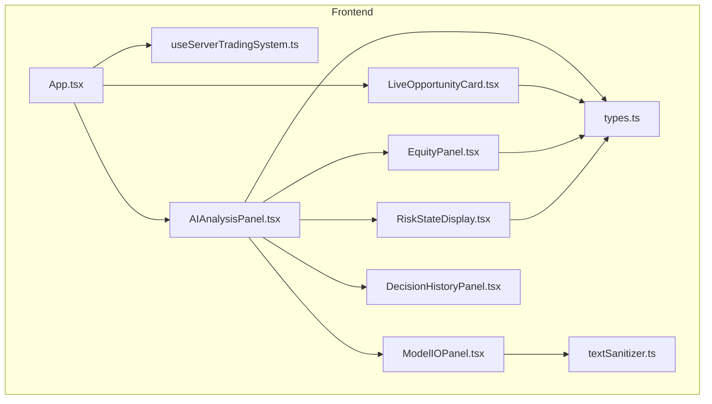
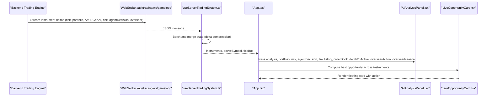
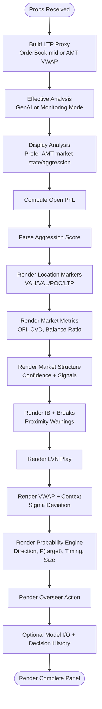
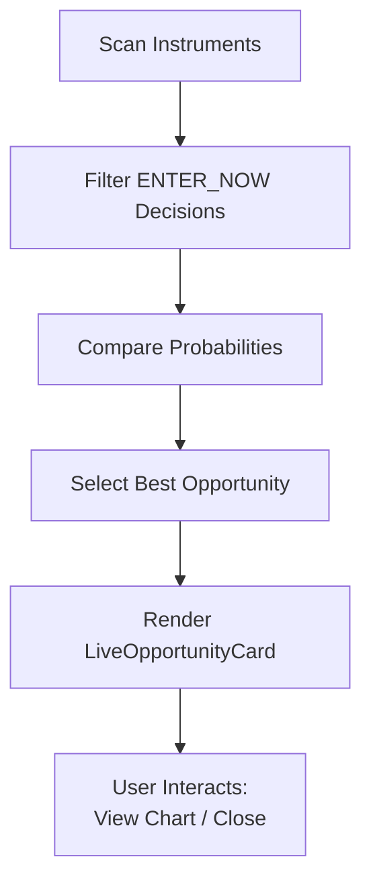
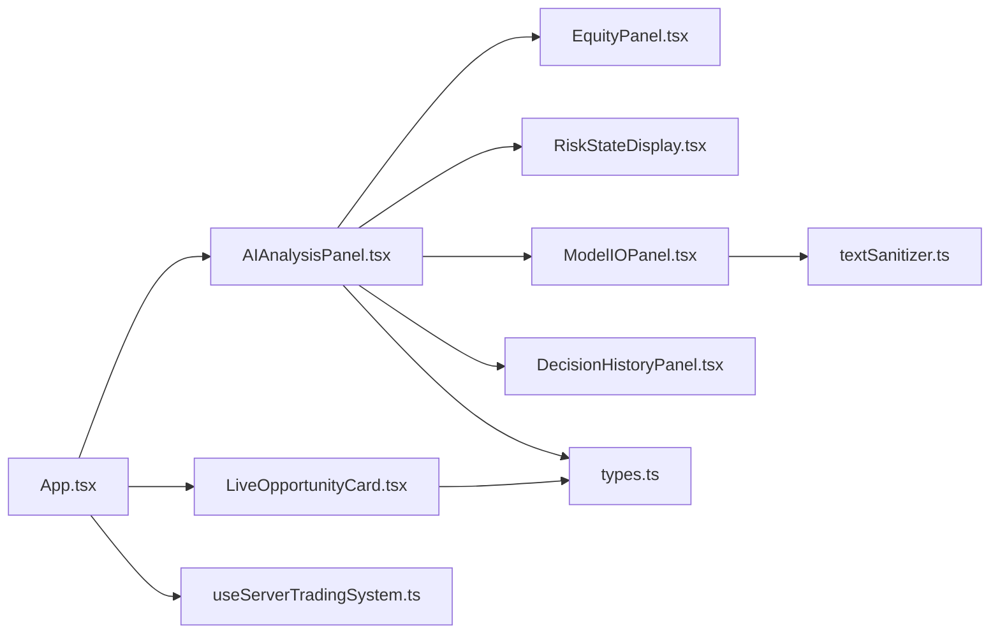

# AI Analysis Panels

<cite>
**Referenced Files in This Document**
- [AIAnalysisPanel.tsx](file://frontend/components/AIAnalysisPanel.tsx)
- [LiveOpportunityCard.tsx](file://frontend/components/ai/LiveOpportunityCard.tsx)
- [EquityPanel.tsx](file://frontend/components/ai/EquityPanel.tsx)
- [ModelIOPanel.tsx](file://frontend/components/ai/ModelIOPanel.tsx)
- [RiskStateDisplay.tsx](file://frontend/components/ai/RiskStateDisplay.tsx)
- [DecisionHistoryPanel.tsx](file://frontend/components/ai/DecisionHistoryPanel.tsx)
- [App.tsx](file://frontend/App.tsx)
- [useServerTradingSystem.ts](file://frontend/hooks/useServerTradingSystem.ts)
- [types.ts](file://frontend/types.ts)
- [textSanitizer.ts](file://frontend/utils/textSanitizer.ts)
</cite>

## Table of Contents
1. [Introduction](#introduction)
2. [Project Structure](#project-structure)
3. [Core Components](#core-components)
4. [Architecture Overview](#architecture-overview)
5. [Detailed Component Analysis](#detailed-component-analysis)
6. [Dependency Analysis](#dependency-analysis)
7. [Performance Considerations](#performance-considerations)
8. [Troubleshooting Guide](#troubleshooting-guide)
9. [Conclusion](#conclusion)
10. [Appendices](#appendices)

## Introduction
This document explains the AI analysis panel ecosystem that powers intelligent trading insights in the frontend. It covers five primary components:
- AIAnalysisPanel: The central dashboard for AI-driven market insights, opportunity scoring, equity tracking, and risk communication.
- LiveOpportunityCard: A floating card that highlights actionable trading opportunities across symbols.
- EquityPanel: Real-time equity and session performance visualization.
- ModelIOPanel: Debugging view of AI model inputs and outputs.
- RiskStateDisplay: Immediate risk warnings and loss streak indicators.

It documents each component’s purpose, data requirements, visual presentation, interaction patterns, styling and theming, responsive behavior, accessibility, and integration within the broader trading application.

## Project Structure
The AI analysis panels are part of the frontend application and integrate with a server-driven trading system. The panels are composed inside the main App shell and receive data via a WebSocket-based hook that batches updates for performance.

**Diagram sources**
- [App.tsx:374-386](file://frontend/App.tsx#L374-L386)
- [useServerTradingSystem.ts:641-654](file://frontend/hooks/useServerTradingSystem.ts#L641-L654)
- [AIAnalysisPanel.tsx:1-1039](file://frontend/components/AIAnalysisPanel.tsx#L1-L1039)
- [LiveOpportunityCard.tsx:1-94](file://frontend/components/ai/LiveOpportunityCard.tsx#L1-L94)
- [EquityPanel.tsx:1-78](file://frontend/components/ai/EquityPanel.tsx#L1-L78)
- [ModelIOPanel.tsx:1-36](file://frontend/components/ai/ModelIOPanel.tsx#L1-L36)
- [RiskStateDisplay.tsx:1-37](file://frontend/components/ai/RiskStateDisplay.tsx#L1-L37)
- [DecisionHistoryPanel.tsx:1-98](file://frontend/components/ai/DecisionHistoryPanel.tsx#L1-L98)
- [types.ts:1-376](file://frontend/types.ts#L1-L376)
- [textSanitizer.ts:1-51](file://frontend/utils/textSanitizer.ts#L1-L51)

**Section sources**
- [App.tsx:374-386](file://frontend/App.tsx#L374-L386)
- [useServerTradingSystem.ts:641-654](file://frontend/hooks/useServerTradingSystem.ts#L641-L654)

## Core Components
- AIAnalysisPanel: Central hub aggregating GenAIAnalysis, AMTAnalysis, Portfolio, RiskState, AgentDecision, LLM history, order book, depth settings, and overseer actions. Renders session state, location markers, aggression metrics, market structure, IB/breaks, LVN plays, VWAP context, probability engine decisions, overseer actions, and optional Model I/O and Decision History panels.
- LiveOpportunityCard: Highlights the best “ENTER_NOW” opportunity across symbols with direction, probability, estimated SL/TP, and navigation to the chart.
- EquityPanel: Displays equity, open PnL, session realized PnL, target/circuit progress bar, and partial TP booking.
- ModelIOPanel: Shows the AI prompt and raw output for debugging and transparency.
- RiskStateDisplay: Communicates trading halts and consecutive loss streaks.

**Section sources**
- [AIAnalysisPanel.tsx:7-18](file://frontend/components/AIAnalysisPanel.tsx#L7-L18)
- [LiveOpportunityCard.tsx:5-11](file://frontend/components/ai/LiveOpportunityCard.tsx#L5-L11)
- [EquityPanel.tsx:4-7](file://frontend/components/ai/EquityPanel.tsx#L4-L7)
- [ModelIOPanel.tsx:5-7](file://frontend/components/ai/ModelIOPanel.tsx#L5-L7)
- [RiskStateDisplay.tsx:5-7](file://frontend/components/ai/RiskStateDisplay.tsx#L5-L7)

## Architecture Overview
The panels are driven by a server-side trading system that streams instrument states over WebSocket. The frontend batches updates and renders UI components with minimal re-renders. The AIAnalysisPanel composes smaller panels and cards, while the LiveOpportunityCard floats independently in the overlay area.

**Diagram sources**
- [useServerTradingSystem.ts:204-498](file://frontend/hooks/useServerTradingSystem.ts#L204-L498)
- [App.tsx:374-386](file://frontend/App.tsx#L374-L386)
- [AIAnalysisPanel.tsx:20-50](file://frontend/components/AIAnalysisPanel.tsx#L20-L50)
- [LiveOpportunityCard.tsx:13-31](file://frontend/components/ai/LiveOpportunityCard.tsx#L13-L31)

## Detailed Component Analysis

### AIAnalysisPanel
Purpose:
- Aggregate and present AI-driven insights, market structure, opportunity scoring, equity, and risk state in a single, scrollable dashboard.

Key responsibilities:
- Construct a “monitoring mode” analysis from AMT when GenAI is unavailable.
- Prefer AMT-derived market state and aggression over stale LLM values.
- Compute derived metrics (LTP proxy, open PnL, balance ratio, sigma deviation).
- Render session state, location markers, aggression metrics, market structure, IB/breaks, LVN plays, VWAP context, probability engine, overseer actions, and optional Model I/O and Decision History panels.

Data requirements:
- GenAIAnalysis (direction, rationale, confidence, marketState, aggression, rawOutput, inputPrompt)
- AMTAnalysis (sessionVwap, valueAreaHigh/Low, poc, profile shape, balanceRatio, OFI/CVD, structure, IB, prior levels, breaks, POC migration, LVN play, llmThinking)
- Portfolio (positions, closedTrades, equity, leverage)
- RiskState (halted, haltReason, consecutiveLosses, dailyPnl)
- AgentDecision (direction, probability, timing, sizeFraction, rationale)
- LLMHistory (entries for decision history)
- OrderBook (for LTP proxy and spread)
- depth20Active flag
- overseerAction and overseerReason

Visual presentation:
- Sticky header with engine status, target/circuit progress bar, EquityPanel, RiskStateDisplay, and LLM timeout banner.
- Sections for Session & Leg, Location, Volume Aggression, Market Metrics, Market Structure, IB + Breaks, LVN Play, VWAP + Context, Probability Engine, Overseer, and optional Model I/O and Decision History.

Interaction patterns:
- Uses memoization to avoid unnecessary re-computations.
- Renders fallback states when data is initializing or missing.
- Integrates with DecisionHistoryPanel and ModelIOPanel conditionally.

Real-time updates:
- Receives deltas from the server via the hook; updates are batched and merged efficiently.

Accessibility and responsiveness:
- Uses semantic labels, monospace digits for financial data, and clear color-coded signals.
- Responsive layout adapts to sidebar toggles and overlay positioning.

**Section sources**
- [AIAnalysisPanel.tsx:20-50](file://frontend/components/AIAnalysisPanel.tsx#L20-L50)
- [AIAnalysisPanel.tsx:62-71](file://frontend/components/AIAnalysisPanel.tsx#L62-L71)
- [AIAnalysisPanel.tsx:86-104](file://frontend/components/AIAnalysisPanel.tsx#L86-L104)
- [AIAnalysisPanel.tsx:170-185](file://frontend/components/AIAnalysisPanel.tsx#L170-L185)
- [AIAnalysisPanel.tsx:187-705](file://frontend/components/AIAnalysisPanel.tsx#L187-L705)
- [AIAnalysisPanel.tsx:707-771](file://frontend/components/AIAnalysisPanel.tsx#L707-L771)
- [AIAnalysisPanel.tsx:773-801](file://frontend/components/AIAnalysisPanel.tsx#L773-L801)

#### AIAnalysisPanel Data Flow

**Diagram sources**
- [AIAnalysisPanel.tsx:25-33](file://frontend/components/AIAnalysisPanel.tsx#L25-L33)
- [AIAnalysisPanel.tsx:38-50](file://frontend/components/AIAnalysisPanel.tsx#L38-L50)
- [AIAnalysisPanel.tsx:53-59](file://frontend/components/AIAnalysisPanel.tsx#L53-L59)
- [AIAnalysisPanel.tsx:218-264](file://frontend/components/AIAnalysisPanel.tsx#L218-L264)
- [AIAnalysisPanel.tsx:300-422](file://frontend/components/AIAnalysisPanel.tsx#L300-L422)
- [AIAnalysisPanel.tsx:424-483](file://frontend/components/AIAnalysisPanel.tsx#L424-L483)
- [AIAnalysisPanel.tsx:485-561](file://frontend/components/AIAnalysisPanel.tsx#L485-L561)
- [AIAnalysisPanel.tsx:564-588](file://frontend/components/AIAnalysisPanel.tsx#L564-L588)
- [AIAnalysisPanel.tsx:591-705](file://frontend/components/AIAnalysisPanel.tsx#L591-L705)
- [AIAnalysisPanel.tsx:707-771](file://frontend/components/AIAnalysisPanel.tsx#L707-L771)
- [AIAnalysisPanel.tsx:773-801](file://frontend/components/AIAnalysisPanel.tsx#L773-L801)

### LiveOpportunityCard
Purpose:
- Highlight the best “ENTER_NOW” opportunity across all scanned instruments with direction, probability, and estimated SL/TP.

Data requirements:
- symbol, agentDecision (direction, probability, timing), ltp.

Visual presentation:
- Displays symbol, LTP, direction badge, probability, estimated SL/TP, and a button to navigate to the chart.

Interaction patterns:
- onSelect triggers symbol change and hides controls.
- onClose hides the floating card.

Real-time updates:
- Recomputed whenever instruments change; best opportunity is derived from the active instruments map.

Accessibility and responsiveness:
- Uses clear color coding (green/red badges), monospace digits, and hover states.

**Section sources**
- [LiveOpportunityCard.tsx:13-31](file://frontend/components/ai/LiveOpportunityCard.tsx#L13-L31)
- [LiveOpportunityCard.tsx:33-93](file://frontend/components/ai/LiveOpportunityCard.tsx#L33-L93)
- [App.tsx:82-94](file://frontend/App.tsx#L82-L94)

#### Live Opportunity Selection Flow

**Diagram sources**
- [App.tsx:82-94](file://frontend/App.tsx#L82-L94)
- [LiveOpportunityCard.tsx:13-31](file://frontend/components/ai/LiveOpportunityCard.tsx#L13-L31)

### EquityPanel
Purpose:
- Visualize portfolio equity, open PnL, session realized PnL, and partial TP booking.

Data requirements:
- Portfolio (positions, closedTrades, equity, leverage).

Visual presentation:
- Equity and open PnL rows.
- Target vs circuit progress bar with zero line marker.
- Session realized PnL with directional coloring.
- Partial TP booking indicator when applicable.

Real-time updates:
- Recomputed from portfolio positions and closed trades.

Accessibility and responsiveness:
- Monospace fonts for financial figures, directional color coding, and compact layout.

**Section sources**
- [EquityPanel.tsx:10-73](file://frontend/components/ai/EquityPanel.tsx#L10-L73)
- [types.ts:107-114](file://frontend/types.ts#L107-L114)

### ModelIOPanel
Purpose:
- Provide transparency into AI model inputs and outputs for debugging and auditing.

Data requirements:
- GenAIAnalysis (inputPrompt, rawOutput).

Visual presentation:
- Two-column display: Prompt → Model and Model → Output.
- Sanitized text rendering for clean display.

Real-time updates:
- Updates when GenAIAnalysis changes.

Accessibility and responsiveness:
- Scrollable container for long outputs, monospace typography.

**Section sources**
- [ModelIOPanel.tsx:10-31](file://frontend/components/ai/ModelIOPanel.tsx#L10-L31)
- [textSanitizer.ts:17-32](file://frontend/utils/textSanitizer.ts#L17-L32)

### RiskStateDisplay
Purpose:
- Communicate trading halts and consecutive loss streaks to the operator.

Data requirements:
- RiskState (halted, haltReason, consecutiveLosses, dailyPnl).

Visual presentation:
- Halt banner with icon and reason when halted.
- Consecutive loss counter and daily PnL otherwise.

Real-time updates:
- Updates when RiskState changes.

Accessibility and responsiveness:
- Minimalist design with clear color cues.

**Section sources**
- [RiskStateDisplay.tsx:10-31](file://frontend/components/ai/RiskStateDisplay.tsx#L10-L31)
- [types.ts:66-73](file://frontend/types.ts#L66-L73)

### DecisionHistoryPanel
Purpose:
- Maintain an expandable timeline of past LLM decisions with timestamps and rationale.

Data requirements:
- LLMHistoryEntry[] (timestamp, direction, confidence, rationale, inputPrompt, rawOutput).

Visual presentation:
- Vertical timeline with colored dots and rationale blocks.
- Error detection for recent failures; optional export placeholder.

Real-time updates:
- Appends new entries and maintains a rolling window.

Accessibility and responsiveness:
- Scrollable container with clear timestamps and concise rationale summaries.

**Section sources**
- [DecisionHistoryPanel.tsx:11-93](file://frontend/components/ai/DecisionHistoryPanel.tsx#L11-L93)
- [types.ts:75-82](file://frontend/types.ts#L75-L82)

## Dependency Analysis
- AIAnalysisPanel depends on:
  - EquityPanel, RiskStateDisplay, ModelIOPanel, DecisionHistoryPanel for sub-components.
  - types.ts for data contracts (GenAIAnalysis, AMTAnalysis, Portfolio, RiskState, AgentDecision, LLMHistoryEntry).
  - textSanitizer.ts for safe rendering of LLM outputs.
- LiveOpportunityCard depends on:
  - types.ts for AgentDecision and symbol.
- App integrates:
  - useServerTradingSystem.ts for data flow and symbol selection.
  - AIAnalysisPanel and LiveOpportunityCard into the overlay UI.

**Diagram sources**
- [AIAnalysisPanel.tsx:4-5](file://frontend/components/AIAnalysisPanel.tsx#L4-L5)
- [EquityPanel.tsx:1-2](file://frontend/components/ai/EquityPanel.tsx#L1-L2)
- [RiskStateDisplay.tsx:1-3](file://frontend/components/ai/RiskStateDisplay.tsx#L1-L3)
- [ModelIOPanel.tsx:2-3](file://frontend/components/ai/ModelIOPanel.tsx#L2-L3)
- [DecisionHistoryPanel.tsx:2-4](file://frontend/components/ai/DecisionHistoryPanel.tsx#L2-L4)
- [LiveOpportunityCard.tsx:2-3](file://frontend/components/ai/LiveOpportunityCard.tsx#L2-L3)
- [App.tsx:4-5](file://frontend/App.tsx#L4-L5)
- [useServerTradingSystem.ts:11](file://frontend/hooks/useServerTradingSystem.ts#L11)

**Section sources**
- [AIAnalysisPanel.tsx:4-5](file://frontend/components/AIAnalysisPanel.tsx#L4-L5)
- [App.tsx:374-386](file://frontend/App.tsx#L374-L386)
- [useServerTradingSystem.ts:641-654](file://frontend/hooks/useServerTradingSystem.ts#L641-L654)

## Performance Considerations
- Delta compression and batching: The hook merges incoming WebSocket messages and batches React updates to minimize re-renders during high-frequency updates.
- Memoization: AIAnalysisPanel uses useMemo for derived values (LTP proxy, open PnL, aggression score) to avoid recomputation on unrelated prop changes.
- Conditional rendering: Optional panels (Model I/O, Decision History) are rendered only when data is available.
- Lightweight DOM: Panels use simple containers and minimal DOM nesting to keep rendering efficient.

[No sources needed since this section provides general guidance]

## Troubleshooting Guide
Common issues and remedies:
- No data displayed initially:
  - AIAnalysisPanel shows an initializing state when both GenAI and AMT are missing. Wait for backend to stream data.
- Stale GenAI signals:
  - AIAnalysisPanel falls back to monitoring mode using AMT data. Expect “Monitoring market state…” until GenAI responds.
- LLM timeout banner:
  - When GenAI is unavailable, a warning banner indicates “Running on Quant Logic Only.”
- Risk halt:
  - RiskStateDisplay shows a red banner with halt reason when trading is halted.
- Decision history errors:
  - DecisionHistoryPanel detects 3+ recent errors and displays a warning banner indicating potential stale decisions.
- Sanitization artifacts:
  - ModelIOPanel uses textSanitizer to remove escape sequences and JSON wrappers for clean display.

**Section sources**
- [AIAnalysisPanel.tsx:86-104](file://frontend/components/AIAnalysisPanel.tsx#L86-L104)
- [AIAnalysisPanel.tsx:177-184](file://frontend/components/AIAnalysisPanel.tsx#L177-L184)
- [RiskStateDisplay.tsx:15-23](file://frontend/components/ai/RiskStateDisplay.tsx#L15-L23)
- [DecisionHistoryPanel.tsx:14-24](file://frontend/components/ai/DecisionHistoryPanel.tsx#L14-L24)
- [ModelIOPanel.tsx:23-27](file://frontend/components/ai/ModelIOPanel.tsx#L23-L27)
- [textSanitizer.ts:17-32](file://frontend/utils/textSanitizer.ts#L17-L32)

## Conclusion
The AI analysis panels form a cohesive, real-time intelligence layer that surfaces market structure, opportunity scoring, equity, and risk state. They are designed for performance, clarity, and safety, with robust fallbacks and sanitization. Integration with the server-driven trading system ensures timely updates and minimal frontend overhead.

[No sources needed since this section summarizes without analyzing specific files]

## Appendices

### Component Styling, Theming, and Accessibility
- Theming:
  - Dark theme with glassmorphism overlays, subtle borders, and gradient accents.
  - Color-coded signals: green for bullish, red for bearish, amber/yellow for caution.
- Responsiveness:
  - Panels adapt to sidebar toggles and overlay positioning; scrollable containers for long content.
- Accessibility:
  - Semantic labels, monospace digits for financial data, clear contrast, and hover/focus states.
  - Optional error banners and warnings are visually prominent.

[No sources needed since this section provides general guidance]

### Example Integration Patterns
- Embedding AIAnalysisPanel:
  - Passed instrument props from App to AIAnalysisPanel for rendering.
- LiveOpportunityCard integration:
  - Computed best opportunity across instruments and rendered as a floating overlay.
- Data formatting:
  - Sanitized LLM rationale and outputs for display.
- Real-time updates:
  - WebSocket deltas merged and batched by the hook; panels re-render only when relevant data changes.

**Section sources**
- [App.tsx:374-386](file://frontend/App.tsx#L374-L386)
- [App.tsx:82-94](file://frontend/App.tsx#L82-L94)
- [useServerTradingSystem.ts:326-397](file://frontend/hooks/useServerTradingSystem.ts#L326-L397)
- [textSanitizer.ts:17-50](file://frontend/utils/textSanitizer.ts#L17-L50)