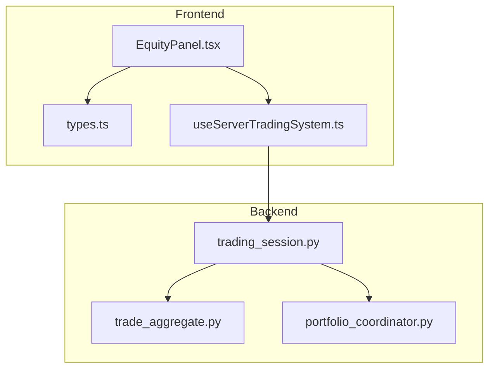
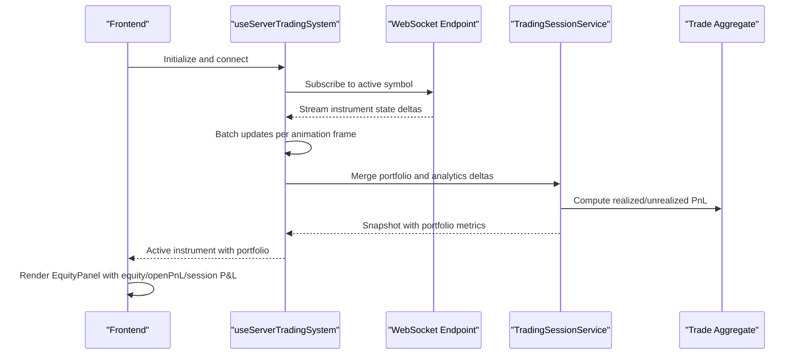
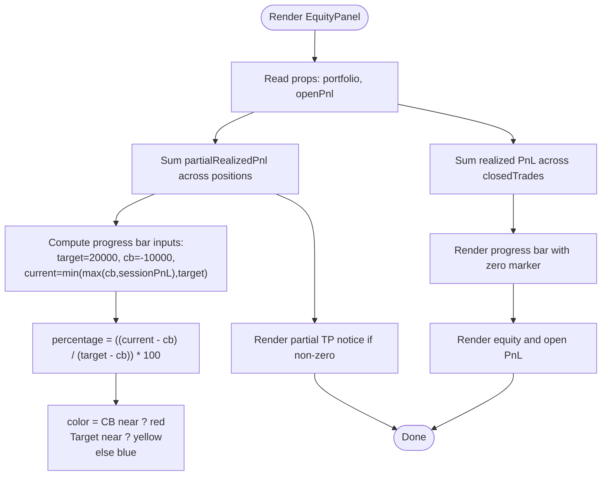
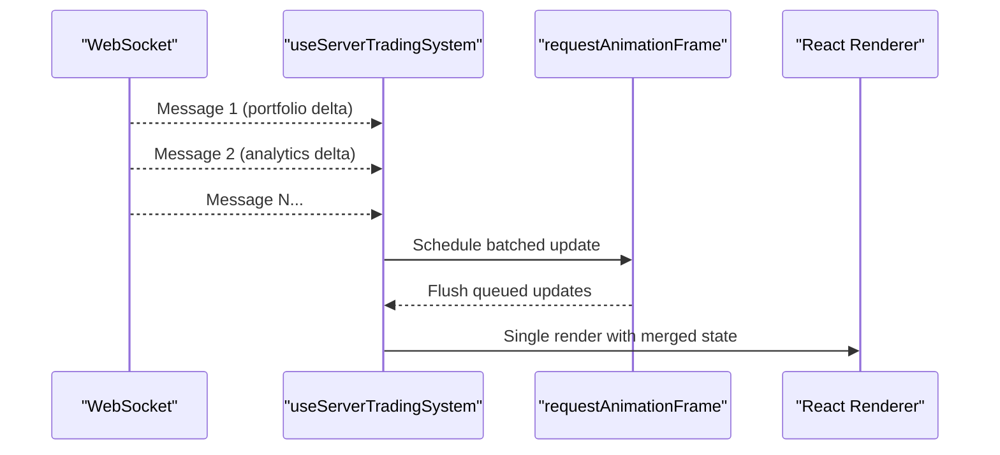
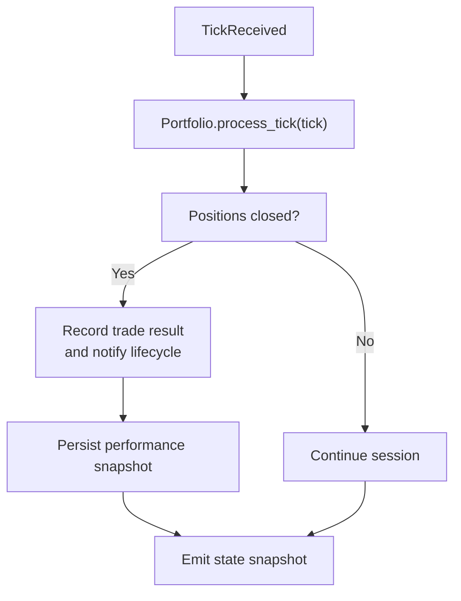
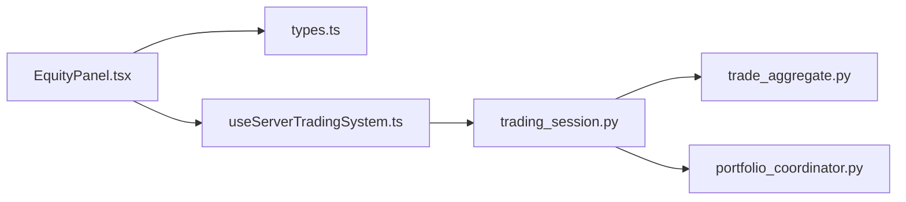

# Equity Panel

<cite>
**Referenced Files in This Document**
- [EquityPanel.tsx](file://frontend/components/ai/EquityPanel.tsx)
- [types.ts](file://frontend/types.ts)
- [useServerTradingSystem.ts](file://frontend/hooks/useServerTradingSystem.ts)
- [portfolio_coordinator.py](file://backend/app/application/services/portfolio_coordinator.py)
- [trade_aggregate.py](file://backend/app/domain/trading/models/trade_aggregate.py)
- [trading_session.py](file://backend/app/application/services/trading_session.py)
</cite>

## Table of Contents
1. [Introduction](#introduction)
2. [Project Structure](#project-structure)
3. [Core Components](#core-components)
4. [Architecture Overview](#architecture-overview)
5. [Detailed Component Analysis](#detailed-component-analysis)
6. [Dependency Analysis](#dependency-analysis)
7. [Performance Considerations](#performance-considerations)
8. [Troubleshooting Guide](#troubleshooting-guide)
9. [Conclusion](#conclusion)

## Introduction
The Equity Panel is a front-end component responsible for displaying portfolio performance and financial metrics in real time. It presents:
- Total equity
- Open PnL for currently held positions
- Session realized PnL with progress visualization against daily targets and circuit breaker thresholds
- Partial take-profit (partial TP) realized PnL from open positions
- Leverage and exposure context via the portfolio model

It integrates with the server-driven trading system to receive live portfolio updates via WebSocket, aggregates per-position PnL, and renders performance indicators with color-coded and contextual feedback to support risk-aware trading decisions.

## Project Structure
The Equity Panel lives in the front-end under the AI components and relies on shared types and a server hook for real-time data. The backend contributes portfolio state and PnL computation through the trading session and domain models.

**Diagram sources**
- [EquityPanel.tsx:1-78](file://frontend/components/ai/EquityPanel.tsx#L1-L78)
- [types.ts:107-114](file://frontend/types.ts#L107-L114)
- [useServerTradingSystem.ts:626-654](file://frontend/hooks/useServerTradingSystem.ts#L626-L654)
- [trading_session.py:328-417](file://backend/app/application/services/trading_session.py#L328-L417)
- [trade_aggregate.py:417-491](file://backend/app/domain/trading/models/trade_aggregate.py#L417-L491)
- [portfolio_coordinator.py:22-44](file://backend/app/application/services/portfolio_coordinator.py#L22-L44)

**Section sources**
- [EquityPanel.tsx:1-78](file://frontend/components/ai/EquityPanel.tsx#L1-L78)
- [types.ts:107-114](file://frontend/types.ts#L107-L114)
- [useServerTradingSystem.ts:626-654](file://frontend/hooks/useServerTradingSystem.ts#L626-L654)
- [trading_session.py:328-417](file://backend/app/application/services/trading_session.py#L328-L417)
- [trade_aggregate.py:417-491](file://backend/app/domain/trading/models/trade_aggregate.py#L417-L491)
- [portfolio_coordinator.py:22-44](file://backend/app/application/services/portfolio_coordinator.py#L22-L44)

## Core Components
- EquityPanel: Renders equity, open PnL, session realized PnL progress bar, and partial TP notices. It computes total partial realized PnL across open positions and session realized PnL from closed trades.
- Portfolio type: Defines the shape of portfolio data (balance, equity, leverage, positions, closedTrades, history) used by the panel.
- useServerTradingSystem hook: Provides the active instrument state, including portfolio, and batches WebSocket updates for performance.
- Backend TradingSessionService: Processes ticks, updates portfolio state, computes realized and unrealized PnL, and emits snapshots consumed by the front-end.
- Trade aggregate: Implements realized and unrealized PnL calculations for individual trades and positions, enabling accurate portfolio aggregation.

Key responsibilities:
- Data aggregation: Sum realized PnL from closed trades and compute partial realized PnL from open positions.
- Visualization: Progress bar with target/circuit-breaker thresholds and color-coded segments.
- Real-time updates: React.memo-based rendering and batched updates to minimize re-renders.

**Section sources**
- [EquityPanel.tsx:9-78](file://frontend/components/ai/EquityPanel.tsx#L9-L78)
- [types.ts:107-114](file://frontend/types.ts#L107-L114)
- [useServerTradingSystem.ts:84-101](file://frontend/hooks/useServerTradingSystem.ts#L84-L101)
- [trading_session.py:328-417](file://backend/app/application/services/trading_session.py#L328-L417)
- [trade_aggregate.py:417-491](file://backend/app/domain/trading/models/trade_aggregate.py#L417-L491)

## Architecture Overview
The Equity Panel participates in a server-driven architecture:
- Front-end subscribes to a WebSocket endpoint and receives instrument states.
- Backend processes market data, executes trading logic, and computes portfolio metrics.
- Front-end renders the Equity Panel with minimal logic, relying on backend-provided portfolio snapshots.

**Diagram sources**
- [useServerTradingSystem.ts:509-570](file://frontend/hooks/useServerTradingSystem.ts#L509-L570)
- [useServerTradingSystem.ts:204-498](file://frontend/hooks/useServerTradingSystem.ts#L204-L498)
- [trading_session.py:233-417](file://backend/app/application/services/trading_session.py#L233-L417)
- [trade_aggregate.py:417-491](file://backend/app/domain/trading/models/trade_aggregate.py#L417-L491)

## Detailed Component Analysis

### Equity Panel Rendering Logic
The component:
- Displays equity and open PnL with positive/negative color coding.
- Computes session realized PnL by summing closed trade PnL.
- Builds a progress bar bounded by a target and circuit breaker threshold, with a zero marker and dynamic color segment.
- Shows total partial realized PnL from open positions when applicable.

**Diagram sources**
- [EquityPanel.tsx:10-78](file://frontend/components/ai/EquityPanel.tsx#L10-L78)

**Section sources**
- [EquityPanel.tsx:10-78](file://frontend/components/ai/EquityPanel.tsx#L10-L78)

### Portfolio Data Structures and Metrics
The Portfolio type encapsulates:
- balance: Available cash
- equity: balance + unrealized PnL
- leverage: Exposure relative to margin
- positions: Open positions with optional partialRealizedPnl
- closedTrades: Closed positions with realized PnL
- history: Time series of PnL snapshots

These fields enable the Equity Panel to:
- Display equity and open PnL
- Aggregate realized PnL from closed trades
- Sum partial realized PnL from open positions

**Section sources**
- [types.ts:107-114](file://frontend/types.ts#L107-L114)
- [EquityPanel.tsx:11-14](file://frontend/components/ai/EquityPanel.tsx#L11-L14)

### Real-Time Updates and Performance
The server hook:
- Batches multiple WebSocket messages into a single React render per animation frame to reduce churn.
- Merges portfolio deltas incrementally and dispatches tick events separately for chart updates.
- Maintains a heartbeat to detect disconnections and reconnects automatically.

**Diagram sources**
- [useServerTradingSystem.ts:84-101](file://frontend/hooks/useServerTradingSystem.ts#L84-L101)
- [useServerTradingSystem.ts:204-498](file://frontend/hooks/useServerTradingSystem.ts#L204-L498)

**Section sources**
- [useServerTradingSystem.ts:84-101](file://frontend/hooks/useServerTradingSystem.ts#L84-L101)
- [useServerTradingSystem.ts:204-498](file://frontend/hooks/useServerTradingSystem.ts#L204-L498)

### Backend PnL Computation and Portfolio Updates
The backend:
- Processes ticks and updates portfolio state.
- Computes realized PnL per closed position and records trade results.
- Emits performance snapshots including equity, balance, open PnL, and open positions.
- Integrates with trade aggregates to derive realized and unrealized PnL.

**Diagram sources**
- [trading_session.py:328-417](file://backend/app/application/services/trading_session.py#L328-L417)
- [trade_aggregate.py:417-491](file://backend/app/domain/trading/models/trade_aggregate.py#L417-L491)

**Section sources**
- [trading_session.py:328-417](file://backend/app/application/services/trading_session.py#L328-L417)
- [trade_aggregate.py:417-491](file://backend/app/domain/trading/models/trade_aggregate.py#L417-L491)

### Portfolio Coordinator Integration
The portfolio coordinator is currently a stub that evaluates signals and tracks statistics. While not actively filtering signals in the current implementation, it establishes a future integration point for centralized portfolio-level decisions.

**Section sources**
- [portfolio_coordinator.py:22-44](file://backend/app/application/services/portfolio_coordinator.py#L22-L44)

## Dependency Analysis
The Equity Panel depends on:
- Portfolio type definitions for shape and semantics
- useServerTradingSystem hook for live portfolio data
- Backend TradingSessionService for computed metrics and snapshots

**Diagram sources**
- [EquityPanel.tsx:1-78](file://frontend/components/ai/EquityPanel.tsx#L1-L78)
- [types.ts:107-114](file://frontend/types.ts#L107-L114)
- [useServerTradingSystem.ts:626-654](file://frontend/hooks/useServerTradingSystem.ts#L626-L654)
- [trading_session.py:328-417](file://backend/app/application/services/trading_session.py#L328-L417)
- [trade_aggregate.py:417-491](file://backend/app/domain/trading/models/trade_aggregate.py#L417-L491)
- [portfolio_coordinator.py:22-44](file://backend/app/application/services/portfolio_coordinator.py#L22-L44)

**Section sources**
- [EquityPanel.tsx:1-78](file://frontend/components/ai/EquityPanel.tsx#L1-L78)
- [types.ts:107-114](file://frontend/types.ts#L107-L114)
- [useServerTradingSystem.ts:626-654](file://frontend/hooks/useServerTradingSystem.ts#L626-L654)
- [trading_session.py:328-417](file://backend/app/application/services/trading_session.py#L328-L417)
- [trade_aggregate.py:417-491](file://backend/app/domain/trading/models/trade_aggregate.py#L417-L491)
- [portfolio_coordinator.py:22-44](file://backend/app/application/services/portfolio_coordinator.py#L22-L44)

## Performance Considerations
- Minimize re-renders: EquityPanel is memoized and relies on batched updates from the server hook to avoid frequent renders during high-frequency updates.
- Efficient aggregation: Partial realized PnL and session realized PnL are computed via simple reductions over arrays, keeping CPU overhead low.
- Visual feedback: The progress bar uses CSS transitions and a simple percentage calculation, avoiding heavy computations.
- Back-end batching: The server merges deltas and caps history length to bound memory usage.

[No sources needed since this section provides general guidance]

## Troubleshooting Guide
Common issues and remedies:
- Equity Panel not updating:
  - Verify WebSocket connectivity and heartbeat status from the server hook.
  - Confirm that portfolio deltas are being merged and that the active symbol is set.
- Incorrect PnL values:
  - Ensure closed trades include realized PnL and open positions include partial realized PnL.
  - Validate that the backend computes realized PnL per trade and emits performance snapshots.
- Progress bar anomalies:
  - Check that target and circuit breaker thresholds are consistent and current session PnL lies within the configured bounds.
  - Confirm zero marker alignment and color segment logic.

**Section sources**
- [useServerTradingSystem.ts:509-570](file://frontend/hooks/useServerTradingSystem.ts#L509-L570)
- [useServerTradingSystem.ts:204-498](file://frontend/hooks/useServerTradingSystem.ts#L204-L498)
- [trading_session.py:328-417](file://backend/app/application/services/trading_session.py#L328-L417)
- [EquityPanel.tsx:38-61](file://frontend/components/ai/EquityPanel.tsx#L38-L61)

## Conclusion
The Equity Panel is a focused, efficient component that surfaces critical portfolio performance metrics in real time. By leveraging a server-driven architecture, it keeps presentation logic simple while delegating complex computations to the backend. Its progress visualization and color-coded indicators enhance risk awareness and support informed trading decisions. Future enhancements can integrate the portfolio coordinator for centralized decision-making and expand the panel’s metrics to include additional risk and performance KPIs.