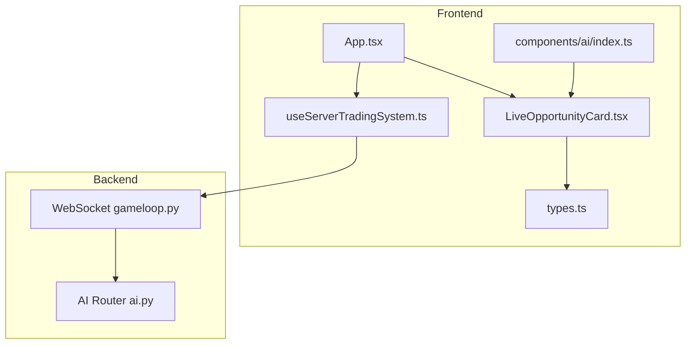
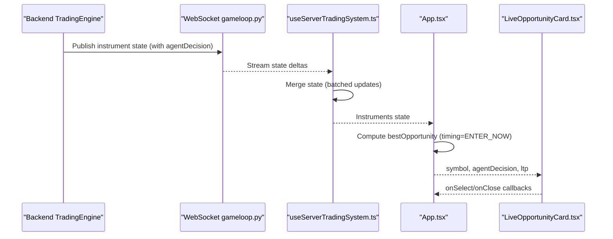
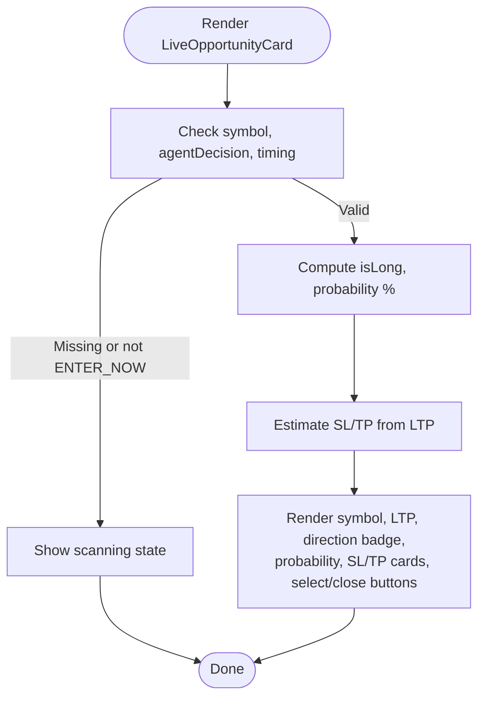
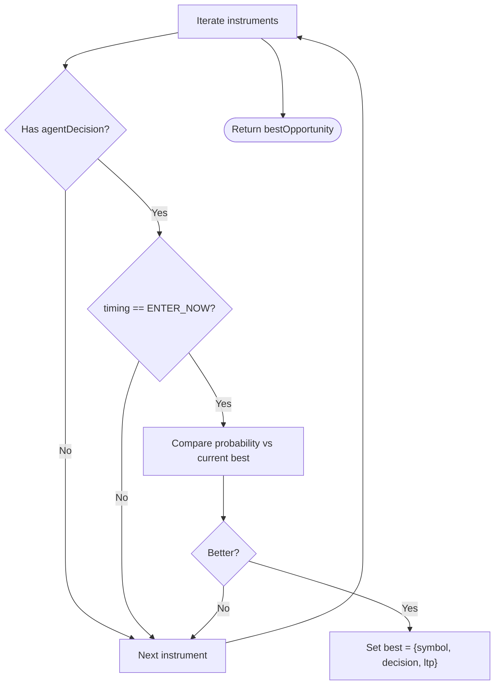
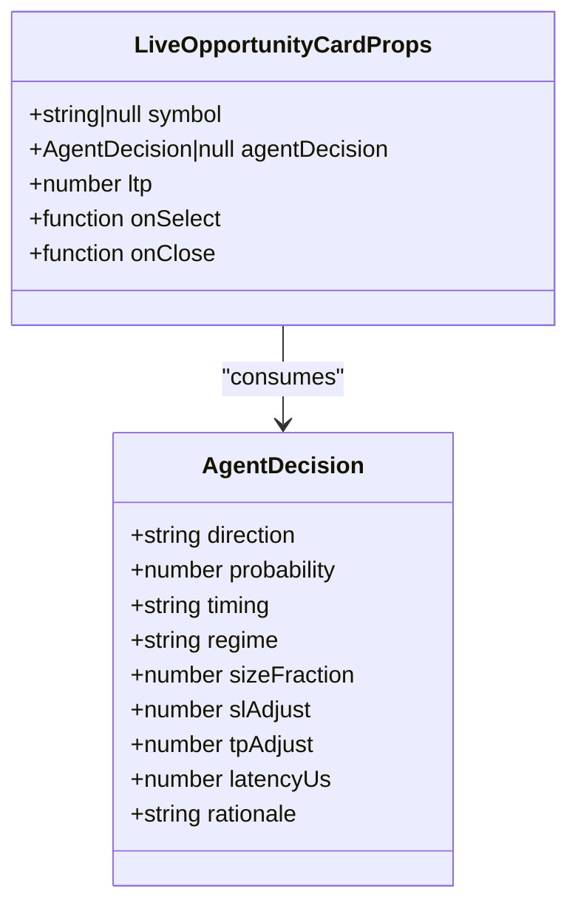
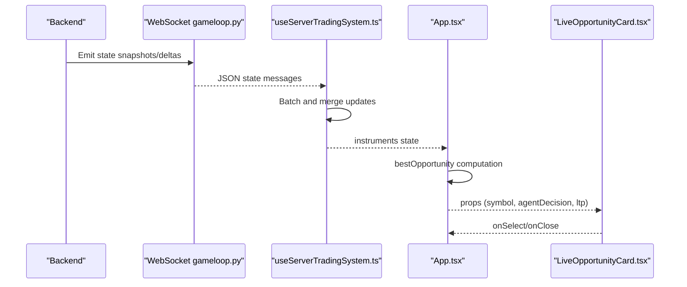
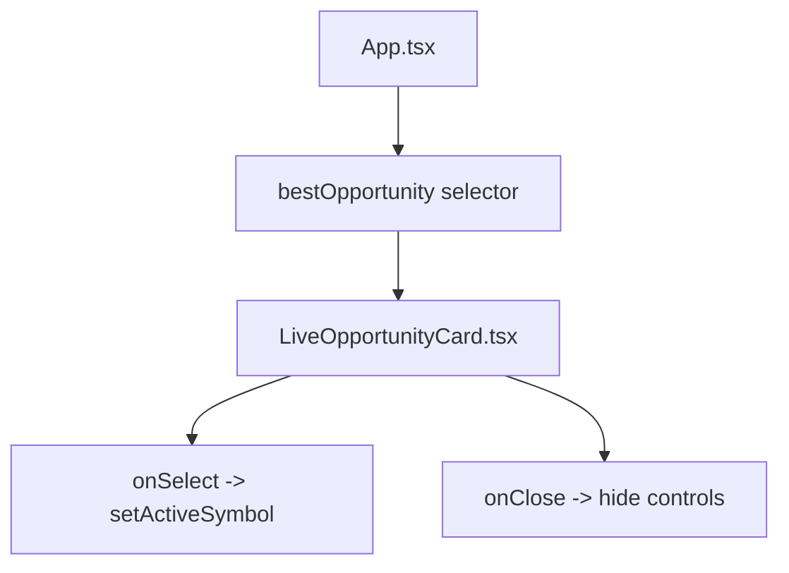
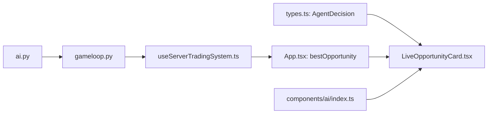

# Live Opportunity Card

<cite>
**Referenced Files in This Document**
- [LiveOpportunityCard.tsx](file://frontend/components/ai/LiveOpportunityCard.tsx)
- [App.tsx](file://frontend/App.tsx)
- [types.ts](file://frontend/types.ts)
- [useServerTradingSystem.ts](file://frontend/hooks/useServerTradingSystem.ts)
- [gameloop.py](file://backend/app/api/websocket/gameloop.py)
- [ai.py](file://backend/app/api/routers/ai.py)
- [index.ts](file://frontend/components/ai/index.ts)
</cite>

## Table of Contents
1. [Introduction](#introduction)
2. [Project Structure](#project-structure)
3. [Core Components](#core-components)
4. [Architecture Overview](#architecture-overview)
5. [Detailed Component Analysis](#detailed-component-analysis)
6. [Dependency Analysis](#dependency-analysis)
7. [Performance Considerations](#performance-considerations)
8. [Troubleshooting Guide](#troubleshooting-guide)
9. [Conclusion](#conclusion)

## Introduction
The Live Opportunity Card presents real-time trading opportunities produced by the AI system. It surfaces actionable signals with clear visual cues, probability, direction, and estimated targets derived from the agent decision. The card integrates with the main AI panel and the live trading workflow, enabling traders to quickly assess and act on high-probability entries.

## Project Structure
The Live Opportunity Card is part of the AI panel ecosystem in the frontend and is driven by real-time state streamed from the backend. The card renders only when the agent decision indicates an immediate entry opportunity.

**Diagram sources**
- [App.tsx:82-94](file://frontend/App.tsx#L82-L94)
- [LiveOpportunityCard.tsx:13-31](file://frontend/components/ai/LiveOpportunityCard.tsx#L13-L31)
- [useServerTradingSystem.ts:60-77](file://frontend/hooks/useServerTradingSystem.ts#L60-L77)
- [gameloop.py:112-196](file://backend/app/api/websocket/gameloop.py#L112-L196)
- [ai.py:15-281](file://backend/app/api/routers/ai.py#L15-L281)
- [index.ts:1-6](file://frontend/components/ai/index.ts#L1-L6)

**Section sources**
- [App.tsx:82-94](file://frontend/App.tsx#L82-L94)
- [LiveOpportunityCard.tsx:13-31](file://frontend/components/ai/LiveOpportunityCard.tsx#L13-L31)
- [useServerTradingSystem.ts:60-77](file://frontend/hooks/useServerTradingSystem.ts#L60-L77)
- [gameloop.py:112-196](file://backend/app/api/websocket/gameloop.py#L112-L196)
- [ai.py:15-281](file://backend/app/api/routers/ai.py#L15-L281)
- [index.ts:1-6](file://frontend/components/ai/index.ts#L1-L6)

## Core Components
- Live Opportunity Card: Renders the current best live opportunity with direction, probability, and estimated targets. It only displays when the agent decision indicates an immediate entry.
- App orchestration: Computes the best opportunity across instruments and passes it to the card.
- Server-driven state: The backend streams instrument states via WebSocket, including agent decisions and LTP.

Key data requirements:
- Symbol: Instrument identifier.
- AgentDecision: Direction, probability, timing, regime, rationale, and sizing guidance.
- LTP: Last traded price for context.

**Section sources**
- [LiveOpportunityCard.tsx:5-11](file://frontend/components/ai/LiveOpportunityCard.tsx#L5-L11)
- [App.tsx:82-94](file://frontend/App.tsx#L82-L94)
- [types.ts:52-64](file://frontend/types.ts#L52-L64)

## Architecture Overview
The card participates in a server-driven architecture where the backend computes agent decisions and streams instrument states. The frontend renders the card based on the most probable immediate-entry signal.

**Diagram sources**
- [gameloop.py:250-315](file://backend/app/api/websocket/gameloop.py#L250-L315)
- [useServerTradingSystem.ts:326-396](file://frontend/hooks/useServerTradingSystem.ts#L326-L396)
- [App.tsx:82-94](file://frontend/App.tsx#L82-L94)
- [LiveOpportunityCard.tsx:13-31](file://frontend/components/ai/LiveOpportunityCard.tsx#L13-L31)

## Detailed Component Analysis

### Live Opportunity Card
Purpose:
- Present actionable trading signals in real time.
- Provide quick visual assessment of direction, probability, and estimated targets.
- Enable immediate navigation to the chart for deeper analysis.

Rendering logic:
- Hidden when no symbol is present, no decision exists, or timing is not immediate entry.
- Otherwise, displays symbol, LTP, direction badge (long/short), probability percentage, and estimated SL/TP.
- Estimations are conceptual and derived from LTP with small offsets to illustrate potential targets.

Visual design elements:
- Background blur and glass-like borders.
- Left accent strip indicating live status.
- Direction badge with color coding (green for long, red for short).
- Probability display with color thresholds.
- Estimated SL/TP cards with monospaced values.
- Animated icon for live status.

User interactions:
- Close button to dismiss the card.
- Select button to navigate to the chart for the symbol.

**Diagram sources**
- [LiveOpportunityCard.tsx:13-31](file://frontend/components/ai/LiveOpportunityCard.tsx#L13-L31)
- [LiveOpportunityCard.tsx:33-40](file://frontend/components/ai/LiveOpportunityCard.tsx#L33-L40)
- [LiveOpportunityCard.tsx:41-92](file://frontend/components/ai/LiveOpportunityCard.tsx#L41-L92)

**Section sources**
- [LiveOpportunityCard.tsx:13-31](file://frontend/components/ai/LiveOpportunityCard.tsx#L13-L31)
- [LiveOpportunityCard.tsx:33-40](file://frontend/components/ai/LiveOpportunityCard.tsx#L33-L40)
- [LiveOpportunityCard.tsx:41-92](file://frontend/components/ai/LiveOpportunityCard.tsx#L41-L92)

### Best Opportunity Computation
The App identifies the best live opportunity by scanning all instruments and selecting the highest probability decision with immediate entry timing.

**Diagram sources**
- [App.tsx:82-94](file://frontend/App.tsx#L82-L94)

**Section sources**
- [App.tsx:82-94](file://frontend/App.tsx#L82-L94)

### Data Requirements and Schema
The card consumes:
- symbol: string | null
- agentDecision: AgentDecision | null
- ltp: number

AgentDecision fields used:
- direction: LONG | SHORT | FLAT
- probability: number (0..1)
- timing: string (filter: ENTER_NOW)
- regime: string
- rationale: string
- sizeFraction: number
- slAdjust: number
- tpAdjust: number
- latencyUs: number

**Diagram sources**
- [types.ts:52-64](file://frontend/types.ts#L52-L64)
- [LiveOpportunityCard.tsx:5-11](file://frontend/components/ai/LiveOpportunityCard.tsx#L5-L11)

**Section sources**
- [types.ts:52-64](file://frontend/types.ts#L52-L64)
- [LiveOpportunityCard.tsx:5-11](file://frontend/components/ai/LiveOpportunityCard.tsx#L5-L11)

### Real-Time Data Pipeline
The backend streams instrument states via WebSocket. The frontend merges deltas and exposes instruments to the App, which selects the best opportunity and passes it to the card.

**Diagram sources**
- [gameloop.py:250-315](file://backend/app/api/websocket/gameloop.py#L250-L315)
- [useServerTradingSystem.ts:326-396](file://frontend/hooks/useServerTradingSystem.ts#L326-L396)
- [App.tsx:82-94](file://frontend/App.tsx#L82-L94)
- [LiveOpportunityCard.tsx:13-31](file://frontend/components/ai/LiveOpportunityCard.tsx#L13-L31)

**Section sources**
- [gameloop.py:250-315](file://backend/app/api/websocket/gameloop.py#L250-L315)
- [useServerTradingSystem.ts:326-396](file://frontend/hooks/useServerTradingSystem.ts#L326-L396)
- [App.tsx:82-94](file://frontend/App.tsx#L82-L94)
- [LiveOpportunityCard.tsx:13-31](file://frontend/components/ai/LiveOpportunityCard.tsx#L13-L31)

### Integration with Main AI Panel
The card is positioned in the bottom-right corner of the main trading view and is controlled by the same state that manages the AI panels. It appears conditionally based on the presence of a valid, immediate-entry decision.

**Diagram sources**
- [App.tsx:82-94](file://frontend/App.tsx#L82-L94)
- [App.tsx:327-337](file://frontend/App.tsx#L327-L337)
- [LiveOpportunityCard.tsx:85-90](file://frontend/components/ai/LiveOpportunityCard.tsx#L85-L90)

**Section sources**
- [App.tsx:82-94](file://frontend/App.tsx#L82-L94)
- [App.tsx:327-337](file://frontend/App.tsx#L327-L337)
- [LiveOpportunityCard.tsx:85-90](file://frontend/components/ai/LiveOpportunityCard.tsx#L85-L90)

## Dependency Analysis
- LiveOpportunityCard depends on AgentDecision shape and Lucide icons.
- App orchestrates the card by computing the best opportunity and passing props.
- useServerTradingSystem provides instruments state and WebSocket connectivity.
- Backend WebSocket router streams instrument states to the frontend.

**Diagram sources**
- [types.ts:52-64](file://frontend/types.ts#L52-L64)
- [LiveOpportunityCard.tsx:1-3](file://frontend/components/ai/LiveOpportunityCard.tsx#L1-L3)
- [App.tsx:82-94](file://frontend/App.tsx#L82-L94)
- [useServerTradingSystem.ts:60-77](file://frontend/hooks/useServerTradingSystem.ts#L60-L77)
- [gameloop.py:112-196](file://backend/app/api/websocket/gameloop.py#L112-L196)
- [ai.py:15-281](file://backend/app/api/routers/ai.py#L15-L281)
- [index.ts:1-6](file://frontend/components/ai/index.ts#L1-L6)

**Section sources**
- [types.ts:52-64](file://frontend/types.ts#L52-L64)
- [LiveOpportunityCard.tsx:1-3](file://frontend/components/ai/LiveOpportunityCard.tsx#L1-L3)
- [App.tsx:82-94](file://frontend/App.tsx#L82-L94)
- [useServerTradingSystem.ts:60-77](file://frontend/hooks/useServerTradingSystem.ts#L60-L77)
- [gameloop.py:112-196](file://backend/app/api/websocket/gameloop.py#L112-L196)
- [ai.py:15-281](file://backend/app/api/routers/ai.py#L15-L281)
- [index.ts:1-6](file://frontend/components/ai/index.ts#L1-L6)

## Performance Considerations
- The frontend batches state updates to minimize render churn during frequent backend updates.
- WebSocket delta compression reduces payload sizes and improves responsiveness.
- The card only renders when a valid immediate-entry decision exists, avoiding unnecessary DOM work.

[No sources needed since this section provides general guidance]

## Troubleshooting Guide
Common issues and resolutions:
- Card not appearing:
  - Ensure agentDecision.timing equals the expected immediate entry value.
  - Verify symbol is set and LTP is available.
- Stale or missing probabilities:
  - Confirm the backend is streaming agentDecision and that the frontend is merging deltas.
- Connection problems:
  - Check WebSocket connectivity and heartbeat behavior in the hook.

**Section sources**
- [LiveOpportunityCard.tsx:14-31](file://frontend/components/ai/LiveOpportunityCard.tsx#L14-L31)
- [useServerTradingSystem.ts:509-570](file://frontend/hooks/useServerTradingSystem.ts#L509-L570)
- [gameloop.py:250-315](file://backend/app/api/websocket/gameloop.py#L250-L315)

## Conclusion
The Live Opportunity Card is a focused, real-time UI element that highlights the best immediate-entry opportunity derived from the AI system. It leverages a server-driven architecture to remain responsive and accurate, integrating seamlessly with the broader AI panel and trading workflow.